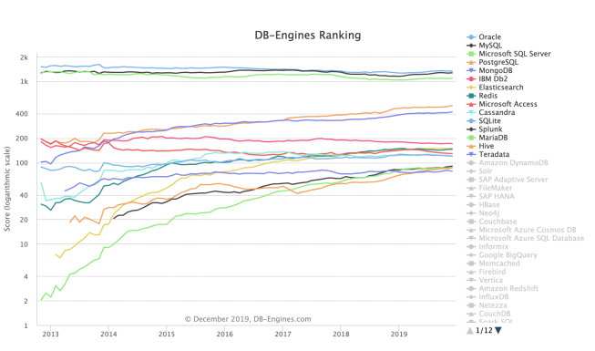
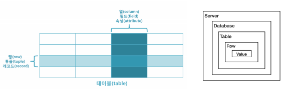
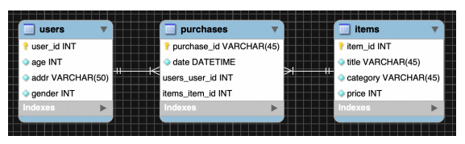
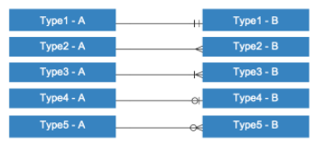
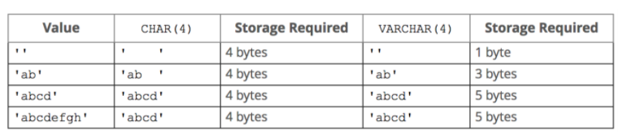
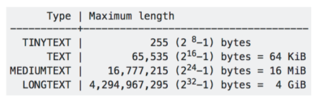

## DATABASE

<details open>
<summary>day01</summary>
<div markdown="1">

[참고](https://drive.google.com/drive/u/0/folders/1jE2lwFiTaRMlLrOp-sw9qMiqYKKZVSrB)

### DB(Database)

- 여러 사람에 의해 공유되어 사용될 목적으로 통합하여 관리되는 데이터의 집합

### DBMS(Database Management System)

- 데이터베이스를 관리하는 미들웨어 시스템, 데이터베이스 관리 시스템
- 사용자와 DB 사이에서 사용자의 요구에 따라 데이터를 생성해주고 DB를 관리해주는 소프트웨어
- 모든 응용프로그램이 데이터베이스를 공용할 수 있도록 관리
- 데이터베이스의 구성, 접근 방법, 유지 관리에 대한 모든 책임
- 데이터에 대한 많은 보안을 제공하지 않으며 정규화를 수행할 수 없어 데이터는 높은 중복성을 가질 수도 있다.

### RDB(Relational Database)

- 관계형 데이터 모델에 기초를 둔 데이터베이스
- 모든 데이터를 2차원 테이블의 형태로 표현한다.

### RDBMS(Relational Database Management System)

- RDB를 생성하고 수정하고 관리할 수 있는 소프트웨어이다.
- 관계형 모델을 기반으로 하는 DBMS 유형이다.
- RDBMS의 테이블은 서로 연관되어 있어 일반 DBMS보다 효율적으로 데이터를 저장, 구성, 관리할 수 있다.
- RDBMS는 DBMS의 한 유형이다.
- 데이터의 테이블 사이에 키값으로 관계를 맺고 있는 데이터베이스
- 정규화를 통해 데이터의 중복성을 최소화하여 트랜잭션을 수행하기가 더 쉽다.
- MSSQL, MySQL, Oracle 등이 있다.

### 트랜잭션(Transaction)

- 데이터베이스 상태를 변환시키는 하나의 논리적인 기능을 수행하기 위한 작업의 단위 또는 한꺼번에 모두 수행되어야 할 일련의 연산들을 의미한다.
- 즉, 인터페이스 내에서 한꺼번에 수행되어야 할 연산들의 집합을 의미한다.

#### 트랜잭션의 특징

1. 트랜잭션은 데이터베이스 시스템에서 병행제어 및 회복작업 시 처리되는 작업의 논리적 단위이다.
2. 사용자가 시스템에 대한 서비스 요구 시 시스템이 응답하기 위한 상태 변환 과정의 작업단위이다.
3. 하나의 트랜잭션은 Commit되거나 Rollback된다.

### 스키마(Schema)

- 데이터베이스의 구조와 관련된 전반적인 정의
- 데이터베이스를 구성하는 개체(entity), 속성(attribute), 관계(relation), 데이터 구조와 데이터들이 갖는 제약에 관한 정의를 총칭한다.

### SQL(Structure Query Language)

- RDBMS(관계형 데이터베이스 관리 시스템)의 데이터를 관리하기 위해 설계된 특수 목적의 프로그래밍 언어
- RDBMS의 데이터를 관리하기 위해 설계된 특수 목적의 프로그래밍 언어

### NoSQL

- 데이터 테이블 사이에 관계가 없이 데이터를 저장하는 데이터베이스
- 데이터 사이의 관계가 없으므로 복잡성이 작고 많은 데이터의 저장이 가능하다.
- MongoDB, Hbase, Cassandra 등

<br />



### 관계 데이터베이스 용어

- 행: row, tuple, record
- 열: column, field, attribute

- 서버 안에는 여러 개의 DB가 있다.
- DB와 DB 사이에는 데이터를 교환할 수 없다. 즉, 관계가 없다.
- 하나의 DB에는 여러 개의 테이블을 만들 수 있다.
  <br />



### MySQL의 특징

- MySQL은 오픈소스이며 다중사용자와 다중스레드를 지원한다.
- C언어로 작성되었다.
- 다중사용자를 지원하기 때문에 여러 명이 동시에 접속해서 데이터를 가지고 올 수 있다.
- 다양한 OS에 다양한 프로그래밍 언어를 지원한다.
- 표준 SQL을 사용한다.
- 작고 강력하며 가격이 저렴하다.

### 데이터베이스 모델링

- 데이터베이스에서의 테이블 구조를 미리 계획해서 작성하는 작업
- RDBMS는 테이블이 유기적으로 연결되어 있으므로 모델링을 잘하는 것이 중요하다.
- 기본적으로 개념적 모델링, 논리적 모델링, 물리적 모델링 절차로 설계된다.

#### 개념적 모델링(conceptual schema)

- 업무를 분석해서 핵심 데이터의 집합을 정의하는 과정
  <br />


#### 논리적 모델링(logical schema)

- 개념적 모델링을 상세화하는 과정
  <br />


#### 물리적 모델링(physical schema)

- 논리적 모델링을 DBMS에 추가하기 위해 구체화 되는 과정
  <br />



### MySQL 설치 및 설정

- AWS EC2 인스턴스에 Ubuntu OS에 MySQL 5.7.x 버전 설치
- 서버에 우분투 OS를 설치한 것이다.

- EC2 인스턴스 생성

  - t2.micro
  - Ubuntu 18.04 버전
  - 보안그룹에서 3306 포트 추가

- EC2 인스턴스 접속

  - mkdir ~/.ssh
  - cd ~/.ssh
  - C:\Users\user\.ssh에 pem파일(키파일) 옮기기
  - ssh –i ~/.ssh/<키 파일명> ubuntu@<public IPv4 주소>
  - ssh -i ~/.ssh/fds18.pem ubuntu@15.164.96.190

- apt-get 업데이트(지금부터 쓰는 명령어는 우분투 OS 명령어)

  - sudo apt-get update –y
  - sudo apt-get upgradte –y

- MySQL Server 설치

  - sudo apt-get install –y mysql-server mysql-client
  - sudo systemctl status mysql 해서 active(running)이면 설치가 잘 된 것이다.
  - running 상태이면 데이터를 조회, 수정, 삭제 등을 할 수 있는 상태이다.
  - q 눌러서 다시 돌아오기

- 패스워드, 내부 접속 설정

  - sudo mysql
  - ALTER USER 'root'@'localhost' IDENTIFIED WITH mysql_native_password BY 'fds';
  - mysql –u root –p 입력 후, 패스워드 입력
  - 또는 mysql –u root –pfds 입력
  - exit으로 나가기

- 외부 접속 설정

  - sudo vi /etc/mysql/mysql.conf.d/mysqld.cnf로 vim들어가기
  - bind-address를 127.0.0.1을 0.0.0.0으로 변경
  - /bind하면 bind가 찾아짐
  - enter > w 3번 누르면 단어가 3번 건너뜀
  - shift + d => 커서 뒤에 있는 문자가 삭제됨
  - i(insert 모드로 들어가서) 0.0.0.0으로 변경
  - :wq로 저장 후 나오기

  - 외부에서 접속할 수 있는 번호를 0.0.0.0로 바꿔서 외부에서 접속할 수 있게 설정
  - 이제 워크 벤치를 통해서 외부에서도 접속할 수 있다.

- 외부 접속 패스워드 설정

  - grant all privileges on _._ to root@'%' identified by 'fds';
  - 설정 후, 재시작하기(sudo systemctl restart mysql)

- 샘플 데이터 추가
  - world, sakila 데이터베이스 추가
  - mysql –u root –pfds
  - create database world;
  - create database sakila;
  - exit
  - 아래의 링크에서 world와 sakila 데이터베이스 다운로드

[샘플 데이터](https://drive.google.com/drive/folders/1YPFTTBb4Gz1piMigjmYkAYwbydh3budV) - 워크 벤치 접속 - + 누르고, AWS에서 public IPv4 주소 복사해서 호스트네임에 넣어주기 - password에 store in vault 누르고, 패스워드 입력 - Test Connection으로 Test 해보고, OK 눌러서 서버와 연결 - use world; 입력해서 world DB에 접속 - File – Open SQL Script 눌러서 – world.spl 불러오기 - 맨 위에 번개 버튼 눌러서 모든 쿼리문 실행해서 데이터 넣기 - sakila 데이터도 위와 동일하지만, 스키마 파일부터 넣고, 데이터 파일 넣기

#### alias 설정하기

- 최상위 폴더로 이동

```
// 여기까지 이동
user@DESKTOP-TEBR1F8 MINGW64 ~
$ vim .bashrc
alias fds=“ssh -i ~/.ssh/fds18.pem ubuntu@15.164.96.190”
:wq
```

- 이제 fds만 쳐도 서버로 접속됨

#### SSH(Secure Shell Protocol)

- 네트워크 프로토콜 중 하나로 컴퓨터와 인터넷과 같은 Public Network를 통해 서로 통신할 때 보안적으로 안전하게 통신을 하기위해 사용하는 프로토콜이다.
- 대표적인 사용의 예는 다음과 같다. 1.데이터 전송 2. 원격 제어
- 데이터 전송의 예로는 원격 저장소인 깃헙이 있을 수 있다.
- 소스 코드를 원격 저장소인 깃헙에 푸시할 때, SSH를 활용해 파일을 전송한다.

- 원격제어의 예로는 AWS와 같은 클라우드 서비스를 이용할 때이다.
- AWS의 인스턴스 서버에 접속하여 해당 머신에 명령을 내리기 위해서도 SSH를 통한 접속을 해야한다.

- SSH는 먼저 보안적으로 훨씬 안전한 채널을 구성한 뒤 정보를 교환하기 때문에 보안적인 면에서 훨씬 뛰어나다.
- SSH는 다른 컴퓨터와 통신을 하기위해 접속을 할 때, 우리가 일반적으로 사용하는 비밀번호의 입력을 통한 접속을 하지 않는다.
- 기본적으로 SSH는 한 쌍의 Key를 통해 접속하려는 컴퓨터 인증 과정을 거치게 된다.
- 서로 관계 맺고 있는 Key라는 것이 증명이 되면 비로소 두 컴퓨터 사이에 암호화된 채널이 형성되어 Key를 활용해 메시지를 암호화하고 복호화하며 데이터를 주고받을 수 있게 된다.

### EER 다이어그램 생성

- MySQL Workbench 접속
- File – New Model 선택
- mydb 두 번 눌러서 이름 설정하기
- EER(Diagram) - ADD Diagram
- 테이블 추가
- 테이블 두 번 클릭해서 컬럼 추가하기
- 테이블 관계 연결하기(1:1, 1:n, n:m 등)
- File – Save Model 저장

#### 관계선 의미

- <실선>
  - 식별관계(부모가 있어야 자식이 생성됨)
  - 부모테이블의 PK가 자식테이블의 FK/PK가 되는 경우
- <점선> - 비식별관계(부모가 없어도 자식이 생성됨) - 부모테이블의 PK가 자식테이블의 일반속성이 되는 경우
  <br />



- Type1(실선과 실선): 정확히 1(하나의 A는 하나의 B로 구성되어 있다.)
- Type2(까마귀 발): 여러 개(하나의 A는 여러 개의 B로 구성되어 있다.)
- Type3(실선과 까마귀 발): 1개 이상(하나의 A는 하나 이상의 B로 구성되어 있다.)
- Type4(고리와 실선): 0 혹은 1(하나의 A는 하나 이하의 B로 구성되어 있다.)
- Type5(고리와 까마귀발): 0개 이상(하나의 A는 0 또는 하나 이상의 B로 구성되어 있다.)

#### 모델링 파일을 실제 DB에 연결하기

- File – Open Model
- Database – Forward Engineer
- MySQL Server 연결정보 선택 후, Continue 선택
- 실행 쿼리에서 VISIBLE 제거 후, 실행(버전에 따른 문법 문제)
- reflash 하면 생성됨

#### DB를 EER 다이어그램으로 변경

- Database – Reverse Engineer
- next 눌러서 스키마 선택 후, Finish

### SQL문의 종류

#### DDL(Data Definition Language, 데이터 정의어)

- 데이터베이스, 테이블, 뷰, 인덱스 등의 데이터베이스 개체를 생성, 삭제, 변경에 사용
- CREATE, ALTER, DROP, TRUNCATE
- 실행 즉시 DB에 적용된다.

#### DML(Data Manipulation Language, 데이터 조작어)

- 데이터 검색, 삽입, 수정, 삭제 등에 사용
- SELECT, INSERT, UPDATE, DELETE
- 트랜잭션이 발생하는 SQL문

#### DCL(Data Control Language, 데이터 제어어)

- 사용자의 권한을 부여하거나 빼앗을 때 사용
- GRANT, REVOKE, DENY

#### 주석

```sql
-- 한 줄 주석
/* 여러 줄 주석*/
```

### SELECT, 데이터 조회

- 기본 포맷

```sql
SELECT <column_name_1>, <column_name_1>, ...
FROM <table_name>
```

- MySQL Workbench에서 USE world;로 DB 선택 후 쿼리문 작성

#### alias: 컬럼 이름 변경

```sql
SELECT code as country_code, name as country_name
FROM country;
```

#### DB, 테이블, 컬럼 리스트 확인

```sql
SHOW DATABASES;

USE world;
SHOW TABLES;

DESC city;
```

#### WHERE

- 특정 조건을 주어 데이터를 검색하는데 사용되는 문법
- 인구가 1억이 넘는 국가를 출력

```sql
SELECT *
FROM country
WHERE population >= 100000000;
```

#### 논리연산: AND, OR

- 인구가 7000만에서 1억인 국가를 출력

```sql
SELECT *
FROM country
WHERE population >= 70000000 AND population <= 100000000;
```

- 아시아와 아프리카 대륙의 국가 데이터를 출력

```sql
SELECT *
FROM country
WHERE　continent=“asia” OR continent=“africa”;
```

#### 범위 연산: BETWEEN

- 인구가 7000만에서 1억인 국가를 출력

```sql
SELECT *
FROM country
WHERE population BETWEEN 70000000 AND 100000000;
```

#### 특정 조건을 포함: IN, NOT IN

- 아시아와 아프라카 대륙의 국가 데이터를 출력

```sql
SELECT *
FROM country
WHERE continent IN(“asia”, “africa”);
```

- 아시아 아프리카 대륙의 국가가 아닌 데이터를 출력

```sql
SELECT *
FROM country
WHERE continent NOT IN(“asia”, “africa”);
```

- 아시아와 아프리카 대륙의 국가가 아닌 데이터를 출력(논리연산 사용)

```sql
SELECT *
FROM country
WHERE continent!=“asia” AND continent!=“africa”
```

#### 특정 문자열이 포함된 데이터 출력: LIKE

- 정부형태에 Republic이 포함된 데이터 출력

```sql
SELECT *
FROM country
WHERE govermentform LIKE “%Republic%”;
```

#### ORDER BY

- 특정 컬럼의 값으로 데이터 정렬에 사용되는 문법
- 오름차순 인구순으로 국가의 리스트를 출력
- ASC는 생략가능(ASC가 기본값)

```sql
SELECT *
FROM country
ORDER BY population ASC;
```

```sql
SELECT *
FROM country
ORDER BY population;
```

- 내림차순 인구순으로 국가의 리스트를 출력

```sql
SELECT *
FROM country
ORDER BY population DESC;
```

- 국가코드를 알파벳순으로 정렬하고, 같은 국가코드이면 인구순으로 내림차순 정렬

```sql
SELECT *
FROM city
ORDER BY countrycode ASC, population DESC;
```

#### LIMIT

- 조회하는 데이터 수를 제한할 수 있다.
- UPDATE, DELETE시에는 LIMIT을 설정하지 않으면 에러(안전모드인 경우)
- 안전 모드가 아닌 경우도 LIMIT을 써서 몇 개만 수정되게 하자.
- 인구가 많은 상위 5개 국가 데이터를 출력

```sql
SELECT *
FROM country
ORDER BY population DESC
LIMIT 5;
```

- 인구가 많은 상위 6위 ~ 8위의 3개 국가 데이터를 출력
- LIMIT <스킵 개수><조회 개수>

```sql
SELECT *
FROM country
ORDER BY population DESC
LIMIT 5,3;
```

#### 중복제거: DISTINCT

- 중복되지 않는 모든 나라 출력

```sql
SELECT DISTINCT continent
from country;
```

### 데이터 타입

- 데이터베이스 테이블을 생성할 때 각 컬럼은 데이터타입을 가진다.

- **Numberic**
- 정수 타입(integer types)

- `<TINYINT>`
- 자료형의 크기: 1바이트(1Byte, 2^8 = 8bit)
- 범위: -128 ~ 127(UNSIGNED 일 경우 0 ~ 255)

- `<SMALLINT>`
- 자료형의 크기: 2바이트(2Byte, 2^16 = 16bit)
- 범위: -32768 ~ 32767(UNSIGNED 일 경우 0 ~ 65535)

- `<MEDIUMINT>`
- 자료형의 크기 : 3바이트(3Byte, 2^24 = 24bit)
- 범위 : -8388608 ~ 8388607 (UNSIGNED 일 경우 0 ~ 16777215)
- `<INT>`
- 자료형의 크기 : 4바이트(4Byte, 2^32 = 32bit)
- 범위 : -2147483648 ~ 2147483647 (UNSIGNED 일 경우 0 ~ 4294967295)

- `<BIGINT>`
- 자료형의 크기 : 8바이트(8Byte, 2^64 = 64bit)
- 범위 : -9223372036854775808 ~ 9223372036854775807 (UNSIGNED 일 경우 0 ~ 18446744073709551615)

- 실수 타입(floating-point types)
- 소수점을 나타내기 위한 데이터 타입으로 2가지 데이터 타입이 있다.
- 2가지 데이터 타입은 저장 공간에 차이가 있다.

- `<FLOAT>`
- 4byte
- 주의 : unsigned 를 설정할 수 없다.

- `<DOUBLE>`
- 범위 : 8byte
- 주의 : unsigned 를 설정할 수 없다.

- 고정 소수점 타입으로도 사용이 가능하다.
- FLOAT(M, D), DOUBLE(M, D)

- **Date & Time**
- `<DATE>`
- DATE는 날짜를 저장하는 데이터 타입이며, 기본 포맷은 “년-월-일”이다.

- `<DATETIME>`
- DATETIME은 날짜와 시간을 저장하는 데이터 타입이며, 기본 포맷은 “년-월-일 시:분:초”이다.

- `<TIMESTAMP>`
- TIMESTAMP는 날짜와 시간을 저장하는 데이터 타입이며, DATETIME과 다른 점은 날짜를 입력하지 않으면 현재 날짜와 시간을 자동으로 저장할 수 있는 특징이 있다.

- `<TIME>`
- TIME은 시간을 저장하는 데이터 타입이며, 기본 포맷은 “시:분:초”이다.

- `<YEAR>`
- YEAR은 연도를 저장할 수 있는 데이터 타입이다.
- YEAR(2)는 2자리 연도를 저장할 수 있으며, YEAR(4)는 4자리 연도를 저장할 수 있다.

- **String**
- `<CHAR>` & `<VARCHAR>`
  <br />



- `<TEXT>`
- CHAR와 VARCHAT는 대체로 크기가 작은 문자열을 저장할 때 사용되며 크기가 큰 문자열을 저장할 때는 TEXT를 사용한다.
- TEXT의 타입에 따라서 아래와 같이 크기를 가진다.
  <br />



### Constraint: 제약조건

- 데이터베이스의 테이블을 생성할 때 각 컬럼은 각각의 제약조건을 갖는다.
- NOT NULL: NULL을 저장할 수 없다.
- UNIQUE: 같은 값을 저장할 수 없다.

- PRIMARY KEY
- NOT NULL과 UNIQUE의 제약조건을 동시에 만족해야 한다.
- 그러므로 컬럼에 비어있는 값과 동일한 값을 저장할 수 없다.
- 하나의 테이블에 하나의 컬럼만 조건을 설정할 수 있다.

- FOREIGN KEY
- 다른 테이블과 연결되는 값이 저장된다.
- 외래키를 설정하면 무결성이 유지된다.
- 무결성: 데이터의 정확성, 일관성, 유효성이 유지되는 것을 말한다.

- DEFAULT
- 데이터를 저장할 때 해당 컬럼에 별도의 저장 값이 없으면 DEFAULT로 설정된 값이 저장된다.

- AUTO_INCREMENT
- 주로 테이블의 PRIMARY KEY 데이터를 저장할 때 자동으로 숫자를 1씩 증가시켜주는 기능으로 사용한다.

### CREATE

- 데이터베이스 생성

```sql
CREATE DATABASE <database_name>
```

#### 테이블 생성

```sql
CREATE TABLE <table_name>(
	column_name_01 data_type constraint,
	column_name_02 data_type constraint,
	...
);
```

- 제약조건이 없는 user1 테이블 생성

```sql
CREATE TABLE user1(
	user_id INT,
	name VARCHAR(20),
	email VARCHAR(30),
	age INT(3),
	rdate DATE
);
```

- 제약조건이 있는 user2 테이블 생성

```sql
CREATE TABLE user2(
	user_id INT PRIMARY KEY AUTO_INCREMENT,
	name VARCHAR(20) NOT NULL,
	email VARCHAR(30) UNIQUE NOT NULL,
	age INT(3) DEFAULT 30,
	rdate TIMESTAMP
);
```

### INSERT

- 테이블 이름 뒤에 오는 컬럼이름은 생략가능하며, 대신에 VALUES 뒤에 값들이 순서대로 와야 한다.

```sql
INSERT INTO <table_name>(<column_name_01>, <column_name_02>, ...)
VALUES(<value_01>, <value_02>, ...);
```

- user1 테이블에 user_id, name, email, age, rdate 입력

```sql
INSERT INTO user1(user_id, name, email, age, rdate)
VALUES(1,“jin”,“pdj@gmail.com”,30,now()),
	(2,“peter”,“peter@naver.com”,33,”2021-03-07”);
```

- select 절에서 나온 결과데이터를 insert

```sql
INSERT INTO city_2
SELECT name,countrycode, district, population
FROM　city
WHERE population>8000000;
```

### UPDATE SET

- 업데이트 시에는 항상 SELECT-WHERE로 변경할 데이터를 확인하고 UPDATE 해줘야 실수를 줄일 수 있다.
- 또한 LIMIT도 함께 써주자.

```sql
UPDATE <table_name>
SET <column_name_01>=<value_01>, <column_name_02>=<value_02>,
WHERE <condition>;
```

- jin 이름을 가지고 있는 사람의 나이를 20, 이메일을 pdj@hanmail.com으로 변경

```sql
UPDATE user1
SET age=20, email=“pdj@hanmail.com”
WHERE name=“jin”;
```

### DELETE, DROP, TRUNCATE

- 조건을 설정하여 데이터를 삭제할 수 있다.

```sql
DELETE FROM <table_name>
WHERE <condition>;
```

- 2020-01-01 이전 데이터 삭제(DML)

```sql
DELETE FROM user1
WHERE rdate<“2020-01-01”;
```

- 테이블 구조를 남기고 모든 데이터 삭제(DDL)
- 스키마만 남기고 모든 데이터 삭제

```sql
TRUNCATE FROM user1;
```

- 테이블 전체를 모두 삭제(DDL)

```sql
DROP FROM user1;
```

- 실행중인 쿼리리스트 보기

```sql
SHOW PROCESSLIST;
```

- 쿼리 중단하기
- 실수 했을 때, 쿼리가 실행되는데 시간이 걸리기 때문에 재빨리 KILL을 하면 몇 개는 건질 수 있다.

```sql
KILL <Id>
```

### Functions

#### CONCAT

- 둘 이상의 문자열을 입력한 순서대로 합쳐서 반환해주는 함수

```sql
SELECT code, name, concat(code, “ / ”, name)
FROM country;
```

#### CEIL

- 실수 데이터를 올림 할 때 사용한다.
- 국가별 언어 사용 비율을 소수 첫 번째 자리에서 올림하여 정수로 나타냄

```sql
SELECT countrycode, language, percentage, CEIL(percentage)
FROM countrylanguage;
```

#### ROUND

- ROUND는 실수데이터를 반올림할 때 사용한다.
- 국가별 언어 사용 비율을 소수 첫 번째 자리에서 반올림하여 정수로 나타냄

```sql
SELECT countrycode, language, percentage, ROUND(percentage, 0)
FROM countrylanguage;
```

#### TRUNCATE

- 실수를 버림할 때 사용한다.
- 국가별 언어 사용 비율을 소수 첫 번째 자리에서 버림하여 정수로 나타냄

```sql
SELECT countrycode, language, percentage, TRUNCATE(percentage, 0)
FROM countrylanguage;
```

#### DATE_FORMAT

- 날짜 데이터에 대한 포맷을 바꿔준다.
- sakila 데이터베이스에서 월별 총 수입

```sql
SELECT DATE_FORMAT(payment_date, “%Y-%m”) AS monthly, SUM(amount) AS amount
FROM payment
GROUP BY monthly;
```

#### IF

- IF(조건, 참, 거짓)
- 도시의 인구가 100만이 넘으면 “big city” 그렇지 않으면 “small city”를 출력하는 city_scale 컬럼 추가

```sql
SELECT name, population, IF(population>1000000,“big city”,“small city”) AS city_scale
FROM city;
```

#### IFNULL

- IFNULL(참, 거짓)
- 독립년도가 없는 데이터는 0으로 출력

```sql
SELECT indepYear, IFNULL(indepYear,0) as IndepYear
FROM country;
```

#### CASE

```sql
CASE
	WHEN 조건1 THEN 출력1
	WHEN 조건2 THEN 출력2
END AS 컬럼명;
```

- 나라별로 인구가 10억 이상, 1억 이하인 컬럼을 추가하여 출력

```sql
SELECT name, population,
	CASE
		WHEN population>1000000000 THEN “upper 1 bilion”
		WHEN population>10000000 THEN “upper 100 bilion”
		ELSE “below 100 milion”
	END AS result
FROM country;
```

### GROUP BY

- 여러 개의 동일한 데이터를 가지는 특정 컬럼을 합쳐주는 역할을 하는 명령
- 그룹함수: COUNT, MAX, MIN, AVG, SAMP, STDEV

#### COUNT

- 테이블에 컬럼의 데이터 개수를 가져온다.
- 전체 행 개수를 가져올 때는 \*을 지정한다.
- countrylanguage 테이블에서 전체 언어가 몇 개 있는지 구하시오.

```sql
SELECT COUNT(DISTINCT(language)) as language_count
FROM countrylanguage;
```

#### MAX

- 대륙별 인구수와 GNP 최대값을 조회

```sql
SELECT continent, MAX(population) as population, MAX(GNP) as GNP
FROM country
GROUP BY continent;
```

#### MIN

- 대륙별 인구수와 GNP 최소값을 조회(GNP 인구수가 0이 아닌 데이터 중에서)

```sql
SELECT continent, MIN(population) as population, MIN(GNP) as GNP
FROM country
WHERE GNP != 0 AND population != 0
GROUP BY continent;
```

#### SUM

- 대륙별 총 인구수와 총 GNP

```sql
SELECT continent, SUM(population) as population, SUM(GNP) as GNP
FROM country
WHERE GNP != 0 AND population != 0
GROUP BY continent;
```

#### AVG

- 대륙별 평균 인구수와 평균 GNP 결과를 인구수로 내림차순 정렬

```sql
SELCT continent, AVG(population) as population, AVG(GNP) as GNP
FROM country
WHERE GNP != 0 AND population != 0
GROUP BY continent
ORDER BY population DESC;
```

### HAVING

- GROUP BY에서 반환되는 결과에 조건을 줄 수 있다.
- 대륙별 전체인구를 구하고 5억 이상인 대륙만 조회

```sql
SELECT continent, SUM(population) as population
FROM country
GROUP BY continent
HAVING population > 500000000;
```

#### WITH ROLLUP

- ROLLUP을 활용하면 GROUP BY에서 선택한 기준에 따라 합계가 구해진다.
- 고객과 스탭별 매출과 고객별 매출의 총합을 출력

```sql
SELECT customer_id, staff_id, SUM(amount) as amount
FROM payment
GROUP BY customer_id, staff_id
WITH ROLLUP;
```

</div> 
</details>

---
