## OS

프로세스와 스케줄러

### 운영체제(OS, Operating System)란?

- `운영체제는 컴퓨터 사용자와 컴퓨터 하드웨어 간의 인터페이스를 담당하는 프로그램`이다.
- 사용자가 응용프로그램을 실행할 수 있도록 기반 환경을 제공하여 컴퓨터를 편리하게 사용할 수 있도록 도와준다.
- 운영체제는 하드웨어를 좀 더 효율적으로 사용할 수 있도록 계속 발전하고 있다.
- 주요 OS: 윈도우, 리눅스/UNIX, MacOS

### 사용자, 응용프로그램, 운영체제, 컴퓨터 하드웨어와 관계

 

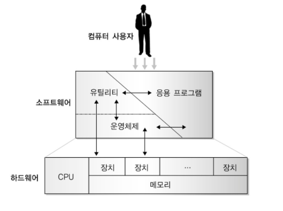

- 컴퓨터 시스템은 일반적으로 `컴퓨터 사용자`, `소프트웨어`, `하드웨어` 3가지 요소로 구성된다.

- `컴퓨터 사용자`: 어떤 일을 수행하기 위해 컴퓨터를 사용하는 사람, 장치, 다른 컴퓨터
- `하드웨어`: 연산을 위한 기본 자원을 제공하는 프로세서(중앙처리장치, CPU), 메모리(기억장치), 다양한 장치(입출력장치 등)로 구성된다.
- `소프트웨어`: 컴퓨터가 기능을 수행하는데 필요한 프로그램을 총칭한다.
- 소프트웨어는 OS, 각종 응용프로그램, 유틸리티 등으로 구성된다.
- 여기서 유틸리티는 컴퓨터의 여러 처리 과정을 보조하여 시스템을 유지하고 성능을 개선하기 위한 프로그램으로 응용프로그램보다 작은 프로그램을 의미한다.
- `응용프로그램`: 어떤 문제를 해결하기 위해 사용자나 전문가에 의해 만들어진 프로그램이다. 웹 브라우저, 한글이나 MS 워드 같은 워드 프로세서, 데이터베이스 관리 프로그램, 비디오 게임 등이 여기에 해당한다.

- `운영체제는 하드웨어와 컴퓨터 사용자를 연결하는 역할을 한다.`
- 운영체제는 CPU, 메모리와 같은 컴퓨터 자원을 관리하고, 사용자에게 편의를 제공한다.

### 커널

- `커널은 OS의 핵심`으로 메모리에 상주하면서 OS의 다른 부분 또는 응용프로그램 수행에 필요한 환경을 설정하는 소프트웨어이다.
- 응용프로그램 실행에 필요한 다양한 서비스를 제공하고 실행되는 프로세스를 스케줄링하는 역할을 한다.
- `하드웨어와 OS를 연결해주는 다리`와 같은 역할을 한다.
- `OS는 더 정확히는 커널(kernel)을 의미`한다.
   

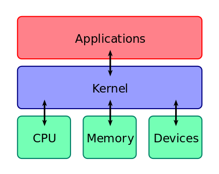

#### 안드로이드는 OS인가?

 

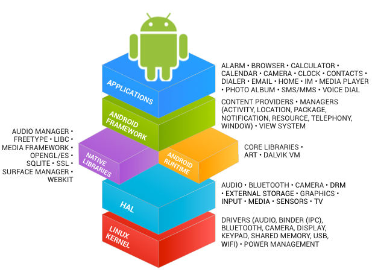

- 안드로이드는 OS가 아니다.
- 안드로이드는 리눅스 커널을 기반으로 여러 가지 라이브러리, 프레임워크 등을 추가해 만들어졌다.

### 쉘(Shell)

- 사용자가 `OS 기능과 서비스를 조작할 수 있도록 인터페이스를 제공하는 프로그램`
- 사용자는 이미 작성된 실행 가능한 프로그램을 다룬다.
- 이러한 프로그램들의 기능을 보조하기 위해 시스템 호출을 가지지만, `시스템 호출은 프로그램 안에 포함되어 있어 사용자는 볼 수 없다.`
- `프로그램은 명령어 해석기에 의해 수행되며, 명령어 해석기는 사용자 프로세스로 OS의 커널을 둘러싸고 있기 때문에 쉘(Shell)이라고 부른다.`
- 쉘은 터미널 환경(CLI)과, GUI 환경 2종류로 분류된다.
- 유명한 쉘: 리눅스 bash
   

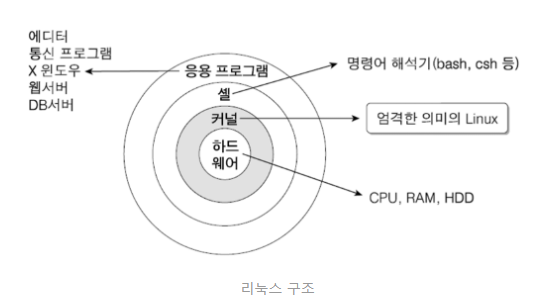

### 시스템 콜(System Call)

- 시스템 콜 또는 시스템 호출 인터페이스
- 시스템 콜은 `실행 중인 프로그램과 OS 간의 인터페이스`로, `사용자 프로그램은 시스템 호출을 통해 OS의 기능을 서비스받는다.`
- `시스템 호출을 통해 OS의 서비스를 받기 때문에 API(Application Programming Interface)라고도 부른다.`
- `OS가 OS 각 기능을 사용할 수 있도록 시스템 콜이라는 명령 또는 함수를 제공한다.`
- `커널 모드로 실행하려면, 반드시 시스템 콜을 거쳐야 한다.`
- 커널에게 요청을 하려면 인터페이스가 필요하다.
- 그 인터페이스가 시스템 콜이다.
- 커널이 시스템 콜을 함수로 제공해준다.
   

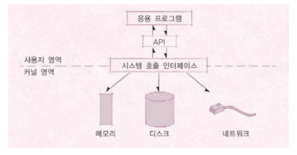

 

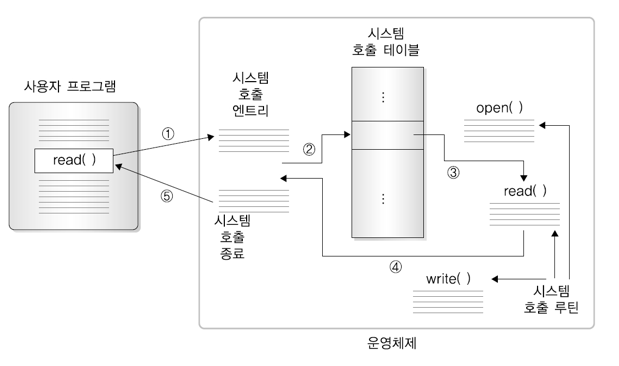

### 사용자 모드(user mode)와 커널 모드(kernel mode)

- 커널에서 중요한 자원을 관리하기 때문에, 사용자가 그 중요한 자원에 접근하지 못하도록 모드를 2가지로 나누었다.
- 함부로 응용프로그램이 전체 컴퓨터 시스템을 해치지 못한다.
- `사용자 모드`: 사용자가 접근할 수 있는 영역을 제한적으로 두고, 프로그램의 자원에 함부로 침범하지 못하는 모드이다. 응용프로그램이 사용한다.
- 우리는 사용자 모드에서 코드를 작성하고, 프로세스를 실행하는 등의 행동을 할 수 있다.

- `커널 모드`: 모든 자원(드라이버, 메모리, CPU 등)에 접근, 명령을 할 수 있다. OS가 사용한다.
- 시스템 콜을 호출하면 모드가 바뀐다.

 

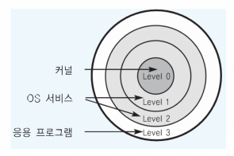

#### 사용자 모드와 커널 모드의 전환

- 프로세스가 실행되는 동안에 프로세스는 수없이 사용자 모드와 커널 모드를 왔다 갔다 하면서 실행된다.
- `사용자 모드 → 커널 모드`: 프로세스가 사용자 모드에서 실행되다가 특별한 요청이 필요할 때 System call을 이용해서 커널에 요청한다.
- `커널 모드 → 사용자 모드`: System call의 요청을 받은 커널이 그 요청에 대한 일을 하고 결과값을 System call의 리턴값으로 전해준다.
- `응용프로그램 실행 시, 해당 API를 호출하면, 시스템 콜 호출, 커널 모드로 변경 후, OS 내부에서 해당 명령이 실행되고, 응용프로그램에 결과값을 리턴한다.`
- 시스템 콜은 OS에서 제공한다.

#### API(Application Programming Interface)

- `간단히 함수 또는 라이브러리라고 이해하면 된다.`
- `API 내부에는 필요하면 해당 OS의 시스템 콜을 호출하는 형태로 만들어졌다.`
- 쉽게 말해 API란, 내가 만든 프로그램이 개인 개발자, 기업, 기관이 제공하는 기능, 프로그램 등을 활용할 수 있게끔 도와주는 중간 매개체이다.
- 즉, 프로그램과 또 다른 프로그램을 연결해주는 일종의 다리라고 볼 수 있다.

#### 운영체제를 만든다면?

1. 운영체제를 개발한다. (kernel)
2. 시스템 콜을 개발
3. 시스템 콜 기반, 프로그래밍 언어별 라이브러리 개발(API)
4. 지원되는 프로그래밍 언어로 Shell 프로그램 개발
5. 지원되는 프로그래밍 언어로 응용프로그램 개발

 

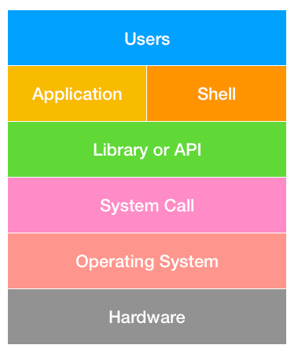

### 프로세스(process)란?

- `프로세스: 실행 중인 프로그램`
- 실행 중인 프로그램이란 디스크에 저장되어 있던 실행 가능한 프로그램이 메모리에 적재되어 OS의 제어를 받는 상태를 말한다.
- 다시 말해, 해당 프로세스가 사용하고 있는 메모리 영역(자신의 주소공간)이 존재함을 의미한다.
- 응용프로그램 !== 프로세스
- 응용프로그램은 여러 프로세스로 구성된다.

### 운영체제의 유형별 특징

#### 일괄 처리 프로그램(Batch Processing)

- `여러 프로그램을 순차적으로 실행`
- 어떤 프로그램의 실행 시간이 길다면, 다른 프로그램이 오래 기다려야 한다.
- 시스템 효율 향상을 위하여 작업량이 일정한 수준이 될 때까지 모아두었다가 한꺼번에 처리
- 컴퓨터 시스템을 중단없이 효율적으로 사용할 수 있다.

 

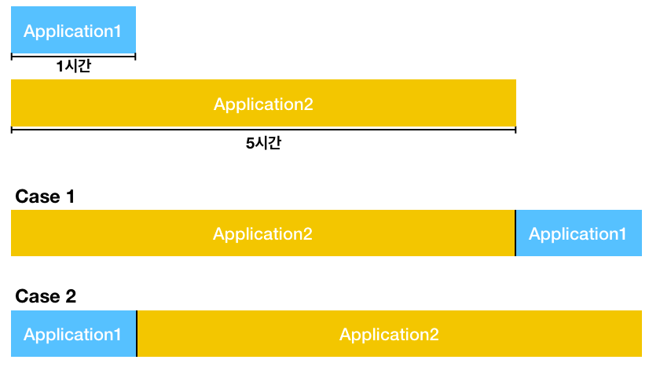

### 멀티 테스킹(Multi-Tasking)

- Task: 프로세스의 개념보다 조금 확장된 개념
- `멀티 테스킹: 테스크가 하나의 CPU 상에서 OS의 스케줄링 방식에 따라 조금씩 번갈아 가면서 수행되는 것을 말한다.`
- 빠른 속도로 조금씩 번갈아 가면서 테스크들을 처리하면 사용자는 동시에 처리되는 것처럼 느낀다.
- 10 ~ 20 ms 단위로도 실행 응용프로그램이 바뀐다.
- ex) 컴퓨터로 워드를 작성하면서 그림판으로 그림을 그릴 수 있는 것도 멀티 테스킹이다.
- 멀티 테스킹의 스케줄링 방식
  - `멀티 프로그래밍 방식(다중 프로그래밍, Multi Programming)`
  - `시분할 방식(Time-Sharing)`
  - 실시간 시스템 방식(Real-Time)

 

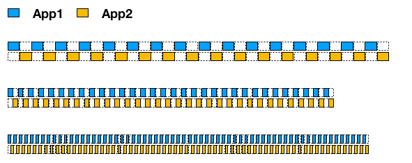

#### 다중 프로그래밍(Multi Programming)

- 2개 이상의 프로그램을 주기억장치에 기억시키고 하나의 CPU를 번갈아 사용하면서 처리
- 하나의 자원(CPU, 메모리 등)을 여러 개의 프로그램이 공동으로 사용한다.
- 동일한 기억장소를 2개 이상의 프로그램이 사용하는 시스템
- CPU 활용도를 극대화하는 스케줄링 알고리즘(최대한 CPU를 많이 활용)
- `처리량 극대화`를 꾀한다.
- Wait: 저장 매체로부터 파일 읽기를 기다리는 시간(CPU 유휴)

 

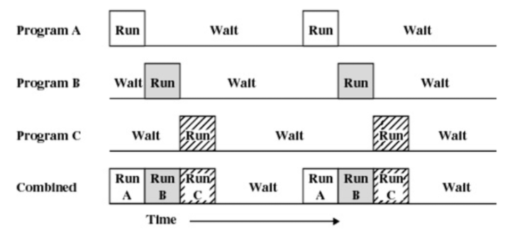

#### 시분할 처리(Time-Sharing Processing)

- `CPU를 일정한 시간 단위(=Time Slice, Quantum, Time Slot)로 각 사용자에게 균등하게 나누어 처리하는 방식`
- 하나의 CPU를 여러 개의 작업이 정해진 시간 동안 번갈아 사용한다.
- 각각의 사용자들은 실제로 자신만이 컴퓨터를 사용하고 있는 것처럼 느낀다.(다중 사용자 지원)
- 대화식 처리에 적합하다.
- `라운드 로빈(Round Robin) 방식`이라고도 한다.
- `응답시간 최소화`를 꾀한다.
- 컴퓨터 시스템의 전체 효율(처리량)은 높아지나, 개인 사용자 입장에서는 반응속도가 느려질 수 있다.
   

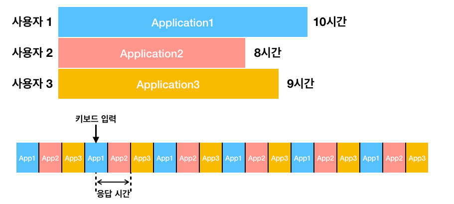

### 멀티 프로세싱(Multi-Processing)

- 멀티 프로세싱은 `다중 CPU 환경`에서 여러 응용프로그램을 병렬처리하는 시스템
- `실행 속도를 극대화`시키는 시스템
- 현대의 컴퓨터들은 대부분 멀티 코어 이상을 지원하므로 멀티 프로세싱을 한다.
   

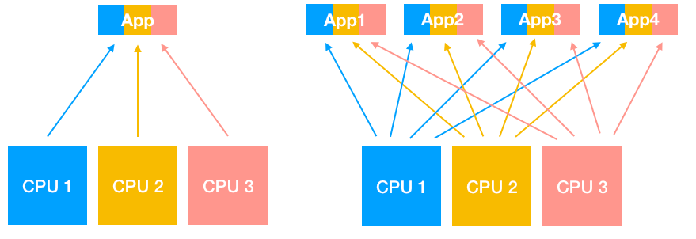

### 메모리 계층구조

 

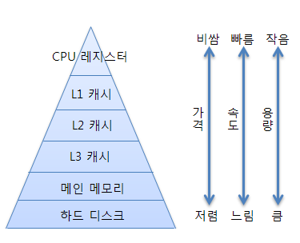
 

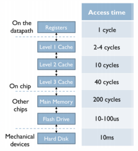

- Flash Drive: USB를 의미
- 캐시: CPU 안에 존재

### 버스

- `버스(Bus)는 프로세서를 비롯해 각 장치 간 또는 서브시스템을 서로 연결하여 데이터를 주고 받을 수 있게 해주는 통로`이다.
- 컴퓨터 내부의 다양한 신호는 이 버스를 통해 전달된다.
- 버스는 위치에 따라 내부 버스와 외부 버스로 분류한다.
- `내부 버스`: 프로세서 내부에서 레지스터, 연산 장치, 메모리와의 인터페이스 등을 연결한다.
- 시스템 버스 인터페이스 회로를 통해 외부 버스와 연결된다.
- `외부 버스`: 프로세서, 메모리, 프로세서와 입출력장치, 입출력장치와 입출력장치를 연결한다.
- `외부 버스는 일반적으로 시스템 버스`라고 하며, 독립된 기능을 갖는 장치로 각 시스템 버스는 버스 제어기라고 불리는 제어 회로를 갖고 있다.
   

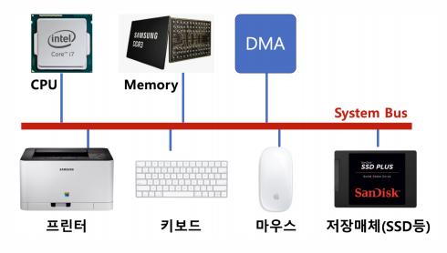

 

---
