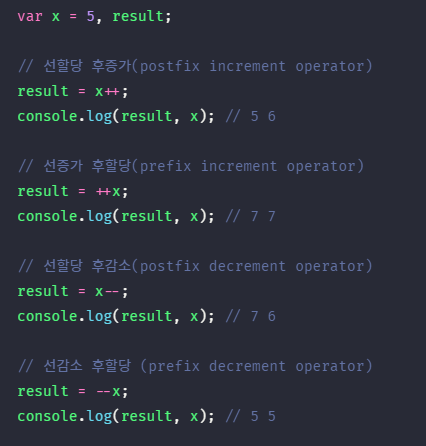

## JAVASCRIPT
<details open>
<summary>연산자</summary>
<div markdown="7">

#### 자바스크립트의 속성(attribute)
- 자바스크립트의 속성은 `attribute`라고 하자
- `<div id="abc"></div>` 여기서 id는 `attribute key`, id값은 `attibute value`, 키와 값 전체를 `attribute`라고 한다. 
- `color: red` 여기서 color는 `property key`, color값은 `property value`, 키와 값 전체를 `property`라고 한다.

#### 연산자(operator)
- 하나 이상의 표현식을 대상으로 산술, 할당, 비교, 논리, 타입, 지수 연산 등을 수행해 하나의 값을 만든다.
- 이 때 연산의 대상을 피연산자(operand)라 한다.
- 피연산자는 값으로 평가될 수 있는 표현식이어야 한다.
- 피연산자와 연산자의 조합으로 이뤄진 연산자 표현식도 값으로 평가될 수 있는 표현식이다.
- 연산자는 값으로 평가된 피연산자를 연산해 새로운 값을 만든다.

#### 산술 연산자(arithmetic operator)
- 피연산자를 대상으로 수학적 계산을 수행해 새로운 값을 만든다.
- 산술 연산이 불가능한 경우 `NaN`을 반환한다.
- 피연산자의 개수에 따라 이항 산술 연산자와 단항 산술 연산자로 구분할 수 있다.

##### 이항(binary) 산술 연산자
- 2개의 피연산자를 산술 연산하여 숫자 값을 만든다.
- 모든 이항 산술 연산자는 피연산자의 값을 변경하는 `부수 효과(side effect)가 없다.`
- 어떤 산술 연산을 해도 피연산자의 값이 바뀌는 경우는 없고 언제나 `새로운 값`을 만든다.
- `+`, `-`, `*`, `/`, `%`

```javascript
console.log(1 * '1'); // 암묵적 형변환, 1
console.log(10/0); // Infinity
console.log(10/-0); //-Infinity
```

##### 단항(unary) 산술 연산자
- 1개의 피연산자를 산술 연산하여 숫자 값을 만든다.
- `++`, `--`, `+`, `-`
- `++`, `--` 연산자는 피연산자의 값을 변경하는 `부수효과가 있다.` 피연산자의 값을 변경하는 암묵적 할당이 이뤄진다.
- 전위 증가/감소 연산자(prefix increment/decrement operator) : 먼저 피연산자의 값을 증가/감소 시킨 후, 다른 연산을 수행한다.
- 후위 증가/감소 연산자(postfix increment/decrement operator) : 먼저 다른 연산을 수행한 후, 피연산자의 값을 증가/감소시킨다.
<br />



- 숫자타입이 아닌 피연산자에 `+` 단항 연산자를 사용하면 피연산자를 숫자타입으로 변환하여 반환한다. 이때 피연산자를 변경하는 것은 아니고 숫자 타입으로 변환한 값을 생성해서 반환한다. 따라서 부수효과는 없다.

```javascript
var x = ‘1’;
console.log(+x); // 1, 문자열이 숫자로 타입 변환됨
console.log(x) // ‘1’, 부수효과 없음

x = ‘hello’;
console.log(+x) // NaN
console.log(x) // ‘hello’
```

#### 문자열 연결 연산자
- `+` 연산자는 피연산자 중 하나 이상이 문자열인 경우 문자열 연결 연산자로 동작한다.
- 그 외의 경우는 산술 연산자로 동작한다.

```javascript
‘1’ + 2; // ‘12’
1 + null; // 1
+undefined; // NaN
1 + undefined; // NaN
```

- `null` 값을 숫자타입인 0로 타입을 강제로 변환한 후 연산을 수행한다. 이를 암묵적 타입 변환(implicit coercion) 또는 타입 강제 변환(type coercion) 이라고 한다.

```javascript
var x = '10';
var y = 2;
var sum = x + y;
console.log(sum/10); // 10.2
```
- 당연히 숫자를 계산하는 줄 알았는데 sum에 "102"가 할당됨 → 동적타입언어의 약점이 드러나는 코드
- TypeSript의 등장 : 동적타입언어의 자바스크립트를 정적타입언어로 사용할 수 있음

#### 할당 연산자(assignment operator)
- 우항에 있는 피연산자의 평가 결과를 좌항에 있는 변수에 할당한다.
- 좌항의 변수에 값을 할당하므로 변수 값이 변하는 `부수 효과가 있다.`
- `=`, `+=`, `-=`, `*=`, `/=`, `%=`

```javascript
var a, b, c;
a = b = c = 0;
// 연쇄할당, 오른쪽에서 왼쪽으로 진행
// c=0;
// b=0;
// a=0;
```

#### 비교 연산자(comparison operator)
- 좌항과 우항의 피연산자를 비교한 다음 그 결과를 불리언 값으로 반환한다.

#### 동등/일치 비교 연산자
- 동등 비교(loose equality) 연산자와 일치 비교(strict equality) 연산자는 좌항과 우항의 피연산자가 같은 값으로 평가되는지 비교해 불리언 값을 반환한다.
- 동등 비교 연산자는 느슨한 비교, 일치 비교 연산자는 엄격한 비교를 한다.
- 동등 비교(==) 연산자는 좌항과 우항의 피연산자를 비교할 때, 먼저 `암묵적 타입 변환`을 통해 타입을 일치시킨 후, 같은 값인지 비교한다.
- 일치 비교(===) 연산자는 좌항과 우항의 피연산자가 `타입`도 같고 `값`도 같은 경우에 한하여 true를 반환한다. 암묵적 타입 변환을 하지 않고 값을 비교한다.

| 비교 연산자 | 의미        | 사례    | 설명                     | 부수효과 |
| :---------: | ----------- | ------- | ------------------------ | :------: |
|     ==      | 동등 비교   | x == y  | x와 y의 값이 같음        |    X     |
|     ===     | 일치 비교   | x === y | x와 y의 값과 타입이 같음 |    X     |
|     !=      | 부동등 비교 | x != y  | x와 y의 값이 다름        |    X     |
|     !==     | 불일치 비교 | x !== y | x와 y의 값과 타입이 다름 |    X     |


```javascript
NaN === NaN; // false, NaN은 자신과 일치하지 않는 유일한 값
isNaN(NaN); // true, 지정한 값이 NaN인지 조사하기위한 빌트인 함수 isNaN()
isNaN(10); // false
isNaN(1 + undefined); // true

-0 === +0; // true
Object.is(-0, +0); // false

Object.is(NaN, NaN); // true
```
- Object.is 메서드 : 예측 가능한 정확한 비교 결과를 반환

#### 대소 관계 비교 연산자
- 피연산자의 크기를 비교하여 불리언 값을 반환한다.

#### 삼항 조건 연산자(ternary operator)
- 조건식에 평가 결과에 따라 변환할 값을 결정한다.
- 부수효과는 없다.
- 삼항 조건 연산자는 두 번째 피연산자 또는 세 번째 피연산자로 평가되는 표현식이다.
- `삼항 조건 연산자 표현식은 값처럼 사용`할 수 있지만, if...else문은 값처럼 사용할 수 없다.
- if...else 문은 표현식이 아닌 문이다. 따라서 if...else 문은 값처럼 사용할 수 없다.

#### 논리 연산자(logical operator)
- 우항과 좌항의 피연산자(부정 논리 연산자의 경우 우항의 피연산자)를 논리 연산한다.
- `||`, `&&`, `!`
- 부수 효과 없음
- 논리 부정 연산자(!)는 언제나 `불리언 값`을 반환한다. 피연산자가 불리언 값이 아니면 불리언 타입으로 암묵적 타입 변환된다.

```javascript 
‘Cat’ && ‘Dog’ // ‘Dog’
!0; // true
!‘hello’; // false
```

#### typeof 연산자
- 피연산자의 데이터 타입을 문자열로 반환한다.
- `string`, `number`, `boolean`, `undefined`, `symbol`, `object`, `function` 중 하나를 반환
- `null`을 반환하는 경우는 없다. (버그)

```javascript
typeof NaN // number
typeof null // Object
typeof [] // Object
typeof {} // Object
typeof new Date() // Object
typeof /test/gi // Object
typeof a; // undefined, 선언하지 않은 식별자
typeof function(){} // function
```

##### 배열인지 아닌지 확인하는 매서드 isArray()
```javascript
Array.isArray([1,2,3]) // true
```

#### 지수 연산자
- ES7에서 도입된 연산자, 좌항의 피연산자를 밑으로 우항의 피연산자를 지수로 거듭제곱하여 숫자 값을 반환한다.
- 지수 연산자가 도입되기 이전에는 Math.pow 메서드를 사용했다.
- 이항 연산자 중에서 가장 우선순위가 높다.

```javascript
2 ** 2; // 4
2 ** 0; // 1
2 ** -2; // 0.25
(-5) ** 2; // 25, 음수를 거듭제곱 밑으로 사용하려면 괄호로 묶어야함

Math.pow(2, 2); // 4

var num = 5;
num **= 2; // 25
```

#### 연산자의 부수효과
- 대부분의 연산자는 다른 코드에 영향을 주지 않는다.
- 예를 들어, 1*2는 다른코드에 어떠한 영향도 주지 않고 새로운 값 2를 생성한다.
- 부수 효과가 있는 연산자는 `할당(=)`, `증가/감소(++,--)`, `delete` 연산자이다.

```javascript
var o = { a: 1 };
delete o.a;
console.log(o); // {}
```

#### 연산자 결합순서
- 연산자의 어느 쪽(좌항 또는 우항)부터 평가를 수행할 것인지를 나타내는 순서를 말한다.
- 좌항 → 우항 : `+, -, /, %, <, <=, >, >=, &&, ||, ., [], (), ??, ?., in, instanceof`
- 우항 → 좌항 : `++, --, 할당 연산자(=, +=, -=, ...), !x, +x, -x, ++x, --x, typeof, delete, ? ... : ...`

</div> 
</details>

---