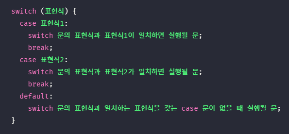
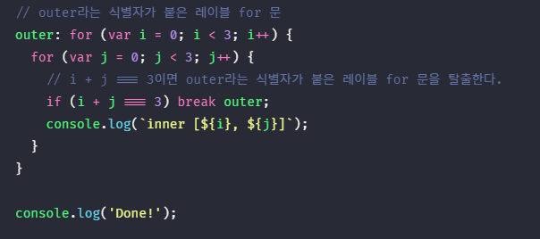
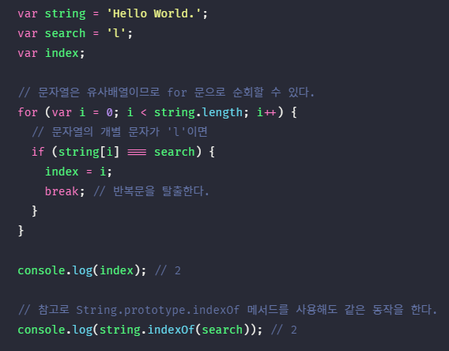
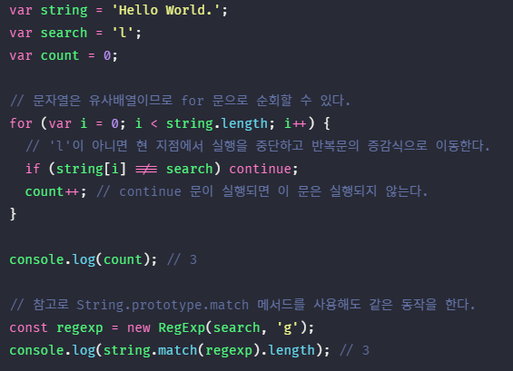

## JAVASCRIPT
<details open>
<summary>제어문</summary>
<div markdown="8">

#### 제어문(control flow statement)
- 주어진 조건에 따라 코드 블록을 실행(조건문)하거나 반복 실행(반복문) 할 때 사용한다.
- 제어문을 사용하면 코드의 실행 흐름을 인위적으로 제어할 수 있다.

#### 블록문(block statement/compound statement)
- 블록문 = 코드 블록
- 0개 이상의 중괄호로 묶은 것으로, 코드 블록 또는 블록이라고 부른다.
- 블록문은 언제나 문의 종료를 의미하는 자체 종결성(self closing)을 갖기 때문에 블록문 끝에는 세미콜론을 붙이지 않는다.

#### 조건문(condetional statement)
- 주어진 조건식의 평가 결과에 따라 코드 블록(블록문)의 실행을 결정한다.
- `조건식`은 불리언 값으로 `평가될 수 있는 표현식`이다.
- 조건식에 표현식이 아닌 식이 오더라도 암묵적 형변환이 일어남
- if...else 문, switch 문

#### switch 문
- 주어진 표현식을 평가하여 그 값과 일치하는 표현식을 갖는 case 문으로 실행흐름을 옮긴다. 
- 조건이 많을경우에는 switch문 사용, 그 외에는 if문 사용
- switch 문의 표현식과 일치하는 case 문이 없다면 실행 순서는 default 문으로 이동한다. default 문은 선택사항으로, 사용할 수도 있고 사용하지 않을 수도 있다.
- `switch fall through` : switch 문에서 case 내에서 의도적으로 break 문을 생략하여 다음 case로 이동시키는 방법 
- default 문에는 break 문을 생략하는 것이 일반적이다. default 문은 switch 문의 맨 마지막에 위치하므로 default 문의 실행이 종료되면 switch 문을 빠져나간다. 따라서 별도의 break 문이 필요 없다. 
<br />



#### 반복문(loop statement)
- 조건식의 평가 결과가 참인 경우 코드 블록을 실행한다.
- for 문, while 문, do...while 문
- 반복문을 대체할 수 있는 다양한 기능 : 배열을 순회할 때 사용하는 `forEach` 메서드, 객체의 프로퍼티를 열거할 때 사용하는 `for...in` 문, ES6에서 도입된 이터러블을 순회할 수 있는 `for...of` 문

#### for 문
- 변수 선언문, 조건식, 증감식은 모두 옵션이므로 반드시 사용할 필요는 없다.
- 어떠한 식도 선언하지 않으면 무한루프가 된다.
- 실행 순서 : 선언문 → 조건식 → 블록문 → 증감식 → 조건식 → 블록문 ...
- 선언문은 한 번만 실행됨

```javascript
for(;;){
	console.log(‘hello’); // 무한루프
}
```
- 1중 for문 : 라인(선형)
- 2중 for문 : matrix
- 3중 for문 : 3차원(입체)

#### while 문
- for문은 반복횟수가 명확할 때 주로 사용한다.
- while 문은 반복횟수가 불명확할 때 주로 사용한다.  

#### do...while 문
- 코드 블록을 먼저 실행하고 조건식을 평가한다.
- 따라서, 무조건 한 번 이상 실행된다.

#### break 문
- 레이블 문, 반복문 또는 switch 문의 코드 블록을 탈출한다.
- 위 언급한 문 이외에 break를 사용하면 `SyntaxError(문법 에러)`가 발생한다.

```javascript
if(true){
	break; // Uncaught SyntaxError: Illegal break statement
}
```

- 레이블 문 : 식별자가 붙은 문
- switch 문의 case 문과 default 문도 레이블 문이다.
- for문 외부로 탈출할 때 유용하지만, 그 밖의 경우 레이블 문은 일반적으로 권장하지 않는다. 
- 레이블 문을 사용하면 프로그램 흐름이 복잡해져서 가독성이 나빠지고 오류를 발생시킬 가능성이 높아짐
<br />


- 탈출한 곳이 있으면 if문 안에 break를 써도 에러가 나지않음(위는 if문 탈출이 아닌 for문 탈출)

<br />



#### 자료구조
- 장점 : 한번의 계산으로(+) 배열을 자유롭게 이동(순회)하면서 값을 꺼낼 수 있음 
- 단점 : 중간에 새로운 값을 추가하면 뒤에 있는 모든 값은 뒤로 밀어야함

#### continue 문
- 반복문의 코드 블록 실행을 현 지점에서 중단하고 반복문의 증감식으로 실행 흐름을 이동시킨다.
- break 문처럼 반복문을 탈출하지는 않는다.
<br />



</div> 
</details>

---