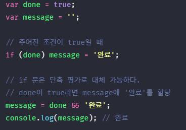
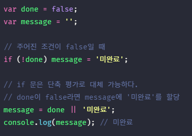
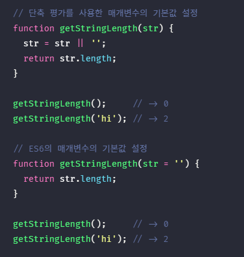
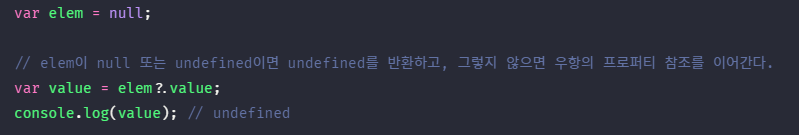
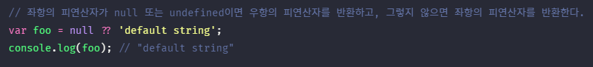

## JAVASCRIPT
<details open>
<summary>타입 변환과 단축 평가</summary>
<div markdown="9">

#### 타입 변환이란
- 개발자가 의도적으로 값의 타입을 변환하는 것을 `명시적 타입 변환(explicit coercion)` 또는 타입 캐스팅(type casting)이라 한다.
- 개발자의 의도와는 상관없이 표현식을 평가하는 도중에 자바스크립트 엔진에 의해 암묵적으로 타입이 자동으로 변환되기도 한다. 이를 `암묵적 타입 변환(implicit coercion)` 또는 타입 강제 변환(type coercion)이라고 한다.
- 명시적 타입 변환이나 암묵적 타입 변환이 기존 원시값을 직접 변경하는 것은 아니다. 원시값을 변경 불가능한 값(immutable value)이므로 변경할 수 없다.
- 타입 변환이란 기존 원시값을 사용해 다른 타입의 새로운 원시값을 생성하는 것이다.

#### 암묵적 타입 변환
- 자바스크립트는 가급적 에러를 발생시키지 않도록 암묵적 타입 변환을 통해 표현식을 평가한다.
- 암묵적 타입 변환이 발생하면 문자열, 숫자, 불리언과 같은 타입 중 하나의 타입으로 자동 변환한다.
- 문자열 연결 연산자의 표현식 중에서 문자열 타입이 아닌 피연산자를 문자열 타입으로 암묵적 타입 변환한다.
- 연산자 표현식의 피연산자만이 암묵적 타입 변환의 대상이 되는 것은 아니고, 예를 들어 ES6에서 도입된 템플릿 리터럴의 표현식 삽입은 표현식의 평가 결과를 문자열 타입으로 암묵적 타입 변환한다.
- 산술 연산자의 피연산자 중에서 숫자 타입이 아닌 피연산자를 숫자 타입으로 암묵적 타입 변환한다. 이때 피연산자를 숫자 타입으로 변환할 수 없는 경우는 산술 연산을 수행할 수 없으므로 NaN이 된다.

```javascript
1 + ’2‘ // ’12‘
`1 + 1 = ${1 + 1}` // ‘1 + 1 = 2’, 2가 숫자이지만 문자열로 타입변환됨

// 문자열 타입으로 변환
0 + ‘’ // ‘0’
NaN + ‘’ // ‘NaN’
(Symbol()) + ‘’ // TypeError: Cannot convert a Symbol value to a string, symbol은 값의 내용을 볼 수 없기 때문에(존재한다라고만 알 수 있음) 에러 또는 심볼값의 변화를 막기위해서 error가 나오는 것 같다.
({}) + ‘’ // ‘[object(타입) Object(생성자)]’
Math + ‘’ // ‘[object Math]’
[] + ‘’ // ‘’
[10, 20] + ‘’ // ‘10, 20’ 

// 숫자 타입으로 변환
‘1’ > 0 // true
+‘’ // 0
+‘1’ // 1
+true // 1
+null // 0
+undefined // NaN
+{} // NaN
+[] // 0
``` 

#### false로 평가되는 falsy 값(아래 값을 제외한 값은 truthy 값)
- `false`
- `undefined`
- `null`
- `+0`, `-0`
- `NaN`
- `‘’(빈 문자열)`

#### 함수
- 어떤 작업을 수행하기 위해 필요한 문의 집합을 정의한 코드 블록이다.
- 함수는 이름과 매개변수를 가지며, 필요할 때 호출해 코드 블록에 담긴 문들을 일괄적으로 실행할 수 있다.

#### 명시적 타입 변환
- 개발자의 의도에 따라 명시적으로 타입을 변경하는 방법은 다양하다.
- `표준 빌트인 생성자 함수(String, Number, Boolean)를 new 연산자 없이 호출하는 방법`
- `빌트인 메서드를 사용하는 방법`
- `암묵적 타입 변환을 이용하는 방법`

```javascript
// 1. String 생성자 함수를 new 연산자 없이 호출하는 방법(비추, 문자열 객체를 만드려고 사용하는 것인데 문자열을 만드려고 사용하면 취지와 다르기 때문)
String(1); // ‘1’

// 2. Object.prototype.toString 메서드를 사용하는 방법
(1).toString(); // ‘1’

// 3. 문자열 연결 연산자를 이용하는 방법(추천)
1 + ‘’; // ‘1’

// 1. Number 생성자 함수를 new 연산자 없이 호출하는 방법
Number(‘0’); // 0

// 2. parseInt, parseFloat 함수를 사용하는 방법(문자열만 변환 가능)
parseInt(‘0’); // 0

// 3. + 단항 산술 연산자를 이용하는 방법(추천)
+‘0’ //0

// 1. Boolean 생성자 함수를 new 연산자 없이 호출하는 방법
Boolean(‘x’); // true

// 2. ! 부정 논리 연산자를 두번 사용하는 방법(추천)
!!‘x’; // true
```

#### 표준 빌트인 생성자 함수와 빌트인 메서드
- 표준 빌트인(built-in) 생성자 함수와 표준 빌트인 메서드는 자바스크립트에서 기본 제공하는 함수이다. 
- 표준 빌트인 생성자 함수는 객체를 생성하기 위한 함수이며 new 연산자와 함께 호출한다.
- 표준 빌트인 메서드는 자바스크립트에서 기본 제공하는 빌트인 객체의 메서드이다.

#### 논리 연산자를 사용한 단축 평가
- if문을 대체할 수 있다.
- 논리 연산의 결과를 결정하는 피연산자를 타입 변환하지 않고 그대로 반환하는 것을 `단축 평가(short-circuit evaluation)`라고 한다.
- 단축 평가는 표현식을 평가하는 도중에 평가 결과가 확정된 경우 나머지 평가 과정을 생략하는 것을 말한다.
- 논리합(`||`) 연산자와 논리곱(`&&`) 연산자의 표현식의 결과는 불리언 값이 아닐 수도 있다.
- 논리합(`||`) 연산자와 논리곱(`&&`) 연산자의 표현식은 언제나 2개의 피연산자 중 어느 한쪽으로 평가된다.

```javascript
'Cat' && 'Dog' // ‘Dog’
```
- 논리곱(`&&`) 연산자는 모두 true로 평가될 때 true를 반환한다.
- 첫 번째 피연산자는 Truthy 값이므로 true로 평가된다. 두 번째 피연산자까지 평가해 보아야 위 표현식을 평가할 수 있다. 다시 말해, 두 번째 피연산자가 위 논리곱 연산자 표현식의 결과를 결정한다.
- 논리곱 연산자는 논리연산의 결과를 결정하는 두 번째 피연산자를 반환한다.
<br />



```javascript
'Cat' || 'Dog' // ‘Cat’
```
- 논리합 연산자는 두 개의 피연산자 중 하나만 true로 평가되어도 true를 반환한다.
- 첫 번째 피연산자는 Truthy 값이므로 true로 평가된다. 이 시점에서 두 번째 피연산자까지 평가해보지 않아도 위 표현식을 평가할 수 있다.
<br />



<br />


- ES6에서는 매개변수 자리에 str의 기본값을 줄 수 있음 

#### 옵셔널 체이닝 연산자(optional chaining)
- ES11에서 도입된 옵셔널 체이닝 연산자 `.?` 는 좌항의 피연산자가 `null` 또는 `undefined`인 경우 undefined를 반환하고, 그렇지 않으면 우항의 프로퍼티를 참고한다.
<br />



#### null 병합 연산자(nullish coalescing)
- ES11에서 도입된 null 병합 연산자 `??`는 좌항의 피연산자가 `null` 또는 `undefined`인 경우 우항의 피연산자를 반환하고, 그렇지 않으면 좌항의 피연산자를 반환한다.
<br />



</div> 
</details>

---

<details open>
<summary>좋은 습관들</summary>
<div>
<br />

1. 에러코드 읽는 습관들이자.
2. ""안에 ''를 사용하면 코딩컨벤션이 깨지니 사용하지말자.
3. 백틱(`)이나 이스케이프 시퀀스 사용하자.
4. 백틱(`)은 특수한 경우에만 사용하자.
5. 변수가 많을수록 확률상 버그가 많이 일어난다. 전역 변수는 지양하자.
6. 가장 좋은 함수의 길이는 한 줄이다.
7. 변수 재할당은 좋지않다. 하지 말자.
8. 부수효과가 있는 `++`, `--` 대신 `x += 1`을 사용하자.
9. `ESLint`의 빨간줄을 없애는 습관을 들이자.
10. 제어문을 안쓰려는 노력을 하자.(특히 for문, for문 대신 forEach, map, filter, find, reduce, for...of를 사용하자)
11. var을 쓰면 블록문의 취지가 무색하다.
12. if문은 코드의 실행 흐름을 방해하기 때문에 가독성에 해를 준다. 꼭 사용해야하는 경우를 제외하고는 삼항조건 연산자를 사용하자.
13. 오해가없게 명시적 타입 변환을 하는 것이 좋다.

</div> 
</details>

---