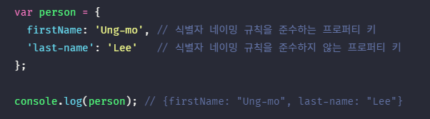

## JAVASCRIPT
<details open>
<summary>객체 리터럴</summary>
<div markdown="10">

#### 객체란?
- 객체(object) ↔ 주체(subject)
- 프로그래밍을 하는 내가 subject, 프로그래머가 인식해서 만들어진 것들이 object(프로그래밍으로 만들어낼 수 있는 것)
- 자바스크립트는 객체(object) 기반의 프로그래밍 언어
- 자바스크립트를 구성하는 거의 “모든 것”이 객체이다.
- 원시값을 제외한 나머지 값들(함수, 배열, 정규표현식 등)은 모두 객체이다.
- 원시타입은 하나의 값만을 나타내지만, 객체타입은 다양한 타입의 값(원시값 또는 다른 객체)을 하나의 단위로 구성한 복합적인 자료구조이다.
- 원시값은 `변경 불가능한 값(immutable value)`이지만, 객체는 `변경 가능한 값(mutable value)`이다. 
- 객체는 0개 이상의 프로퍼티로 구성된 집합이며, 프로퍼티는 `키(key)와 값(value)`으로 구성된다.
- 객체가 아닌 원시값으로 변수 3개를 만드는 경우, 컴퓨터는 논리적으로 3개의 변수가 관련이 없다고 생각한다. 따라서 객체는 프로퍼티와 같이 존재했을 때, 컴퓨터가 서로 관련이 있다는 것을 안다.(여러 개의 값을 하나의 값처럼 사용)

<br />


- 자바스크립트에서 사용할 수 있는 모든 값은 프로퍼티 값이 될 수 있다.
- 자바스크립트의 함수는 일급객체이므로 값으로 취급할 수 있다.
- 프로퍼티의 값이 함수일 경우, 일반 함수와 구분하기 위해 `메서드(method)`라 부른다.
<br />


- 객체는 프로퍼티와 메서드로 구성된 집합체이다.
- 객체는 상태와 동작을 모두 포함할 수 있으므로, 상태와 동작을 하나의 단위로 구조화할 수 있어 유용하다.
- `프로퍼티` : 객체의 `상태`를 나타내는 값(data)
- `메서드` : 프로퍼티(상태 데이터)를 참조하고 조작할 수 있는 `동작(behavior)`
- 자바스크립트 언어는 멀티 패러다임 언어(절차 지향형 + 객체 지향형 + 함수형 다되는 프로그래밍 언어)

#### 객체리터럴에 의한 객체 생성
- C++, JAVA와 같은 클래스 기반 객체지향언어는 클래스를 사전에 정의하고, 필요한 시점에 new 연산자와 함께 생성자(constructor)를 호출하여 인스턴스를 생성하는 방식으로 객체를 생성한다.
- 클래스를 만들면 이 클래스로 만들어진 객체가 몇바이트 인지 알 수 있다.(클래스 기반언어)
- 자바스크립트는 `프로토타입 기반 객체지향 언어`로서 클래스 기반 객체지향 언어와는 달리 다양한 객체 생성 방법을 지원한다.
- 자바스크립트는 '동적 타입언어'이기 때문에 JAVA나 C언어 같은 언어보다 더 구현하기 어렵다.
- 다양한 객체 생성방식
	- `객체 리터럴` : 중괄호({...}) 내에 0개 이상의 프로퍼티를 정의 
	- Object 생성자 함수
	- 생성자 함수
	- Object.create 메서드
	- 클래스(ES6)

- `객체 리터럴`은 자바스크립트의 유연함과 강력함을 대표하는 객체 생성 방식이다.
- 객체를 생성하기 위해 클래스를 정의하고, new 연산자와 함께 생성자를 호출할 필요가 없다. 숫자 값이나 문자열을 만드는 것과 유사하게 리터럴로 객체를 생성한다.
- 객체 리터럴의 중괄호는 코드 블록을 의미하지 않는다. 
- 코드 블록을 닫는 중괄호 뒤에는 세미콜론을 붙이지 않는다.
- 하지만, 객체 리터럴은 값으로 평가되는 표현식이다. 따라서 객체 리터럴의 닫는 중괄호 뒤에는 세미콜론을 붙인다.

#### 인스턴스(instance)
- 클래스에 의해 생성되어 `메모리에 저장된 실체`
- 객체지향 프로그래밍에서 `객체` : `클래스 + 인스턴스`를 포함한 개념
- `클래스` : 인스턴스를 생성하기 위한 템플릿(본보기) 역할
- `인스턴스` : 객체가 메모리에 저장되어 실제로 존재하는 것에 초점을 맞춘 용어
- 대부분의 객체지향언어는 클래스를 만들고 instance를 찍어냄(붕어빵 틀(class), 붕어빵(instance), 한 번 붕어빵틀을 만들면 틀을 변경할 수 없음)
- 자바스크립트는 class를 쓰지않고 바로 객체를 만들 수 있음(객체를 선언하면 엔진은 내부적으로 히든 클래스를 생성)

#### 프로퍼티(property)
- 객체는 `프로퍼티(property)의 집합`이며, 프로퍼티는 키(key)와 값(value)으로 구성된다.
- 프로퍼티 `키` : 빈 문자열을 포함하는 모든 `문자열` 또는 `심벌 값`
- 프로퍼티 `값` : 자바스크립트에서 사용할 수 있는 `모든 값`
- 프로퍼티 키는 값에 접근할 수 있는 이름으로서 식별자 역할
- 프로퍼티 키에 식별자 네이밍 규칙을 준수하는 이름, 즉, 자바스크립트에서 사용 가능한 유효한 이름이면 따옴표를 생략할 수 있다.
- 반대로, 식별자 네이밍 규칙을 따르지 않는 이름에는 반드시 따옴표를 사용해야 한다.
<br />



- 자바스크립트 엔진은 따옴표를 생략한 last-name은 –연산자가 있는 표현식으로 해석한다. (따옴표를 안쓰면 SyntaxError)
<br />


- 문자열 또는 문자열로 평가할 수 있는 표현식을 사용해 프로퍼티 키를 동적으로 생성할 수도 있다. 이 경우 프로퍼티 키로 사용할 표현식을 대괄호([...])로 묶어야 한다.
<br />


- 프로퍼티 키에 문자열이나 심벌 값 이외의 값을 사용하면 `암묵적 타입 변환을 통해 문자열`이 된다. 
- 예를 들어, 프로퍼티 키로 숫자 리터럴을 사용하면 따옴표는 붙지 않지만 내부적으로 문자열로 변환된다.

#### 메서드(method)
- `프로퍼티 값이 함수일 경우` 일반함수와 구분하기 위해 메서드(method)라고 부른다.
- 메서드는 `객체에 묶여있는 함수`를 의미한다.

#### 프로퍼티에 접근하는 방법
- `마침표 표기법(dot notation)` : 마침표 프로퍼티 접근 연산자(.)를 사용 
- `대괄호 표기법(bracket notation)` : 대괄호 프로퍼티 접근 연산자([...])를 사용
- 프로퍼티키가 식별자 네이밍 규칙을 준수하는 이름, 즉, 자바스크립트에서 사용가능한 유효한 이름이면 마침표 표기법과 대괄호 표기법을 모두 사용할 수 있다.
- 대괄호 프로퍼티 접근 연산자 내부에 지정하는 프로퍼티 키는 반드시 `따옴표로 감싼 문자열`이어야 한다. 그렇지 않을경우 자바스크립트 엔진은 따옴표로 감싸지 않은 이름을 식별자로 해석한다.
```javascript
var person = {
	name: ‘Lee’
};

console.log(person[name]); //ReferenceError: name is not defined
```
- 대괄호 연산자 내에 따옴표로 감싸지 않은 이름, 즉 식별자 name을 평가하기 위해 선언된 name을 찾았지만 찾지 못했기 때문에 error. 

```javascript
var person = {
	name: ‘Lee’
};

console.log(person.age); //undefined
```
- `객체에 존재하지 않는 프로퍼티에 접근하면` `undefined` 반환

- 프로퍼티 키가 네이밍 규칙을 준수하지 않는 이름, 즉 자바스크립트에서 사용 가능한 유효한 이름이 아니면 반드시 대괄호 표기법을 사용해야 한다.
- 단, 프로퍼티 키가 숫자로 이뤄진 문자열인 경우 따옴표를 생략할 수 있다.
<br />


- `person.last-name`의 실행 결과는 Node.js 환경에서 “ReferenceError: name is not defined”이고 브라우저 환경에서는 `NaN`이다.
- `person.last-name`을 실행할 때 자바스크립트 엔진은 먼저 person.last를 평가한다. person 객체에는 last인 프로퍼티가 없으므로 person.last는 `undefined`로 평가된다. 따라서 `person.last-name`은 `undefined – name`과 같다. 다음으로 자바스크립튼 엔진은 name이라는 식별자를 찾는다. 이때 name은 프로퍼티 키가 아니라 식별자로 해석된다.
- Node.js 환경에서는 현재 어디에도 name이라는 식별자(변수, 함수 등의 이름) 선언이 없으므로 “ReferenceError: name is not defined” 에러가 발생한다.
- 브라우저 환경에서는 name이라는 전역변수가 암묵적으로 존재한다. 전역변수 name은 창(전역 객체 window의 프로퍼티)의 이름을 가리키며, 기본값은 빈 문자열이다. 따라서 `person.last-name`은 `undefined - ‘’` 과 같으므로 `NaN`이 된다.
- 객체에 없는 프로퍼티 키를 참조하면 `undefined`가 출력된다.

#### 프로퍼티 삭제
- `delete` 연산자는 프로퍼티를 삭제한다. 이때 delete 연산자의 피연산자는 프로퍼티 값에 접근할 수 있는 표현식이어야 한다.
- 만약 존재하지 않는 프로퍼티를 삭제하면 아무런 에러 없이 무시된다.
- delete는 문법적으로 사용가능하지만, 사용하지 말아야하는 안티패턴(delete는 사용금지)
```javascript
var person = {
	name: ‘Kim’
}

person.age = 20;
delete person.age;
delete person.address; // 에러가 발생하지 않고, 무시됨

console.log(person); // {name: “Kim”}
```

#### ES6에서 추가된 객체 리터럴의 확장 기능
1. 프로퍼티의 축약 표현
- 프로퍼티의 값은 변수에 할당된 값, 즉 식별자 표현식일 수도 있다.
```javascript
// ES5
var x = 1, y = 2;

var obj = {
	x: x,
	y: y	
};

console.log(obj); // {x: 1, y: 2}
```

```javascript
// ES6
var x = 1, y = 2;
const obj = { x, y };
console.log(obj); // {x: 1, y: 2}
```
- ES6에서는 프로퍼티 값으로 변수를 사용하는 경우, 변수 이름과 프로퍼티 키가 같은 이름일 때, `키를 생략(property shorthand)`할 수 있다. 
- 이때, 프로퍼티 키는 변수 이름으로 자동 생성된다.

2. 계산된 프로퍼티 이름
- 문자열 또는 문자열로 타입 변환할 수 있는 값으로 평가되는 표현식을 사용해 프로퍼티 키를 동적으로 생성할 수도 있다. 
- 단, 프로퍼티 키로 사용할 표현식을 대괄호([...])로 묶어야 한다. 이를 `계산된 프로퍼티 이름(computed property name)`이라 한다.

```javascript
// ES5
var prefix = ‘prop’;
var i = 0;

var obj = {};

obj[prefix + ‘-’ + ++i] = i;
obj[prefix + ‘-’ + ++i] = i;
obj[prefix + ‘-’ + ++i] = i;

console.log(obj); // {prop-1: 1, prop-2: 2, prop-3: 3}
```

```javascript
// ES6
const prefix = ‘prop’;
let i = 0;

// 객체 리터럴 내부에서 계산된 프로퍼티 이름으로 프로퍼티 키 동적 생성
const obj = {
	[`${prefix}-${++i}`]: i,
	[`${prefix}-${++i}`]: i,
	[`${prefix}-${++i}`]: i
};

console.log(obj); //{prop-1: 1, prop-2: 2, prop-3: 3}
```

3. 메서드 축약 표현
```javascript
// ES5, 프로퍼티 값으로 함수를 할당
var obj = {
	name: ‘Lee’,
	sayHi: function() {
		console.log(‘Hi! ’ + this.name);
	}
};
obj.sayHi(); // Hi! Lee
```

```javascript
// ES6
const obj = {
	name: ‘Lee’;
	// 메서드 축약 표현, function 키워드 생략
	sayHi() {
		console.log(‘Hi! ’+ this.name);
	}
};

obj.sayHi(); // Hi! Lee
```
- ES6의 메서드 축약표현으로 정의한 메서드는 프로퍼티 값으로 할당한 함수와 다르게 동작한다.

</div> 
</details>

---