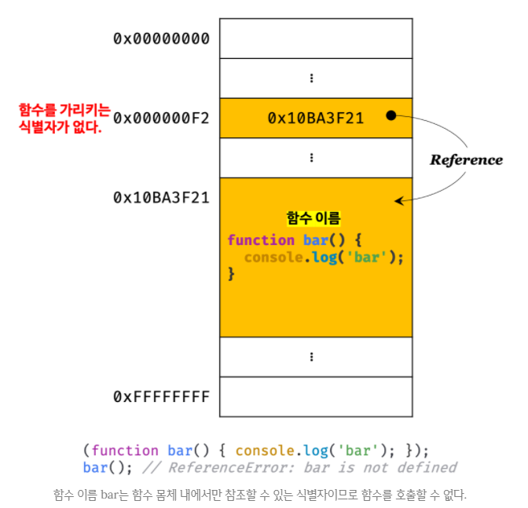
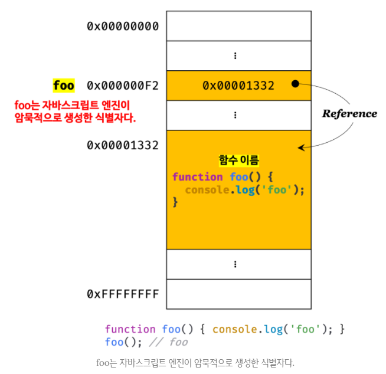
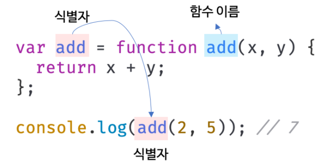
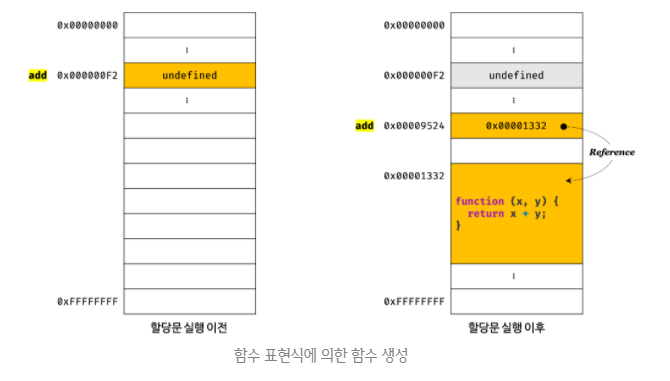
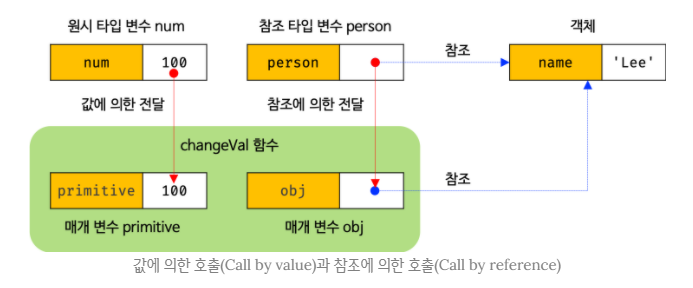

## JAVASCRIPT
<details open>
<summary>함수</summary>
<div markdown="12">

#### 함수란
- 일련의 과정을 문(statement)으로 구현하고 코드 블록으로 감싸서 하나의 실행단위로 정의한 것이다.
- 함수는 `값`이며, 여러 개 존재할 수 있으므로 특정 함수를 구별하기 위해 식별자인 함수 이름을 사용할 수 있다.
- `매개변수(parameter)` : 함수 내부로 입력을 받는 변수
- 입력을 `인수(argument)`, 출력을 `반환값(return value)`
- 함수는 `함수 정의(function definition)`를 통해 생성한다.
- 함수정의 후, 인수(argument)를 매개변수를 통해 함수에 전달하면서 함수의 실행을 명시적으로 지시해야한다. → 함수 호출(function call/invoke)
- 함수를 호출하면 코드블록에 담긴 문들이 실행되고, 반환값을 반환한다.

#### 함수의 사용이유
- 함수는 필요할 때 여러 번 호출할 수 있다. → `코드 재사용` 측면에서 유용하다.
- 유지보수의 편의성을 높이고 실수를 줄여 코드의 신뢰성을 높이는 효과가 있다.
- `함수는 객체 타입의 값이다.` 따라서 이름(식별자)를 붙일 수 있다. 적절한 함수의 이름은 함수 내부 코드를 이해하지 않고도 함수의 역할을 파악할 수 있게 돕는다. → 이는 코드의 `가독성`을 향상시킨다.

#### 함수 리터럴
- 자바스크립트의 `함수는 객체 타입의 값이다.` 따라서 함수도 함수 리터럴로 생성할 수 있다.
- 함수 리터럴은 `function 키워드`, `함수 이름`, `매개변수 목록`, `함수 몸체`로 구성된다.
```javascript
var f = function add(x, y){
	return x + y;
};
```
- 리터럴은 값을 생성하기 위한 표기법이다. 따라서 함수 리터럴도 평가되어 값을 생성하며, 이 값은 객체다. 즉, `함수는 객체다.`
- 함수는 객체지만 일반 객체와는 다르다. `일반 객체는 호출할 수 없지만 함수는 호출할 수 있다.` 또한, 일반 객체에는 없는 함수 객체만의 고유한 프로퍼티를 갖는다.
- 함수가 객체라는 사실은 다른 프로그래밍 언어와 구별되는 자바스크립트의 중요한 특징이다.

1. 함수 이름
- 함수 이름은 식별자다. 따라서 식별자 네이밍 규칙을 준수해야 한다.
- 함수 이름은 `함수 몸체 내`에서만 참조할 수 있는 식별자다.
- 함수 이름은 생략할 수 있다. 이름이 있는 함수를 `기명함수(named function)`, 이름이 없는 함수를 `무명/익명 함수(anonymous function)`라 한다.

2. 매개변수 목록
- 0개 이상의 매개변수를 소괄호로 감싸고 쉼표로 구분한다.
- 각 매개변수에는 함수를 호출할 때 지정한 인수가 순서대로 할당된다. 즉, 매개변수 목록은 `순서에 의미가 있다.`
- 매개변수는 함수 몸체 내에서 변수와 동일하게 취급된다. 따라서 매개변수도 변수와 마찬가지로 식별자 네이밍 규칙을 준수해야 한다.

3. 함수 몸체
- 함수가 호출되었을 때 일괄적으로 실행될 문들을 하나의 실행 단위로 정의한 코드 블록이다.
- 함수 몸체는 함수 호출에 의해 실행된다.

#### 함수 정의
- `함수 정의` : 호출하기 이전에 인수를 전달받을 매개변수와 실행할 문들, 그리고 반환할 값들을 지정하는 것
- 정의된 함수는 자바스크립트 엔진에 의해 평가되어 함수 객체가 된다. 
- 함수를 정의하는 방법에는 `4가지`가 있다.

1. `함수 선언문(function declaration/function statement)`
```javascript
function add(x, y){
	return x + y;
}
```

2. `함수 표현식(function expression)`
```javascript
var add = function (x, y){
	return x + y;
};
```

3. `Function 생성자 함수(Function constructor)`
```javascript
var add = new Function(‘x’, ‘y’, ‘return x + y’);
```

4. `화살표 함수(arrow function): ES6`
```javascript
var add = (x, y) => x + y;
```
#### 변수 선언과 함수 정의
- `변수는 선언(declaration)` 한다고 했지만 `함수는 정의(definition)`한다고 표현했다. 함수 선언문이 평가되면 식별자가 암묵적으로 생성되고 함수 객체가 할당된다. 
- 따라서 ECMAScript 사양에서도 `변수에는 선언(variable declaration)`, `함수에는 정의(function definition)`라고 표현한다.

#### 함수 선언문
```javascript
function add(x, y) {
	return x + y;
}

// console.dir은 console.log와는 달리 함수 객체의 프로퍼티까지 출력한다.
// 단, Node.js 환경에서는 console.log와 같은 결과를 출력한다.
console.dir(add); // f add(x, y)

console.log(add(2, 5)); // 7
```
- 함수 선언문은 함수 리터럴과 형태가 동일하다. 
- 단, 함수 리터럴은 함수 이름을 생략할 수 있으나, `함수 선언문은 함수 이름을 생략할 수 없다.` 
- `함수 선언문은 표현식이 아닌 문이다.` 즉, 크롬 개발자 도구의 콘솔에서 함수 선언문을 실행하면 완료값 undefined가 출력된다. 만약 함수 선언문이 표현식인 문이라면 완료값 undefined 대신 표현식이 평가되어 생성된 함수가 출력되어야 한다.
- 표현식이 아닌 문은 변수에 할당할 수 없다. 
- 함수 선언문도 표현식이 아닌 문이므로 변수에 할당할 수 없다.
- 하지만, 다음 예제를 보면 함수 선언문이 변수에 할당되는 것처럼 보인다.
```javascript
var add = function add(x, y) {
	return x + y;
}

console.log(add(2, 5)); // 7
```
##### 이렇게 동작하는 이유? 
- 자바스크립트 엔진이 코드의 문맥에 따라 동일한 함수 리터럴을 표현식이 아닌 문, 함수 선언문으로 해석하는 경우와
- 표현식인 문인 함수 리터럴 표현식으로 해석하는 경우가 있기 때문이다.
- 함수 선언문은 함수 이름을 생략할 수 없다는 점을 제외하면 함수 리터럴과 형태가 동일하다.
- 이는 함수 이름이 있는 기명함수 리터럴은 `함수선언문` 또는 `함수리터럴 표현식`으로 해석될 가능성이 있다는 의미이다.
- `기명함수 리터럴도 중의적인 코드`이다.
- 따라서 코드의 문맥에 따라 해석이 달라질 수 있다.
- 자바스크립트 엔진은 함수 이름이 있는 함수리터럴을 단독으로 사용하면, 함수 선언문으로 해석하고(함수리터럴을 피연산자로 사용하지 않는 경우)
- 함수리터럴이 값으로 평가되어야 하는 문맥, 예를 들어 함수 리터럴을 변수에 할당하거나 피연산자로 사용하면 함수리터럴 표현식으로 해석한다.
- 함수선언문, 함수 리터럴 표현식이든 `함수가 생성되는 것은 동일`하나, 함수를 생성하는 내부 동작에 차이가 있다.
```javascript
function foo() { console.log(‘foo’); }
foo(); // foo

(funciton bar() { console.log(‘bar’); });
bar(); // ReferenceError: bar is not defined
```
- 위 예제에서 단독으로 사용된 함수 리터럴(foo)은 함수 선언문으로 해석된다.
- 하지만, 그룹 연산자 () 내에 있는 함수 리터럴(bar)은 함수리터럴 표현식으로 해석된다. 그룹 연산자의 피연산자는 값으로 평가될 수 있는 표현식이어야 한다. 따라서 표현식이 아닌 문인 함수 선언문은 피연산자로 사용할 수 없다.
- `함수 리터럴`에서 `함수 이름`은 `함수 몸체 내에서만 참조할 수 있는 식별자`다. 이는 함수 몸체 외부에서는 함수 이름으로 함수를 참조할 수 없으므로, 함수 몸체 외부에서는 함수 이름으로 함수를 호출할 수 없다는 의미 → 함수를 가리키는 식별자가 없다는 것이다. 따라서 위 예제의 bar 함수는 호출할 수 없다.
<br />



- 위 예제에서는 함수선언문으로 정의된 함수 foo는 이름으로 호출할 수 있었다.
- 함수이름은 함수 몸체 내부에서만 유효한 식별자이므로 함수 이름과는 별도로 생성된 함수 객체를 가리키는 식별자가 필요하다.
- 자바스크립트 엔진은 생성된 함수를 호출하기 위해 함수이름과 동일한 이름의 `식별자를 암묵적으로 생성`하고, 거기에 생성된 객체를 할당한다.
<br />



- 함수는 함수 이름으로 호출하는 것이 아니라 함수 객체를 가리키는 `식별자로 호출`한다.
<br />


- 자바스크립트 엔진은 함수 선언문을 함수 표현식으로 변환해 `객체를 생성`한다.
- 단, 함수 선언문과 함수 표현식이 정확히 동일하게 동작하는 것은 아니다.

#### 함수 표현식(function expression)
- 자바스크립트의 함수는 값처럼 변수에 할당할 수도 있고, 프로퍼티 값이 될 수도 있으며 배열의 요소가 될 수도 있다.
- 이처럼 값의 성질을 갖는 객체를 `일급 객체(first-class object)`라고 한다.
- `자바스크립트의 함수는 일급 객체이다.` 
- 일급 객체라는 것은 함수를 값처럼 자유롭게 사용할 수 있다는 의미이다.
- 함수는 일급 객체이므로 함수리터럴로 생성한 함수 객체를 변수에 할당할 수 있다. 이러한 정의방식을 `함수표현식(function expression)`이라 한다. 
```javascript
// 함수 표현식
var add = function (x, y) {
	return x + y;	
};
console.log(add(2, 5)); // 7
```
- 함수 표현식의 함수 리터럴은 함수 이름을 생략하는 것이 일반적이다.

```javascript
// 기명 함수 표현식
var add = function foo (x, y) {
	return x + y;	
};
console.log(foo(2, 5)); // ReferenceError: foo is not defined
```
- 함수를 호출할 때는 함수 이름이 아니라, 함수 객체를 가리키는 식별자를 사용해야 한다. 
- 함수 이름은 함수 몸체에서만 유효한 식별자이므로 함수 이름으로 함수를 호출할 수 없다.
- 함수 선언문은 “표현식이 아닌 문”이고 함수 표현식은 “표현식인 문”이다. 따라서 미묘하지만 중요한 차이가 있다.

#### 함수 생성 시점과 함수 호이스팅
```javascript
// 함수 참조
console.dir(add); // f add(x, y)
console.dir(sub); // undefined

// 함수 호출
console.log(add(2, 5)); //7
console.log(sub(2, 5)); // TypeError: sub is not a function

// 함수 선언문
function add(x, y) {
	return x + y;
}

// 함수 표현식
var sub = function (x, y) {
	return x - y;
};
```
- `함수 선언문`으로 정의한 함수는 `함수 선언문 이전에 호출할 수 있다.`
- `함수 표현식`으로 정의한 함수는 `함수 표현식 이전에 호출할 수 없다.`
- 이는 함수 선언문으로 정의한 함수와 표현식으로 정의한 함수의 생성 시점이 다르기 때문이다.

- 모든 선언문이 그렇듯 함수 선언문도 코드가 한 줄씩 순차적으로 실행되는 시점인(runtime) 이전에 자바스크립트 엔진에 의해 먼저 실행된다.
- 함수 선언문으로 함수를 정의하면 런타임 이전에 함수 객체가 먼저 생성된다. 그리고 자바스크립트 엔진은 함수 이름과 동일한 이름의 식별자를 암묵적으로 생성하고 생성된 함수 객체를 할당한다.
- 즉, `런타임에는 이미 함수 객체가 생성`되어 있고, `함수 이름과 동일한 식별자에 할당까지 완료된 상태`다.
- 따라서 함수 선언문 이전에 함수를 참조할 수 있으며 호출할 수도 있다.
- 함수 선언문이 코드의 선두로 끌어 올려진 것처럼 동작하는 자바스크립트 고유의 특징을 `함수 호이스팅(function hoisting)`이라 한다. 

- `함수 표현식` = `변수 선언문` + `변수 할당문`
- 변수 선언은 런타임 이전에 실행되어 undefined로 초기화되지만, 변수 할당문의 값은 할당문이 실행되는 시점, 즉 런타임에 평가되므로 함수 표현식의 함수 리터럴도 `할당문이 실행되는 시점에 평가되어 함수 객체가 된다.`
- 따라서 함수 표현식으로 함수를 정의하면 함수 호이스팅이 발생하는 것이 아니라 변수 호이스팅이 발생한다. 
<br />


- 함수 표현식 이전에 함수를 참조하면 undefined로 평가된다. 따라서 이때 함수를 호출하면 undefined를 호출하는 것과 마찬가지이므로 타입 에러(TypeError)가 발생한다.
- 따라서 `함수 표현식`으로 정의한 함수는 `반드시 함수 표현식 이후에 참조 또는 호출`해야 한다.
- 함수 호이스팅은 함수를 호출하기 전에 반드시 선언해야 한다는 규칙을 무시한다. 
- 이 같은 문제 때문에 함수 선언문 대신 함수 표현식을 권장한다. 

#### 함수 호이스팅과 변수 호이스팅의 차이점
- `공통점` : 런타임 이전에 자바스크립트 엔진에 의해 먼저 실행되어 식별자를 생성한다.
- `차이점` : var 키워드로 선언된 변수는 undefined로 초기화되고, 함수 선언문을 통해 암묵적으로 생성된 식별자는 함수 객체로 초기화된다.
- 따라서 var 키워드를 사용한 변수 선언문 이전에 변수를 참조하면 변수 호이스팅에 의해 undefined로 평가되지만, 함수 선언문으로 정의한 함수를 함수 선언문 이전에 호출하면 함수 호이스팅에 의해 호출이 가능하다.
```javascript
var add = function foo(x, y) {
	return x + y;
};
console.log(add(2, 5)); // 7
console.log(foo(2, 5)); // ReferenceError: foo is not defined, 함수 이름은 함수 몸체 내부에서만 유효한 식별자다.
```

```javascript
foo(); //  TypeError: foo is not a function, foo는 undefined로 초기화되어서 undefined가 들어있는데 함수호출을 해서 타입이 맞지않음
var foo = function () {
	console.log('foo');
};
```
```javascript
var add = function (x, y) {
  var sum = x + y;
  return sum;
};

console.log(add(2, 3)); // 5
```
- 함수를 정의하면 add와 sum이 모두 선언될까?
- 함수 정의만 하면 add만 선언된다.
- add 함수가 호출되면 함수 지역을 대상으로 선언문을 찾고, sum을 선언한다.

#### Function 생성자 함수
- 자바스크립트가 기본 제공하는 빌트인 함수인 Function 생성자 함수에 매개변수 목록과 함수 몸체를 문자열로 전달하면서 new 연산자와 함께 호출하면 함수 객체를 생성해서 반환한다.
- 사실 new 연산자 없이 호출해도 결과는 동일하다.
```javascript
var add = new Function(‘x’, ‘y’, ‘return x + y’);

console.log(add(2, 5)); //7
```
- Function 생성자 함수로 함수를 생성하는 방식은 일반적이지 않으며 바람직하지 않다.
- Function 생성자 함수로 생성한 함수는 클로저(closure)를 생성하지 않는 등, 함수 선언문이나 함수 표현식으로 생성한 함수와 다르게 동작한다.

```javascript
var add1 = (function () {
	var a = 10;
	return function (x, y) {
		return x + y + a;
	};
}());

console.log(add1(1, 2)); // 13

var add2 = (function () {
	var a = 10;
	return new Function(‘x’, ‘y’, ‘return x + y + a;’);
}());

console.log(add2(1, 2)); //ReferenceError: a is not defined
```
#### 생성자 함수(constructor function)
- `생성자 함수`는 `객체를 생성하는 함수`를 말한다.
- 객체를 생성하는 방식은 객체 리터럴 이외에 다양한 방법이 있다.

#### 화살표 함수
- ES6에서 새롭게 도입된 화살표 함수(arrow function)는 function 키워드 대신 화살표(=>, fat arrow)를 사용해 좀 더 간략한 방법으로 함수를 선언할 수 있다.
- 화살표 함수는 항상 `익명`으로 정의한다.
```javascript
// 화살표 함수
const add = (x, y) => x + y;
console.log(add(2, 5)); // 7
```
- 화살표 함수는 기존의 함수보다 표현만 간략한 것이 아니라 `내부 동작 또한 간략화` 되어 있다.
- 화살표 함수는 `생성자 함수로 사용할 수 없으며`, 기존의 함수와 `this 바인딩 방식이 다르고`, `prototype 프로퍼티가 없으며` `arguments 객체를 생성하지 않는다.`

#### 함수 호출
- 함수를 호출하면 현재의 실행 흐름을 중단하고 호출된 함수로 실행흐름을 옮긴다.
- 이때 매개변수에 인수가 순서대로 할당되고 함수 몸체의 문들이 실행되기 시작한다.

#### 매개변수와 인수
- 값을 함수 외부에서 함수 내부로 전달할 필요가 있는 경우, 매개변수(parameter)를 통해 인수(argument)를 전달한다.
- 인수는 값으로 평가될 수 있는 표현식이어야 한다. 
- 인수는 개수와 타입에 제한이 없다.
- `매개변수`는 `함수 몸체 내부`에서 `변수와 동일하게 취급`된다.
- 즉, 함수가 호출되면 함수 몸체 내에서 암묵적으로 매개변수가 생성되고 일반 변수와 마찬가지로 `undefined로 초기화`된 이후 인수가 순서대로 할당된다.
- 매개변수는 함수 몸체 내부에서만 참조할 수 있고, 함수 몸체 외부에서는 참조할 수 없다.
- 즉, `매개변수의 스코프(유효범위)는 함수 내부`이다.

- 함수는 매개변수의 개수와 인수의 개수가 일치하는지 체크하지 않는다.
- 인수가 부족해서 인수가 할당되지 않은 매개변수의 값은 `undefined`이다.
```javascript
function add(x, y) {
	return x + y;
}
console.log(add(2)); // 2 + undefined = NaN
```
- 매개변수보다 인수가 더 많은 경우 초과된 인수는 무시된다.
```javascript
function add(x, y) {
	return x + y;
}
console.log(add(2, 5, 10)); // 7
```
- 사실 초과된 인수는 그냥 버려지는 것이 아니다.
- 모든 인수는 암묵적으로 `arguments 객체`에 보관된다.
- `가변인자` : 인자가 몇 개 넘어올지 모른다. → 매개변수를 몇 개써야 할지 모름
- 매개변수를 안주고 함수안에서 인수가 몇 개 전달 받았는지 알 수 있음 → `argumnets`
- `arguments`는 `유사배열객체`이다.(length 존재)
- `arguments[0]`에서 0은 프로퍼티 키이고, 문자열이다. 

```javascript
function add(x, y) {
	console.log(arguments);
	// Arguments(3) [2, 5, 10, callee: f, Symbol(Symbol.iterator): f]
	return x + y;
}
add(2, 5, 10);
```
- `callee 프로퍼티`는 `실행 중인 함수`를 의미한다.
- arguments 객체는 함수를 정의할 때, 매개변수 개수를 확정할 수 없는 가변인자함수를 구현할 때 유용하게 사용된다.

```javascript
// ES5
function sum() {
	var res = 0;
	for(let i = 0; i < arguments.length; i++) res += arguments[i];
	return res;
}
console.log(sum(1, 2, 3)); // 6
```

```javascript
// ES6
const sum = (...args) => args.reduce((acc, curr) => acc + curr, 0);
var result = sum(1, 2, 3, 4, 5);
console.log(result); // 15
```

#### 인수확인
- 자바스크립트의 함수는 매개변수와 인수의 개수가 일치하는지 확인하지 않는다.
- 자바스크립트는 동적 타입 언어다. 따라서 자바스크립트 함수는 매개변수의 타입을 사전에 지정할 수 없다.
- 따라서 자바스크립트의 경우 함수를 정의할 때 적절한 인수가 전달되었는지 확일 할 필요가 있다.
```javascript
function add(x, y) {
	if(typeof x !== ‘number’ || typeof y !== ‘number’) {
		throw new TypeError(‘인수는 모두 숫자 값이어야 합니다.’);
	}
	return x + y;
}
console.log(add(2)); // TypeError: 인수는 모두 숫자 값이어야 합니다.
console.log(add(‘a’, ‘b’)); // TypeError: 인수는 모두 숫자 값이어야 합니다.
```
- `throw문`은 사용자 정의 예외를 던질 수 있다. 현재 함수의 실행이 중지되고(throw 이후의 명령문은 실행되지 않는다.)
- 예외를 던질 때 객체를 지정할 수 있다. 위 예제는 TypeError 유형의 객체를 만들고 throw 구문에서 이 객체를 사용한 것이다.
- 이처럼 함수 내부에서 적절한 인수가 전달되었는지 확인하더라도 부적절한 호출을 사전에 방지할 수는 없고 에러는 런타임에 발생하게 된다.
- `타입스크립트(TypeScript)`와 같은 정적타입을 선언할 수 있는 자바스크립트의 상위확장을 도입해서 컴파일 시점에 부적절한 호출을 방지할 수 있게 하는 것도 하나의 방법이다.
- 타입스크립트는 런타임이전에 타입이 안맞으면 오류발생하면서 실행을 하지 않는다.

- 앞의 예제의 경우, 인수의 개수는 확인하고 있지만 arguments 객체를 통해 인수 개수를 확인할 수도 있다.
- 또한, 인수가 전달되지 않은 경우 `단축평가`를 사용해 매개변수에 기본값을 할당하는 방법도 있다.
```javascript
function add(a, b, c) {
a = a || 0;
b = b || 0;
c = c || 0;
return a + b + c;
}
console.log(add(1,2)); // 3(c에는 0이 들어감)
```

- ES6에서 도입된 매개변수 기본값을 사용하면 함수 내에서 수행하던 인수 체크 및 초기화를 간소화할 수 있다.
- 기본값은 매개변수에 인수를 전달하지 않았을 경우와 undefined를 전달한 경우에만 유효하다.
```javascript
function add(a = 0, b = 0, c = 0){
	return a + b + c;
}
console.log(add(1, 2)); // 3
```

#### 매개변수의 최대개수
- ECMAScript 사양에서는 매개변수의 최대개수에 대해 명시적으로 제한하고 있지 않다.
- 매개변수가 많아지면 함수를 호출할 때 전달해야 할 인수의 순서를 고려해야 한다.
- 객체의 프로퍼티 순서는 의미가 없으나, 배열은 의미가 있다.(인덱스)
- 이는 함수의 사용법을 이해하기 어렵게 만들고 실수를 발생시킬 가능성을 높인다.
- 또한 매개변수의 개수나 순서가 변경되면 함수의 호출 방법도 바뀌므로 함수를 사용하는 코드 전체가 영향을 받는다. → 유지보수성이 나빠진다.
- 함수의 매개변수는 코드를 이해하는데 방해가 되는 요소이므로, `이상적인 매개변수의 개수는 0개`이며 적을수록 좋다.
- 이상적인 함수는 한 가지 일만 해야 하며 가급적 작게 만들어야 한다.
- 따라서 매개변수는 `최대 3개 이상을 넘지 않는 것을 권장`한다.
- 만약 그 이상의 매개변수가 필요하다면 하나의 `매개변수를 선언하고 객체를 인수로 전달`하는 것이 유리하다.
- 매개변수로 객체를 넘기면 값이 무엇을 의미하는지 프로퍼티 키에 의해 정확히 알 수 있기때문에 가독성이 좋다.
- 매개변수로 객체를 넘겼을 때 문제점 : `외부 값에 대한 변경`, 매개변수에 할당이 될 때, 원시값은 불변하므로 안전하지만 객체를 인수로 넘기면 내부에서 값을 변경하면 외부의 객체도 바뀌게 된다.
- 해결법 : 프로퍼티를 원시값처럼 불변성을 유지하게 만든다.
- `불변성을 유지한다.` = `1. 값을 복사(깊은복사)` `2. 값을 바꿀 수 없는 상태로 만든다.(read only)`

```javascript
$.ajax({
	method: ‘POST’,
	url: ‘/user’,
	data: { id: 1, name: ‘Lee’ },
	cache: false
});
```
- `객체를 인수로 사용하는 경우` 프로퍼티 키만 정확히 지정하면 `매개변수의 순서를 신경 쓰지 않아도 된다.`
- 또한, 명시적으로 인수의 의미를 설명하는 프로퍼티 키를 사용하게 되므로 코드의 가독성이 좋아지고 실수도 줄어드는 효과가 있다.
- ※주의점 : 함수 외부에서 함수 내부로 전달한 객체를 함수 `내부에서 변경하면 함수 외부의 객체가 변경되는 부수효과가 발생`한다. 

#### 반환문
- 함수는 `return 키워드`와 표현식(반환값)으로 이뤄진 반환문을 사용해 실행 결과를 함수 외부로 반환(return)할 수 있다.
- `함수 호출은 표현식`이다. 
- 함수 호출 표현식은 return 키워드가 반환한 표현식의 평가 결과, 즉 `반환값으로 평가`된다.
- 반환문의 2가지 역할
	1. 반환문은 함수의 실행을 중단하고 함수 몸체를 빠져나간다. 따라서 반환문 이후에 	다른 문이 존재하면 실행되지 않고 무시된다.
	2. 반환문은 return 키워드 뒤에 오는 표현식을 평가해 반환한다. return 키워드 뒤에 반환값으로 사용할 표현식을 명시적으로 지정하지 않으면 `undefined`가 반환된다.
```javascript
function foo () {
	return;
}
console.log(foo()); // undefined
```
- 반환문은 생략할 수 있다. 이때 함수는 함수 몸체의 마지막 문까지 실행한 후 암묵적으로 undefined를 반환한다.
```javascript
function foo () {}
console.log(foo()); // undefined
```
- return 키워드와 반환값으로 사용할 표현식 사이에 줄 바꿈이 있으면 `세미콜론 자동 삽입 기능`에 의해 세미콜론이 추가되어 의도치 않은 결과가 발생할 수 있다.
```javascript
function multifly (x, y) {
	return // 세미콜론 자동 삽입기능(ASI)에 의해 세미콜론이 추가된다.
 	x + y; // 무시된다.
}
console.log(multifly(3, 5)); // undefined
```
- 반환문은 함수 몸체 내부에서만 사용할 수 있다. `전역에서 반환문을 사용하면 문법 에러`(SyntaxError: Illegal return statement)가 발생한다.
- 참고로 Node.js는 모듈 시스템에 의해 파일별로 독립적인 파일 스코프를 갖는다. 따라서 Node.js 환경에서는 파일의 가장 바깥 영역에 반환문을 사용해도 에러가 발생하지 않는다.

```javascript
var returnOfIIFE = (function () {
	var v1 = 'get me out!'
	console.log(v1);
})();

console.log(returnOfIIFE); // 'get me out!' undefined
// v1이 출력, 반환이 아님, 반환은 undefined
```
- `console.log()`는 console 객체의 log 메서드를 말하며, log 메서드가 호출되면, 인수로 전달된 표현식을 콘솔에 출력한다. 함수 리턴값과 무관한다.

#### 참조에 의한 전달과 외부 상태의 변경
- `원시값`은 `값에 의한 전달(pass by value)`, `객체`는 `참조에 의한 전달(pass by reference)`
- 매개변수도 함수 몸체 내부에서 변수와 동일하게 취급되므로 매개변수 또한 타입에 따라 값에 의한 전달, 참조에 의한 전달 방식을 그대로 따른다.
- 매개변수에 값을 전달하는 2가지 방식(값, 참조에 의한 전달) 모두 동작방식은 동일하다.
```javascript
function changeVal(primitive, obj){
	primitive += 100;
	obj.name = ‘Kim’;
}

var num = 100;
var person = { name: ‘Lee’ };

console.log(num); // 100
console.log(person); // {name: “Lee”}

changeVal(num, person);

console.log(num); // 100, 원본이 훼손되지 않음
console.log(person); // {name: “Kim”}, 원본이 훼손됨
```
- 매개변수 primitive의 경우, 원시값은 변경 불가능한 값(immutable value)이므로 직접 변경할 수 없기 때문에 재할당을 통해 할당된 새로운 원시값으로 교체했고, 객체 타입 인수를 전달받은 매개변수 obj의 경우, 객체는 변경 가능한 값(mutable value)이므로 직접 변경할 수 있기 때문에 재할당 없이 직접 할당된 객체를 변경했다.
- 원시 타입 인수는 값 자체가 복사되어 매개변수에 전달되기 때문에 함수 몸체에서 그 값을 변경(재할당을 통한 교체)해도 원본은 훼손되지 않는다. 
- 즉, 함수의 외부에서 함수 몸체 내부로 전달된 원시값의 원본을 변경하는 어떠한 부수효과도 발생하지 않는다.
- 객체 타입 인수는 `참조값이 복사`되어 매개변수에 전달되기 때문에 함수 몸체에서 참조값을 통해 객체를 변경할 경우 원본이 훼손된다.
- 함수 외부에서 함수 몸체 내부로 전달된 참조값에 의해 원본 객체가 변경되는 `부수효과가 발생`한다.
<br />


- 이처럼 함수가 외부상태(위 예제의 경우, 객체를 할당한 person)를 변경하면 상태변화를 추적하기 어려워진다.
- 이는 코드의 복잡성을 증가시키고 가독성을 해치는 원인이 된다.
- 객체의 변경을 추적하려면 `옵저버(Observer) 패턴` 등을 통해 객체를 참조를 공유하는 모든 이들에게 변경 사실을 통지하고 이에 대처하는 추가 대응이 필요하다.

```javascript
// 얕은 복사
function changeVal(primitive, obj) {
	primitive += 100;
	var copy = { ...obj };
	copy.name = 'Kim';
	return [primitive, copy];
}
var num = 100;
var person = { name: 'Lee' };
console.log(changeVal(num, person)); // [200, {name:“Kim“}]
console.log(num); // 100 
console.log(person); // {name: “Lee“}
```
```javascript
// 얕은 복사
function changeVal(primitive, obj) {
	primitive += 100;
	var copy = Object.assign({}, obj);
	copy.name = 'Kim';
	return [primitive, copy];
}
var num = 100;
var person = { name: 'Lee' };
console.log(changeVal(num, person)); // [ 200, { name: 'Kim' } ]
console.log(num); // 100
console.log(person); // { name: 'Lee' }
```
- 1번째 예제는 `{ ...obj }`, 스프레드 문법을 사용했고, 2번째 예제는 `Object.assign({}, obj)`, 함수를 사용했다.
- 2번째 예제처럼 함수를 사용하면 무엇을(어떤 타입을) 어떻게(어떤 순서로 몇 개나) 줘야하고, return값이 무엇이 나오고, 잘못줬을 때 어떻게 나오는지까지 알아야한다. 
- 1번째 예제의 스프레트 문법은 어떻게 표현하는지만 알면된다. (표현식이 함수보다 편하다.)

- 이러한 문제의 해결방법 중 하나는 `객체를 불변 객체(immutable object)로 만들어 사용`하는 것이다.
- 객체의 복사본을 새롭게 형성하는 비용은 들지만 객체를 마치 원시값처럼 변경 불가능한 값으로 동작하게 만드는 것이다. 이를 통해 객체의 상태 변경을 원천봉쇄하고 객체의 상태 변경이 필요할 경우에는 객체의 방어적 복사(defensive copy)를 통해 원본 객체를 완전히 복제, 즉 `깊은 복사(Deep copy)를 통해 새로운 객체를 생성하고 재할당을 통해 교체`한다.
- 이를 통해 외부 상태가 변경되는 부수효과를 없앨 수 있다.
- 외부 상태를 변경하지 않고 외부 상태에 의존하지도 않는 함수를 순수 함수라 한다.
- `함수형 프로그래밍` : 순수 함수를 통해 부수효과를 최대한 억제하여 오류를 피하고 프로그램의 안정성을 높이려는 프로그래밍 패러다임

#### 다양한 함수의 형태
1. `즉시실행 함수(IIFE, immediately Invoked Function Expression)`
- `함수 정의와 동시에 즉시 호출되는 함수`를 즉시실행 함수라고 한다.
- 즉시실행 함수는 `단 한 번만 호출`되며 `다시 호출할 수 없다.`
```javascript
// 익명 즉시 실행 함수
(function (){
	var a = 3;
	var b = 5;
	return a * b;
}()); // 15
```

- 즉시실행 함수는 함수 이름이 없는 `익명 함수를 사용하는 것이 일반적`이다.
- 함수 이름이 있는 기명 즉시실행 함수도 사용할 수 있다.
- 하지만 그룹 연산자 (...)내에 기명함수는 함수 선언문이 아니라 함수 리터럴로 평가되며 함수 이름은 함수 몸체에서만 참조할 수 있는 식별자이므로 즉시실행 함수는 다시 호출할 수는 없다.
```javascript
(function foo() {
	var a = 3;
	var b = 5;
	return a * b;
}());

foo(); // ReferenceError: foo is not defined
```

- 즉시실행 함수는 반드시 그룹 연산자(...)로 감싸야 한다. 그렇지 않으면 다음과 같이 에러가 발생한다.
- () 앞이 함수객체로 평가되면 호출될 수 있다.
- ()가 실행되기 이전에 () 앞에 있는 문이 값으로 평가될 수 있는 함수객체가 되어야한다.
```javascript
function () { //SyntaxError: Function statements require a function name
	// ...
}();
```
- 위 예제에서 에러가 발생한 이유는 함수 정의가 함수 선언문의 형식에 맞지 않기 때문이다.
- 함수 선언문은 함수이름을 생략할 수 없다. 
- 그렇다면 기명 함수를 정의해 그룹 연산자 없이 호출해보자.
```javascript
function foo() {
	// ...
}(); // SyntaxError: Unexpected token ')'
```
- 에러가 발생한 이유는 자바스크립트 엔진이 암묵적으로 수행하는 세미콜론 자동 삽입 기능(ASI)에 의해 함수 선언문이 끝나는 위치, 즉 함수 코드 블록의 닫는 중괄호 뒤에 “;”이 암묵적으로 추가되기 때문이다.
- 따라서 함수 선언문 뒤의 (...)는 함수 호출 연산자가 아니라 그룹 연산자로 해석되고, `그룹 연산자에 피연산자가 없기 때문에 에러가 발생`한다.
- 그룹 연산자의 피연산자는 값으로 평가되므로 기명 또는 무명 함수를 그룹 연산자로 감싸면 함수 리터럴로 평가되어 함수 객체가 된다.
- 즉, 그룹 연산자로 함수를 묶은 이유는 먼저 함수 리터럴을 평가해서 함수 객체를 생성하기 위해서다.
- 따라서 먼저 함수 리터럴을 평가해서 함수 객체를 생성할 수 있다면 다음과 같이 그룹 연산자 이외의 연산자를 사용해도 좋다.
- 가장 일반적인 방법은 첫 번째 방식이다.
```javascript
(function () {
	// ...
}());

(function () {
	// ...
})(); // 추천

!function () {
	console.log(‘hi’);
}(); 
// ‘hi’, true 출력(return 값이 없으므로 암묵적으로 undefined 할당, !undefined = true)

+function () {
	console.log(‘hi’);
}();
// ‘hi’, NaN 출력(return 값이 없으므로 undefined 할당, +undefined이므로 NaN)
```
- 화살표 함수의 경우, `(() => ())();` 가능하지만, `(() => ()());` SyntaxError가 발생한다.

- 즉시실행 함수도 일반 함수처럼 값을 반환할 수 있고 인수를 전달할 수도 있다.
```javascript
var res = (function () {
	var a = 3;
	var b = 5;
	return a * b;
}());
console.log(res); //15

res = (function (a, b) {
	return a * b;
}(3, 5));
console.log(res); // 15
```
- 즉시실행 함수 내에 코드를 모아 두면 혹시 있을 수도 있는 `변수나 함수 이름의 충돌을 방지할 수 있다.`

2. `재귀함수(recursive call)`
- 함수가 `자기 자신을 호출하는 것을 재귀 호출(recursive call)`이라 한다.
- 재귀함수는 자기 자신을 호출하는 행위, 즉 재귀 호출을 수행하는 함수를 말한다.
- `깊은 복사`는 재귀함수를 이용할 수 있다.
- `파일 탐색기`에서도 재귀함수를 이용할 수 있다.
ex) 프로퍼티가 객체인가? → 맞다면 재귀호출 → 그 안이 또 객체인가? → 맞다면 또 재귀호출 ...
```javascript
function countdown(n) {
	for(var i = n; i >= 0; i--) console.log(i);
}
countdown(10); // 10 9 8 7 6 5 4 3 2 1 0
```
```javascript
function countdown(n) {
	if(n < 0) return;
	console.log(n);
	countdown(n-1); // 재귀 호출
}
```
- 자기 자신을 호출하는 재귀함수를 사용하면 반복되는 처리를 반복문 없이 구현할 수 있다.
- 예를 들어, 팩토리얼은 재귀 함수로 간단히 구현할 수 있다.

```javascript
function factorial(n) {
	if(n <= 1) return 1;
	return n * factorial(n-1);
}

console.log(factorial(5)); // 5! = 5*4*3*2*1 = 120
```
- 함수 이름은 함수 몸체 내부에서만 유효하다. 따라서 `함수 내부에서는 함수 이름을 사용해 자기 자신을 호출할 수 있다.`
- 함수 표현식으로 정의한 함수 내부에서는 함수 이름은 물론 함수를 가리키는 `식별자로도 자기 자신을 재귀 호출할 수 있다.`

```javascript
// 함수 표현식
var factorial = function foo(n) {
	if(n <= 1) return 1;
	return n * factorial(n-1);
}

console.log(factorial(5)); 120
```
- 재귀함수는 자신을 무한 재귀 호출한다. 따라서 재귀 함수 내에는 재귀호출을 멈출 수 있는 `탈출 조건`을 반드시 만들어야 한다.
- `탈출 조건`이 없으면 함수가 무한 호출되어 `스택 오버플로(stack overflow) 에러`가 발생한다.
- `탈출 조건`이 없으면 `call stack` 또는 `실행 컨텍스트 stack`이 쌓여 `스택 오버플로(stack overflow)` 에러가 발생
- 함수는 호출될 때마다 실행 컨텍스트를 만든다. → 재귀함수를 무분별하게 사용하면 안된다.

- 대부분의 재귀 함수는 for 문이나 while문으로 구현가능하다.
```javascript
function factorial(n) {
	if(n <= 1) return 1;

	var res = n;
	while(--n) res *= n;
	return res;
}
console.log(factorial(5)); // 120
```
- `재귀함수의 장점` : `반복되는 처리를 반복문 없이 구현할 수 있다.`
- `재귀함수의 단점` : `무한 반복`에 빠질 위험이 있다. → `스택 오버플로 에러` 발생
- 따라서 재귀함수는 반복문을 사용하는 것보다 재귀함수를 사용하는 편이 더 직관적으로 이해하기 쉬운 경우만 한정적으로 사용하자.

3. `중첩함수(nested function)`
- 함수 내부에 정의된 함수를 `중첩 함수(nested function)` 또는 `내부 함수(inner function)`라 한다.
- 중첩 함수를 포함하는 함수는 외부 함수(outer function)라 부른다.
- 일반적으로 중첩함수는 자신을 포함하는 외부 함수를 돕는 `헬퍼 함수(helper function)`의 역할을 한다.
- 중첩 함수는 `상속`의 의미를 내포하고 있다.
- `중첩함수를 사용하는 이유?` outer함수 내에서 inner함수를 여러번 사용한다면 inner함수 `로직을 재사용하기 위해 사용`한다.
```javascript
function outer() {
	var x = 1;
	// 중첩 함수
	function inner() {
		var y = 2;
		// 외부 함수의 변수를 참조할 수 있다.
		console.log(x + y); //3
	}
	inner();
}
outer();
```
- `ES6부터 함수 정의는 문이 위치할 수 있는 문맥이라면 어디든지 가능`하다.
- 함수 선언문의 경우 ES6 이전에는 코드의 최상위 또는 다른 함수 내부에서만 정의할 수 있었으나 ES6부터는 for문 등의 코드 블록 내에서도 정의할 수 있다.
- 단, 호이스팅으로 인해 혼란이 발생할 수 있으므로 if문, for문 등의 코드 블록에서 함수 선언문을 통해 함수를 정의하는 것은 바람직하지 않다.
- 중첩 함수는 스코프와 클로저에 깊은 관련이 있다.

4. `콜백함수(callback function)`
```javascript
// n만큼 어떤 일을 반복한다
function repeat(n) {
	for(var i = 0; i < n; i++) console.log(i);
}
repeat(5); // 0 1 2 3 4
```
- repeat 함수는 console.log(i)에 강하게 의존하고 있어 다른 일을 할 수 없다.
- 따라서 만약 repeat 함수의 반복문 내부에서 다른 일을 하고 싶다면 함수를 새롭게 정의해야 한다.
```javascript
function repeat1(n) {
	for(var i = 0; i < n; i++) console.log(i);
}
repeat1(5); // 0 1 2 3 4

function repeat2(n) {
	for(var i = 0; i < n; i++) {
		if(i % 2) console.log(i);
	}
}
repeat2(5); // 1 3
```
- 위 예제의 함수들은 반복하는 일은 공통적으로 수행하지만 반복하면서 하는 일이 다르다.
- 즉, 함수의 일부분만이 다르기 때문에 매번 함수를 새롭게 정의해야 한다.
- 이 문제를 함수의 변하지 않는 공통 로직은 미리 정의해두고, 경우에 따라 변경되는 로직은 추상화해서 함수 외부에서 함수 내부로 전달하는 것이다.
```javascript
function repeat(n, f) {
	for(var i = 0; i < n; i++) {
		f(i); // i를 전달하면서 f를 호출
	}
}

var logAll = function (i) {
	console.log(i);
};

repeat(5, logAll); // 0 1 2 3 4

var logOdds = function (i) {
	if(i % 2) console.log(i);
};

repeat(5, logOdds); // 1 3
repeat(5, console.log); // 0 1 2 3 4
  repeat(5, function() {
    console.log;
  }); // 0 1 2 3 4
```
- 위 repeat 함수는 경우에 따라 변경되는 일을 함수 f로 추상화했고 이를 외부에서 전달받는다.
- 자바스크립트의 함수는 `일급 객체`이므로 `함수의 매개변수를 통해 함수를 전달할 수 있다.`
- repeat 함수는 더 이상 내부 로직에 강력히 의존하지 않고 외부에서 로직의 일부분을 함수로 전달받아 수행하므로 더욱 유연한 구조를 갖게 되었다.
- `콜백함수` : `함수의 매개변수를 통해 다른 함수의 내부로 전달되는 함수`
- `고차함수(Higher-Order Function, HOF)` : 매개변수를 통해 함수의 외부에서 콜백함수를 전달받은 함수`(인수로 함수를 받은 함수)`, 매개변수를 통해 함수를 전달받거나 `반환값으로 함수를 반환하는 함수`
- `콜백함수`도 고차함수의 전달되어 `헬퍼함수의 역할`을 한다.
- 단, 중첩함수는 고정되어 있어서 교체하기 곤란하지만, 콜백함수는 함수 외부에서 고차함수 내부로 주입하기 때문에 자유롭게 교체할 수 있다는 장점이 있다. 즉, `고차함수는 콜백함수를 자신의 일부분으로 합성한다.`

- 고차함수는 매개변수를 통해 전달받은 콜백함수의 호출 시점을 결정해서 호출한다.
- `콜백함수는 고차함수에 의해 호출`되며 이때 고차함수는 필요에 따라 콜백함수에 인수를 전달할 수 있다. 따라서 콜백함수를 전달할 때 콜백함수를 호출하지 않고 함수 자체를 전달해야 한다.
- `모든 콜백함수가 고차함수에 의해 호출되는 것은 아니다.` 예를 들어, setTimeout 함수의 콜백함수는 setTimeout 함수가 호출되지 않는다.

- 콜백함수가 고차함수 내부에서만 호출된다면 `콜백함수를 익명함수 리터럴로 정의`하면서 곧바로 `고차 함수에 전달하는 것이 일반적`이다.
```javascript
repeat(5, function (i) {
	if (i % 2) console.log(i);
}); // 1 3
```
- 이때 콜백함수로서 전달된 함수 리터럴은 `고차함수가 호출될 때마다 평가되어 함수 객체를 선언`한다.
- 따라서 콜백함수를 다른 곳에서도 호출할 필요가 있거나, 콜백 함수를 전달받는 `함수가 자주 호출`된다면 함수 외부에서 `콜백함수를 정의한 후 함수 참조를 고차함수에 전달하는 편이 효율적`이다.
```javascript
var logOdds = function (i) {
	if(i % 2) console.log(i);
};

repeat(5, logOdds); // 1 3
```
- 위 예제에서 logOdds 함수는 `단 한 번만 생성`된다.
- 콜백함수는 함수형 프로그래밍 패러다임뿐만 아니라, 비동기처리(이벤트 처리, Ajax 통신, Timer 함수 등)에 활용되는 중요한 패턴이다.

```javascript
document.querySelector('myBtn').click = function() {
	console.log('click!!');
};
```

```javascript
// 콜백함수를 사용한 이벤트 처리
// mybutton을 클릭하면 콜백함수를 실행한다.
document.getElementById(‘myButton’).addEventListener(‘click’, function () {
	console.log(‘button click’);
});

// 콜백함수를 사용한 비동기 처리
// 1초 후에 메시지를 출력한다.
setTimeout(function () {
	console.log(‘1초 경과’);
}, 1000);
```
- 비동기 처리 : 고차함수가 콜백함수를 호출하지 않는 경우 ex) setTimeout

- 콜백 함수는 비동기 처리뿐 아니라 `배열 고차함수에서도 사용`된다. 자바스크립트에서 배열은 매우 사용 빈도가 높은 자료구조이고, 배열을 다룰 때 배열 고차 함수는 매우 중요하다.
```javascript
// 콜백 함수를 사용하는 고차 함수 map
var res = [1,2,3].map(function (item) {
	return item * 2;
});
console.log(res); // [2, 4, 6]

// 콜백 함수를 사용하는 고차 함수 filter
res = [1,2,3].filter(function (item) {
	return item % 2;
});
console.log(res); // [1, 3]

// 콜백 함수를 사용하는 고차 함수 reduce
res = [1, 2, 3].reduce(function (acc, cur) {
	return acc + cur
}, 0);
console.log(res); // 6
```

5. `순수함수(pure function)와 비순수함수(impure function)`
- `순수 함수(pure function)` : 어떤 외부 상태에 의존하지 않고 변경하지도 않는, 즉 `부수효과가 없는 함수`
- `비순수 함수(impure function)` : 외부 상태에 의존하거나 외부 상태를 변경하는, 즉, `부수효과가 있는 함수`
- 순수함수는 `동일한 인수가 전달되면 언제나 동일한 값`을 반환하는 함수
- 순수함수는 어떤 외부 상태에도 의존하지 않고 오직 매개변수를 통해 함수 내부로 전달된 인수에게만 의존해 반환값을 만든다.
- 객체의 매서드는 기본적으로 비순수함수다.(프로퍼티 값을 상태변경하면 외부 값도 바뀌기 때문)
```javascript
var count = 0;

// 순수함수
function increase(n) {
	return ++n;
	// 인수가 전달되면 언제나 +1된 값을 반환함
}

// 순수함수가 반환한 결과값을 변수에 재할당해서 상태를 변경
count = increase(count);
console.log(count); // 1

count = increase(count);
console.log(count); // 2
```
```javascript
// 순수 함수
// x, y값에 의존하지 않음 
// x, y는 함수 내에서만 바꿀 수 있음 
function add(x, y) {
	return x + y;
}

add(2, 3);
```

```javascript
// 비순수 함수
// 외부 변수 x, y에 의존
// x, y 를 바꿀 수 있는 영역이 많음(전역, 함수 내에서도 바꿀 수 있음)
// 읽기만해도 비순수 함수가 될 수 있음
var x = 0;
var y = 0;
function add() {
	return x + y;
}

add();
```

```javascript
var count = 0;

// 비순수 함수
function increase() {
	return ++count; // 외부상태에 의존하며 외부상태를 변경
}

// 비순수 함수는 외부상태(count)를 변경하므로 상태 변화를 추적하기 어렵다.
increase();
console.log(count); // 1

increase();
console.log(count); // 2
```
- 함수 내부에서 외부 상태를 직접 참조하지 않더라도 `매개변수를 통해 객체를 전달받으면` 비순수 함수가 된다.
```javascript
function changeVal(primitive, obj) {
  primitive += 100;
  obj.name = 'Kim';
}

var num = 100;
var person = { name: 'Lee' }

changeVal(num, person);

console.log(num); // 100
console.log(person); // {name: "Kim"}
```
- 함수의 외부 상태의 변경을 지양하는 `순수함수를 사용하는 것이 좋다.`
- 비순수함수는 코드 복잡성을 증가시킨다.
- 비순수함수를 최대한 줄이는 것은 부수효과를 최대한 억제하는 것과 같다.
- `함수형 프로그래밍`은 순수함수와 보조함수의 조합을 통해 외부 상태 변경를 변경하는 `부수효과를 최소화해서 불변성(immutability)을 지향하는 프로그래밍 패러다임`이다. 

</div> 
</details>

---