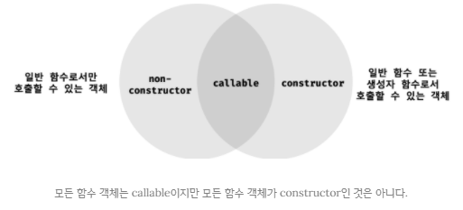

## JAVASCRIPT
<details open>
<summary>생성자 함수에 의한 객체 생성</summary>
<div markdown="17">

### 생성자 함수에 의한 객체 생성
- `객체 리터럴`에 의한 객체 생성 방식 
- `생성자 함수`를 사용한 객체 생성 방식

#### Object 생성자 함수
- new 연산자와 함께 Object 생성자 함수를 호출하면 빈 객체를 생성하여 반환한다.
- 빈 객체를 생성한 이후 프로퍼티 또는 메서드를 추가하여 객체를 완성할 수 있다.
```javascript
const person = new Object();

person.name = ‘Lee’;
person.sayHello = function() {
	console.log(‘Hi! My name is ’ + this.name);
};

console.log(person); // {name: “Lee”, sayHello: f}
person.sayHello(); // Hi! My name is Lee
```

- `생성자 함수(constructor)` : new 연산자와 함께 호출하여 객체(인스턴스)를 생성하는 함수
- `인스턴스(instance)` : 생성자 함수에 의해 생성된 객체
- 자바스크립트는 Object, String, Number, Boolean, Function, Array, Date, RegExp, Promise 등의 빌트인(built-in, 내장) 생성자 함수를 제공한다.
- 위의 예제에서 `Object`는 `window.Object()`의 의미이다.(`전역객체의 메소드`이다.)
- `Object.getOwnPropertyDescriptors(person);`에서의 Object와 위의 Object()는 같은 객체이다.
- `Object`는 객체로 평가된다.(함수도 객체이다.) → 정적 메소드라고 한다.
```javascript
const strObj = new String('Lee');
console.log(typeof strObj); // object
console.log(strObj); // String {"Lee"}

const numObj = new Number(123);
console.log(typeof numObj); // object
console.log(numObj); // Number {123}

const boolObj = new Boolean(true);
console.log(typeof boolObj); // object
console.log(boolObj); // Boolean {true}

const func = new Function('x', 'return x * x');
console.log(typeof func); // function
console.dir(func); // f annoymous(x)

const arr = new Array(1, 2, 3);
console.log(typeof arr); // object
console.log(arr); // [1, 2, 3]

const regExp = new RegExp(/ab+c/i);
console.log(typeof regExp); // object
console.log(regExp); // /ab+c/i

const date = new Date();
console.log(typeof date); // object
console.log(date); // 2020-12-01T08:50:22.329Z
```

#### 생성자 함수
1. 객체 리터럴에 의한 객체 생성 방식의 문제점
- 객체 리터럴에 의한 객체 생성 방식의 `장점` : 직관적이고 간편하다.
- 객체 리터럴에 의한 객체 생성 방식의 `단점` : 단 하나의 객체만 생성한다. 따라서 동일한 프로퍼티를 갖는 객체를 여러 개 생성해야 하는 경우 매번 같은 프로퍼티를 기술해야 하므로 비효율적이다.
```javascript
const circle1 = {
    radius: 5,
    // getDiameter : function() {
    //     return 2 * this.radius;
    // }
    getDiameter() {
        return 2 * this.radius;
    }
};

console.log(circle1.getDiameter());

const circle2 = {
    radius: 10,
    getDiameter() {
        return 2 * this.radius;
    }
};

console.log(circle2.getDiameter()); // 20

// circle1 객체와 circle2 객체는 프로퍼티 구조가 동일
``` 
- 객체는 `프로퍼티`를 통해 객체 고유 `상태(state)`를 표현한다.
- `메서드`를 통해 상태 데이터인 프로퍼티를 참조하고 조작하는 `동작(behavior)`을 표현한다.
- 따라서 프로퍼티는 객체마다 프로퍼티 값이 다를 수 있지만, 메서드는 내용이 동일한 경우가 일반적이다.
- 위의 예제는 객체의 고유의 상태 데이터인 radius 프로퍼티 값은 객체마다 다를 수 있지만, getDiameter 메서드는 완전히 동일하다.(`메서드의 중복`)

2. 생성자 함수에 의한 객체 생성 방식의 `장점`
- 생성자 함수에 의한 객체 생성 방식은 마치 `객체(인스턴스)`를 생성하기 위한 `템플릿(클래스)`처럼 생성자 함수를 사용하여 프로퍼티 구조가 동일한 객체 여러 개를 간편하게 생성할 수 있다.
```javascript
// 생성자 함수
function Circle(radius) {
    this.radius = radius;
    this.getDiameter = function () {
        return this.radius * 2;
    };
}

// 인스턴스 생성
const circle1 = new Circle(5);
const circle2 = new Circle(10);

console.log(circle1.getDiameter()); // 10
console.log(circle2.getDiameter()); // 20
```
- `getDiameter()`은 호출될 때마다 만들어진다.(위의 경우 circle1, circle2, 2번 만들어진다.) → 해결법 : `프로토타입`

- this는 객체 자신의 프로퍼티나 메스드를 참조하기 위한 `자기 참조 변수(self-referencing variable)`이다.
- this가 가리키는 값, 즉 `this 바인딩은 함수 호출 방식에 따라 동적으로 결정`된다.
- `this`는 객체지향언어로서 자바스크립트의 최대 약점이다. 따라서 자바스크립트를 함수형으로 사용하려는 이유이기도 하다.

| 함수 호출 방식       | this가 가리키는 값(this 바인딩)        |
| -------------------- | -------------------------------------- |
| 일반 함수로서 호출   | 전역 객체                              |
| 메서드로서 호출      | 메서드를 호출한 객체(마침표 앞의 객체) |
| 생성자 함수로서 호출 | 생성자 함수가 (미래에) 생성할 인스턴스 |

```javascript
function Circle(radius) {
    console.log(this); // Circle {}
    this.radius = radius;
    console.log(this); // Circle {radius: 10}
    this.getDiameter = function () {
        return this.radius * 2;
    };
    console.log(this); // Circle {radius: 10, getDiameter: [Function]}
}

const circle = new Circle(10);
```

```javascript
function foo() {
    console.log(this);
}

// 일반 함수로서 호출
foo(); // window 또는 global

// 메서드로서 호출
// const obj = {
//     foo: foo
// }
const obj = { foo } // ES6 프로퍼티 축약 표현
obj.foo(); // obj, { foo: [Function: foo] }

// 생성자 함수로서 호출
const inst = new foo(); // inst, foo {}
```

- 생성자 함수는 이름 그대로 `객체(인스턴스)를 생성하는 함수`이다.
- 하지만 자바와 같은 클래스 기반 객체지향 언어의 생성자(constructor)와는 다르게 그 형식이 정해져 있는 것이 아니라 `일반함수와 동일한 방법으로 생성자 함수를 정의하고 new 연산자와 함께 호출`하면 해당 함수는 생성자 함수로 동작한다.
- 만약, new 연산자와 함께 생성자 함수를 호출하지 않으면 생성자 함수가 아니라 일반 함수로 동작한다.
- 따라서 `함수를 호출할 때`, 이 함수가 어떤 함수로 정의되었는지 알수있다.(일반함수, 메서드, 생성자 함수 중) → 따라서 방어코드가 필요하다.
```javascript
function Circle(radius) {
    this.radius = radius;
    this.getDiameter = function () {
        return this.radius * 2;
    };
}

const circle3 = Circle(15);

// 일반 함수로서 호출한 Circle은 반환문이 없으므로 암묵적으로 undefined 반환
console.log(circle3); // undefined

// 일반 함수로서 호출한 Circle 내의 this는 전역 객체를 가리킨다.
console.log(radius); // 15
```

3. 생성자 함수의 인스턴스 생성 과정
- 생성자 함수의 역할(생성자 함수 몸체에서 하는 일) : `인스턴스 생성` → 생성된 `인스턴스 초기화`(인스턴스 프로퍼티 추가 및 할당) → `인스턴스 반환`
- 인스턴스를 생성하는 것은 필수이고, 생성된 인스턴스를 초기화하는 것은 옵션이다.
```javascript
// 생성자 함수
function Circle(radius) {
    this.radius = radius;
    this.getDiameter = function () {
        return this.radius * 2;
    }
}

// 인스턴스 생성
const circle1 = new Circle(5);
```
- 생성자 함수 내부 코드를 살펴보면 this에 프로퍼티를 추가하고, 필요에 따라 전달된 인수를 프로퍼티 초기값으로서 할당하여 인스턴스를 초기화한다.
- 하지만, 인스턴스를 생성하고 반환하는 코드는 보이지 않는다.

- 자바스크립트 엔진은 암묵적인 처리를 통해 인스턴스를 생성하고 반환한다.
- new 연산자와 함께 생성자 함수를 호출하면 자바스크립트 엔진은 다음과 같은 과정을 거쳐 `암묵적으로 인스턴스를 생성하고 인스턴스를 초기화한 후 암묵적으로 인스턴스를 반환`한다.

1. `인스턴스 생성과 this 바인딩`
- 암묵적으로 빈 객체가 생성된다.
- 이 빈 객체가 바로 생성자 함수가 생성한 인스턴스이다.
- 그리고, 암묵적으로 생성된 빈 객체, 즉 인스턴스는 `this에 바인딩`된다.
- 생성자 함수 내부의 this가 생성자 함수가 생성할 인스턴스를 가리키는 이유가 바로 이것이다.
- 이 처리는 함수 몸체의 코드가 한 줄씩 실행되는 `런타임 이전에 실행`된다.

```javascript
function Circle(radius) {
    // 1. 암묵적으로 빈 객체가 생성되고 this에 바인딩된다.
    console.log(this); // Circle {}

    this.radius = radius;
    this.getDiameter = function () {
        return this.radius * 2;
    }
}

const circle1 = new Circle(5);
```

#### 바인딩(binding)
- `바인딩(name binding)` : `식별자와 값을 연결하는 과정`을 의미한다.
- 예를 들어, 변수 선언은 `변수 이름(식별자)`과 확보된 `메모리 공간의 주소`를 바인딩하는 것이다.
- this 바인딩은 `this`(키워드로 분류되지만, 식별자 역할을 한다)와 `this가 가리킬 객체를 바인딩`하는 것이다.


2. 인스턴스 초기화
- 생성자 함수에 기술되어 있는 코드가 한 줄씩 실행되어 this에 바인딩되어 있는 인스턴스를 초기화한다.
- 즉, this에 바인딩되어 있는 인스턴스에 프로퍼티나 메서드를 추가하고 생성자 함수가 인수로 전달받은 초기값을 인스턴스 프로퍼티에 할당하여 초기화하거나 고정값을 할당한다.
- 이 처리는 개발자가 기술한다.
```javascript
function Circle(radius) {
    // 1. 암묵적으로 인스턴스가 생성되고 this에 바인딩된다.

    // 2. this에 바인딩되어 있는 인스턴스를 초기화한다.
    this.radius = radius;
    this.getDiameter = function () {
        return this.radius * 2;
    }
}
```

3. 인스턴스 반환
- 생성자 함수 내부의 모든 처리가 끝나면 완성된 인스턴스가 바인딩된 `this가 암묵적으로 반환`된다.
```javascript
function Circle(radius) {
    // 1. 암묵적으로 인스턴스가 생성되고 this에 바인딩된다.

    // 2. this에 바인딩되어 있는 인스턴스를 초기화한다.
    this.radius = radius;
    this.getDiameter = function () {
        return this.radius * 2;
    }

    // 3. 완성된 인스턴스가 바인딩된 this가 암묵적으로 반환된다.
}

// 인스턴스 생성, Circle 생성자 함수는 암묵적으로 this를 반환한다.
const circle = new Circle(5);
console.log(circle); // Circle { radius: 5, getDiameter: [Function] }
// 뒤에 __proto__라는 접근자 프로퍼티도 나오는데 이 프로퍼티는 Circle의 프로퍼티가 아닌 상속받은 프로토타입 객체를 의미한다.
```

- 만약 this가 아닌 다른 객체를 `명시적으로 반환`하면 this가 반환되지 못하고 `return 문에 명시한 객체가 반환`된다.
```javascript
function Circle(radius) {
    // 1. 암묵적으로 인스턴스가 생성되고 this에 바인딩된다.

    // 2. this에 바인딩되어 있는 인스턴스를 초기화한다.
    this.radius = radius;
    this.getDiameter = function () {
        return this.radius * 2;
    }

    // 3. 암묵적으로 this를 반환한다.
    // 명시적으로 객체를 반환하면 암묵적인 this 반환이 무시된다.
    return {};
}

// 인스턴스 생성, Circle 생성자 함수는 명시적으로 반환한 객체를 반환한다.
const circle = new Circle(5);
console.log(circle); // {}
```

- 하지만, 명시적으로 `원시값을 반환`하면 `원시값 반환은 무시`되고 암묵적으로 this가 반환된다.
```javascript
function Circle(radius) {
    // 1. 암묵적으로 인스턴스가 생성되고 this에 바인딩된다.

    // 2. this에 바인딩되어 있는 인스턴스를 초기화한다.
    this.radius = radius;
    this.getDiameter = function () {
        return this.radius * 2;
    }

    // 3. 암묵적으로 this를 반환한다.
    // 명시적으로 원시값을 반환하면 원시값 반환은 무시되고 암묵적으로 this가 반환된다.
    return 100;
}

// 인스턴스 생성
const circle = new Circle(5);
console.log(circle); // Circle { radius: 5, getDiameter: [Function] }
```
- 이처럼 생성자 함수 내부에서 명시적으로 this가 아닌 `다른 값을 반환하는 것`은 `생성자 함수의 기본 동작을 훼손`한다.
- 따라서 생성자 함수 내부에서 `return 문을 반드시 생략`해야 한다.

4. 내부 메서드 `[[Call]]`과 `[[Construct]]`
- `함수 선언문` 또는 `함수 표현식` 그리고 `클래스`로 정의한 함수는 일반적인 함수로서 호출할 수 있는 것은 물론 생성자 함수로서 호출할 수 있다.
- 생성자 함수로 호출한다는 것은 new 연산자와 함께 호출하여 객체를 생성하는 것을 의미한다.

- 함수는 객체이므로 `일반 객체(ordinary object)와 동일하게 동작할 수 있다.`
- 함수 객체는 일반 객체가 가지고 있는 내부 슬롯과 내부 메서드를 모두 가지고 있기 때문이다.
```javascript
// 함수는 객체다.
function foo() {}

// 함수는 객체이므로 프로퍼티를 소유할 수 있다.
foo.prop = 10;

// 함수는 객체이므로 메서드를 소유할 수 있다.
foo.method = function () {
    console.log(this.prop);
};

foo.method(); // 10
```
- 일반 객체는 호출할 수 없지만, 함수는 호출할 수 있다.
- 따라서 함수 객체는 일반 객체가 가지고 있는 내부 슬롯과 내부 메서드는 물론, 함수로서 동작하기 위해 함수 객체만을 위한 `[[Environment]]`, `[[FormalParameters]]` 등의 내부 슬롯과 `[[Call]]`, `[[Construct]]` 같은 내부 메서드를 추가로 가지고 있다.
- `[[Environment]]`는 함수가 태어날 때 기억하는 상위 스코프를 기억한다.(이 슬롯은 간접적으로 접근할 방법이 없다.)

- 함수가 일반 함수로서 호출되면 함수 객체의 내부 메서드 `[[Call]]`이 호출되고 new 연산자와 함께 생성자 함수로서 호출되면 내부 메서드 `[[Construct]]`가 호출된다.
- `[[Constructor]]`이 호출되면, 일반함수의 경우와 다르게 동작한다.
- `[[Call]]`이 없으면 함수가 아니다.
```javascript
function foo() {}

// 일반적인 함수로서 호출: [[Call]]에 호출된다.
foo();

// 생성자 함수로서 호출: [[Constructor]]가 호출된다.
new foo();
```
- 내부 메서드 `[[Call]]`을 갖는 함수 객체를 `callable`이라 하며, 내부 메서드 `[[Construct]]`를 갖는 함수 객체를 `constructor`, `[[Construct]]`를 갖지 않는 함수 객체를 `non-constructor`라고 부른다.
- `callable은 호출할 수 있는 객체`, 즉 함수를 말하며, `constructor는 생성자 함수로서 호출할 수 있는 함수`, `non-constructor는 객체를 생성자 함수로써 호출할 수 없는 함수`를 의미한다.

- 호출할 수 없는 객체는 함수 객체가 아니므로 함수로서 기능하는 객체, 즉 `함수 객체는 반드시 callable`이어야 한다. 
- 따라서 모든 함수 객체는 내부 메서드 `[[Call]]`을 갖고 있으므로 호출할 수 있다.
- 하지만, 모든 함수 객체가 `[[Construct]]`를 갖는 것은 아니다.
- 함수 객체는 constructor일 수도 있고, non-constructor일 수도 있다.

- 결론적으로 함수 객체는 `callable이면서 constructor`이거나 `callable이면서 non-constructor`이다.
- 즉, 모든 함수 객체는 호출할 수 있지만 모든 함수 객체를 생성자 함수로서 호출할 수 있는 것은 아니다.
<br />



5. `constructor`와 `non-constructor`의 구분
- 자바스크립트 엔진은 함수 정의를 평가하여 함수 객체를 생성할 때 `함수 정의 방식`에 따라 함수를 constructor와 non-constructor로 구분한다.
	- `constructor` : `함수 선언문`, `함수 표현식`, `클래스`(클래스도 함수다.)
	- `non-constructor` : `메서드(ES6 메서드 축약 표현)`, `화살표 함수`
- 이때 주의할 것은 ECMAScript 사양에서 인정하는 범위가 일반적인 의미의 메서드보다 좁다는 것이다.
- 함수를 생성자함수로 사용할 것이 아니라면 화살표함수를 사용하자
```javascript
// 일반 함수 정의: 함수 선언문, 함수 표현식
function foo() {}
const bar = function() {};

// 프로퍼티 x의 값으로 할당한 것은 일반함수로 정의된 함수다. 이는 메서드로 인정하지 않는다. 
const baz = {
    x: function() {}
};

new foo(); // foo {}
new bar(); // bar {}
new baz.x(); // x {}

// 화살표 함수 정의
const arrow = () => {};
new arrow(); // TypeError: arrow is not a constructor

// 메서드 정의: ES6의 메서드 축약 표현만을 메서드로 인정한다.
const obj = {
    // x: function() {}
    x() {}
};

console.log(new obj.x()); // TypeError : obj.x is not a constructor
```
- 함수를 프로퍼티 값으로 사용하면 일반적으로 메서드로 통칭한다.
- 하지만 `ECMAScript 사양에서 메서드`란 `ES6의 메서드 축약 표현만을 의미`한다.
- 함수가 어디에 할당되어 있는지에 따라 메서드인지 판단하는 것이 아니라, `함수 정의 방식`에 따라 `constructor와 non-constructor를 구분`한다.

- 함수를 일반 함수로서 호출하면 함수 객체의 내부 메서드 `[[Call]]`이 호출되고, new 연산자와 함께 생성자 함수로서 호출하면 내부 메서드 `[[Constructor]]`가 호출된다.
- `non-constructor`인 함수 객체는 내부 메서드 `[[Construct]]`를 갖지 않는다. 따라서 non-construnctor인 함수 객체를 생성자 함수로서 호출하면 에러가 발생한다. 
```javascript
function foo() {}

// 일반 함수로서 호출
// [[Call]]이 호출된다. 모든 함수 객체는 [[Call]]이 구현되어 있다.
foo();

// 생성자 함수로서 호출
// [[Construct]]가 호출된다. 이때 [[Construnctor]]를 갖지 않는다면 에러가 발생한다.
new foo();
```
- ES5에서의 함수는 모두 `constructor`, ES6에서부터 `constructor`, `non-constructor`로 구분되었다.
※ 주의점 : 생성자 함수로서 호출될 것을 기대하고 정의하지 않은 일반함수(callable이면서 constructor)에 new 연산자를 붙여 호출하면 생성자 함수처럼 동작할 수 있다는 것이다.

6. new 연산자
- 일반 함수와 생성자 함수에 특별한 형식적 차이는 없다.
- new 연산자와 함께 함수를 호출하면 해당 함수는 생성자 함수로 동작한다.
- 함수 객체의 내부 메서드 `[[Call]]`이 호출되는 것이 아니라 `[[Construct]]`가 호출된다.
- new 연산자와 함께 호출하는 함수는 constructor이어야 한다.
```javascript
// 생성자 함수로서 정의하지 않은 일반 함수
function add(x, y) {
    return x + y;
}

let inst = new add();
// 함수가 객체를 반환하지 않았으므로 반환문이 무시됨, 따라서 빈 객체가 생성되어 반환된다.
console.log(inst); // add {}

// 객체를 반환하는 함수
function createUser(name, role) {
    console.log(this); // createUser {}
    // return {name: name, role, role};
    return { name, role };
}

inst = new createUser('Lee', 'admin');
// 함수가 생성한 객체를 반환한다.
console.log(inst); // {name: 'Lee', role: 'admin'}
```
- 반대로 new 연산자 없이 생성자 함수를 호출하면 일반함수로 호출된다.
- 함수 객체의 내부 메서드 `[[Call]]`이 호출된다.
```javascript
// 생성자 함수
function Circle(radius) {
    this.radius = radius;
    this.getDiameter = function () {
        return this.radius * 2;
    };
}

// 일반 함수로서 호출
const circle = Circle(5);
console.log(circle); // undefined

// 일반 함수 내부의 this는 전역 객체 global 또는 window를 가리킨다.
console.log(radius); // 5
console.log(getDiameter()); // 10

circle.getDiameter(); // TypeError: Cannot read property 'getDiameter' of undefined
console.log(circle.radius); // TypeError: Cannot read property 'radius' of undefined
```
- 일반 함수와 생성자 함수에 특별한 형식적 차이는 없다.
- 따라서 `생성자 함수`는 일반적으로 첫 문자를 대문자로 기술하는 `파스칼 케이스`로 명명하여 일반 함수와 구별할 수 있도록 노력한다.

7. `new.target`
- 생성자 함수가 new 연산자 없이 호출되는 것을 방지하기 위해 파스칼 케이스 컨벤션을 사용한다 하더라도 실수는 언제나 발생할 수 있다.
- 이러한 위험성을 회피하기 위해 `ES6에서는 new.target을 지원`한다.

- `new.target`은 this와 유사하게 constructor인 모든 함수 내부에서 `암묵적인 지역 변수`와 같이 사용되며 `메타 프로퍼티`라고 부른다.
- 참고로 IE는 new.target을 지원하지 않는다.

- 함수 내부에서 new.target을 사용하면 new 연산자와 함께 생성자 함수로서 호출되었는지 확인할 수 있다.
- `new 연산자와 함께 생성자 함수로서 호출`되면 함수 내부의 new.target은 `함수 자신`을 가리킨다.
- `new 연산자 없이 일반 함수로서 호출`된 함수 내부의 new.tatget은 `undefined`이다.

- 따라서 함수 내부에서 new.target을 사용하여 new 연산자와 생성자 함수로서 호출했는지 확인하여 그렇지 않은 경우 new 연산자와 함께 `재귀 호출`을 통해 생성자 함수로서 호출할 수 있다.
```javascript
function Circle(radius) {
    // 이 함수가 new 연산자와 함께 호출되지 않았다면 new.target은 undefined이다.
    if(!new.target) {
        // new 연산자와 함께 생성자 함수를 재귀 호출하여 생성된 인스턴스를 반환한다.
        return new Circle(radius);
    }

    this.radius = radius;
    this.getDiameter = function () {
        return this.radius * 2;
    }
}

const circle = Circle(5);
console.log(circle.getDiameter()); // 10
```

#### 스코프 세이프 생성자 패턴(scope-safe constructor)
- `new.target`은 ES6에서 도입된 최신 문법으로 `IE는 지원하지 않는다.`
- new.target을 사용할 수 없는 상황이라면 `스코프 세이프 생성자 패턴을 사용`할 수 있다.
```javascript
// Scope-Safe Constructor Pattern
function Circle(radius) {
    // 생성자 함수가 new 연산자와 함께 호출되면 선두에서 빈 객체를 생성하고
    // this에 바인딩된다. 이때 this와 Circle은 프로토타입에 의해 연결된다.

    // 이 함수가 new 연산자와 함께 호출하지 않았다면 이 시점의 this는 전역객체 window 또는 global을 가리킨다.
    // 즉, this와 Circle은 프로토타입에 의해 연결되지 않는다.

    if(!(this instanceof Circle)) {
        return new Circle(radius);
    }

    this.radius = radius;
    this.getDiameter = function () {
        return this.radius * 2;
    }
}

const circle = Circle(5);
console.log(circle.getDiameter()); // 10
```
- new 연산자와 함께 생성자 함수에 의해 생성된 객체(인스턴스)는 `프로토타입에 의해 생성자 함수와 연결`된다.
- 이를 이용해 new 연산자와 함께 호출되었는지 확인할 수 있다.

- 참고로 대부분의 빌트인 생성자 함수(Object, String, Number, Boolean, Function, Array, Date, RegExp, Promise 등)는 `new 연산자와 함께 호출되었는지를 확인한 후 적절한 값을 반환`한다.
- 예를 들어, `Object`와 `Function` 생성자 함수는 new 연산자 없이 호출해도 new 연산자와 함께 호출했을 때와 동일하게 동작한다.
```javascript
let obj = new Object();
console.log(obj); // {}

obj = Object();
console.log(obj); // {}

let f = new Function('x', 'return x ** x');
console.log(f); // f anonymous(x) { return x ** x }

f = Function('x', 'return x ** x');
console.log(f); // f anonymous(x) { return x ** x }
```

- 하지만 String, Number, Boolean 생성자 함수는 `new 연산자와 함께 호출했을 때` Srting, Number, Boolean `객체를 생성하여 반환`하지만 `new 연산자 없이 호출`하면 `문자열, 숫자, 불리언 값을 반환`한다.
- 이를 통해 `데이터 타입을 변환`하기도 한다.
```javascript
// String
const str = new String('hi');
console.log(str, typeof str); // String {"hi"} object

const str1 = String(123);
console.log(str1, typeof str1); // 123, string

// Number
const num = new Number(123);
console.log(num, typeof num); // Number {123} object

const num1 = Number('123');
console.log(num1, typeof num1); // 123 number

// Boolean
const bool = new Boolean('true');
console.log(bool, typeof bool); // Boolean {true} object

const bool1 = Boolean('true');
console.log(bool1, typeof bool1); // true boolean
```

</div> 
</details>

---