## JAVASCRIPT
<details open>
<summary>프로토타입</summary>
<div markdown="18">

- 자바스크립트는 명령형(imperative), 함수형(functional), 프로토타입 기반(prototype-based), 객체지향 프로그래밍(OOP, Object Oriented Programming)을 지원하는 `멀티 패러다임 언어`이다.
- 간혹, C++, JAVA 같은 클래스기반 객체지향 프로그래밍 언어의 특징인 클래스와 상속, 캡슐화를 위한 키워드인 public, private, protected 등이 없어서 자바스크립트는 객체지향 언어가 아니라고 오해하는 경우가 있다.
- 자바스크립트는 클래스 기반 객체지향 프로그래밍 언어보다 효율적이며 더 강력한 객체지향 프로그래밍 능력을 지니도 있는 `프로토타입 기반의 객체지향 프로그래밍 언어`이다.

##### 클래스
- ES6에서 클래스가 도입되었다.
- ES6의 클래스가 기존의 프로토타입 기반 객체지향 모델을 폐지하고 새로운 객체지향 모델을 제공하는 것은 아니다.
- 사실 `클래스도 함수`이며, 기존 프로토타입 기반 패턴의 `문법적 설탕(syntactic sugar)`이라고 볼 수 있다.
- 클래스와 생성자 함수는 모두 프로토타입 기반의 인스턴스를 생성하지만, 정확히 동일하게 동작하지는 않는다.
- `클래스는 생성자 함수보다 엄격`하며 클래스는 `생성자 함수에서는 제공하지 않는 기능을 제공`한다.
- 따라서 클래스를 프로토타입 기반 객체 생성 패턴의 단순한 문법적 설탕으로 보기보다는 `새로운 객체 생성 메카니즘`으로 보는 것이 좀 더 합당하다.

- `자바스크립트는 객체 기반의 프로그래밍 언어이며 자바스크립트를 이루고 있는 거의 “모든 것”이 객체이다.`
- `원시 타입(primitive type)의 값을 제외한 나머지 값들(함수, 배열, 정규 표현식 등)은 모두 객체`이다.

##### 인스턴스
- 객체리터럴로 생성된 객체는 인스턴스라고 잘 부르지 않는다.
- 생성자 함수로 생성된 객체를 인스턴스라고 한다.

#### 객체지향 프로그래밍(OOP, Object Oriented Programming)
- 프로그램을 명령어 또는 함수의 목록으로 보는 전통적인 명령어 프로그래밍(imperative programming)의 절차지향적 관점에서 벗어나 여러 개의 독립적 단위, 즉 `객체(object)의 집합`으로 프로그램을 표현하려는 프로그래밍 패러다임
- 객체지향 프로그래밍은 실세계의 실체(사물이나 개념)를 인식하는 철학적 사고를 프로그래밍에 접목하려는 시도에서 시작한다.
- 실체는 특징이나 성질을 나타내는 `속성(attribute/property)`을 가지고 있고, 이를 통해 실체를 인식하거나 구별할 수 있다.
- 예를 들어, 사람은 이름, 주소, 성별, 나이, 신장 등 다양한 속성을 가진다. 이때 “이름이 아무개이고 성별은 여성이며 나이는 20대인 사람”과 같이 속성을 구체적으로 표현하면 특정한 사람을 다른 사람과 구별하여 인식할 수 있다.
- 이처럼 다양한 속성 중에서 프로그램에 필요한 속성만 간추려 내어 표현하는 것을 `추상화(abstraction)`이라 한다.
```javascript
const person = {
    name: 'Lee',
    address: 'Seoul'
};

console.log(person); // {name: "Lee", address: "Seoul"}
```
- `이처럼 속성을 통해 여러 개의 값을 하나의 단위로 구성한 복합적인 자료구조는 객체`라 하며, 객체지향 프로그래밍은 독립적인 객체의 집합으로 프로그램을 표현하려는 프로그래밍 패러다임이다.

- 원(Circle)이라는 개념을 객체로 만들어보자
- 반지름은 원의 `상태를 나타내는 데이터`
- 원의 지름, 둘레, 넓이를 구하는 것은 `동작`이다.
```javascript
const circle = {
    radius: 5,

    // 원의 지름: 2r
    getDiameter() {
        return this.radius * 2;
    },

    // 원의 둘레: 2πr
    getPerimeter() {
        return this.radius * 2 * Math.PI;
    },

    // 원의 넓이: πrr
    getArea() {
        return this.radius ** 2 * Math.PI;
    }
}

console.log(circle);
// {radius: 5, getDiameter: ƒ, getPerimeter: ƒ, getArea: ƒ}

console.log(circle.getDiameter()); // 10
console.log(circle.getPerimeter()); // 31.41592653589793
console.log(circle.getArea()); // 78.53981633974483
```
- 객체지향 프로그래밍은 객체의 `상태(state)`를 나타내는 데이터와 상태 데이터를 조작할 수 있는 `동작(behavior)`을 하나의 논리적인 단위로 묶어 생각한다.
- 따라서 객체는 `상태 데이터와 동작을 하나의 논리적인 단위로 묶은 복합적인 자료구조`라고 할 수 있다.
- 이때 객체의 상태 데이터를 `프로퍼티(property)` 동작을 `메서드(method)`라 부른다.

- 각 객체는 고유의 기능을 갖는 독립적인 부품으로 볼 수 있지만, 자신 고유의 기능을 수행하면서 다른 객체와 관계(relationship)를 가질 수 있다.
- 다른 객체와 메시지를 주고 받거나 데이터를 처리할 수도 있다.
- 또는 다른 객체의 상태 데이터나 동작을 `상속`받아 사용하기도 한다.

#### 상속과 프로토타입
- `상속(inhertance)은 객체지향 프로그래밍의 핵심 개념`으로, 어떤 객체의 프로퍼티 또는 메서드를 다른 객체가 상속받아 그대로 사용할 수 있는 것을 말한다.
```javascript
function Circle(radius) {
    this.radius = radius;
    this.getArea = function () {
        return Math.PI * this.radius ** 2;
    };
}

const circle1 = new Circle(1);
const circle2 = new Circle(2);

console.log(circle1.getArea === circle2.getArea); // false

console.log(circle1.getArea()); // 3.141592653589793 
console.log(circle2.getArea()); // 12.566370614359172
```
- 생성자 함수는 동일한 프로퍼티(메서드 포함) 구조를 갖는 객체를 여러 개 생성할 때 유용하다.
- 하지만 위 예제의 생성자 함수는 문제가 있다.

- radius 프로퍼티 값은 일반적으로 인스턴스마다 다르다.
- 하지만, getArea 메서드는 모든 인스턴스가 동일한 내용의 메서드를 사용하므로 단 하나만 생성하여 모든 인스턴스가 공유해서 사용하는 것이 바람직하다.
- 그러나, Circle 생성자 함수는 인스턴스를 생성할 때마다 `getArea 메서드를 중복 생성`하고 `모든 인스턴스가 중복으로 소유`한다.
<br />

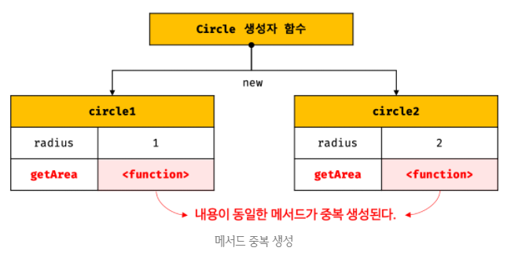
- 이처럼 동일한 생성자 함수에 의해 생성된 인스턴스가 동일한 메서드를 중복 소유하는 것은 `메모리를 불필요하게 낭비`한다.
- 또한, 인스턴스를 생성할 때마다 메서드를 생성하므로 `퍼포먼스에도 악영향`을 준다.

- `자바스크립트는 프로토타입(prototype)을 기반으로 상속을 구현한다.`
```javascript
function Circle(radius) {
    this.radius = radius;
}

// 프로토타입은 Circle 생성자 함수의 prototype 프로퍼티에 바인딩되어 있다.
Circle.prototype.getArea = function() {
    return Math.PI * this.radius ** 2;
};

const circle1 = new Circle(1);
const circle2 = new Circle(2);

console.log(circle1.getArea === circle2.getArea); // true

console.log(circle1.getArea()); // 3.141592653589793
console.log(circle2.getArea()); // 12.566370614359172
```
<br />

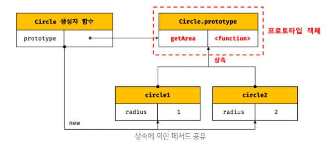

- 자신의 상태를 나타내는 radius 프로퍼티만 개별적으로 소유하고 내용이 `동일한 메서드는 상속을 통해 공유하여 사용하는 것`이다.
- `상속은 코드 재사용이란 관점에서 매우 유용하다.`

#### 프로토타입 객체
- `프로토타입 객체`(또는 줄여서 프로토타입)란 객체지향 프로그래밍의 바탕을 이루는 `객체 간 상속(inheritance)을 구현하기 위해 사용`된다.
- 프로토타입은 어떤 객체의 상위(부모) 객체의 역할을 하는 객체로써 다른 객체에 공유 프로퍼티(메서드 포함)를 제공한다.
- 프로토타입을 상속받은 하위(자식) 객체는 상위 객체의 프로퍼티를 자신의 프로퍼티처럼 자유롭게 사용할 수 있다.

- 모든 객체는 `[[Prototype]]`이라는 내부 슬롯을 가지며, 이 내부 슬롯의 값은 프로토타입의 참조(null인 경우도 있다)이다.
- `[[Prototype]]`에 저장되는 프로토타입은 객체 생성 방식에 의해 결정된다.
- 즉, 객체가 생성될 때 객체 생성 방식에 따라 프로토타입이 결정되고 `[[Prototype]]`에 저장된다.

- 모든 객체는 하나의 프로토타입을 갖는다. (`[[Prototype]]` 내부 슬롯의 값이 null인 객체는 프로토타입이 없다.)
- 그리고 모든 프로토타입은 생성자 함수와 연결되어 있다.
- 즉, 객체와 프로토타입과 생성자 함수는 다음 그림과 같이 서로 연결되어 있다.
<br />

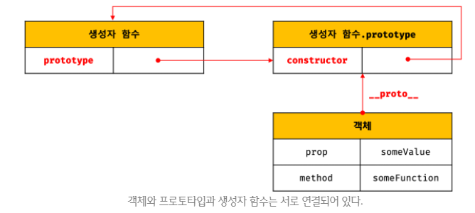

- `[[Prototype]]` 내부 슬롯에는 직접 접근할 수 없지만, 위 그림처럼 `__proto__` 접근자 프로퍼티를 통해 자신의 프로토타입, 즉 자신의 `[[Prototype]]` 내부 슬롯이 가리키는 프로토타입에 간접적으로 접근할 수 있다.
- 그리고 프로토타입은 자신의 `constructor 프로퍼티`를 통해 생성자 함수에 접근할 수 있고, 생성자 함수는 자신의 `prototype 프로퍼티`를 통해 프로토타입에 접근할 수 있다.
- 프로토타입 참조값을 `[[Protype]]`에 할당하여 인스턴스와 프로토타입을 연결한다.(인스턴스가 생성된 이후에 연결된다.)

1. `__proto__` 접근자 프로퍼티
- `__proto__`는 비표준이었다가 크롬, 사파리가 만들었다.
- ES6에서 `__proto__`가 표준이 되었지만, 쓰지 않는 것이 원칙이다.
- `모든 객체는 `__proto__` 접근자 프로퍼티를 통해 자신의 프로토타입, 즉 [[Prototype]] 내부 슬롯에 간접적으로 접근할 수 있다.`
<br />

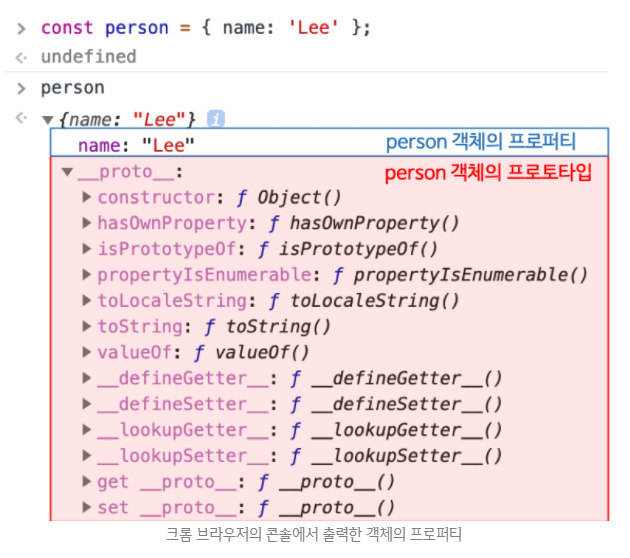

- 위 그림의 빨간 박스로 표시한 것이 person 객체의 프로토타입인 Object.prototype이다.
- 이는 `__proto__` 접근자 프로퍼티를 통해 person 객체의 `[[Prototype]]` 내부 슬롯이 가리키는 객체인 Object.prototype에 접근한 결과를 크롬 브라우저가 콘솔에 표시한 것이다.
- 이처럼 모든 객체는 `__proto__` 접근자 프로퍼티를 통해 프로토타입을 가리키는 `[[Prototype]]` 내부 슬롯에 접근할 수 있다.

- `__proto__는 접근자 프로퍼티이다.`
- 내부 슬롯은 프로퍼티가 아니다.
- 따라서, 자바스크립트는 원칙적으로 내부 슬롯과 내부 메서드에 한하여 간접적으로 접근할 수 있는 수단을 제공하기는 한다.
- `[[Prototype]]` 내부 슬롯에도 직접 접근할 수 없으며 `__proto__` 접근자 프로퍼티를 통해 간접적으로 `[[Prototype]]`의 내부 슬롯의 값, 즉 프로토타입에 접근할 수 있다.

- 접근자 프로퍼티는 자체적으로 값(`[[Value]]` 프로퍼티 어트리뷰트)을 갖지 않고 다른 `데이터 프로퍼티 값을 읽거나 저장`할 때 사용하는 접근자 함수(accessor function), 즉 `[[Get]]`, `[[Set]]` 프로퍼티 어트리뷰트로 구성된 프로퍼티이다.
```javascript
console.log(Object.getOwnPropertyDescriptor(Object.prototype, '__proto__'));
/*
{
  get: [Function: get __proto__],
  set: [Function: set __proto__],
  enumerable: false,
  configurable: true
}
*/
```
- Object.prototype의 접근자 프로퍼티인 `__proto__`는 getter/setter 함수라고 부르는 접근자 함수(`[[Get]]`, `[[Set]]` 프로퍼티 어트리뷰트에 할당된 함수)를 통해 `[[Prototype]]` 내부 슬롯의 값, 즉 프로토타입을 취득하거나 할당한다.
- `__proto__` 접근자 프로퍼티를 통해 `프로토타입에 접근`하면 내부적으로 `__proto__` 접근자 프로퍼티의 getter 함수인 `[[Get]]`이 호출된다.
- `__proto__` 접근자 프로퍼티를 통해 `새로운 프로토타입을 할당`하면 `__proto__` 접근자 프로퍼티의 setter 함수인 `[[Set]]`이 호출된다.
```javascript
const obj = {};
const parent = { x: 1 };

// getter 함수인 get __proto__가 호출되어 obj 객체의 프로토타입을 취득
obj.__proto__;

// setter 함수인 set __proto__가 호출되어 obj 객체의 프로토타입을 교체
obj.__proto__ = parent;

console.log(obj.x); // 1
```

- `__proto__` 접근자 프로퍼티는 상속을 통해 사용된다.
- `__proto__` 접근자 프로퍼티는 객체가 소유하는 프로퍼티가 아니라 `Object.prototype의 프로퍼티`이다.
- 모든 객체는 상속을 통해 `Object.prototype.__proto__` 접근자 프로퍼티를 사용할 수 있다,
```javascript
const person = { name: 'Lee' };

console.log(person.hasOwnProperty('__proto__')); // false

console.log(Object.getOwnPropertyDescriptor(Object.prototype, '__proto__'));
/*
{
  get: [Function: get __proto__],
  set: [Function: set __proto__],
  enumerable: false,
  configurable: true
}
*/
console.log({}.__proto__ === Object.prototype); // true
```

##### Object.prototype
- 모든 객체는 프로토타입의 계층 구조인 프로토타입 체인에 묶여있다.
- `프로토타입의 종점`, 즉 프로토타입 체인의 최상위 객체는 `Object.prototype`이며, 이 객체의 프로퍼티와 메서드는 모든 객체에게 상속된다.

#### `__proto__` 접근자 프로퍼티를 통해 프로토타입에 접근하는 이유
- `[[Prototype]]` 내부 슬롯의 값, 즉 프로토타입에 접근하기 위해 접근자 프로퍼티를 사용하는 이유는 `상호참조에 의해 프로토타입 체인이 생성되는 것을 방지하기 위해서`이다.
```javascript
const parent = {};
const child = {};

child.__proto__ = parent;
parent.__proto__ = child; // TypeError: Cyclic __proto__ value
```
- 이러한 코드가 정상적으로 처리되면 서로가 자신의 프로토타입이 되는 비정상적인 프로토타입 체인이 만들어지기 때문에 `__proto__` 접근자 프로퍼티는 에러를 발생시킨다.
<br />

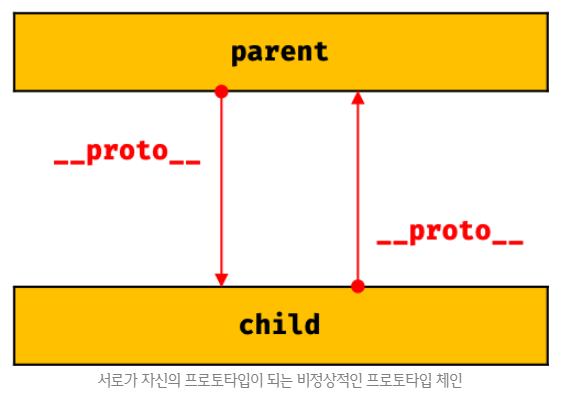

- 프로토타입 체인은 `단방향 링크드 리스트`로 구현되어야 한다.
- 즉, 프로퍼티 검색 방향이 한쪽으로만 흘러가야 한다.
- 하지만 위 그림과 같이 `순환 참조(circular reference)하는 프로토타입 체인`이 만들어지면 `프로토타입 체인 종점이 존재하지 않기 때문에` 프로토타입 체인에서 프로퍼티를 검색할 때 `무한 루프에 빠진다.`
- 따라서 아무런 체크 없이 무조건적으로 프로토타입이 교체할 수 없도록 `__proto__` 접근자 프로퍼티를 통해 프로토타입에 접근하고 교체하도록 구현되어 있다.

#### `__proto__`는 접근자 프로퍼티를 코드 내에서 직접 사용하는 것은 권장하지 않는다.
- `__proto__` 접근자 프로퍼티는 ES5까지 ECMAScript 사양에 포함되지 않은 비표준이었다.
- 하지만 일부 브라우저에서 `__proto__`를 지원하고 있었기 때문에 호환성을 고려하여 ES6에서 `__proto__`를 표준으로 채택했다.
- 현재 대부분의 브라우저(IE 11 이상)가 `__proto__`를 지원한다.

- 하지만 코드 내에서 `__proto__` 접근자 프로퍼티를 직접 사용하는 것은 권장하지 않는다.
- 모든 객체가 `__proto__` 접근자 프로퍼티를 사용할 수 있는 것은 아니기 때문이다.
- 다음과 같이 Object.prototype을 상속받지 않는 객체를 생성할 수도 있으므로 `__proto__` 접근자 프로퍼티를 사용할 수 없는 경우가 있다.
```javascript
// obj는 프로토타입 체인의 종점이다. 따라서 Object.__proto__를 상속받을 수 없다.
const obj = Object.create(null);

console.log(obj.__proto__); // undefined

// 따라서 Object.getPrototypeOf 메서드를 사용하는 편이 좋다.
console.log(Object.getPrototypeOf(obj)); // null
```
- 따라서 `__proto__` 접근자 프로퍼티 대신 프로토타입의 참조를 취득하고 싶은 경우에는 `Object.getPrototypeOf 메서드`를 사용하고, 프로토타입을 교체하고 싶은 경우에는 `Object.setPrototypeOf 메서드`를 사용할 것을 권장한다.
```javascript
const obj = {};
const parent = { x: 1 };

Object.getPrototypeOf(obj);  
Object.setPrototypeOf(obj, parent);

console.log(obj.x); // 1
```
- Object.getPrototypeOf 메서드와 Object.setPrototypeOf 메서드는 get Object.prototype.__proto__와 set Object.prototype.__proto__의 처리내용과 정확히 일치한다.
- Object.getPrototypeOf 메서드는 ES5에서 도입된 메서드이며, IE9 이상에서 지원한다.
- Object.setPrototypeOf 메서드는 ES6에서 도입된 메서드이며, IE11 이상에서 지원한다.

2. 함수 객체의 prototype 프로퍼티
- `함수 객체만이 소유하는 prototype 프로퍼티는 생성자 함수가 생성할 인스턴스의 프로토타입을 가리킨다.`
```javascript
// 함수 객체는 prototype 프로퍼티를 소유한다.
(function () {}).hasOwnProperty('prototype'); // true

// 일반 객체는 prototype 프로퍼티를 소유하지 않는다.
({}).hasOwnProperty('prototype'); // false
```
- 생성자 함수로서 호출할 수 없는 함수, 즉 `non-constructor`인 화살표 함수와 ES6 메서드 축약 표현으로 정의한 메서드는 `prototype 프로퍼티를 소유하지 않으며 프로토타입도 생성하지 않는다.`
- 참고로 ES6 메서드 축약 표현은 `객체 리터럴과 클래스`에서만 쓸 수 있다.
```javascript
// 화살표 함수는 non-constructor이다.
const Person = name => {
    this.name = name;
};

console.log(Person.hasOwnProperty('prototype')); // false
console.log(Person.prototype); // undefiend

// ES6의 메서드 축약표현으로 정의한 메서드는 non-constructor이다.
const obj = {
    foo() {}
};

console.log(obj.foo.hasOwnProperty('prototype')); // false
console.log(obj.foo.prototype); // undefined
```
- 생성자 함수로 호출하기 위해 정의하지 않은 일반함수(함수 선언문, 함수 표현식)도 prototype 프로퍼티를 소유하지만 객체를 생성하지 않는 일반함수의 prototype 프로퍼티는 의미가 없다.
- `모든객체가 가지고 있는(엄밀히 말하면 Object.prototype으로부터 상속받은) __proto__ 접근자 프로퍼티와 함수 객체만이 가지고 있는 prototype 프로퍼티는 결국 동일한 프로토타입을 가리킨다.`
- 하지만 이들 프로퍼티를 사용하는 주체가 다르다.

| 구분                        | 소유        | 값                | 사용 주체   | 사용 목적                                                    |
| --------------------------- | ----------- | ----------------- | ----------- | ------------------------------------------------------------ |
| `__proto__` 접근자 프로퍼티 | 모든 객체   | 프로토타입의 참조 | 모든 객체   | 객체가 자신의 프로토타입에 접근 또는 교체하기 위해 사용      |
| `prototype` 프로퍼티        | constructor | 프로토타입의 참조 | 생성자 함수 | 생성자 함수가 자신이 생성할 객체(인스턴스)의 프로토타입을 할당하기 위해 사용 |


```javascript
function Person(name) {
    this.name = name;
}

const me = new Person('Lee');

console.log(Person.prototype === me.prototype); // true
```
<br />

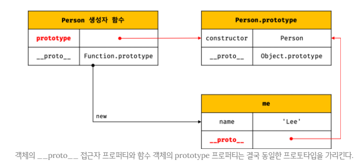

3. 프로토타입의 constructor 프로퍼티와 생성자 함수
- 모든 프로토타입은 constructor 프로퍼티를 갖는다.
- 이 constructor 프로퍼티는 prototype 프로퍼티로 자신을 참조하고 있는 `생성자 함수를 가리킨다.`
- 이 연결은 생성자 함수가 생성될 때, 즉 `함수 객체가 생성될 때 이뤄진다.`
```javascript
function Person(name) {
    this.name = name;
}

const me = new Person('Lee');

console.log(me.constructor === Person); // true
```
<br />

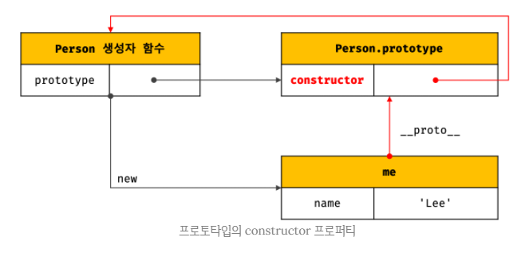

- me 객체에는 constructor 프로퍼티가 없지만, me 객체의 프로토타입인 Person.prototype에는 constructor 프로퍼티가 있다.
- 따라서 me 객체는 프로토타입인 `Person.prototype의 constructor 프로퍼티를 상속`받아 사용할 수 있다.

#### 리터럴 표기법에 의해 생성된 객체의 생성자 함수와 프로토타입
```javascript
const obj = new Object();
console.log(obj.constructor === Object); // true

const add = new Function('a', 'b', 'return a + b');
console.log(add.constructor === Function); // true

function Person(name) {
    this.name = name;
}

const me = new Person('Lee');
console.log(me.constructor === Person); // true
```
- 하지만 객체리터럴 표기법에 의한 객체 생성 방식과 같이 명시적으로 new 연산자와 함께 생성자 함수를 호출하여 인스턴스를 생성하지 않는 객체 생성 방식도 있다.
```javascript
// 객체 리터럴
const obj = {};

// 함수 리터럴
const add = function (a, b) { return a + b };

// 배열 리터럴
const arr = [1, 2, 3];

// 정규 표현식 리터럴
const regexp = /is/ig;
```
- 리터럴 표기법에 의해 생성된 객체도 물론 프로토타입이 존재한다.
- 하지만, 리터럴 표기법에 의해 생성된 객체의 경우 프로토타입의 constructor 프로퍼티가 가리키는 생성자 함수가 `반드시 객체를 생성한 생성자 함수라고 단정할 수 없다.`
```javascript
// obj 객체는 Object 생성자 함수로 생성한 객체가 아니라 객체리터럴로 생성했다.
const obj = {};

// 하지만 obj 객체의 생성자 함수는 Object 생성자 함수이다.
console.log(obj.constructor === Object); // true
```
- 그렇다면 객체리터럴에 의해 생성된 객체는 사실 Object 생성자 함수로 생성되는 것은 아닐까?
- ECMAScript 사양을 살펴보면, Object 생성자 함수는 다음과 같이 구현하도록 정의되어 있다.
<br />

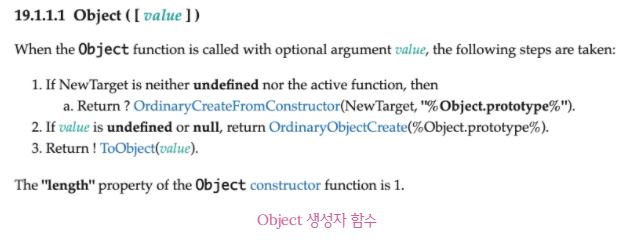

- 2번에서 Object 생성자 함수에 인수를 전달하지 않거나 undefined 또는 null을 인수로 전달하면서 new 연산자와 함께 호출하면 Object.prototype을 프로토타입으로 갖는 빈 객체를 생성한다.
- 참고로 1번은 `class Foo extends Object {}`와 같이 Object 생성자 함수를 확장한 클래스를 호출하는 것이고, 3번은 new 없이 Object 생성자 함수를 호출하는 경우이다.

##### 추상 연산(abstract operation)
- ECMAScript 사양에서 `내부 동작의 구현 알고리즘`을 표현한 것이다.
- ECMAScript 사양에서 설명을 위해 `사용되는 함수와 유사한 의사코드`라고 이해하자

```javascript
// 2. Object 생성자 함수에 의한 객체 생성
// Object 생성자 함수는 new 연산자와 함께 호출하지 않아도 new 연산자와 함께 호출한 것과 동일하게 동작한다.
// 인수가 전달되지 않았을 때 추상연산 OrdinaryObjectCreate를 호출하여 빈 객체를 생성한다.
let obj = new Object();
console.log(obj); // {}

// 1. new.target이 undefined나 Object가 아닌 경우
// 인스턴스 → Foo.prototype → Object.prototype 순으로 프로토타입 체인이 생성된다.
class Foo extends Object {}
new Foo(); // Foo {}

// 3. 인수가 전달된 경우에는 인수를 객체로 반환한다.
// Number 객체 생성
obj = new Object(123);
console.log(obj); // Number {123}

// String 객체 생성
obj = new Object('123');
console.log(obj); // String {"123"}
```

- 객체리터럴이 평가될 때 `추상연산 OrdinaryObjectCreate를 호출하여 빈 객체를 생성하고 프로퍼티를 추가하도록 정의`되어 있다.

- 이처럼 Object 생성자 함수 호출과 객체 리터럴의 평가는 추상 연산 OrdinaryObjectCreate를 호출하여 빈 객체를 생성하는 점에서 동일하나 `new.target의 확인이나 프로퍼티를 추가하는 처리 등 세부 내용은 다르다.`
- 따라서 `객체리터럴에 의해 생성된 객체는 Object 생성자 함수가 생성한 객체`가 아니다.

- 함수 객체의 경우 차이가 명확하다.
- `Function 생성자 함수를 호출하여 생성한 함수는 렉시컬 스코프를 만들지 않고 전역 함수인 것처럼 스코프를 생성하며 클로저도 만들지 않는다.`
- 따라서 `함수 선언문과 함수 표현식을 평가하여 함수 객체를 생성한 것은 Function 생성자 함수가 아니다.`
- 하지만 `constructor 프로퍼티를 통해 확인해보면 foo의 생성자 함수는 Function 생성자 함수`이다.
```javascript
// foo 함수는 Function 생성자 함수로 생성한 함수 객체가 아니라 함수 선언문으로 생성했다.
function foo() {}

// 하지만 constructor 프로퍼티를 통해 확인해보면 함수 foo의 생성자 함수는 Function 생성자 함수다.
console.log(foo.constructor === Function); // true
```
- 리터럴 표기법에 의해 생성된 객체도 `가상적인 생성자 함수를 갖는다.`
- 프로토타입은 생성자 함수와 더불어 생성되며 prototype, constructor 프로퍼티에 의해 연결되어 있기 때문이다.
- `프로토타입과 생성자 함수는 단독으로 존재할 수 없고 언제나 쌍(pair)으로 존재한다.`

- 리터럴 표기법(객체 리터럴, 배열 리터럴, 정규 표현식 리터럴 등)에 의해 생성된 객체는 생성자 함수에 의해 생성된 객체는 아니다.
- 하지만 큰 틀에서 생각해 보면 `리터럴 표기법으로 생성한 객체도 생성자 함수로 생성한 객체와 본질적인 면에서 큰 차이는 없다.`

- 예를 들어, 객체 리터럴에 의해 생성된 객체와 Object 생성자 함수에 의해 생성된 객체는 생성과정에서 미묘한 차이는 있지만 결국 객체로서 동일한 특성을 갖는다.
- 함수 리터럴에 의해 생성된 함수와 Function 생성자 함수에 의해 생성한 함수는 생성과정과 스코프, 클로저 등의 차이가 있지만 결국 함수로서 동일한 특성을 갖는다.
- 따라서 프로토타입의 constructor 프로퍼티를 통해 연결된 생성자 함수를 리터럴 표기법으로 생성한 객체를 생성한 생성자 함수로 생각해도 크게 무리는 없다.

| 리터럴 표기법      | 생성자 함수 | 프로토타입         |
| ------------------ | ----------- | ------------------ |
| 객체 리터럴        | Object      | Object.prototype   |
| 함수 리터럴        | Function    | Function.prototype |
| 배열 리터럴        | Array       | Array.prototype    |
| 정규 표현식 리터럴 | RegExp      | RegExp.prototype   |


#### 프로토타입의 생성 시점
- 객체는 리터럴 표기법 또는 생성자 함수에 의해 생성되므로 결국 `모든 객체는 생성자 함수와 연결`되어 있다.

##### Object.create 메서드와 클래스에 의한 객체 생성
- Object.create 메서드와 클래스로 객체를 생성하는 방법도 있다.
- `Object.create 메서드와 클래스로 생성한 객체도 생성자 함수로 연결`되어 있다.

- `프로토타입은 생성자 함수가 생성되는 시점에 더불어 생성된다.`
- 생성자 함수는 사용자가 직접 정의한 사용자 정의 생성자 함수와 자바스크립트가 기본 제공하는 빌트인 생성자 함수로 구분할 수 있다.
- 사용자 정의 생성자 함수와 빌트인 생성자 함수를 구분하여 프로토타입 생성 시점에 대해 살펴보자

1. 사용자 정의 생성자 함수와 프로토타입 생성 시점
- `생성자 함수로서 호출할 수 있는 함수, 즉 constructor는 함수 정의가 평가되어 함수 객체를 생성하는 시점에 프로토타입도 더불어 생성된다.`
```javascript
// 함수 정의(constructor)가 평가되어 함수 객체를 생성하는 시점에 프로토타입도 더불어 생성된다.
console.log(Person.prototype); // {constructor: ƒ}

function Person(name) {
    this.name = name;
}
```

- 생성자 함수로서 호출할 수 없는 함수, 즉 `non-constructor는 프로토타입이 생성되지 않는다.`
```javascript
const Person = name => {
    this.name = name;
};

console.log(Person.prototype); // undefined
```
- 함수 선언문은 다른 코드가 실행되기 이전에 자바스크립트 엔진에 의해 먼저 실행된다.
- 따라서 `함수 선언문으로 정의된 Person 생성자 함수는 어떤 코드보다 먼저 평가되어 함수 객체가 된다.`
- `이때 프로토타입도 더불어 생성된다.` 생성된 프로토타입은 Person 생성자 함수의 property 프로퍼티에 바인딩된다.
- 생성된 프로토타입은 오직 constructor 프로퍼티만을 갖는 객체이다.
- 프로토타입도 객체이고 모든 객체는 프로토타입을 가지므로 프로토타입도 자신의 프로토타입을 갖는다.
- 생성된 프로토타입의 프로토타입은 `Object.prototype`이다.
<br />

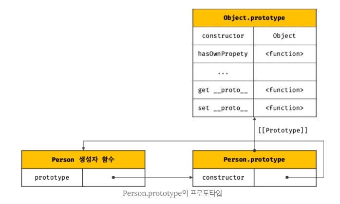

- 이처럼 `사용자 정의 생성자 함수`는 `자신이 평가되어 함수 객체로 생성되는 시점에 프로토타입도 더불어 생성`되며, 생성된 프로토타입은 언제나 Object.prototype이다.

2. 빌트인 생성자 함수와 프로토타입 생성 시점
- Object, String, Number, Function, Array, RegExp, Date, Promise 등과 같은 빌트인 생성자 함수도 일반 함수와 마찬가지로 빌트인 생성자 함수가 생성되는 시점에 프로토타입이 생성된다.
- `모든 빌트인 생성자 함수는 전역 객체가 생성되는 시점에 생성된다.`
- 생성된 프로토타입은 빌트인 생성자 함수의 prototype 프로퍼티에 바인딩된다.

##### 전역 객체(global object)
- `전역 객체는 코드가 실행되기 이전 단계에 자바스크립트 엔진에 의해 생성되는 특수한 객체`이다.
- 전역 객체는 클라이언트 사이드 환경(브라우저)에서는 window, 서버 사이드 환경(Node.js)에서는 global 객체를 의미한다.
- 전역객체 : `표준 빌트인 객체(Object, String, Number, Function, Array 등)들` +` 환경에 따른 호스트 객체(클라이언트 web API 또는 Node.js의 호스트 API)` + `var 키워드로 선언한 전역 변수와 전역 함수`를 프로퍼티로 갖는다.
- Math, Reflect, JSON을 제외한 표준 빌트인 객체는 모두 생성자 함수이다.
```javascript
// 빌트인 객체인 Object는 전역 객체 window의 프로퍼티이다.
window.Object === Object // true
```
- 이처럼 객체가 생성되기 이전에 생성자 함수와 프로토타입은 이미 객체화되어 존재한다.
- `이후 생성자 함수 또는 리터럴 표기법으로 객체를 생성하면 프로토타입은 생성된 객체의 [[Prototype]] 내부 슬롯에 할당된다.`

#### 객체 생성 방식과 프로토타입의 결정
- 객체의 다양한 생성 방법
1. `객체 리터럴`
2. `Object 생성자 함수`
3. `생성자 함수`
4. `Object.create 메서드`
5. `클래스(ES6)`

- 이처럼 다양한 방식으로 생성된 모든 객체는 각 방식마다 세부적인 객체 생성 방식의 차이는 있으나 `추상 연산 OrdinaryObjectCreate에 의해 생성된다는 공통점`이 있다.

- `추상 연산 OrdinaryObjectCreate`는 `필수적으로 자신이 생성할 객체의 프로토타입을 인수로 전달받는다.`
- 그리고 자신이 생성할 객체에 추가할 프로퍼티 목록을 옵션으로 전달할 수 있다.
- 추상 연산 OrdinaryObjectCreate는 빈 객체를 생성한 후, 객체에 추가할 프로퍼티 목록이 인수로 전달된 경우 프로퍼티를 객체에 추가한다.
- 그리고 인수로 전달받은 프로토타입을 자신이 생성한 객체의 `[[Prototype]]` 내부 슬롯에 할당한 다음, 생성된 객체를 반환한다.
- 즉, 프로토타입은 추상연산 OrdinaryObjectCreate에 전달되는 인수에 의해 결정된다.
- 이 인수는 객체가 생성되는 시점에 `객체 생성방식에 의해 결정`된다.

1. 객체 리터럴에 의해 생성된 객체의 프로토타입
- 자바스크립트 엔진은 객체 리터럴을 평가하여 객체를 생성할 때, 추상 연산 OrdinaryObjectCreate를 호출한다.
- 이때 추상 연산 OrdinaryObjectCreate에 전달되는 프로토타입은 `Object.prototype`이다.
- 즉, 객체 리터럴에 의해 생성되는 객체의 프로토타입은 Object.prototype이다.
```javascript
const obj = { x: 1 };
```
<br />

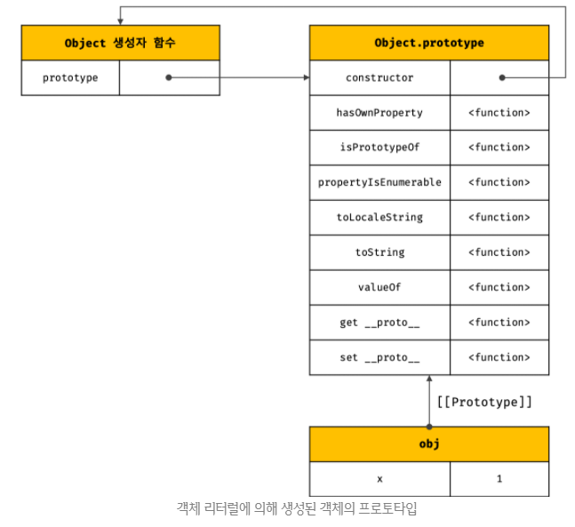

```javascript
const obj = { x: 1 };

// 객체리터럴에 의해 생성된 객체 obj 객체는 Object.prototype을 상속받는다.
// 따라서 constructor 프로퍼티, hasOwnProperty 메소드를 상속받아 사용할 수 있다.
console.log(obj.constructor === Object); // true
console.log(obj.hasOwnProperty('x')); // true
```

2. Object 생성자 함수에 의해 생성된 객체의 프로토타입
- Object 생성자 함수를 호출하면 추상 연산 OrdinaryObjectCreate가 호출된다.
- 이때 추상 연산 OrdinaryObjectCreate에 전달되는 프로토타입은 `Object.prototype`이다.
- 즉, Object 생성자 함수에 의해 생성되는 객체의 프로토타입은 Object.prototype이다.
```javascript
const obj = new Object();
obj.x = 1;
```
<br />

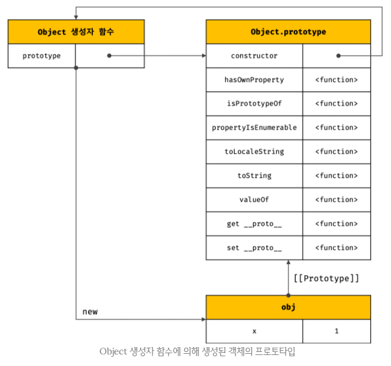
```javascript
const obj = new Object();

// Object 생성자 함수에 의해 생성된 obj 객체는 Object.prototype을 상속받는다.
// 따라서 constructor 프로퍼티, hasOwnProperty 메소드를 상속받아 사용할 수 있다.
console.log(obj.constructor === Object); // true
console.log(obj.hasOwnProperty('x')); // true
```
- 객체 리터럴과 Object 생성자 함수에 의한 객체 생성 방식의 차이는 `프로퍼티를 추가하는 방식`에 있다.
- 객체 리터럴 방식은 객체 리터럴 내부에 프로퍼티를 추가하지만, Object 생성자 함수 방식은 일단 빈 객체를 생성한 이후 프로퍼티를 추가해야 한다.

3. 생성자 함수에 의해 생성된 객체의 프로토타입
- new 연산자와 함께 생성자 함수를 호출하여 인스턴스를 생성하면 추상 연산 OrdinaryObjectCreate가 호출된다.
- 이때 추상 연산 OrdinaryObjectCreate에 전달되는 프로토타입은 생성자 함수의 prototype 프로퍼티에 바인딩되어 있는 객체이다.
- 즉, 생성자 함수에 의해 생성되는 객체의 프로토타입은 `생성자 함수의 prototype 프로퍼티에 바인딩되어 있는 객체`이다.
```javascript
function Person(name) {
	this.name = name;
}

const me = new Person(‘Lee’);;
```
<br />

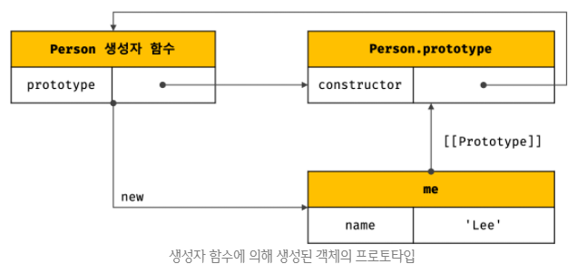

- 프로토타입은 객체이다.
- 따라서 일반 객체와 같이 프로토타입에도 프로퍼티를 추가/삭제 할 수 있다.
- 그리고 이렇게 추가/삭제된 프로퍼티는 프로토타입 체인에 즉각 반영된다.
```javascript
function Person(name) {
    this.name = name;
}

Person.prototype.sayHello = function () {
    console.log(`Hi! My name is ${this.name}`);
};

const me = new Person('Lee');
const you = new Person('Kim');

me.sayHello(); // Hi! My name is Lee
you.sayHello(); // Hi! My name is Kim
```
- Person 생성자 함수를 통해 생성된 모든 객체는 프로토타입에 추가된 sayHello 메서드를 상속받아 자신의 메서드처럼 사용할 수 있다.
<br />

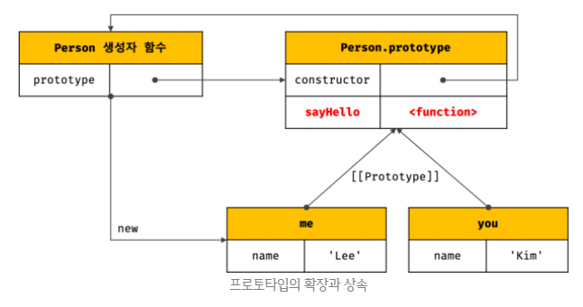

#### 프로토타입 체인
```javascript
function Person(name) {
    this.name = name;
}

Person.prototype.sayHello = function () {
    console.log(`Hi! My name is ${this.name}`);
};

const me = new Person('Lee');

console.log(me.hasOwnProperty('name')); // true
console.log(Object.getPrototypeOf(me) === Person.prototype); // true
console.log(Object.getPrototypeOf(Person.prototype) === Object.prototype); // true
```
<br />

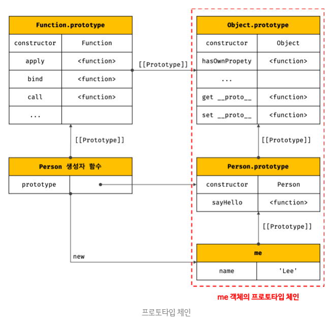
- 자바스크립트는 객체의 프로퍼티(메서드 포함)에 접근하려고 할 때 해당 객체에 접근하려는 프로퍼티가 없다면 `[[Prototype]]` 내부 슬롯의 참조를 따라 자신의 부모 역할을 하는 프로토타입의 프로퍼티를 순차적으로 검색한다.
- 이를 `프로토타입 체인`이라 한다.
- `프로토타입 체인은 자바스크립트가 객체지향 프로그래밍의 상속을 구현하는 매커니즘`이다.

`me.hasOwnProperty(‘name’)`과 같이 메서드를 호출하면 자바스크립트 엔진은 다음과 같은 과정을 거쳐 메서드를 검색한다.
1. 먼저 hasOwnProperty 메서드를 호출한 me 객체에서 hasOwnProperty 메서드를 검색한다. me 객체에는 hasOwnProperty 메서드가 없으므로 프로토타입 체인을 따라, 다시 말해 `[[Prototype]]` 내부 슬롯에 바인딩되어 있는 프로토타입(위 예제의 경우 Person.prototype)으로 이동하여 hasOwnProperty 메서드를 검색한다.
2. Person.prototype에도 hasOwnProperty 메서드가 없으므로 프로토타입 체인을 따라, 다시 말해 `[[Prototype]]` 내부 슬롯에 바인딩되어 있는 프로토타입(위 예제의 경우 Object.prototype)으로 이동하여 hasOwnProperty 메서드를 검색한다.
3. Object.prototype에는 hasOwnProperty 메서드가 존재한다. 자바스크립트 엔진은 Object.prototype.hasOwnProperty 메서드를 호출한다. 이때 Object.prototype.hasOwnProperty 메서드의 this에는 me 객체가 바인딩된다.
```javascript
Object.prototype.hasOwnProperty.call(me, ‘name’); // true
```
##### call 메서드
- call 메서드는 `this로 사용할 객체를 전달하면서 함수를 호출`한다.
- 위 예제는 this로 사용할 객체를 전달하면서 Object.prototype.hasOwnProperty 메서드를 호출한다.

- 프로토타입 체인의 최상위에 위치하는 객체는 언제나 `Object.prototype`이다.
- 따라서 모든 객체는 Object.prototype을 상속받는다.
- `Object.prototype을 프로토타입 체인의 종점(end of prototype chain)`이라 한다.
- Object.prototype의 프로토타입, 즉 `[[Prototype]]` 내부 슬롯의 값은 `null`이다.

- 프로토타입 체인의 종점인 Object.prototype에서도 프로퍼티를 검색할 수 없는 경우, `undefined를 반환`한다.
- 이때 에러가 발생하지 않는 것에 주의하자.
```javascript
console.log(me.foo); // undefined
```
- `프로토타입 체인은 상속과 프로퍼티 검색을 위한 매커니즘`이라고 할 수 있다.

- 이에 반해, 프로퍼티가 아닌 `식별자는 스코프 체인에서 검색`한다.
- 다시 말해, 자바스크립트 엔진은 함수의 중첩 관계로 이루어진 스코프의 계층적인 구조에서 식별자를 검색한다.
- 따라서 `스코프 체인은 식별자 검색을 위한 메커니즘`이라고 할 수 있다.
```javascript
me.hasOwnProperty(‘name’);
```
- 위 예제의 경우, 먼저 스코프 체인에서 me 식별자를 검색한다.
- me 식별자는 전역에서 선언되었으므로 전역 스코프에서 검색된다.
- me 식별자를 검색한 다음, me 객체의 프로토타입 체인에서 hasOwnProperty 메서드를 검색한다.

- 이처럼 `스코프 체인과 프로토타입 체인은 서로 협력하여 식별자와 프로퍼티를 검색하는 데 사용된다.`

#### 오버라이딩과 프로퍼티 섀도잉
```javascript
const Person = (function () {
    function Person(name) {
        this.name = name;
    }
    
    // 프로토타입 메서드
    Person.prototype.sayHello = function () {
        console.log(`Hi! My name is ${this.name}`);
    };

    return Person;
}());

const me = new Person('Lee');

// 인스턴스 메서드
me.sayHello = function () {
    console.log(`Hey! My name is ${this.name}`);
};

console.log(me.sayHello()); 
/* 
Hey! My name is Lee
undefined
*/
```
<br />

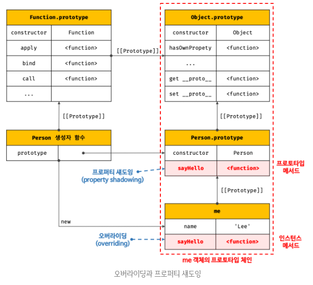
- 프로토타입이 소유한 프로퍼티(메서드 포함)를 `프로토타입 프로퍼티`, 인스턴스가 소유한 프로퍼티를 `인스턴스 프로퍼티`라고 부른다.

- 프로토타입 프로퍼티와 같은 이름의 프로퍼티를 인스턴스에 추가하면 프로토타입 체인을 따라 프로토타입 프로퍼티를 검색하여 프로토타입 프로퍼티를 덮어쓰는 것이 아니라 인스턴스 프로퍼티로 추가한다.
- 이때 인스턴스 메서드 sayHello는 프로토타입 메서드 sayHello를 `오버라이딩`했고, 프로토타입 메서드 sayHello는 가려진다.
- 이처럼 상속 관계에 의해 프로퍼티가 가려지는 현상을 `프로퍼티 섀도잉(property shadowing)`이라 한다.

##### 오버라이딩(overriding)
- 상위 클래스가 가지고 있는 메서드를 하위 클래스가 `재정의하여 사용하는 방식`이다.

##### 오버로딩(overloading)
- 함수의 이름은 동일하지만 매개변수의 타입 또는 개수가 다른 메서드를 구현하고 매개변수에 의해 메서드를 구별하여 호출하는 방식이다.
- 자바스크립트는 오버로딩을 지원하지 않지만 arguments 객체를 사용하여 구현할 수는 있다.

```javascript
// 인스턴스 메서드를 삭제한다.
delete me.sayHello;

// 인스턴스에는 satHello 메서드가 없으므로 프로토타입 메서드가 호출된다.
me.sayHello(); // Hi! My name is Lee

// 프로토타입 체인을 통해 프로토타입 메서드가 삭제되지 않는다.
delete me.sayHello;

// 프로토타입 메서드가 호출된다.
me.sayHello(); // Hi! My name is Lee
```
- 이와 같이 `하위 객체를 통해 프로토타입의 프로퍼티를 변경 또는 삭제하는 것은 불가능`하다.
- 다시 말해, `하위 객체를 통해 프로토타입에 get 엑세스는 허용되나 set 엑세스는 허용되지 않는다.`

- 프로토타입 프로퍼티를 변경 또는 삭제하려면 프로토타입에 직접 접근해야 한다.
```javascript
delete Person.prototype.sayHello;
me.sayHello(); // TypeError: me.sayHello is not a function
```

#### 프로토타입의 교체
- 프로토타입은 임의의 다른 객체로 변경할 수 있다.
- 이것은 부모 객체인 프로토타입을 동적으로 변경할 수 있다는 것을 의미한다.
- 이러한 특징을 활용하여 객체 간의 상속 관계를 동적으로 변경할 수 있다.
- 프로토타입은 `생성자 함수` 또는 `인스턴스에 의해 교체`할 수 있다.

1. 생성자 함수에 의한 프로토타입 교체
```javascript
const Person = (function () {
    function Person(name) {
        this.name = name;
    }

    // ① 생성자 함수의 prototype 프로퍼티를 통해 프로토타입을 교체
    Person.prototype = {
        sayHello() {
            console.log(`Hi! My name is ${this.name}`);
        }
    };

    return Person;
}());

const me = new Person('Lee');
```
<br />

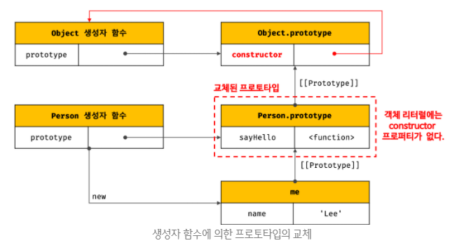

- 프로토타입으로 교체한 객체 리터럴에는 constructor 프로퍼티가 없다.
- constructor 프로퍼티는 자바스크립트 엔진이 프로토타입을 생성할 때 암묵적으로 추가한 프로퍼티이다.
- 따라서 me 객체의 생성자 함수를 검색하면 Object가 나온다.
```javascript
console.log(me.constructor === Person); // false
console.log(me.constructor === Object); // true
```
- 이처럼 프로토타입을 교체하면 constructor 프로퍼티와 생성자 함수 간의 연결이 파괴된다.
- 파괴된 constructor 프로퍼티와 생성자 함수 간의 연결을 되살려보자
```javascript
const Person = (function () {
    function Person(name) {
        this.name = name;
    }

    // 생성자 함수의 prototype 프로퍼티를 통해 프로토타입을 교체
    Person.prototype = {
        constructor: Person,
        sayHello() {
            console.log(`Hi! My name is ${this.name}`);
        }
    };

    return Person;
}());

const me = new Person('Lee');

console.log(me.constructor === Person); // true
console.log(me.constructor === Object); // false
```

2. 인스턴스에 의한 프로토타입 교체
- 프로토타입 생성자 함수의 prototype 프로퍼티뿐만 아니라 인스턴스의 `__proto__` 접근자 프로퍼티(또는 Object.getPrototypeOf 메서드)를 통해 접근할 수 있다.
- 따라서 인스턴스의 `__proto__` 접근자 프로퍼티(또는 Object.getPrototypeOf 메서드)를 통해 프로토타입을 교체할 수 있다.

- 생성자 함수의 prototype 프로퍼티에 다른 임의의 객체를 바인딩하는 것은 미래에 생성할 인스턴스의 프로토타입을 교체하는 것이다.
- `__proto__` 접근자 프로퍼티를 통해 프로토타입을 교체하는 것은 이미 생성된 객체의 프로토타입을 교체하는 것이다.
```javascript
function Person(name) {
    this.name = name;
}

const me = new Person('Lee');

const parent = {
    sayHello() {
        console.log(`Hi! My name is ${this.name}`);
    }
};

// ① me 객체의 프로토타입을 parent 객체로 교체한다.
Object.setPrototypeOf(me, parent);
// 위 코드는 아래의 코드와 동일하게 동작한다.
// me.__proto__ = parent;

console.log(me.sayHello()); 
/*
Hi! My name is Lee
undefined
*/

console.log(me.constructor === Person); // false
console.log(me.constructor === Object); // true
```
<br />

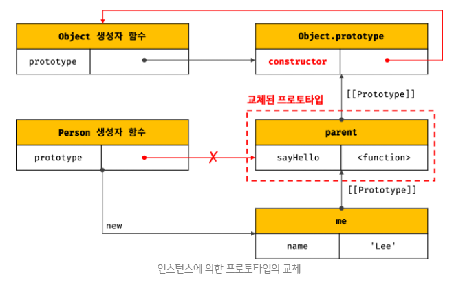

- 생성자 함수에 의한 프로토타입 교체와 인스턴스에 의한 프로토타입 교체는 별다른 차이가 없어보인다.
- 하지만 미묘한 차이가 있다.
<br />

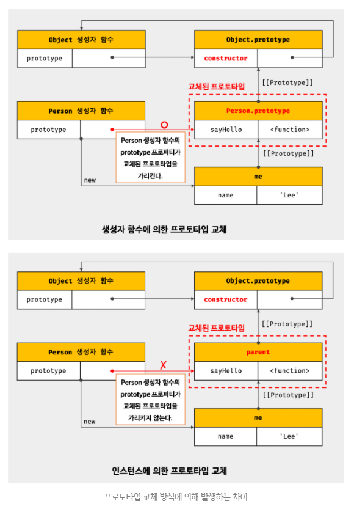

- 프로토타입으로 교체한 객체리터럴에 constructor 프로퍼티를 추가하고, 생성자 함수의 prototype 프로퍼티를 재설정하여 파괴된 생성자 함수와 프로토타입 간의 연결을 되살려보자
```javascript
function Person(name) {
    this.name = name;
}

const me = new Person('Lee');

const parent = {
    constructor: Person,
    sayHello() {
        console.log(`Hi! My name is ${this.name}`);
    }
};

Person.prototype = parent;
// ① me 객체의 프로토타입을 parent 객체로 교체한다.
Object.setPrototypeOf(me, parent);
// 위 코드는 아래의 코드와 동일하게 동작한다.
// me.__proto__ = parent;

console.log(me.sayHello()); 
/*
Hi! My name is Lee
undefined
*/

console.log(me.constructor === Person); // true
console.log(me.constructor === Object); // false

console.log(Person.prototype === Object.getPrototypeOf(me)); // true
```
- 이처럼 프로토타입 교체를 통해 객체 간의 상속 관계를 동적으로 변경하는 것은 꽤나 번거롭다.
- 따라서 `프로토타입은 직접 교체하지 않는 것이 좋다.`
- 상속 관계를 인위적으로 설정하려면 `직접 상속이 더 편리하고 안전`하다.
- 또는 ES6에서 도입된 클래스를 간편하고 직관적으로 상속 관계를 구현할 수 있다.

#### instanceof 연산자
- instanceof 연산자는 이항 연산자로서 `좌변에 객체를 가리키는 식별자`, `우변에 생성자 함수를 가리키는 식별자`를 피연산자로 받는다.
- 만약 우변의 피연산자가 `함수가 아닌 경우 TypeError가 발생`한다.
- `객체 instanceof 생성자 함수`
- `우변의 생성자 함수의 prototype에 바인딩된 객체가 좌변의 객체의 프로토타입 체인 상에 존재하면 true, 아니면 false로 평가된다.`
```javascript
function Person(name) {
    this.name = name;
}

const me = new Person('Lee');

// Person.prototype이 me 객체의 프로토타입 체인 상에 존재하므로 true
console.log(me instanceof Person); // true

// Object.prototype이 me 객체의 프로토타입 체인 상에 존재하므로 true
console.log(me instanceof Object); // true
```
```javascript
function Person(name) {
    this.name = name;
}

const me = new Person('Lee');

const parent = {};

Object.setPrototypeOf(me, parent);

// Person 생성자 함수와 parent 객체는 연결되어 있지 않다.
console.log(Person.prototype === parent); // false
console.log(parent.constructor === Person); // false

console.log(me instanceof Person); // false
console.log(me instanceof Object); // true
```
```javascript
function Person(name) {
    this.name = name;
}

const me = new Person('Lee');

const parent = {};

Object.setPrototypeOf(me, parent);

console.log(Person.prototype === parent); // false
console.log(parent.constructor === Person); // false

// parent 객체를 Person 생성자 함수의 prototype 프로퍼티에 바인딩한다.
Person.prototype = parent;

console.log(me instanceof Person); // true
console.log(me instanceof Object); // true
```
- 이처럼 `instanceof 연산자는 생성자 함수의 prototype에 바인딩된 객체가 프로토타입 체인 상에 존재하는지 확인한다.`
<br />

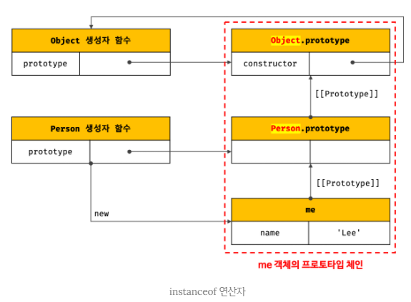

- instanceof 연산자를 함수로 표현하면 다음과 같다.
```javascript
function isInstanceof(instance, constructor) {
    const prototype = Object.getPrototypeOf(instance);

    // 재귀 탈출 조건
    // prtotype이 null이면 프로토타입 체인의 종점에 다다른 것이다.
    if(prototype === null) return false;

    // 프로토타입 생성자 함수의 prototype 프로퍼티에 바인딩된 객체라면 true
    // 그렇지 않다면 재귀호출로 프로토타입 체인 상의 상위 프로토타입으로 이동하여 확인한다.
    return prototype === constructor.prototype || isInstanceof(prototype, constructor);
}

function Person(name) {
    this.name = name;
}

const me = new Person('Lee');

console.log(isInstanceof(me, Person)); // true
console.log(isInstanceof(me, Object)); // true
console.log(isInstanceof(me, Array)); // false
```

- `생성자 함수에 의해 프로토타입이 교체`되어 constructor 프로퍼티와 생성자 함수 간의 연결이 파괴되어도 생성자 함수의 prototype 프로퍼티와 프로토타입 간의 연결은 파괴되지 않으므로 `instanceof는 아무런 영향을 받지 않는다.`
```javascript
const Person = (function () {
    function Person(name) {
        this.name = name;
    }

    Person.prototype = {
        sayHello() {
            console.log(`Hi! My name is ${this.name}`);
        }
    };

    return Person;
}());

const me = new Person('Lee');

console.log(me.constructor === Person); // false
console.log(me instanceof Person); // true
console.log(me instanceof Object); // true
```

#### 직접 상속
1. `Object.create에 의한 직접 상속`
- Object.create 메서드는 명시적으로 `프로토타입을 지정하여 새로운 객체를 생성`한다.
- Object.create 메서드도 다른 객체 생성방식과 마찬가지로 추상연산 OrdinaryObjectCreate를 호출한다.
- Object.create 메서드의 `첫 번째 매개변수에는 생성할 객체의 프로토타입으로 지정할 객체`를 전달한다.
- `두 번째 매개변수에는 생성할 객체의 프로퍼티 키와 프로퍼티 디스크립터 객체를 전달`한다.
- 이 객체 형식은 Object.defineProperties 메서드의 두 번째 인수와 동일하다.
- 두 번째 인수는 옵션이므로 생략 가능하다.
```javascript
// 지정된 프로토타입 및 프로퍼티를 갖는 새로운 객체를 생성하여 반환한다.
// prototype - 생성할 객체의 프로토타입으로 지정할 객체
// [propertiesObject] - 생성할 객체의 프로퍼티를 갖는 객체
// 지정된 프로토타입 및 프로퍼티를 갖는 새로운 객체가 반환된다.
Object.create(prototype[, propertiesObject]);
```
```javascript
let obj = Object.create(null);
console.log(Object.getPrototypeOf(obj) === null); // true
// Object.prototype을 상속받지 못한다.
console.log(obj.toString()); // TypeError: obj.toString is not a function

// obj → Object.prototype → null 
// obj = {};와 동일하다.
obj = Object.create(Object.prototype);

// obj → Object.prototype → null
// Obj = { x: 1 };와 동일하다.
obj = Object.create(Object.prototype, {
    x: { value: 1, writable: true, enumerable: true, configurable: true }
});
// 위 코드는 다음과 동일하다.
// obj = Object.create(Object.prototype);
// obj.x = 1;
console.log(obj.x); // 1
console.log(Object.getPrototypeOf(obj) === Object.prototype); // true

const myProto = { x: 10 };

// obj → myProto → Object.prototype → null
obj = Object.create(myProto);
console.log(obj.x); // 10
console.log(Object.getPrototypeOf(obj) === myProto); // true


// 생성자 함수
function Person(name) {
    this.name = name;
}

// obj → Person.prototype → Object.prototype → null
// Obj = new Person('Lee')와 동일하다. 
obj = Object.create(Person.prototype);
obj.name = 'Lee';
console.log(obj.name); // Lee
console.log(Object.getPrototypeOf(obj) === Person.prototype); // true
```
- 이처럼 Object.create 메서드는 첫 번째 매개변수에 전달한 객체의 프로토타입 체인에 속하는 객체를 생성한다.
- 즉, `객체를 생성하면서 직접적으로 상속을 구현하는 것`이다.
- Object.create 메서드의 장점
	1. new 연산자가 없어도 객체를 생성할 수 있다.
	2. 프로토타입을 지정하면서 객체를 생성할 수 있다.
	3. 객체 리터럴에 의해 생성된 객체도 상속받을 수 있다.

- 참고로 Object.prototype의 빌트인 메서드인 Object.prototype.hasOwnProperty, Object.prototype.isPropertyOf, Object.prototype.propertyIsEnumerable 등은 모든 객체의 프로토타입의 종점, 즉 Object.prototype의 메서드이므로 모든 객체가 상속받아 호출할 수 있다.
```javascript
const obj = { a: 1 };

obj.hasOwnProperty('a'); // true
obj.propertyIsEnumerable('a') // true
```
- 그런데 `ESLint에서는 앞의 예제와 같이 Object.prototype의 빌트인 메서드를 객체가 직접 호출하는 것을 권장하지 않는다.`
- 그 이유는 `Object.create 메서드를 통해 프로토타입 체인의 종점에 위치하는 객체를 생성할 수 있기 때문이다.`
- 프로토타입 체인의 종점에 위치하는 객체는 Object.prototype의 빌트인 메서드를 사용할 수 없다.
```javascript
const obj = Object.create(null);
obj.a = 1;

console.log(Object.getPrototypeOf(obj) === null); // true
console.log(obj.hasOwnProperty('a')); // TypeError: obj.hasOwnProperty is not a function
```
- 따라서 이 같은 에러를 발생시킬 위험을 없애기 위해 Object.prototype의 빌트인 메서드는 다음과 같이 `간접적으로 호출하는 것이 좋다.`
```javascript
const obj = Object.create(null);
obj.a = 1;

// Object.prototype의 빌트인 메서드는 객체로 직접 호출하지 않는다.
console.log(Object.prototype.hasOwnProperty.call(obj, 'a')); // true
```
```javascript
const o = Object.create([1, 2, 3]);
console.log(o.__proto__.__proto__.constructor); // Array 생성자함수
console.log(o.constructor); // Array 생성자함수 
```

2. 객체 리터럴 내부에서 `__proto__`에 의한 직접 상속
- Object.create 메서드에 의한 직접 상속에서 두 번째 인자로 프로퍼티를 정의하는 것은 번거롭다.
- 일단 객체로 생성한 이후 프로퍼티를 추가하는 방법도 있으나 이 또한 깔끔한 방법은 아니다.

- ES6에서는 객체 리터럴 내부에서 `__proto__` 접근자 프로퍼티를 사용하여 직접 상속을 구현할 수 있다.
```javascript
const myProto = { x: 10 };

const obj = {
    y: 20,
    // obj → myProto → Object.prototype → null
    __proto__: myProto
};
/*
위 코드는 아래와 동일하다.
const obj = Object.create(myProto, {
    y: { value: 20, writable: true, enumerable: true, configurable: true }
});
*/

console.log(obj.x, obj.y); // 10 20
console.log(Object.getPrototypeOf(obj) === myProto); // true
```

#### 정적 프로퍼티/메서드
- 정적(static) 프로퍼티/메서드는 생성자 함수로 인스턴스를 생성하지 않아도 참조/호출할 수 있는 프로퍼티/메서드를 말한다.
```javascript
function Person(name) {
    this.name = name;
}

Person.prototype.sayHello = function () {
    console.log(`Hi! My name is ${this.name}`);
};

// 정적 프로퍼티
Person.staticProp = 'static prop';

// 정적 메서드
Person.staticMethod = function () {
    console.log('staticMethod');
};

const me = new Person('Lee');

Person.staticMethod(); // staticMethod

// 정적 프로퍼티/메서드는 생성자 함수가 생성한 인스턴스로 참조/호출할 수 없다.
// 인스턴스로 참조/호출할 수 있는 프로퍼티/메서드는 프로토타입 체인 상에 존재해야 한다.
me.staticMethod(); // TypeError: me.staticMethod is not a function
```
- Person 생성자 함수는 객체이므로 자신의 프로퍼티/메서드를 소유할 수 없다.
- Person `생성자 함수 객체가 소유한 프로퍼티/메서드를 정적 프로퍼티/메서드라고 한다.`
- `정적 프로퍼티/메서드는 생성자 함수가 생성한 인스턴스로 참조/호출할 수 없다.`
<br />

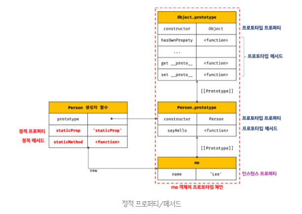

- 앞에서 살펴본 Object.create 메서드는 Object 생성자 함수의 정적 메서드이고, Object.prototype.hasOwnProperty 메서드는 Object.prototype의 메서드이다.
- 따라서 Object.create 메서드는 인스턴스, 즉 Object 생성자 함수가 생성한 객체로 호출할 수 없다.
- 하지만 Object.prototype.hasOwnProperty 메서드는 모든 객체의 프로토타입 체인의 종점, 즉, Object.prototype의 메서드이므로 모든 객체가 호출할 수 있다.
```javascript
// Object.create는 정적 메서드이다.
const obj = Object.create({ name: 'Lee' });

// Object.prototype.hasOwnProperty는 프로토타입 메서드이다.
obj.hasOwnProperty('name'); // false
```

- 만약 인스턴스/프로토타입 메서드 내에서 `this를 사용하지 않는다면 그 메서드는 정적 메서드로 변경할 수 있다.`
- 인스턴스가 호출한 인스턴스/프로토타입 메서드 내에서 this는 인스턴스를 가리킨다.
- 메서드 내에서 `인스턴스를 참조할 필요가 없다면 정적 메서드로 변경해도 동작한다.`
- `프로토타입 메서드를 호출하려면 인스턴스를 생성해야 하지만 정적 메서드는 인스턴스를 생성하지 않아도 호출할 수 있다.`
```javascript
function Foo() {}

Foo.prototype.x = function () {
    console.log('x');
};

const foo = new Foo();

console.log(foo.x());
/*
x
undefined
*/

Foo.x = function () {
    console.log('x');
};

console.log(Foo.x());
/*
x
undefined
*/
```
- 인스턴스를 생성하지 않아도 되는 코드는 정적 메소드로 사용하자.
- 프로퍼티가 정적 프로퍼티인 경우는 대부분 상수이다. ex) Math.PI
- 프로토타입 메서드는 인스턴스가 가지고 있거나 상속받은 메서드이어야 한다는 전제가 있어야한다.

- MDN과 같은 문서를 보면 다음과 같이 정적 프로퍼티/메서드와 프로토타입 프로퍼티/메서드를 구분하여 소개하고 있다.
- 따라서 표기법만으로도 정적 프로퍼티/메서드와 프로토타입 프로퍼티/메서드를 구별할 수 있어야 한다.
<br />

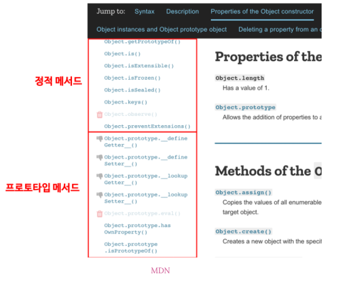

- 참고로 프로토타입 프로퍼티/메서드를 표기할 때 prototype을 `#`으로 표기(예를 들어, `Object.prototype.isPropertyOf`를 `Object#isPropertyOf`으로 표기)하는 경우도 있으니 알아두자.

#### 프로퍼티 존재 확인
1. `in 연산자`
- in 연산자는 객체 내에 특정 프로퍼티가 존재하는지 여부를 확인한다.
```javascript
// key: 프로퍼티 키를 나타내는 문자열
// object: 객체로 평가되는 표현식
key in object
```
```javascript
const person = {
    name: 'Lee',
    address: 'Seoul'
};

console.log('name' in person); // true
console.log('address' in person); // true
console.log('age' in person); // false
```
- in 연산자는 확인 대상 객체(위 객체의 경우 person 객체)의 프로퍼티뿐만 아니라 `확인 대상 객체가 상속받은 모든 프로토타입의 프로퍼티를 확인`하므로 주의하자.
- person 객체에는 toString이라는 프로퍼티가 없지만 다음 코드의 실행 결과는 true이다.
```javascript
console.log('toString' in person); // true
```
- in 연산자가 person 객체가 속한 프로토타입 체인 상에 존재하는 모든 프로토타입에서 toString 프로퍼티를 검색했기 때문이다.
- toString은 Object.prototype의 메서드이다.

- in 연산자 대신 ES6에서 도입된 `Reflect.has 메서드`를 사용할 수도 있다.
- `Reflect.has 메서드`는 in 연산자와 동일하게 동작한다.
```javascript
const person = {
    name: 'Lee',
    address: 'Seoul'
};

console.log(Reflect.has(person, 'name')); // true
console.log(Reflect.has(person, 'toString')); // true
```

2. Object.prototype.hasOwnProperty 메서드
- Object.prototype.hasOwnProperty 메서드를 사용해도 객체에 특정 프로퍼티가 존재하는지 확인할 수 있다.
```javascript
console.log(person.hasOwnProperty('name')); // true
console.log(person.hasOwnProperty('age')); // false
```
- Object.prototype.hasOwnProperty 메서드는 이름에서 알 수 있듯이 인수로 전달받은 프로퍼티 키가 `객체 고유의 프로퍼티 키인 경우에만 true`를 반환하고, `상속받은 프로토타입 프로퍼티 키인 경우 false`를 반환한다.
```javascript
console.log(person.hasOwnProperty('toString')); // false
```

#### 프로퍼티 열거
1. for...in 문
- 객체의 모든 프로퍼티를 순회하며 `열거(enumeration)`하려면 for...in 문을 사용한다.
```javascript
for (변수선언문 in 객체) { ... }
```
```javascript
const person = {
    name: 'Lee',
    address: 'Seoul'
};

for (const key in person) {
    console.log(key + ': ' + person[key]);
}
/*
name: Lee
address: Seoul
*/
```
- for...in 문은 객체의 프로퍼티 개수만큼 순회하며 for...in 문의 변수선언문에서 선언한 변수에 프로퍼티 키를 할당한다.
- for...in 문은 in 연산자처럼 순회 대상 객체의 프로퍼티 뿐만 아니라 `상속받은 프로토타입의 프로퍼티까지 열거`한다.

```javascript
const person = {
    name: 'Lee',
    address: 'Seoul'
};

// in 연산자는 객체가 상속받은 모든 프로토타입의 프로퍼티를 확인한다.
console.log('toString' in person); // true

// for...in 문도 객체가 상속받은 모든 프로토타입의 프로퍼티를 열거한다.
// 하지만 toString과 같은 Object.prototype의 프로퍼티가 열거되지 않는다.
for (const key in person) {
    console.log(key + ': ' + person[key]);
}
/*
name: Lee
address: Seoul
*/
```
- Object.prototype.toString 프로퍼티의 프로퍼티 어트리뷰트 `[[Enumerable]]`의 값이 false이기 때문이다.
```javascript
console.log(Object.getOwnPropertyDescriptor(Object.prototype, 'toString'));
/*
{
  value: [Function: toString],
  writable: true,
  enumerable: false,
  configurable: true
}
*/
```
- `for...in 문은 객체의 프로토타입 체인 상에 존재하는 모든 프로토타입의 프로퍼티 중에서 프로퍼티 어트리뷰트 [[Enumerable]]의 값이 true인 프로퍼티를 순회하여 열거(enumeration)한다.`
```javascript
const person = {
    name: 'Lee',
    address: 'Seoul',
    __proto__: { age: 20 }
};


for (const key in person) {
    console.log(key + ': ' + person[key]);
}
/*
name: Lee
address: Seoul
age: 20
*/
```
- for...in 문은 프로퍼티 키가 `심벌인 프로퍼티는 열거하지 않는다.`
```javascript
const sym = Symbol();
const obj = {
    a: 1,
    [sym]: 10
};

for (const key in obj) {
    console.log(key + ': ' + obj[key]);
}
// a: 1
```
- 상속받은 프로퍼티는 제외하고 `객체 자신의 프로퍼티 만을 열거하려면 Object.prototype.hasOwnProperty 메서드를 사용`하여 객체 자신의 프로퍼티인지 확인해야 한다.
```javascript
const person = {
    name: 'Lee',
    address: 'Seoul',
    __proto__: { age: 20 }
};

for (const key in person) {
    if (!person.hasOwnProperty(key)) continue;
    console.log(key + ': ' + person[key]);
}
/*
name: Lee
address: Seoul
*/
```
- for...in 문은 프로퍼티를 열거할 때 `순서를 보장하지 않으므로 주의하자`
- 대부분의 모던 브라우저는 순서를 보장하고 숫자(사실은 문자열)인 프로퍼티 키에 대해서는 정렬을 한다.
```javascript
const obj = {
    2: 2,
    3: 3,
    1: 1,
    b: 'b',
    a: 'a'
};

for (const key in obj) {
    if(!obj.hasOwnProperty(key)) continue;
    console.log(key + ': ' + obj[key]);
}
/*
1: 1
2: 2
3: 3
b: b
a: a
*/
```
- `배열`에는 for...in문을 사용하지 말고 일반적인 `for 문이나 for...of문 또는 Array.prototype.forEach 메서드를 사용하기를 권장`한다.
- 사실 배열도 객체이므로 프로퍼티와 상속받은 프로퍼티가 포함될 수 있다. 
```javascript
const arr = [1, 2, 3];
arr.x = 10; // 배열도 객체이므로 프로퍼티를 가질 수 있다.

for (const i in arr) {
    console.log(arr[i]); // 1 2 3 10
};

for (let i = 0; i < arr.length; i++) {
    console.log(arr[t]); // 1 2 3
}

// forEach 메서드는 요소가 아닌 프로퍼티는 제외한다.
arr.forEach(v => console.log(v)); // 1 2 3

// for...of는 변수 선언문에서 선언한 변수에 키가 아닌 값을 할당한다.
for (const value of arr) {
    console.log(value); // 1 2 3
};
```

2. Object.keys/values/entries 메서드
- `객체 자신의 고유 프로퍼티만을 열거하기 위해서는` for...in 문을 사용하는 것보다 `Object.keys/values/entries 메서드를 사용`하는 것을 권장한다.
- Object.keys 메서드는 객체 자신의 열거 가능한(enumerable) 프로퍼티 키를 배열로 반환한다.
```javascript
const person = {
    name: 'Lee',
    address: 'Seoul',
    __proto__: { age: 26 }
};

console.log(Object.keys(person)); // [ 'name', 'address' ]
```

- ES8에서 도입된 Object.values 메서드는 객체 자신의 열거 가능한 프로퍼티 값을 배열로 반환한다.
```javascript
console.log(Object.values(person)); // [ 'Lee', 'Seoul' ]
```

- ES8에서 도입된 Object.entries 메서드는 객체 자신의 열거 가능한 프로퍼티 키와 값의 쌍의 배열을 배열에 담아 반환한다.
```javascript
console.log(Object.entries(person)); 
// [ [ 'name', 'Lee' ], [ 'address', 'Seoul' ] ]

Object.entries(person).forEach(([key, value]) => console.log(key, value));
/*
name Lee
address Seoul
*/
```

</div> 
</details>

---