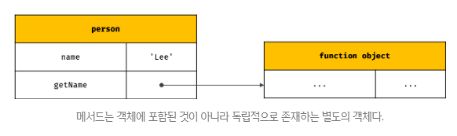
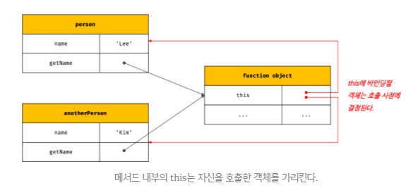
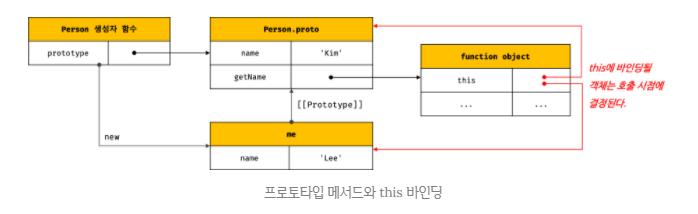
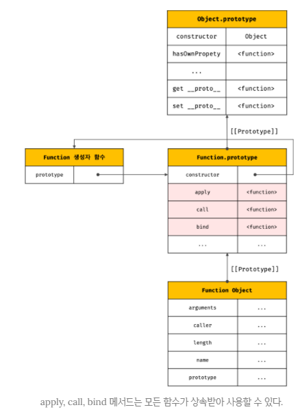

## JAVASCRIPT
<details open>
<summary>this</summary>
<div markdown="22">

#### this 키워드
- `객체` : `상태(state)를 나타내는 프로퍼티`와 `동작(behavior)을 나타내는 메서드`를 `하나의 논리적인 단위로 묶은 복합적인 자료구조`이다.
- 메서드는 자신이 속한 객체의 상태, 즉 프로퍼티를 참조하고 변경할 수 있어야 한다.
- 이때 메서드가 자신이 속한 객체의 프로퍼티를 참조하려면 먼저 `자신이 속한 객체를 가리키는 식별자를 참조`할 수 있어야 한다.

- 객체 리터럴 방식으로 생성한 객체의 경우 메서드 내부에서 자신이 속한 객체를 가리키는 식별자를 재귀적으로 참조할 수 있다.
```javascript
const circle = {
  // 함수는 태어날 때 자신의 상위 스코프를 기억한다.(렉시컬 스코프)
  radius: 5,
  // getDiameter의 상위 스코프 : 전역 스코프, circle은 코드 블럭이 아니라 객체리터럴이다.(따라서 상위스코프가 아니다.)
  getDiameter() {
    return circle.radius * 2;
  }
};

console.log(circle.getDiameter()); // 10
```
- 위 예제의 `객체 리터럴은 circle 변수에 할당되기 직전에 평가`된다. 따라서 getDiameter 메서드가 호출되는 시점에는 이미 객체 리터럴의 평가가 완료되어 객체가 생성되었고 circle 식별자에 생성된 객체가 할당된 이후이다.
- 따라서 메서드 내부에서 circle 식별자를 참조할 수 있다.
- 하지만, 자기 자신이 속한 객체를 재귀적으로 참조하는 방식은 일반적이지 않으며 바람직하지 않다.

```javascript
function Circle(radius) {
  ????.radius = radius;
}

Circle.prototype.getDiameter = function () {
  return ????.radius * 2;
};

const circle = new Circle(5);
```
- 생성자 함수로 인스턴스를 생성하려면 먼저 생성자 함수가 존재해야 한다.
- `생성자 함수를 정의하는 시점에는 아직 인스턴스를 생성하기 이전이므로 생성자 함수가 생성할 인스턴스를 가리키는 식별자를 알 수 없다.`
- 따라서 자신이 속한 객체 또는 자신이 생성할 인스턴스를 가리키는 특수한 식별자가 필요하다.

- 이를 위해 자바스크립트는 this라는 특수한 식별자를 제공한다.
- `this는 자신이 속한 객체 또는 자신이 생성할 인스턴스를 가리키는 자기 참조 변수(self-referencing variable)`이다.
- this는 자바스크립트 엔진에 의해 암묵적으로 생성되며, 코드 어디서든 참조할 수 있다. 
- 함수를 호출하면 `arguments 객체`와 `this`가 암묵적으로 함수 내부에 전달된다.
- 함수 내부에서 arguments 객체를 지역 변수처럼 사용할 수 있는 것처럼 this도 지역 변수처럼 사용할 수 있다.
- 단, `this가 가리키는 값, 즉 this 바인딩은 함수 호출 방식에 의해 동적으로 결정된다.`

```javascript
const circle = {
  radius: 5,
  getDiameter() {
    return this.radius * 2;
  }
};

console.log(circle.getDiameter()); // 10
```
- 객체 리터럴의 메서드 내부에서의 this는 메서드를 호출한 객체, 즉 circle을 가리킨다.

```javascript
function Circle(radius) {
  this.radius = radius;
}

Circle.prototype.getDiameter = function () {
  return this.radius * 2;
};

const circle = new Circle(5);
console.log(circle.getDiameter()); // 10
```
- `생성자 함수 내부`의 `this는 생성자 함수가 생성할 인스턴스`를 가리킨다.

- 자바나 C++ 같은 클래스 기반 언어에서 this는 언제나 클래스가 생성하는 인스턴스를 가리킨다.
- 자바스크립트의 this는 `함수가 호출되는 방식에 따라 this에 바인딩될 값, 즉 this 바인딩이 동적으로 결정`된다.  
- 또한 `strict mode(엄격 모드) 역시 this 바인딩에 영향을 준다.`

- this는 코드 어디에서든 참조 가능하다. 전역에서도 함수 내부에서도 참조할 수 있다.
```javascript
console.log(this); // 전역 객체 window

function square(number) {
  // 일반 함수 내부에서 this : 전역 객체 window
  console.log(this); // 전역 객체 window
  return number * number;
}

square(2);

const person = {
  name: 'Lee',
  getName() {
    // 메서드 내부에서 this : 메서드를 호출한 객체
    console.log(this); // {name: "Lee", getName: f}
    return this.name;
  }
};

console.log(person.getName()); // Lee

function Person(name) {
  this.name = name;
  // 생성자 함수 내부에서 this : 생성자 함수가 생성할 인스턴스
  console.log(this); // Person {name: "Lee"}
}

const me = new Person('Lee');
```
- this는 객체의 프로퍼티나 메서드를 참조하기 위한 자기 참조 변수이므로 일반적으로 객체의 `메서드 내부` 또는 `생성자 함수` 내부에서만 의미가 있다.
- 따라서 `strict mode가 적용된 일반 함수 내부의 this에는 undefined가 바인딩`된다.
- 일반 함수 내부에서 this를 사용할 필요가 없기 때문이다.

#### this 바인딩
- `바인딩(name binding)` : `식별자와 값을 연결하는 과정`
- 변수 선언 : 변수 이름(식별자)과 확보된 메모리 공간의 주소를 바인딩하는 것
- this 바인딩 : this(키워드로 분류되지만 식별자 역할)와 this가 가리킬 객체를 바인딩하는 것

#### 함수 호출 방식과 this 바인딩
- `this 바인딩은 함수 호출 방식, 즉 함수가 어떻게 호출되었는지에 따라 동적으로 결정된다.`
- `렉시컬 스코프와 this 바인딩은 결정 시기가 다르다.` : 함수의 상위 스코프를 결정하는 방식인 렉시컬 스코프(lexical scope)는 `함수 정의`가 평가되어 함수 객체가 생성되는 시점에 상위 스코프를 결정한다. 하지만 this 바인딩은 `함수 호출` 시점에 결정된다.
- 동일한 함수도 다양한 방식으로 호출할 수 있다.
- 함수를 호출하는 방식 
	1. 일반 함수 호출
	2. 메서드 호출
	3. 생성자 함수 호출
	4. Function.prototype.apply/call/bind 메서드에 의한 간접 호출

```javascript
const foo = function () {
  console.dir(this);
};

// 1. 일반 함수 호출
// this: 전역 객체 window
foo(); // window

// 2. 메서드 호출
// this : 메서드를 호출한 객체 obj
const obj = { foo };
obj.foo(); // obj

// 3. 생성자 함수 호출
// this : 생성자 함수가 생성한 인스턴스
new foo(); // foo {}

// 4. Function.prototype.apply/call/bind 메서드에 의한 간접 호출
// this : 인수에 의해 결정
const bar = { name: 'bar' };

foo.call(bar); // bar
foo.apply(bar); // bar
foo.bind(bar)(); // bar
```

1. 일반 함수 호출
- `기본적으로 this에는 전역 객체(global object)가 바인딩`된다.
```javascript
function foo() {
  console.log(this); // window

  function bar() {
    console.log(this); // window
  }
  bar();
}

foo();
```
- `전역함수`는 물론이고 `중첩함수를 일반 함수로 호출`하면 함수 내부의 `this에는 전역객체가 바인딩`된다.
- 다만 this는 객체의 프로퍼티나 메서드를 참조하기 위한 자기 참조 변수이므로 객체를 생성하지 않는 `일반 함수에서 this는 의미가 없다.`
- 따라서, `strict mode가 적용된 일반 함수 내부의 this에는 undefined가 바인딩된다.`
```javascript
function foo() {
  'use strict';

  console.log(this); // undefined

  function bar() {
    console.log(this); // undefined
  }
  bar();
}

foo();
```

- `메서드 내에서 정의한 중첩함수`도 `일반함수로 호출`되면 `중첩함수 내부의 this`에는 `전역객체가 바인딩`된다.
```javascript
var value = 1;

const obj = {
  value: 100,
  foo() {
    console.log(this); // {value: 100, foo: f}
    console.log(this.value); // 100

    // 메서드 내에서 정의한 중첩함수
    function bar() {
      console.log(this); // window
      console.log(this.value); // 1
    }

    bar();
  }
};

obj.foo();
```

- `콜백함수가 일반함수로 호출된다면` `콜백함수 내부의 this도 전역객체가 바인딩`된다.
- 어떠한 함수라도 일반함수로 호출되면 this에 전역 객체가 바인딩된다.

```javascript
var value = 1;

const obj = {
  value: 100,
  foo() {
    console.log(this); // {value: 100, foo: f}

    setTimeout(function () {
      console.log(this); // window
      console.log(this.value); // 1
    }, 100);
  }
};

obj.foo();
```
##### setTimeout 함수
- setTimeout 함수는 두 번째 인수로 전달한 시간(ms)만큼 대기한 다음, 첫 번째 인수로 전달한 콜백함수를 호출하는 타이머 함수이다. → 비동기와 관련있다.(두 번째 인수로 전달된 시간후에, 콜백함수가 브라우저에 의해 호출이 되어진다.)
- 1초 = 1000ms

- `일반함수로 호출된 모든 함수(중첩함수, 콜백함수 포함) 내부의 this에는 전역객체가 바인딩된다.`

- 하지만 메서드 내에서 정의한 중첩함수 또는 메서드에게 전달한 콜백함수(보조함수)가 일반함수로 호출될 때, 메서드 내의 중첩함수 또는 콜백함수의 this가 전역객체를 바인딩하는 것은 문제가 있다.
- 중첩함수 또는 콜백함수는 외부함수를 돕는 헬퍼 함수의 역할을 하므로 외부 함수의 일부 로직을 대신하는 경우가 대부분이다.
- 하지만 `외부 함수인 메서드와 중첩함수 또는 콜백함수의 this가 일치하지 않는다는 것은 중첩함수 또는 콜백함수를 헬퍼함수로 동작하기 어렵게 만든다.`

- 메서드 내부의 중첩함수나 콜백함수의 this 바인딩을 메서드의 this 바인딩과 일치시키기 위한 방법
```javascript
var value = 1;

const obj = {
  value: 100,
  foo() {
    // this 바인딩(obj)을 변수 that에 할당
    const that = this;

    setTimeout(function () {
      console.log(that.value); // 100
    }, 100);
  }
};

obj.foo();
```
```javascript
var value = 1;

const obj = {
  value: 100,
  foo() {
    // 콜백 함수에 명시적으로 this를 바인딩한다.
    // this
    setTimeout(function () {
      console.log(this.value); // 100
    }.bind(this), 100);
    // 여기서의 this는 위의 주석 this, 즉 외부의 this를 함수 내부에 바인딩한다.
  }
};

obj.foo();
```
```javascript
function add(a,b) {
  return a + b;
}

add(1, 2);
// 인수는 함수 외부에 있었던 값이다.
// "외부"에 있던 인수가 매개변수를 타고 내부로 들어간다.
```
```javascript
var value = 1;

const obj = {
  value: 100,
  foo() {
    // 화살표 함수 내부의 this는 상위 스코프의 this를 가리킨다.
    setTimeout(() => console.log(this.value), 100); // 100
  }
};

obj.foo();
// 화살표 함수는 함수 내부에 this가 없다. 따라서 상위 스코프로 찾아올라간다.
// 위의 화살표함수의 상위 스코프는 foo 메서드이다. → 따라서 화살표 안의 this와 외부의 this가 동일할 수 있다.
```

2. 메서드 호출
- `메서드 내부의 this`에는 `메서드를 호출한 객체`, 즉 메서드를 호출할 때 메서드 이름 앞의 `마침표(.) 연산자 앞에 기술한 객체`가 바인딩된다.
※ 주의 : 메서드 내부의 this는 메서드를 소유한 객체가 아닌 `메서드를 호출한 객체`에 바인딩된다는 것이다.

```javascript
const person = {
  name: 'Lee',
  getName() {
    // 메서드 내부의 this는 메서드를 호출한 객체에 바인딩된다.
    return this.name;
  }
};

// 메서드 getName을 호출한 객체는 person이다.
console.log(person.getName()); // Lee
```
- 메서드는 프로퍼티에 바인딩된 함수이다.
- 즉, person 객체의 getName 프로퍼티가 가리키는 함수객체는 person 객체에 포함된 것이 아니라 `독립적으로 존재하는 별도의 객체`이다.
- `getName 프로퍼티가 함수객체를 가리키고 있을 뿐`이다.
<br />


- 따라서 getName 프로퍼티가 가리키는 함수 객체, 즉 getName 메서드는 다른 객체의 프로퍼티에 할당하는 것으로 `다른 객체의 메서드가 될 수도 있고` `일반 변수에 할당`하여 일반 함수로 호출할 수도 있다.

```javascript
const person = {
  name: 'Lee',
  getName() {
    return this.name;
  }
};

const anotherPerson = {
  name: 'Kim'
};

// getName 메서드를 anotherPerson 객체의 메서드로 할당
anotherPerson.getName = person.getName;

// getName 메서드를 호출한 객체는 anotherPerson이다.
console.log(anotherPerson.getName()); // Kim

// getName 메서드를 변수에 할당
const getName = person.getName;

// getName 메서드를 일반 함수로 호출
console.log(getName()); // ''
// 일반 함수로 호출한 getName 함수 내부의 this.name은 브라우저 환경에서 window.name과 같다.
// 브라우저 환경에서 window.name은 브라우저 창의 이름을 나타내는 빌트인 프로퍼티이며 기본값은 ''이다.
// Node.js 환경에서 this.name은 undefined이다.
```
```javascript
function Person(name) {
  this.name; 
  this.sayHello = function() {
    return `안녕 ${this.name}`; // 메서드 안에 있으므로 this는 .앞에 있는 객체
  };
}

const lee = new Person('Lee');

const foo = lee.sayHello; // 참조값이 넘어감, 같은 함수를 바라보고 있음
console.log(foo()); // 일반 함수로서 호출하면 this는 window를 가리킴, 따라서 안녕 '빈 문자열'이 뜬다. window.name은 빈 문자열이 기본값이므로

console.log(new lee.sayHello()); // {}
```
```javascript
function foo() {
  console.log(`안녕? 나는 ${this.name}이야`); // 메서드로서 호출할 것이라는 전제
}

function Person(name) {
  this.name = name;
  this.sayHi = foo; // 객체 지향이 깨짐(상속되는 객체와 교신하는 것이 아님), 상위 스코프의 식별자 참조(상속이 아님)
}

const me = new Person('Lee');
console.log(me.sayHi()); // 안녕? 나는 Lee이야 undefined
```
- 따라서 메서드 내부의 this 프로퍼티로 메서드를 가리키고 있는 객체와는 관계가 없고, `메서드를 호출한 객체에 바인딩된다.`
<br />



- 프로토타입 메서드 내부에서 this도 일반 메서드와 마찬가지로 해당 메서드를 호출한 객체에 바인딩된다.
```javascript
function Person(name) {
  this.name = name;
}

Person.prototype.getName = function () {
  return this.name;
};

const me = new Person('Lee');

// getName 메서드를 호출한 객체는 me이다.
console.log(me.getName()); // Lee

Person.prototype.name = 'Kim';

// getName 메서드를 호출한 객체는 Person.prototype
console.log(Person.prototype.getName()); // Kim
```
<br />



3. 생성자 함수 호출
- 생성자 함수 내부의 this에는 `생성자 함수가 (미래에) 생성할 인스턴스`가 바인딩된다.
- 만약 new 연산자와 함께 생성자 함수를 호출하지 않으면 생성자 함수가 아니라 일반 함수로 동작한다.

4. Function.prototype.apply/call/bind 메서드에 의한 간접 호출
- `apply, call, bind 메서드는 Function.prototype의 메서드`이다.
- 즉, 이들 메서드는 모든 함수가 상속받아 사용할 수 있다.
<br />



- `Function.prototype.apply`, `Function.prototype.call` 메서드는 `this로 사용할 객체와 인수리스트를 인수로 전달 받아 함수를 호출`한다.
```javascript
// 주어진 this 바인딩과 인수 리스트 배열을 사용하여 함수를 호출
// thisArg – this로 사용할 객체
// argsArray – 함수에게 전달할 인수 리스트의 배열 또는 유사 배열 객체
Function.prototype.apply(thisArg[, argsArray])
```
```javascript
// 주어진 this 바인딩과 ,로 구분된 인수 리스트를 사용하여 함수를 호출
// thisArg – this로 사용할 객체
// arg1, arg2, arg3, ... - 함수에게 전달할 인수 리스트
Function.prototype.call(thisArg[, arg1[, arg2[, arg3 ...]]]);
```
```javascript
function getThisBinding() {
  return this;
}

const thisArg = { a: 1 };

console.log(getThisBinding()); // window

console.log(getThisBinding.apply(thisArg)); // {a: 1}
console.log(getThisBinding.call(thisArg)); // {a: 1}
```
- `apply와 call 메서드의 본질적인 기능을 함수를 호출하는 것이다.`
- apply와 call 메서드는 함수를 호출하면서 첫 번째 인수로 전달한 특정 객체를 호출한 함수의 this에 바인딩한다.

- apply와 call 메서드는 호출한 함수에 `인수를 전달하는 방식`만 다를 뿐 동일하게 동작한다.

```javascript
function getThisBinding() {
  console.log(arguments);
  return this;
}

const thisArg = { a: 1 };

// getThisBinding 함수를 호출하면서 인수로 전달한 객체를 getThisBinding 함수의 this에 바인딩한다.
// apply 메서드는 호출할 함수의 인수를 배열로 묶어 전달한다.
console.log(getThisBinding.apply(thisArg, [1, 2, 3]));
// Arguments(3) [1, 2, 3, callee: ƒ, Symbol(Symbol.iterator): ƒ]
// {a: 1}

// call 메서드는 호출할 함수의 인수를 쉼표로 구분한 리스트 형식으로 전달한다.
console.log(getThisBinding.call(thisArg, 1, 2, 3));
// Arguments(3) [1, 2, 3, callee: ƒ, Symbol(Symbol.iterator): ƒ]
// {a: 1}
```
- `apply 메서드는 호출할 함수의 인수를 배열로 묶어 전달`한다.
- `call 메서드는 호출할 함수의 인수를 쉼표로 구분한 리스트 형식으로 전달`한다.
- apply, call 메서드는 호출할 함수에 인수를 전달하는 방식만 다를 뿐 `this로 사용할 객체를 전달하면서 함수를 호출하는 것은 동일`하다.

- apply와 call 메서드의 대표적인 용도는 `arguments 객체와 같은 유사 배열 객체의 메서드를 사용하는 것`이다.
- `arguments 객체는 배열이 아니기 때문에 Array.prototype.slice 같은 배열의 메서드를 사용할 수 없으나 apply와 call 메서드를 이용하면 가능`하다.
```javascript
function convertArgsToArray() {
  console.log(arguments);

  // arguments 객체를 배열로 변환
  // Array.prototype.slice를 인수없이 호출하면 배열의 복사본을 생성한다.
  const arr = Array.prototype.slice.call(arguments);
  // const arr = Array.prototype.slice.apply(arguments);

  console.log(arr);

  return arr;
}

convertArgsToArray(1, 2, 3); // [1, 2, 3]
```

- `Function.prototype.bind 메서드`는 apply와 call 메서드와 달리 `함수를 호출하지 않고 this로 사용할 객체만 전달`한다.
```javascript
function getThisBinding() {
  return this;
}

const thisArg = { a: 1 };

// bind 메서드는 함수에 this로 사용할 객체를 전달한다.
// bind 메서드는 함수를 호출하지는 않는다.
console.log(getThisBinding.bind(thisArg)); // getThisBinding
// bind 메서드는 함수를 호출하지는 않으므로 명시적으로 호출해야 한다.
console.log(getThisBinding.bind(thisArg)()); // {a: 1}
```
- bind 메서드는 `this와 메서드 내부의 중첩함수 또는 콜백함수의 this가 불일치하는 문제를 해결하기 위해 유용하게 사용`된다.
```javascript
const person = {
  name: 'Lee',
  foo(callback) {
    // ①
    setTimeout(callback, 100);
  }
};

person.foo(function () {
  console.log(this.name); // ② window.name, ''
  // 일반 함수로 호출된 콜백함수 내부의 this.name은 브라우저 환경에서 window.name과 같다.
  // 브라우저 환경에서 window.name은 브라우저 창의 이름을 나타내는 빌트인 프로퍼티이며 기본값은 ''이다.
  // Node.js 환경에서 this.name은 undefined이다.
});
```
- person.foo 콜백함수가 호출되기 이전인 ①의 시점에서 this는 foo 메서드를 호출한 객체, 즉 person 객체를 가리킨다.
- 하지만, person.foo 콜백함수가 일반함수로서 호출된 ②의 시점에서 this는 전역객체 window를 가리킨다.
- person.foo의 콜백함수는 외부함수 person.foo를 돕는 헬퍼함수(보조함수)의 역할을 하기 때문에 `외부함수 person.foo 내부의 this와 콜백함수 내부의 this가 상이하면 문맥상 문제가 발생`한다.
- 따라서 `콜백함수 내부의 this를 외부함수 내부의 this와 일치시켜 주어야한다.` `이때 bind 메서드를 사용하여 this를 일치시킬 수 있다.`
```javascript
const person = {
  name: 'Lee',
  foo(callback) {
    // bind 메서드로 callback 함수 내부의 this 바인딩을 전달
    setTimeout(callback.bind(this), 100);
  }
};

person.foo(function () {
  console.log(this.name); // Lee
});
```

| 함수 호출 방식                                             | this 바인딩                                                  |
| ---------------------------------------------------------- | ------------------------------------------------------------ |
| 일반 함수 호출                                             | 전역 객체                                                    |
| 메서드 호출                                                | 메서드를 호출한 객체                                         |
| 생성자 함수                                                | 생성자 함수가 (미래에) 생성할 인스턴스                       |
| Function.prototype.apply/call/bind 메서드에 의한 간접 호출 | Function.prototype.apply/call/bind 메서드에 첫 번째 인수로 전달한 객체 |


</div> 
</details>

---