## JAVASCRIPT
<details open>
<summary>실행 컨텍스트</summary>
<div markdown="23">

<br />

- 실행 컨텍스트(execution context)는 자바스크립트의 동작 원리를 담고 있는 핵심 개념이다.
- 실행 컨텍스트를 바르게 이해하면 자바스크립트가 스코프를 기반으로 `식별자와 식별자에 바인딩된 값(식별자 바인딩)을 관리하는 방식`과 `호이스팅이 발생하는 이유`, `클로저의 동작 방식`, `태스크 큐와 함께 동작하는 이벤트 핸들러`, `비동기 처리의 동작 방식`을 이해할 수 있다.
- 실행 컨텍스트는 이름이 다르고 세부 동작이 다를 뿐 다른 언어에서도 존재한다.

#### 소스코드의 타입
- ECMAScript 사양은 소스코드(ECMAScript code)를 4가지 타입으로 구분한다. 4가지 타입의 소스코드는 실행 컨텍스트를 생성한다.

| 소스코드의 타입          | 설명                                                         |
| ------------------------ | ------------------------------------------------------------ |
| 전역 코드(global code)   | 전역에 존재하는 소스코드를 말한다. 전역에 정의된 함수, 클래스 등의 내부 코드는 포함되지 않는다. |
| 함수 코드(function code) | 함수 내부에 존재하는 소스코드를 말한다. 함수 내부에 중첩된 함수, 클래스 등의 내부 코드는 포함되지 않는다. |
| eval 코드(eval code)     | 빌트인 전역 함수인 eval 함수에 인수로 전달되어 실행되는 소스코드를 말한다. |
| 모듈 코드(module code)   | 모듈 내부에 존재하는 소스코드를 말한다. 모듈 내부의 함수, 클래스 등의 코드는 포함되지 않는다. |


- 소스코드(실행 가능한 코드, executable code)를 4가지 타입으로 구분하는 이유는 `소스코드 타입에 따라 실행 컨텍스트를 생성하는 과정과 관리 내용이 다르기 때문이다.`

1. 전역 코드
- 전역 코드는 전역 변수를 관리하기 위해 최상위 스코프인 전역 스코프를 생성해야 한다.
- 그리고 `var 키워드로 선언된 전역 변수`와 `함수 선언문으로 정의된 전역 함수`를 전역 객체의 프로퍼티와 메서드로 바인딩하고 참조하기 위해 `전역 객체와 연결되어야 한다.
- 전역 객체는 전역 실행 컨텍스트의 상위 개념이 아니라, 둘은 바인딩 되어 있다.
- 이를 위해 `전역 코드가 평가되면 전역 실행 컨텍스트가 생성된다.`


2. 함수 코드
- 함수 코드는 지역 스코프를 생성하고 `지역변수`, `매개변수`, `arguments 객체`를 관리해야 한다.
- 그리고 생성한 지역 스코프를 전역 스코프에서 시작하는 스코프 체인의 일원으로 연결해야 한다. 
- 이를 위해 `함수 코드가 평가되면 함수 실행 컨텍스트가 생성된다.`

3. eval 코드
- eval 코드는 strict mode(엄격 모드)에서 자신만의 독자적인 스코프를 생성한다.
- 이를 위해 eval 코드가 평가되면 eval 실행 컨텍스트가 생성된다.

4. 모듈 코드
- 모듈 코드는 모듈별로 독자적인 모듈 스코프를 생성한다.
- 이를 위해 `모듈 코드가 평가되면 모듈 실행 컨텍스트가 생성된다.`

<br />

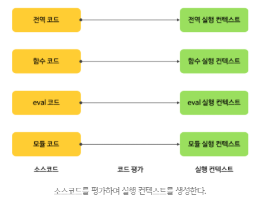

#### 소스코드의 평가와 실행
- 모든 소스코드는 실행에 앞서 평가 과정을 거치며 코드를 실행하기 위한 준비를 한다.
- 다시 말해, 자바스크립트 엔진은 소스코드를 2개의 과정, 즉 `소스코드의 평가`와 `소스 코드의 실행` 과정으로 나누어 처리한다.

- 소스코드 평가 과정 : 실행 컨텍스트 생성 → 변수, 함수 등의 선언문만을 먼저 실행하여 생성된 변수나 함수 식별자를 키로 실행 컨텍스트가 관리하는 스코프(렉시컬 환경의 환경 레코드)에 등록한다.
- 소스코드의 평가 과정 → 선언문을 제외한 소스코드가 순차적으로 실행(런타임 시작) : 이때 소스코드의 실행에 필요한 정보, 즉 `변수나 함수의 참조를 실행 컨텍스트가 관리하는 스코프에서 검색해서 취득`한다. 그리고 `변수 값의 변경과 같은 소스코드의 실행 결과는 다시 실행 컨텍스트가 관리하는 스코프에 등록된다.`
<br />

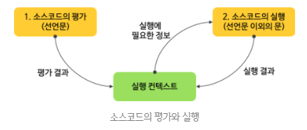

```javascript
var x = 1;
x = 1;
```
- 자바스크립트 엔진은 위 예제를 2개의 과정으로 나누어 처리한다.
- 먼저 `소스코드 평가 과정`에서 변수 선언문 `var x;`를 먼저 실행한다.
- 이때 생성된 변수 식별자 x는 실행 컨텍스트가 관리하는 스코프에 등록되고 undefined로 초기화된다.
<br />

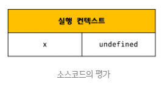

- 소스코드 평가 과정이 끝나면 비로소 소스코드 실행 과정이 시작된다. (런타임)
- 변수 선언문 `var x;`는 소스코드 평가 과정에서 이미 실행이 완료되었다.
- 따라서 소스코드 실행 과정에서는 변수 할당문 `x = 1;`만 실행된다.
- 이때 x 변수에 값을 할당하려면 먼저 x 변수가 선언된 변수인지 확인해야 한다.
- 이를 위해 실행 컨텍스트가 관리하는 스코프에 x 변수가 선언된 변수인지 확인한다.
- 만약 x 변수가 선언된 변수라면 값을 할당하고 할당 결과를 실행 컨텍스트에 등록하여 관리한다.
<br />


#### 실행 컨텍스트의 역할
```javascript
const x = 1;
const y = 2;

function foo(a) {
  const x = 10;
  const y = 20;

  console.log(a + x + y);
}

foo(100);

console.log(x + y);
```
1. `전역 코드의 평가` 
- 선언문(변수 선언문, 함수 선언문)만 먼저 실행한다. 
- 그 결과 생성된 전역 변수와 전역 함수가 실행 컨텍스트가 관리하는 전역 스코프에 등록된다. 
- 이때 var 키워드로 선언된 전역 변수와 함수 선언문으로 정의된 전역 함수는 전역 객체의 프로퍼티와 메서드가 된다.

- 참고로 자바스크립트는 진입점이 없기 때문에 전역 코드에 `console.log()` 메서드를 써도 실행이된다.

2. `전역 코드 실행` 
- 런타임이 시작되어 전역 코드가 순차적으로 실행된다. 
- 이때 전역 변수에 값이 할당되고 함수가 호출된다.
- 함수가 호출되면 코드 실행 순서를 변경하여 함수 내부로 진입한다.

3. `함수 코드 평가`
- 함수 내부 문들을 실행하기에 앞서 함수 코드 평가 과정을 거치며 함수 코드를 실행하기 위한 준비를 한다.
- 이때 매개변수와 지역 변수 선언문이 먼저 실행되고, 그 결과 생성된 매개변수와 지역 변수가 실행 컨텍스트가 관리하는 지역 스코프에 등록된다.
- 전역 코드에는 매개변수가 없기 때문에 arguments 객체 또한 없다.
- 또한, 내부에서 지역 변수처럼 사용할 수 있는 `arguments 객체가 생성`되어 스코프에 등록되고 `this 바인딩도 결정`된다.
- `함수 코드에서 var 키워드로 선언한 변수는 전역 객체와 관련이 없다.`

4. 함수 코드 실행
- 런타임이 시작되어 함수 코드가 순차적으로 실행된다.
- 이때 매개변수와 지역 변수에 값이 할당되고 `console.log 메서드`가 호출된다.

- `console.log 메서드`를 호출하기 위해 먼저 식별자인 console을 `스코프  체인`을 통해 검색한다.
- 이를 위해 함수 코드의 지역 스코프는 상위 스코프인 전역 스코프와 연결되어야 한다.
- 하지만, `console 식별자`는 스코프 체인에 등록되어 있지 않고, 전역 객체에 프로퍼티로 존재한다.
- 이는 전역 객체의 프로퍼티가 마치 전역 변수처럼 전역 스코프를 통해 검색 가능해야 한다는 것을 의미한다.
- 다음은 log 프로퍼티를 console 객체의 `프로토타입 체인`을 통해 검색한다.
- 그 후 `console.log 메서드`에 인수로 전달된 표현식 `a + x + y`가 평가된다.
- a, x. y 식별자는 스코프 체인을 통해 검색한다.

- `console.log 메서드`의 실행이 종료되면 함수 코드 실행 과정이 종료되고 함수 호출 이전으로 되돌아가 전역 코드 실행을 계속한다.
- 이처럼 함수 호출이 종료되면 함수 호출 이전으로 되돌아가기 위해 실행 중인 코드와 이전에 실행하던 코드를 구분하여 관리해야 한다.

- 이 모든 것을 관리하는 것이 바로 실행 컨텍스트이다.
- `실행 컨텍스트(execution context)는 소스코드를 실행하는데 필요한 환경을 제공하고 코드의 실행 결과를 실제로 관리하는 영역이다.`
- 즉, `실행 컨텍스트는 식별자를 등록하고 관리하는 스코프와 코드 실행 순서 관리를 구현한 내부 매커니즘으로, 모든 코드는 실행 컨텍스트를 통해 실행되고 관리된다.`
- 식별자와 스코프는 실행 컨텍스트의 `렉시컬 환경`으로 관리하고 코드 실행 순서는 `실행 컨텍스트 스택`으로 관리한다.

#### 실행 컨텍스트 스택
- 스택(stack) : LIFO(Last In First Out, 후입선출), FOLI(First In Last Out, 선입후출)
```javascript
const x = 1;

function foo() {
  const y = 2;

  function bar() {
    const z = 3;
    console.log(x + y + z);
  }

  bar();
}

foo(); // 6
```
- 자바스크립트 엔진은 먼저 `전역 코드를 평가하여 전역 실행 컨텍스트를 생성`한다.
- 그리고, 함수가 호출되면 `함수 코드를 평가하여 함수 실행 컨텍스트를 생성`한다.

- 이때 생성된 `실행 컨텍스트는 스택(stack) 자료구조로 관리`된다.
- 이를 `실행 컨텍스트 스택(execution context stack) 또는 콜 스택(call stack)`이라고 부른다.

- 실행 컨텍스트 스택에서 코드의 실행 순서를 관리하기 때문에 함수가 호출되어 함수 몸체가 모두 실행되면 호출되었던 시점으로 돌아갈 수 있다.(사실 내부 라인 수를 적어놓기 때문에 정확히 찾아갈 수 있다.)
- 위 코드를 실행하면 코드가 실행되는 시간의 흐름에 따라 실행 컨텍스트 스택에는 다음과 같이 실행 컨텍스트가 push되고 pop된다.
 <br />

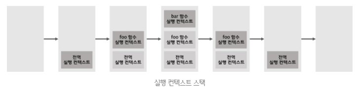

1. 전역 실행 컨텍스트 생성 및 실행 컨텍스트 스택에 push
2. foo 함수 실행 컨텍스트 생성 및 실행 컨텍스트 스택에 push
3. bar 함수 실행 컨텍스트 생성 및 실행 컨텍스트 스택에 push
(console.log 메서드도 함수이므로 호출되면 실행 컨텍스트를 생성 및 실행 컨텍스트 스택에 push된다. 그림에서는 생략됨)
4. bar 함수 실행 컨텍스트를 실행 컨텍스트 스택에서 pop
5. foo 함수 실행 컨텍스트를 실행 컨텍스트 스택에서 pop
6. 전역 실행 컨텍스트를 실행 컨텍스트 스택에서 pop

- 전역 실행 컨텍스트는 `항상` 실행 컨텍스트 가장 아래에 존재한다.

- 이처럼 `실행 컨텍스트 스택은 코드의 실행 순서를 관리한다.`
- `실행 컨텍스트 스택의 최상위에 존재하는 실행 컨텍스트는 언제나 현재 실행 중인 코드의 실행 컨텍스트이다.`
- 따라서, 실행 컨텍스트 스택의 최상위에 존재하는 실행 컨텍스트를 `실행 중인 실행 컨텍스트(running execution contect)`라 부른다.

#### 렉시컬 환경(Lexical Environment)
- 렉시컬 환경은 실행 컨텍스트의 프로퍼티, 즉 일부이다.
- 실행 컨텍스트와 렉시컬 환경은 1:1의 관계이다.
- 렉시컬 환경은 `식별자와 식별자에 바인딩된 값, 그리고 상위 스코프에 대한 참조를 기록하는 자료구조`로 `실행 컨텍스트를 구성하는 컴포넌트`이다.
- `렉시컬 환경은 스코프와 식별자를 관리한다.`
<br />

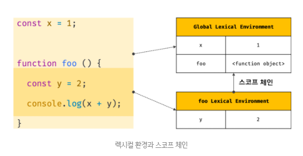

- 렉시컬 환경은 키와 값을 갖는 형태의 스코프(전역, 함수, 블록 스코프)를 생성하여 식별자를 키로 등록하고 식별자에 바인딩된 값을 관리한다.
- 즉, `렉시컬 환경은 스코프를 구분하여 식별자를 등록하고 관리하는 저장소 역할을 하는 렉시컬 스코프의 실체이다.`

- 실행 컨텍스트는 LexicalEnvironment 컴포넌트와 VariableEnvironment 컴포넌트로 구성된다.
- 생성 초기의 실행 컨텍스트와 렉시컬 환경을 그림으로 표현하면 다음과 같다.
<br />

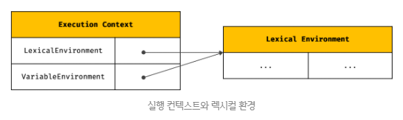

- 생성 초기에 LexicalEnvironment 컴포넌트와 VariableEnvironment 컴포넌트는 하나의 동일한 렉시컬 환경을 참조한다.
- 이후 몇 가지 상황을 만나면 VariableEnvironment 컴포넌트를 위한 새로운 렉시컬 환경을 생성하고, 이때부터 VariableEnvironment 컴포넌트와 LexicalEnvironment 컴포넌트는 내용이 달라지는 경우도 있다.
- 여기서는 strict mode와 eval 코드, try/catch 문과 같은 특수한 상황은 제외하고, LexicalEnvironment 컴포넌트와 VariableEnvironment 컴포넌트도 구분하지 않고 렉시컬 환경으로 통일해 간략하게 살펴보자.

- 렉시컬 환경은 다음과 같은 2개의 컴포넌트로 구성된다.
<br />

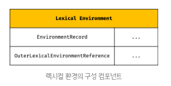

1. `환경 레코드(Environment Record)`
- 스코프에 포함된 식별자를 등록하고, 등록된 식별자에 바인딩된 값을 관리하는 저장소이다.
- 환경 레코드는 소스코드의 타입에 따라 관리하는 내용에 차이가 있다.

2. `외부 렉시컬 환경에 대한 참조(Outer Lexical Environment Reference)`
- 외부 렉시컬 환경에 대한 참조는 상위 스코프를 가리킨다.
- 이때 `상위 스코프란 외부 렉시컬 환경`을 말하며, `단방향 링크드 리스트`인 스코프 체인을 구현한다.
- `스코프 체인은 렉시컬 환경 체인을 말한다.`

#### 실행 컨텍스트의 생성과 식별자 검색 과정
```javascript
var x = 1;
const y = 2;

function foo(a) {
  var x = 3;
  const y = 4;

  function bar(b) {
    const z = 5;
    console.log(a + b + x + y + z);
  }
  bar(10);
}

foo(20); // 42
```
1. 전역 객체 생성
- `전역 객체는 전역 코드가 평가되기 이전에 생성된다.`
- 전역 객체도 `Object.prototype`을 상속받는다. 
- 즉, 전역 객체도 프로토타입 체인의 일원이다.
```javascript
window.toString(); // "[object Window]"

window.__proto__.__proto__.__proto__.__proto__ === Object.prototype; // true
```

2. 전역 코드 평가
```javascript
1. 전역 실행 컨텍스트 생성
2. 전역 렉시컬 환경 생성
	2.1. 전역 환경 레코드 생성
		2.1.1. 객체 환경 레코드 생성
		2.1.2. 선언적 환경 레코드 생성
	2.2. this 바인딩
	2.3. 외부 렉시컬 환경에 대한 참조 결정
```
<br />

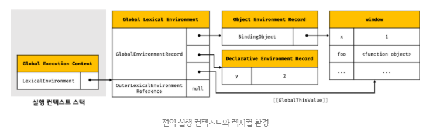

1. 전역 실행 컨텍스트 생성

2. 전역 렉시컬 환경 생성

2.1. 전역 환경 레코드 생성
- 모든 전역 변수가 전역 객체의 프로퍼티가 되는 `ES6 이전에는 전역 객체가 전역 환경 레코드의 역할을 수행`했다.
- 하지만, ES6의 let, const 키워드로 선언한 전역 변수는 전역 객체의 프로퍼티가 되지 않고 개념적인 블록 내에 존재하게 된다.
- 이처럼 기존의 var 키워드로 선언한 전역 변수와 ES6의 let, const 키워드로 선언한 전역 변수를 구분하여 관리하기 위해 `전역 환경 레코드는 객체 환경 레코드(Object Environment Record)와 선언적 환경 레코드(Declarative Environment Recode)로 구성되어 있다.`
- 객체 환경 레코드 : var 키워드로 선언한 변수, 함수 선언문, 빌트인 전역 프로퍼티와 빌트인 전역 함수, 표준 빌트인 객체를 관리
- 선언적 환경 레코드 : let, const 키워드로 선언한 전역 변수를 관리

2.1.1. 객체 환경 레코드 생성
- 전역 환경 레코드를 구성하는 컴포넌트인 객체 환경 레코드는 BindingObject라고 부르는 객체와 연결된다.
- `BindingObject는 위에서 생성된 전역 객체이다.`
- `var 키워드로 선언한 전역 변수와 함수 선언문으로 정의된 전역 함수는 전역 환경 레코드의 객체 환경 레코드에 연결된 BindingObject를 통해 전역 객체의 프로퍼티와 메서드가 된다.`
- 이것이 var 키워드로 선언된 전역 변수와 함수 선언문으로 정의된 전역 함수가 전역 객체를 가리키는 식별자(window) 없이 객체의 프로퍼티를 참조할 수 있는 매커니즘이다.
<br />

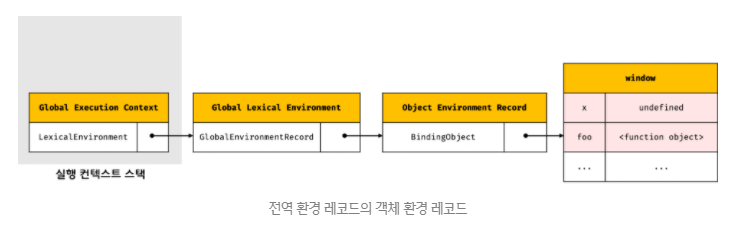

- x 변수는 var 키워드로 선언한 변수이다.
- 따라서 `선언 단계`와 `초기화 단계`가 `동시에 진행`된다.
- 다시 말해, 전역 객체의 변수 식별자를 키로 등록한 다음, 암묵적으로 undefined를 바인딩한다.
- 따라서 var 키워드로 선언한 변수는 코드 실행 단계(현시점은 코드 평가 단계)에서 변수 선언문 이전에도 참조할 수 있다.
- var 키워드로 선언함 변수에 할당한 함수 표현식도 이와 동일하게 동작한다.
- 이것이 `변수 호이스팅이 발생하는 원인이다.`

- 함수 선언문으로 정의한 함수가 평가되면 함수 이름과 동일한 이름의 식별자를 전역 객체의 키로 등록하고 생성된 함수 객체를 즉시 할당한다.
- 이것이 변수 호이스팅과 함수 호이스팅의 차이이다.
- 즉, `함수 선언문으로 정의한 함수는 함수 선언문 이전에 호출할 수 있다.`

2.1.2. 선언적 환경 레코드 생성
- ES6의 let, const 키워드로 선언한 전역 변수는 전역 객체의 프로퍼티가 되지 않고 개념적인 블록 내에 존재하게 된다고 했다.
- 여기서 개념적인 블록이 바로 `선언적 환경 레코드`이다.

<br />

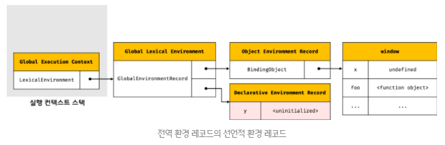

- let, const 키워드로 선언한 변수는 `선언 단계`와 `초기화 단계`가 `분리되어 진행`한다.
- 따라서 변수 선언문에 도달하기 전까지 `일시적 사각지대(Temporal Dead Zone; TDZ)`에 빠지게 된다.

2.2. this 바인딩
- 전역 환경 레코드의 `[[GlobalThisValue]]` 내부 슬롯에 this가 바인딩 된다.
- `일반적으로 전역 코드에서 this는 전역 객체를 가리키므로` 전역 환경 레코드의 `[[GlobalThisValue]]` 내부 슬롯에는 전역 객체가 바인딩된다.
- 전역 코드에서 this를 참조하면 전역 환경 레코드의 `[[GlobalThisValue]]` 내부 슬롯에 바인딩되어 있는 객체가 반환된다.
<br />

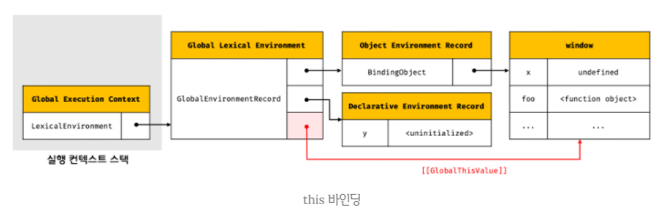

- 참고로 객체 환경 레코드와 선언적 환경 레코드에는 this 바인딩이 없다.
- this 바인딩은 전역 환경 레코드와 함수 환경 레코드에만 존재한다.
 
2.3. 외부 렉시컬 환경에 대한 참조 결정
- 외부 렉시컬 환경에 대한 참조(Outer Lexical Environment Reference)는 상위 스코프를 가리킨다.
- 이를 통해 `단방향 링크드 리스트인 스코프 체인을 구현한다.`

- 현재 평가 중인 소스코드는 전역 코드이다.
- 전역 코드를 포함하는 소스코드는 없으므로 외부 렉시컬 환경에 대한 참조에 null이 할당된다.
- 이는 `전역 렉시컬 환경이 스코프 체인의 종점에 존재함을 의미`한다.
<br />

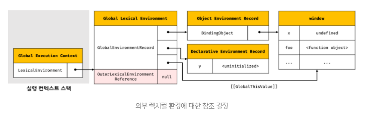

#### 전역 코드 실행
- 이제 전역 코드가 순차적으로 실행되기 시작한다.
- 변수 할당문이 실행되어 전역 변수 x, y에 값이 할당된다.
- 그리고 foo 함수가 호출된다.
<br />

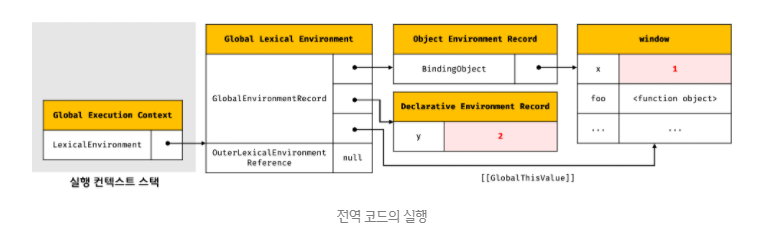
- 변수 할당문 또는 함수 호출문을 실행하려면 `먼저 변수 또는 함수 이름이 선언된 식별자인지 확인해야 한다.`
- 선언되지 않은 식별자는 참조할 수 없으므로 할당이나 호출도 할 수 없기 때문이다.
- 또한, 식별자는 스코프가 다르면 같은 이름을 가질 수 있다.
- 따라서 어느 스코프의 식별자를 참조하면 되는지 결정할 필요가 있다.
- 이를 `식별자 결정(identifier resolution)`이라 한다.

- `식별자 결정을 위해 식별자를 검색할 때는 실행 중인 실행 컨텍스트에서 식별자를 검색하기 시작한다.`
- 선언된 식별자는 실행 컨텍스트의 렉시컬 환경의 환경 레코드에 등록되어 있다.

- 전역 렉시컬 환경은 스코프 체인의 종점이므로 전역 렉시컬 환경에서 검색할 수 없는 식별자는 참조 에러(ReferenceError)를 발생시킨다.
- 식별자 결정에 실패했기 때문이다.

- 이처럼 `실행 컨텍스트는 소스코드를 실행하는 데 필요한 환경을 제공하고 코드의 실행 결과를 실제로 관리하는 영역`이다.

#### foo 함수 코드 평가
- foo 함수가 호출되면 전역 코드의 실행을 일시 중단하고 `foo 함수 내부로 코드의 제어권이 이동`한다.
- 그리고 함수 코드를 평가하기 시작한다.
```javascript
1. 함수 실행 컨텍스트 생성
2. 함수 렉시컬 환경 생성
	2.1. 함수 환경 레코드 생성
	2.2. this 바인딩
	2.3. 외부 렉시컬 환경에 대한 참조 결정
```
<br />

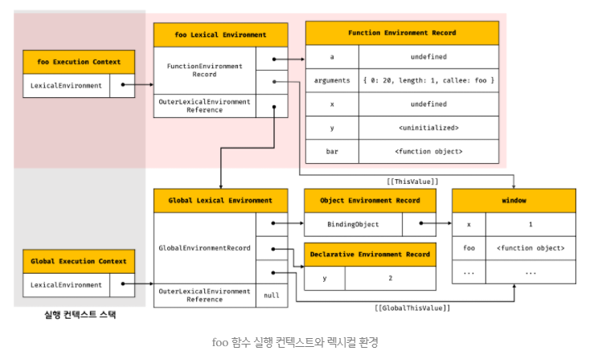

1. 함수 실행 컨텍스트 생성
- `생성된 함수 실행 컨텍스트는 함수 렉시컬 환경이 완성된 다음 실행 컨텍스트 스택에 push된다.`
- `foo 함수의 실체는 전역 객체에 존재하고, foo 함수가 호출되어 만들어진 foo 함수 실행 컨텍스트는 foo 함수의 실체가 아니다.`
 
2. 함수 렉시컬 환경 생성

2.1. 함수 환경 레코드 생성
- 함수 렉시컬 환경을 구성하는 컴포넌트 중 하나인 `함수 환경 레코드(Function Environment Record)는 매개변수, arguments 객체, 함수 내부에서 선언한 지역 변수와 중첩 함수를 등록하고 관리`한다.
- 함수 렉시컬 환경은 객체 환경 레코드, 선언적 환경 레코드로 나뉘지 않고 `함수 환경 레코드 하나만 가지고 있다.`
<br />

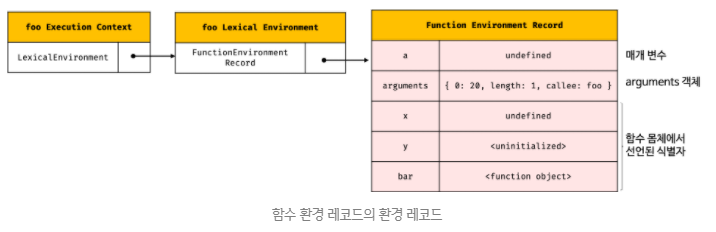

2.2. this 바인딩
- 함수 환경 레코드의 `[[ThisValue]]` 내부 슬롯에 this가 바인딩된다.
- `[[ThisValue]]` 내부 슬롯에 바인딩될 객체는 `함수 호출 방식에 따라 결정된다.`

- foo는 일반 함수로 호출되었으므로 this는 전역 객체를 가리킨다.
- 따라서 함수 환경 레코드의 `[[ThisValue]]` 내부 슬롯에는 전역 객체가 바인딩된다.
- foo 함수 내부에서 this를 참조하면 함수 환경 레코드의 `[[ThisValue]]` 내부 슬롯에 바인딩된어 있는 객체가 반환된다.
<br />

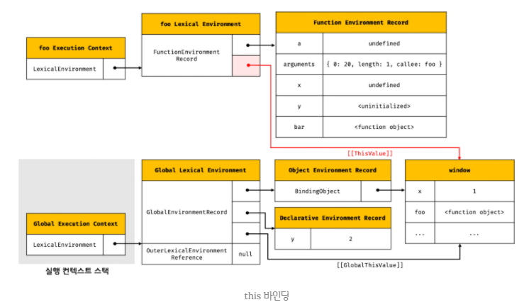

2.3. 외부 렉시컬 환경에 대한 참조 결정
- 외부 렉시컬 환경에 대한 참조에 foo 함수 정의가 평가된 시점에 `실행 중인 실행 컨텍스트의 렉시컬 환경의 참조가 할당된다.`
- 이 시점의 실행 중인 실행 컨텍스트는 전역 실행 컨텍스트이다.
- 따라서 외부 렉시컬 환경에 대한 참조에는 전역 렉시컬 참조가 할당된다.
<br />

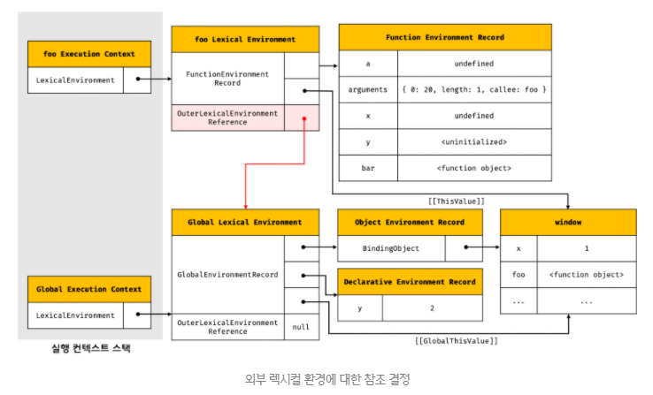

- 자바스크립트 엔진은 `함수 정의를 평가하여 함수 객체를 생성할 때` 현재 실행 중인 실행 컨텍스트의 렉시컬 환경, 즉 `함수의 상위 스코프를 함수 객체의 내부 슬롯 [[Environment]]에 저장한다.`
- 함수 렉시컬 환경의 `외부 렉시컬 환경에 대한 참조에 할당되는 것이 바로 내부 슬롯 [[Environment]]에 저장된 렉시컬 환경의 참조이다.`
- 즉, 내부 슬롯 `[[Environment]]`가 바로 렉시컬 스코프를 구현하는 메커니즘이다.

#### foo 함수 코드 실행
- `식별자 결정을 위해 실행 중인 실행 컨텍스트의 렉시컬 환경에서 식별자를 검색하기 시작한다.`
- 만약 실행 중인 실행 컨텍스트의 렉시컬 환경에서 식별자를 검색할 수 없으면 외부 렉시컬 환경에 대한 참조가 가리키는 렉시컬 환경으로 이동하여 식별자를 검색한다.
- 검색된 식별자에 값을 바인딩한다.
<br />

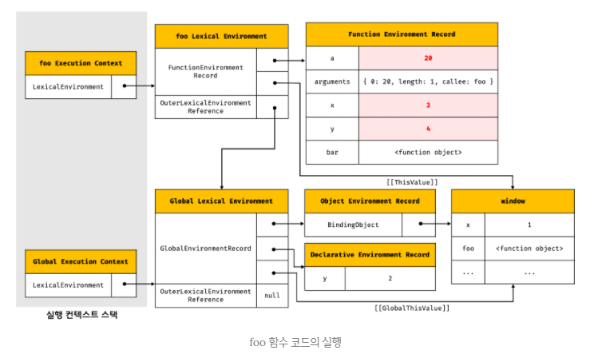

#### bar 함수 코드 평가
- bar 함수가 호출되면 bar 함수 내부로 코드의 제어권이 이동한다.
- bar 함수 코드의 평가과정에서 실행 컨텍스트와 렉시컬 환경의 생성 과정은 foo 함수 코드 평가와 동일하다.
<br />

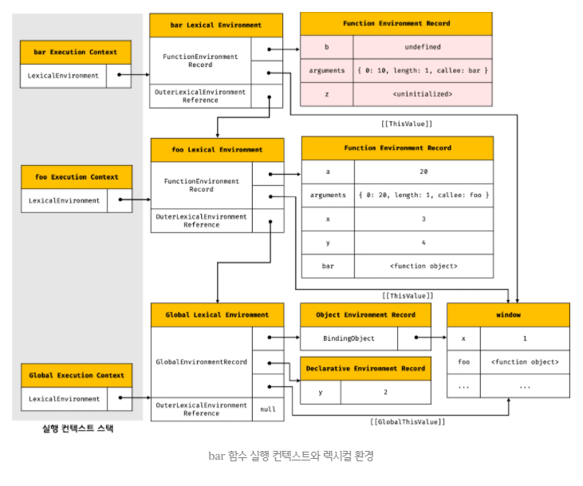

#### bar 함수 코드 실행
- 이제 런타임이 시작되어 bar 함수의 소스코드가 순차적으로 실행되기 시작한다.
- 매개변수에 인수가 할당되고, 변수 할당문이 실행된다.
- 그리고, `console.log(a + b + x + y + z);` 가 실행된다.
<br />

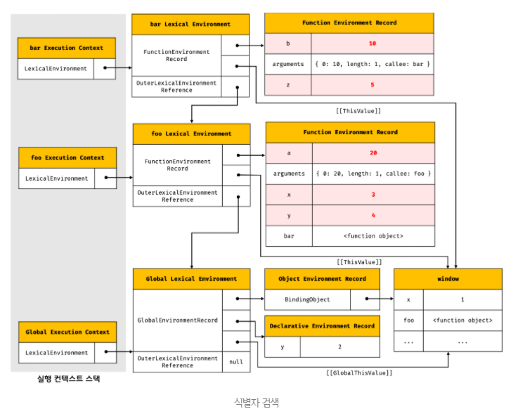

#### bar 함수 코드 실행 종료
- 이때 실행 컨텍스트 스택에서 bar 함수 실행 컨텍스트가 pop되고, foo 실행 컨텍스트가 실행 중인 컨텍스트가 된다.
- `실행 컨텍스트 스택에서 bar 함수 실행 컨텍스트가 제거되었다고 해서 bar 함수 렉시컬 환경까지 즉시 소멸하는 것은 아니다.`
- 함수 실행 컨텍스트가 pop 되는 것이고, 렉시컬 환경이 pop 되는 것은 아니다.
- `렉시컬 환경은 실행 컨텍스트에 의해 참조되기는 하지만 독립적인 객체이다.`
- `객체를 포함한 모든 값은 누군가에 의해 참조되지 않을 때, 비로소 가비지 컬렉터에 의해 메모리 공간의 확보가 해제되어 소멸한다.`

#### foo 함수 코드 실행 종료
- bar 함수가 종료하면 더 이상 실행할 코드가 없으므로 foo 함수 코드의 실행이 종료된다.
- 이때 실행 컨텍스트 스택에서 foo 함수 실행 컨텍스트가 pop되고, 전역 실행 컨텍스트가 실행 중인 실행 컨텍스트가 된다.

#### 전역 코드 실행 종료
- foo 함수가 종료하면 더 이상 실행할 코드가 없으므로 전역 코드의 실행이 종료된다.
- 이때 실행 컨텍스트 스택에서 전역 실행 컨텍스트가 pop되어 실행 컨텍스트 스텍에는 아무것도 남아 있지 않게 된다.
- 참고로, 실행 컨텍스트 스택이 빈 타이밍에 비동기 함수가 들어온다.

#### 실행 컨텍스트와 블록 레벨 스코프
- var 키워드로 선언한 변수 : 함수 레벨 스코프
- let, const 키워드로 선언한 변수 : 블록 레벨 스코프(block-level-scope)
```javascript
let x = 1;

if (true) {
  let x = 10;
  console.log(x); // 10
}

console.log(x); // 1
```
- if 문의 코드 블록이 실행되면 if 문의 코드 블록을 위한 블록 레벨 스코프를 생성해야 한다.
- 이를 위해 선언적 환경 레코드를 갖는 렉시컬 환경을 새롭게 생성하여 `기존의 렉시컬 환경을 교체한다.`
- 이때 `새롭게 생성된 if 문의 렉시컬 환경의 외부 렉시컬 환경에 대한 참조는 if 문이 실행되기 이전의 전역 렉시컬 환경을 가리킨다.`
- 전역 렉시컬 환경은 블록 렉시컬 환경에 의해 참조되고 있으므로, 가비지 콜렉터의 대상이 되지 않고 화살표가 교체되어도 사라지지 않는다.
- 실행 컨텍스트는 4가지 소스 코드의 타입만 만들 수 있으므로, if 문은 만들 수 없다.
- 실행 컨텍스트만 만들지 않을 뿐, 블록 렉시컬 환경을 만든다.
- 만약 if문 안에 var 키워드로 선언한 변수가 있다면, 그 변수는 전역 객체의 프로퍼티로 등록된다.
- 만약 if문 안에서 var 키워드로 선언한 변수를 참조하면, 그 시점에는 다시 화살표를 전역 렉시컬 환경으로 교체하여 참조한다. 

<br />

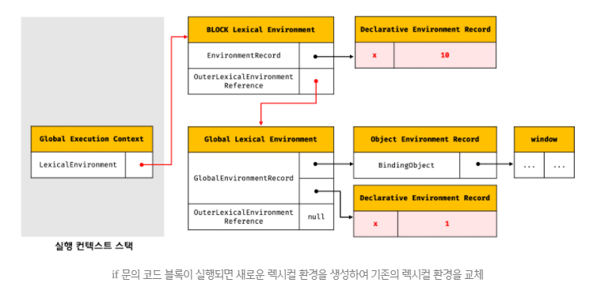

- if 문 코드 블록의 실행이 종료되면 if 문의 코드 블록이 실행되기 이전의 렉시컬 환경으로 되돌린다.

<br />

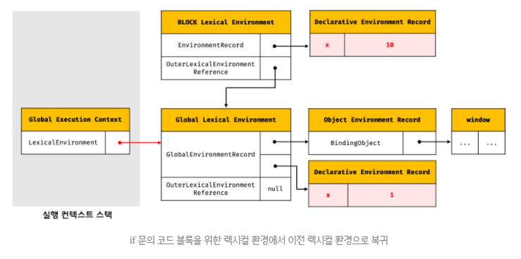

- 이는 if 문뿐 아니라 모든 블록 레벨 스코프를 생성하는 모든 블록문에 적용된다.

- `for 문의 변수 선언문에 let 키워드를 사용한 for 문`은 `코드 블록이 반복해서 실행될 때마다 코드 블록을 위한 새로운 렉시컬 환경을 생성한다.`
- 만약 `for 문의 코드 블록 내에서 정의된 함수가 있다면` `이 함수의 상위 스코프는 for 문의 코드 블록이 생성한 렉시컬 환경`이다.
- 이때 함수의 상위 스코프는 for 문의 코드 블록이 반복해서 실행될 때마다 식별자(for 문의 변수 선언문 및 for 문의 코드 블록 내에서 선언된 지역 변수 등)의 값을 유지해야 한다.
- 이를 위해 for 문의 코드 블록이 반복해서 실행될 때마다 독립적인 렉시컬 환경을 생성하여 식별자의 값을 유지한다.


</div> 
</details>

---