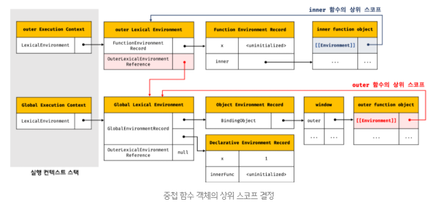
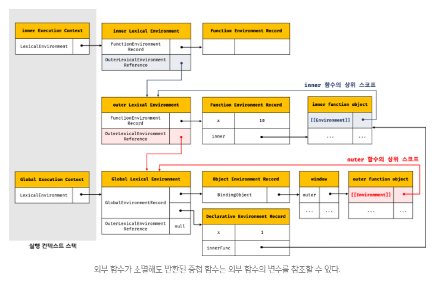
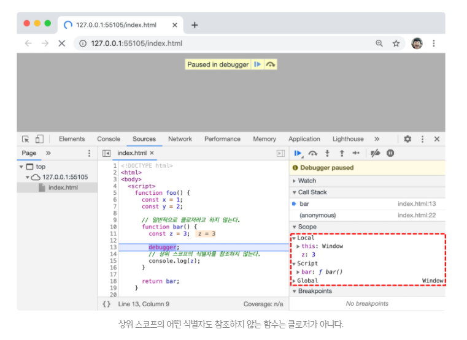
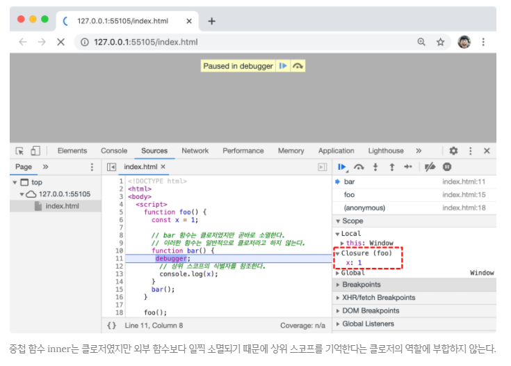
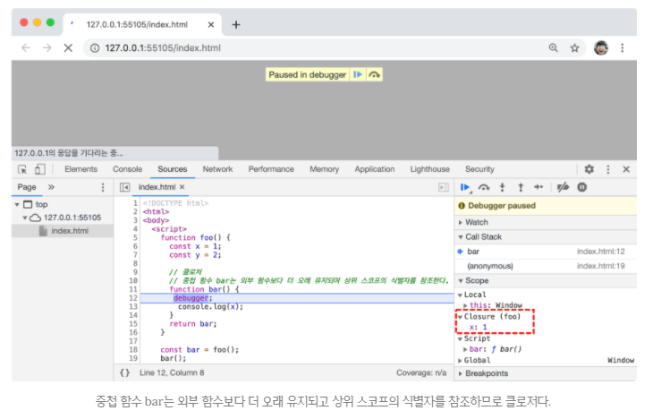
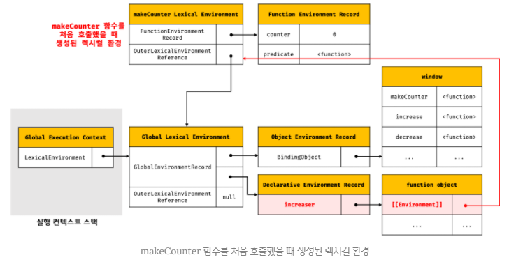
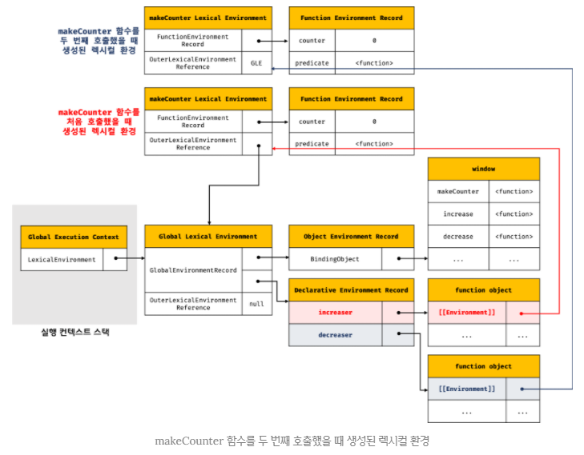
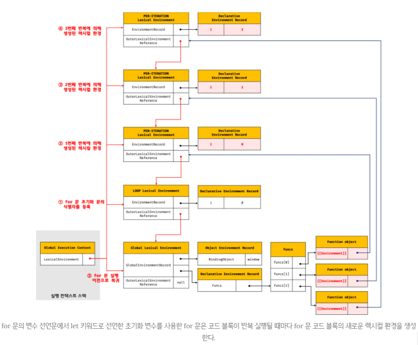

## JAVASCRIPT
<details open>
<summary>클로저</summary>
<div markdown="24">

<br />

- 클로저는 자바스크립트 고유의 개념이 아니다.
- 함수를 일급 객체로 취급하는 함수형 프로그래밍 언어(예: 하스켈(Haskell), 리스프(Lisp), 얼랭(Erlnag), 스칼라(Scala) 등)에서 사용되는 중요한 특성이다.
- 클로저는 자바스크립트 고유의 개념이 아니므로 클로저의 정의가 ECMAScript 사양에 등장하지는 않는다.
- MDN에서는 클로저에 대해 `클로저는 함수와 그 함수 선언된 렉시컬 환경과의 조합이다.`라고 정의하고 있다.

#### 렉시컬 스코프
- `자바스크립트 엔진은 함수를 어디서 호출했는지가 아니라 함수를 어디서 정의했는지에 따라 상위 스코프를 결정한다.`
- `이를 렉시컬 스코프(정적 스코프)라 한다.`
- `함수의 상위 스코프를 결정한다.`는 것은 `렉시컬 환경의 외부 환경 렉시컬 환경에 대한 참조를 결정한다`는 것과 같다.
- `렉시컬 환경의 “외부 렉시컬 환경에 대한 참조”에 저장할 참조값, 즉 상위 스코프에 대한 참조는 함수 정의가 평가되는 시점에 함수가 정의된 환경(위치)에 의해 결정된다. 이것이 바로 렉시컬 스코프이다.`

#### 함수 객체의 내부 슬롯 `[[Environment]]`
- 함수는 자신의 내부 슬롯 `[[Environment]]`에 자신이 정의된 환경, 즉 상위 스코프의 참조를 저장한다.
- `함수 정의가 평가되어 함수 객체를 생성할 때`, 자신이 정의된 환경(위치)에 의해 결정된 상위 스코프의 참조를 함수 객체 자신의 내부 슬롯 `[[Environment]]`에 저장한다.
- 이때 자신의 내부 슬롯 `[[Environment]]에 저장된 상위 스코프의 참조는 현재 실행 중인 실행 컨텍스트의 렉시컬 환경`을 가리킨다.
- 또한, 자신이 호출되었을 때 생성될 함수 렉시컬 환경의 “외부 렉시컬 환경에 대한 참조”에 저장될 참조값이다.
- 함수 객체는 내부 슬롯 `[[Environment]]`에 저장한 렉시컬 환경의 참조, 즉 상위 스코프를 자신이 존재하는한 기억한다.
```javascript
const x = 1;

function foo() {
  const x = 10;

  bar();
}

function bar() {
  console.log(x);
}

foo(); // 1
bar(); // 1
```
<br />

![함수 객체의 내부 슬롯 [[Environment]]에는 상위 스코프가 저장된다.](../images/inner_environ.PNG)

- 이때 함수 렉시컬 구성 요소인 `외부 렉시컬 환경에 대한 참조에는 함수 객체의 내부 슬롯 [[Environment]]에 저장된 렉시컬 환경의 참조가 할당된다.`

#### 클로저와 렉시컬 환경
```javascript
const x = 1;

function outer() {
  const x = 10;
  const inner = function () { console.log(x); };
  return inner;
}

const innerFunc = outer();
innerFunc(); // 10
```
- outer 함수를 호출하면 outer 함수는 중첩함수 inner를 반환하고 생명주기를 마감한다.
- 즉, outer 함수의 실행이 종료되면 outer 실행 컨텍스트는 실행 컨텍스트 스택에서 제거(pop)된다.
- 이때 outer 함수의 지역 변수 x와 변수 값 10을 저장하고 있던 outer 함수의 실행 컨텍스트가 제거되었으므로 outer 함수의 지역변수 x 또한 생명 주기를 마감한다.
- 따라서 outer 함수의 지역변수 x는 더는 유효하지 않게 되어 x변수에 접근할 수 있는 방법은 달리 없어 보인다.

- 그러나 위 코드의 실행 결과는 outer 함수의 지역변수 x의 값인 10이다.
- 이미 생명 주기가 종료되어 실행 컨텍스트 스택에서 제거된 outer 함수의 지역변수 x가 다시 부활이라도 한 듯이 동작하고 있다.

- 이처럼 `자신을 포함하고 있는 외부함수보다 중첩함수가 더 오래 유지되는 경우 외부 함수 밖에서 중첩함수를 호출하더라도 외부함수의 지역변수에 접근할 수 있는데 이러한 함수를 클로저(closure)라고 부른다.`

- 클로저에 대한 MDN의 정의를 다시보자. 
- `클로저는 함수와 그 함수가 선언된 렉시컬 환경과의 조합이다.`
- 여기서 `그 함수가 선언된 렉시컬 환경`이란 함수가 정의된 위치의 스코프, 즉 상위 스코프를 의미하는 실행 컨텍스트의 렉시컬 환경이다.

- 다시 위의 예제로 돌아가보자.
- outer 함수의 실행이 종료되면 outer 함수의 실행 컨텍스트가 실행 컨텍스트 스택에서 제거된다. 
- 이때 `outer 함수의 실행 컨텍스트는 실행 컨텍스트에서 제거되지만 outer 함수의 렉시컬 환경까지 소멸하는 것은 아니다.`

- outer 함수의 렉시컬 환경은 inner 함수의 `[[Environment]]` 내부 슬롯에 의해 참조되고 있고 inner 함수는 전역 변수 innerFunc에 의해 참조되고 있으므로 가비지 컬렉션의 대상이 되지 않기 때문이다.
- 가비지 컬렉터는 누군가가 참조하고 있는 메모리 공간을 함부로 해제하지 않는다.
<br />



- outer 함수가 반환한 inner 함수를 호출하면 inner 함수의 실행 컨텍스트가 생성되고 실행 컨텍스트 스택에 push된다.
- 그리고 렉시컬 환경의 외부 렉시컬 환경에 대한 참조에는 inner 함수 객체의 `[[Environment]]` 내부 슬롯에 저장되어 있는 참조값이 할당된다.
- `[[Environment]] 내부 슬롯은 함수 정의가 평가되어 함수 객체를 생성할 때 할당되고, 외부 렉시컬 환경에 대한 참조는 함수가 호출되어 렉시컬 환경이 만들어 질때 할당된다.`
<br />


- 중첩함수 inner는 외부함수 outer보다 더 오래 생존하였다.
- 이때 외부함수보다 더 오래 생존한 중첩함수는 외부함수의 생존여부와 상관없이 자신이 정의된 위치에 의해 결정된 상위 스코프를 기억한다.
- 이처럼 중첩함수 inner의 내부에서는 상위 스코프를 참조할 수 있으므로, `상위 스코프의 식별자를 참조할 수 있고 식별자의 값을 변경할 수도 있다.`

- `자바스크립트의 모든 함수는 상위 스코프를 기억하므로 이론적으로 모든 함수는 클로저이다.`
- 하지만 일반적으로 모든 함수를 클로저라고 하지는 않는다.
```javascript
function foo() {
  const x = 1;
  const y = 2;

  function bar() {
    const z = 3;

    debugger;

    console.log(z);
  }

  return bar;
}

const bar = foo();
bar();
```
<br />



- 위 예제의 중첩 함수 bar는 외부 함수 foo보다 더 오래 유지되지만 상위 스코프의 어떤 식별자도 참조하지 않는다.
- 이처럼 상위 스코프의 `어떤 식별자도 참조하지 않는 경우 대부분의 모던 브라우저는 최적화를 통해 다음 그림과 같이 상위 스코프를 기억하지 않는다.`
- Local은 지역스코프, Script는 현재 실행 중인 함수 객체, Global은 전역 객체를 나타낸다.
- 현재 실행 중인 중첩함수 bar가 클로저라면 bar가 기억하는 상위스코프가 Closure에 표시된다.
- `참조하지도 않는 식별자를 기억하는 것은 메모리 낭비이기 때문이다.`
- `따라서 bar 함수는 클로저라고 할 수 없다.`

```javascript
function foo() {
  const x = 1;

  function bar() {
    debugger;

    console.log(x);
  }
  bar();
}

foo();
```
<br />



- 위 예제에서 중첩함수 bar는 상위 스코프의 식별자를 참조하고 있으므로 클로저다.
- 하지만 외부함수 foo의 외부로 중첩함수 bar가 반환되지 않는다.
- 즉, `외부함수 foo보다 중첩함수 bar의 생명주기가 짧다.`
- 이런 경우 중첩함수 bar는 클로저였지만, 외부함수보다 일찍 소멸되었기 때문에 생명주기가 종료된 외부함수의 식별자를 참조할 수 있다는 클로저의 본질에 부합하지 않는다.
- 따라서 bar는 일반적으로 클로저라고 하지않는다.
```javascript
function foo() {
  const x = 1;
  const y = 2;

  function bar() {
    debugger;
    console.log(x);
  }
  return bar;
}

const bar = foo();
bar(); // 1
```
<br />



- 위 예제의 중첩함수 bar는 상위스코프의 식별자를 참조하고 있으므로 클로저다.
- 그리고, 외부함수의 외부로 반환되어 외부함수보다 더 오래 살아남는다.

- 이처럼 외부함수보다 중첩함수가 더 오래 유지되는 경우 중첩함수는 이미 생명주기가 종료한 외부함수의 변수를 참조할 수 있다.
- 이러한 중첩함수를 클로저라고 부른다.
- `클로저는 중첩함수가 상위스코프의 식별자를 참조하고 있고 중첩함수가 외부함수보다 더 오래 유지되는 경우에 한정하는 것이 일반적이다.`

- 다만 클로저인 중첩함수 bar는 상위스코프의 x, y 식별자 중에서 x만 참조하고 있다.
- 이런 경우 대부분의 모던 브라우저는 최적화를 통해 위 그림과 같이 상위스코프의 식별자 중에서 `클로저가 참조하고 있는 식별자만 기억한다.`

- 클로저에 의해 참조되는 상위스코프의 변수를 `자유 변수(free variable)`라고 부른다.
- 클로저란 `함수가 자유변수에 대해 닫혀있다.(closed)`라는 의미이다.
- 다시말해, `클로저는 자유 변수에 묶여있는 함수`라고 할 수 있다.

- 이론적으로 클로저는 상위스코프를 기억해야 하므로 불필요한 메모리 점유를 걱정할 수 있다.
- 하지만 `모던 자바스크립트 엔진 최적화가 잘 되어 있어서 클로저가 참조하고 있지 않는 식별자는 기억하지 않는다.`
- 즉, 상위스코프의 식별자 중에서 기억해야 할 식별자만 기억한다.
- 기억해야 할 식별자를 기억하는 것은 메모리 낭비라고 볼 수 없다.
- 따라서 클로저의 메모리 낭비는 걱정하지 않아도 된다.

#### 클로저의 활용
- `클로저는 상태(state)를 안전하게 변경하고 유지하기 위해 사용한다.`
- 다시말해, 상태가 의도치 않게 변경되지 않도록 `상태를 안전하게 은닉(information hiding)하고 특정 함수에게만 상태 변경을 허용`하기 위해 사용한다.
- 안전한 코드를 짜는데 필수불가결의 요소가 클로저이다.

- 함수가 호출될 때마다 호출되는 횟수를 누적하여 출력하는 카운터를 만들어보자.
- 이 예제의 호출된 횟수(num 변수)가 바로 안전하게 변경하고 유지해야할 상태이다.
```javascript
let num = 0;

const increase = function () {
  return ++num;
};

console.log(increase()); // 1
console.log(increase()); // 2
console.log(increase()); // 3
```
- 위 코드는 잘 동작하지만 오류를 발생시킬 가능성을 내포하고 있는 좋지 않은 코드이다.
- 그 이유는 위 예제가 바르게 동작하려면 다음의 전제 조건이 지켜져야 하기 때문이다.

1. 카운트 상태(num 변수의 값)는 increase 함수가 호출되기 전까지 변경되지 않고 유지되어야 한다.
2. 이를 위해 카운트 상태(num 변수의 값)는 increase 함수만이 변경할 수 있어야 한다.

- 하지만, `카운트 상태는 전역 변수를 통해 관리되고 있기 때문에 언제든지 누구나 접근할 수 있고 변경할 수 있다.`
- 이는 의도치 않게 상태가 변경될 수 있다는 것을 의미한다.

- 따라서 카운트 상태를 안전하게 변경하고 유지하기 위해서는 `increase 함수만이 num 변수를 참조하고 변경할 수 있게 하는 것이 바람직하다.`
- 이를 위해 num을 increase 함수의 지역변수로 바꾸어 의도치 않은 상태 변경을 방지해보자.
```javascript
const increase = (function () {
  let num = 0;

  // 클로저
  return function () {
    return ++num;
  };
}());

console.log(increase()); // 1
console.log(increase()); // 2
console.log(increase()); // 3
```
- 위 코드가 실행되면 즉시 실행 함수가 호출되고, 즉시 실행 함수가 반환한 함수가 increase 변수에 할당된다.
- increase 변수에 할당된 함수는 자신이 정의된 위치에 의해 결정된 상위스코프인 즉시 실행 함수의 렉시컬 환경을 기억하는 클로저이다.
- 즉시 실행 함수는 호출된 이후 소멸되지만 즉시 실행 함수가 반환한 클로저는 변수 increase에 할당되어 호출된다.
- `즉시 실행 함수가 반환한 클로저는 상위스코프인 즉시 실행 함수를 기억하고 있기 때문에` 카운트 상태를 유지하기 위한 자유 변수 num을 언제 어디서 호출하든지 참조하고 변경할 수 있다.

- 즉시 실행 함수는 한 번만 실행되므로 increase가 호출될 때마다 num 변수가 재차 초기화될 일은 없을 것이다.
- 또한 num 변수는 외부에서 직접 접근할 수 없는 은닉된 private 변수이므로 전역 변수를 사용했을 때와 같이 의도치 않은 변경을 걱정할 필요도 없기 때문에 더 안정적 프로그래밍이 가능하다.

- `이처럼 클로저는 상태(state)가 의도치 않게 변경되지 않도록 안전하게 은닉(information hiding)하고 특정 함수에게만 상태 변경을 허용하여 상태를 안전하게 변경하고 유지하기 위해 사용한다.`

```javascript
const counter = (function () {
  let num = 0;

  // 클로저인 메서드를 갖는 객체를 반환한다.
  // 객체 리터럴은 스코프를 만들지 않는다.
  // 따라서 아래 메서드들의 상위스코프는 즉시 실행 함수의 렉시컬 환경이다.
  return {
    increase: function increase() {
      return ++num;
    },

    decrease: function decrease() {
      return --num;
    }
  };
}());

console.log(counter.increase()); // 1
console.log(counter.increase()); // 2

console.log(counter.decrease()); // 1
console.log(counter.decrease()); // 0
```
- 객체 리터럴의 중괄호는 코드 블록이 아니므로 별도의 스코프를 생성하지 않는다.
- 위 예제의 `increase, decrease 메서드의 상위 스코프는` increase, decrease 메서드가 평가되는 시점에 실행 중인 실행 컨텍스트인 `즉시 실행 함수 실행 컨텍스트 환경`이다.
- 따라서 increase, decrease 메서드가 언제 어디서 호출되든 상관없이 increase, decrease 함수는 즉시 실행 함수의 스코프의 식별자를 참조할 수 있다.
```javascript
const Counter = (function () {
  let num = 0;

  function Counter() {

  }

  Counter.prototype.increase = function () {
    return ++num;
  };

  Counter.prototype.decrease = function () {
    return --num;
  };

  return Counter;
}());

const counter = new Counter();

console.log(counter.increase()); // 1
console.log(counter.increase()); // 2

console.log(counter.decrease()); // 1
console.log(counter.decrease()); // 0
```
- 위 예제에서 num은 생성자 함수 Counter가 생성할 인스턴스의 프로퍼티가 아니라 즉시 실행 함수 내에서 선언된 변수이다.
- 만약 num이 생성자 함수 Counter가 생성할 인스턴스의 프로퍼티라면 인스턴스를 통해 외부에서 접근이 자유로운 public 프로퍼티가된다.
- 하지만, 즉시 실행 함수 내에서 선언된 num 변수는 인스턴스를 통해 접근할 수 없으며, 즉시 실행 함수 외부에서도 접근할 수 없다.

- `increase, decrease 메서드는` 모두 자신의 함수 정의가 평가되어 함수 객체가 될 때 실행 중인 실행 컨텍스트인 `즉시 실행 함수 실행 컨텍스트의 렉시컬 환경을 기억하는 클로저`이다.
- 따라서 프로토타입을 통해 상속되는 프로토타입 메서드일지라도 즉시 실행 함수의 자유변수 num을 참조할 수 있다.
- 다시 말해, num 변수의 값은 increase, decrease 메서드만이 변경할 수 있다.

- `외부 상태 변경이나 가변(mutable) 데이터를 피하고 불변성(immutability)을 지향하는 함수형 프로그래밍에서 부수 효과를 최대한 억제하여 오류를 피하고 프로그램의 안정성을 높이기 위해 클로저는 적극적으로 활용된다.`

```javascript
function makeCounter(predicate) {
  let counter = 0;

  // 클로저를 반환
  return function () {
    // 인수로 전달 받은 보조 함수에 상태 변경을 위임한다.
    counter = predicate(counter);
    return counter;
  };
}

// 보조 함수
function increase(n) {
  return ++n;
}

// 보조 함수
function decrease(n) {
  return --n;
}

const increaser = makeCounter(increase); // ①
console.log(increaser()); // 1
console.log(increaser()); // 2

// increaser 함수와는 별개의 독립된 렉시컬 환경을 갖기 때문에 카운터 상태가 연동되지 않는다.
const decreaser = makeCounter(decrease); // ②
console.log(decreaser()); // -1
console.log(decreaser()); // -2
```
- makeCounter 함수는 보조함수를 인자로 전달받고 함수를 반환하는 고차함수이다.
- `makeCounter 함수가 반환하는 함수`는 자신이 생성됐을 때의 렉시컬 환경인 makeCounter 함수의 스코프에 속한 counter 변수를 기억하는 `클로저이다.`

- `makeCounter 함수를 호출해 함수를 반환할 때 반환된 함수는 자신만의 독립된 렉시컬 환경을 갖는다.`
- 이는 함수를 호출하면 그때마다 새로운 makeCounter 함수 실행 컨텍스트의 렉시컬 환경이 생성되기 때문이다.

- ①에서 makeCounter 함수를 호출하면 함수의 실행 컨텍스트가 생성된다.
- 그리고 makeCounter 함수는 함수 객체를 생성하여 반환한 후 소멸된다.
- `makeCounter 함수가 반환한 함수는 makeCounter 함수의 렉시컬 환경을 상위스코프로서 기억하는 클로저`이며, `전역 변수인 increaser에 할당된다.`
- 이때 makeCounter 함수의 실행 컨텍스트는 소멸되지만 `makeCounter 함수 실행 컨텍스트의 렉시컬 환경은 makeCounter 함수가 반환한 함수의 [[Environment]] 내부 슬롯에 의해 참조되고 있기 때문에 소멸되지 않는다.`
<br />



- ②에서 makeCounter 함수를 호출하면 새로운 makeCounter 함수의 실행 컨텍스트가 생성된다.
- makeCounter 함수는 함수 객체를 생성하여 반환한 후 소멸된다.
- makeCounter 함수가 반환한 함수는 makeCounter 함수의 렉시컬 환경을 상위스코프로서 기억하는 클로저이며, 전역 변수인 decreaser에 할당된다.
- 이때 makeCounter 함수의 실행 컨텍스트는 소멸되지만 makeCounter 함수 실행 컨텍스트의 렉시컬 환경은 makeCounter 함수가 반환한 함수의 `[[Environment]]` 내부 슬롯에 의해 참조되고 있기 때문에 소멸되지 않는다.


- 위 예제에서 `전역 변수 increase와 decrease에 할당된 함수는 각각 자신만의 독립된 렉시컬 환경을 갖기 때문에 카운트를 유지하기 위한 자유변수 counter를 공유하지 않아 카운터의 증감이 연동되지 않는다.`
- 따라서 독립된 카운터가 아니라 증감이 가능한 카운터를 만들려면 렉시컬 환경을 공유하는 클로저를 만들어야 한다.
- 이를 위해서는 makeCounter 함수를 두 번 호출하지 말아야한다.

```javascript
const counter = (function () {
  let counter = 0;

  return function (predicate) {
    counter = predicate(counter);
    return counter;
  };
}());

function increase(n) {
  return ++n;
}

function decrease(n) {
  return --n;
}

console.log(counter(increase)); // 1
console.log(counter(increase)); // 2

console.log(counter(decrease)); // 1
console.log(counter(decrease)); // 0
```

#### 캡슐화(encapsulation)와 정보 은닉(information hiding)
- `캡슐화는 객체의 상태(state)를 나타내는 프로퍼티와 프로퍼티를 참조하고 조작할 수 있는 동작(behavior)인 메서드를 하나로 묶는 것을 말한다.`
- `캡술화는 객체의 특정 프로퍼티나 메서드를 감출 목적으로 사용하기도 하는데 이를 정보 은닉이라고 한다.`
- `정보 은닉은 외부에 공개할 필요가 없는 구현의 일부를 외부에 공개하지 않도록 감추어 적절치 못한 접근으로부터 객체의 상태가 변경되는 것을 방지해 정보를 보호하고`, `객체 간의 상호 의존성, 즉 결합도(coupling)를 낮추는 효과가 있다.`

- 대부분의 객체지향 프로그래밍 언어는 클래스를 정의하고 그 클래스를 구성하는 맴버(프로퍼티와 메서드)에 대하여 public, private, protected 같은 접근 제한자(access modifier)를 선언하여 공개 범위를 한정할 수 있다.
- public으로 선언된 프로퍼티와 메서드는 클래스 외부에서 참조할 수 있지만 private으로 선언된 경우는 클래스 외부에서 참조할 수 없다.

- 자바스크립트는 public, private, protected 같은 접근 제한자를 제공하지 않는다.
- 따라서 자바스크립트 객체의 모든 프로퍼티와 메서드는 기본적으로 외부에 공개되어 있다.
- 즉, 객체의 모든 프로퍼티와 메서드는 기본적으로 public하다.
```javascript
function Person(name, age) {
  this.name = name; // pubilc
  let _age = age; // private

  this.sayHi = function () {
    console.log(`Hi! My name is ${this.name}. I am ${_age}.`);
  };
}

const me = new Person('Lee', 20);
me.sayHi(); // Hi! My name is Lee. I am 20.
console.log(me.name); // Lee
console.log(me._age); // undefined

const you = new Person('Kim', 30);
you.sayHi(); // Hi! My name is Kim. I am 30.
console.log(you.name); // Kim
console.log(you._age); // undefined
```
- 위 예제의 name 프로퍼티는 현재 외부로 공개되어 있어서 자유롭게 참조하거나 변경할 수 있다.
- 즉, name 프로퍼티는 public하다.
- 하지만 _age 변수는 Person 생성자 함수의 지역변수이므로 Person 생성자 함수 외부에서 참조하거나 변경할 수 없다.
- 즉, _age 변수는 private하다.
- 하지만 위 예제의 sayHi 메서드는 인스턴스 메서드이므로 Person 객체가 생성될 때마다 중복 생성된다.
- sayHi 메서드를 프로토타입 메서드로 변경하여 중복 생성을 방지해보자.
```javascript
const Person = (function () {
  let _age = 0; // private

  function Person(name, age) {
    this.name = name; // public
    _age = age;
  }

  Person.prototype.sayHi = function () {
    console.log(`Hi! My name is ${this.name}. I am ${_age}.`);
  };

  return Person;
}());

const me = new Person('Lee', 20);
me.sayHi(); // Hi! My name is Lee. I am 20.
console.log(me.name); // Lee
console.log(me._age); // undefined

const you = new Person('Kim', 30);
you.sayHi(); // Hi! My name is Kim. I am 30.
console.log(you.name); // Kim
console.log(you._age); // undefined

me.sayHi(); // Hi! My name is Lee. I am 30.
```
- 위 패턴을 사용하면 public, private, protected 같은 접근 제한자를 제공하지 않는 자바스크립트에서도 정보 은닉이 가능한 것처럼 보인다.
- `Person 생성자 함수`와 `sayHi 메서드`는 `이미 종료되어 소멸한 즉시 실행 함수의 지역변수 _age를 참조할 수 있는 클로저이다.`
- 하지만 위 코드도 문제가 있다. Person 생성자 함수가 여러 개의 인스턴스를 생성할 경우 마지막 코드 실행문에서와 같이 _age 변수의 상태가 유지되지 않는다는 것이다.

- `이는 Person.prototype.sayHi 메서드가 단 한번 생성되는 클로저이기 때문에 발생하는 현상이다.`
- Person 생성자 함수의 모든 인스턴스가 상속을 통해 호출할 수 있는 `Person.prototype.sayHi 메서드의 상위스코프는 어떤 인스턴스로 호출하더라도 하나의 동일한 상위스코프를 사용하게 된다.`
- 이러한 이유로 Person 생성자 함수가 여러 개의 인스턴스를 생성할 경우 위와 같이 _age 변수의 상태가 유지되지 않는다.

- 이처럼 자바스크립트는 정보 은닉을 완전하게 지원하지 않는다.
- 인스턴스 메서드를 사용하면 자유변수를 통해 private을 흉내 낼 수는 있지만 프로토타입 메서드를 사용하면 이마저도 불가능해진다.
- ES6의 Symbol 또는 WeakMap을 사용하여 private한 프로퍼티를 흉내내기도 했으나 근본적인 해결책이 되지는 않는다.

- 다행히도 2020년 7월 현재, TC39 프로세스의 stage 3에는 클래스에 private 필드를 정의할 수 있는 새로운 표준 사양이 제안되어 있다.
- 표준 사양으로 승급이 확실시되는 이 제안은 현재 최신 브라우저(Chrome 74이상)와 최신 Node.js(버전 12 이상)에 이미 구현되어 있다.

#### 자주 발생하는 실수
```javascript
var funcs = [];

for (var i = 0; i < 3; i++) {
  funcs[i] = function () { return i; };
}

for (var j = 0; j < funcs.length; j++) {
  console.log(funcs[j]()); // 3 3 3
}
```
- for 문의 변수 선언문에서 var 키워드로 선언한 i 변수는 함수 레벨 스코프를 갖기 때문에 전역 변수이다.
- 전역 변수 i에는 0, 1, 2가 순차적으로 할당된다.
- 따라서 funcs 배열의 요소로 추가한 함수를 호출하면 전역변수 i를 참조하여 i의 값 3이 출력된다.
- 클로저를 사용해 위 예제를 바르게 동작하는 코드로 만들어보자.
```javascript
var funcs = [];

for (var i = 0; i < 3; i++) {
  funcs[i] = (function (id) {
    return function () {
      return id;
    };
  }(i));
}

for (var j = 0; j < funcs.length; j++) {
  console.log(funcs[j]()); // 0 1 2
}
```
- 이때 즉시 실행 함수의 매개변수 id는 즉시 실행 함수가 반환한 중첩함수의 상위스코프에 존재한다.
- `즉시 실행 함수가 반환한 중첩 함수는 자신의 상위스코프를 기억하는 클로저`이고, `매개변수 id는 즉시 실행 함수가 반환한 중첩 함수에 묶여있는 자유변수가 되어 그 값이 유지된다.`
- 위 예제는 자바스크립트의 함수 레벨 스코프 특성으로 인해 for 문의 초기화 문에서 var 키워드로 선언한 변수가 전역 변수가 되기 때문에 발생하는 현상이다.
- ES6의 let 키워드를 사용하면 이와 같은 번거로움이 깔끔하게 해결된다.
```javascript
const funcs = [];

for (let i = 0; i < 3; i++) {
  funcs[i] = function () { return i; };
}

for (let j = 0; j < funcs.length; j++) {
  console.log(funcs[j]()); // 0 1 2
}
```
- for 문의 변수 선언문에서 let 키워드로 선언한 변수를 사용하면 for 문의 코드 블록이 반복 실행될 때마다 for 문 코드 블록의 새로운 렉시컬 환경이 생성된다.
- 만약, `for 문의 코드 블록 내에서 정의한 함수가 있다면 이 함수의 상위스코프는 for문의 코드 블록이 반복 실행될 때마다 생성된 for 문 코드 블록의 새로운 렉시컬 환경이다.`

- 이때 함수의 상위 스코프는 for문의 코드 블록이 반복 실행될 때마다 식별자(for 문의 변수 선언문에서 선언한 초기화 변수 및 for 문의 코드 블록 내에서 선언한 지역 변수)의 값을 유지해야한다.
- 이를 위해 for 문이 반복될 때마다 독립적인 렉시컬 환경을 생성하여 식별자의 값을 유지한다.
<br />



- ① for 문의 변수 선언문에서 let 키워드로 선언한 초기화 변수를 사용한 for 문이 평가되면 먼저 `새로운 렉시컬 환경(LOOP Lexical Environment)을 생성하고 초기화 변수 식별자와 값을 등록한다.`
- 그리고 `새롭게 생성된 렉시컬 환경을 현재 실행 중인 실행 컨텍스트의 렉시컬 환경으로 교체한다.`

- ②, ③, ④ for 문의 코드 블록이 반복 실행되기 시작하면 `새로운 렉시컬 환경(PER-ITERATION Lexical Environment)을 생성하고 for 문 코드 블록 내의 식별자와 값(증감문 반영 이전)을 등록한다.`
- 그리고 `새롭게 생성된 렉시컬 환경을 현재 실행 중인 실행 컨텍스트의 렉시컬 환경으로 교체한다.`

- ⑤ for 문의 코드 블록의 반복 실행이 모두 종료되면 `for 문이 실행되기 이전의 렉시컬 환경을 실행 중인 실행 컨텍스트의 렉시컬 환경으로 되돌린다.`

- 이처럼 var 키워드를 사용하지 않은 ES6의 반복문(for...in 문, for...of 문, while 문 등)은 코드 블록을 반복 실행할 때마다 새로운 렉시컬 환경을 생성하여 반복할 당시의 상태를 마치 스냅샷을 찍는 것처럼 저장한다.
- 단, `이는 반복문의 코드 블록 내부에서 함수를 정의할 때 의미가 있다.`
- `반복문의 코드 블록 내부에 함수 정의가 없는 반복문이 생성하는 새로운 렉시컬 환경은 반복 직후, 아무도 참조하지 않기 때문에 가비지 컬렉션의 대상이 된다.`

- 또 다른 방법으로 함수형 프로그래밍 기법인 고차함수를 이용하는 방법이 있다.
- 이 방법은 변수와 반복문의 사용을 억제할 수 있기 때문에 오류를 줄이고 가독성을 좋게 만든다.
```javascript
// 요소가 3개인 배열을 생성하고 배열의 인덱스를 반환하는 함수를 요소로 추가한다.
// 배열의 요소로 추가된 함수들은 모두 클로저이다.
const funcs = Array.from(new Array(3), (_, i) => () => i); // (3) [ƒ, ƒ, ƒ]

// 배열의 요소로 추가된 함수들을 순차적으로 호출한다.
funcs.forEach(f => console.log(f())); // 0 1 2
``` 

</div> 
</details>

---