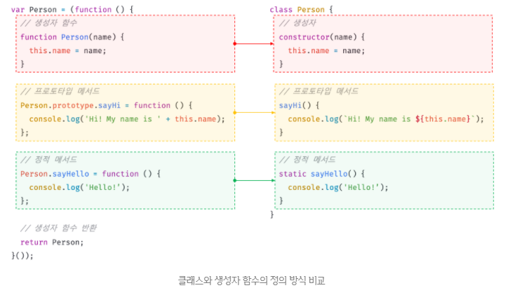
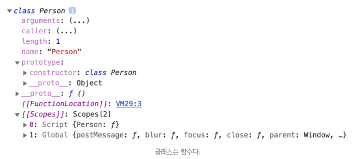
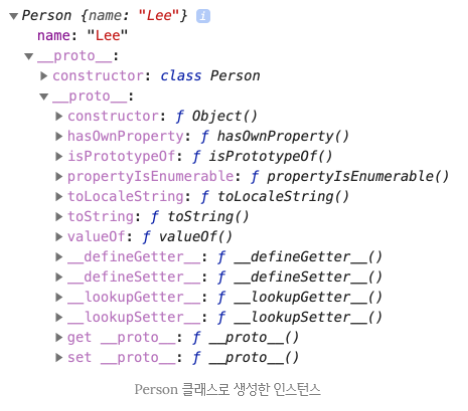
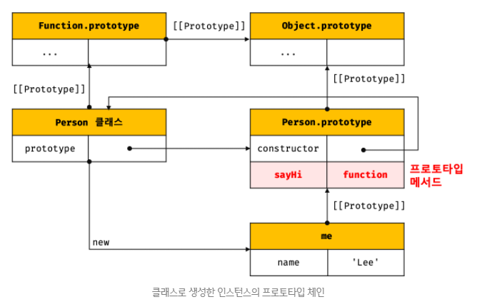
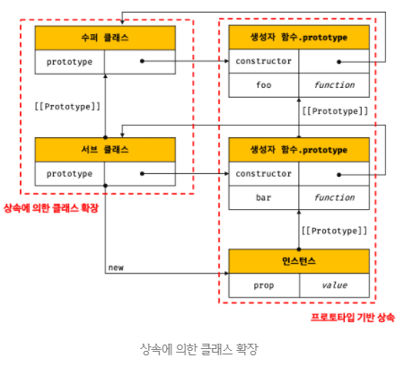
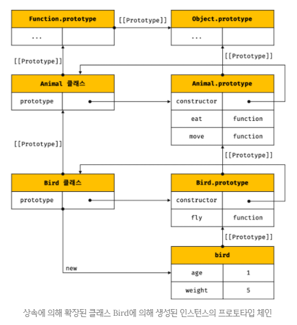
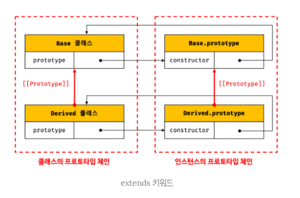
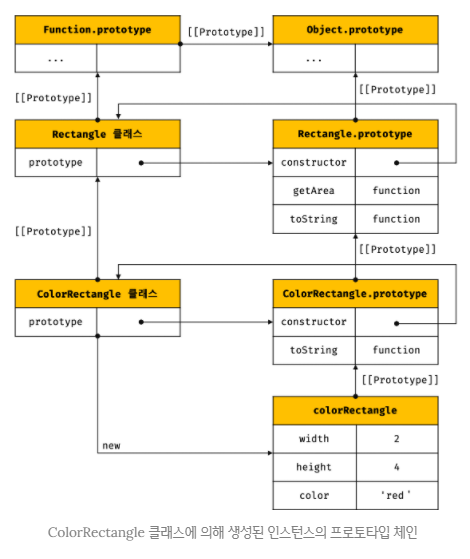

## JAVASCRIPT
<details open>
<summary>클래스</summary>
<div markdown="25">

#### 클래스는 프로토타입의 문법적 설탕인가?
- 자바스크립트는 `프로토타입 기반(prototype based) 객체지향 언어`이다.
- 프로토타입 기반 객체지향 언어는 클래스가 필요없는(class free) 객체지향 프로그래밍 언어이다.
- ES5에서는 클래스 없이도 다음과 같이 생성자 함수와 프로토타입을 통해 객체지향언어의 상속을 구현할 수 있다.
```javascript
var Person = (function () {
  function Person(name) {
    this.name = name;
  }

  Person.prototype.sayHi = function () {
    console.log('Hi! My name is ' + this.name);
  };

  return Person;
}());

var me = new Person('Lee');
me.sayHi(); // Hi! My name is Lee
```
- ES6의 클래스가 프로토타입 기반 객체지향 모델을 폐지하고 새롭게 클래스 기반 객체지향 모델을 제공하는 것은 아니다.
- 사실 클래스는 함수이며 기존 프로토타입 기반 패턴을 클래스 기반 패턴처럼 사용할 수 있도록 하는 `문법적 설탕(syntactic sugar)`이라고 볼 수 있다.
- 문법적 설탕 : 어떠한 기능이 복잡하거나 오해의 요지가 있는 경우 좀 더 편리한 기능으로 이전 기능을 사용할 수 있는 경우, 그 편리한 기능을 문법적 설탕이라고 한다.
- 문법적 설탕은 그 전 기능과 더 편리한 기능의 결과물이 같아야 한다.

- 단, 클래스와 생성자 함수 모두 프로토타입 기반의 인스턴스를 제공하지만 정확히 동일하게 동작하지는 않는다.
- 클래스는 생성자 함수보다 엄격하며 생성자 함수에서는 제공하지 않는 기능도 제공한다.

- 생성자 함수와 클래스의 공통점 : 프로토타입 기반이고 모두 함수이다.
- 생성자 함수는 `[[Call]]`, `[[Construct]]` 둘 다 가지고 있다.
- 클래스는 `[[Construct]]`만 가지고 있어서 new 연산자 없이 호출할 수 없다.

1. `클래스는 new 연산자 없이 호출하면 에러가 발생한다.` 하지만 생성자 함수를 new 연산자 없이 호출하면 일반함수로서 호출된다.
2. `클래스는 상속을 지원하는 extends와 super 키워드를 제공한다.` 하지만 생성자 함수는 extends와 super 키워드를 지원하지 않는다.
3. `클래스는 호이스팅이 발생하지 않은 것처럼 동작한다.` 하지만 함수 선언문으로 정의된 생성자 함수는 함수 호이스팅이, 함수 표현식으로 정의한 생성자 함수는 변수 호이스팅이 발생한다.
4. `클래스 내의 모든 코드에는 암묵적으로 strict mode가 지정`되어 실행되며 strict mode를 해제할 수 없다. 하지만 생성자 함수는 암묵적으로 strict mode가 지정되지 않는다.
5. `클래스의 constructor, 프로토타입 메서드, 정적 메서드는 모두 프로퍼티 어트리뷰트 [[Enumerable]]의 값이 false이다.` 다시 말해, 열거되지 않는다.

- 에러가 발생하면 에러 아래 코드는 실행되지 않고, 애플리케이션이 스탑된다.

- 생성자 함수와 클래스는 프로토타입 기반의 객체지향을 구현했다는 점에서 매우 유사하다.
- 하지만 클래스는 생성자 함수 기반의 객체 생성 방식보다 견고하고 명료하다.
- 특히 클래스의 extends와 super 키워드는 상속 관계 구현을 더욱 간결하고 명료하게 한다.
- 따라서 클래스는 `새로운 객체 생성 매커니즘`으로 보는 것이 좀 더 합당하다.
```javascript
class Foo {
  x() {
    console.log(this);
  }
}

const foo = new Foo();
foo.x(); // Foo {}, 메서드로서 호출 foo를 가리킴

const bar = foo.x;
bar(); // undefined
// 일반함수로서 호출, class 내부에서는 strict mode가 적용되므로 일반함수로서 호출한 경우 this는 undefined

console.log(Object.keys(Foo));
// class에 있는 메서드는 [[Enumerable]]이 false이기 때문에 나오지 않음

console.log(Object.getOwnPropertyDescriptors({ x() {} }));
// 객체 리터럴은 [[Enumerable]]이 true이기 때문에 나옴
/*
{
  x: {
    value: [Function: x],
    writable: true,
    enumerable: true,
    configurable: true
  }
}
*/
```

#### 클래스 정의
- 클래스는 생성자 함수와 마찬가지로 `파스칼 케이스`를 사용하는 것이 일반적이다.
- 일반적이지는 않지만 함수와 마찬가지로 표현식으로 클래스를 정의할 수도 있다.
- 이때 클래스는 함수와 마찬가지로 이름을 가질 수도 있고, 갖지 않을 수도 있다.
```javascript
// 익명 클래스 표현식
const Person = class {};

// 기명 클래스 표현식
const Person = class Myclass {};
```
- `{}`는 코드블록이 아니고, 리터럴의 일부라고 생각하자.

- 클래스를 표현식으로 정의할 수 있다는 것은 클래스가 값으로 사용할 수 있는 일급 객체라는 것을 의미한다.
- `클래스는 함수이다.`
- 따라서 `클래스는 값처럼 사용할 수 있는 일급 객체`이다.

- 클래스 몸체에는 0개 이상의 메서드만 정의할 수 있다.
- 클래스 몸체에서 정의할 수 있는 메서드는 `constructor(생성자)`, `프로토타입 메서드`, `정적 메서드`의 3가지가 있다.

- 클래스 내부에서 메서드를 구분할 때, 쉼표 또는 세미콜론을 붙이지 않는다.
```javascript
class Person {
  constructor(name) {
    this.name = name; 
  }

  sayHi() {
    console.log(`Hi! My name is ${this.name}`);
  }

  static sayHello() {
    console.log('Hello!');
  }
}

const me = new Person('Lee');
console.log(me.name); // Lee
me.sayHi(); // Hi! My name is Lee
Person.sayHello(); // Hello!
```
<br />



#### 클래스 호이스팅
```javascript
class Person {}
console.log(typeof Person); // function
```
- 클래스 선언문으로 정의한 클래스는 함수 선언문과 같이 `소스코드 평가 과정, 즉 런타임 이전에 먼저 평가되어 함수 객체를 생성한다.`
- 이때 클래스가 평가되어 생성된 함수 객체는 생성자 함수로서 호출할 수 있는 함수, 즉 `constructor이다.`
- `생성자 함수로서 호출할 수 있는 함수는 함수 정의가 평가되어 함수 객체를 평가하는 시점에 프로토타입도 더불어 생성된다.`
- 프로토타입과 생성자 함수는 단독으로 존재할 수 없고 언제나 쌍(pair)으로 존재하기 때문이다.

- `단, 클래스는 클래스 정의 이전에 참조할 수 없다.`
```javascript
console.log(Person);
// ReferenceError: Cannot access 'Person' before initialization

class Person {}
```
```javascript
const Person = '';

{
  console.log(Person);
  // ReferenceError: Cannot access 'Person' before initialization

  class Person {}
}
```
- 클래스 선언문도 변수 선언, 함수 정의와 마찬가지로 호이스팅이 발생한다.
- 단, 클래스는 let, const 키워드로 선언한 변수처럼 호이스팅된다.
- 따라서 클래스 선언문 이전에 일시적 사각지대(TDZ)에 빠지기 때문에 호이스팅이 발생하지 않는 것처럼 동작한다.

- `var, let, const, function, function *, class 키워드`로 선언된 모든 식별자는 호이스팅된다.
- 모든 선언문은 런타임 이전에 먼저 실행되기 때문이다.

#### 인스턴스 생성
- 클래스는 생성자 함수이며 new 연산자와 함께 호출되어 인스턴스를 생성한다.
- 클래스는 인스턴스를 생성하는 것이 유일한 존재 이유이므로 반드시 new 연산자와 함께 호출해야 한다.
```javascript
class Person {}

const me = Person();
// TypeError: Class constructor Person cannot be invoked without 'new'
```

- 클래스 표현식으로 정의된 클래스의 경우 기명 클래스 표현식의 이름(MyClass)을 사용해 인스턴스를 생성하면 에러가 발생한다.
```javascript
const Person = class MyClass {};

const me = new Person();

console.log(MyClass); // ReferenceError: MyClass is not defined

const you = new MyClass(); // ReferenceError: MyClass is not defined
```
- 이는 기명 함수 표현식과 마찬가지로 클래스 표현식에서 사용한 클래스 이름은 외부 코드에서 접근 불가능하기 때문이다.

#### 메서드
##### 클래스 정의에 대한 새로운 제안 사양
- ECMAScript 사양(ES11)에 따르면 인스턴스 프로퍼티는 반드시 constructor 내부에서 정의해야 한다.
- 하지만, 2020년 7월 현재, `클래스 몸체에 메서드 뿐만이 아니라 프로퍼티를 직접 정의할 수 있는 새로운 표준 사양`이 제안되어 있다.
- 이 제안 사양에의해 머지않아 클래스 몸체에서 메서드뿐만 아니라 프로퍼티도 정의할 수 있게 될 것으로 보인다.(현재 크롬과 같은 모던 브라우저에서는 이미 사용할 수 있다.)

1. `constructor`
- constructor는 인스턴스를 생성하고 초기화하기 위한 특수한 메서드이다.
- constructor는 이름을 변경할 수 없다.
- constructor 메서드 안이 클래스 함수 몸체이다.
```javascript
class Person {
  constructor(name) {
    this.name = name;
  }
}

console.dir(Person);
```
<br />



- 이처럼 클래스는 평가되어 함수 객체가 된다.
- 클래스도 함수 객체 고유의 프로퍼티를 모두 가지고 있다.
- 함수와 동일하게 프로토타입과 연결되어 있으며 자신의 스코프 체인을 구성한다.
```javascript
const me = new Person(‘Lee’);
console.log(me); // Person { name: "Lee" }
```
<br />



- 생성자 함수와 마찬가지로 constructor 내부에서 this에 추가한 프로퍼티는 인스턴스 프로퍼티가 된다.
- `constructor 내부의 this는 클래스가 생성한 인스턴스를 가리킨다.`

- 그런데 어디에서 constructor 메서드가 보이지 않는다.
- 이는 클래스 몸체에 정의한 constructor는 메서드로 해석되는 것이 아니라 `클래스가 평가되어 생성한 함수 객체 코드의 일부가 된다.`
- 다시 말해, 클래스 정의가 평가되면 constructor의 기술된 동작을 하는 함수 객체가 생성된다.

- 클래스의 constructor 메서드와 프로토타입의 constructor 프로퍼티는 직접적인 관련이 없다.

- constructor는 생성자 함수와 유사하지만 몇 가지 차이가 있다.
- constructor는 클래스 내에 최대 한 개만 존재할 수 있다.
- 만약 클래스가 2개 이상의 constructor를 포함하면 문법에러(SyntaxError)가 발생한다.
```javascript
class Person {
  constructor() {}
  constructor() {}
}
// SyntaxError: A class may only have one constructor
```
- constructor는 생략할 수 있다.
- constructor를 생략 = 인스턴스 프로퍼티를 만들지 않겠다.
```javascript
class Person {}
```
- constructor를 생략하면 클래스에 빈 constructor가 암묵적으로 정의된다.
- constructor를 생략한 클래스는 빈 객체를 생성한다.
```javascript
class Person {
  constructor() {}
}

const me = new Person();
console.log(me); // Person {}
```
- 인스턴스를 초기화하려면 constructor를 생략하면 안 된다.
- constructor는 별도의 반환문을 갖지 않아야 한다.
- new 연산자와 함께 클래스가 호출되면 생성자 함수롸 동일하게 암묵적으로 this, 즉 인스턴스를 반환하기 때문이다.
- 만약 this가 아닌 다른 객체를 명시적으로 반환하면 this, 즉 인스턴스가 반환되지 못하고 return 문에 명시한 객체가 반환된다.
```javascript
class Person {
  constructor(name) {
    this.name = name;

    return {};
  }
}

const me = new Person();
console.log(me); // {}
```
- 하지만 명시적으로 원시값을 반환하면 반환은 무시되고 암묵적으로 this가 반환된다.
- 이처럼 constructor 내부에서 명시적으로 this가 아닌 다른 값을 반환하는 것은 클래스의 기본동작을 훼손한다.
- 따라서 constructor 내부에서 return 문은 반드시 생략해야 한다.

#### 프로토타입 메서드
- 클래스 몸체에서 정의한 메서드는 클래스의 prototype 프로퍼티의 메서드를 추가하지 않아도 기본적으로 프로토타입 메서드가 된다.
```javascript
class Person {
  constructor(name) {
    this.name = name;
  }

  sayHi() {
    console.log(`Hi! My name is ${this.name}`);
  }
}

const me = new Person();
console.log(me.sayHi()); 
/*
Hi! My name is undefined
undefined
*/
```

- 클래스가 생성한 인스턴스는 프로토타입 체인의 일원이 된다.
```javascript
Object.getPrototypeOf(me) === Person.prototype; // true
me instanceof Person; // true

Object.getPrototypeOf(Person.prototype) === Object.prototype; // true
me instanceof Object; // true

me.constructor === Person; // true
```
<br />


- 클래스는 생성자 함수와 마찬가지로 프로토타입 기반의 객체 생성 매커니즘이다.

#### 정적 메서드
- 클래스에서는 메서드에 static 키워드를 붙이면 정적 메서드(클래스 메서드)가 된다.
```javascript
class Person {
  constructor(name) {
    this.name = name;
  }

  static sayHi() {
    console.log('Hi!');
  }
}
```
- 정적 메서드는 인스턴스의 프로토타입 체인 상에는 클래스가 존재하지 않기 때문에 인스턴스로 클래스의 메서드를 상속받을 수 없다.

#### 정적 메서드와 프로토타입 메서드의 차이
1. 정적 메서드와 프로토타입 메서드는 자신이 속해 있는 `프로토타입 체인이 다르다.`
2. `정적 메서드는 클래스로 호출`하고 `프로토타입 메서드는 인스턴스로 호출`한다.
3. `정적 메서드는 인스턴스 프로퍼티를 참조할 수 없지만 프로토타입 메서드는 인스턴스 프로퍼티를 참조할 수 있다.`
```javascript
class Square {
  constructor(width, height) {
    this.width = width;
    this.height = height;
  }

  area() {
    return this.width * this.height;
  }
}

const square = new Square(10, 10);
console.log(square.area()); // 100
```
- 프로토타입 메서드는 인스턴스로 호출해야 하므로 프로토타입 메서드 내부의 this는 프로토타입 메서드를 호출한 인스턴스를 가리킨다.
- 위 예제의 경우, square 객체로 프로토타입 메서드 area를 호출했기 때문에 area 내부의 this는 square 객체를 가리킨다.

- 정적 메서드는 클래스로 호출해야 하므로 정적 메서드 내부의 this는 인스턴스가 아닌 `클래스를 가리킨다.`
- 즉, 프로토타입 메서드와 정적 메서드 내부의 this 바인딩이 다르다.

- 표준 빌트인 객체인 Math, Number, JSON, Object, Reflect 등은 다양한 정적 메서드를 가지고 있다.
- 이들 정적 메서드는 애플리케이션 전역에서 사용할 유틸리티(utility) 함수이다.
```javascript
Math.max(1, 2, 3); // -> 3
Number.isNaN(NaN); // -> true
JSON.stringify({ a: 1 }); // -> "{"a":1}", 서버 통신 시 사용
Object.is({}, {}); // -> false, 참조값이 다르기 때문에 다르다.
Reflect.has({ a: 1 }, 'a'); // true
```
- 이처럼 클래스 또는 생성자 함수를 하나의 네임 스페이스로 사용하여 정적 메서드를 모아 놓으면 `이름 충돌 가능성을 줄여 주고 관련 함수들을 구조화할 수 있는 효과가 있다.`
- 이 같은 이유로 정적 메서드는 애플리케이션 전역에서 사용할 유틸리티 함수를 전역 함수로 정의하지 않고 메서드로 구조화할 때 유용하다.

##### ES6에서 추가된 빌트인 객체 Number의 정적 메서드
- ES6에서 살펴본 isFinite, isNaN, parseFloat, parseInt 등의 빌트인 전역 함수를 표준 빌트인 객체 Number의 정적 메서드로 추가 구현했다.
- Number의 정적 메서드 isFinite, isNaN, parseFloat, parseInt는 빌트인 전역 함수 isFinite, isNaN, parseFloat, parseInt보다 엄격하다.

#### 클래스에서 정의한 메서드의 특징
1. function 키워드를 생략한 메서드 축약 표현을 사용한다.
2. 객체 리터럴과는 다르게 클래스에 메서드를 정의할 때는 콤마가 필요없다.(세미콜론도 필요없음)
3. 암묵적으로 strict 모드로 실행된다.
4. for...in 문이나 Object.keys 메서드 등으로 열거할 수 없다. 즉, 프로퍼티 열거 가능 여부를 나타내며, 불리언 값을 갖는 프로퍼티 어트리뷰트 `[[Enumerable]]`의 값이 false이다.
5. 내부 메서드 `[[Construct]]`를 갖지 않는 non-contructor이다. 따라서 new 연산자와 함께 호출할 수 없다.

#### 클래스 인스턴스 생성 과정
- new 연산자와 함께 클래스를 호출하면 클래스 내부메서드 `[[Contruct]]`가 호출된다.
1. 인스턴스 생성과 this 바인딩
- new 연산자와 함께 클래스를 호출하면 constructor의 내부 코드가 실행되기에 앞서 암묵적으로 빈 객체가 생성된다.
- 이 빈 객체가 바로 클래스가 생성한 인스턴스이다.
- 이때 클래스가 생성한 인스턴스의 프로토타입으로 클래스의 prototype 프로퍼티가 가리키는 객체가 설정된다.
- 그리고 암묵적으로 생성된 빈 객체, 즉 인스턴스는 this에 바인딩된다.
- 따라서 constructor 내부의 this는 클래스가 생성한 인스턴스를 가리킨다.

2. 인스턴스 초기화
- 만약 constructor가 생략되었다면 이 과정도 생략된다.

3. 인스턴스 반환

```javascript
class Person {
  constructor(name) {
    // 1. 암묵적으로 인스턴스가 생성되고 this에 바인딩된다.
    console.log(this); // Person {}
    console.log(Object.getPrototypeOf(this) === Person.prototype); // true

    // 2. this에 바인딩되어 있는 인스턴스를 초기화한다.
    this.name = name;

    // 3. 완성된 인스턴스가 바인딩된 this가 암묵적으로 반환된다.
  }
}
```
#### 프로퍼티
1. 인스턴스 프로퍼티
- 인스턴스 프로퍼티는 constructor 내부에서 정의해야 한다.
- 인스턴스 프로퍼티는 언제나 public하다.
- 다행히도 private한 프로퍼티를 정의할 수 있는 사양이 현재 제안 중에 있다.

2. 접근자 프로퍼티
- 접근자 프로퍼티는 클래스에서도 사용할 수 있다.
```javascript
class Person {
  constructor(firstName, lastName) {
    this.firstName = firstName;
    this.lastName = lastName;
  }

  get fullName() {
    return `${this.firstName} ${this.lastName}`;
  }

  set fullName(name) {
    [this.firstName, this.lastName] = name.split(' ');
  }
}

const me = new Person('Ungmo', 'Lee');

// 접근자 프로퍼티 fullName에 값을 저장하면 setter 함수가 호출된다.
me.fullName = 'Heegun Lee';
console.log(me); // {firstName: "Heegun", lastName: "Lee"}

// 접근자 프로퍼티 fullName에 접근하면 getter 함수가 호출된다.
console.log(me.fullName); // Heegun Lee

console.log(Object.getOwnPropertyDescriptor(Person.prototype, 'fullName'));
// {get: ƒ, set: ƒ, enumerable: false, configurable: true}
```
- 클래스의 접근자 프로퍼티 또한 프로토타입의 프로퍼티가 된다.
```javascript
// Object.getOwnPropertyNames는 비열거형(non-enumerable)을 포함한 모든 프로퍼티의 이름을 반환한다.(상속 제외)
Object.getOwnPropertyNames(me); // ["firstName", "lastName"]
Object.getOwnPropertyNames(Object.getPrototypeOf(me)); // ["constructor", "fullName"]
```
#### 클래스 필드 정의 제안
- `클래스 필드(class field)` 또는 클래스 멤버 : 클래스 기반 객체지향 언어에서 `클래스가 생성할 인스턴스의 프로퍼티`를 가리키는 용어
- 자바스크립트의 경우, 클래스 몸체(class body)에는 메서드 만을 선언할 수 있다.
- 따라서 클래스 몸체어 클래스 필드를 선언하면 문법에러(SyntaxError)가 발생한다. 
```javascript
class Person {
  name = 'Lee';
}

const me = new Person('Lee');
```
- 하지만 위 예제를 최신 브라우저 또는 최신 Node.js에서 실행하면 문법 에러가 발생하지 않고 정상 동작한다.
- 자바스크립트에서도 인스턴스 프로퍼티를 마치 클래스 기반 객체지향 언어의 클래스 필드처럼 정의할 수 있는 새로운 표준 사양인 “Class field declarations”가 2020년 7월 현재, TC39 프로세스의 stage 3(candidate)에 제안되어 있다.

##### Technical Committee 39(TC39)
- ECMA 인터내셔널은 ECMAScript 이외에도 다양한 기술의 사양을 관리하고, 이들 사양을 관리하는 주체인 기술 위원회(Technical Committee)도 여럿 존재한다.
- 여러 사양 중에서 ECMA-262 사양(ECMAScript)의 관리를 담당하는 위원회가 바로 TC39다.
- TC39는 구글, 애플, 마이크로소프트, 모질라 등 브라우저 벤더와 페이스북, 트위터와 같이 ECMA-262 사양(ECMAScript)을 제대로 준수해야 하는 기업으로 구성되어 있다.

##### TC39 프로세스
- TC39 프로세스는 ECMA-262 사양(ECMAScript)에 새로운 표준 사양(제안. proposal)을 추가하기 위해 공식적으로 명문화해 놓은 과정을 말한다.
- TC39 프로세스는 0단계부터 4단계까지 총 5개의 단계로 구성되어 있고, 상위 단계로 승급하기 위한 명시적인 조건들이 있다.
- 승급 조건을 충족시킨 제안(proposal)은 TC39의 동의를 통해 다음 단계(stage)로 승급된다.
- TC39 프로세스는 다음과 같은 단계를 거쳐 최종적으로 ECMA-262 사양(ECMAScript)의 새로운 표준 사양이 된다.
- stage 0: strawman => stage 1: proposal => stage 2: draft => stage 3: candidate => stage 4: finished
- stage 3(candidate)까지 승급한 제안은 심각한 문제가 없는 한 변경되지 않고 대부분 stage 4로 승급된다. 
- stage 4(finished)까지 승급한 제안은 큰 이변이 없는 이상, 차기 ECMAScript 버전에 포함된다.

- 클래스 몸체에서 클래스 필드를 정의할 수 있는 클래스 필드 정의(Class field definitions) 제안은 아직 ECMAScript 정식 표준 사양으로 승급되지 않았다.
- 하지만 최신 브라우저(Chrome 72 이상)와 최신 Node.js(버전 12 이상)는 표준 사양으로 승급이 확실시되는 이 제안을 선제적으로 미리 구현해 놓았다.
- 따라서 최신 브라우저와 최신 Node.js에서는 클래스 필드를 클래스 몸체에 정의할 수 있다.
- `클래스 몸체에서 클래스 필드를 정의하는 경우, this에 클래스 필드를 바인딩해서는 안된다.`
- `this는 클래스의 constructor 메서드 내에서만 유효하다.`
```javascript
class Person {
  this.name = ''; // SyntaxError: Unexpected token '.'
}
```
- 클래스 필드에 초기값을 할당하지 않으면 undefined를 갖는다.
```javascript
class Person {
  name;
}

const me = new Person();
console.log(me); // Person {name: undefined}
```
```javascript
class Person {
  name = 'Lee';

  get Name = function () {
    return this.name;
  }

  // getName = () => this.name;
}

const me = new Person('Lee');
console.log(me); // Person {name: "Lee", getName: ƒ}
```
- 이처럼 클래스 필드에 함수를 할당하는 경우, 이 함수는 프로토타입 메서드가 아닌 `인스턴스 메서드가 된다.`
- 인스턴스 매서드(클래스 필드)의 상위스코프는 constructor 메서드이다.
- 모든 클래스 필드는 인스턴스 프로퍼티가 되기 때문이다.
- 따라서 클래스 필드에 함수를 할당하는 것은 권장하지 않는다.

- 클래스 필드에 화살표 함수를 할당하여 화살표 함수 내부의 this가 인스턴스를 가리키게 하는 경우도 있다.
```html
<!DOCTYPE html>
<html>
<body>
  <button class="btn">0</button>
  <script>
    class App {
      constructor() {
        this.$button = document.querySelector('.btn');
        this.count = 0;

        // 이벤트 핸들러 increase 내부의 this는 DOM 요소(this.$button)를 가리킨다.
        // 하지만 increase는 화살표 함수로 정의되어 있으므로
        // increase 내부의 this는 인스턴스를 가리킨다.
        this.$button.onclick = this.increase;

        // 만약 increase가 화살표 함수가 아니라면 bind 메서드를 사용해야 한다.
        // $button.onclick = this.increase.bind(this)
      }
      // 인스턴스 메서드
      // 화살표 함수 내부의 this는 언제나 상위 컨텍스트의 this를 가리킨다.
      // 여기서 상위 컨텍스트는 constructor 메서드이다.
      increase = () => this.$button.textContent = ++this.count;
    }
    new App();
  </script>
</body>
</html>
```
```javascript
<!DOCTYPE html>
<html>
<body>
  <button class="btn">0</button>
  <script>
    class App {
      constructor() {
        this.$button = document.querySelector('.btn');
        this.count = 0;

        this.increase = function () {
          this.$button.textContent = ++this.count;
        };
        this.$button.onclick = this.increase.bind(this);
      }
    }
    new App();
  </script>
</body>
</html>
```
- 인스턴스 프로퍼티를 정의하는 방식은 2가지가 되었다.
1. 인스턴스를 생성할 때 외부 초기값으로 클래스 필드를 `초기화할 필요가 있다면 contructor에서 인스턴스 프로퍼티를 정의하는 기존 방식 사용`
2. 인스턴스를 생성할 때 외부 초기값으로 클래스 필드를 `초기화할 필요가 없다면 기존의 constructor에서 인스턴스 프로퍼티를 정의하는 방식과 클래스 필드 정의 제안 모두 가능`

#### private 필드 정의 제안
- 자바스크립트는 캡슐화를 완전하게 지원하지 않는다.
- ES6의 클래스도 생성자 함수와 마찬가지로 다른 클래스 기반 객체지향 언어에서는 지원하는 public, private, protected 키워드와 같은 접근 제한자를 지원하지 않는다.
- 따라서 인스턴스 프로퍼티는 인스턴스를 통해 클래스 외부에서 언제나 참조할 수 있다. 즉, 언제나 public하다.
- 클래스 필드 정의 제안을 사용하더라도 클래스 필드는 기본적으로 public하기 때문에 외부에 그대로 노출된다.
```javascript
class Person {
  name = 'Lee'; // public
}

const me = new Person();
console.log(me); // Person { name: 'Lee' }
```
- 다행히도 2020년 07월 현재, TC39 프로세스의 stage 3(candidate)에는 private 필드를 정의할 수 있는 새로운 표준 사양이 제안되어 있다.
- 표준 사양으로 승급이 확실시 되는 이 제안도 최신 브라우저와 최신 Node.js에 이미 구현되어 있다.
```javascript
class Person {
  // private 필드 정의
  #name = '';
  
  constructor(name) {
    this.#name = name;
  }
}

const me = new Person();

// private 필드 #name은 클래스 외부에서 참조할 수 없다.
console.log(me.#name); 
// SyntaxError: Private field '#name' must be declared in an enclosing class
```
##### TypeScript
- C#의 창시자인 덴마크 출신 소프트웨어 엔지니어 아네르스 하일스베르(Anders Hejlsberg)가 개발을 주도한 자바스크립트의 상위 확장(superset)인 TypeScript는 클래스 기반 객체지향 언어가 지원하는 접근 제한자인 public, private, protected를 모두 지원하며, 의미 또한 기본적으로 동일하다.

- public 필드는 어디서든지 참조할 수 있지만, private 필드는 클래스 내부에서만 참조할 수 있다.

| 접근 가능성                 | public | private |
| --------------------------- | ------ | ------- |
| 클래스 내부                 | O      | O       |
| 자식 클래스 내부            | O      | X       |
| 클래스 인스턴스를 통한 접근 | O      | X       |


- 즉, 부모 클래스를 포함한 클래스 외부에서 private 필드에 접근할 수 있는 방법은 없다.
- 다만 접근자 프로퍼티를 통해 간접적으로 접근하는 방법은 유효하다.
```javascript
class Person {
  // private 필드 정의
  #name = '';
  
  constructor(name) {
    this.#name = name;
  }
  
  get name() {
    return this.#name.trim();
  }
}

const me = new Person('  Lee  ');

console.log(me.name); // Lee
```
- `private 필드는 반드시 클래스 몸체에 정의해야 한다.`
- `private 필드를 직접 constructor에 정의하면 에러가 발생한다.`
```javascript
class Person {
  constructor(name) {
    this.#name = name;
  }
}
// SyntaxError: Private field '#name' must be declared in an enclosing class
```
#### static 필드 정의 제안
- 클래스에는 static 키워드를 사용하여 정적 메서드를 정의할 수 있었다.
- 하지만, static 키워드를 사용하여 정적 필드를 정의할 수는 없었다.
- 하자만, static public 필드, static private 필드, static private 메서드를 정의할 수 있는 새로운 표준 사양인 “Static class features”이 2020년 7월 현재, TC39 프로세스의 stage 3(candidate)에 제안되어 있다.
- 이 제안 중에서 static public/private 필드는 2020년 7월 현재, 최신 브라우저(Chrome 72 이상)와 최신 Node.js(버전 12 이상)에 이미 구현되어 있다.
```javascript
class MyMath {
  // static public 필드 정의
  static PI = 22 / 7;

  // static private 필드 정의
  static #num = 10;

  static increment() {
    return ++MyMath.#num;
  }
}

console.log(MyMath.PI); // 3.142857142857143
console.log(MyMath.increment()); // 11
console.log(MyMath.#num);
// SyntaxError: Private field '#num' must be declared in an enclosing class
``` 
#### 상속에 의한 클래스 확장
1. 클래스 상속과 생성자 함수 상속
- 프로토타입 기반 상속은 프로토타입 체인을 통해 다른 객체의 자산을 상속받는 개념이지만 `상속에 의한 클래스 확장은 기존 클래스를 상속받아 새로운 클래스를 확장(extends)하여 정의`하는 것이다.
<br />



- 클래스와 생성자 함수는 인스턴스를 생성할 수 있는 함수라는 점에서 매우 유사하다.
- 하지만 클래스는 상속을 통해 기본 클래스를 확장할 수 있는 문법이 기본적으로 제공되지만, 생성자 함수는 그렇지 않다.
- `상속에 의한 클래스 확장은 코드 재사용 관점에서 매우 유용하다.`
```javascript
class Animal {
  constructor(age, weight) {
    this.age = age;
    this.weight = weight;
  }

  eat() { return 'eat'; }

  move() { return 'move'; }
}

class Bird extends Animal {
  fly() { return 'fly'; }
}

const bird = new Bird(1, 5);

console.log(bird); // Bird {age: 1, weight:5}
console.log(bird instanceof Bird); // true
console.log(bird instanceof Animal); // true

console.log(bird.eat()); // eat
console.log(bird.move()); // move
console.log(bird.fly()); // fly
```
<br />



```javascript
class Animal {
  constructor(age, weight) {
    this.age = age;
    this.weight = weight;
  }

  static eat() { return 'eat'; }

  static move() { return 'move'; }
}

class Bird extends Animal {
  static fly() { return 'fly'; }
}

const bird = new Bird(1, 5);

console.log(bird); // Bird {age: 1, weight:5}

console.log(Bird.eat()); // eat
console.log(Bird.move()); // move
console.log(Bird.fly()); // fly
```
- `extends 키워드를 사용한 클래스 확장은 간편하고 직관적이다.`
- 위의 예제에서 수퍼클래스도 인스턴스를 만들 수 있다.
- 그 인스턴스의 부모는 수퍼클래스.prototype 이다.
- 하지만 서브클래스의 메서드, 프로퍼티에는 접근할 수 없다. 

- 자바스크립트는 클래스 기반 언어가 아니므로 생성자 함수를 사용하여 클래스를 흉내 내려는 시도를 권장하지는 않지만, 의사 클래스 상속(pseudo classical inheritance) 패턴을 사용하여 상속에 의한 클래스 확장을 흉내 내기도 했다.
- 클래스의 등장으로 다음 예제와 같은 의사 클래스 상속 패턴은 더는 필요하지 않다.
```javascript
var Animal = (function () {
  function Animal(age, weight) {
    this.age = age;
    this.weight = weight;
  } 

  Animal.prototype.eat = function () {
    return 'eat';
  };

  Animal.prototype.move = function () {
    return 'move';
  };

  Animal.hi = function () {
    return 'hi!';
  };

  return Animal;
}());

var Bird = (function () {
  function Bird() {
    Animal.apply(this, arguments);
  }

  Bird.prototype = Object.create(Animal.prototype);

  Bird.prototype.contructor = Bird;

  Bird.prototype.fly = function () {
    return 'fly';
  }

  return Bird;
}());

var bird = new Bird(1, 5);

console.log(bird); // Bird {age: 1, weight: 5}
console.log(bird.eat()); // eat
console.log(bird.move()); // move
console.log(bird.fly()); // fly
console.log(Bird.hi()); // TypeError: Bird.hi is not a function
```

2. extends 키워드
```javascript
// 수퍼(베이스/부모) 클래스
class Base {}

// 서브(파생/자식) 클래스
class Derived extends Base {}
```
- `서브 클래스(subclass, derived class, child class)` : 상속을 통해 확장된 클래스
- `수퍼 클래스(superclass, base class, parent class)` : 서브 클래스에게 상속된 클래스

- extends 키워드의 역할은 수퍼 클래스와 서브 클래스 간의 상속 관계를 설정하는 것이다.
- `클래스도 프로토타입을 통해 상속 관계를 구현한다.`
- 수퍼클래스와 서브클래스는 인스턴스 프로토타입 체인뿐만 아니라, 클래스 간의 프로토타입 체인도 생성한다.
- 이를 통해 `프로토타입 메서드, 정적 메서드 모두 상속이 가능하다.`
<br />



3. 동적 상속
- extends 키워드는 클래스뿐만 아니라 생성자 함수를 상속받아 클래스를 확장할 수 있다.
- 단, extends 키워드 앞에는 반드시 클래스가 와야 한다.
```javascript
function Base(a) {
  this.a = a;
}

// 정적 상속
class Derived extends Base {}

const derived = new Derived(1);
console.log(derived); // Derived {a: 1}
```
- extends 키워드 다음에는 클래스뿐만이 아니라 `[[Construct]]` 내부 메서드를 갖는 `함수 객체로 평가될 수 있는 모든 표현식을 사용할 수 있다.`
- 이를 통해 동적으로 상속받을 대상을 결정할 수 있다.

- 정적 상속 : 런타임 이전에 상속받을 대상이 결정된다.
- 동적 상속 : 런타임에 상속받을 대상이 결정된다.
```javascript
function Base1() {}

class Base2 {}

let condition = true;

// 조건에 따라 동적으로 상속 대상을 결정하는 서브클래스
class Derived extends (condition ? Base1 : Base2) {}

const derived = new Derived();
console.log(derived); // Derived {}

console.log(derived instanceof Base1); // true
console.log(derived instanceof Base2); // false
```

4. 서브클래스의 constructor
- 클래스에서 constructor를 생략하면 클래스에 다음과 같이 비어 있는 constructor가 암묵적으로 정의된다.
```javascript
constructor () {}
``` 
- 서브클래스에서 constructor를 생략하면 클래스에 다음과 같은 constructor가 암묵적으로 정의된다.
- args는 new 연산자와 함께 클래스를 호출할 때 전달한 인수 리스트이다.
```javascript
constructor(...args) { super(...args); }
```
- super()는 수퍼클래스의 constructor(super-constructor)를 호출하여 인스턴스를 생성한다.

##### Rest 파라미터
- 매개변수에 ...을 붙이면 Rest 파라미터가 된다.
- Rest 파라미터는 함수에 전달된 인수들의 목록을 배열로 전달받는다.

- 다음 예제는 수퍼클래스와 서브클래스 모두 constructor를 생략했다.
```javascript
// 수퍼클래스
class Base {}

// 서브클래스
class Derived extends Base {}
```
- 위 예제의 클래스에는 다음과 같이 암묵적으로 constructor가 정의된다.
```javascript
// 수퍼클래스
class Base {
  constructor() {}
}

class Derived extends Base {
  constructor() { super(); }
}

const derived = new Derived();
console.log(derived); // Derived {}
```
- 위 예제와 같이 수퍼클래스와 서브클래스 모두 constructor를 생략하면 빈 객체가 생성된다.

5. super 키워드
- super 키워드는 `함수처럼 호출할 수도 있고` `this와 같이 식별자처럼 참조할 수 있는 특수한 키워드`이다.
- 즉 호출할 수도 있고, 참조할 수도 있다.
- super는 다음과 같이 동작한다.
	- `super를 호출하면 수퍼클래스의 constructor(super-constructor)를 호출한다.`
	- super를 참조하면 수퍼클래스의 메서드를 호출할 수 있다.

##### super 호출
- super를 호출하면 수퍼클래스의 constructor(super-constructor)를 호출한다.

- 수퍼클래스의 constructor 내부에서 추가한 프로퍼티를 그대로 갖는 인스턴스를 생성한다면 서브클래스의 constructor를 생략할 수 있다.
- 이때 new 연산자와 함께 서브클래스를 호출하면서 전달한 인수는 모두 서브클래스에 암묵적으로 정의된 constructor의 super 호출을 통해 수퍼클래스의 constructor에 전달된다.
```javascript
class Base {
  constructor(a, b) {
    this.a = a;
    this.b = b;
  }
}

class Derived extends Base {
  // 다음과 같이 암묵적으로 constructor가 정의된다.
  // constructor(...args) { super(...args); }
}

const derived = new Derived(1, 2);
console.log(derived); // Derived {a: 2, b: 2}
```
- 수퍼클래스에서 추가한 프로퍼티와 서브클래스에서 추가한 프로퍼티를 갖는 인스턴스를 생성한다면 서브클래스의 constructor를 생략할 수 없다.
- 이때 new 연산자와 함께 서브클래스를 호출하면서 전달한 인수 중에서 수퍼클래스의 constructor에 전달할 필요가 있는 인수는 서브클래스의 constructor에서 호출하는 super를 통해 전달한다.
```javascript
class Base {
  constructor(a, b) {
    this.a = a;
    this.b = b;
  }
}

class Derived extends Base {
  constructor(a, b, c) {
    super(a, b);
    this.c = c;
  }
}

const derived = new Derived(1, 2, 3);
console.log(derived); // Derived {a: 2, b: 2, c:3}
```

- super를 호출할 때 주의할 사항
1. `서브클래스에서 constructor를 생략하지 않는 경우 서브클래스의 constructor에서는 반드시 super를 호출해야 한다.`
```javascript
class Base {}

class Derived extends Base {
  // ReferenceError: Must call super constructor in derived class before accessing 'this' or returning from derived constructor
  constructor() {
    console.log('constructor call');
  }
}

const derived = new Derived();
```

2. `서브클래스의 constructor에서 super를 호출하기 전에는 this를 참조할 수 없다.`
```javascript
class Base {}

class Derived extends Base {
  constructor(a) {
    // ReferenceError: Must call super constructor in derived class before accessing 'this' or returning from derived constructor
    this.a = 1;
    super();
  }
}

const derived = new Derived(1);
```

3. `super는 반드시 서브클래스의 constructor에서만 호출한다. 서브클래스가 아닌 클래스의 constructor나 함수에서 super를 호출하면 에러가 발생한다.`
```javascript
class Base {
  constructor() {
    super(); // SyntaxError: 'super' keyword unexpected here
  }
}

function Foo() {
  super(); // SyntaxError: 'super' keyword unexpected here
}
```

##### super 참조
- 메서드 내에서 super를 참조하면 수퍼클래스의 메서드를 호출할 수 있다.
1. `서브클래스의 프로토타입 메서드 내에서 super.sayHi는 수퍼클래스의 프로토타입 메서드 sayHi를 가리킨다.`
```javascript
class Base {
  constructor(name) {
    this.name = name;
  }

  sayHi() {
    return `Hi! ${this.name}`;
  }
}

class Derived extends Base {
  sayHi() {
    return `${super.sayHi()}. how are you doing?`;
  }
}

const derived = new Derived('Lee');
console.log(derived.sayHi()); // Hi! Lee. how are you doing?
```
- super 참조를 통해 수퍼클래스의 메서드를 참조하려면 super가 수퍼클래스의 메서드가 바인딩된 객체, 즉 수퍼클래스의 prototype 프로퍼티에 바인딩된 프로토타입을 참조할 수 있어야 한다.
- 위 예제는 다음 예제와 동일하게 동작한다.
```javascript
class Base {
  constructor(name) {
    this.name = name;
  }

  sayHi() {
    return `Hi! ${this.name}`;
  }
}

class Derived extends Base {
  sayHi() {
    const __super = Object.getPrototypeOf(Derived.prototype);
    return `${__super.sayHi.call(this)}. how are you doing?`;
  }
}

const derived = new Derived('Lee');
console.log(derived.sayHi()); // Hi! Lee. how are you doing?
```
- super는 자신이 참조하고 있는 메서드(위 예제의 경우 Derived의 sayHi)가 바인딩되어 있는 객체(위 예제의 경우 Derived.prototye)의 프로토타입(위 예제의 경우 Base.prototype)을 가리킨다.
- 따라서 super.sayHi는 Base.prototype.sayHi를 가리킨다.
- 단, super.sayHi, 즉 Base.prototype.sayHi를 호출할 때 call 메서드를 사용해 this를 전달해야 한다.
- `call 메서드를 사용해 this를 전달하지 않으면, Base.prototype.sayHi 메서드 내부의 this는 Base.prototype을 가리킨다.`
- Base.prototype.sayHi 메서드는 프로토타입 메서드이기 때문에 내부의 this는 인스턴스를 가리켜야 한다.
- name 프로퍼티는 인스턴스에 존재하기 때문이다.

- 이처럼 super 참조가 동작하기 위해서는 super를 참조하고 있는 메서드가 바인딩되어 있는 객체의 프로토타입을 찾을 수 있어야 한다.
- 이를 위해 메서드는 내부 슬롯 `[[HomeObject]]`를 가지며, 자신을 바인딩하고 있는 객체를 가리킨다.
```javascript
/*
[[HomeObject]]는 메서드 자신을 바인딩하고 있는 객체를 가리킨다.
[[HomeObject]]를 통해 메서드 자신을 바인딩하고 있는 객체의 프로토타입을 찾을 수 있다.
예를 들어, Derived 클래스의 sayHi 메서드는 Derived.prototype에 바인딩되어 있다.
따라서 Derived 클래스의 sayHi 메서드의 [[HomeObject]]는 Derived.prototype이고
이를 통해 Derived 클래스의 sayHi 메서드 내부의 super 참조가 Base.prototype으로 결정된다.
따라서 super.sayHi는 Base.prototype.sayHi를 가리키게 된다.
*/

super = Object.getPrototypeOf([[HomeObject]]);
```
- 주의할 것은 `ES6의 메서드 축약 표현으로 정의된 함수만이 [[HomeObject]]를 갖는다는 것이다.`
```javascript
const obj = {
  // foo는 ES6의 메서드 축약 표현으로 정의한 메서드이다. 따라서 [[HomeObject]]를 갖는다.
  foo() {},

  // bar는 ES6 메서드 축약 표현으로 정의한 메서드가 아니라 일반 함수이다.
  // 따라서 [[HomeObject]]를 갖지 않는다.
  bar: function () {}
};
```
- `[[HomeObject]]를 가지는 함수만이 super 참조를 할 수 있다.`
- 따라서 `[[HomeObject]]를 가지는 ES6의 메서드 축약 표현으로 정의된 함수만이 super 참조를 할 수 있다.`
- 단, super 참조는 수퍼클래스의 메서드를 참조하기 위해 사용하므로 서브클래스의 메서드에서 사용해야 한다.

- super 참조는 클래스의 전유물이 아니다.
- 객체 리터럴에서도 super 참조를 사용할 수 있다.
- 함수 내부에서는 super 키워드는 유효하지 않다.
- super 키워드는 ES6 문법이기 때문에 일반함수에서는 쓸 수 없다.
- 단, ES6의 메서드 축약 표현으로 정의된 함수만 가능하다.
```javascript
const base = {
  name: 'Lee',
  sayHi() {
    return `Hi! ${this.name}`;
  }
};

const derived = {
  __proto__: base,
  // ES6 메서드 축약 표현으로 정의한 메서드이다. 따라서 [[HomeObject]]를 갖는다.
  sayHi() {
    return `${super.sayHi()}. how are you doing?`;
  }
};

console.log(derived.sayHi()); // Hi! Lee. how are you doing?
```
- `객체 리터럴이나 클래스 내부에서만 ES6 메서드 축약 표현을 쓸 수 있다.`
- `따라서 super 키워드는 클래스와 객체리터럴에서만 유효하다.`

2. `서브클래스의 정적 메서드 내에서 super.sayHi는 수퍼클래스의 정적 메서드 sayHi를 가리킨다.`
```javascript
class Base {
  static sayHi() {
    return 'Hi!'
  }
}

class Derived extends Base {
  static sayHi() {
    return `${super.sayHi()} how are you doing?`;
  }
}

console.log(Derived.sayHi()); // Hi! how are you doing?
console.log(Object.getPrototypeOf(Derived) === Base); // true
```

6. 상속 클래스의 인스턴스 생성 과정
- 상속 관계에 있는 두 클래스가 어떻게 협력하여 인스턴스를 생성하는지 살펴보자
```javascript
class Rectangle {
  constructor(width, height) {
    this.width = width;
    this.height = height;
  }

  getArea() {
    return this.width * this.height;
  }

  toString() {
    return `width = ${this.width}, height = ${this.height}`;
  }
}

class ColorRectangle extends Rectangle {
  constructor(width, height, color) {
    super(width, height);
    this.color = color;
  }

  toString() {
    return super.toString() + `, color = ${this.color}`;
  }
}

const colorRectangle = new ColorRectangle(2, 4, 'red');

console.log(colorRectangle); // ColorRectangle { width: 2, height: 4, color: 'red' }
console.log(colorRectangle.getArea()); // 8
console.log(colorRectangle.toString()); // width = 2, height = 4, color = red
```
<br />



`1. 서브클래스의 super 호출`
- 자바스크립트 엔진은 클래스를 평가할 때 수퍼클래스와 서브클래스를 구분하기 위해 “base” 또는 “derived”를 값으로 갖는 내부 슬롯 `[[ConstructorKind]]`를 갖는다.
- 다른 클래스를 상속받지 않는 클래스(그리고 생성자 함수)는 내부 슬롯 `[[ConstructorKind]]`의 값이 “base”로 설정되지만 다른 클래스를 상속받는 서브클래스는 `[[ConstructorKind]]`의 값이 “derived”로 설정된다.
- 이를 통해 수퍼클래스와 서브클래스는 new 연산자와 함께 호출되었을 때의 동작이 구분된다.

- `서브클래스는 자신이 직접 인스턴스를 생성하지 않고 수퍼클래스에게 인스턴스 생성을 위임한다.`
- `이것이 바로 서브클래스의 constructor에는 반드시 super를 호출해야 하는 이유이다.`

- 서브클래스가 new 연산자와 함께 호출되면 서브클래스 constructor 내부의 super 키워드가 함수처럼 호출된다.
- super가 호출되면 수퍼클래스의 constructor(super-constructor)가 호출된다.
- 좀 더 정확히 말하자면 수퍼클래스가 평가되어 생성된 함수객체의 코드가 실행되기 시작한다.

- 만약 서브클래스의 constructor 내부에 super 호출이 없으면 에러가 발생한다.
- 실제로 인스턴스를 생성하는 주체는 수퍼클래스이므로 수퍼클래스의 constructor를 호출하는 super가 호출되지 않으면 인스턴스를 생성할 수 없기 때문이다.

`2. 수퍼클래스의 인스턴스 생성과 this 바인딩`
- `수퍼클래스의 constructor 내부의 코드가 실행되기 이전에 암묵적으로 빈 객체를 생성한다.`
- 이 빈 객체가 바로 클래스가 생성한 인스턴스이다.
- `그리고 암묵적으로 생성된 빈 객체, 즉 인스턴스는 this에 바인딩된다.`
- 따라서 수퍼클래스의 constructor 내부의 this는 생성된 인스턴스를 가리킨다.
```javascript
class Rectangle {
  constructor(width, height) {
    // 암묵적으로 빈 객체, 즉 인스턴스가 생성되고 this에 바인딩된다.
    console.log(this); // ColorRectangle {}

    // new 연산자와 함께 호출한 함수, 즉 new.target은 ColorRectangle이다.
    console.log(new.target); // ColorRectangle
...
```
- 이때 인스턴스는 수퍼클래스가 생성한 것이다.
- 하지만, `new 연산자와 함께 호출된 클래스가 서브클래스라는 것이 중요하다.`
- 즉, `new 연산자와 함께 호출된 함수를 가리키는 new.target은 서브클래스를 가리킨다.`
- 따라서 `인스턴스는 new.target이 가리키는 서브클래스가 생성된 것으로 처리된다.`

- 따라서 생성된 인스턴스의 프로토타입은 수퍼클래스의 prototype 프로퍼티가 가리키는 객체(Rectangle.prototype)가 아니라 new.target, 즉 서브클래스의 prototype 프로퍼티가 가리키는 객체(ColorRectangle.prototype)이다.
```javascript
class Rectangle {
  constructor(width, height) {
    // 암묵적으로 빈 객체, 즉 인스턴스가 생성되고 this에 바인딩된다.
    console.log(this); // ColorRectangle {}

    // new 연산자와 함께 호출한 함수, 즉 new.target은 ColorRectangle이다.
    console.log(new.target); // ColorRectangle

    // 생성된 인스턴스의 프로토타입으로 ColorRectangle.prototype이 설정된다.
    console.log(Object.getPrototypeOf(this) === ColorRectangle.prototype); // true
    console.log(this instanceof ColorRectangle); // true
    console.log(this instanceof Rectangle); // true
...
```
`3. 수퍼클래스의 인스턴스 초기화`
- 수퍼클래스의 constructor가 실행되어 this에 바인딩되어 있는 인스턴스를 초기화한다.
- 즉, this에 바인딩되어 있는 인스턴스에 프로퍼티를 추가하고 constructor가 인수로 전달받은 초기값으로 인스턴스 프로퍼티는 초기화한다.
```javascript
class Rectangle {
  constructor(width, height) {
    // 암묵적으로 빈 객체, 즉 인스턴스가 생성되고 this에 바인딩된다.
    // 인스턴스 초기화
    this.width = width;
    this.height = height;

    console.log(this); // ColorRectangle {width: 2, height: 4}
  }
...
```
`4. 서브클래스 constructor로의 복귀와 this 바인딩`
- super의 호출이 종료되고 제어 흐름이 서브클래스 constructor로 돌아온다. 
- `이때 super가 반환한 인스턴스가 this에 바인딩된다.`
- `서브클래스는 별도의 인스턴스를 생성하지 않고 super가 반환한 인스턴스를 this에 바인딩하여 그대로 사용한다.`
```javascript
class ColorRectangle extends Rectangle {
  constructor(width, height, color) {
    super(width, height);

    // super가 반환한 인스턴스가 this에 바인딩된다.
    console.log(this); // ColorRectangle {width: 2, height: 4}
...
```
- `이처럼 super가 호출되지 않으면 인스턴스가 생성되지 않으며, this 바인딩도 할 수 없다.`
- `서브클래스의 constructor에서 super를 호출하기 전에는 this를 참조할 수 없는 이유가 바로 이 때문이다.`
- 따라서 서브클래스 constructor 내부의 인스턴스 초기화는 반드시 super 호출 이후에 처리되어야 한다.

`5. 서브클래스의 인스턴스 초기화`
- super 호출 이후, 서브클래스의 constructor에 기술되어 있는 인스턴스 초기화가 실행된다.
- 즉, this에 바인딩되어 있는 인스턴스에 프로퍼티를 추가하고 constructor가 인수로 전달받은 초기값으로 인스턴스 프로퍼티를 추가한다.

`6. 인스턴스 반환`
- 클래스의 모든 처리가 끝나면 완성된 인스턴스가 바인딩된 this가 암묵적으로 반환된다.
```javascript
class ColorRectangle extends Rectangle {
  constructor(width, height, color) {
    super(width, height);

    // super가 반환한 인스턴스가 this에 바인딩된다.
    console.log(this); // ColorRectangle {width: 2, height: 4}

    // 인스턴스 초기화
    this.color = color;

    // 완성된 인스턴스가 바인딩된 this가 암묵적으로 반환된다.
    console.log(this); // ColorRectangle {width: 2, height: 4, color: 'red'}
  }
...
```

7. 표준 빌트인 생성자 함수 확장
- extends 키워드 다음에는 클래스뿐만이 아니라 `[[Contruct]]` 내부 메서드를 갖는 함수 객체로 평가될 수 있는 모든 표현식을 사용할 수 있다.
- String, Number, Array와 같은 표준 빌트인 객체도 `[[Construct]]` 내부 메서드를 갖는 생성자 함수이므로 extends 키워드를 사용하여 확장할 수 있다.
```javascript
class MyArray extends Array {
  // 중복된 배열 요소를 제거하고 반환한다: [1, 1, 2, 3] => [1, 2, 3]
  uniq() {
    return this.filter((v, i, self) => self.indexOf(v) === i);
  }

  // 모든 배열 요소의 평균을 구한다: [1, 1, 2, 3] => 1.75
  average() {
    return this.reduce((pre, cur) => pre + cur, 0) / this.length;
  }
}

const myArray = new MyArray(1, 1, 2, 3);
console.log(myArray); // MyArray(4) [1, 1, 2, 3]

console.log(myArray.uniq()); // MyArray(3) [1, 2, 3]
console.log(myArray.average()); // 1.75
```
- Array 생성자 함수를 상속받어 확장한 MyArray 클래스가 생성한 인스턴스는 Array.prototype과 MyArray.prototype의 모든 메서드를 사용할 수 있다.
- 이때 주의할 것은 Array.prototype의 메서드 중에서 `map, filter와 같이 새로운 배열을 반환하는 메서드가 MyArray 클래스의 인스턴스를 반환한다는 것이다.`
```javascript
console.log(myArray.filter(v => v % 2) instanceof MyArray); // true
```
- 만약 새로운 배열을 반환하는 메서드가 MyArray의 인스턴스를 반환하지 않고 Array의 인스턴스를 반환하면 MyArray 클래스의 메서드와 메서드 체이닝(method chaining)이 불가능하다.
```javascript
console.log(myArray.filter(v => v % 2).uniq().average()); // 2
// [1, 1, 3] => [1, 3] => 4 / 2 => 2
```
- myArray.filter가 반환하는 인스턴스는 MyArray 클래스가 생성한 인스턴스, 즉 MyArray 타입이다.
- 따라서 myArray.filter가 반환하는 인스턴스로 uniq 메서드를 연이어 호출(메서드 체이닝)할 수 있다.
- uniq 메서드가 반환하는 인스턴스도 MyArray 타입이다.
- 따라서 uniq 메서드가 반환하는 인스턴스로 average 메서드를 연이어 호출(메서드 체이닝)할 수 있다.

- 만약 MyArray 클래스의 uniq 메서드가 MyArray 클래스가 생성한 인스턴스가 아닌 Array가 생성한 인스턴스를 반환하게 하려면 다음과 같이 Symbol.species를 사용하여 정적 접근자 프로퍼티를 추가한다.
```javascript
class MyArray extends Array {
  // 모든 메서드가 Array 타입의 인스턴스를 반환하도록 한다.
  static get [Symbol.species]() { return Array; }

  uniq() {
    return this.filter((v, i, self) => self.indexOf(v) === i);
  }

  average() {
    return this.reduce((pre, cur) => pre + cur, 0) / this.length;
  }
}

const myArray = new MyArray(1, 1, 2, 3);

console.log(myArray.uniq() instanceof MyArray); // false
console.log(myArray.uniq() instanceof Array); // true

// 메서드 체이닝
// uniq 메서드는 Array 인스턴스를 반환하므로 average 메서드를 호출할 수 없다.
console.log(myArray.uniq().average());
// TypeError: myArray.uniq(...).average is not a function
```

</div> 
</details>

---