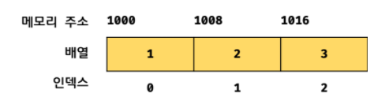
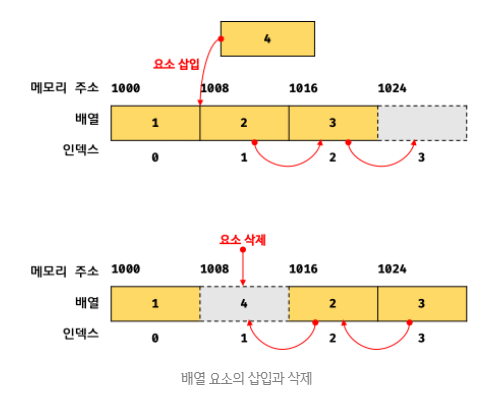
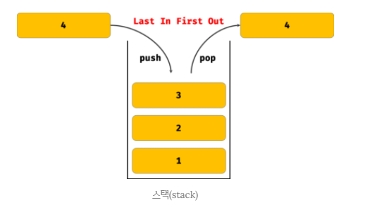
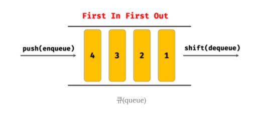
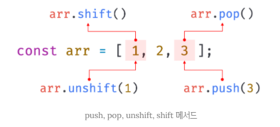
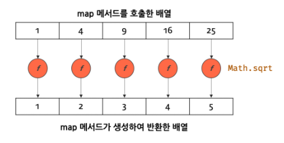
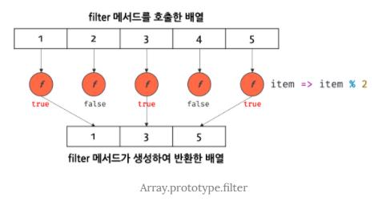
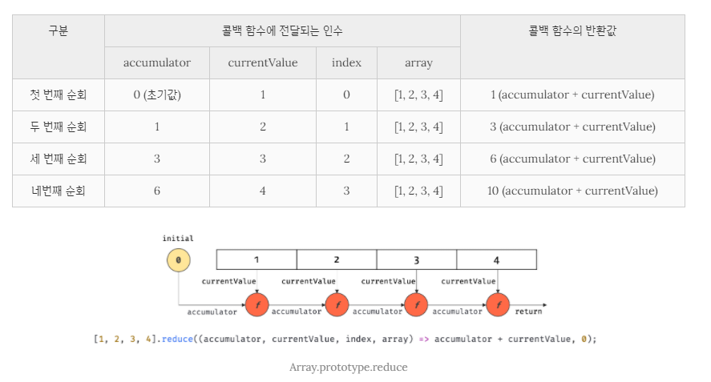
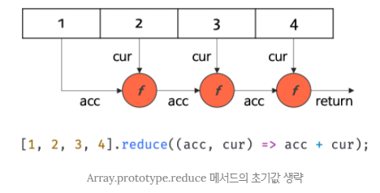

## JAVASCRIPT
<details open>
<summary>배열</summary>
<div markdown="27">

#### 배열(array)이란
- 배열은 `여러 개의 값`을 `순차적으로` 나열한 자료구조이다.
- 배열은 사용 빈도가 매우 높은 가장 기본적인 자료구조이다.

- 배열이 가지고 있는 값을 `요소(element)`라고 부른다.
- 자바스크립트의 모든 값은 배열의 요소가 될 수 있다.
- 즉, 원시값은 물론 객체, 함수, 배열 등 자바스크립트에서 값으로 인정하는 모든 것은 배열의 요소가 될 수 있다.
- 배열의 요소는 원시값보다 객체가 오는 경우가 더 많다. 
- 배열의 요소는 배열에서 자신의 위치를 나타내는 0 이상의 정수인 `인덱스(index)`를 갖는다.
- 인덱스는 배열의 요소에 접근할 때 사용한다.

- 요소에 접근할 때는 대괄호 표기법을 사용한다.
- 대괄호 내에는 접근하고 싶은 요소의 인덱스를 지정한다.

- 배열은 요소의 개수, 즉 배열의 길이는 나타내는 `length 프로퍼티`를 갖는다.
- `배열은 인덱스와 length 프로퍼티는 갖기 때문에 for문을 통해 순차적으로 요소에 접근할 수 있다.`

- 자바스크립트에 배열이라는 타입은 존재하지 않는다.
- `배열은 객체타입이다.`
```javascript
typeof arr; // object
```
- 배열은 `배열 리터럴`, `Array 생성자 함수`, `Array.of`, `Array.from` 메서드로 생성할 수 있다.
- 대부분의 경우 배열리터럴을 사용한다.
```javascript
const arr = [1, 2, 3];
arr.constructor === Array // true
Object.getPrototypeOf(arr) === Array.prototype // true
```

| 구분            |           객체            |     배열      |
| --------------- | :-----------------------: | :-----------: |
| 구조            | 프로퍼티 키와 프로퍼티 값 | 인덱스와 요소 |
| 값의 참조       |        프로퍼티 키        |    인덱스     |
| 값의 순서       |             X             |       O       |
| length 프로퍼티 |             X             |       O       |

- 일반객체와 배열을 구분하는 가장 명확한 차이는 `값의 순서`와 `length` 프로퍼티이다.
- 인덱스로 표현되는 `값의 순서`와 `length 프로퍼티`를 갖는 배열은 반복문을 통해 순차적으로 값에 접근하기 적합한 자료구조이다.
```javascript
// 배열의 순회
const arr = [1, 2, 3];
for (let i = 0; i < arr.length; i++) {
  console.log(arr[i]) // 1 2 3
}
```

#### 자바스크립트 배열은 배열이 아니다.
- `자료구조(data structure)에서 말하는 배열`은 `동일한 크기의 메모리 공간이 빈틈없이 연속적으로 나열된 자료구조`를 말한다.
- 즉, 배열의 요소는 `하나의 데이터 타입으로 통일`되어 있으며 `서로 연속적으로 인접`해 있다.
- 이러한 배열은 `밀집 배열(dense array)`이라 한다.
<br />


- 이처럼 일반적 의미의 배열은 각 요소가 동일한 데이터 크기를 가지며, 빈틈없이 연속적으로 이어져 있으므로 다음과 같이 인덱스를 통해 한 번의 연산으로 임의의 요소에 접근(임의 접근(random access), 시간 복잡도 O(1))할 수 있다.
- 이는 매우 효율적이며, 고속으로 동작한다.
- 일반적인 배열은 배열의 시작 주소만 알면 해당요소에는 아래와 같은 계산 방법으로 매우 빠르게 접근할 수 있다.
- `검색 대상 요소의 메모리 주소 = 배열의 시작 메모리 주소 + 인덱스 * 요소의 바이트 수`

- 이처럼 배열은 인덱스를 통해 효율적으로 요소의 접근할 수 있다는 장점이 있다.
- 하지만, 정렬되지 않은 배열에서 특정한 요소를 검색하는 경우 배열의 모든 요소를 처음부터 특정 요소를 발견할 때까지 차례대로 검색(선형 검색(linear search), 시간 복잡도 O(n))해야 한다.
```javascript
function linearSearch(arr, target) {
  const length = arr.length;

  for (let i = 0; i < length; i++) {
    if (arr[i] === target) return i;
  }

  return -1;
}

console.log(linearSearch([1, 2, 3], 3)); // 2
console.log(linearSearch([1, 2, 3], -1)); // -1
```
- 또한, 배열에 요소를 삽입하거나 삭제하는 경우 배열의 요소를 연속적으로 유지하기 위해 요소를 이동시켜야 하는 단점도 있다.
<br />


- 자바스크립트의 배열은 지금까지 살펴본 자료구조에서 말하는 일반적인 의미의 배열과 다르다.
- 즉, 배열의 요소를 위한 각각의 메모리 공간은 동일한 크기를 갖지 않아도 되며, 연속적으로 이어져 있지 않을 수도 있다.
- 배열의 요소가 연속적으로 이어져 있지 않은 배열을 `희소 배열(sparse array)`이라 한다.
- `자바스크립트의 배열은 일반적인 배열의 동작을 흉내 낸 특수한 객체이다.`
- 하지만, 동일한 타입의 요소가 오는 것이 정석이다.
```javascript
console.log(Object.getOwnPropertyDescriptors([1, 2, 3]));
/*
{
  '0': { value: 1, writable: true, enumerable: true, configurable: true },
  '1': { value: 2, writable: true, enumerable: true, configurable: true },
  '2': { value: 3, writable: true, enumerable: true, configurable: true },
  length: { value: 3, writable: true, enumerable: false, configurable: false }
}
*/
```
- 이처럼 자바스크립트 배열은 인덱스를 나타내는 문자열을 프로퍼티 키로 가지며, length 프로퍼티를 갖는 특수한 객체이다.
- 자바스크립트 배열의 요소는 사실 프로퍼티 값이다.
- 자바스크립트에서 사용할 수 있는 모든 값은 객체의 프로퍼티 값이 될 수 있으므로 어떤 타입의 값이라도 배열의 요소가 될 수 있다.
```javascript
const arr [
  'string',
  10,
  true,
  null,
  undefined,
  NaN,
  Infinity,
  [],
  {},
  function () {}
];
```
- `일반적인 배열과 자바스크립트 배열의 장단점`
- 일반적인 배열은 인덱스로 `요소에 빠르게 접근`할 수 있다. 
- 하지만 특정요소를 검색하거나 요소를 `삽입 또는 삭제하는 경우에는 효율적이지 않다.`

- 자바스크립트 배열은 해시 테이블로 구현된 객체이므로 인덱스 요소에 접근하는 경우 일반적인 배열보다 성능적인 면에서 느릴 수밖에 없는 구조적인 단점이 있다. 
- 하지만 `특정 요소를 삽입 또는 삭제하는 경우에는 일반적인 배열보다 빠른 성능`을 기대할 수 있다.
 
- 즉, 자바스크립트 배열은 인덱스로 접근하는 경우의 성능 대신 특정 요소를 탐색하거나 배열 요소를 삽입 또는 삭제하는 경우의 성능을 선택한 것이다.

- 인덱스로 배열 요소에 접근할 때 일반적인 배열보다 느릴 수밖에 없는 구조적인 단점을 보완하기 위해 대부분의 자바스크립트 엔진은 배열을 일반객체와 구별하여 좀 더 배열처럼 동작하도록 최적화하여 구현했다.
- 동일한 데이터 타입의 요소를 주면 모던 자바스크립트 엔진은 일반적인 배열(밀집 배열) 가깝게 최적화한다.
- 동일한 데이터 타입의 요소가 아니라면 동일한 데이터 타입을 만들었을 때와 비교했을 때 성능이 크게 차이난다.(여러 개의 배열을 생성했을 경우)
- 다음과 같이 일반객체의 성능을 테스트해 보면 배열이 일반객체보다 약 2배 정도 빠르다는 것을 알 수 있다.
```javascript
const arr = [];

console.time('Array Performance Test');

for (let i = 0; i < 10000000; i++) {
  arr[i] = i;
}

console.timeEnd('Array Performance Test');
// 210.510ms

const obj = {};
console.time('Object Performance Test');

for (let i = 0; i < 10000000; i++) {
  obj[i] = i;
}

console.timeEnd('Object Performance Test');
// 255.540ms
```
#### length 프로퍼티와 희소 배열
- length 프로퍼티는 요소의 개수, 즉 배열의 길이를 나타내는 0 이상의 정수를 값으로 갖는다.
- length 프로퍼티의 값은 0과 232 – 1(4,294,967,296 – 1) 미만의 양의 정수이다.
- 즉 배열은 요소를 최대 232 – 1(4,294,967,296 – 1)개 가질 수 있다.
- 따라서 배열에서 사용할 수 있는 가장 작은 인덱스는 0이며, 가장 큰 인덱스는 232 – 2(4,294,967,294)이다.

- length 프로퍼티의 값은 요소의 개수, 즉 배열의 길이를 바탕으로 결정되지만, 임의의 숫자 값을 명시적으로 할당할 수 있다.
- 현재 length 프로퍼티 값보다 작은 값을 할당하면 배열의 길이가 줄어든다.
```javascript
const arr = [1, 2, 3, 4, 5];
arr.length = 3;
console.log(arr); // [1, 2, 3]
```
- 주의할 것은 현재 length 프로퍼티 값보다 큰 숫자 값을 할당하는 경우다.
- 이때 length 프로퍼티 값은 변경되지만 실제로 배열의 길이가 늘어나지는 않는다.
```javascript
const arr = [1];
arr.length = 3;

console.log(arr.length); // 3
console.log(arr); // [ 1, <2 empty items> ]
```
- 위 예제 결과에서 <2 empty items>는 실제로 추가된 배열의 요소가 아니다.
- 즉, `arr[1]`과 `arr[2]`에는 값이 존재하지 않는다.
- `값 없이 비어 있는 요소를 위해 메모리 공간을 확보하지 않으며 빈 요소를 생성하지 않는다.`
```javascript
console.log(Object.getOwnPropertyDescriptors(arr));
/*
{
  '0': { value: 1, writable: true, enumerable: true, configurable: true },
  length: { value: 3, writable: true, enumerable: false, configurable: false }
}
*/
```
- 이처럼 `배열의 요소가 연속적으로 위치하지 않고 일부가 비어 있는 배열을 희소 배열`이라 한다.
- 자바스크립트는 희소 배열을 문법적으로 허용한다.
- 위 예제는 뒷부분만 비어 있어서 연속적으로 위치하는 것처럼 보일 수 있으나 중간이나 앞부분이 비어 있을 수도 있다.
```javascript
const sparse = [, 2, , 4];

console.log(sparse.length); // 4
console.log(sparse); // [ <1 empty item>, 2, <1 empty item>, 4 ]

console.log(Object.getOwnPropertyDescriptors(sparse));
/*
{
  '1': { value: 2, writable: true, enumerable: true, configurable: true },
  '3': { value: 4, writable: true, enumerable: true, configurable: true },
  length: { value: 4, writable: true, enumerable: false, configurable: false }
}
*/
```
```javascript
const arr = [1, , 3];

for (let i = 0; i < arr.length; i++) {
  console.log(arr[i]);
}

// 1 undefined 3
// 실제로 undefined가 들어있는 것이 아니라
// 없는 프로퍼티는 참조했기 때문에 undefined가 나온 것이다.
```
- `length는 read only로 사용하자.`
- length를 줄일 때는 배열 메서드를 사용하자.
- 일반적인 배열의 length는 배열 요소의 개수, 즉 배열의 길이와 언제나 일치한다.
- 하지만 `희소 배열은 length와 배열 요소의 개수가 일치하지 않는다.`
- `희소 배열의 length는 희소 배열의 실제 요소 개수보다 언제나 크다.`

- `희소 배열은 사용하지 않는 것이 좋다.`
- 희소 배열은 연속적인 값의 집합이라는 배열의 기본적인 개념과 맞지 않으며, 성능에도 좋지 않은 영향을 준다.
- 최적화가 잘 되어 있는 모던 자바스크립트 엔진은 요소의 타입이 일치하는 배열을 생성할 때 일반적인 의미의 배열처럼 연속된 메모리 공간을 확보하는 것으로 알려져 있다.

- `배열에는 같은 타입의 요소를 연속적으로 위치시키는 것이 최선이다.`

#### 배열 생성
1. `배열 리터럴`
- 가장 일반적이고 간편한 배열 생성 방식이다.
- 배열 리터럴은 0개 이상의 요소를 쉼표로 구분하여 대괄호(`[]`)로 묶는다.
- 배열 리터럴은 객체 리터럴과 달리 프로퍼티 키가 없고 값만 존재한다.
```javascript
const arr = [1, 2, 3];
```
```javascript
const arr = [1, , 3];

console.log(arr.length); // 3
console.log(arr); // [ 1, <1 empty item>, 3 ]
console.log(arr[1]); // undefined
```
- 위 예제의 arr은 인덱스 1인 요소를 갖지 않는 희소 배열이다.
- `arr[1]이 undefined인 이유는 객체인 arr에 프로퍼티 키가 ‘1’인 프로퍼티가 존재하지 않기 때문이다.`

2. `Array 생성자 함수`
- Array 생성자 함수는 전달된 인수의 개수에 따라 다르게 동작하므로 주의가 필요하다.

- 전달된 인수가 1개이고 숫자인 경우 length 프로퍼티 값이 인수인 배열을 생성한다.
```javascript
const arr = new Array(10);
// length가 10인 희소 배열 생성

console.log(arr); // [ <10 empty items> ]
console.log(arr.length); // 10
console.log(Object.getOwnPropertyDescriptors(arr));
/*
{
  length: { value: 10, writable: true, enumerable: false, configurable: false }
}
*/
```
- 이때 생성된 배열은 희소 배열이다. length 프로퍼티 값은 0이 아니지만 실제로 배열의 요소에는 존재하지 않는다.

- 배열은 요소를 최대 232-1(4,294,967,295)개 가질 수 있다.
- 따라서 Array 생성자 함수에 전달된 인수는 0 또는 232-1(4,294,967,295) 이하인 양의 정수이어야 한다.
- 전달된 인수가 범위를 벗어나면 RangeError가 발생한다.
```javascript
new Array(4294967295);
new Array(4294967296); // // RangeError: Invalid array length
new Array(-1); // RangeError: Invalid array length
```
- 전달된 인수가 없는 경우 빈 배열을 생성한다. 즉 배열 리터럴 `[]`과 같다.
```javascript
new Array(); // []
```
- 전달된 인수가 2개 이상이거나 숫자가 아닌 경우 인수를 요소로 갖는 배열을 생성한다.
```javascript
new Array(1, 2, 3); // [1, 2, 3]
new Array({}); // [{}]
```
- Array 생성자 함수는 new 연산자와 함께 호출하지 않더라도, 즉 일반함수로서 호출해도 배열을 생성하는 함수로 동작한다.
- 이는 Array 생성자 함수 내부에서 new.target을 확인하기 때문이다.
```javascript
Array(1, 2, 3); // [1, 2, 3]
```
- 따라서 Array 생성자 함수를 사용하여 배열을 생성하는 방법보다는 배열 리터럴로 배열을 생성하자.

3. `Array.of`
- ES6에서 도입된 Array.of 메서드는 전달된 인수를 요소로 갖는 배열을 생성한다.
- Array.of는 Array 생성자 함수와 다르게 전달된 인수가 1개이고 숫자이더라도 인수를 요소로 갖는 배열을 생성한다.
```javascript
Array.of(1); // [1]
Array.of(1, 2, 3); // [1, 2, 3]
Array.of(‘string’); // [‘string’]
```
- Array.of은 인수를 요소로 갖는 배열을 생성한다.
- Array.from은 인수로 유사배열 객체 또는 이터러블 객체를 받아서 배열로 변환하여 반환한다.

4. `Array.from`
- ES6에서 도입된 Array.from 메서드는 유사 배열 객체(array-like object) 또는 이터러블 객체(iterable object)를 인수로 전달받아 배열로 변환하여 반환한다.
```javascript
// 유사 배열 객체를 반환하여 배열을 생성한다.
Array.from({ length: 2, 0: 'a', 1: 'b' }); // ['a', 'b']

// 이터러블을 반환하여 배열을 생성한다. 문자열은 이터러블이다.
// 레퍼객체(문자열, 숫자, 불리언)는 유사배열 객체이기 때문에
// 배열을 만드는 2가지 방법이 있다.
Array.from('Hello'); // ['H', 'e', 'l', 'l', 'o']
[...'Hello']; // ['H', 'e', 'l', 'l', 'o']
```
- Array.from을 사용하면 두 번째 인수로 전달한 콜백함수를 통해 값을 만들면서 요소를 채울 수 있다.
- Array.from 메서드는 두 번째 인수로 전달한 콜백함수에 첫 번째 인수로 생성된 배열의 요소값과 인덱스를 순차적으로 전달하면서 호출하고, 콜백함수의 반환값으로 구성된 배열을 반환한다.
```javascript
// Array.from에 length만 존재하는 유사 배열 객체를 전달하면 undefined로 요소를 채운다.
// length 프로퍼티가 있으면 유사배열 객체 취급을 해준다.
Array.from({ length: 3 }); // [undefined, undefined, undefined]

console.log(Object.getOwnPropertyDescriptors(arr));
/*
{
  '0': {
    value: undefined,
    writable: true,
    enumerable: true,
    configurable: true
  },
  '1': {
    value: undefined,
    writable: true,
    enumerable: true,
    configurable: true
  },
  '2': {
    value: undefined,
    writable: true,
    enumerable: true,
    configurable: true
  },
  length: { value: 3, writable: true, enumerable: false, configurable: false }
}
*/

// Array.from은 두 번째 인수로 전달한 콜백함수의 반환값으로 구성된 배열을 반환한다.
Array.from({ length: 3 }, (_, i) => i); // [0, 1, 2]
```
##### 유사 배열 객체(array-like Object)와 이터러블 객체
- 유사 배열 객체는 마치 배열처럼 인덱스로 프로퍼티 값에 접근할 수도 있고 `length 프로퍼티`를 갖는 객체를 말한다.
- 유사 배열 객체는 마치 배열처럼 for 문으로 순회할 수도 있다. 
```javascript
const arrayLike = {
  '0' : 'apple',
  '1' : 'banana',
  '2' : 'orange',
  length: 3
};

for (let i = 0; i < arrayLike.length; i++) {
  console.log(arrayLike[i]); // apple banana orange
}
```
- `이터러블 객체(iterable object)`는 Symbol.iterable 메서드를 구현하여 for...of 문으로 순회할 수 있으며, `스프레드 문법과 배열 디스트럭처링 할당의 대상으로 사용할 수 있는 객체`를 말한다.
- ES6에서 제공하는 빌트인 이터러블은 `Array, String, Map, Set, DOM 컬렉션(NodeList, HTMLCollection), arguments 등`이 있다.

#### 배열 요소의 참조
- 배열의 요소를 참조할 때는 대괄호(`[]`) 표기법을 사용한다.
- 대괄호 안에는 인덱스가 와야한다.
- 정수로 평가되는 표현식이라면 인덱스 대신 사용할 수 있다.
- 인덱스는 값을 참조할 수 있다는 의미에서 객체의 프로퍼티 키와 같은 역할을 한다.

- 존재하지 않는 요소에 접근하면 undefined가 반환된다. 
```javascript
const arr = [1, 2];
console.log(arr[2]); // undefined
```
- 배열은 사실 인덱스를 나타내는 문자열을 프로퍼티 키로 갖는 객체이다.
- 따라서 존재하지 않는 프로퍼티 키로 객체의 프로퍼티에 접근했을 때 undefined를 반환하는 것처럼 배열도 존재하지 않는 요소를 참조하면 undefined를 반환한다.

- 같은 이유로 희소 배열에 존재하지 않는 요소를 참조해도 undefined가 반환된다.
```javascript
const arr = [1, , 3];
console.log(arr[1]); // undefined
```

#### 배열 요소의 추가와 갱신
- 객체에 프로퍼티를 동적으로 추가할 수 있는 것처럼 배열에도 요소를 동적으로 추가할 수 있다.
- 존재하지 않는 인덱스를 사용해 값을 할당하면 새로운 요소가 추가된다.
- 이때 length 프로퍼티 값은 자동 갱신된다.
- 만약 현재 배열의 length 프로퍼티 값보다 큰 인덱스로 새로운 배열을 추가하면 희소 배열이 된다.
```javascript
const arr = [0];

arr[1] = 1;
arr[100] = 100;

console.log(arr.length); // 101
console.log(arr); // [ 0, 1, <98 empty items>, 100 ]
```
- 이때 인덱스로 요소에 접근하여 `명시적으로 값을 할당하지 않은 요소는 생성되지 않는다는 것에 주의하자.`
```javascript
console.log(Object.getOwnPropertyDescriptors(arr));
/*
{
  '0': { value: 0, writable: true, enumerable: true, configurable: true },
  '1': { value: 1, writable: true, enumerable: true, configurable: true },
  '100': { value: 100, writable: true, enumerable: true, configurable: true },
  length: {
    value: 101,
    writable: true,
    enumerable: false,
    configurable: false
  }
}
*/
```
- 이미 요소가 존재하는 요소에 값을 재할당하면 요소값이 갱신된다.
```javascript
arr[1] = 10;
console.log(arr) // [ 0, 10, <98 empty items>, 100 ]
```
- 인덱스는 요소의 위치를 나타내므로 반드시 0 이상의 정수(또는 정수 형태의 문자열)을 사용해야 한다.
- 만약 정수 이외의 값을 인덱스처럼 사용하면 요소가 생성되는 것이 아니라 프로퍼티가 생성된다.
- 이때 추가된 프로퍼티는 `length 프로퍼티 값에 영향을 주지 않는다.`
```javascript
const arr = [];

arr[0] = 1;
arr['1'] = 2;

// 안티 패턴
arr['foo'] = 3;
arr.bar = 4;
arr[1.1] = 5;
arr[-1] = 6;

console.log(arr); // [ 1, 2, foo: 3, bar: 4, '1.1': 5, '-1': 6 ]
console.log(arr.length); // 2
console.log(arr[3]); // undefined
```

#### 배열 요소의 삭제
- 배열은 사실 객체이기 때문에 배열의 특정 요소를 삭제하기 위해 delete 연산자를 사용할 수 있다.
```javascript
const arr = [1, 2, 3];

delete arr[1];
console.log(arr); // [ 1, <1 empty item>, 3 ]

console.log(arr.length); // 3
```
- 이때 배열은 희소 배열이 되며 length 프로퍼티 값은 변하지 않는다.
- `따라서 희소 배열을 만드는 delete 연산자는 사용하지 않는 것이 좋다.`

- 희소 배열을 만들지 않으면서 배열의 특정 요소를 완전히 삭제하려면 `Array,prototype.splice 메서드`를 사용한다.
```javascript
const arr = [1, 2, 3];
arr.splice(1, 1);

console.log(arr); // [1, 3]
console.log(arr.length); // 2
```

#### 배열 메서드
- 자바스크립트는 배열을 다룰 때 유용하고 다양한 빌트인 메서드를 제공한다.
- Array 생성자 함수는 정적 메서드를 제공하며, 배열 객체의 프로토타입인 Array.prototype은 프로토타입 메서드를 제공한다.

- 배열 메서드는 결과물을 반환하는 패턴이 두 가지이므로 주의가 필요하다.
- `배열에는 원본 배열(배열 메서드를 호출한 배열, 즉 배열 메서드의 구현체 내부에서 this가 가리키는 객체)을 직접 변경하는 메서드(mutator method)`
- `원본 배열을 직접 변경하지 않고 새로운 배열을 생성하여 반환하는 메서드(accessor method)`

- ES5부터 도입된 배열 메서드는 대부분 원본 배열을 직접 변경하지 않지만 초창기 배열 메서드는 원본 배열을 직접 변경하는 경우가 많았다.
- 원본 배열을 직접 변경하는 메서드는 외부 상태를 직접 변경하는 부수효과가 있으므로 주의해야 한다.
- 성능은 mutator 메서드가 더 좋다. 하지만 accessor 메서드를 사용하자.(불변성을 유지하기 위해)
- 또, 객체를 불변객체로 쓰면 객체의 상태를 추적하지 않아도 되기 때문에 편리하다. 그러므로 accessor 메서드를 사용하자.
- `따라서 가급적 원본 배열을 직접 변경하지 않는 메서드(accessor method)를 사용하는 편이 좋다.`

##### Array.isArray
- typeof로 배열과 객체를 구별할 수 없다.
- 따라서 나온 메서드가 Array.isArray 메서드이다.

- Array.isArray는 Array 생성자 함수의 정적 메서드이다.
- Array.of와 Array.from도 Array 생성자 함수의 정적 메서드이다.

- Array.isArray 메서드는 전달된 인수가 배열이면 true, 배열이 아니면 false를 반환한다.
```javascript
// true
Array.isArray([]);
Array.isArray([1, 2, 3]);
Array.isArray(new Array());

// false
Array.isArray();
Array.isArray({});
Array.isArray(null);
Array.isArray(undefined);
Array.isArray(1);
Array.isArray('Array');
Array.isArray(true);
Array.isArray(false);
Array.isArray({ length: 3 });
Array.isArray({ 0: 1, length: 1 });
// 유사배열 객체는 배열이 아니다.
```

##### Array.prototype.indexOf
- indexOf 메서드는 원본 배열에서 인수로 전달된 요소를 검색하여 인덱스를 반환한다.

- 원본 배열에 인수로 전달한 요소가 중복되는 요소가 여러 개 있다면 첫 번째로 검색된 요소의 인덱스를 반환한다.
- 원본 배열에 인수로 전달한 요소가 존재하지 않으면 –1을 반환한다. 
```javascript
const arr = [1, 2, 2, 3];

arr.indexOf(2); // 1
arr.indexOf(4); // -1

// 두 번째 인수는 검색을 시작할 인덱스이다.
// 두 번째 인수를 생략하면 처음부터 검색한다.
arr.indexOf(2, 2); // 2
```
- indexOf 메서드는 배열의 특정 요소가 존재하는지 확인할 때 유용하다.
```javascript
const foods = ['apple', 'banana', 'orange'];

if (foods.indexOf('strawberry') === -1) {
  foods.push('strawberry');
}

console.log(foods); // [ 'apple', 'banana', 'orange', 'strawberry' ]
```
- indexOf 메서드 대신 ES7에서 도입된 Array.prototype.includes 메서드를 사용하면 가독성이 좋다.
```javascript
const foods = ['apple', 'banana', 'orange'];

if (!foods.includes('strawberry')) {
  foods.push('strawberry');
}

console.log(foods); // [ 'apple', 'banana', 'orange', 'strawberry' ]
```

##### Array.prototype.push
- push 메서드는 인수로 전달받은 모든 값을 원본 배열의 마지막 요소에 추가하고 `변경된 length 프로퍼티 값을 반환`한다.
- `push 메서드는 원본 배열을 직접 변경한다.(mutator method)`
```javascript
const arr = [1, 2];

let result = arr.push(3, 4);

// 변경된 length 프로퍼티 값을 반환한다.
console.log(result); // 4
console.log(arr); // [1, 2, 3, 4]
```
- `push 메서드는 성능 면에서 좋지 않다.`
- 마지막 요소로 추가할 요소가 하나뿐이라면 push 메서드를 사용하지 않고 length 프로퍼티를 사용하여 배열의 마지막 요소에 직접 추가할 수도 있다.
- 이 방법이 push 메서드보다 빠르다.
```javascript
const arr = [1, 2];

arr[arr.length] = 3;
console.log(arr); // [1, 2, 3]
```
- push 메서드는 원본 배열을 직접 변경하는 부수효과가 있다.
- 따라서 `push 메서드보다는 ES6의 스프레드 문법을 사용하는 편이 좋다.`
- 스프레드 문법을 사용하면 함수 호출 없이 표현식으로 마지막에 요소를 추가할 수 있으며 부수 효과도 없다.
```javascript
const arr = [1, 2];

const newArr = [...arr, 3];
console.log(newArr); // [1, 2, 3]
```
```javascript
const arr = [1, 2, 3];

console.time('Array Performance Test');
arr.push(4);
console.timeEnd('Array Performance Test'); // 0.066ms

const arr1 = [1, 2, 3];

console.time('Array Performance Test');
arr[arr1.length] = 4;
console.timeEnd('Array Performance Test'); // 0.005ms

const arr2 = [1, 2, 3];

console.time('Array Performance Test');
const newArr2 = [...arr, 4];
console.timeEnd('Array Performance Test'); // 0.007ms
```
##### Array.prototype.pop
- pop 메서드는 원본 배열에서 마지막 요소를 제거하고 `제거한 요소를 반환한다.`
- 원본 배열이 빈 배열이면 undefined를 반환한다.
- `pop 메서드는 원본 배열을 직접 변경한다.(mutator method)`
```javascript
const arr = [1, 2];

let result = arr.pop();
console.log(result); // 2

console.log(arr); // [1]
```
- pop 메서드와 push 메서드를 사용하면 스택을 쉽게 구현할 수 있다.
- `스택(stack)`은 데이터를 마지막에 밀어 넣고, 마지막에 밀어 넣은 데이터를 먼저 꺼내는 `후입 선출(LIFO – Last In First Out) 방식의 자료구조`이다.
- 스택은 언제나 가장 마지막에 밀어 넣은 최신 데이터를 먼저 취득한다.
- 스택에 데이터를 밀어 넣는 것을 푸시(push)라 하고 스택에서 데이터를 꺼내는 것을 팝(pop)이라고 한다.
<br />



- 스택을 생성자 함수로 구현해 보면 다음과 같다.
```javascript
const Stack = (function () {
  function Stack(array = []) {
    if(!Array.isArray(array)) {
      throw new TypeError(`${array} is not an array.`);
    }
    this.array = array;
  }

  Stack.prototype = {
    constructor: Stack,

    push(value) {
      return this.array.push(value);
    },

    pop() {
      return this.array.pop();
    },

    entries() {
      return [...this.array];
    }
  };

  return Stack;
})();

const stack = new Stack([1, 2]);

stack.push(3);
console.log(stack.entries()); // [1, 2, 3]

stack.pop();
console.log(stack.entries()); // [1, 2]
```
- 스택을 클래스로 구현해보면 다음과 같다.
```javascript
class Stack {
  #array;

  constructor(array = []) {
    if(!Array.isArray(array)) {
      throw new TypeError(`${array} is not an array`);
    }
    this.#array = array;
  }

  push(value) {
    return this.#array.push(value);
  }

  pop() {
    return this.#array.pop();
  }

  entries() {
    return [...this.#array];
    // 원본을 리턴하면 외부에서 private 클래스 필드를 변경할 위험이 있기 때문에 복사본을 리턴한다.
  }
}

const stack = new Stack([1, 2]);

stack.push(3);
console.log(stack.entries()); // [1, 2, 3]

stack.pop();
console.log(stack.entries()); // [1, 2]
```

##### Array.prototype.unshift
- unshift 메서드는 인수로 전달받은 모든 값을 원본 배열의 선두에 요소로 추가하고 `변경된 length 프로퍼티 값을 반환`한다.
- `unshift 메서드는 원본 배열을 직접 변경한다.(mutator method)`
```javascript
const arr = [1, 2];

let result = arr.unshift(3, 4);
console.log(result); // 4

console.log(arr); // [3, 4, 1, 2]
```
- unshift 메서드는 원본 배열을 직접 변경하는 부수효과가 있다.
- 따라서 `unshift 메서드 보다는 ES6 스프레드 문법을 사용하는 편이 좋다.`
- 스프레드 문법을 사용하면 함수 호출없이 표현식으로 선두에 요소를 추가할 수 있으며 부수효과도 없다.
```javascript
const arr = [1, 2];

const newArr = [3, ...arr];
console.log(newArr); // [3, 1, 2]
```

##### Array.prototype.shift
- shift 메서드는 원본 배열에서 첫 번째 요소를 제거하고 `제거한 요소를 반환`한다.
- 원본 배열이 빈 배열이면 undefined를 반환한다.
- `shift 메서드는 원본 배열을 직접 변경한다.(mutator method)`
```javascript
const arr = [1, 2];

let result = arr.shift();
console.log(result); // 1

console.log(arr); // [2]
```
- shift 메서드와 push 메서드를 사용하면 큐를 쉽게 구현할 수 있다.

- `큐(queue)`는 데이터를 마지막에 밀어 넣고, 처음 데이터, 즉 가장 먼저 밀어 넣은 데이터를 먼저 꺼내는 `선입 선출(FIFO – First In First Out)` 방식의 자료구조이다.
<br />



- 큐를 생성자 함수로 구현해 보면 다음과 같다.
```javascript
const Queue = (function () {
  function Queue(array = []) {
    if (!Array.isArray(array)) {
      throw new TypeError(`${array} is not an array`);
    }
    this.array = array;
  }

  Queue.prototype = {
    constructor: Queue,

    enqueue(value) {
      return this.array.push(value);
    },

    dequeue() {
      return this.array.shift();
    },

    entries() {
      return [...this.array];
    }
  };

  return Queue;
})();

const queue = new Queue([1, 2]);

queue.enqueue(3);
console.log(queue.entries()); // [1, 2, 3]

queue.dequeue();
console.log(queue.entries()); // [2, 3]
```
- 큐를 클래스로 구현해 보면 다음과 같다.
```javascript
class Queue {
  #array;
  constructor(array = []) {
    if(!Array.isArray(array)) {
      throw new TypeError(`${array} is not an array.`);
    }
    this.#array = array;
  }

  enqueue(value) {
    return this.#array.push(value);
  }

  dequeue() {
    return this.#array.shift();
  }

  entries() {
    return [...this.#array];
  }
}

const queue = new Queue([1, 2]);

queue.enqueue(3);
console.log(queue.entries()); // [1, 2, 3]

queue.dequeue();
console.log(queue.entries()); // [2, 3]
```

##### Array.prototype.concat
- concat 메서드는 인수로 전달된 값들(배열 또는 원시값)을 원본 배열의 마지막 요소로 추가한 `새로운 배열을 반환`한다.
- 인수로 전달한 값이 배열이 경우 `배열을 해체하여 새로운 배열의 요소로 추가한다.`
- `원본 배열은 변경되지 않는다.(accessor method)`
```javascript
const arr1 = [1, 2];
const arr2 = [3, 4];

let result = arr1.concat(arr2);
console.log(result); // [1, 2, 3, 4]

result = arr1.concat(3);
console.log(result); // [1, 2, 3]

result = arr1.concat(arr2, 5);
console.log(result); // [1, 2, 3, 4, 5]

console.log(arr1); // [1, 2]
```
- push와 unshift 메서드는 concat 메서드로 대체할 수 있다.
- push와 unshift 메서드는 concat과 유사하게 동작하지만 아래와 같이 미묘한 차이가 있다.

- push와 unshift 메서드는 원본 배열을 직접 변경하지만 concat 메서드는 원본 배열을 변경하지 않고 새로운 배열을 반환한다. 
```javascript
const arr1 = [1, 2];
const arr2 = [3, 4]

arr1.unshift(1, 2);
console.log(arr1); // [1, 2, 1, 2]

arr1.push(5, 6);
console.log(arr1); // [1, 2, 1, 2, 5, 6]

let result = [1, 2].concat(arr2); // [1, 2, 3, 4]
console.log(result);

result = result.concat(5, 6); // [1, 2, 3, 4, 5, 6]
console.log(result);
```
- 인수로 전달받은 값이 배열이면 push와 unshift 메서드는 배열을 그대로 원본 배열의 마지막/첫 번째 요소로 추가하지만 `concat 메서드는 인수로 전달받은 배열을 해체하여 새로운 배열의 마지막 요소로 추가한다.`
```javascript
const arr = [3, 4];

arr.unshift([1, 2]);
arr.push([5, 6]);
console.log(arr); // [[1, 2], 3, 4, [5, 6]]

let result = [1, 2].concat([3, 4]);
result = result.concat([5, 6]);

console.log(result); // [1, 2, 3, 4, 5, 6]
```
- `concat 메서드는 ES6의 스프레드 문법으로 대체할 수 있다.`
```javascript
const result = [...[1, 2], ...[3, 4]];
console.log(result); // [ 1, 2, 3, 4 ]
```
- 결론적으로 `push/unshift 메서드와 concat 메서드를 사용하는 대신 ES6의 스프레드 문법을 일관성 있게 사용하는 것을 권장한다.`

##### Array.prototype.splice
- push, pop, unshift, shift 메서드는 모두 원본 배열을 직접 변경하는 메서드(mutator method)이며 원본 배열의 처음이나 마지막에 요소를 추가하거나 제거한다.
<br />



- 원본 배열의 `중간에 요소를 추가하거나 중간에 있는 요소를 제거하는 경우 splice 메서드를 사용한다.`
- splice 메서드는 3개의 매개변수가 있으며 `원본 배열을 직접 변경한다.(mutator method)`

- `start: 원본 배열의 요소를 제거하기 시작할 인덱스`
- start만 지정하면 원본 배열의 start부터 모든 요소를 제거한다.
- start가 음수면 배열의 끝에서의 인덱스를 나타낸다.
- 만약 start가 –1이면 마지막 요소를 가리키고 –n이면 마지막에서 n번째 요소를 가리킨다.

- `deleteCount(옵션): 원본 배열의 요소를 제거하기 시작할 인덱스인 start부터 제거할 요소의 개수`
- deleteCount가 0인 경우 아무런 요소도 제거되지 않는다.

- `items(옵션): 제거한 위치에 삽입할 요소들의 목록`
- 생략할 경우 원본 배열에서 요소들을 제거하기만 한다.
```javascript
const arr = [1, 2, 3, 4];

const result = arr.splice(1, 2, 20, 30);

console.log(result); // [2, 3]
console.log(arr); // [1, 20, 30, 4]
```
- splice 메서드의 두 번째 인수, 즉 제거할 요소의 개수를 0으로 지정하면 아무런 요소도 제거하지 않고 새로운 요소들을 삽입한다.
```javascript
const arr = [1, 2, 3, 4];

const result = arr.splice(1, 0, 100);

console.log(result); // []
console.log(arr); // [1, 100 ,2, 3, 4]
```
- splice 메서드의 세 번째 인수, 즉 제거한 위치에 추가할 요소들의 목록을 전달하지 않으면 원본 배열에서 지정된 요소를 제거하기만 한다.
```javascript
const arr = [1, 2, 3, 4];

const result = arr.splice(1, 2);

console.log(result); // [2, 3]
console.log(arr); // [1, 4]
```
- splice 메서드에서 두 번째 인수, 즉 제거할 요소의 개수를 생략하면 첫 번째 인수로 전달된 시작 인덱스부터 모든 요소를 제거한다.
```javascript
const arr = [1, 2, 3, 4];

const result = arr.splice(1);

console.log(result); // [2, 3, 4]
console.log(arr); // [1]
```
- 배열에서 특정 요소를 제거하려면 indexOf 메서드를 통해 특정 요소의 인덱스를 취득한 다음 splice 메서드를 사용한다.
```javascript
const arr = [1, 2, 3, 1, 2];

function remove(arr, item) {
  const index = arr.indexOf(item);

  if (index !== -1) arr.splice(index, 1);

  return arr;
}

console.log(remove(arr, 2)); // [1, 3, 1, 2]
console.log(remove(arr, 10)); // [1, 3, 1, 2]
```
- filter 메서드를 사용하여 특정 요소를 제거할 수도 있다.
- 하지만 특정 요소가 중복된 경우 모두 제거한다.
```javascript
const arr = [1, 2, 3, 1, 2];

function removeAll(arr, item) {
  return arr.filter(v => v !== item);
}

console.log(removeAll(arr, 2)); // [1, 3, 1]
console.log(removeAll(arr, 10)); // [1, 2, 3, 1, 2]
```

##### Array.prototype.slice
- slice 메서드는 인수로 전달된 범위의 요소들을 복사하여 배열로 반환한다.
- `원본 배열은 변경되지 않는다.(accessor method)`

- slice 메서드는 두 개의 매개변수를 갖는다.

- `start: 복사를 시작할 인덱스`
- 음수면 배열의 끝에서의 인덱스를 나타낸다.
- 예를 들어 slice(-2)는 배열의 마지막 두 개의 요소를 복사하여 배열로 반환한다.

- `end: 복사를 종료한 인덱스`
- 이 `인덱스에 해당하는 요소는 복사되지 않는다.`
- end는 생략 가능하며 생략 시 기본값은 length 프로퍼티 값이다.
```javascript
const arr = [1, 2, 3];

arr.slice(0, 1); // [1]
arr.slice(1, 2); // [2]

console.log(arr); // [1, 2, 3]
```
- slice 메서드는 첫 번째 인수(start)로 전달받은 인덱스부터 두 번째 인수(end)로 전달받은 `인덱스 이전(end 미포함)`까지 요소들을 복사하여 배열로 반환한다.

- slice 메서드의 두 번째 인수(end)를 생략하면 첫 번째 인수(start)로 전달받은 인덱스부터 모든 요소를 복사하여 배열로 반환한다.
```javascript
const arr = [1, 2, 3];

arr.slice(1); // [2, 3]
```
- slice 메서드의 첫 번째 인수가 음수인 경우 배열의 끝에서부터 요소를 복사하여 배열로 반환한다.
```javascript
const arr = [1, 2, 3];

arr.slice(-1); // [3]
arr.slice(-2); // [2, 3]
```
- `slice 메서드의 인수를 모두 생략하면 원본 배열의 복사본을 생성하여 반환한다.`
```javascript
const arr = [1, 2, 3];

const copy1 = arr.slice();
const copy2 = [...arr]; // slice 메서드보다 좋은 방법

console.log(copy1); // [1, 2, 3]
console.log(copy2); // [1, 2, 3]

console.log(copy1 === arr); // false
console.log(copy2 === arr); // false
// 참조값이 다르기 때문에 false
// 기본적으로 빌트인으로 복사기능을 제공하는 메서드는 모두 얕은 복사이다.
```
- 이때 생성된 복사본은 얕은 복사(shallow copy)를 통해 복사한다.
```javascript
const todos = [
  { id: 1, content: 'HTML', completed: false },
  { id: 2, content: 'CSS', completed: true },
  { id: 3, content: 'Javascript', completed: false }
];
// 자바스크립트 배열은 일반적으로 밀집배열이 아닐 확률이 높다.
// 하지만, 요소에는 객체의 참조값이 들어가 있으니 밀집배열이라고 생각할 수도 있다.

const _todos = todos.slice();

console.log(todos === _todos); // false
console.log(todos[0] === _todos[0]); // true
```

##### 얕은 복사(shallow copy)와 깊은 복사(deep copy)
- 객체를 프로퍼티 값으로 갖는 객체의 경우 얕은 복사는 한 단계까지만 복사하는 것을 말하고, 깊은 복사는 객체에 중첩된 객체까지 모두 복사하는 것을 말한다.
- `slice 메서드, 스프레드 문법, Object.assign 메서드는 모두 얕은 복사를 수행한다.`
- 깊은 복사를 위해서는 Lodash 라이브러리의 cloneDeep 메서드를 사용하는 것을 추천한다.

- slice 메서드가 복사본을 생성하는 것을 이용하여 arguments, HTMLCollection, NodeList와 같은 유사 배열 객체를 배열로 변환할 수 있다.
```javascript
function sum() {
  var arr = Array.prototype.slice.call(arguments);
  console.log(arr); // [1, 2, 3]

  return arr.reduce(function (pre, cur) {
    return pre + cur;
  }, 0);
}

console.log(sum(1, 2, 3)); // 6
```
- Array.from 메서드를 사용하면 더욱 간단하게 유사 배열 객체를 변환할 수 있다.
- Array.from 메서드는 유사 배열 객체 또는 이터러블 객체를 배열로 변환한다.
```javascript
function sum() {
  const arr = Array.from(arguments);
  console.log(arr); // [1, 2, 3]

  return arr.reduce((pre, cur) => pre + cur, 0);
}

console.log(sum(1, 2, 3)); // 6
```
- `arguments 객체는 유사 배열 객체이면서 이터러블 객체이다.`
- `이터러블 객체는 ES6의 스프레드 문법을 사용하여 간단하게 배열로 변환할 수 있다.`
```javascript
function sum() {
  const arr = [...arguments];
  console.log(arr); // [1, 2, 3]

  return arr.reduce((pre, cur) => pre + cur, 0);
}

console.log(sum(1, 2, 3)); // 6
```
##### Array.prototype.join
- join 메서드는 원본 배열의 모든 요소를 문자열로 변환한 후, 인수로 전달받은 문자열, 즉 구분자(separator)로 연결한 문자열을 반환한다.
- 구분자는 생략 가능하며 기본 구분자는 콤마(,)이다.
```javascript
const arr = [1, 2, 3, 4];

arr.join(); // '1,2,3,4'
arr.join(''); // '1234'
arr.join(':'); // '1:2:3:4'
```
- join 메서드의 반대(다시 배열로 만드는)는 `Array.from` 또는 `[...스프레드 문법]`
##### Array.prototype.reverse
- reverse 메서드는 원본 배열의 순서를 반대로 뒤집는다.
- 이때 `원본 배열이 변경된다.(mutator method)`
- 반환값은 변경된 배열이다.
```javascript
const arr = [1, 2, 3];
const result = arr.reverse();

console.log(result); // [3, 2, 1]
console.log(arr); // [3, 2, 1]
```

##### Array.prototype.fill
- ES6에서 도입된 fill 메서드는 인수로 전달받은 값을 배열의 처음부터 끝까지 요소로 채운다.
- `이때 원본 배열이 변경된다.(mutator method)`
```javascript
const arr = [1, 2, 3];

arr.fill(0);

console.log(arr); // [0, 0, 0]
```

- 두 번째 인수로 요소 채우기를 시작할 인덱스를 전달할 수 있다.
```javascript
const arr = [1, 2, 3];

arr.fill(0, 1);

console.log(arr); // [1, 0, 0]
```
- 세 번째 인수로 요소 채우기를 멈출 인덱스를 전달할 수 있다.
```javascript
const arr = [1, 2, 3, 4, 5];

// 배열의 인덱스 1부터 3이전(인덱스 3 미포함)까지 요소로 채운다.
arr.fill(0, 1, 3);

console.log(arr); // [1, 0, 0, 4, 5]
```
- fill 메서드를 사용하면 배열을 생성하면서 특정 값으로 요소를 채울 수 있다.
```javascript
const arr = new Array(3);
console.log(arr); // [ <3 empty items> ]

const result = arr.fill(1);
console.log(result); // [1, 1, 1]

console.log(arr); // [1, 1, 1]
```
```javascript
const arr1 = Array.from({ length: 3 }).fill(1);
console.log(arr1); // [1, 1, 1]

const arr2 = Array.from(new Array(3)).fill(2);
console.log(arr2); // [2, 2, 2]

const arr3 = Array.from([1, 2]).fill(3);
console.log(arr3); // [3, 3]
```
```javascript
const arr = [].fill.call({ length: 3 }, 4);
console.log(arr); // { '0': 4, '1': 4, '2': 4, length: 3 }
```
```javascript
const arr = Array(3).fill({});
console.log(arr); // [ {}, {}, {} ]

arr[0].hi = 'hi';
console.log(arr); // [ { hi: 'hi' }, { hi: 'hi' }, { hi: 'hi' } ]

arr[1].bye = 'bye';
console.log(arr);
/*
[
  { hi: 'hi', bye: 'bye' },
  { hi: 'hi', bye: 'bye' },
  { hi: 'hi', bye: 'bye' }
]
*/
```
- arr 배열에는 fill 메서드의 인수로 전달할 당시의 생성된 하나의 배열에 대한 참조값이 담겨있다.
- 즉, 이 `배열의 3개의 요소는 모두 하나의 객체를 가리키기 때문에`, 그 중 하나에 접근하여 내용을 변경하면 결국 3개의 요소 모두 바뀐 내용의 객체를 가리키게 된다.
- fill 메서드는 한 번만 호출되기 때문에 모든 참조값이 같다.

```javascript
const arr = Array.from({ length: 3 }, () => ({}));
// 각각의 요소마다 콜백함수를 실행해서 객체의 참조값이 다름
console.log(arr); // [ {}, {}, {} ]

arr[0].hi = 'hi';
console.log(arr); // [ { hi: 'hi' }, {}, {} ]

arr[1].bye = 'bye';
console.log(arr); // [ { hi: 'hi' }, { bye: 'bye' }, {} ]
```

- fill 메서드로 요소를 채우면 모든 요소를 하나의 값만으로 채울 수밖에 없다는 단점이 있다.
- 하지만 Array.from 메서드를 사용하면 두 번째 인수로 전달한 콜백함수를 통해 요소값을 만들면서 배열을 채울 수 있다.
```javascript
const sequences = (length = 0) => Array.from({ length }, (_, i) => i);

console.log(sequences(3)); // [0, 1, 2]
```

##### Array.prototype.includes
- ES7에서 도입된 includes 메서드는 배열 내에 특정 요소가 포함되어 있는지 확인하여 true 또는 false를 반환한다.
- 첫 번째 인수로 검색할 대상을 지정한다.
```javascript
const arr = [1, 2, 3];

arr.includes(2); // true
arr.includes(100); // false
```
- 두 번째 인수로 검색을 시작할 인덱스를 전달할 수 있다.
- 두 번째 인수를 생략할 경우 기본값 0이 설정된다.
- 만약 두 번째 인수에 음수를 전달하면 length 프로퍼티 값과 음수 인덱스를 합산하여(`length + index`) 검색 시작 인덱스를 설정한다.
```javascript
const arr = [1, 2, 3];

arr.includes(1, 1); // false

// 인덱스 2(arr.length - 1)부터 확인한다.
arr.includes(3, -1); // true
```
- indexOf 메서드를 사용하면 반환값이 –1인지 확인해 보아야하고 배열에 NaN가 포함되어 있는지 확인할 수 없다는 문제가 있다.
```javascript
[NaN].indexOf(NaN) === -1; // true
[NaN].includes(NaN); // true
```
##### Array.prototype.flat
- ES10(ECMAScript 2019)에서 도입된 flat 메서드는 인수로 전달한 깊이만큼 재귀적으로 배열을 평탄화한다.
```javascript
[1, [2, 3, 4, 5]].flat(); // [1, 2, 3, 4, 5]
```
- 중첩 배열을 평탄화할 깊이를 인수로 전달할 수 있다.
- 인수를 생략할 경우 기본값은 1이다.
- 인수로 Infinity를 전달하면 중첩 배열 모두를 평탄화한다.
```javascript
[1, [2, [3, [4]]]].flat(); // [1, 2, [3, [4]]]
[1, [2, [3, [4]]]].flat(1); // [1, 2, [3, [4]]]

[1, 2, [3, [4]]].flat(2); // [1, 2, 3, 4]
[1, 2, [3, [4]]].flat().flat(); // [1, 2, 3, 4]

[1, 2, [3, [4]]].flat(Infinity); // [1, 2, 3, 4]
```
- flat 메서드는 배열의 구멍도 제거한다.
```javascript
const arr = [1, 2, , 4, 5];
console.log(arr); // [ 1, 2, <1 empty item>, 4, 5 ]

console.log(arr.flat()); // [ 1, 2, 4, 5 ]

// 원본은 변경되지 않음
console.log(arr); // [ 1, 2, <1 empty item>, 4, 5 ]
```

<details open>
<summary>배열 고차함수</summary>
<div markdown="27">

#### 배열 고차함수(Higher-Order Function, HOF)
- `고차함수`: `함수를 인수로 전달받거나 함수를 반환하는 함수`
- 자바스크립트의 함수는 일급객체이므로 함수를 값처럼 인수로 전달할 수 있으며 반환할 수도 있다.
- 고차함수는 외부 상태의 변경이나 가변(mutable) 데이터를 피하고 불변성(immutability)을 지향하는 함수형 프로그래밍에 기반을 두고 있다.

- `함수형 프로그래밍`은 순수함수(pure function)와 보조함수의 조합을 통해 로직 내에 존재하는 `조건문과 반복문을 제거`하여 복잡성을 해결하고 `변수의 사용을 억제`하여 상태변경을 피하려는 프로그래밍 패러다임이다.
- 조건문이나 반복문은 로직의 흐름을 이해하기 어렵게 하여 가독성을 해치고, 변수는 누군가에 의해 얼마든지 변경될 수 있어 오류 발생의 근본적 원인이 될 수 있기 때문이다.

- `함수형 프로그래밍`은 결국 `순수함수를 통해 부수효과를 최대한 억제`하여 오류를 피하고 프로그램의 안정성을 높이려는 노력의 일환이라고 할 수 있다.

- 자바스크립트는 고차함수를 다수 지원한다.

#### Array.prototype.sort
- sort 메서드는 배열의 요소를 정렬한다.
- 원본 배열을 직접 변경하며 `정렬된 배열을 반환한다.`(mutator method)
- 따라서 메서드 체이닝을 사용할 수 있다.

- sort 메서드는 기본적으로 오름차순으로 요소를 정렬한다.
- 한글 문자열인 요소도 오름차순으로 정렬된다.
- 내림차순으로 요소를 정렬하려면 sort 메서드를 사용하여 오름차순으로 정렬한 후 reverse 메서드를 사용하여 요소의 순서를 뒤집는다.
- reverse 메서드도 mutator method이기 때문에 메서드 체이닝을 할 수 있다.

- `문자열 요소로 이루어진 배열의 정렬에는 아무런 문제가 없다.`
- 하지만 숫자 요소로 이루어진 배열을 정렬할 때는 주의가 필요하다.
```javascript
const arr = [1, 10, 2];
arr.sort();

console.log(arr); // [1, 10, 2]
```
- `sort 메서드의 기본 정렬순서는 유니코드 코드 포인터의 순서를 따른다.`
- 모든 문자가 유니코드 코드 포인터 순서를 따르기 때문에 모든 나라 언어가 정렬 가능하다.
- 배열의 요소가 숫자 타입이라 할지라도 `배열의 요소를 일시적으로 문자열로 변환한 후 유니코드 코드 포인터의 순서를 기준으로 정렬`한다.

- 예를 들어, 문자열 ‘1’의 유니코드 코드 포인터는 U+0031, 문자열 ‘2’의 유니코드 코드 포인터는 U+0032, 문자열 ‘10’의 유니코드 코드 포인터는 U+0031U+0030이다.
- 따라서 위 예제를 정렬하면 [‘1’, ‘10’. ‘2’]로 정렬된다.

- 폴더에 번호를 매길 때, 순서 정렬을 시키면 1 다음에 10이 나온다.
- 따라서 01, 02, 03 ... 등으로 순서를 매긴다.
- OS의 정렬도 자바스크립트의 sort 메서드처럼 정렬한다. 
```javascript
[1, 10, 2].sort(); // [1, 10, 2]
['1', '10', '2'].sort(); // ['1', '10', '2']
```
- 따라서 숫자 요소를 정렬할 때는 sort 메서드에 `정렬순서를 정의하는 비교함수를 인수로 전달`해야 한다.
- `비교함수는 양수나 음수 또는 0을 반환해야 한다.`
- `비교함수의 반환값이 0보다 작으면 비교함수의 첫 번째 인수를 우선하여 정렬`
- 0이면 정렬하지 않음(0인 경우의 정렬방식은 ECMAScript 사양에 명시되어 있지 않다. 따라서 자바스크립트 엔진마다 동작이 다를 수 있다.)
- `0보다 크면 두 번째 인수를 우선하여 정렬한다.`
```javascript
const arr = [1, 20, 10, 2];
arr.sort((a, b) => a - b);
// 2개의 인수를 뺐을 때, 양수이면 SWAP, 음수, 0이면 바꾸지 않고 그대로 둔다.
console.log(arr); // [1, 2, 10, 20]

arr.sort((a, b) => b - a);
console.log(arr); // [ 20, 10, 2, 1 ]
```
```javascript
arr.sort((a, b) => a - b); // sort 메서드가 a, b 인수를 주면서 화살표 함수를 호출한다.

function foo(a, b) {}
foo(1, 2); // foo 함수를 호출할 때 인수 1, 2를 전달한다.
```

- 객체를 요소로 갖는 배열을 정렬하는 예제는 다음과 같다.
```javascript
const todos = [
  { id: 4, content: 'Javascript' },
  { id: 1, content: 'HTML' },
  { id: 2, content: 'CSS' }
];

function compare(key) {
  return (a, b) => (a[key] > b[key] ? 1 : (a[key] < b[key] ? -1 : 0));
}
// 숫자는 빼서 비교하는 것이 가능하지만, 문자열이 왔을 때는 대소비교를 해야한다.
// (a, b) => (a[key] > b[key] ? 100 : (a[key] < b[key] ? -100 : 0)
// 1, -1 대신 양수, 음수이면 모두 다 된다.

todos.sort(compare('id'));
console.log(todos);
/*
[
  { id: 1, content: 'HTML' },
  { id: 2, content: 'CSS' },
  { id: 4, content: 'Javascript' }
]
*/

todos.sort(compare('content'));
console.log(todos);
/*
[
  { id: 2, content: 'CSS' },
  { id: 1, content: 'HTML' },
  { id: 4, content: 'Javascript' }
]
*/
```
```javascript
const todos = [
  { id: 4, content: 'Javascript' },
  { id: 1, content: 'HTML' },
  { id: 2, content: 'CSS' }
];

// 클로저
// sort 메서드는 함수식(및 클로저)와 함께 편리하게 사용할 수 있다.
function compare(key) {
  return function (a, b) {
    return a[key] > b[key] ? 1 : (a[key] < b[key] ? -1 : 0);
  };
}

todos.sort(compare('id'));
console.log(todos);

todos.sort(compare('content'));
console.log(todos);
```
##### sort 메서드의 정렬 알고리즘
- sort 메서드는 quicksort 알고리즘을 사용했었다.
- quicksort 알고리즘은 동일한 값의 요소가 중복되어 있을 때 초기 순서와 변경될 수 있는 불안정한 알고리즘으로 알려져 있다.
- ECMAScript 2019(ES10)에서는 `timesort 알고리즘을 사용하도록 바뀌었다.`

#### Array.prototype.forEach
- 조건문이나 반복문은 로직의 흐름을 이해하기 어렵게 한다.
- 특히 for문은 반복을 위한 변수를 선언해야 하며, 조건식과 증감식으로 이루어져 있어서 함수형 프로그래밍이 추구하는 바와 맞지 않는다.

- `forEach 메서드는 자신의 내부에서 반복문을 실행한다.`
- 즉, forEach 메서드는 반복문을 추상화한 고차함수로써 내부에서 반복문을 통해 자신을 호출한 배열을 순회하면서 수행해야 할 처리를 콜백함수로 전달받아 반복 호출한다.
- `forEach 메서드는 map, filter, reduce 등으로 해결이 안되면 마지막 수단으로 사용하자.`
- `인수의 네이밍이 중요하다. (item, v 말고 명확한 이름으로 네이밍하자!)`
```javascript
const arr = [1, 2, 3];
let pows = [];

arr.forEach(v => pows.push(v ** 2));
console.log(pows); // [1, 4, 9]
```
- 위 예제의 경우 forEach 메서드는 arr 배열의 모든 요소를 순회하면서 콜백함수를 반복 호출한다.
- 이때 `콜백함수를 호출하는 forEach 메서드`는 콜백함수에 인수를 전달할 수 있다.

- `arr.forEach(callback(currentvalue[, index[, array]])[, thisArg])`
- callback: 각 요소에 대해 실행할 함수, 다음 3가지 인수를 가진다.
	- currentValue: 처리할 현재 요소
	- index(옵션): 처리할 현재 요소의 인덱스
	- array(옵션): forEach()를 호출한 배열
- thisArg(옵션): callback을 실행할 때 this로 사용할 값
- `반환값: undefined`

```javascript
[1, 2, 3].forEach((v, i, arr) => {
  console.log(`요소값: ${v}, 인덱스: ${i}, this: ${JSON.stringify(arr)}`);
});
/*
요소값: 1, 인덱스: 0, this: [1,2,3]
요소값: 2, 인덱스: 1, this: [1,2,3]
요소값: 3, 인덱스: 2, this: [1,2,3]
*/
```
##### JSON.stringify 메서드
- JSON.stringify 메서드는 `객체를 JSON 포맷의 문자열로 변환`한다.
- 위 예제에서는 객체인 arr 배열을 문자열로 출력하기 위해 사용했다.

- forEach 메서드는 원본배열을 변경하지 않는다.
- 하지만 콜백함수를 통해 원본배열을 변경할 수는 있다.
```javascript
const arr = [1, 2, 3];

arr.forEach((v, i, arr) => { arr[i] = v ** 2; });
console.log(arr); // [1, 4, 9]
```
- `forEach 메서드의 반환값은 언제나 undefined이다.`
```javascript
const result = [1, 2, 3].forEach(console.log);
console.log(result);
/*
1 0 [ 1, 2, 3 ]
2 1 [ 1, 2, 3 ]
3 2 [ 1, 2, 3 ]
undefined
*/
```
- forEach 메서드의 두 번째 인수로 forEach 메서드의 콜백함수 내부에서 this로 사용할 객체를 전달할 수 있다.
```javascript
class Numbers {
  numberArray = [];

  multiply(arr) {
    arr.forEach(function (v) {
      // TypeError: Cannot read property 'numberArray' of undefined
      this.numberArray.push(v * v);
    });
  }
}

const numbers =  new Numbers();
numbers.multiply([1, 2, 3]);
console.log(numbers.numberArray); // [1, 4, 9]
```
```javascript
class Numbers {
  numberArray = [];

  multiply(arr) {
    arr.forEach(function (v) {
      this.numberArray.push(v * v);
    }, this);
  }
}

const numbers =  new Numbers();
numbers.multiply([1, 2, 3]);
console.log(numbers.numberArray); // [1, 4, 9]
```
- `더 나은 방법은 ES6의 화살표 함수를 사용하는 것이다.`
- 화살표 함수 내부에서 this를 참조하면 상위스코프, 즉 multiply 메서드 내부의 this를 그대로 참조한다.
```javascript
class Numbers {
  numberArray = [];

  multiply(arr) {
    arr.forEach(v => this.numberArray.push(v * v));
  }
}

const numbers =  new Numbers();
numbers.multiply([1, 2, 3]);
console.log(numbers.numberArray); // [1, 4, 9]
```
- forEach 메서드의 동작을 이해하기 위해 forEach 메서드의 폴리필을 살펴보자.
- `폴리필(pollyfill): 최신 사양을 지원하지 않는 브라우저를 위해 누락된 최신 사양의 기능을 구현하여 추가하는 것을 폴리필이라 한다.`
```javascript
[1].forEach(1); // TypeError: 1 is not a function
```
```javascript
if(!Array.prototype.forEach) {
  Array.prototype.forEach = function (callback, thisArg) {
    if (typeof callback !== 'function') {
      throw new TypeError(callback + ' is not a function');
    }

    thisArg = thisArg || window;

    for (var i = 0; i < this.length; i++) {
      callback.call(thisArg, this[i], i, this);
    }
  };
}
```
- 이처럼 forEach 메서드도 내부에서는 반복문(for 문)을 통해 배열을 순회할 수밖에 없다.
- 단, 반복문을 메서드 내부로 은닉하여 로직의 흐름을 이해하기 쉽게하고 복잡성을 해결한다.(가독성이 좋고, 라인수도 줄어든다.)

- `forEach 메서드는 for문과 달리 break, continue 문을 사용할 수 없다.`
- 다시말해, 배열의 모든 요소를 빠짐없이 모두 순회하며 중간에 순회를 중단할 수 없다.
- forEach 메서드는 하나씩 전체를 순회하는데 목적이 있다.(for문처럼 2칸씩 건너뛰는 일은 없다.)
- forEach 메서드에서 사용할 수 없는 break, continue는 `for...of문을 사용하면 break, continue를 사용할 수 있다.`
```javascript
[1, 2, 3].forEach(v => {
  console.log(v);
  if(v > 1) break; // SyntaxError: Illegal break statement
});

[1, 2, 3].forEach(v => {
  console.log(v);
  if(v > 1) continue;
  // SyntaxError: Illegal continue statement: no surrounding iteration statement
});
```
- forEach 메서드의 콜백함수 내에서 사용한 `반환문은 아무런 의미가 없다.`
- forEach 메서드는 배열의 모든 요소를 빠짐없이 모두 순회하며 언제나 undefined를 반환한다.
- 따라서 forEach는 무엇을 리턴하는지가 중요한 것이 아니라 무엇을 하는지가 중요하다.
```javascript
const res = [1, 2, 3].forEach(v => {
  console.log(v); // 1 2 3
  if (v === 2) return v;
});

console.log(res); // undefined
```
- 희소배열의 경우 존재하지 않는 요소는 순회대상에서 제외된다.
- `희소배열에서 없는 요소는 순회하지 않는다.`
- 이는 배열을 순회하는 map, filter, reduce 메서드 등에서도 마찬가지이다.
```javascript
// 희소배열
const arr = [1, , 3];

for (let i = 0; i < arr.length; i++) {
  console.log(arr[i]); // 1 undefined 3
}

arr.forEach(v => console.log(v)); // 1, 3
```
- 배열의 요소가 많을 때는 forEach 메서드보다 for 문을 쓰는 것이 빠르지만, 요소가 많은 배열을 만들지 말자.(배열을 쪼개자)
- 배열의 요소가 작을 때는 forEach 메서드와 for문 성능은 거의 차이없다.
- 따라서 forEach 메서드는 알고리즘(성능, 메모리 사용량을 중시)을 할 때 사용하자.

- forEach 메서드는 for 문에 비해 성능은 좋지 않지만, 가독성은 더 좋다.
- 따라서 요소가 대단히 많은 배열을 순회하거나 시간이 오래 걸리는 복잡한 코드 또는 높은 성능이 필요한 경우가 아니라면 for 문대신 forEach 메서드를 사용할 것을 권장한다.

#### Array.prototype.map
- map 메서드는 자신을 호출한 배열의 모든 요소를 순회하면서 인수로 전달받은 콜백함수를 반복호출한다.
- 그리고 `콜백함수의 반환값들로 구성된 새로운 배열을 반환한다.`
- 이때 `원본배열은 변경되지 않는다.(accessor method)`
```javascript
const arr = [1, 4, 9];

const roots = arr.map(Math.sqrt);
// map의 첫 번째 인수는 콜백함수이고, map이 Math.sqrt를 호출한다.
// Math.sqrt는 1개의 인수만 받는 함수이기 때문에 위 코드가 가능하다.

// 위 코드는 다음과 같다.
// const roots = arr.map(v => Math.sqrt(v));

console.log(roots); // [1, 2, 3]
console.log(arr); // [1, 4, 9]

[1, 4, 9].forEach(console.log);
/*
1 0 [ 1, 4, 9 ]
4 1 [ 1, 4, 9 ]
9 2 [ 1, 4, 9 ]
*/
```
- forEach 메서드와 map 메서드의 공통점: 자신을 호출한 배열의 모든 요소를 순회하면서 인수로 전달받은 `콜백함수를 반복호출한다.`
- forEach 메서드는 언제난 undefined를 반환하고, map 메서드는 콜백함수의 반환값들로 구성된 새로운 배열을 반환하는 차이가 있다.
- 즉, forEach 메서드는 단순히 반복문을 대체하기 위한 고차함수이고, map 메서드는 요소값을 다른 값으로 매핑(mapping)한 새로운 배열을 생성하기 위한 고차함수이다.

- `map 메서드가 생성하여 반환하는 새로운 배열의 length 프로퍼티 값은 map 메서드를 호출한 배열의 length 프로퍼티 값과 반드시 일치한다.`
- `즉, map 메서드를 호출한 배열과 map 메서드가 생성하여 반환한 배열은 1:1 매핑(mapping)한다.`
<br />



- `arr.map(callback(currentValue[, index[, array]])[, thisArg])`
- callback: 새로운 배열 요소를 생성하는 함수. 다음 3가지 인수를 가진다.
	- currentValue: 처리할 현재 요소
	- index(옵션): 처리할 현재 요소의 인덱스
	- array(옵션): map()을 호출한 배열
- thisArg(옵션): callback을 실행할 때 this로 사용되는 값

- ES6 이전에 나온 고차함수들은 화살표함수가 나오기 전이기 때문에 2번째 인수로 콜백함수의 this를 줄 수 있었다.(위의 thisArg)
```javascript
const arr = [1, 2, 3].map((v, i, arr) => {
  console.log(`요소값: ${v}, 인덱스: ${i}, this: ${JSON.stringify(arr)}`);
  return v;
});

console.log(arr);
/*
요소값: 1, 인덱스: 0, this: [1,2,3]
요소값: 2, 인덱스: 1, this: [1,2,3]
요소값: 3, 인덱스: 2, this: [1,2,3]
[ 1, 2, 3 ]
*/
```
```javascript
const arr = [1, 2, 3].map((v, i, arr) => {
  console.log(`요소값: ${v}, 인덱스: ${i}, this: ${JSON.stringify(arr)}`);
});
console.log(arr);
/*
요소값: 1, 인덱스: 0, this: [1,2,3]
요소값: 2, 인덱스: 1, this: [1,2,3]
요소값: 3, 인덱스: 2, this: [1,2,3]
[undefined, undefined, undefined]
*/
```
- map 메서드의 두 번째 인수로 map 메서드의 콜백함수 내부에서 this로 사용할 객체를 전달할 수 있다.
```javascript
class Prefixer {
  constructor(prefix) {
    this.prefix = prefix;
  }

  add(arr) {
    return arr.map(function (v) {
      return this.prefix + v;
    }, this);
  }
}

const prefixer = new Prefixer('-webkit-');
console.log(prefixer.add(['transition', 'user-select']));
// [ '-webkit-transition', '-webkit-user-select' ]
```
- 더 나은 방법은 `ES6의 화살표 함수를 사용하는 것이다.`
- 화살표 함수 내부에서 this를 참조하면 상위스코프, 즉 add 메서드 내부의 this를 그대로 참조한다.
- map 메서드가 화살표 함수를 호출한다.
```javascript
class Prefixer {
  constructor(prefix) {
    this.prefix = prefix;
  }

  add(arr) {
    return arr.map(v => this.prefix + v);
  }
}

const prefixer = new Prefixer('-webkit-');
console.log(prefixer.add(['transition', 'user-select']));
// [ '-webkit-transition', '-webkit-user-select' ]
```

- map 메서드의 폴리필
```javascript
if (!Array.prototype.map) {
  Array.prototype.map = function (callback, thisArg) {
    if (typeof callback !== 'function') {
      throw new TypeError(callback + ' is not a function');
    }

    thisArg = thisArg || globalThis;

    const result = [];

    for (let i = 0; i < this.length; i++) {
      result.push(callback.call(thisArg, this[i], i, this));
    }

    return result;
  };
}
```

#### Array.prototype.filter
- filter 메서드는 자신을 호출한 배열의 모든 요소를 순회하면서 인수로 전달받은 콜백함수를 반복호출한다.
- 그리고 `콜백함수의 반환 값이 true인 요소로만 구성된 새로운 배열을 반환한다.`
- 이때 `원본배열은 변경되지 않는다.(accessor method)`
```javascript
const arr = [1, 2, 3, 4, 5, 6];
const odds = arr.filter(v => v % 2);

console.log(odds); // [1, 3, 5]
```
- forEach 메서드는 언제나 undefined를 반환하고, map 메서드는 콜백함수의 반환값들로 구성된 새로운 배열을 반환하지만, filter 메서드는 콜백함수의 반환값이 `true인 요소만 추출한 새로운 배열을 반환한다.`

- filter 메서드는 자신을 호출한 배열에서 필터링 조건을 만족하는 특정 요소만 추출하여 새로운 배열을 만들고 싶을 때 사용한다.
- 따라서 `filter 메서드가 생성하여 반환된 새로운 배열의 length 프로퍼티 값은 filter 메서드를 호출한 배열의 length 프로퍼티 값보다 같거나 작다.`
<br />



- `arr.filter(callbeck(element[, index[, array]])[, thisArg])`
- callback: 각 요소를 시험할 함수. true를 반환하면 요소를 유지하고, false를 반환하면 버린다. 다음 3가지 인수를 받는다.
	- element: 처리한 현재 요소
	- index(옵션): 처리할 현재 요소의 인덱스
	- array(옵션): filter를 호출한 배열
- thisArg(옵션): callback을 실행할 때 this로 사용하는 값
```javascript
const arr = [1, 2, 3].filter((v, i, arr) => {
  console.log(`요소값: ${v}, 인덱스: ${i}, this: ${JSON.stringify(arr)}`);
  return v % 2;
});

console.log(arr);
/*
요소값: 1, 인덱스: 0, this: [1,2,3]
요소값: 2, 인덱스: 1, this: [1,2,3]
요소값: 3, 인덱스: 2, this: [1,2,3]
[ 1, 3 ]
*/
```
```javascript
const arr = [1, 2, 3].filter((v, i, arr) => {
  console.log(`요소값: ${v}, 인덱스: ${i}, this: ${JSON.stringify(arr)}`);
});

console.log(arr);
/*
요소값: 1, 인덱스: 0, this: [1,2,3]
요소값: 2, 인덱스: 1, this: [1,2,3]
요소값: 3, 인덱스: 2, this: [1,2,3]
[]
*/
```
- forEach, map 메서드와 마찬가지로 filter 메서드의 두 번째 인수로 filter 메서드의 콜백함수 내부에서 this로 사용할 객체를 전달할 수 있다.
- 더 나은 방법은 `화살표 함수를 사용하는 것이다.`

- filter 메서드는 자신을 호출한 배열에서 특정 요소를 제거하기 위해 사용할 수도 있다.
```javascript
class Users {
  constructor() {
    this.users = [
      { id: 1, name: 'Lee'},
      { id: 2, name: 'Kim'}
    ];
  }

  findById(id) {
    return this.users.filter(v => v.id === id);
  }

  remove(id) {
    this.users = this.users.filter(user => user.id !== id);
  }
}

const users = new Users();

console.log(users.findById(1)); // [ { id: 1, name: 'Lee' } ]
users.remove(1);
console.log(users.findById(1)); // []
```
- filter 메서드를 사용해 특정요소를 제거할 경우 특정요소가 중복되어 있다면 중복된 요소가 모두 제거된다.
- 특정요소를 하나만 제거하려면 indexOf 메서드를 통해 특정요소의 인덱스를 취득한 다음 splice 메서드를 사용한다.

#### Array.prototype.reduce
- reduce 메서드는 자신을 호출한 배열의 모든 요소를 순회하며 인수로 전달받은 콜백함수를 반복 호출한다.
- 그리고 콜백함수의 반환값을 다음 순회에 콜백함수의 첫 번째 인수로 전달하면서 콜백함수를 호출하여 `하나의 결과값을 만들어 반환한다.`
- 이때 `원본 배열은 변경되지 않는다.(accessor method)`
- 알고리즘에서는 reduce 메서드를 많이 사용한다. 하지만 실무에서는 많이 사용하지 않는다.
- reduce 메서드보다는 map, filter 메서드를 사용하자.(reduce 메서드는 가독성이 좋지않다.) 

- `arr.reduce(callbeck[, initialValue])`
- callback: 배열의 각 요소에 대해 실행할 함수, 다음 4가지 인수를 받는다.
	- accumulator: 누산기는 콜백함수의 반환값을 누적한다. 콜백함수의 첫 번째 호출이면서 initialValue를 제공한 경우에는 initialValue의 값이다.
	- currentValue: 처리할 현재 요소
	- currentIndex: 처리할 현재 요소의 인덱스, initialValue를 제공한 경우 0, 아니면 1부터 시작한다.
	- array: reduce()를 호출한 배열
- initialValue: callback의 최초 호출에서 첫 번째 인수에 제공하는 값, 초기값을 제공하지 않으면 배열의 첫 번째 요소를 사용한다. 빈 배열에서 초기값 없이 reduce()를 호출하면 오류가 발생한다.
- return 누적 계산의 결과값

```javascript
const sum = [1, 2, 3, 4].reduce((acc, cur, i, arr) => acc + cur, 0);

console.log(sum); // 10
```
- reduce 메서드의 콜백함수는 4개의 인수를 전달받아 배열의 length만큼 총 4회 호출된다.
<br />



- 평균 구하기
```javascript
const arr = [1, 2, 3, 4, 5, 6];

const avg = arr.reduce((acc, cur, i, arr) => {
  return i === arr.length -1 ? (acc + cur) / arr.length : acc + cur;
}, 0);

console.log(avg); // 3.5
```
```javascript
const arr = [1, 2, 3, 4, 5, 6];

const avg = arr.reduce((acc, cur, i, { length }) => {
  return i === length - 1 ? (acc + cur) / length : acc + cur;
}, 0);
// { length } 디스트럭터링 할당, 필요한 것만 가져다 쓴다.

console.log(avg); // 3.5
```

- 최대값 구하기
```javascript
const arr = [1, 2, 3];

const max = arr.reduce((acc, cur) => (acc > cur ? acc : cur), 0);
console.log(max); // 3
```
- 최대값을 구할 때는 reduce 메서드보다 `Math.max를 사용하는 방법이 더 직관적이다.`
```javascript
const arr = [1, 2, 3];

const max = Math.max(...arr);
console.log(max); // 3
```

- 요소의 중복 횟수 구하기
```javascript
const fruits = ['banana', 'apple', 'orange', 'orange', 'apple'];

const count = fruits.reduce((acc, cur) => {
  acc[cur] = (acc[cur] || 0) + 1;
  return acc;
}, {});

console.log(count); // { banana: 1, apple: 2, orange: 2 }
```

- 중첩 배열의 평탄화
```javascript
const arr = [1, [2, 3], 4, [5, 6]];

const flatten = arr.reduce((acc, cur) => acc.concat(cur), []);

console.log(flatten); // [1, 2, 3, 4, 5, 6]
```
- 중첩 배열을 평탄화할 때는 reduce 메서드보다 ES10에서 도입된 `Array.prototype.flat 메서드를 사용하는 방법이 더 직관적이다.`
```javascript
[1, [2, 3, 4, 5]].flat(); // [1, 2, 3, 4, 5]
[1, [2, 3, [4, 5]]].flat(2); // [1, 2, 3, 4, 5]
```

- 중복요소 제거
```javascript
const arr = [1, 2, 3, 4, 5, 1, 2, 3];

const result = arr.reduce((acc, cur, i, arr) => {
  if (arr.indexOf(cur) === i) acc.push(cur);
  return acc;
}, []);

console.log(result); // [1, 2, 3, 4, 5]
```
- 중복요소를 제거할 때는 reduce 메서드보다 filter 메서드를 사용하는 방법이 더 직관적이다.
```javascript
const arr = [1, 2, 3, 4, 5, 1, 2, 3];

const result = arr.filter((v, i, arr) => arr.indexOf(v) === i);

console.log(result); // [1, 2, 3, 4, 5]
```
- 또는 중복되지 않는 유일한 값들의 집합인 Set을 사용할 수도 있다.
- Set은 이터러블이기 때문에 `스프레드 문법`을 사용할 수 있다.
- `중복 요소를 제거할 때는 이 방법을 추천한다.`
```javascript
const arr = [1, 2, 3, 4, 5, 1, 2, 3];
const setArr = new Set(arr);
console.log(setArr); // Set { 1, 2, 3, 4, 5 }

const result = [...setArr];
console.log(result); // [1, 2, 3, 4, 5]
```
```javascript
const arr = [1, 2, 3, 4, 5, 1, 2, 3];

const result = [...new Set(arr)];

console.log(result); // [1, 2, 3, 4, 5]
```

- 이처럼 map, filter, some, every, find와 같은 모든 배열의 고차함수는 reduce로 구현할 수 있다.

- reduce 메서드의 두 번째 인수로 전달하는 초기값은 생략할 수 있다.
```javascript
const sum = [1, 2, 3, 4].reduce((acc, cur) => acc + cur);
console.log(sum); // 10
```
<br />


- 하지만 `reduce 메서드를 호출할 때는 언제나 초기값을 전달하는 것이 안전하다.`
```javascript
const sum = [].reduce((acc, cur) => acc + cur);
// TypeError: Reduce of empty array with no initial value
```
- 이처럼 빈 배열로 reduce 메서드를 호출하면 에러가 발생한다.
- 이때 reduce 메서드에 초기값을 전달하면 에러가 발생하지 않는다.
- 초기값을 주면 주지 않을 때보다 1바퀴를 더 돈다.(초기값과 첫 번째 요소값을 먼저 진행하기 때문에)
```javascript
const sum = [].reduce((acc, cur) => acc + cur, 0);
console.log(sum); // 0
```
- reduce 메서드로 객체의 특정 프로퍼티 값을 합산하는 경우를 생각해보자.
```javascript
const products = [
  { id: 1, price: 100 },
  { id: 2, price: 200 },
  { id: 3, price: 300 }
];

// 1번째 순회 시 acc는 { id: 1, price: 100 }, cur는 { id: 2, price: 100 }
// 2번째 순회 시 acc는 300, cur는 { id: 3, price: 300 }
// 2번째 순회 시 acc에 객체가 아닌 숫자값이 전달된다.
// 이때 arr.price는 undefined이다.
const priceSum = products.reduce((acc, cur) => acc.price + cur.price);

console.log(priceSum); // NaN
```
```javascript
const products = [
  { id: 1, price: 100 },
  { id: 2, price: 200 },
  { id: 3, price: 300 }
];

const priceSum = products.reduce((acc, cur) => acc + cur.price);

console.log(priceSum); // { id: 1, price: 100 }200300
```
- 이처럼 객체의 특정 프로퍼티 값을 합산하는 경우에는 반드시 초기값을 전달해야 한다.

- reduce 메서드의 초기값 패턴: 마지막에 하나의 숫자를 받고싶다면 `0`, 배열을 받고 싶다면 `[]`, 객체를 받고싶다면 `{}`을 주자.
```javascript
const products = [
  { id: 1, price: 100 },
  { id: 2, price: 200 },
  { id: 3, price: 300 }
];

const priceSum = products.reduce((acc, cur) => acc + cur.price, 0);

console.log(priceSum); // 600
```

- `결과물이 같은 경우는 map을 사용하고, 결과물이 하나라도 빠지면 filter, 하나의 값으로 나온다면 reduce를 사용하자.`

#### Array.prototype.some
- some 메서드는 자신을 호출한 배열의 요소를 순회하면서 인수로 전달된 콜백함수를 호출한다.
- 이때 some 메서드는 콜백함수의 반환값이 `단 한 번이라도 참이면 true, 모두 거짓이면 false를 반환한다.`
- 즉, 배열의 요소 중에 콜백함수를 통해 정의한 조건을 만족하는 요소가 1개 이상 존재하는지 확인하여 그 결과를 불리언 타입으로 반환한다.
- 단, some 메서드를 호출한 배열이 빈 배열이면 언제나 false를 반환한다.
```javascript
[5, 10, 15].some(v => v > 10); // true
[5, 10, 15].some(v => v < 0); // false

['apple', 'banana', 'mango'].some(v => v === 'banana'); // true

// 빈 배열이면 언제나 false
[].some(v => v > 3); // false
```
- `arr.some(callback[, thisArg])`
- callback: 각 요소를 시험할 함수. 다음 3가지 인수를 받는다.
	- currentValue: 처리할 현재 요소
	- index(옵션): 처리할 현재 요소의 인덱스
	- array(옵션): some을 호출한 배열
- thisArg(옵션): callback을 실행할 때 this로 사용하는 값

#### Array.prototype.find
- ES6에서 도입된 find 메서드는 자신을 호출한 배열의 요소를 순회하면서 인수로 전달된 콜백함수를 호출하여 `반환값이 true인 첫 번째 요소를 반환한다.`
- find 메서드도 유용하다.
- 콜백함수의 `반환값이 true인 요소가 존재하지 않는다면 undefined를 반환한다.`

- `arr.find(callback[, thisArg])`
- callback: 배열의 각 값에 대해 실행할 함수, 아래 3가지 인수를 받는다.
	- currentValue: 콜백함수에서 처리할 현재 요소
	- index(옵션): 콜백함수에서 처리할 현재 요소의 인덱스
	- array(옵션): some을 호출한 배열
- thisArg(옵션): callback을 실행할 때 this로 사용하는 값
- return 주어진 판별 함수를 만족하는 `첫 번째 요소의 값`, 그 외에는 `undefined`
```javascript
const users = [
  { id: 1, name: 'Lee' },
  { id: 2, name: 'Kim' },
  { id: 3, name: 'Choi' },
  { id: 4, name: 'Park' }
];

// find 메서드는 배열이 아니라 요소를 반환한다.
users.find(v => v.id === 2); // { id: 2, name: 'Kim' }
```
- filter 메서드는 콜백함수의 호출결과가 true인 요소만 추출한 새로운 배열을 반환한다.
```javascript
[1, 2, 2, 3].filter(v => v === 2); // [2, 2]
[1, 2, 2, 3].find(v => v === 2); // 2
```
- find 메서드의 두 번째 인수로 find 메서드의 콜백함수 내부에서 this로 사용할 객체를 전달할 수 있다.
- 더 나은 방법은 화살표 함수를 사용하는 것이다.

#### Array.prototype.findIndex
- ES6에서 도입된 findIndex 메서드는 자신을 호출한 배열의 요소를 순회하면서 인수로 전달된 콜백함수를 호출하여 `반환값이 true인 첫 번째 요소의 인덱스를 반환`한다.
- 콜백함수의 반환값이 true인 요소가 존재하지 않는다면 –1을 반환한다.

- `arr.findIndex(callback([element[, index[, array]])[, thisArg])`
- callback: 배열의 각 값에 대해 실행할 함수. 아래 3가지 인수를 받는다.
	- currentValue: 처리할 현재 요소
	- index(옵션): 처리할 현재 요소의 인덱스
	- array(옵션): findIndex을 호출한 배열
- thisArg(옵션): callback을 실행할 때 this로 사용하는 값
- return 요소가 테스트를 통과하면 배열의 인덱스, 그렇지 않으면 -1

```javascript
const users = [
  { id: 1, name: 'Lee' },
  { id: 2, name: 'Kim' },
  { id: 3, name: 'Choi' },
  { id: 4, name: 'Park' },
];

users.findIndex(v => v.id === 2); // 1
users.findIndex(v => v.name === 'Park'); // 3

// 위와 같이 프로퍼티 키와 프로퍼티 값으로 요소의 인덱스를 구하는 경우 다음과 같이 콜백함수를 추상화할 수 있다.
function predicate(key, value) {
  // 클로저
  return item => item[key] === value;
}

users.findIndex(predicate('id', 2)); // 1
users.findIndex(predicate('name', 'Park')); // 3
```
#### Array.prototype.flatMap
- ES10에서 도입된 flatMap 메서드는 map 메서드를 통해 생성된 새로운 배열을 평탄화한다.
- 즉, `map 메서드와 flat 메서드를 순차적으로 실행하는 효과가 있다.`
```javascript
const arr = ['hello', 'world'];

let map = arr.map(v => v.split(''));
console.log(map); // [ [ 'h', 'e', 'l', 'l', 'o' ], [ 'w', 'o', 'r', 'l', 'd' ] ]

map = map.flat();
console.log(map); // [ 'h', 'e', 'l', 'l', 'o', 'w', 'o', 'r', 'l', 'd' ]
// arr.map(v => v.split('')).flat(); 과 같다.

const flatMap = arr.flatMap(v => v.split(''));
console.log(flatMap); // [ 'h', 'e', 'l', 'l', 'o', 'w', 'o', 'r', 'l', 'd' ]
```
- 단, flatMap 메서드는 flat 메서드처럼 인수를 전달하여 평탄화 깊이를 지정할 수는 없고 1단계만 평탄화한다.
- map 메서드를 통해 생성된 중첩배열의 평탄화 깊이를 지정해야 한다면 flatMap 메서드를 사용하지 말고 map 메서드와 flat 메서드를 각각 호출한다.
```javascript
const arr = ['hello', 'world'];

const flatMap = arr.flatMap((v, i) => [i, [v, v.length]]);
console.log(flatMap); // [ 0, [ 'hello', 5 ], 1, [ 'world', 5 ] ]

let map = arr.map((v, i) => [i, [v, v.length]]);
console.log(map); // [ [ 0, [ 'hello', 5 ] ], [ 1, [ 'world', 5 ] ] ]

map = map.flat(2);
console.log(map); // [ 0, 'hello', 5, 1, 'world', 5 ]
// 위 코드는 arr.map((v, i) => [i, [v, v.length]]).flat(2); 와 같다.
```
```javascript
const arr = ['hello', 'world'];

const flatMap = arr.map((v, i) => [i, [v, v.length]]).flat(Infinity);

console.log(flatMap); // [ 0, 'hello', 5, 1, 'world', 5 ]
```
</div>

</div> 
</details>

---