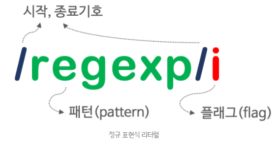

## JAVASCRIPT
<details open>
<summary>RegExp</summary>
<div markdown="31">

#### 정규 표현식(regular expression, regexp)이란?
- 정규 표현식: 일정한 패턴을 가진 문자열의 집합을 표현하기 위해 사용하는 형식 언어(formal language)이다.
- 정규 표현식은 자바스크립트의 고유 문법이 아니며, 대부분의 프로그래밍 언어와 코드 에디터에 내장되어 있다.
- 자바스크립트는 펄(perl)의 정규 표현식 문법을 ES3부터 도입했다.

- 정규 표현식은 문자열을 대상으로 `패턴 매칭 기능`을 제공한다.
- 패턴 매칭 기능: 특정 패턴과 일치하는 문자열을 검색하거나 추출 또는 치환할 수 있는 기능을 말한다.

- 정규 표현식을 사용하면 반복문과 조건문 없이 패턴을 정의하고 테스트하는 것으로 간단히 체크할 수 있다.
- 다만 정규 표현식은 주석이나 공백을 허용하지 않고 여러 가지 기호를 혼합하여 사용하기 때문에 가독성이 좋지 않다는 문제가 있다.

#### 정규 표현식의 생성
- 정규 표현식 객체(RegExp 객체)를 생성하기 위해서는 `정규 표현식 리터럴`과 `RegExp 생성자 함수`를 사용할 수 있다.
- 일반적인 방법은 정규 표현식 리터럴을 사용하는 것이다.
- 정규 표현식 리터럴은 다음과 같이 표현한다.
<br />


```javascript
const target = 'Is this all there is?';

const regexp = /is/i;

regexp.test(target); // true
```
- RegExp 생성자 함수를 사용하여 RegExp 객체를 생성할 수도 있다.
- `new RegExp(pattern[, flags])`
```javascript
const target = 'Is this all there is?';

const regexp = new RegExp(/is/i); // ES6
// const regexp = new RegExp(/is/, 'i');
// const regexp = new RegExp('is', 'i');

regexp.test(target); // true
```

#### RegExp 메서드
##### RegExp.prototype.exec
- exec 메서드는 인수로 전달받은 문자열에 대해 정규 표현식의 패턴을 검색하여 매칭 결과를 반환한다.
- 매칭 결과가 없는 경우 null을 반환한다.
```javascript
const target = 'Is this all there is?';

const regExp = /is/;

const arr = regExp.exec(target);

console.log(arr);
// ["is", index: 5, input: "Is this all there is?", groups: undefined]

console.log(arr.index); // 5
```
- exec 메서드는 문자열 내의 모든 패턴을 검색하는 g 플래그를 지정해도 첫 번째 매칭 결과만 반환한다.

##### RegExp.prototype.test
- test 메서드는 문자열에서 패턴을 검색하여 매칭 결과를 불리언 값을 반환한다.
```javascript
const target = 'Is this all there is?';

const regExp = /is/;

regExp.test(target); // true
```

##### String.prototype.match
- String 표준 빌트인 객체가 제공하는 match 메서드는 문자열과 정규 표현식과의 매칭 정보를 배열로 반환한다.
```javascript
const target = 'Is this all there is?';

const regExp = /is/;

target.match(regExp); 
// ["is", index: 5, input: "Is this all there is?", groups: undefined]
```
- exec 메서드는 문자열 내의 모든 패턴을 검색하는 g 플래그를 지정해도 첫 번째 매칭 결과만 반환한다.
- 하지만 String.prototype.match 메서드는 g 플래그가 지정되면 모든 매칭 결과를 배열로 반환한다.
```javascript
const target = 'Is this all there is?';

const regExp = /is/g;

target.match(regExp); // ["is", "is"]
```

#### 플래그
- 플래그는 정규 표현식의 검색 방식을 설정하기 위해 사용한다.
- 플래그는 총 6개가 있다.
- 그중 중요한 3개의 플래그만 살펴보자.

| 플래그 | 의미        | 설명                                                         |
| ------ | ----------- | ------------------------------------------------------------ |
| i      | Ignore case | 대소문자를 구별하지 않고 패턴을 검색한다.                    |
| g      | Global      | 대상 문자열 내에서 패턴과 일치하는 모든 문자열을 전역 검색한다. |
| m      | Multi line  | 문자열의 행이 바뀌더라도 패턴 검색을 계속한다.               |

- 플래그는 옵션이므로 선택적으로 사용할 수 있으며, 순서와 상관없이 하나 이상의 플래그를 동시에 설정할 수도 있다.
- 어떠한 플래그를 사용하지 않으면 대소문자를 구별해서 패턴을 검색한다.
- 그리고 문자열 패턴 검색 매칭 대상이 1개 이상 존재해도 첫 번째 매칭한 대상만 검색하고 종료한다.
```javascript
const target = 'Is this all there is?';

target.match(/is/);
// ["is", index: 5, input: "Is this all there is?", groups: undefined]

target.match(/is/i);
// ["Is", index: 0, input: "Is this all there is?", groups: undefined]

target.match(/is/g); // ["is", "is"]
target.match(/is/ig); // ["Is", "is", "is"]
```

#### 패턴
- 패턴은 `/`으로 열고 닫으며 문자열의 따옴표는 생략한다.
- 따옴표를 포함하면 따옴표까지도 패턴에 포함된다.
- 또한, 특별한 의미가 있는 메타문자(meta character) 또는 기호로 표현할 수 있다.
- 어떤 문자열 내에 패턴과 일치하는 문자열이 존재할 때 ‘정규 표현식과 매치(match)한다.’고 표현한다.

##### 문자열 검색
- 앞서 살펴본 RegExp 메서드를 사용하여 검색 대상 문자열과 정규 표현식의 매칭 결과를 구하면 검색이 수행된다.

##### 임의의 문자열 검색
- `.`은 임의의 문자 한 개를 의미한다.
- 문자의 내용은 무엇이든 상관없다.
```javascript
const target = 'Is this all there is?';

const regexp = /.../g;

target.match(regexp);
// ["Is ", "thi", "s a", "ll ", "the", "re ", "is?"]
```

##### 반복 검색
- `{m,n}`은 앞선 패턴(다음 예제의 경우 A)이 최소 m번, 최대 n번 반복되는 문자열을 의미한다.
- 컴마 뒤에 공백이 있으면 정상 동작하지 않으므로 주의하자.
```javascript
const target = 'A AA B BB Aa Bb AAA';

const regexp = /A{1,2}/g;

target.match(regexp); // ["A", "AA", "A", "AA", "A"]
```
- `{n}`은 앞선 패턴이 n번 반복되는 문자열을 의미한다.
- 즉, `{n}`은 `{n,n}`과 같다.
```javascript
const target = 'A AA B BB Aa Bb AAA';

const regexp = /A{2}/g;

target.match(regexp); // ["AA", "AA"]
```
- `{n,}`는 앞선 패턴이 최소 n번 이상 반복되는 문자열을 의미한다.
```javascript
const target = 'A AA B BB Aa Bb AAA';

const regexp = /A{2,}/g;

target.match(regexp); // ["AA", "AAA"]
```
- `+`는 앞선 패턴이 최소 한 번 이상 반복되는 문자열을 의미한다.
- 즉, `+`는 `{1,}`과 같다.
```javascript
const target = 'A AA B BB Aa Bb AAA';

const regexp = /A+/g;

target.match(regexp); // ["A", "AA", "A", "AAA"]
```
- `?`는 앞선 패턴이 최대 한 번(0번 포함) 이상 반복되는 문자열을 의미한다.
- 즉, `?`는 `{0,1}`과 같다.
```javascript
const target = 'color colour';

// 'colo' 다음 'u'가 최대 한 번(0번 포함) 이상 반복되고 'r'이 이어지는 문자열
const regexp = /colou?r/g;

target.match(regexp); // ["color", "colour"]
```

##### OR 검색
- `|`은 or의 의미를 갖는다.
```javascript
const target = 'A AA B BB Aa Bb';

const regexp = /A|B/g;

target.match(regexp); // ["A", "A", "A", "B", "B", "B", "A", "B"]
```
- 분해되지 않은 단어 레벨로 검색하기 위해서는 `+`를 같이 사용한다.
```javascript
const target = 'A AA B BB Aa Bb';

const regexp = /A+|B+/g;

target.match(regexp); // ["A", "AA", "B", "BB", "A", "B"]
```
- 위 예제는 패턴을 or로 한 번 이상 반복하는 것인데 이를 간단히 표현하면 다음과 같다.
- `[]` 내의 문자는 or로 동작한다.
- 그 뒤에 +를 사용하면 앞선 패턴을 한 번 이상 반복한다.
```javascript
const target = 'A AA B BB Aa Bb';

const regexp = /[AB]+/g;

target.match(regexp); // ["A", "AA", "B", "BB", "A", "B"]
```
- 범위를 지정하려면 `[]`내에 `-`를 사용한다.
```javascript
const target = 'A AA BB ZZ Aa Bb';

const regexp = /[A-Z]+/g;

target.match(regexp); // ["A", "AA", "BB", "ZZ", "A", "B"]
```
- 대소문자를 구별하지 않고 알파벳을 검색하는 방법은 다음과 같다.
```javascript
const target = 'AA BB Aa Bb 12';

const regexp = /[A-Za-z]+/g;
// const regExp = /[A-Z]+/gi;

target.match(regexp); // ["AA", "BB", "Aa", "Bb"]
```
- 숫자를 검색하는 방법은 다음과 같다.
```javascript
const target = 'AA BB 12,345';

const regexp = /[0-9]+/g;

target.match(regexp); // ["12", "345"]
```
- 위 예제의 경우 쉼표 때문에 매칭 결과가 분리되므로 쉼표를 패턴에 포함시킨다.
```javascript
const target = 'AA BB 12,345';

// '0' ~ '9' 또는 ','가 한 번 이상 반복되는 문자열을 전역 검색한다.
const regexp = /[0-9,]+/g;

target.match(regexp); // ["12,345"]
```
- 위 예제를 간단히 표현하면 다음과 같다.
- `\d`는 숫자를 의미한다.
- 즉, `\d`는 `[0-9]`와 같다.
- `\D`는 `\d`와 반대로 동작한다.
- 즉, `\D`는 숫자가 아닌 문자를 의미한다.
```javascript
const target = 'AA BB 12,345';

let regexp = /[\d,]+/g;

target.match(regexp); // ["12,345"]

regexp = /[\D,]+/g;

target.match(regexp); // ["AA BB ", ","]
```
- `\w`는 알파벳, 숫자, 언더스코어를 의미한다.
- 즉, `\w`는 `[A-Za-z0-9_]`와 같다.
- `\W`는 `\w`와 반대로 동작한다.
```javascript
const target = 'Aa Bb 12,345 _$%&';

let regexp = /[\w,]+/g;

target.match(regexp); // ["Aa", "Bb", "12,345", "_"]

regexp = /[\W,]+/g;

target.match(regexp); // [" ", " ", ",", " $%&"]
```

##### NOT 검색
- `[...]` 내의 `^`은 not의 의미를 갖는다.
- 예를 들어 `[^0-9]`는 숫자를 제외한 문자를 의미한다.
- 따라서 `[0-9]`와 같은 의미의 `\d`와 반대로 동작하는 `\D`는 `[^0-9]`와 같고, `[A-Za-z0-9_]`와 같은 의미의 `\w`와 반대로 동작하는 `\W`는 `[^A-Za-z0-9_]`와 같다.
```javascript
const target = 'AA BB Aa Bb 12';

const regexp = /[^0-9]+/g;

target.match(regexp); // ['AA BB Aa Bb ']
```

##### 시작 위치로 검색
- `[...]` 밖의 `^`은 문자열의 시작을 의미한다.
- 단, `[...]` 내의 `^`은 not의 의미를 가지므로 주의하자.
```javascript
const target = 'https://poiemaweb.com';

const regexp = /^https/;

regexp.test(target); // true
```

##### 마지막 위치로 검색
- `$`는 문자열 마지막을 의미한다.
```javascript
const target = 'https://poiemaweb.com';

const regexp = /com$/;

regexp.test(target); // true
```

#### 자주 사용하는 정규표현식
##### 특정 단어로 시작하는지 검사
- 다음 예제는 검색 대상 문자열이 `http://` 또는 `https://`로 시작하는지 검사한다.
```javascript
const target = 'https://poiemaweb.com';

const regexp = /^https?:\/\//;

regexp.test(target); // true
```
- 다음 방법도 동일하게 동작한다.
```javascript
const regexp = /^(http|https):\/\//;
```

##### 특정 단어로 끝나는지 검사
- 다음 예제는 검색 대상 문자열이 ‘html’로 끝나는지 검사한다.
```javascript
const fileName = 'index.html';

const regexp = /html$/;

regexp.test(fileName); // true
```

##### 숫자로만 이루어진 문자열인지 검사
- 다음 예제는 검색 대상 문자열이 숫자로만 이루어진 문자열인지 검사한다.
```javascript
const target = '12345';

const regexp = /^\d+$/;

regexp.test(target); // true
```

##### 하나 이상의 공백으로 시작하는지 검사
- 다음 예제는 검색 대상 문자열이 하나 이상의 공백으로 시작하는지 검사한다.
- `\s`는 여러 가지 공백 문자(스페이스, 탭 등)를 의미한다.
- 즉, `\s`는 `[\t\r\n\v\f]`와 같은 의미이다.
```javascript
const target = ' Hi!';

const regexp = /^\s+/;

regexp.test(target); // true
```

##### 아이디로 사용 가능한지 검사
- 다음 예제는 검색 대상 문자열이 알파벳 대소문자 또는 숫자로 시작하고 끝나며 4~10자리인지 검사한다.
```javascript
const id = 'abc123';

// 알파벳 대소문자 또는 숫자로 시작하고 끝나며 4 ~ 10자리인지 검사한다.
const regexp = /^[A-Za-z0-9]{4,10}$/;

regexp.test(id); // true
```

##### 메일 주소 형식에 맞는지 검사
```javascript
const email = 'ungmo2@gmail.com';

const regexp = /^[0-9a-zA-Z]([-_\.]?[0-9a-zA-Z])*@[0-9a-zA-Z]([-_\.]?[0-9a-zA-Z])*\.[a-zA-Z]{2,3}$/;

regexp.test(email); // true
```
- 참고로 인터넷 메시지 형식 규약인 RFC 5322에 맞는 정교한 패턴 매칭이 필요하다면 다음과 같이 무척이나 복잡한 패턴을 사용할 필요가 있다.
```javascript
(?:[a-z0-9!#$%&'*+/=?^_`{|}~-]+(?:\.[a-z0-9!#$%&'*+/=?^_`{|}~-]+)*|"(?:[\x01-\x08\x0b\x0c\x0e-\x1f\x21\x23-\x5b\x5d-\x7f]|\\[\x01-\x09\x0b\x0c\x0e-\x7f])*")@(?:(?:[a-z0-9](?:[a-z0-9-]*[a-z0-9])?\.)+[a-z0-9](?:[a-z0-9-]*[a-z0-9])?|\[(?:(?:25[0-5]|2[0-4][0-9]|[01]?[0-9][0-9]?)\.){3}(?:25[0-5]|2[0-4][0-9]|[01]?[0-9][0-9]?|[a-z0-9-]*[a-z0-9]:(?:[\x01-\x08\x0b\x0c\x0e-\x1f\x21-\x5a\x53-\x7f]|\\[\x01-\x09\x0b\x0c\x0e-\x7f])+)\])
```

##### 핸드폰 번호 형식에 맞는지 검사
```javascript
const cellphone = '010-1234-5678';

const regexp = /^\d{3}-\d{3,4}-\d{4}$/;

regexp.test(cellphone); // true
```

##### 특수문자 포함 여부 검사
- 다음 예제는 검색 대상 문자열에 특수문자가 포함되어 있는지 검사한다.
- 특수문자는 A-Za-z0-9 이외의 문자이다.
```javascript
const target = 'abc#123';

const regexp = /[^A-Za-z0-9]/gi;

regexp.test(target); // true
```
- 다음 방식으로 대체해 사용할 수도 있다.
- 이 방식은 특수문자를 선택적으로 검사할 수 있다는 장점이 있다.
```javascript
const target = 'abc#123';

const regexp = /[\{\}\[\]\/?.,;:|\)*~`!^\-_+<>@\#$%&\\\=\(\'\"]/gi;

regexp.test(target); // true
```
- 특수문자를 제거할 때는 String.prototype.replace 메서드를 사용한다.
```javascript
const target = 'abc#123';

target.replace(/[^A-Za-z0-9]/gi, ''); // abc123
```

</div> 
</details>

---