## JAVASCRIPT
<details open>
<summary>브라우저 렌더링 과정</summary>
<div markdown="38">
<br />

- 구글의 V8 자바스크립트 엔진으로 빌드된 자바스크립트 런타임 환경인 Node.js의 등장으로 자바스크립트는 웹 브라우저를 벗어나 서버 사이드 애플리케이션 개발에서도 사용할 수 있는 범용 개발 언어가 되었다.
- 하지만 자바스크립트가 가장 많이 사용되는 분야는 역시 웹 브라우저 환경에서 동작하는 웹페이지/애플리케이션의 클라이언트 사이드이다.

- 대부분의 프로그래밍언어는 운영체제(Operating System, OS)나 가상머신(Virtual Machine, VW)위에서 실행되지만, `웹 애플리케이션의 클라이언트 사이드 자바스크립트는 웹 브라우저에서 HTML, CSS와 함께 실행된다.`(WEB API의 시작)
- 따라서 브라우저 환경을 고려할 때 더 효율적인 클라이언트 사이드 자바스크립트 프로그래밍이 가능하다.

- 이를 위해 브라우저가 HTML, CSS, 자바스크립트 작성된 문서를 어떻게 파싱(parsing, 해석)하여 브라우저에 렌더링 하는지 살펴보자.

##### 파싱(parsing)
- 파싱(구문 분석, syntax analysis)은 프로그래밍 언어의 문법에 맞게 작성된 텍스트 문서를 읽어 들여 실행하기 위해 텍스트 문자열을 `토큰`(token, 토큰이란 문법적인 의미를 가지며, 문법적으로 더 이상 나눌 수 없는 코드의 기본 요소를 의미한다.)으로 분해(어휘 분석, lexical analysis)하고, 토큰에 문법적 의미와 구조를 반영하여 트리 구조의 자료구조인 `파스 트리(parse tree/syntax tree)`를 생성하는 일련의 과정을 말한다.
- 일반적으로 파싱이 완료된 이후에는 파스 트리를 기반으로 중간 언어(intermediate code)인 `바이트 코드`(특정한 하드웨어가 아니라 가상머신에서 실행하도록 만든 바이너리 코드)를 생성하고 실행한다.
- 즉, 코드를 읽어서 무엇을 뜻하는지 해석하는 과정이다.

##### 렌더링
- 렌더링은 HTML, CSS, 자바스크립트로 작성된 문서를 파싱하여 `브라우저에 시각적으로 출력하는 것`을 말한다.

- 소스코드는 파일 형태로 저장된다.
- 각 파일의 전체를 문서(Document)라고 한다.
- 문서의 구성요소 = HTML 요소
- 파일의 최종 종착지는 서버이다.(파일이 서버에 저장된다.)

- 다음 그림은 브라우저의 렌더링 과정(critical rendering path)을 간략하게 표현한 것이다.
<br />

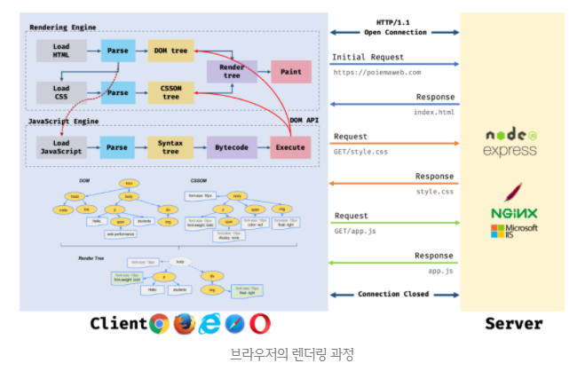

- 브라우저는 다음과 같은 과정을 거쳐 렌더링을 수행한다.
1. 브라우저는 HTML, CSS, 자바스크립트, 이미지, 폰트 파일 등 렌더링에 필요한 리소스를 요청하고 서버로부터 응답을 받는다.(브라우저의 핵심은 요청이고, 서버의 핵심은 응답이다.)
2. 브라우저의 렌더링 엔진은 서버로부터 응답된 HTML, CSS를 파싱하여 DOM, CSSOM을 생성하고 이들을 결합하여 렌더 트리를 생성한다.
3. 브라우저의 렌더링 엔진은 서버로부터 응답된 자바스크립트를 파싱하여 AST(Abstract Syntax Tree)를 생성하고 바이트코드로 변환하여 실행한다. 이때 자바스크립트는 DOM API를 통해 DOM이나 CSSOM을 변경할 수 있다. 변경된 DOM과 CSSOM은 다시 렌더 트리로 결합된다.
4. 렌더 트리를 기반으로 HTML 요소의 레이아웃(위치와 크기)을 계산하고 브라우저 화면에 HTML 요소를 페이팅한다.


#### 요청과 응답
- 브라우저의 핵심기능: 필요한 리소스(HTML, CSS, JS, 이미지, 폰트 등의 정적파일 또는 서버가 동적으로 생성한 데이터)를 서버에 요청(request)하고 서버로부터 응답(response)받아 브라우저에 시각적으로 렌더링하는 것이다.
- 즉, 렌더링에 필요한 리소스는 모두 서버에 존재하므로 필요한 리소스를 서버에 요청하고 서버가 응답한 리소스를 파싱하여 렌더링하는 것이다.
- 요청과 응답은 쌍으로 이루어진다.
- 요청한 파일이 없더라도 없다는 응답을 해줘야한다.
- 브라우저 제조사마다 요청하는 방법이 다르면 코딩이 매우 어려워진다.
- 따라서 요청과 응답의 약속(규칙)을 정했다.
- 그 규칙이 바로 `HTTP`이다.

- 서버에 요청을 전송하기 위해 브라우저는 주소창을 제공한다.
- URI는 요청에 대한 식별자이다.
- host는 서버를 찾아갈 수 있는 식별자이다.
- 브라우저의 주소창에 URL을 입력하고 엔터키를 누르면 URL의 호스트 이름이 DNS을 통해 IP 주소로 변환되고 이 IP 주소를 갖는 서버에게 요청을 전송한다.

- 모든 컴퓨터에는 LAN 카드가 있다.
- LAN 카드에는 중복되지 않는 고유번호가 있는데, 그 번호가 MAC (Media Access Control Address)주소이다.
- MAC 주소는 이더넷과 와이파이를 포함한 대부분의 IEEE 802 네트워크 기술에 네트워크 주소로 사용된다.
<br />

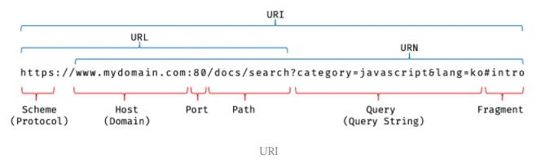

- 예를 들어, 브라우저 주소창에 `https://poiemaweb.com` 을 입력하고 엔터키를 누르면 루트 요청(/, 스킴(scheme))과 호스트(host) 만으로 구성된 URI에 의한 요청)이 poiemaweb.com 서버로 전송된다.
- `https://`의 s는 secur(보안)으로, 보안에 강화된 버전이다.
- 루트 요청이 바뀌면 요청도 다른 요청으로 바뀐다.
- 즉, 도메인과 서버는 1:1 매핑된다.
- 루트 요청에는 명확히 리소스를 요청하는 내용이 없지만 서버는 루트 요청에 대해 암묵적으로 index.html을 응답하도록 기본 설정되어 있다.
- 즉, https://poiemaweb.com 은 https://poiemaweb.com/index.html 과 같은 요청이다.

- 따라서 서버는 루트 요청에 대해 서버의 루트 폴더에 존재하는 정적 파일 index.html을 클라이언트(브라우저)로 응답한다.
- 만약 index.html이 아닌 다른 정적 파일을 서버에 요청하려면 브라우저 주소창에 https://poiemaweb.com/assets/data/data.json과 같이 요청할 정적 파일의 경로(서버의 루트 폴더 기준)와 파일 이름을 URI의 호스트 뒤의 패스(path)에 기술하여 서버에 요청한다.
- 그러면 서버는 루트 폴더의 assets/data 폴더 내에 있는 정적 파일 data.json을 응답할 것이다.
- 반드시 브라우저의 주소창을 통해 서버에게 정적 파일만을 요청할 수 있는 것은 아니다.
- 자바스크립트를 통해 동적으로 서버에 정적/동적 데이터를 요청할 수도 있다.

- REST API를 사용하면 패스가 폴더 구조상의 의미가 아닌 하나의 자산에 대한 이름으로 사용한다.
- 즉, 원래 패스는 root 폴더 안에 폴더 구조상의 의미를 갖지만, REST API는 폴더 구조상의 의미가 아닌 하나의 자산에 대한 이름으로 사용한다.
- 하지만, REST API는 end point가 너무 많아져 복잡하다.
- 그래서 나온 것이 그래프QL이다.

- port는 여러 개의 서버를 구별하여 찾아갈 수 있는 번호이다.

- category(key) = javascript(value)
- lang(key) = ko(value)

- 프래그먼트를 전달하면 페이지가 해당 id가 있는 곳으로 스크롤이 이동한다.
- 즉, 프래그먼트 처리는 서버에 전달되지 않고, 브라우저가 서버로부터 라소스를 다운받은 다음에 이루어진다.
- 프래그먼트 앞까지 한글자라도 바뀌면 새로운 요청이다.

- 참고로 Ajax는 모든 요청의 URL이 같다.
- 이로인해 SEO 측면에서 문제가 생긴다.
- HashBang을 이용해서 URL을 억지로 만들어주는 기법을 사용하기도 한다.
- 또는 서버에서 렌더링을 시키는 방법(서버 사이드 렌더링 기법)을 사용하기도 한다.

- 요청과 응답은 개발자 도구의 Network 패널에서 확인할 수 있다.
- 개발자 도구의 Network 패널을 활성화하기 이전에 브라우저가 이미 응답을 받은 경우 응답된 리소스가 표시되지 않는다.
- 따라서 Network 패널에 아무런 리소스가 표시되지 않았다면 페이지를 새로고침해야 한다.

- index.html 뿐만 아니라 CSS, 자바스크립트, 이미지, 폰트 파일들도 응답된 것을 확인할 수 있다.
- 이는 브라우저의 렌더링 엔진이 HTML(index.html)을 파싱하는 도중에 외부 리소스를 로드하는 태그, 즉 CSS 파일을 로드하는 link 태그, 이미지 파일을 로드하는 img 태그, 자바스크립트를 로드하는 script 태그 등을 만나면 HTML의 파싱을 일시 중단하고 해당 리소스 파일을 서버로 요청하기 때문이다.

#### HTTP 1.1과 HTTP 2.0
- `HTTP(HyperText Transfer Protocol)는 웹에서 브라우저와 서버가 통신하기 위한 프로토콜(규약)이다.`
- 1989년, HTML, URL과 함께 팀 버너스 리 경(Sir Tim Berners-Lee)이 고안한 HTTP는 1991년 최초로 문서화되었고 1996년 HTTP/1.0, 1999년 HTTP/1.1, 2015년 HTTP/2가 발표되었다.
- 이 가운데 HTTP/1.1과 HTTP/2의 차이점을 간략히 살펴보자.

- `HTTP/1.1은 기본적으로 커넥션(connection)당 하나의 요청과 응답만 처리한다.`
- 즉, 여러 개의 요청을 한 번에 전송할 수 없고 응답 또한 마찬가지이다.
- 따라서 HTML 문서 내에 포함된 여러 개의 리소스 요청, 즉 CSS 파일을 로드하는 link 태그, 이미지 파일을 로드하는 img 태그, 자바스크립트를 로드하는 script 태그 등에 의한 리소스 요청이 개별적으로 전송되고 응답 또한 개별적으로 전송된다.
- 이처럼 HTTP/1.1은 리소스의 동시 전송이 불가능한 구조이므로 `리소스의 개수에 비례하여 응답 시간도 증가하는 단점이 있다.`
<br />

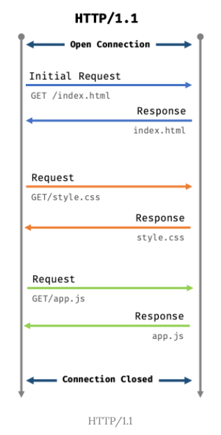
- 이처럼 HTTP/1.1은 다중 요청/응답이 불가능하다는 단점이 있지만 `HTTP/2는 커넥션당 여러 개의 요청과 응답, 즉 다중 요청/응답이 가능하다.`
- 따라서 HTTP/2.0은 여러 리소스의 동시 전송이 가능하므로 `HTTP/1.1에 비해 페이지 로드 속도가 약 50%정도 빠르다고 알려져 있다.`
- 현재는 3버전도 나왔다.
<br />

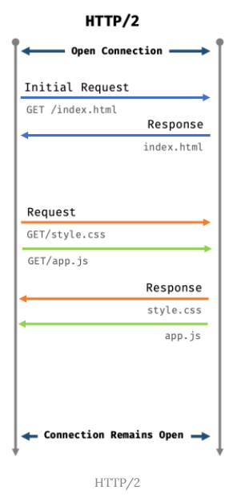


#### HTML 파싱과 DOM 생성
- 브라우저 요청에 의해 서버가 응답한 HTML 문서는 문자열로 이루어진 순수한 텍스트이다.
- 순수한 텍스트인 HTML 문서를 브라우저에 시각적인 픽셀로 렌더링하려면 HTML 문서를 브라우저가 이해할 수 있는 `자료구조(객체)로 변환하여 메모리에 저장해야 한다.`

- 예를 들어, 다음과 같은 index.html이 서버로부터 응답되었다고 가정해보자.
```javascript
<!DOCTYPE html>
<html lang="en">
<head>
  <meta charset="UTF-8">
  <link rel="stylesheet" href="style.css">
</head>
<body>
  <ul>
    <li id="apple">Apple</li>
    <li id="banana">Banana</li>
    <li id="orange">Orange</li>
  </ul>
  <script src="app.js"></script>
</body>
</html>
```
- 브라우저의 렌더링 엔진은 다음 그림과 같은 과정을 통해 응답받은 HTML 문서를 파싱하여 브라우저가 이해할 수 있는 자료구조인 `DOM(Document Object Model)`을 생성한다.
- Document로 만들어진 Object Model이다.
<br />

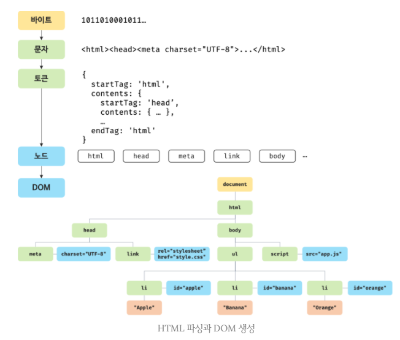

1. 서버에 존재하던 HTML 파일이 브라우저의 요청에 의해 응답된다. 이때 서버는 브라우저가 요청한 HTML 파일을 읽어 들여 메모리에 저장한 다음 메모리에 저장된 바이트(2진수)를 인터넷을 경유하여 응답한다.(브라우저와 서버는 인터넷에 의해 연결되어 있다.)
2. 브라우저는 서버가 응답한 HTML 문서를 바이트(2진수) 형태로 응답받는다. 그리고 바이트 형태의 HTML 문서는 meta 태그의 charset 어트리뷰트에 의해 저장된 인코딩 방식(예: UTF-8)을 기준으로 문자열로 변환된다. 참고로 meta 태그의 charset 어트리뷰트에 선언된 인코딩 방식은 `content-type: text/html; charset=utf-8`과 같이 `응답 헤더(response header)`에 담겨있다. 브라우저는 이를 확인하고 문자열로 변환한다.
3. 문자열로 변환된 HTML 문서를 읽어 들여 문법적 의미를 갖는 코드의 최소 단위인 `토큰(token)`들로 분해한다.
4. 각 토큰들을 객체로 변환하여 `노드(node)`들을 생성한다. 토큰의 내용에 따라 문서 노드, 요소 노드, 어트리뷰트 노드, 텍스트 노드가 생성된다. 노드는 이후 DOM을 구성하는 기본 요소가 된다.
5. HTML 문서는 HTML 요소들의 집합으로 이루어지며 `HTML 요소는 중첩관계를 갖는다.` 즉, HTML 요소의 콘텐츠 영역(시작 태그와 종료태그 사이)에는 텍스트뿐만 아니라 다른 HTML 요소도 포함될 수 있다. 이때 HTML 요소 간에는 중첩 관계에 의해 부자 관계가 형성된다. 이러한 HTML 요소 간의 부자관계를 반영하여 모든 노드들을 `트리 자료구조`로 구성한다. 이 노드들로 구성된 트리 자료구조를 `DOM(Document Object Model)`이라 부른다.

- 즉, `DOM은 HTML 문서를 파싱한 결과물이다.`

#### CSS 파싱과 CSSOM 생성
- 렌더링 엔진은 HTML을 처음부터 한 줄씩 순차적으로 파싱하여 DOM을 생성해 나간다.
- 이처럼 렌더링 엔진은 DOM을 생성해 나가다가 CSS를 로드하는 link 태그나 style 태그를 만나면 DOM 생성을 일시 중단한다.
- `CSS가 없으면 유저 에이전트 스타일을 디폴트 값으로 갖는다.`

- 그리고 link 태그의 href 어트리뷰트에 지정된 CSS 파일을 서버에 요청하여 로드한 CSS 파일이나 style 태그 내의 CSS를 HTML과 동일한 파싱 과정(바이트 → 문자 → 토큰 → 노드 → CSSOM)을 거치며 해석하여 `CSSOM(CSS Object Model)`을 생성한다.
- CSSOM tree을 만드는 것이 DOM tree를 만드는 것보다 100배는 어렵다.
- 이후 CSS 파싱을 완료하면 HTML 파싱이 중단된 시점부터 다시 HTML을 파싱하기 시작하여 DOM 생성을 재개한다.

```javascript
body {
  font-size: 18px;
}

ul {
  list-style-type: none;
}
```
- CSSOM은 CSS의 상속을 반영하여 생성된다.
- 위 예제에서 body 요소에 적용한 font-size 프로퍼티와 ul 요소에 적용한 list-style-type 프로퍼티는 모든 li 요소에 상속된다.
- 이러한 상속 관계가 반영되어 다음과 같은 CSSOM이 생성된다.
<br />

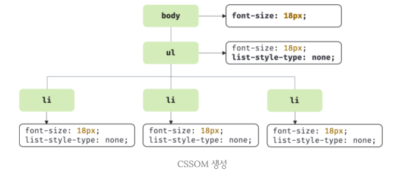


#### 렌더 트리 생성
- 렌더링 엔진은 서버로부터 응답된 HTML과 CSS를 파싱하여 각각 DOM과 CSSOM을 생성한다.
- 그리고 DOM과 CSSOM은 렌더링을 위해 `렌더 트리(render tree)`로 결합된다.
- `렌더 트리는 렌더링을 위한 트리 구조의 자료구조이다.`
- 따라서 브라우저 화면에 렌더링 되지 않는 노드(예: meta 태그, script 태그 등)와 CSS에 의해 비표시(예: display: none)되는 노드들은 포함하지 않는다.
- 다시 말해, `렌더 트리는 브라우저 화면에 렌더링되는 노드만으로 구성된다.`
<br />

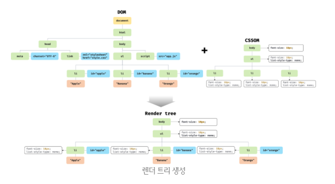

- 이후 완성된 렌더 트리는 각 HTML 요소의 레이아웃(위치와 크기)을 계산하는데 사용되며 브라우저 화면에 픽셀을 렌더링하는 페이팅(painting) 처리에 입력된다.
- HTML, CSS의 최종 목적: 렌더링(화면에 그리는 것)
<br />

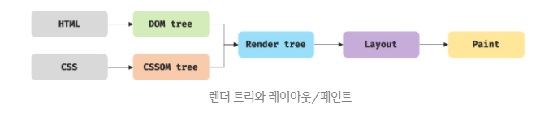

- 지금까지 살펴본 브라우저의 렌더링 과정은 반복해서 실행될 수 있다.
- 예를 들어, 다음과 같은 경우 반복해서 레이아웃 계산과 페인팅이 재차 실행된다.

1. 자바스크립트에 의한 노드 추가 또는 삭제
2. 브라우저 창의 리사이징에 의한 뷰포트(viewport)크기 변경
3. HTML 요소의 레이아웃(위치, 크기)에 변경을 발생시키는 width/height, margin, padding, border, display, position, top/right/bottom/left 등의 스타일 변경

- 레이아웃 계산과 페인팅을 다시 실행하는 리렌더링은 비용이 많이 드는, 즉 성능에 악영향을 주는 작업이다.
- 따라서 `가급적 리렌더링이 빈번하게 발생하지 않도록 주의할 필요가 있다.`

#### 자바스크립트 파싱과 실행
- HTML 문서를 파싱한 결과물로서 생성된 `DOM`은 `HTML 문서의 구조와 정보`뿐만 아니라 HTML 요소와 스타일 등을 변경할 수 있는 프로그래밍 인터페이스로서 `DOM API를 제공`한다.
- 즉, 자바스크립트 코드에서 DOM API를 사용하면 이미 생성된 DOM을 동적으로 조작할 수 있다.
- 참고로 `DOM 프로퍼티는 모두 접근자 프로퍼티이다.(즉 함수이다.)`
- CSS 파싱 과정과 마찬가지로 렌더링 엔진은 HTML을 한 줄씩 순차적으로 파싱하며 DOM을 생성해 나가다가 자바스크립트 파일을 로드하는 script 태그나 자바스크립트 코드를 콘텐츠로 담은 script 태그를 만나면 DOM 생성을 일시 중단한다.
- 그리고 script 태그의 src 어트리뷰트에 정의된 자바스크립트 파일을 서버에 요청하여 로드한 자바스크립트 파일이나 script 태그 내의 자바스크립트 코드를 파싱하기 위해 자바스크립트 엔진에 제어권을 넘긴다.
- 이후 자바스크립트 파싱과 실행이 종료되면 렌더링 엔진으로 다시 제어권을 넘겨 HTML 파싱이 중단된 지점부터 다시 HTML 파싱을 시작하여 DOM 생성을 재개한다.

- 자바스크립트 파싱과 실행은 브라우저의 렌더링 엔진이 아닌 자바스크립트 엔진이 처리한다.
- 자바스크립트 엔진은 자바스크립트 코드를 파싱하여 CPU가 이해할 수 있는 저수준 언어(low-level language)로 변환하고 실행하는 역할을 한다.
- 자바스크립트 엔진은 구글 크롬과 Node.js의 V8, 파이어폭스의 SpiderMonkey, 사파리의 JavaScriptCore 등 다양한 종류가 있으며, 모든 자바스크립트 엔진은 ECMAScript 사양을 준수한다.

- 렌더링 엔진으로부터 제어권을 넘겨받은 자바스크립트 엔진은 자바스크립트 코드를 파싱하기 시작한다.
- 렌더링 엔진이 HTML과 CSS를 파싱하여 DOM과 CSSOM을 생성하듯이 자바스크립트 엔진은 자바스크립트를 해석하여 `AST(Abstract Syntax Tree, 추상적 구문 트리)를 생성`한다. 
- 그리고 AST를 기반으로 인터프리터가 실행할 수 있는 중간 코드(intermediate code)인 `바이트코드를 생성하여 실행`한다.
- 바이트코드는 실행 전단계 언어, 기계어 언어 전단계 언어이다.
<br />

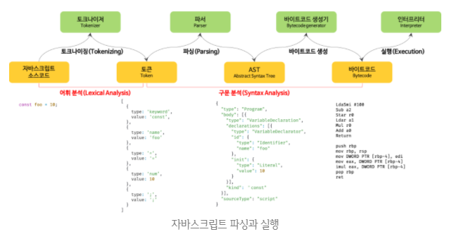

- `토그나이징(tokeniaing)`
- 단순한 문자열인 자바스크립트 소스코드를 `어휘 분석(lexical analysis)`하여 문법적 의미를 갖는 코드의 최소 단위인 토큰(token)들로 분해한다.
- 이 과정을 렉싱(lexing)이라고 부르기도 하지만 토크나이징과 미묘한 차이가 있다.

- `파싱(parsing)`
- 토큰들의 집합으로 `구문 분석(syntactic analysis)`하여 `AST(Abstract Syntax Tree, 추상 구문 트리)를 생성`한다.
- AST는 토큰에 문법적 의미와 구조를 반영한 트리 구조의 자료구조이다.
- AST는 인터프리터나 컴파일러만 사용하는 것은 아니다.
- AST를 사용하면 Typescript, Babel, Prettier 같은 트랜스파일러(transpiler)를 구현할 수도 있다.
- AST Explorer 웹 사이트에 방문하면 다양한 오픈소스 자바스크립트 파서를 사용하여 AST를 생성해 볼 수 있다.
<br />

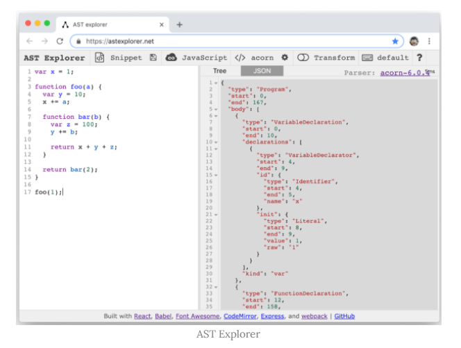

- `바이트코드 생성과 실행`
- 파싱의 결과물로서 생성된 AST는 인터프리터가 실행할 수 있는 `중간 코드인 바이트 코드로 변환되고 인터프리터에 의해 실행`된다.
- 참고로 V8 엔진의 경우 자주 사용되는 코드는 터보팬(TurboFan)이라 불리는 컴파일러에 의해 최적화된 머신 코드(optimized machine code)로 컴파일되어 성능을 최적화한다.
- 만약 코드의 사용 빈도가 적어지면 다시 디옵티마이징(deoptimizing)하기도 한다.


#### 리플로우와 리페인트
- 만약 자바스크립트 코드에 DOM이나 CSSOM을 변경하는 DOM API가 사용된 경우 DOM이나 CSSOM이 변경된다.
- 이때 변경된 DOM과 CSSOM은 다시 렌더 트리로 결합되고 변경된 렌더 트리를 기반으로 레이아웃과 페인트 과정을 거쳐 브라우저의 화면에 다시 렌더링한다.
- 이를 `리플로우(reflow), 리페인트(repaint)`라 한다.
- 예를 들어, ul 요소 안에 li 요소를 30개 넣는다면, 30번의 reflow가 일어난다.
- 따라서 한 번에 묶에서 올리는(uppend) 방법을 생각하자.(reflow가 한 번만 일어날 수 있게)
- 대부분 상속이 안되는 요소들이 reflow를 발생시킨다.
<br />

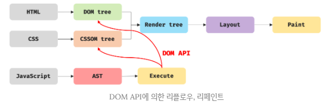

- `리플로우는 레이아웃 계산을 다시 하는 것`을 말하며, 노드 추가/삭제, 요소의 크기/위치 변경, 윈도우 리사이징 등 레이아웃에 영향을 주는 변경이 발생한 경우에 한하여 실행된다.
- 리페이트는 재결합된 렌더 트리를 기반으로 다시 페인트를 하는 것을 말한다.

- 따라서 `리플로우와 리페인트가 반드시 순차적으로 동시에 실행되는 것은 아니다.`
- 레이아웃에 영향이 없는 변경은 리플로우 없이 리페인트만 실행된다.

[What forces layout/reflow](https://gist.github.com/paulirish/5d52fb081b3570c81e3a)
[on layout & web performance](https://kellegous.com/j/2013/01/26/layout-performance/)
[CSS triggers](https://csstriggers.com/)
[Layout thrashing cheatsheet](https://devhints.io/layout-thrashing)

#### 자바스크립트 파싱에 의한 HTML 파싱 중단
- 지금까지 살펴본 바와 같이 렌더링 엔진과 자바스크립트 엔진은 직렬적으로 파싱을 수행한다.
<br />

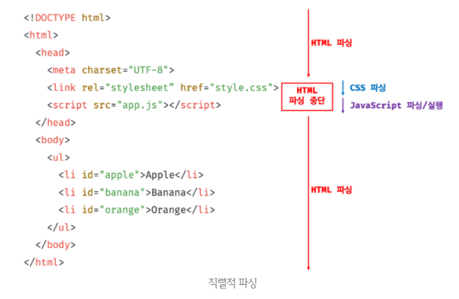
- 이처럼 브라우저는 동기적(synchronous)으로, 즉 위에서 아래 방향으로 순차적으로 HTML, CSS, 자바스크립트를 파싱하고 실행한다.
- 이것은 `script 태그의 위치에 따라 HTML 파싱이 블로킹되어 DOM 생성이 지연될 수 있다는 것을 의미한다.`
- 따라서 script 태그의 위치는 중요한 의미를 갖는다.

- 위 예제의 경우 app.js의 파싱과 실행 이전까지는 DOM 생성이 일시 중단된다.
- 이때 자바스크립트 코드(app.js)에서 DOM이나 CSSOM을 변경하는 DOM API를 사용할 경우 DOM이나 CSSOM이 이미 생성되어 있어야 한다.
- 만약 DOM을 변경하는 DOM API를 사용할 때 DOM의 생성이 완료되지 않은 상태라면 문제가 발생할 수 있다.
```javascript
<!DOCTYPE html>
<html lang="en">
<head>
  <meta charset="UTF-8">
  <link rel="stylesheet" href="style.css">
  <script>
    const $apple = document.getElementById('apple');

    $apple.style.color = 'red';
    // TypeError: Cannot read property 'style' of null
  </script>
</head>
<body>
  <ul>
    <li id="apple">Apple</li>
    <li id="banana">Banana</li>
    <li id="orange">Orange</li>
  </ul>
</body>
</html>
```
- `document.getElementById('apple')`을 실행하는 시점에는 아직 id가 'apple'인 HTML 요소를 파싱하지 않았기 때문에 DOM에는 id가 apple인 요소가 포함되어 있지 않은 상태이다.
- 따라서 위 예제는 정상적으로 동작하지 않는다.
- 이러한 문제를 회피하기 위해 body 요소의 가장 아래에 자바스크립트를 위치시키는 것은 좋은 아이디어이다.
- 그 이유는 다음과 같다.

1. DOM이 완성되지 않은 상태에서 자바스크립트가 DOM을 조작하면 에러가 발생할 수 있다.
2. 자바스크립트 로딩/파싱/실행으로 인해 HTML 요소들이 렌더링에 지장받는 일이 발생하지 않아 페이지 로딩 시간이 단축된다.

```javascript
<!DOCTYPE html>
<html lang="en">
<head>
  <meta charset="UTF-8">
  <link rel="stylesheet" href="style.css">
</head>
<body>
  <ul>
    <li id="apple">Apple</li>
    <li id="banana">Banana</li>
    <li id="orange">Orange</li>
  </ul>
  <script>
    const $apple = document.getElementById('apple');

    $apple.style.color = 'red';
  </script>
</body>
</html>
```
- 자바스크립트가 실행되는 시점에는 이미 렌더링 엔진이 HTML 요소를 모두 파싱하여 DOM 생성을 완료한 이후이다.
- 따라서 DOM이 완성되지 않은 상태에서 자바스크립트가 DOM을 조작하는 에러가 발생할 우려가 없다.
- 또한 자바스크립트가 실행되기 이전에 DOM 생성이 완료되어 렌더링되므로 `페이지 로딩 시간이 단축되는 이점`도 있다.


#### script 태그의 async/defer 어트리뷰트
- 앞에서 살펴본 자바스크립트 파싱에 의한 DOM 생성이 중단(blocking)되는 문제를 근본적으로 해결하기 위해 `HTML5부터 script 태그에 async와 defer 어트리뷰트가 추가`되었다.

- async와 defer 어트리뷰트는 다음과 같이 src 어트리뷰트를 통해 외부 자바스크립트 파일을 로드하는 경우에만 사용할 수 있다.
- 즉, `src 어트리뷰트가 없는 인라인 자바스크립트에는 사용할 수 없다.`
```javascript
<script async src="extern.js"></script>
<script defer src="extern.js"></script>
```
- async와 defer 어트리뷰트를 사용하면 HTML 파싱과 외부 자바스크립트 파일의 `로드`가 비동기적(asynchronous)으로 동시에 진행된다.
- 하지만 자바스크립트의 실행 시점에 차이가 있다.

- `async 어트리뷰트`
- HTML 파싱과 외부 자바스크립트 파일의 `로드`가 비동기적으로 동시에 진행된다.(멀티테스킹)
- 단, 자바스크립트 `파싱과 실행`은 자바스크립트 파일의 로드가 완료된 직후 진행되며, 이때 HTML 파싱이 중단된다.
<br />

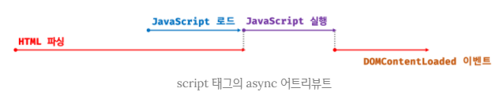

- 여러 개의 script 태그에 async 어트리뷰트를 지정하면 script 태그의 `순서와는 상관없이 로드가 완료된 자바스크립트부터 먼저 실행되므로 순서가 보장되지 않는다.`
- 따라서 순서 보장이 필요한 script 태그는 async 어트리뷰트를 지정하지 않아야 한다.
- async 어트리뷰트는 IE10 이상에서 지원한다.

-  `defer 어트리뷰트`
- async 어트리뷰트와 마찬가지로 HTML 파싱과 외부 자바스크립트 파일의 `로드`가 비동기적으로 동시에 진행된다.
- 단, 자바스크립트의 `파싱과 실행`은 HTML 파싱이 완료된 직후, 즉 DOM 생성이 완료된 직후(이때 DOMContentLoaded 이벤트가 발생한다) 진행된다.
- DOMContentLoaded 이벤트는 DOM이 완성되면 이벤트가 발생한다.
- 따라서 `DOM 생성이 완료된 이후 실행되어야 할 자바스크립트에 유용하다.`
- defer 어트리뷰트는 IE10 이상에서 지원한다.
- IE6 ~ 9에서도 지원되기는 하지만 정상적으로 동작하지 않을 수 있다. 
<br />

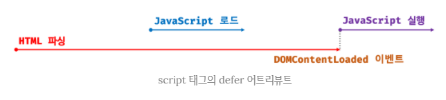


</div> 
</details>

---