## JAVASCRIPT
<details open>
<summary>DOM</summary>
<div markdown="39">
<br />

- 브라우저 렌더링 엔진은 HTML 문서를 파싱하여 브라우저가 이해할 수 있는 자료구조인 DOM을 생성한다.
- `DOM(Document Object Model)은 HTML 문서의 계층적 구조와 정보를 표현하며 이를 제어할 수 있는 API, 즉 프로퍼티와 메서드를 제공하는 트리 자료구조이다.`

### 노드
#### HTML 요소(HTML element)와 노드 객체
- HTML 요소는 HTML 문서를 구성하는 개별적인 요소를 의미한다.
<br />

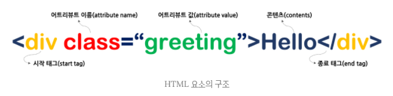
- HTML 요소는 렌더링 엔진에 의해 파싱되어 DOM을 구성하는 요소 노드 객체로 변환된다.
- 이때 HTML 요소의 `어트리뷰트는 어트리뷰트 노드`로, HTML 요소의 `텍스트 콘텐츠는 텍스트 노드`로 변환된다.
<br />

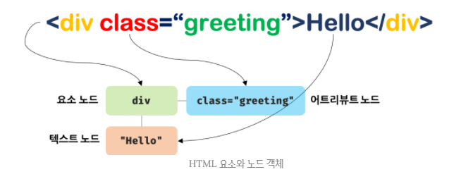

#### 트리 자료구조(tree data structure)
- 트리 자료구조는 노드들의 계층 구조로 이뤄진다.
- 즉, 트리 자료구조는 부모 노드(parent node)와 자식 노드(child node)로 구성되어 노드 간에 계층적 구조(부자, 형제 관계)를 표현하는 비선형(nonlinear) 자료구조는 하나의 자료 뒤에 여러 개의 자료가 존재할 수 있는 자료구조이다.
- `비선형 자료구조: 트리와 그래프(graph)`
- 비선형 자료구조의 상대적인 개념인 `선형(linear) 자료구조는 하나의 자료 뒤에 하나의 자료만 존재하는 자료구조`이다.
- `선형 자료구조: 배열, 스택, 큐, 링크드 리스트, 해시 테이블`
- 트리 자료구조는 하나의 최상위 노드에서 시작한다.
- `최상위 노드는 부모 노드가 없으며, 루트 노트(root node)라 한다.`
- 루트 노드는 0개 이상의 자식 노드를 갖는다.(이진 트리(binary tree)는 2개의 자식 노드를 갖는다.)
- `자식 노드가 없는 노드를 리프 노드(leaf node)라 한다.`
<br />

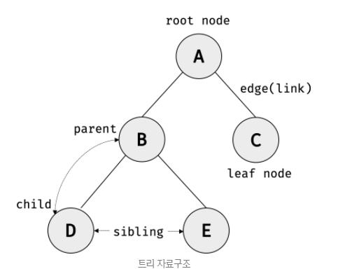

- `노드 객체들로 구성된 트리 자료구조를 DOM이라 한다.`
- 노드 객체의 트리로 구조화되어 있으므로 DOM을 `DOM 트리`라고 부르기도 한다.

#### 노드 객체의 타입
```html
<!DOCTYPE html>
<html lang="ko">
  <head>
    <meta charset="UTF-8">
    <link rel="stylesheet" href="style.css">
  </head>
  <body>
    <ul>
      <li id="apple">Apple</li>
      <li id="banana">Banana</li>
      <li id="orange">Orange</li>
    </ul>
    <script src="app.js"></script>
  </body>
</html>
```
- 렌더링 엔진은 위 HTML 문서를 파싱하여 다음과 같이 DOM을 생성한다.
<br />

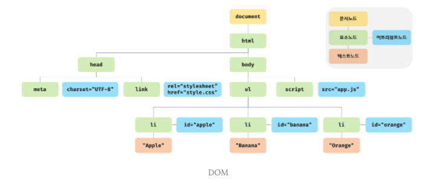

##### 공백 텍스트 노드
- 정확히 말하자면 위 그림에는 공백 텍스트 노드가 생략되어 있다.
- HTML 요소 사이의 개행이나 공백은 텍스트 노드가 된다.

- 이처럼 DOM은 노드 객체의 계층적인 구조로 구성된다.
- 노드 객체는 종류가 있고 상속 구조를 갖는다.
- 노드 객체는 `총 12개의 종류(노드 타입)가 있다.`
- 이 중에서 중요한 노드 타입은 다음과 같이 4가지이다.

`1. 문서 노드(document node)`
- 문서노드는 DOM 트리의 `최상위에 존재하는 루트 노드`로서 document 객체를 가리킨다.
- document 객체는 브라우저가 렌더링한 HTML 문서 전체를 가리키는 객체로서 `전역 객체 window의 document 프로퍼티에 바인딩`되어 있다.
- 따라서 문서 노드는 window.document 또는 document로 참조할 수 있다.

- 브라우저 환경의 모든 자바스크립트 코드는 script 태그에 의해 분리되어 있어도 하나의 전역 객체 window를 공유한다.
- 따라서 모든 자바스크립트 코드는 전역 객체 window의 document 프로퍼티에 바인딩되어 있는 하나의 document 객체를 바라본다.
- 즉, HTML 문서당 document 객체는 유일하다.

- 문서 노드, 즉 document 객체는 DOM 트리의 루트 노드이므로 DOM 트리의 노드들에 접근하기 위한 `진입점(entry point) 역할을 담당`한다.
- 즉, 요소, 어트리뷰트, 텍스트 노드에 접근하려면 문서 노드를 통해야 한다.

`2. 요소 노드(element node)`
- 요소 노드는 HTML 요소를 가리키는 객체이다.
- 요소 노드는 HTML 요소 간의 중첩에 의해 부자 관계를 가지며, 이 `부자 관계를 통해 정보를 구조화`한다.
- 따라서 요소 노드는 `문서의 구조`를 표현한다고 할 수 있다.

`3. 어트리뷰트 노드(attribute node)`
- 어트리뷰트 노드는 HTML 요소의 어트리뷰트를 가리키는 객체이다.
- 어트리뷰트 노드는 어트리뷰트가 지정된 HTML 요소의 요소 노드와 연결되어 있다.
- 단, 요소 노드는 부모 노드와 연결되어 있지만 `어트리뷰트 노드는 부모 노드와 연결되어 있지 않고 요소 노드에만 연결되어 있다.`
- `부모 노드가 없기 때문에 엄밀히 말하면 어트리뷰트 노드는 DOM 트리의 구성요소가 아니다.`
- 즉, 어트리뷰트 노드는 부모 노드가 없으므로 요소 노드의 형제(sibling)가 아니다.
- 따라서 어트리뷰트 노드에 접근하여 어트리뷰트를 참조하거나 변경하려면 먼저 요소 노드에 접근해야 한다.

`4. 텍스트 노드(text node)`
- 텍스트 노드는 HTML 요소의 텍스트를 가리키는 객체이다.
- 요소 노드가 문서의 구조를 표현한다면 텍스트 노드는 `문서의 정보`를 표현한다고 할 수 있다.
- 텍스트 노드는 요소 노드의 자식 노드이며, 자식 노드를 가질 수 없는 `리프 노드(leaf node)`이다.
- 즉, `텍스트 노드는 DOM 트리의 최종단이다.`
- 따라서 텍스트 노드에 접근하려면 먼저 부모 노드인 요소 노드에 접근해야 한다.

- 위 4가지 노트 타입 이외에도 주석을 위한 Comment 노드, DOCTYPE을 위한 DocumentType 노드, `복수의 노드를 생성하여 추가할 때 사용하는 DocumentFragment` 노드 등 총 12개의 노드 타입이 있다.


#### 노드 객체의 상속 구조
- DOM은 HTML 문서의 계층적 구조와 정보를 표현하며, 이를 제어할 수 있는 API, 즉 프로퍼티와 메서드를 제공하는 트리 자료구조라고 했다.
- DOM을 구성하는 노드 객체는 자신의 구조와 정보를 제어할 수 있는 DOM API를 사용할 수 있다.
- 이를 통해 노드 객체는 자신의 부모, 형제, 자식을 탐색할 수 있으며, 자신의 어트리뷰트와 텍스트를 조작할 수도 있다.

- DOM을 구성하는 `노드 객체`는 ECMAScript 사양에 정의된 표준 빌트인 객체(standard built-in object)가 아니라 브라우저 환경에서 추가적으로 제공하는 `호스트 객체(host object)`이다.
- 하지만 노드 객체도 자바스크립트 객체이므로 프로토타입에 의한 상속 구조를 갖는다.
- 노드 객체의 상속 구조는 다음과 같다.
<br />

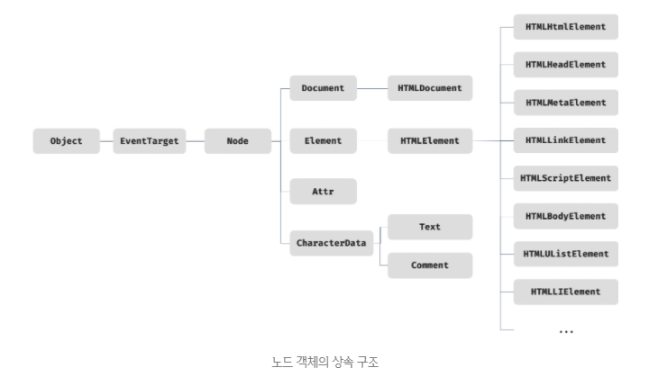

- 위 그림과 같이 모든 노드 객체는 Object, EventTarget, Node 인터페이스를 상속받는다.
- 추가로 문서 노드는 Document, HTMLDocument 인터페이스를 상속받고 어트리뷰트 노드는 Attr, 텍스트 노드는 CharacterData 인터페이스를 각각 상속받는다.

- 요소 노드는 Element 인터페이스를 상속받는다. 
- 또한, 요소 노드는 추가적으로 HTMLElement와 태그의 종류별로 세분화된 HTMLHTMLElement, HTMLHeadElement, HTMLBodyElement, HTMLUListElement 등의 인터페이스를 상속받는다.

- 이를 프로토타입 체인 관점에서 살펴보도록 하자.
- 예를 들어, input 요소를 파싱하여 객체화한 input 요소 노드 객체는 HTMLInputElement, HTMLElement, Element, Node, EventTarget, Object의 prototype에 바인딩되어 있는 프로토타입 객체를 상속받는다.
- 즉, input 요소 노드 객체는 프로토타입 체인에 있는 모든 프로토타입의 프로퍼티나 메서드를 상속받아 사용할 수 있다.
<br />

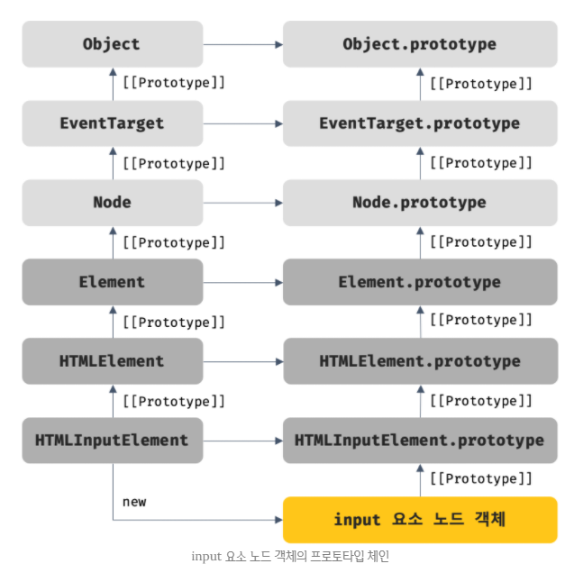
```html
<!DOCTYPE html>
<html lang="ko">
  <head>
    <meta charset="UTF-8">
    <title>Test</title>
    <link rel="stylesheet" href="style.css">
  </head>
  <body>
    <input type="text" />
    <script>
      // $변수: 요소 노드 객체가 담겨 있다는 컨벤션
      const $input = document.querySelector('input');

      console.log(
        Object.getPrototypeOf($input) === HTMLInputElement.prototype,
        Object.getPrototypeOf(HTMLInputElement.prototype) === HTMLElement.prototype,
        Object.getPrototypeOf(HTMLElement.prototype) === Element.prototype,
        Object.getPrototypeOf(Element.prototype) === Node.prototype,
        Object.getPrototypeOf(Node.prototype) === EventTarget.prototype,
        Object.getPrototypeOf(EventTarget.prototype) === Object.prototype
      ); // 모두 true
    </script>
  </body>
</html>
```
- 배열이 객체인 동시에 배열인 것처럼 input 요소 노드 객체도 다음과 같이 다양한 특성을 갖는 객체이며, 이러한 특성을 나타내는 기능들을 상속을 통해 제공받는다.

| input 요소 노드 객체의 특성                                  | 프로토타입을 제공하는 객체 |
| ------------------------------------------------------------ | -------------------------- |
| 객체                                                         | Object                     |
| 이벤트를 발생시키는 객체                                     | EventTarget                |
| 트리 자료구조의 노드 객체                                    | Node                       |
| 브라우저가 렌더링할 수 있는 웹 문서의 요소(HTML, XML, SVG)를 표현하는 객체 | Element                    |
| 웹 문서의 요소 중에서 HTML 요소를 표현하는 객체              | HTMLElement                |
| HTML 요소 중에서 input 요소를 표현하는 객체                  | HTMLInputElement           |

- 노드 객체의 상속 구조는 개발자 도구의 Element 패널 우측의 Properties 패널에서 확인할 수 있다.
<br />

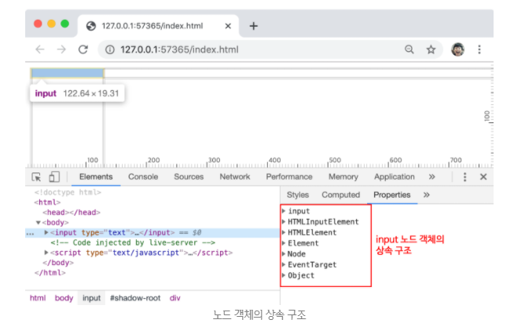

- 노드 객체에는 노드 객체의 종류, 즉 노드 타입에 상관없이 모든 노드 객체가 공통으로 갖는 기능도 있고, 노드 타입에 따라 고유한 기능도 있다.
- 예를 들어, 모든 노드 객체는 공통적으로 이벤트를 발생시킬 수 있다.
- 이벤트 관련 기능(EventTarget.addEventListener, EventTarget.removeEventListener 등)은 `EventTarget 인터페이스`가 제공한다.
- 또한, 모든 노드 객체는 트리 자료구조의 노드로서 공통적으로 트리 탐색 기능(Node,parentNode, Node.childNodes, Node.previousSibling, Node.nextSibling 등)이나 노드 정보 제공 기능(Node.nodeType, Node.nodeName 등)이 필요하다.
- 이 같은 노드 관련 기능은 `Node 인터페이스`가 제공한다.

- HTML 요소가 객체화된 요소 노드 객체는 HTML 요소가 갖는 공통적인 기능이 있다.
- 예를 들어 input 요소 노드 객체와 div 요소 노드 객체는 모두 HTML 요소의 스타일을 나타내는 style 프로퍼티가 있다.
- 이처럼 HTML 요소가 갖는 공통적인 기능은 `HTMLElement 인터페이스`가 제공한다.

- 하지만 요소 노드 객체는 HTML 요소의 종류에 따라 고유한 기능도 있다.
- 예를 들어, input 요소 노드 객체는 value 프로퍼티가 필요하지만 div 요소 노드 객체 value 프로퍼티가 필요하지 않다.
- 따라서 필요한 기능을 제공하는 인터페이스(HTMLInputElement, HTMLDivElement 등)가 HTML 요소의 종류에 따라 각각 다르다.

- 이처럼 노드 객체는 공통된 기능일수록 프로토타입 체인의 상위에, 개별적인 고유 기능일수록 프로토타입 체인의 하위에 프로토타입 체인을 구축하여 노드 객체에 필요한 기능, 즉 프로퍼티와 메서드를 제공하는 상속 구조를 갖는다.

- `DOM은 HTML 문서의 계층적 구조와 정보를 표현하는 것은 물론 노드 객체의 종류, 즉 노드 타입에 따라 필요한 기능을 프로퍼티와 메서드의 집합인 DOM API(Application Programming Interface)로 제공한다.`
- `DOM API를 통해 HTML의 구조나 내용 또는 스타일 등을 동적으로 조작할 수 있다.`


#### 요소 노드 취득
- HTML의 구조나 내용 또는 스타일 등을 동적으로 조작하려면 먼저 요소 노드를 취득해야 한다.
- 텍스트 노드는 요소 노드의 자식 노드이고, 어트리뷰트 노드는 요소 노드와 연결되어 있으므로 텍스트 노드나 어트리뷰트 노드를 조작하고자 할 때도 마찬가지이다.
- 이처럼 요소 노드의 취득은 HTML 요소를 조작하는 시작점이다.

##### id를 이용한 요소 노드 취득
- `Document.prototype.getElementById` 메서드는 인수로 전달한 id 어트리뷰트 값을 갖는 하나의 요소 노드를 탐색하여 반환한다.
- getElementById 메서드는 Document.prototype의 프로퍼티이다.
- 따라서 반드시 문서 노드인 document를 통해 호출해야 한다.
```html
<!DOCTYPE html>
<html>
<body>
  <ul>
    <li id="banana">Banana</li>
    <li id="apple">Apple</li>
    <li id="orange">Orange</li>
  </ul>
  <script>
    const $elem = document.getElementById('banana');

    $elem.style.color = 'red';
  </script>
</body>
</html>
```
- id 값은 HTML 문서 내에서 유일한 값이어야 하며, class 어트리뷰트와는 달리 공백 문자로 구분하여 여러 개의 값을 가질 수 없다.
- 단, `HTML 문서 내에 중복된 id 값을 갖는 HTML 요소가 여러 개 존재하더라도 어떠한 에러도 발생하지 않는다.`
- 즉, HTML 문서 내에는 중복된 id 값을 갖는 요소가 여러 개 존재할 가능성이 있다.

- 이러한 경우 getElementById 메서드는 인수로 전달한 id 값을 갖는 `첫 번째 요소 노드만 반환`한다.
- 즉, getElementById 메서드는 언제나 단 하나의 요소 노드를 반환한다.
```html
<!DOCTYPE html>
<html>
<body>
  <ul>
    <li id="banana">Banana</li>
    <li id="banana">Apple</li>
    <li id="banana">Orange</li>
  </ul>
  <script>
    const $elem = document.getElementById('banana');

    $elem.style.color = 'red';
    // 첫 번째 li 요소의 색만 바뀜
  </script>
</body>
</html>
```
- 만약 인수로 전달된 id 값을 갖는 HTML 요소가 존재하지 않으면 getElementById 메서드는 null을 반환한다.
```html
<!DOCTYPE html>
<html>
<body>
  <ul>
    <li id="banana">Banana</li>
    <li id="banana">Apple</li>
    <li id="banana">Orange</li>
  </ul>
  <script>
    const $elem = document.getElementById('grape');

    $elem.style.color = 'red';
    // TypeError: Cannot read property 'style' of null
  </script>
</body>
</html>
```
- HTML 요소에 id 어트리뷰트를 부여하면 `id 값과 동일한 이름의 전역 변수가 암묵적으로 선언`되고 `해당 노드 객체가 할당되는 부수효과가 있다.`
```html
<!DOCTYPE html>
<html>
<body>
  <div id="foo"></div>
  <script>
    // id 값과 동일한 이름의 전역변수가 암묵적으로 선언되고 해당 노드 객체가 할당된다.
    console.log(foo === document.getElementById('foo')); // true

    // 암묵적 전역으로 생성된 전역 프로퍼티는 삭제되지만 전역 변수는 삭제되지 않는다.
    delete foo;
    console.log(foo); // <div id="foo"></div>
  </script>
</body>
</html>
```
- 단, id 값과 동일한 이름의 전역 변수가 이미 선언되어 있으면 이 전역 변수에 노드 객체가 재할당되지 않는다.
```html
<!DOCTYPE html>
<html>
<body>
  <div id="foo"></div>
  <script>
    let foo = 1;

    console.log(foo); // 1
  </script>
</body>
</html>
```

##### 태그 이름을 이용한 요소 노드 취득
- `Document.prototype/Element.prototype.getElementsByTagName` 메서드는 인수로 전달한 태그 이름을 갖는 모든 요소 노드들을 탐색하여 반환한다.
- 메서드 이름에 포함된 Elements가 복수형인 것에서 알 수 있듯이 getElementsByTagName 메서드는 여러 개의 요소 노드 객체를 갖는 DOM 컬렉션 객체인 `HTMLCollection 객체를 반환`한다.
```html
<!DOCTYPE html>
<html>
<body>
  <ul>
    <li id="apple">Apple</li>
    <li id="banana">Banana</li>
    <li id="orange">Orange</li>
  </ul>
  <script>
    const $elems = document.getElementsByTagName('li');
    [...$elems].forEach(elem => { elem.style.color = 'red'; });
  </script>
</body>
</html>
```
- 함수는 하나의 값만 변환할 수 있으므로 여러 개의 값을 반환하려면 배열이나 객체와 같은 자료구조에 담아 반환해야 한다.
- getElementsByTagName 메서드가 반환하는 DOM 컬렉션 객체인 HTMLCollection 객체는 `유사 배열 객체`이면서 `이터러블`이다.
<br />

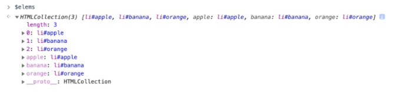

- HTML 문서의 모든 요소 노드를 취득하려면 태그 이름을 *로 지정한다.
- HTML 문서의 모든 요소 노드를 취득하려면 getElementsByTagName 메서드의 인수로 '*'를 전달한다.
```javascript
const $all = document.getElementsByTagName('*');
console.log($all);
// [html, head, body, ul, li#apple, li#banana, li#orange,
// script, apple: li#apple, banana: li#banana, orange: li#orange]
```
- getElementsByTagName 메서드는 `Document.prototype`에 정의된 메서드와 `Element.prototype`에 정의된 메서드가 있다.
- Document.prototype.getElementsByTagName 메서드는 DOM의 루트노드인 문서 노드, 즉 document를 통해 호출하며 `DOM 전체`에서 요소 노드를 탐색하여 반환한다.
- 하지만 Element.prototype.getElementsByTagName 메서드는 특정 요소 노드를 통해 호출하며, `특정 요소 노드의 자손 노드 중에서` 요소 노드를 탐색하여 반환한다.
```html
<!DOCTYPE html>
<html>
<body>
  <ul id="fruits">
    <li id="apple">Apple</li>
    <li id="banana">Banana</li>
    <li id="orange">Orange</li>
  </ul>
  <ul>
    <li>HTML</li>
  </ul>
  <script>
    const $lisFromDocument = document.getElementsByTagName('li');
    console.log($lisFromDocument);
    // HTMLCollection(4) [li, li, li, li]

    const $fruits = document.getElementById('fruits');
    const $liFromFruits = $fruits.getElementsByTagName('li');
    console.log($liFromFruits);
    // HTMLCollection(3) [li, li, li]
  </script>
</body>
</html>
```
- 만약 인수로 전달된 태그 이름을 갖는 요소가 존재하지 않는 경우 getElementsByTagName 메서드는 `빈 HTMLCollection 객체를 반환`한다.

##### class를 이용한 요소 노드 취득
- Document.prototype/Element.prototype.getElementsByClassName 메서드는 인수로 전달한 class 어트리뷰트 값을 갖는 요소 노드들을 탐색하여 반환한다.
- 인수로 전달할 class 값은 공백으로 구분하여 여러 개의 class를 지정할 수 있다.
- getElementsByClassName 메서드는 여러 개의 요소 노드 객체를 갖는 DOM 컬렉션 객체인 `HTMLCollection 객체를 반환한다.`
```html
<!DOCTYPE html>
<html>
<body>
  <ul>
    <li class="fruit apple">Apple</li>
    <li class="fruit banana">Banana</li>
    <li class="fruit orange">Orange</li>
  </ul>
  <script>
    const $elems = document.getElementsByClassName('fruit');

    [...$elems].forEach(elem => { elem.style.color = 'blue'; });

    const $apples = document.getElementsByClassName('fruit apple');

    [...$apples].forEach(elem => { elem.style.color = 'red'; });
  </script>
</body>
</html>
```
-  getElementsByClassName 메서드는 `Docment.prototype`에 정의된 메서드와 `Element.prototype`에 정의된 메서드가 있다.
- Document.prototype.getElementsByClassName 메서드는 DOM의 루트 노드인 문서 노드, 즉 document를 통해 호출하며 `DOM 전체`에서 요소 노드를 탐색하여 반환하고 Element.prototype.getElementsByClassName 메서드는 특정 요소 노드를 통해 호출하며 `특정 요소 노드의 자손 노드 중에서` 요소 노드를 탐색하여 반환한다.
```html
<!DOCTYPE html>
<html>
<body>
  <ul id="fruits">
    <li class="apple">Apple</li>
    <li class="banana">Banana</li>
    <li class="orange">Orange</li>
  </ul>
  <div class="banana">Banana</div>
  <script>
    const $bananasFromDocument = document.getElementsByClassName('banana');
    console.log($bananasFromDocument); // HTMLCollection(2) [li.banana, div.banana]

    const $fruits = document.getElementById('fruits');
    const $bananasFromFruits = $fruits.getElementsByClassName('banana');

    console.log($bananasFromFruits); // HTMLCollection [li.banana]
  </script>
</body>
</html>
```
- 만약 인수로 전달된 class 값을 갖는 요소가 존재하지 않는 경우 getElementsByClassName 메서드는 `빈 HTMLCollection 객체를 반환`한다.

##### CSS 선택자를 이용한 요소 노드 취득
- CSS 선택자(selector)는 스타일을 적용하고자 하는 HTML 요소를 특정할 때 사용하는 문법이다.
```javascript
/* 전체 선택자: 모든 요소를 선택 */
* { ... }

/* 태그 선택자: 모든 p 태그 요소를 모두 선택 */
p { ... }

/* id 선택자: id 값이 'foo'인 요소를 모두 선택 */
#foo { ... }

/* class 선택자: class 값이 'foo'인 요소를 모두 선택 */
.foo { ... }

/* 어트리뷰트 선택자: input 요소 중에 type 어트리뷰트 값이 'text'인 요소를 모두 선택 */
input[type='text'] { ... }

/* 후손 선택자: div 요소의 후손 요소 중 p 요소를 모두 선택 */
div p { ... }

/* 자식 선택자: div 요소의 자식 요소 중 p 요소를 모두 선택 */
div > p { ... }

/* 인접 형제 선택자: p 요소의 형제 요소 중에 p 요소 바로 뒤에 위치하는 ul 요소를 선택 */
p + ul { ... }

/* 일반 형제 선택자: p 요소의 형제 요소 중에 p 요소 뒤에 위치하는 ul 요소를 모두 선택 */
p ~ ul { ... }

/* 가상 클래스 선택자: hover 상태인 a 요소를 모두 선택 */
a:hover { ... }

/* 가상 요소 선택자: p 요소의 콘텐츠의 앞에 위치하는 공간을 선택 일반적으로 content 프로퍼티와 함께 사용한다. */
p::before { ... }
```
- Document.prototype/Element.prototype.querySelector 메서드는 인수로 전달한 CSS 선택자를 만족시키는 하나의 요소 노드를 탐색하여 반환한다.

1. 인수로 전달한 CSS 선택자를 만족시키는 요소 노드가 여러 개면 `첫 번째 요소 노드만 반환`한다.
2. 인수로 전달된 CSS 선택자를 만족시키는 요소 노드가 존재하지 않는 경우 `null을 반환`한다.
3. 인수로 전달한 CSS 선택자가 문법에 맞지 않는 경우 `DOMExcetion 에러가 발생`한다.
```html
<!DOCTYPE html>
<html>
<body>
  <ul>
    <li class="apple">Apple</li>
    <li class="banana">Banana</li>
    <li class="orange">Orange</li>
  </ul>
  <script>
    const $elem = document.querySelector('.banana');
    console.log($elem); // <li class="banana" style="color: red;">Banana</li>

    $elem.style.color = 'red';
  </script>
</body>
</html>
```
- `Document.prototype/Element.prototype.querySelectorAll` 메서드는 인수로 전달한 CSS 선택자를 만족시키는 모든 요소 노드를 탐색하여 반환한다.
- querySelectorAll 메서드는 여러 개의 요소 노드 객체를 갖는 DOM 컬렉션 객체인 `NodeList 객체를 반환`한다.

1. 인수로 전달된 CSS 선택자를 만족시키는 요소 노드가 존재하지 않는 경우 `빈 NodeList 객체를 반환`한다.
2. `NodeList 객체`는 `유사 배열 객체`이면서 `이터러블`이다.
3. 인수로 전달한 CSS 선택자가 문법에 맞지 않는 경우 `DOMExcetion 에러가 발생`한다.
```html
<!DOCTYPE html>
<html>
<body>
  <ul>
    <li class="apple">Apple</li>
    <li class="banana">Banana</li>
    <li class="orange">Orange</li>
  </ul>
  <script>
    const $elems = document.querySelectorAll('ul > li');
    console.log($elems);
    // NodeList(3) [li.apple, li.banana, li.orange]

    // NodeList는 forEach 메서드를 제공한다.
    $elems.forEach(elem => { elem.style.color = 'red'; });
  </script>
</body>
</html>
```
- HTML 문서의 모든 요소 노드를 취득하려면 querySelectorAll 메서드의 인수로 전체 선택자 '*'를 전달한다.
```javascript
const $all = document.querySelectorAll(‘*’);
// NodeList(8) [html, head, body, ul, li#apple, li#banana, li#orange, script]
```
- querySelector, querySelectorAll 메서드는 `Document.prototype`에 정의된 메서드와 `Element.prototype`에 정의된 메서드가 있다.
- Document.prototype에 정의된 메서드는 DOM의 루트 노드인 문서 노드, 즉 document를 통해 호출하며, `DOM 전체`에서 요소 노드를 탐색하여 반환한다.
- Element.prototype에 정의된 메서드는 특정 요소 노드를 통해 호출하며 `특정 요소 노드의 자손 노드 중에서` 요소 노드를 탐색하여 반환한다.

- CSS 선택자 문법을 사용하는 querySelector, querySelectorAll 메서드는 getElementById, getElementsBy*** 메서드보다 `다소 느린 것으로 알려져 있다.`
- 하지만 CSS 선택자 문법을 사용하여 좀 더 구체적인 조건으로 요소 노드를 취득할 수 있고 일관된 방식으로 요소 노드를 취득할 수 있다는 장점이 있다.
- 따라서 id 어트리뷰트가 있는 요소 노드를 취득하는 경우에는 getElementById 메서드를 사용하고 그 외의 경우에는 querySelector, querySelectorAll 메서드를 사용하는 것을 권장한다.

##### 특정 요소 노드를 취득할 수 있는지 확인
- `Element.prototype.matches` 메서드는 인수로 전달한 CSS 선택자를 통해 특정 요소 노드를 취득할 수 있는지 확인한다.
```html
<!DOCTYPE html>
<html>
<body>
  <ul id="fruits">
    <li class="apple">Apple</li>
    <li class="banana">Banana</li>
    <li class="orange">Orange</li>
  </ul>
  <script>
    const $apple = document.querySelector('.apple');

    console.log($apple.matches('#fruits > li.apple')); // true
    console.log($apple.matches('#fruits > li.banana')); // false
  </script>
</body>
</html>
```
- Element.prototype.matches 메서드는 `이벤트 위임`을 사용할 때 유용하다.

##### HTMLCollection과 NodeList
- DOM 컬렉션 객체인 HTMLCollection과 NodeList는 DOM API가 여러 개의 결과값을 반환하기 위한 `DOM 컬렉션 객체`이다.
- HTMLCollection과 NodeList는 모두 `유사 배열 객체`이면서 `이터러블`이다.
- 따라서 `for...of 문`으로 순회할 수 있으며 `스프레드 문법`을 사용하여 간단히 배열로 변환할 수 있다.

- HTMLCollection과 NodeList의 중요한 특징은 노드 객체의 상태 변화를 실시간으로 반영하는 `살아 있는(live) 객체`라는 것이다.
- `HTMLCollection은 언제나 live 객체로 동작한다.`
- 단, `NodeList는 대부분은` 노드 객체의 상태 변화를 실시간으로 반영하지 않고 과거의 정적 상태를 유지하는 `non-live 객체로 동작하지만,` `때에 따라 live 객체로 동작할 때가 있다.`

##### HTMLCollection
- getElementsByTagName, getElementsByClassName 메서드가 반환하는 HTMLCollection 객체는 노드 객체의 상태 변화를 실시간으로 반영하는 살이있는(live) DOM 컬렉션 객체이다.
- 따라서 HTMLCollection 객체를 살아있는(live) 객체라고 부르기도 한다.
```html
<!DOCTYPE html>
<html>
<head>
  <style>
    .red { color: red; }
    .blue { color: blue; }
  </style>
</head>
<body>
  <ul id="fruits">
    <li class="red">Apple</li>
    <li class="red">Banana</li>
    <li class="red">Orange</li>
  </ul>
  <script>
    const $elems = document.getElementsByClassName('red');
    console.log($elems);
    // HTMLCollection(3) [li.red, li.red, li.red]

    for (let i = 0; i < $elems.length; i++) {
      $elems[i].className = 'blue';
    }

    console.log($elems); // HTMLCollection(1) [li.red]
  </script>
</body>
</html>
```
<br />

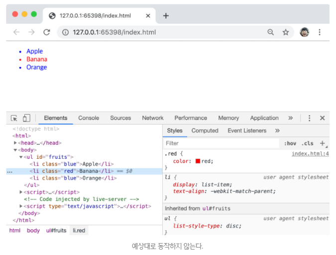
- 위 예제가 예상대로 동작하지 않은 이유를 알아보자.
- $elem.length는 3이므로 for 문의 코드 블록은 3번 반복된다.

`1. 첫 번째 반복(i === 0)`
- $elems[0]은 첫 번째 li 요소이다.
- 이 요소는 className 프로퍼티에 의해 class 값이 ‘red’에서 ‘blue’로 변경된다.
- 이때 첫 번째 li 요소는 class 값이 ‘red’에서 ‘blue’로 변경되었으므로 getElementsByClassName 메서드의 인자로 전달한 ‘red’와 더는 일치하지 않기 때문에 $elems에서 실시간으로 제거된다.
- 이처럼 HTMLCollection 객체는 실시간으로 노드 객체의 상태 변경을 반영하는 살아있는(live) DOM 컬렉션 객체이다.

`2. 두 번째 반복(i === 1)`
- 첫 번째 반복에서 첫 번째 li 요소는 $elems에서 제거되었다.
- 따라서 $elems[1]은 세 번째 li 요소이다.
- 이 세 번째 li 요소의 class 값도 ‘blue’로 변경되고 마찬가지로 HTMLCollection 객체인 $elems에서 실시간으로 제외된다.

`3. 세 번째 반복(i === 2)`
- 첫 번째, 두 번째 반복에서 첫 번째, 세 번째 li 요소가 $elems에서 제거되었다.
- 따라서 $elems에는 두 번째 li 요소 노드만 남았다.
- 이때 $elems.length는 1이므로 for 문의 조건식이 false로 평가되어 반복이 종료된다.
- 따라서 $elems에 남아있는 두 번째 li 요소의 class 값은 변경되지 않는다.

- 이처럼 HTMLCollection 객체는 실시간으로 노드 객체의 상태 변경을 반영하여 요소를 제거할 수 있으므로 HTMLCollection 객체를 for 문으로 순회하면서 노드 객체의 상태를 변경해야 할 때 주의해야 한다.

- 이 문제는 for 문을 역방향으로 순회하는 방법으로 회피할 수 있다.
```javascript
for (let i = $elems.length - 1; i >= 0; i--) {
      $elems[i].className = 'blue';
}
```
- 또는 while 문을 사용하여 HTMLCollection 객체에 노드 객체가 남아있지 않을 때까지 무한 반복하는 방법으로 회피할 수 있다.
```javascript
let i = 0;
while ($elems.length > i) {
  $elems[i].className = 'blue';
}
```
- 더 간단한 해결책은 부작용을 발생시키는 원인인 `HTMLCollection 객체를 사용하지 않는 것이다.`
- 유사 배열 객체이면서 이터러블인 HTMLCollection 객체를 배열로 변환하면 부작용을 발생시키는 HTMLCollection 객체를 사용할 필요가 없고 유용한 배열의 고차함수를 사용할 수 있다.
```javascript
[...$elems].forEach(elem => { elem.className = 'blue'; });
```

##### NodeList
- HTMLCollection 객체의 부작용을 해결하기 위해 getElementsByTagName, getElementsByClassName 메서드 대신 querySelectorAll 메서드를 사용하는 방법도 있다.
- querySelectorAll 메서드는 DOM 컬렉션 객체인 `NodeList 객체를 반환한다.`
- 이때 NodeList 객체는 실시간으로 노드 객체의 상태 변경을 반영하지 않는(non-live) 객체이다.
```javascript
const $elems = document.querySelectorAll('.red');

$elems.forEach(elem => { elem.className = 'blue'; });
```
- NodeList.prototype.forEach 메서드는 Array.prototype.forEach 메서드와 사용방법이 동일하다.
- `NodeList.prototype.forEach 메서드는 forEach 메서드 외에도 item, entries, keys, values 메서드를 제공한다.`

- NodeList 객체는 대부분은 노드 객체의 상태 변경을 실시간으로 반영하지 않고 과거의 정적 상태를 유지하는 non-live 객체로 동작한다.
- 하지만 `childNodes 프로퍼티가 반환하는 NodeList 객체는 HTMLCollection 객체와 같이 실시간으로 노드 객체의 상태를 변경하는 live 객체로 동작하므로 주의가 필요하다.`
```html
<!DOCTYPE html>
<html>
<body>
  <ul id="fruits">
    <li>Apple</li>
    <li>Banana</li>
  </ul>
  <script>
    const $fruits = document.getElementById('fruits');
    console.log($fruits.childNodes); // NodeList(5) [text, li, text, li, text]

    const { childNodes } = $fruits;
    console.log(childNodes instanceof NodeList); // true

    for (let i = 0; i < childNodes.length; i++) {
      $fruits.removeChild(childNodes[i]);
    }

    console.log(childNodes); // NodeList(2) [li, li]
  </script>
</body>
</html>
```
- 이처럼 HTMLCollection이나 NodeList 객체는 예상과 다르게 동작할 때가 있어 다루기 까다롭고 실수하기 쉽다.
- 따라서 `노드 객체의 상태 변경과 상관없이 안전하게 DOM 컬렉션을 사용하려면 HTMLCollection이나 NodeList 객체를 배열로 변환하여 사용하는 것을 권장한다.`
- HTMLCollection과 NodeList 객체는 모두 유사 배열 객체이면서 이터러블이다.
- 따라서 `스프레드 문법`이나 `Array.from 메서드`를 사용하여 간단히 배열로 변환할 수 있다.
```html
<!DOCTYPE html>
<html>
<body>
  <ul id="fruits">
    <li>Apple</li>
    <li>Banana</li>
  </ul>
  <script>
    const $fruits = document.getElementById('fruits');

    const { childNodes } = $fruits;

    [...childNodes].forEach(childNode => {
      $fruits.removeChild(childNode);
    });

    console.log(childNodes); // NodeList []
  </script>
</body>
</html>
```

#### 노드 탐색
- 요소 노드를 취득한 다음, 취득한 요소 노드를 기점으로 DOM 트리의 노드를 옮겨 다니며 부모, 형제, 자식 노드 등을 탐색(traversing, node walking)해야 할 때가 있다.
```html
<ul id="fruits">
  <li class="apple">Apple</li>
  <li class="banana">Banana</li>
  <li class="orange">Orange</li>
</ul>
```
- DOM 트리 상의 노드를 탐색할 수 있도록 `Node, Element 인터페이스`는 트리 탐색 프로퍼티를 제공한다.
<br />

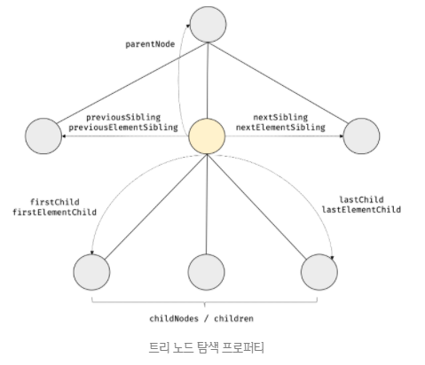

- `parentNode, previousSibling, firstChild, childNodes 프로퍼티는 Node.prototype이 제공`하고, `프로퍼티 키에 Element가 포함된 previousElementSibling, nextElementSibling과 children 프로퍼티는 Element.prototype이 제공`한다.

- 노드 탐색 프로퍼티는 모두 접근자 프로퍼티이다.
- 단, `노드 탐색 프로퍼티는 setter 없이 getter만 존재하여 참조만 가능한 읽기 전용 접근자 프로퍼티이다.`
- 읽기 전용 접근자 프로퍼티에 값을 할당하면 아무런 에러 없이 무시된다.
<br />

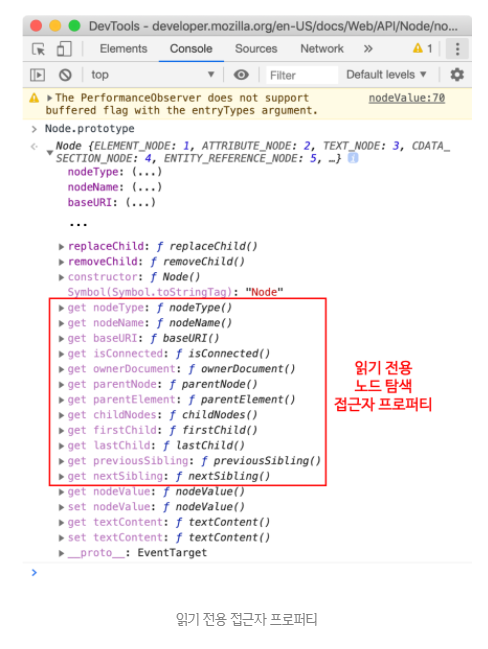

##### 공백 텍스트 노드
- HTML 요소 사이의 스페이스, 탭, 줄 바꿈(개행) 등의 공백(white space) 문자는 텍스트 노드를 생성한다.
- 이를 `공백 텍스트 노드`라 한다.
```html
<!DOCTYPE html>
<html>
<body>
  <ul id="fruits">
    <li class="apple">Apple</li>
    <li class="banana">Banana</li>
    <li class="orange">Orange</li>
  </ul>
</body>
</html>
```
- 위 HTML 문서는 파싱되어 다음과 같은 DOM을 생성한다.
<br />

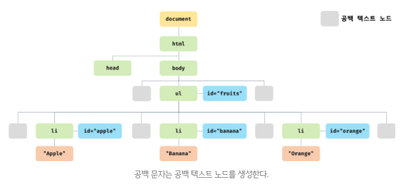

- 이처럼 HTML 문서의 공백 문자는 공백 텍스트 노드를 생성한다.
- 따라서 노드 탐색 시에는 공백 문자가 생성한 공백 텍스트 노드에 주의해야 한다.
- 다음돠 같이 인위적으로 HTML 문서의 공백 문자를 제거하면 공백 텍스트 노드가 생성되지 않는다.
- 하지만 가독성이 좋지 않으므로 권장하지 않는다.
```javascript
<ul id="fruits"><li 
  class="apple">Apple</li><li 
  class="banana">Banana</li><li 
  class="orange">Orange</li></ul>
```

##### 자식 노드 탐색
- 자식 노드를 탐색하기 위해서는 다음과 같은 노드 탐색 프로퍼티를 사용한다.
- 참고로, html 노드는 2개(head, body)의 자식 노드만 가질 수 있다.

| 프로퍼티                           | 설명                                                         |
| ---------------------------------- | ------------------------------------------------------------ |
| Node.prototype.childNodes          | 자식 노드를 모두 탐색하여 DOM 컬렉션 객체인 NodeList에 담아 반환한다. `childNodes 프로퍼티가 반환한 NodeList에는 요소 노드 뿐만 아니라 텍스트 노드도 포함되어 있을 수 있다.` |
| Element.prototype.children         | 자식 노드 중에서 요소 노드만 모두 탐색하여 DOM 컬렉션 객체인 HTMLCollection에 담아 반환한다. `children 프로퍼티가 반환한 HTMLCollection에는 텍스트 노드가 포함되지 않는다.` |
| Node.prototype.firstChild          | 첫 번째 자식 노드를 반환한다. firstChild 프로퍼티가 반환한 노드는 텍스트 노드이거나 요소 노드이다. |
| Node.prototype.lastChild           | 마지막 자식 노드를 반환한다. lastChild 프로퍼티가 반환한 노드는 텍스트 노드이거나 요소 노드이다. |
| Element.protype.firstElementChild  | 첫 번째 자식 요소 노드를 반환한다. firstElementChild 프로퍼티는 요소 노드만 반환한다. |
| Element.prototype.lastElementChild | 마지막 자식 요소 노드를 반환한다. lastElementChild 프로퍼티는 요소 노드만 반환한다. |


```html
<!DOCTYPE html>
<html>
<body>
  <ul id="fruits">
    <li class="apple">Apple</li>
    <li class="banana">Banana</li>
    <li class="orange">Orange</li>
  </ul>
    <script>
      const $fruits = document.getElementById('fruits');

      console.log($fruits.childNodes);
      // NodeList(7) [text, li.apple, text, li.banana, text, li.orange, text]

      console.log($fruits.children);
      // HTMLCollection(3) [li.apple, li.banana, li.orange]

      console.log($fruits.firstChild); // #text
      console.log($fruits.lastChild); // #text

      console.log($fruits.firstElementChild); // li.apple
      console.log($fruits.lastElementChild); // li.orange
    </script>
</body>
</html>
```

##### 자식 노드 존재 확인
- 자식 노드가 존재하는지 확인하려면 `Node.prototype.hasChildNodes` 메서드를 사용한다.
- hasChildNodes 메서드는 자식 노드가 존재하면 true, 자식 노드가 존재하지 않으면 false를 반환한다.
- 단, hasChildNodes 메서드는 텍스트 노드를 포함하여 자식 노드의 존재를 확인한다.

- 프로퍼티와 메서드 구별하는 방법: 프로퍼티는 동사가 없다.
- 메서드는 동사(has, set, get)이다.
```html
<!DOCTYPE html>
<html>
<body>
  <ul id="fruits">
  </ul>
    <script>
      const $fruits = document.getElementById('fruits');

      console.log($fruits.hasChildNodes()); // true
    </script>
</body>
</html>
```
- 자식 노드 중에서 텍스트 노드가 아닌 요소 노드가 존재하는지 확인하려면 children.length 또는 Element 인터페이스의 childElementCount 프로퍼티를 사용한다.
```html
<!DOCTYPE html>
<html>
<body>
  <ul id="fruits">
  </ul>
    <script>
      const $fruits = document.getElementById('fruits');

      // 추천
      console.log(!!$fruits.children.length); // false
      console.log(!!$fruits.childElementCount); // false
    </script>
</body>
</html>
```

##### 요소 노드의 텍스트 노드 탐색
- 요소 노드의 텍스트 노드는 요소 노드의 자식 노드이다.
- 따라서 요소 노드의 텍스트 노드는 firstChild 프로퍼티로 접근할 수 있다.
```html
<!DOCTYPE html>
<html>
<body>
  <div id="foo">Hello</div>
    <script>
      const $foo = document.getElementById('foo');
      console.log($foo.firstChild); // "Hello"
    </script>
</body>
</html>
```

##### 부모 노드 탐색
- 부모 노드를 탐색하려면 `Node.prototype.parentNode` 프로퍼티를 사용한다.
- 텍스트 노드는 DOM 트리의 최종단 노드인 리프 노드(leaf node)이므로 `부모 노드가 텍스트 노드인 경우는 없다.`
```html
<!DOCTYPE html>
<html>
<body>
  <ul id="fruits">
    <li class="apple">Apple</li>
    <li class="banana">Banana</li>
    <li class="orange">Orange</li>
  </ul>
  <script>
    const $banana = document.querySelector('.banana');
    console.log($banana.parentNode); // ul#fruits
  </script>
</body>
</html>
```

##### 형제 노드 탐색
- 부모 노드가 같은 형제 노드를 탐색하려면 다음과 같은 노드 탐색 프로퍼티를 사용한다.
- 단, 어트리뷰트 노드는 요소 노드와 연결되어 있지만, 부모 노드가 같은 형제 노드가 아니므로 반환되지 않는다.
- 즉, 아래 프로퍼티는 텍스트 노드 또는 요소 노드만 반환한다.

| 프로퍼티                                 | 설명                                                         |
| ---------------------------------------- | ------------------------------------------------------------ |
| Node.prototype.previousSibling           | 부모노드가 같은 형제노드 중에서 자신의 이전 형제노드를 탐색하여 반환한다. previousSibling 프로퍼티가 반환하는 형제노드는 요소노드뿐만 아니라 텍스트 노드일 수도 있다. |
| Node.prototype.nextSibling               | 부모노드가 같은 형제노드 중에서 자신의 다음 형제노드를 탐색하여 반환한다. nextSibling 프로퍼티가 반환하는 형제노드는 요소노드뿐만 아니라 텍스트  노드일 수 있다. |
| Element.prototype.previousElementSibling | 부모노드가 같은 형제 요소노드 중에서 자신의 이전 형제 요소노드를 탐색하여 반환한다. previousElementSibling 프로퍼티는 요소노드만 반환한다. |
| Element.prototype.nextElementSibling     | 부모노드가 같은 형제 요소노드 중에서 자신의 다음 형제 요소노드를 탐색하여 반환한다. nextElementSibling 프로퍼티는 요소노드만 반환한다. |

```html
<!DOCTYPE html>
<html>
<body>
  <ul id="fruits">
    <li class="apple">Apple</li>
    <li class="banana">Banana</li>
    <li class="orange">Orange</li>
  </ul>
  <script>
    const $fruits = document.getElementById('fruits');

    const { firstChild } = $fruits;
    console.log(firstChild); // #text

    const { nextSibling } = firstChild;
    console.log(nextSibling); // li.apple

    const { previousSibling } = nextSibling;
    console.log(previousSibling); // #text

    const { firstElementChild } = $fruits;
    console.log(firstElementChild); // li.apple

    const { nextElementSibling } = firstElementChild;
    console.log(nextElementSibling); // li.banana

    const { previousElementSibling } = nextElementSibling;
    console.log(previousElementSibling); // li.apple
  </script>
</body>
</html>
```

#### 노드 정보 취득
- 노드 객체에 대한 정보를 취득하려면 다음과 같은 노드 정보 프로퍼티를 사용한다.

| 프로퍼티                | 설명                                                         |
| ----------------------- | ------------------------------------------------------------ |
| Node.prototype.nodeType | 노드 객체의 종류, 즉 노드 타입을 나타내는 상수를 반환한다. 노드 타입 상수는 Node에 정의되어 있다.<br />- Node.ELEMENT_NODE: 요소 노드 타입을 나타내는 상수 1을 반환<br />- Node.TEXT_NODE: 텍스트 노드 타입을 나타내는 상수 3을 반환<br />- Node.DOCUMENT_NODE: 문서 노드 타입을 나타내는 상수 9를 반환 |
| Node.prototype.nodeName | 노드의 이름을 문자열로 반환한다.<br />- 요소 노드: 대문자 문자열로 태그 이름("UL", "LI" 등)을 반환<br />- 텍스트 노드: 문자열 "#text"를 반환<br />- 문서 노드: 문자열 "#document"를 반환 |

```html
<!DOCTYPE html>
<html>
<body>
  <div id="foo">Hello</div>
  <script>
    console.log(document.nodeType); // 9
    console.log(document.nodeName); // #document

    const $foo = document.getElementById('foo');
    console.log($foo.nodeType); // 1
    console.log($foo.nodeName); // DIV

    const $textNode = $foo.firstChild;
    console.log($textNode.nodeType); // 3
    console.log($textNode.nodeName); // #text
  </script>
</body>
</html>
```

#### 요소 노드의 텍스트 조작
##### nodeValue
- 지금까지 살펴본 노드 탐색, 노드 정보 프로퍼티는 모두 읽기 전용 접근자 프로퍼티이다.
- 지금 살펴볼 Node.prototype.nodeValue 프로퍼티는 setter와 getter 모두 존재하는 접근자 프로퍼티이다.
- 따라서 `nodeValue 프로퍼티는 참조와 할당 모두 가능하다.`

- 노드 객체의 nodeValue 프로퍼티를 참조하면 노드 객체의 값을 반환한다.
- 노드 객체의 값이란 텍스트 노드의 텍스트이다.
- 따라서 텍스트 노드가 아닌 노드, 즉 문서 노드나 요소 노드의 nodeValue 프로퍼티를 참조하면 null을 반환한다.
```html
<!DOCTYPE html>
<html>
<body>
  <div id="foo">Hello</div>
  <script>
    console.log(document.nodeValue); // null
    
    const $foo = document.getElementById('foo');
    console.log($foo.nodeValue); // null

    const $textNode = $foo.firstChild;
    console.log($textNode.nodeValue); // Hello
  </script>
</body>
</html>
```
- 텍스트 노드의 nodeValue 프로퍼티에 값을 할당하면 텍스트 노드의 값, 즉 텍스트를 변경할 수 있다.
- 따라서 요소 노드의 텍스트를 변경하려면 다음과 같은 순서의 처리가 필요하다.

1. 텍스트를 변경할 요소 노드를 취득한 다음, 취득한 요소 노드의 텍스트 노드를 탐색한다. 텍스트 노드는 요소 노드의 자식 노드이므로 firstChild 프로퍼티를 사용하여 탐색한다.
2. 탐색한 텍스트 노드의 nodeValue 프로퍼티를 사용하여 텍스트 노드의 값을 변경한다.
```html
<!DOCTYPE html>
<html>
<body>
  <div id="foo">Hello</div>
  <script>
    const $textNode = document.getElementById('foo').firstChild;
    $textNode.nodeValue = 'World';
    console.log($textNode); // "World"
  </script>
</body>
</html>
```

##### textContent
- Node.prototype.textContent 프로퍼티는 `setter와 getter 모두 존재하는 접근자 프로퍼티`로서 요소 노드의 텍스트와 모든 자손 노드의 텍스트를 모두 취득하거나 변경한다.

- 요소 노드의 textContent 프로퍼티를 참조하면 요소 노드의 콘텐츠 영역(시작 태그와 종료 태그 사이) 내의 텍스트를 모두 반환한다.
- 다시 말해, `요소 노드의 childNodes 프로퍼티가 반환한 모든 노드들의 텍스트 노드의 값, 즉 텍스트를 모두 반환한다.`
- 이때 `HTML 마크업은 무시된다.`
```html
<!DOCTYPE html>
<html>
<body>
  <div id="foo">Hello <span>world!</span></div>
  <script>
    console.log(document.getElementById('foo').textContent); // Hello world!
  </script>
</body>
</html>
```
<br />

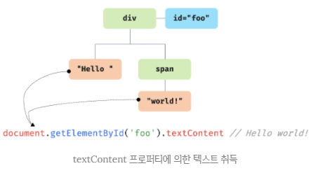

- nodeValue 프로퍼티를 사용하면 textContent 프로퍼티를 사용할 때와 비교해서 코드가 더 복잡하다.
```html
<!DOCTYPE html>
<html>
<body>
  <div id="foo">Hello <span>world!</span></div>
  <script>
    console.log(document.getElementById('foo').lastChild.firstChild.nodeValue);
    // world!
  </script>
</body>
</html>
```
- 만약 요소 노드의 콘텐츠 영역에 자식 요소 노드가 없고 텍스트만 존재한다면 firstChild.nodeValue와 textContent 프로퍼티는 같은 결과를 반환한다.
- 이 경우 textContent 프로퍼티를 사용하는 편이 코드가 더 간단하다.
```html
<!DOCTYPE html>
<html>
<body>
  <div id="foo">Hello</div>
  <script>
    const $foo = document.getElementById('foo');

    console.log($foo.firstChild.nodeValue === $foo.textContent); // true
  </script>
</body>
</html>
```
- 요소 노드의 textContent 프로퍼티에 문자열을 할당하면 요소 노드의 `모든 자식 노드가 제거되고` 할당한 문자열이 텍스트로 추가된다.
- 이때 할당한 문자열에 HTML 마크업이 포함되어 있더라도 문자열 그대로 인식되어 텍스트로 취급된다.
- `즉, HTML 마크업이 파싱되지 않는다.`
```html
<!DOCTYPE html>
<html>
<body>
  <div id="foo">Hello</div>
  <script>
    document.getElementById('foo').textContent = 'Hi <span>there!</span>';
    // Hi <span>there!</span>
  </script>
</body>
</html>
```
- 참고로 textContent 프로퍼티와 유사한 동작을 하는 `innerText 프로퍼티`가 있다.
- innerText 프로퍼티는 다음과 같은 이유로 사용하지 않는 것이 좋다.

1. `innerText 프로퍼티는 CSS에 순종적이다.` 예를 들어, innerText 프로퍼티는 CSS에 의해 비표시(visibility: hidden;)로 지정된 요소 노드의 텍스트를 반환하지 않는다.
2. innerText 프로퍼티는 CSS를 고려해야 하므로 textContent 프로퍼티보다 느리다.

#### DOM 조작
- DOM 조작(DOM manipulation)은 새로운 노드를 생성하여 DOM에 추가하거나 기존 노드를 삭제 또는 교체하는 것을 말한다.
- DOM 조작으로 DOM에 새로운 노드가 추가되거나 삭제되면 `리플로우와 리페인트`가 발생하는 원인이 되므로 성능에 영향을 준다.
- 따라서 복잡한 콘텐츠를 다루는 DOM 조작은 성능 최적화를 위해 주의해서 다루어야 한다.

##### innerHTML
- `Element.prototype.innerHTML 프로퍼티`는 `setter와 getter 모두 존재하는 접근자 프로퍼티`로서 요소 노드의 HTML 마크업을 취득하거나 변경한다.
- 요소 노드의 innerHTML 프로퍼티를 참조하면 요소 노드의 콘텐츠 영역(시작 태그와 종료 태그 사이) 내에 포함된 마크업을 `문자열로 반환한다.`
```html
<!DOCTYPE html>
<html>
<body>
  <div id="foo">Hello <span>world!</span></div>
  <script>
    // 콘텐츠 영역 내의 HTML 마크업을 문자열로 취득한다.
    console.log(document.getElementById('foo').innerHTML);
    // Hello <span>world!</span>
  </script>
</body>
</html>
```
- 앞서 살펴본 `textContent 프로퍼티를 참조하면 HTML 마크업을 무시하고 텍스트만 반환`하지만 `innerHTML 프로퍼티는 HTML 마크업이 포함된 문자열을 그대로 반환한다.`
<br />

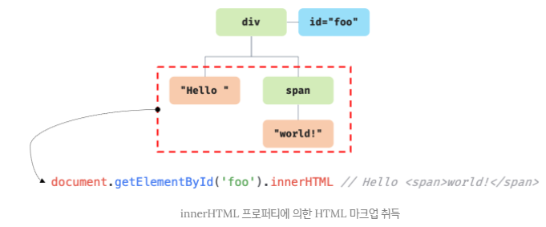

- 요소 노드의 innerHTML 프로퍼티에 문자열을 할당하면 요소 노드의 모든 자식 노드가 `제거되고` 할당한 문자열에 포함된 `HTML 마크업이 파싱되어` 요소 노드의 자식 노드로 DOM에 반영된다.
```html
<!DOCTYPE html>
<html>
<body>
  <div id="foo">Hello <span>world!</span></div>
  <script>
    document.getElementById('foo').innerHTML = 'Hi <span>there!</span>';
    // Hi there!
  </script>
</body>
</html>
```
```html
<!DOCTYPE html>
<html>
<body>
  <ul id="fruits">
    <li class="apple">Apple</li>
  </ul>
  <script>
    const $fruits = document.getElementById('fruits');

    // 노드 추가
    $fruits.innerHTML += '<li class="banana">Banana</li>';

    // 노드 교체
    $fruits.innerHTML = '<li class="orange">Orange</li>';

    // 노드 삭제
    $fruits.innerHTML = '';
  </script>
</body>
</html>
```
- 요소 노드의 innerHTML 프로퍼티에 할당한 HTML 마크업 문자열은 렌더링 엔진에 의해 파싱되어 요소 노드의 자식으로 DOM에 반영된다.
- 이때 사용자로부터 입력받은 데이터(untrusted input data)를 그대로 innerHTML 프로퍼티에 할당하는 것은 `크로스 사이트 스크립팅 공격(XSS: Cross-Site Scripting Attacks)`에 취약하므로 위험하다.
- HTML 마크업 내에 자바스크립트 악성 코드가 포함되어 있다면 파싱 과정에서 그대로 실행될 가능성이 있기 때문이다.

- innerHTML 프로퍼티로 스크립트 태그를 삽입하여 자바스크립트가 실행되도록 하는 예제를 살펴보자.
```html
<!DOCTYPE html>
<html>
<body>
  <div id="foo">Hello</div>
  <script>
    // HTML5는 innerHTML 프로퍼티로 삽입된 script 요소 내의 자바스크립트 코드를 실행하지 않는다.
    document.getElementById('foo').innerHTML 
      = '<script>alert(document.cookie)</script>';
  </script>
</body>
</html>
```
- 브라우저를 끄고 다시 접속하면 다시 로그인을 해야한다.
- 다시 로그인을 하지 않으려면 클라이언트는 로그인을 한 사용자라는 정보를 가지고 있어야 한다.
- 그리고 그 정보를 서버에게 전달해야 한다.
- 그 로그인 정보가 쿠키파일에 존재한다.
- 예전에는 그 쿠키파일을 털면 아이디, 패스워드가 들어있는 경우가 있었다.
- innerHTML에 script 태그 내에 쿠키를 넣으면 그 쿠키파일을 내 서버로 보낼 수 있다.
- 모던 자바스크립트 엔진은 할당 자체를 막아버린다.

- HTML5는 innerHTML 프로퍼티로 삽입된 script 요소 내의 자바스크립트 코드를 실행하지 않는다.
- 따라서 HTML5를 지원하는 브라우저에서 위 예제는 동작하지 않는다.
- 하지만 script 요소 없이도 크로스 사이트 스크립트 공격은 가능하다.
- 다음의 간단한 크로스 사이트 스크립트 공격은 모든 브라우저에서도 동작한다.
```html
<!DOCTYPE html>
<html>
<body>
  <div id="foo">Hello</div>
  <script>
    // 에러 이벤트를 강제로 발생시켜서 자바스크립트 코드가 실행되도록 한다.
    document.getElementById('foo').innerHTML
      = '';
  </script>
</body>
</html>
```
- 이처럼 innerHTML 프로퍼티를 사용한 DOM 조작은 구현이 간단하고 직관적이라는 장점이 있지만 크로스 사이트 스크립팅 공격에 취약한 단점도 있다.

##### HTML 새니티제이션
- `HTML 새니티제이션(HTML sanitization)`은 사용자로부터 입력받은 데이터(untrusted input data)에 의해 발생할 수 있는 크로스 사이트 스크립팅 공격을 예방하기 위해 잠재적 위험을 제거하는 기능을 말한다.
- 새니티제이션 함수를 직접 구현할 수도 있겠지만 DOMPurify 라이브러리를 사용하는 것을 권장한다.
- DOMPurify는 다음과 같이 잠재적 위험을 내포한 HTML 마크업을 새니티제이션(살균)하여 잠재적으로 위험을 제거한다.(자바스크립트 코드를 제거)
- `DOMPurify.sanitize(''); // => `
- DOMPurify는 2014년 2월부터 제공하기 시작했으므로 어느 정도 안정성이 보장된 새니티제이션 라이브러리라고 할 수 있다.

- innerHTML 프로퍼티의 또 다른 단점은 요소 노드의 innerHTML 프로퍼티에 HTML 마크업 문자열을 할당하는 경우 `요소 노드의 모든 자식 노드를 제거하고` 할당한 HTML 마크업 문자열을 파싱하여 DOM을 변경한다는 것이다.
```html
<!DOCTYPE html>
<html>
<body>
  <ul id="fruits">
    <li class="apple">Apple</li>
  </ul>
  <script>
    const $fruits = document.getElementById('fruits');

    $fruits.innerHTML += '<li class="banana">Banana</li>';
  </script>
</body>
</html>
```
- #fruits 요소의 모든 자식 요소(li.apple)를 제거하고 새롭게 요소 노드 li.apple와 li.banana를 생성하여 #fruits 요소의 자식 요소로 추가한다.
- 아래 코드는 위 코드의 축약 표현이다.
```javascript
$fruit.innerHTML = $fruit.innerHTML + '<li class="banana">Banana</li>';
```
- 이처럼 innerHTML 프로퍼티에 HTML 마크업 문자열을 할당하면 유지되어도 좋은 기존의 자식 노드까지 모두 제거하고 다시 처음부터 새롭게 자식 노드를 생성하여 DOM에 반영한다.
- 이는 효율적이지 않다.

- innerHTML 프로퍼티의 단점은 이뿐만이 아니다.
- innerHTML 프로퍼티는 새로운 요소를 삽입할 때 삽입될 위치를 지정할 수 없다는 단점도 있다.
```html
<ul id="fruits">
  <li class="apple">Apple</li>
  <li class="orange">Orange</li>
</ul>
```
- li.apple 요소와 li.orange 요소 사이에 새로운 요소를 삽입하고 싶은 경우 innerHTML 프로퍼티를 사용하면 삽입 위치를 지정할 수 없다.
- 이처럼 innerHTML 프로퍼티는 복잡하지 않은 요소를 새롭게 추가할 때는 유용하지만 기존 요소를 제거하지 않으면서 위치를 지정해 새로운 요소를 삽입해야 할 때는 사용하지 않는 것이 좋다.


##### insertAdjacentHTML 메서드
- `Element.prototype.insertAdjacentHTML(position, DOMString)` 메서드는 `기존 요소를 제거하지 않으면서 위치를 지정해 새로운 요소를 삽입`한다.

- insertAdjacentHTML 메서드는 두 번째 인수로 전달한 HTML 마크업 문자열(DOMString)을 파싱하고 그 결과로 생성된 노드를 첫 번째 인수로 전달한 위치(position)에 삽입하여 DOM에 반영한다.
- 첫 번째 인수로 전달할 수 있는 문자열은 ‘beforebegin’, ‘afterbegin’, ‘beforeend’, ‘afterend’ 4가지이다.
<br />

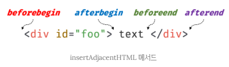

```html
<!DOCTYPE html>
<html>
<body>
  <div id="foo">text</div>
  <script>
    const $foo = document.getElementById('foo');

    $foo.insertAdjacentHTML('beforebegin', '<p>beforebegin</p>');
    $foo.insertAdjacentHTML('afterbegin', '<p>afterbegin</p>');
    $foo.insertAdjacentHTML('beforeend', '<p>beforeend</p>');
    $foo.insertAdjacentHTML('afterend', '<p>afterend</>');
    /*
    beforebegin
    afterbegin
    text
    beforeend
    afterend
    */
  </script>
</body>
</html>
```
- insertAdjacentHTML 메서드는 기존 요소에는 영향을 주지 않고 새롭게 삽입될 요소만을 파싱하여 자식 요소로 추가하므로 innerHTML 프로퍼티보다 효율적이다.
- 단, innerHTML 프로퍼티와 마찬가지로 insertAdjacentHTML 메서드는 `HTML 마크업 문자열을 파싱하므로 크로스 사이트 스크립팅 공격에 취약하다는 점은 동일하다.`

##### 노드 생성과 추가
- 지금까지 살펴본 innerHTML 프로퍼티와 insertAdjacentHTML 메서드는 HTML 마크업 문자열을 파싱하여 노드를 생성하고 DOM에 반영한다.
- DOM은 노드를 직접 생성/삽입/삭제/치환하는 메서드도 제공한다.
```html
<!DOCTYPE html>
<html>
<body>
  <ul id="fruits">
    <li>Apple</li>
  </ul>
  <script>
    const $fruits = document.getElementById('fruits');

    // 1. 요소 노드 생성
    const $li = document.createElement('li');
    // 2. 텍스트 노드 생성
    const textNode = document.createTextNode('Banana');

    // 3. 텍스트 노드를 $li 요소 노드의 자식 노드로 추가
    $li.appendChild(textNode);

    // 4. $li 요소 노드를 $fruits 요소 노드의 마지막 자식 노드로 추가
    $fruits.appendChild($li);
  </script>
</body>
</html>
```

- 위 예제처럼 요소 노드에 자식 노드가 하나도 없는 경우에는 텍스트 노드를 생성하여 요소 노드의 자식 노드를 추가하는 것보다 textContent 프로퍼티를 사용하는 편이 더욱 간편하다.
```html
<!DOCTYPE html>
<html>
<body>
  <ul id="fruits">
    <li>Apple</li>
  </ul>
  <script>
    const $fruits = document.getElementById('fruits');
    
    const $li = document.createElement('li');
    $li.textContent = 'banana';

    $fruits.appendChild($li);
  </script>
</body>
</html>
```
- 단, 요소 노드에 자식 노드가 있는 경우 요소 노드의 textContent 프로퍼티에 문자열을 할당하면 요소 노드의 모든 자식 노드가 제거되고 할당한 문자열이 텍스트 추가되므로 주의해야 한다.
<br />

[appendChild vs. append](https://dev.to/ibn_abubakre/append-vs-appendchild-a4m)

```javascript
$fruits.appendChild($li);
```
- 이 과정에서 비로소 새롭게 생성한 요소 노드가 DOM에 추가된다.
- 기존 DOM에 요소 노드를 추가하는 처리는 이 과정뿐이다.
- 위 예제는 단 하나의 요소 노드를 생성하여 DOM에 추가하므로 DOM은 한 번 변경된다.
- 이때 `리플로우와 리페인트`가 실행된다.

#### 복수의 노드 생성과 추가
- 여러 개의 요소 노드를 생성하여 DOM에 추가해보자.
```html
<!DOCTYPE html>
<html>
<body>
  <ul id="fruits"></ul>
  <script>
    const $fruits = document.getElementById('fruits');
    
    ['Apple', 'Banana', 'Orange'].forEach(text => {
      const $li = document.createElement('li');
      const textNode = document.createTextNode(text);

      $li.appendChild(textNode);
      $fruits.appendChild($li);
    });
  </script>
</body>
</html>
```
- 위 예제는 3개의 요소 노드를 생성하여 DOM에 3번 추가하므로 `DOM이 3번 변경된다.`
- 이때 `리플로우와 리페인트가 3번 실행된다.`
- DOM을 변경하는 것은 높은 비용이 드는 처리이므로 가급적 횟수를 줄이는 편이 성능에 유리하다.
- 따라서 위 예제와 같이 기존 DOM에 요소 노드를 반복해서 추가하는 것은 비효율적이다.

- 이처럼 DOM을 여러 번 변경하는 문제를 회피하기 위해 컨테이너 요소를 사용해보자.
```html
<!DOCTYPE html>
<html>
<body>
  <ul id="fruits"></ul>
  <script>
    const $fruits = document.getElementById('fruits');
    const $container = document.createElement('div');

    ['Apple', 'Banana', 'Orange'].forEach(text => {
      const $li = document.createElement('li');
      const textNode = document.createTextNode(text);

      $li.appendChild(textNode);
      $container.appendChild($li);
    });

    $fruits.appendChild($container);
  </script>
</body>
</html>
```
- 위 예제는 DOM을 한 번만 변경하므로 성능에 유리하기는 하지만 불필요한 컨테이너 요소(div)가 DOM에 추가되는 부작용이 있다.
- 이는 바람직하지 않다.

- 이러한 문제는 `DocumentFragment 노드`를 통해 해결할 수 있다.
- `DocumentFragment 노드`는 문서, 요소, 어트리뷰트, 텍스트 노드와 같은 노드 객체의 일종으로, `부모 노드가 없어서 기존 DOM과는 별도로 존재한다는 특징이 있다.`
- DocumentFragment 노드는 위 예제의 컨테이너 요소와 같이 자식 노드들의 부모 노드로서 별도의 서브 DOM을 구성하여 기존 DOM에 추가하기 위한 용도로 사용한다.

- `DocumentFragment 노드는 기존 DOM과는 별도로 존재하므로 DocumentFragment 노드에 자식 노드를 추가하여도 기존 DOM에는 어떠한 변경도 발생하지 않는다.`
- 또한, `DocumentFragment 노드를 DOM에 추가하면 자신은 제거되고 자신의 자식 노드만 DOM에 추가된다.`
<br />

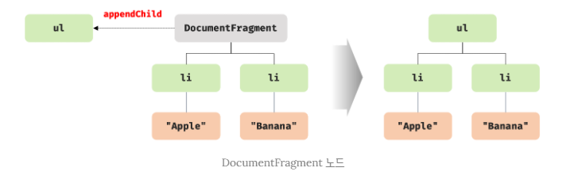

- `Document.prototype.createDocumentFragment` 메서드는 비어있는 DoumentFragment 노드를 생성하여 반환한다.
```html
<!DOCTYPE html>
<html>
<body>
  <ul id="fruits"></ul>
  <script>
    const $fruits = document.getElementById('fruits');
    const $fragment = document.createDocumentFragment();

    ['Apple', 'Banana', 'Orange'].forEach(text => {
      const $li = document.createElement('li');
      const textNode = document.createTextNode(text);

      $li.appendChild(textNode);
      $fragment.appendChild($li);
    });

    $fruits.appendChild($fragment);
  </script>
</body>
</html>
```
- 이때 실제로 `DOM 변경이 발생하는 것은 한 번뿐이며 리플로우와 리페인트도 한 번만 실행된다.`
- 따라서 여러 개의 요소 노드를 DOM에 추가하는 경우 `DocumentFragment 노드를 사용하는 것이 더 효율적이다.`

##### 노드 삽입
###### 마지막 노드로 추가
- Node.prototype.appendChild 메서드는 인수로 전달받은 노드를 자신을 호출한 노드의 마지막 자식 노드로 DOM에 추가한다.
- 이때 노드를 추가할 위치를 지정할 수 없고 `언제나 마지막 자식 노드로 추가한다.`

###### 지정한 위치에 노드 삽입
- `Node.prototype.insertBefore(newNode, childNode)` 메서드는 첫 번째 인수로 전달받은 노드를 두 번째 인수로 전달받은 노드 앞에 삽입한다.
```html
<!DOCTYPE html>
<html>
<body>
  <ul id="fruits">
    <li>Apple</li>
    <li>Banana</li>
  </ul>
  <script>
    const $fruits = document.getElementById('fruits');
    
    const $li = document.createElement('li');

    $li.appendChild(document.createTextNode('Orange'));

    // $li 요소 노드를 $fruits 요소 노드의 마지막 자식 요소 "앞에" 삽입
    $fruits.insertBefore($li, $fruits.lastElementChild);
    /*
    Apple
    Orange
    Banana
    */
  </script>
</body>
</html>
```
- 두 번째 인수로 전달받은 노드는 반드시 insertBefore 메서드를 호출한 노드의 자식 노드이어야 한다.
- 그렇지 않으면 DOMExcetion 에러가 발생한다.
```html
<!DOCTYPE html>
<html>
<body>
  <div>test</div>
  <ul id="fruits">
    <li>Apple</li>
    <li>Banana</li>
  </ul>
  <script>
    const $fruits = document.getElementById('fruits');
    
    const $li = document.createElement('li');

    $li.appendChild(document.createTextNode('Orange'));

    $fruits.insertBefore($li, document.querySelector('div'));
    // DOMException
  </script>
</body>
</html>
```
- 두 번째 인수로 전달받은 노드가 null이면 첫 번째 인수로 전달받은 노드를 insertBefore 메서드를 호출한 노드의 마지막 자식 노드로 추가된다.
- 즉, appendChild 메서드처럼 동작한다.
```html
<!DOCTYPE html>
<html>
<body>
  <ul id="fruits">
    <li>Apple</li>
    <li>Banana</li>
  </ul>
  <script>
    const $fruits = document.getElementById('fruits');
    
    const $li = document.createElement('li');

    $li.appendChild(document.createTextNode('Orange'));

    $fruits.insertBefore($li, null);
    /*
    Apple
    Banana
    Orange
    */
  </script>
</body>
</html>
```

##### 노드 이동
- DOM에 이미 존재하는 노드를 appendChild 또는 insertBefore 메서드를 사용하여 DOM에 다시 추가하면 현재 위치에서 노드를 제거하고 새로운 위치에 노드를 추가한다.
- 즉, 노드가 이동한다.
```html
<!DOCTYPE html>
<html>
<body>
  <ul id="fruits">
    <li>Apple</li>
    <li>Banana</li>
    <li>Orange</li>
  </ul>
  <script>
    const $fruits = document.getElementById('fruits');
    
    const [$apple, $banana, ] = $fruits.children;

    // 이미 존재하는 $apple 요소 노드를 $fruits 요소 노드의 마지막 노드로 이동
    $fruits.appendChild($apple); // Banana - Orange - Apple

    // 이미 존재하는 $banana 요소 노드를 $fruits 요소의 마지막 자식 노드 앞으로 이동
    $fruits.insertBefore($banana, $fruits.lastElementChild);
    // Orange - Banana - Apple
  </script>
</body>
</html>
```

##### 노드 복사
- `Node.prototype.cloneNode([deep: true | false])` 메서드는 노드의 사본을 생성하여 반환한다.
- 매개변수 deep에 `true를 전달하면 노드를 깊은 복사(deep copy)`하여 모든 자손 노드가 포함된 사본을 생성하고, `false를 인수로 전달하거나 생략하면 노드를 얕은 복사(shallow copy)`하여 노드 자신만의 사본을 생성한다.
- 얕은 복사로 생성된 요소 노드는 자손 노드를 복사하지 않으므로 텍스트 노드도 없다.
```html
<!DOCTYPE html>
<html>
<body>
  <ul id="fruits">
    <li>Apple</li>
  </ul>
  <script>
    const $fruits = document.getElementById('fruits');
    const $apple = $fruits.firstElementChild;

    const $shallowClone = $apple.cloneNode();
    $shallowClone.textContent = 'Banana';

    $fruits.appendChild($shallowClone);
    // Apple - Banana

    const $deepClone = $fruits.cloneNode(true);

    $fruits.appendChild($deepClone);
  </script>
</body>
</html>
```
<br />

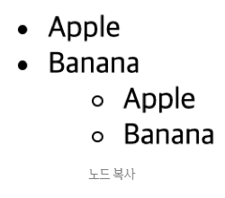

##### 노드 교체
- `Node.prototype.replaceChild(newChild, oldChild)` 메서드는 자신을 호출한 노드의 자식 노드를 다른 노드로 교체한다.
- 첫 번째 매개변수 newChild에는 교체할 새로운 노드를 인수로 전달하고, 두 번째 매개변수 oldChild에는 이미 존재하는 교체될 노드를 인수로 전달한다.
- oldChild 매개변수에 인수로 전달한 노드는 replaceChild 메서드를 호출한 노드의 자식 노드이어야 한다.

- 즉, replaceChild 메서드는 자신을 호출한 노드의 자식 노드인 oldChild 노드를 newChild 노드로 교체한다.
- 이때 oldChild 노드는 DOM에서 제거된다.
```html
<!DOCTYPE html>
<html>
<body>
  <ul id="fruits">
    <li>Apple</li>
  </ul>
  <script>
    const $fruits = document.getElementById('fruits');
    const $newChild = document.createElement('li');

    $newChild.textContent = 'Banana';

    $fruits.replaceChild($newChild, $fruits.firstElementChild);
    // Banana
  </script>
</body>
</html>
```

##### 노드 삭제
- `Node.prototype.removeChild(child)` 메서드는 child 매개변수에 인수로 전달한 노드를 DOM에서 삭제한다.
- 객체를 지우는 것이 아니라 연결을 끊겠다는 의미이다.
- 지우는 것은 가비지 컬렉터가 한다.

- 인수로 전달한 노드는 removeChild 메서드를 호출한 노드의 자식 노드이어야 한다.
```html
<!DOCTYPE html>
<html>
<body>
  <ul id="fruits">
    <li>Apple</li>
    <li>Banana</li>
  </ul>
  <script>
    const $fruits = document.getElementById('fruits');
    
    // #fruits 요소 노드의 마지막 요소를 DOM에서 삭제
    $fruits.removeChild($fruits.lastElementChild);
    // Apple
  </script>
</body>
</html>
```

#### 어트리뷰트
##### 어트리뷰트 노드와 attributes 프로퍼티
- HTML 문서의 구성 요소인 HTML 요소는 여러 개의 어트리뷰트(attribute, 속성)를 가질 수 있다.
- HTML 요소의 동작을 제어하기 위한 추가적인 정보를 제공하는 HTML 어트리뷰트는 HTML 요소의 시작 태그(start/opening tag)에 어트리뷰트 이름=“어트리뷰트 값” 형식으로 정의한다.
- 글로벌 어트리뷰트(id, class, style, title, lang, tabindex, draggable, hidden 등)와 이벤트 핸들러 어트리뷰트(onclick, onchange, onfocus, onblur, oninput, onkeypress, onkeyup, onmouseover, onsubmit, onload 등)는 모든 HTML 요소에서 공통적으로 사용할 수 있지만 특정 HTML 요소에만 한정적으로 사용 가능한 어트리뷰트도 있다.
- 예를 들면, id, class, style 어트리뷰트는 모든 HTML 요소에 사용할 수 있지만 type, value, checked 어트리뷰트는 input 요소에만 사용할 수 있다.

- HTML 문서가 파싱될 때 HTML 요소의 어트리뷰트는 어트리뷰트 노드로 변환되어 요소 노드와 연결된다.
- 이때 `HTML 어트리뷰트 당 하나의 어트리뷰트 노드가 생성된다.`
```html
<input id="user" type="text" value="jiwon">
```
- 즉, 위 input 요소는 3개의 어트리뷰트가 있으므로 3개의 어트리뷰트 노드가 생성된다.
- 이때 `모든 어트리뷰트 노드의 참조는 유사 배열 객체이자 이터러블인 NamedNodeMap 객체에 담겨서 요소 노드의 attributes 프로퍼티에 저장된다.`
<br />

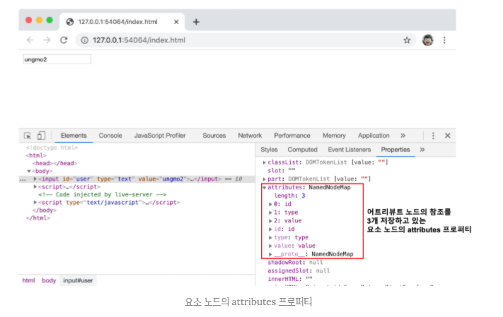

- 따라서 요소 노드의 모든 어트리뷰트 노드는 요소 노드의 `Element.prototype.attributes` 프로퍼티로 취득할 수 있다.
- attributes 프로퍼티는 `getter만 존재하는 읽기 전용 접근자 프로퍼티`이며, 요소 노드의 모든 어트리뷰트 노드의 참조가 담긴 NamedNodeMap 객체를 반환한다.
```html
<!DOCTYPE html>
<html>
<body>
  <input id="user" type="text" value="jiwon">
  <script>
    const { attributes } = document.getElementById('user');
    console.log(attributes);
    // NamedNodeMap {0: id, 1: type, 2: value, id: id, type: type, value: value, length: 3}

    console.log(attributes.id.value); // user
    console.log(attributes.type.value); // text
    console.log(attributes.value.value); // jiwon
  </script>
</body>
</html>
```

##### HTML 어트리뷰트 조작
- attributes.id.value와 같이 attributes 프로퍼티를 통해야만 HTML 어트리뷰트 값을 취득할 수 있어서 불편하다.

- `Element.prototype.getAttribute/setAttribute` 메서드를 사용하면 attributes 프로퍼티를 통하지 않고 요소 노드에서 메서드를 통해 직접 HTML 어트리뷰트 값을 취득하거나 변경할 수 있어서 편리하다.

- HTML 어트리뷰트 값을 참조하려면 `Element.prototype.getAttribute(attributeName)` 메서드를 사용하고, HTML 어트리뷰트 값을 변경하려면 `Element.prototype.setAttribute(attributeName, attributeValue)` 메서드를 사용한다.
```html
<!DOCTYPE html>
<html>
<body>
  <input id="user" type="text" value="jiwon">
  <script>
    const $input = document.getElementById('user');

    const inputValue = $input.getAttribute('value');
    console.log(inputValue); // jiwon

    $input.setAttribute('value', 'foo');
    console.log($input.getAttribute('value')); // foo
  </script>
</body>
</html>
```
- 특정 HTML 어트리뷰트가 존재하는지 확인하려면 `Element.prototype.hasAttribute(attributeName)` 메서드를 사용하고, 특정 HTML 어트리뷰트를 삭제하려면 `Element.prototype.removeAttribute(attributeName)` 메서드를 사용한다.
```html
<!DOCTYPE html>
<html>
<body>
  <input id="user" type="text" value="jiwon">
  <script>
    const $input = document.getElementById('user');

    if ($input.hasAttribute('value')) {
      $input.removeAttribute('value');
    }

    console.log($input.hasAttribute('value')); // false
  </script>
</body>
</html>
```

##### HTML 어트리뷰트 vs. DOM 프로퍼티
- 요소 노드 객체에는 HTML 어트리뷰트에 대응하는 프로퍼티가 존재한다.
- 이 DOM 프로퍼티들은 HTML 어트리뷰트 값을 초기값으로 가지고 있다.

- 예를 들어, `<input id="user" type="text" value="jiwon">` 요소가 파싱되어 생성된 요소 노드 객체에는 id, type, value 어트리뷰트에 대응하는 id, type, value 프로퍼티가 존재하며, 이 DOM 프로퍼티들은 HTML 어트리뷰트 값을 초기값으로 가지고 있다.
<br />

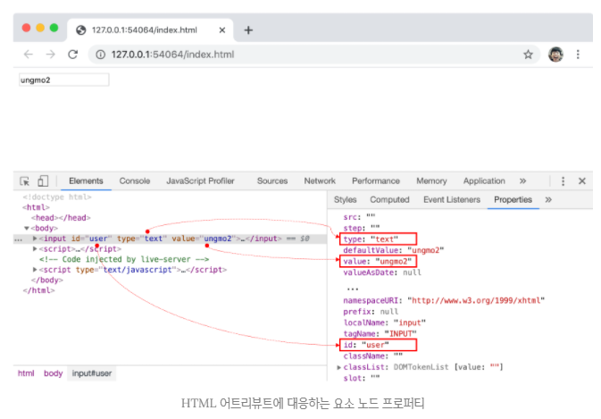

- `DOM 프로퍼티는 setter와 getter 모두 존재하는 접근자 프로퍼티`이다.
- 따라서 DOM 프로퍼티는 참조와 변경이 가능하다.
```html
<!DOCTYPE html>
<html>
<body>
  <input id="user" type="text" value="jiwon">
  <script>
    const $input = document.getElementById('user');

    $input.value = 'foo';
    console.log($input.value); // foo
  </script>
</body>
</html>
```
- 이처럼 HTML 어트리뷰트는 다음과 같이 DOM에서 중복 관리되고 있는 것처럼 보인다.
1. 요소 노드의 `attributes 프로퍼티`에서 관리하는 어트리뷰트 노드
2. HTML 어트리뷰트에 대응하는 `요소 노드의 프로퍼티(DOM 프로퍼티)`

- HTML 어트리뷰트의 역할은 HTML 요소의 초기 상태를 지정하는 것이다.
- `즉, HTML 어트리뷰트 값은 HTML 요소의 초기 상태를 의미하며 이는 변하지 않는다.`

- input 요소의 요소 노드가 생성되어 첫 렌더링이 끝난 시점까지 어트리뷰트 노드의 어트리뷰트 값과 요소 노드의 value 프로퍼티에 할당된 값은 HTML 어트리뷰트 값과 동일하다.
```html
<!DOCTYPE html>
<html>
<body>
  <input id="user" type="text" value="jiwon">
  <script>
    const $input = document.getElementById('user');

    // attributes 프로퍼티에 저장된 value 어트리뷰트 값
    console.log($input.getAttribute('value')); // jiwon

    // 요소 노드의 value 프로퍼티에 저장된 value 어트리뷰트 값
    console.log($input.value); // jiwon
  </script>
</body>
</html>
```
- 하지만 첫 렌더링 이후 사용자가 input 요소에 무언가를 입력하기 시작하면 상황이 달라진다.

- `요소 노드는 상태(state)를 가지고 있다.`
- 예를 들어, input 요소 노드나 checkbox 요소 노드가 가지고 있는 상태는 사용자 입력에 의해 변화하는, 살아있는 것이다.

- 사용자가 input 요소의 입력 필드에 “foo”라는 값을 입력한 경우를 생각해보자.
- 이때 input 요소 노드는 사용자 입력으로 변경된 `최신 상태`(“foo”)를 관리해야 하는 것은 물론, HTML 어트리뷰트로 지정한 `초기 상태`(“jiwon”)도 관리해야 한다.
- 초기 상태 값을 관리하지 않으면 웹 페이지를 처음 표시하거나 새로고침할 때 초기 상태를 표시할 수 없다.

- 이처럼 `요소 노드는 2개의 상태, 즉 초기상태와 최신상태를 관리해야 한다.`
- `요소 노드의 초기상태는 어트리뷰트 노드가 관리하며, 요소 노드의 최신상태는 DOM 프로퍼티가 관리한다.`

###### 어트리뷰트 노드
- `HTML 어트리뷰트로 지정한 HTML 요소의 초기상태는 어트리뷰트 노드에서 관리한다.`
- 어트리뷰트 노드가 관리하는 초기 상태 값을 취득하거나 변경하려면 `getAttribute/setAttribute 메서드`를 사용한다.
- HTML 요소에 지정한 어트리뷰트 값은 사용자 입력에 의해 변하지 않으므로 결과는 언제나 동일하다.

- setAttribute 메서드는 어트리뷰트 노드에서 관리하는 HTML 요소에 지정한 어트리뷰트 값, 즉 초기 상태 값을 변경한다.

###### DOM 프로퍼티
- `사용자가 입력한 최신 상태는 HTML 어트리뷰트에 대응하는 요소 노드의 DOM 프로퍼티가 관리한다.`
- `DOM 프로퍼티는 사용자의 입력에 의한 상태 변화에 반응하여 언제나 최신 상태를 유지한다.`

- DOM 프로퍼티에 값을 할당하는 것은 HTML 요소의 최신 상태 값을 변경하는 것을 의미한다.
- 즉, 사용자가 상태를 변경하는 행위와 같다.

- `단, 모든 DOM 프로퍼티가 사용자의 입력에 의해 변경되는 최신 상태를 관리하는 것은 아니다.`
- 예를 들어, id 어트리뷰트에 대응하는 id 프로퍼티는 사용자의 입력과 아무런 관계가 없다.
- 따라서 `사용자 입력에 의한 상태 변화와 관계없는 id 어트리뷰트와 id 프로퍼티는 사용자 입력과 관계없이 항상 동일한 값을 유지한다.`
- 즉, id 어트리뷰트 값이 변하면 id 프로퍼티 값도 변하고 그 반대도 마찬가지이다.
```html
<!DOCTYPE html>
<html>
<body>
  <input id="user" type="text" value="jiwon">
  <script>
    const $input = document.getElementById('user');

    // 사용자 입력에 의해 동적으로 변경된다.
    $input.oninput = () => {
      console.log('value 프로퍼티 값: ', $input.value);
    };

    console.log('value 어트리뷰트 값: ', $input.getAttribute('value'));
    // value 어트리뷰트 값:  jiwon
  </script>
</body>
</html>
```
- 이처럼 사용자 입력에 의한 상태 변화와 관계있는 DOM 프로퍼티만 최신 상태 값을 관리한다.
- 그 외의 사용자 입력에 의한 상태 변화와 관계없는 어트리뷰트와 DOM 프로퍼티는 항상 동일한 값으로 연동한다.

###### HTML 어트리뷰트와 DOM 프로퍼티의 대응 관계
- 대부분의 `HTML 어트리뷰트는 HTML 어트리뷰트 이름과 동일한 DOM 프로퍼티와 1:1 대응한다.`
- 단, 다음과 같이 HTML 어트리뷰트와 DOM 프로퍼티가 언제나 1:1로 대응하는 것은 아니며, HTML 어트리뷰트 이름과 DOM 프로퍼티 키가 반드시 일치하는 것도 아니다.

- id 어트리뷰트와 id 프로퍼티는 1:1 대응하며, 동일한 값으로 연동한다.
- input 요소의 value 어트리뷰트는 value 프로퍼티와 1:1 대응한다. 하지만, value 어트리뷰트는 초기상태를, value 프로퍼티는 최신 상태를 갖는다.
- `class 어트리뷰트는 className, classList 프로퍼티와 대응한다.`
- for 어트리뷰트는 htmlFor 프로퍼티와 1:1 대응한다.
- td 요소의 colspan 어트리뷰트는 대응하는 프로퍼티가 존재하지 않는다.
- textContent 프로퍼티는 대응하는 어트리뷰트가 존재하지 않는다.
- 어트리뷰트 이름은 대소문자를 구별하지 않지만, `대응하는 프로퍼티 키는 카멜케이스를 따른다.`(maxlength → maxLength)

###### DOM 프로퍼티 값의 타입
- getAttribute 메서드로 취득한 어트리뷰트 값은 언제나 문자열이다.
- 하지만 DOM 프로퍼티로 취득한 상태 값은 문자열이 아닐 수도 있다.
- 예를 들어, `checkbox 요소의 checked 어트리뷰트 값은 문자열이지만 checked 프로퍼티 값은 불리언 타입이다.`
```html
<!DOCTYPE html>
<html>
<body>
  <input type="checkbox" checked>
  <script>
    const $checkbox = document.querySelector('input[type=checkbox]');
    
    console.log($checkbox.getAttribute('checked')); // ''
    console.log($checkbox.checked); // true
  </script>
</body>
</html>
```

##### data 어트리뷰트와 dataset 프로퍼티
- data 어트리뷰트와 dataset 프로퍼티를 사용하면 HTML 요소에 정의한 `사용자 정의 어트리뷰트`와 자바스크립트 간에 데이터를 교환할 수 있다.
- data 어트리뷰트는 data-user-id, data-role과 같이 data- 접두사를 다음에 임의의 이름에 붙여 사용한다.
```html
<!DOCTYPE html>
<html>
<body>
  <ul class="user">
    <li id="1" data-user-id="7621" data-role="admin">Kim</li>
    <li id="2" data-user-id="9524" data-role="subscripter">Lee</li>
  </ul>
</body>
</html>
```
- data 어트리뷰트 값은 HTMLElement.dataset 프로퍼티로 취득할 수 있다.
- dataset 프로퍼티는 HTML 요소의 모든 data 어트리뷰트의 정보를 제공하는 `DOMStringMap 객체를 반환`한다.
- DOMStringMap 객체는 data 어트리뷰트의 data- 접두사 다음에 붙인 임의의 이름을 `카멜 케이스(camelCase)`로 변환한 프로퍼티를 가지고 있다.
- 이 프로퍼티로 data 어트리뷰트 값을 취득하거나 변경할 수 있다.
```html
<!DOCTYPE html>
<html>
<body>
  <ul class="user">
    <li id="1" data-user-id="7621" data-role="admin">Kim</li>
    <li id="2" data-user-id="9524" data-role="subscripter">Lee</li>
  </ul>
  <script>
    const users = [...document.querySelector('.user').children];
    
    const user = users.find(user => user.dataset.userId === '7621');
    console.log(user.dataset.role); // admin

    user.dataset.role = 'subscripber';
    console.log(user.dataset);
    // DOMStringMap {userId: "7621", role: "subscriber"}
  </script>
</body>
</html>
```
- data 어트리뷰트의 data- 접두사 다음에 존재하지 않는 이름을 키로 사용하여 dataset 프로퍼티에 값을 할당하면 HTML 요소에 data 어트리뷰트가 추가된다.
- 이때 data 프로퍼티에 추가한 카멜케이스의 프로퍼티 키는 data 어트리뷰트의 data- 접두사 다음에 `케밥케이스`로 자동 변경되어 추가된다. 
```html
<!DOCTYPE html>
<html>
<body>
  <ul class="user">
    <li id="1" data-role="admin">Kim</li>
    <li id="2" data-role="subscripter">Lee</li>
  </ul>
  <script>
    const users = [...document.querySelector('.user').children];
    
    const user = users.find(user => user.dataset.role === 'admin');

    user.dataset.userId = '7621';
    console.log(user.dataset);
    // DOMStringMap {role: "admin", userId: "7621"}
    // <li id="1" data-role="admin" data-user-id="7621">Kim</li>
  </script>
</body>
</html>
```

#### 스타일
##### 인라인 스타일 조작
- `HTMLElement.prototype.style` 프로퍼티는 setter와 getter 모두 존재하는 접근자 프로퍼티로서 요소 노드의 `인라인 스타일(inline style)`을 취득하거나 추가 또는 변경한다.
```html
<!DOCTYPE html>
<html>
<body>
  <div style="color: red">Hello World!</div>
  <script>
    const $div = document.querySelector('div');

    console.log($div.style); // CSSStyleDeclaration { 0: "color", ... }

    $div.style.color = 'blue';

    $div.style.width = '100px';
    $div.style.height = '100px';
    $div.style.backgroundColor = 'yellow';
  </script>
</body>
</html>
```
- style 프로퍼티를 참조하면 `CSSStyleDeclaration 타입의 객체를 반환`한다.
- CSSStyleDeclaration 객체는 다양한 CSS 프로퍼티에 대응하는 프로퍼티를 가지고 있으며, 이 프로퍼티에 값을 할당하면 해당 CSS 프로퍼티가 인라인 스타일로 HTML 요소에 추가되거나 변경된다.

- `CSS 프로퍼티는 케밥 케이스(kabab-case)`를 따른다.
- 이에 대응하는 `CSSStyleDeclaration 객체의 프로퍼티는 카멜 케이스`를 따른다.
- 예를 들어, CSS 프로퍼티 `background-color`에 대응하는 CSSStyleDeclaration 객체의 프로퍼티는 `backgroundColor`이다.
```javascript
$div.style.backgroundColor = 'yellow';
```
- 케밥 케이스의 CSS 프로퍼티를 그대로 사용하려면 대괄호 표기법을 사용한다.
```javascript
$div.style[‘background-color’] = 'yellow';
```
- 단위 지정이 필요한 CSS 프로퍼티의 값은 반드시 단위를 지정해야 한다.
- 예를 들어 px, em, % 등의 크기 단위가 필요한 width 프로퍼티에 값을 할당할 때 단위를 생략하면 해당 CSS 프로퍼티는 적용되지 않는다.
```javascript
$div.style.width = '100px';
```

##### 클래스 조작
- `.`으로 시작하는 클래스 선택자를 사용하여 CSS class를 미리 정의한 다음, HTML 요소의 class 어트리뷰트 값을 변경하여 HTML 요소의 스타일을 변경할 수도 있다.
- 이때 HTML 요소의 class 어트리뷰트를 조작하려면 class 어트리뷰트에 대응하는 요소 노드의 DOM 프로퍼티를 사용한다.

- 단, class 어트리뷰트에 대응하는 `DOM 프로퍼티는 class가 아니라 className과 classList이다.`
- 자바스크립트에서 `class는 예약어이기 때문이다.`

```html
<!DOCTYPE html>
<html lang="ko">
<head>
</head>
<body>
  <div class="div" style="color: red">Hello World</div>
</body>
<script>
  const $div = document.querySelector('div');

  $div.className = 'abc';

  console.log($div.className); // abc
  console.log($div.getAttribute('class')); // abc

  console.log($div.class); // undefined
  console.log($div.getAttribute('className')); // null
</script>
</html>
```

###### className
- `Element.prototype.className` 프로퍼티는 setter와 getter 모두 존재하는 접근자 프로퍼티로서 HTML 요소의 class 어트리뷰트 값을 취득하거나 변경한다.

- 요소 노드의 className 어트리뷰트를 참조하면 class 어트리뷰트 값을 문자열로 반환하고, 요소 노드의 className 프로퍼티에 문자열을 할당하면 class 어트리뷰트 값을 할당한 문자열로 변경한다.
```html
<!DOCTYPE html>
<html>
<head>
  <style>
    .box {
      width: 100px;
      height: 100px;
      background-color: antiquewhite;
    }
    .red { color: red; }
    .blue { color: blue; }
  </style>
</head>
<body>
  <div class="box red">Hello World!</div>
  <script>
    const $box = document.querySelector('.box');
    console.log($box.className); // 'box red'

    // .box 요소의 class 어트리뷰트 값 중에서 'red'만 'blue'로 변경
    $box.className = $box.className.replace('red', 'blue');
  </script>
</body>
</html>
```
- className 프로퍼티는 문자열을 반환하므로 공백으로 구분된 여러 개의 클래스를 반환하는 경우 다루기가 불편하다.

###### classList
- `Element.prototype.classList` 프로퍼티는 class 어트리뷰트 정보를 담은 `DOMTokenList 객체를 반환`한다.
```html
<!DOCTYPE html>
<html>
<head>
  <style>
    .box {
      width: 100px;
      height: 100px;
      background-color: antiquewhite;
    }
    .red { color: red; }
    .blue { color: blue; }
  </style>
</head>
<body>
  <div class="box red">Hello World!</div>
  <script>
    const $box = document.querySelector('.box');

    // DOMTokenList 객체는 노드 객체의 상태를 실시간으로 반영하는 살아있는(live) 객체이다.
    console.log($box.classList);
    // // DOMTokenList(2) [length: 2, value: "box blue", 0: "box", 1: "blue"]

    $box.classList.replace('red', 'blue');
  </script>
</body>
</html>
```
- `DOMTokenList 객체는 class 어트리뷰트의 정보를 나타내는 컬렉션 객체로서 유사 배열 객체이면서 이터러블이다.`
- DOMTokenList 객체는 다음과 같이 유용한 메서드들을 제공한다.

- `add(...className)`
- add 메서드는 인수로 전달한 1개 이상의 문자열을 class 어트리뷰트 값으로 추가한다.
```javascript
$box.classList.add('foo'); // class="box red foo"
$box.classList.add('bar', 'baz'); // class="box red foo bar baz"
```

- `remove(...className)`
- remove 메서드는 인수 전달한 1개 이상의 문자열과 일치하는 클래스를 class 어트리뷰트에서 삭제한다.
- 인수로 전달한 문자열과 일치하는 클래스가 없으면 에러없이 무시한다.
```javascript
$box.classList.remove('foo'); // class="box red bar baz"
$box.classList.remove('bar', 'baz'); // class="box red"
$box.classList.remove('x'); // class="box red"
```

- `item(index)`
- item 메서드는 인수로 전달한 index에 해당하는 클래스를 class 어트리뷰트에서 반환한다.
- 예를 들어, index가 0이면 첫 번째 클래스를 반환하고 index가 1이면 두 번째 클래스를 반환한다.
```javascript
$box.classList.item(0); // "box"
$box.classList.item(1); // "red"
```

- `contains(className)`
- contains 메서드는 인수로 전달한 문자열과 일치하는 클래스가 class 어트리뷰트에 포함되어 있는지 확인한다.
```javascript
$box.classList.contains('box'); // true
$box.classList.contains('blue'); // false
```

- `replace(oldClassName, newClassName)`
- replace 메서드는 class 어트리뷰트에서 첫 번째 인수로 전달한 문자열을 두 번째 인수로 전달한 문자열로 변경한다.
```javascript
$box.classList.replace('red', 'blue'); // class="box blue"
```

- `toggle(className[, force])`
- toggle 메서드는 class 어트리뷰트에 인수로 전달한 문자열과 일치하는 클래스가 존재하면 제거하고, 없으면 추가한다.
```javascript
$box.classList.toggle('foo'); // class="box blue foo"
$box.classList.toggle('foo'); // class="box blue"
```
- 두 번째 인수로 불리언 값으로 평가되는 조건식을 전달할 수 있다.
- 이때 조건식의 평가 결과가 `true이면 class 어트리뷰트에 강제로 첫 번째 인수로 전달한 문자열을 추가`하고, `false이면 class 어트리뷰트에서 강제로 첫 번째 인수로 전달받은 문자열을 제거`한다.
```javascript
$box.classList.toggle('foo', true); // class="box blue foo"
$box.classList.toggle('foo', false); // class="box blue"
```
- 이 밖에도 DOMTokenList 객체는 forEach, entries, keys, values, supports 메서드를 제공한다.

##### 요소에 적용되어 있는 CSS 스타일 참조
- style 프로퍼티는 인라인 스타일만 반환한다.
- 따라서 클래스를 적용한 스타일이나 상속을 통해 암묵적으로 적용된 스타일은 style 프로퍼티로 참조할 수 없다.
- HTML 요소에 적용되어 있는 모든 CSS 스타일을 참조해야 할 경우 `getComputedStyle` 메서드를 사용한다.
- `getComputedStyle 메서드를 호출하면 reflow가 일어난다.`
- 따라서 꼭 필요한 경우만 사용하자.

- `window.getComputedStyle(element[, pseudo])` 메서드는 첫 번째 인수(element)로 전달한 요소 노드에 적용되어 있는 평가된 스타일을 `CSSStyleDeclaration 객체에 담아 반환`한다.
- 평가된 스타일(computed style)이란 요소 노드에 적용된 모든 스타일, 즉 링크 스타일, 임베딩 스타일, 인라인 스타일, 자바스크립트에서 적용한 스타일, 상속 스타일, 기본(user agent) 스타일 등 모든 스타일이 조합되어 최종적으로 적용된 스타일을 말한다.
```html
<!DOCTYPE html>
<html>
<head>
  <style>
    body {
      color: red;
    }
    .box {
      width: 100px;
      height: 50px;
      background-color: cornsilk;
      border: 1px solid black;
    }
  </style>
</head>
<body>
  <div class="box">Box</div>
  <script>
    const $box = document.querySelector('.box');

    const computedStyle = window.getComputedStyle($box);
    console.log(computedStyle); // CSSStyleDeclaration {...}

    // 임베딩 스타일
    console.log(computedStyle.width); // 100px
    console.log(computedStyle.height); // 50px
    console.log(computedStyle.backgroundColor); // rgb(255, 248, 220)
    console.log(computedStyle.border); // 1px solid rgb(0, 0, 0)

    // 상속 스타일
    console.log(computedStyle.color); // rgb(255, 0, 0)

    // 기본 스타일
    console.log(computedStyle.display); // block
  </script>
</body>
</html>
```
- getComputedStyle 메서드의 두 번째 인수(pseudo)로 ::after, ::before와 같은 의사(가상) 요소를 지정하는 문자열을 전달할 수 있다.
- 가상 요소가 아닌 일반 요소의 경우 두 번째 인수는 생략한다.
```html
<!DOCTYPE html>
<html>
<head>
  <style>
    .box::before {
      content: 'Hello';
    }
  </style>
</head>
<body>
  <div class="box">Box</div>
  <script>
    const $box = document.querySelector('.box');

    const computedStyle = window.getComputedStyle($box, '::before');
    console.log(computedStyle.content); // "Hello"
  </script>
</body>
</html>
```

#### DOM 표준
- HTML과 DOM 표준은 W3C(World Wide Web Consortium)과 WHATWG(Web Hypertext Application Technology Working Group)이라는 두 단체가 나름대로 협력하면서 공통된 표준을 만들어 왔다.

- 그런데 약 1년 전부터 두 단체가 서로 다른 결과물을 내놓기 시작했다.
- 별개의 HTML과 DOM 표준을 만드는 것은 이롭지 않으므로 2018년 4월부터 구글, 애플, 마이크로소프트, 모질라로 구성된 4개의 주류 브라우저 벤더사가 주도하는 WHATWG이 단일 표준을 내놓기로 두 단체가 합의했다.

- DOM은 현재 다음과 같이 4개의 레벨(버전)이 있다.

| 레벨        | 표준 문서 URL                          |
| ----------- | -------------------------------------- |
| DOM Level 1 | https://www.w3.org/TR/REC-DOM-Level-1  |
| DOM Level 2 | https://www.w3.org/TR/DOM-Level-2-Core |
| DOM Level 3 | https://www.w3.org/TR/DOM-Level-3-Core |
| DOM Level 4 | https://dom.spec.whatwg.org            |

</div> 
</details>

---