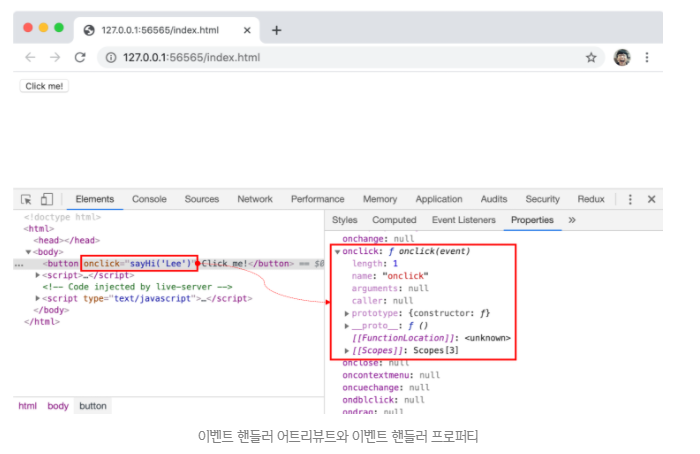
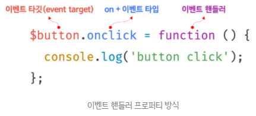
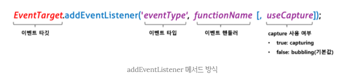
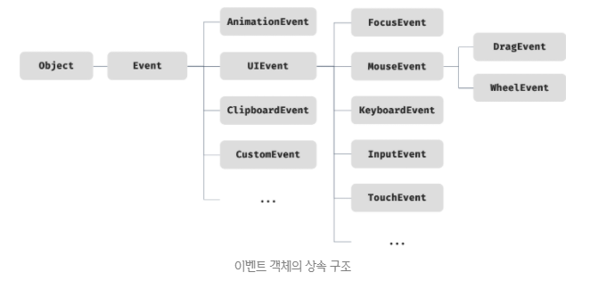
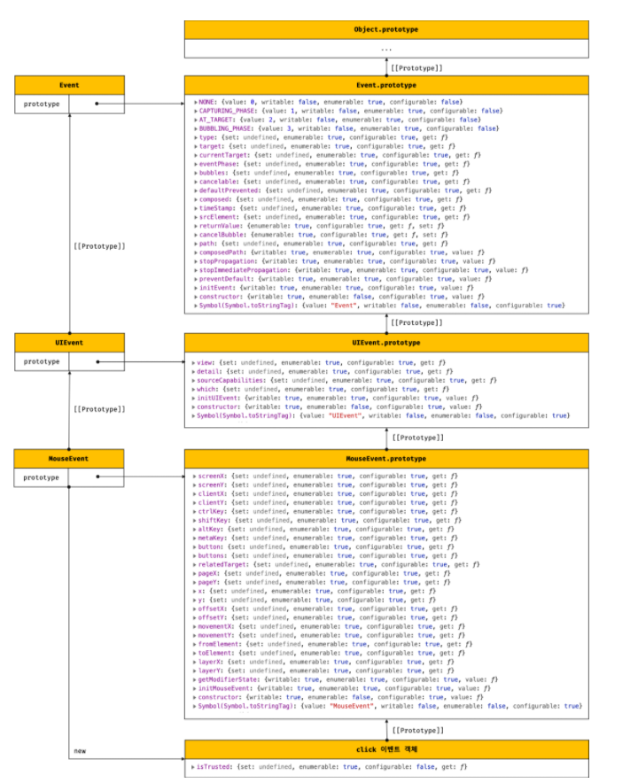
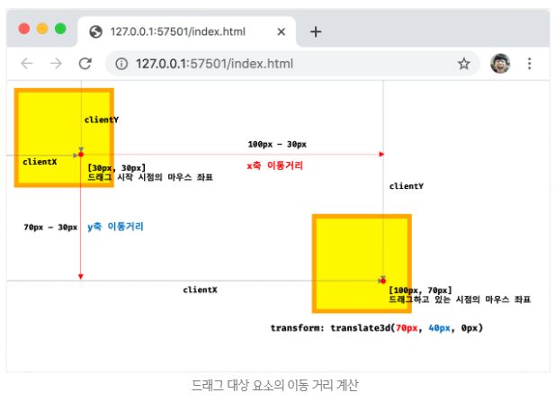
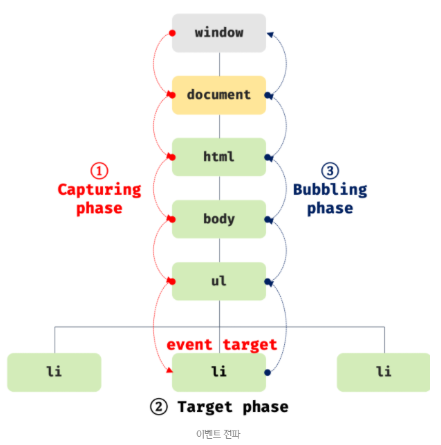

## JAVASCRIPT
<details open>
<summary>이벤트</summary>
<div markdown="40">

#### 이벤트 드리븐 프로그래밍
- HTML 뿐만아니라 XML, SVG도 DOM을 만드는데, 이들도 모두 EventTarget을 상속받는다.
- 따라서 이벤트를 사용할 수 있다.

- 브라우저는 처리해야 할 특정 사건이 발생하면 이를 감지하여 이벤트(event)를 발생(trigger)시킨다.
- 예를 들어, 클릭, 키보드 입력, 마우스 이동 등이 일어나면 브라우저는 이를 감지하여 특정한 타입의 이벤트를 발생시킨다.

- 만약 애플리케이션이 특정 타입의 이벤트에 대해 반응하여 어떤 일을 하고 싶다면 해당하는 타입의 이벤트가 발생했을 때 호출될 함수를 `브라우저에게 알려 호출을 위임한다.`
- 이때 이벤트가 발생했을 때 호출될 함수를 `이벤트 핸들러(event handler)`라 하고, 이벤트가 발생했을 때 브라우저에게 이벤트 핸들러의 호출을 위임하는 것을 `이벤트 핸들러 등록`이라 한다.

- 함수를 언제 호출할지 알 수 없으므로 개발자가 명시적으로 함수를 호출하는 것이 아니라 브라우저에게 함수 호출을 위임하는 것이다.
```html
<!DOCTYPE html>
<html>
<body>
  <button>Click me!</button>
  <script>
    const $button = document.querySelector('button');

    $button.onclick = () => { alert('button click'); };
  </script>
</body>
</html>
```
- Window, Document, HTMLElement 타입의 객체는 onclick과 같이 특정 이벤트에 대응하는 다양한 이벤트 핸들러 프로퍼티를 가지고 있다.
- 이 이벤트 핸들러 프로퍼티에 함수를 할당하면 해당 이벤트가 발생했을 때 할당한 함수가 브라우저에 의해 호출된다.

- 이벤트와 그에 대응하는 함수(이벤트 핸들러)를 통해 사용자와 애플리케이션은 상호작용(interaction)을 할 수 있다.
- 이처럼 프로그램의 흐름을 이벤트 중심으로 제어하는 프로그래밍 방식을 `이벤트 드리븐 프로그래밍(event-driven programming)`이라 한다.

#### 이벤트 타입(event type)
- 이벤트 타입은 이벤트의 종류를 나타내는 문자열이다.
- 네이티브 이벤트는 브라우저가 제공하는 이벤트이다.
- 예를 들어, 이벤트 타입 ‘click’은 사용자가 마우스 버튼을 클릭했을 때 발생하는 이벤트를 나타낸다.
- 이벤트 타입은 약 200여 가지가 있다.
- 다음에 소개하는 이벤트 타입은 사용 빈도가 높은 이벤트이다.
<br />
[이벤트 타입 상세 목록](https://developer.mozilla.org/ko/docs/Web/Events)

##### 마우스 이벤트
| 이벤트 타입 | 이벤트 발생 시점                                             |
| ----------- | ------------------------------------------------------------ |
| click       | 마우스 버튼을 클릭했을 때                                    |
| dbclick     | 마우스 버튼을 더블 클릭했을 때                               |
| mousedown   | 마우스 버튼을 눌렀을 때                                      |
| mouseup     | 누르고 있던 마우스 버튼을 놓았을 때                          |
| mousemove   | 마우스 커서를 움직였을 때                                    |
| mouseenter  | 마우스 커서를 HTML 요소 안으로 이동했을 때(버블링되지 않는다) |
| mouseover   | 마우스 커서를 HTML 요소 안으로 이동했을 때(버블링된다)       |
| mouseleave  | 마우스 커서를 HTML 요소 밖으로 이동했을 때(버블링되지 않는다) |
| mouseout    | 마우스 커서를 HTML 요소 밖으로 이동했을 때(버블링된다)       |

##### 키보드 이벤트
| 이벤트 타입 | 이벤트 발생 시점                                             |
| ----------- | ------------------------------------------------------------ |
| keydown     | 모든 키를 눌렀을 때 발생한다.<br />* control, option, shift, tab, delete, enter, 방향키와 문자, 숫자, 특수 문자 키를 눌렀을 때 발생한다. 단, 문자, 숫자, 특수 문자, enter 키를 눌렀을 때는 연속적으로 발생하지만 그 외의 키를 눌렀을 때는 한 번만 발생한다. |
| keypress    | 문자 키를 눌렀을 때 연속적으로 발생한다.<br />* control, option, shift, tab, delete, 방향 키 등을 눌렀을 때는 발생하지 않고 문자, 숫자, 특수 문자, enter 키를 눌렀을 때만 발생한다. 폐지(deprecated)되었으므로 사용하지 않을 것을 권장한다. |
| keyup       | 누르고 있던 키를 놓았을 때 한 번만 발생한다.<br />* keydown 이벤트와 마찬가지로 control, option, shift, tab, delete, enter, 방향키와 문자, 숫자, 특수 문자 키를 놓았을 때 발생한다. |

##### 포커스 이벤트
| 이벤트 타입 | 이벤트 발생 시점                                   |
| ----------- | -------------------------------------------------- |
| focus       | HTML 요소가 포커스를 받았을 때 (버블링되지 않는다) |
| blur        | HTML 요소가 포커스를 잃었을 때 (버블링되지 않는다) |
| focusin     | HTML 요소가 포커스를 받았을 때 (버블링된다)        |
| focusout    | HTML 요소가 포커스를 잃었을 때 (버블링된다)        |

##### 폼 이벤트
| 이벤트 타입 | 이벤트 발생 시점                                             |
| ----------- | ------------------------------------------------------------ |
| submit      | form 요소 내의 submit 버튼을 클릭했을 때                     |
| reset       | form 요소 내의 reset 버튼을 클릭했을 때 (최근에는 사용 안함) |

##### 값 변경 이벤트
| 이벤트 타입      | 이벤트 발생 시점                                             |
| ---------------- | ------------------------------------------------------------ |
| input            | input(text, checkbox, radio), select, textarea 요소의 값이 입력되었을 때 |
| change           | input(text, checkbox, radio), select, textarea 요소의 값이 변경되었을 때<br />* change 이벤트는 input 이벤트와는 달리 HTML 요소가 포커스를 잃었을 때 사용자 입력이 종료되었다고 인식하여 발생한다. 즉, 사용자가 입력을 하고 있을 때는 input 이벤트가 발생하고 사용자의 입력이 종료되어 값이 변경되면 change 이벤트가 발생한다. |
| readystatechange | HTML 문서의 로드와 파싱 상태를 나타내는 document.readyState 프로퍼티 값('loading', 'interactive', 'complete')이 변경될 때 |

##### DOM 뮤테이션 이벤트
| 이벤트 타입      | 이벤트 발생 시점                                            |
| ---------------- | ----------------------------------------------------------- |
| DOMContentLoaded | HTML 문서의 로드와 파싱이 완료되어 DOM 생성이 완료되었을 때 |

```html
<!DOCTYPE html>
<html>
<head>
  <style>
    .foo {
      width: 100px;
      height: 100px;
    }
  </style>
</head>
<body>
  <script>
    // onDOMContentLoaded는 없다. 따라서 반드시 addEventListener 메서드를 사용해야 한다.
    // load 이벤트는 window에서 캐치하지만, DOMContentLoaded 이벤트는 document에서 캐치하는 이벤트이다. 
    document.addEventListener('DOMContentLoaded', () => {
      document.querySelector('.foo').style.backgroundColor = 'red';
    });
  </script>
  <div class="foo"></div>
</body>
</html>
```

##### 뷰 이벤트
- 뷰 이벤트와 리소스 이벤트는 이벤트가 많이 발생하므로 주의하여 사용해야 한다.
- 쓰지 않는 것이 가장 좋은 방법이다.

| 이벤트 타입 | 이벤트 발생 시점                                             |
| ----------- | ------------------------------------------------------------ |
| resize      | 브라우저 윈도우(window)의 크기를 리사이즈할 때 연속적으로 발생한다.<br />* 오직 window 객체에서만 발생한다. |
| scroll      | 웹 페이지(document) 또는 HTML 요소를 스크롤할 때 연속적으로 발생한다. |

##### 리소스 이벤트
- img 요소에서도 이미지 파일이 모두 로드된 경우 load 이벤트가 발생한다.

| 이벤트 타입 | 이벤트 발생 시점                                             |
| ----------- | ------------------------------------------------------------ |
| load        | DOMContentLoaded 이벤트가 발생한 이후, 모든 리소스(이미지, 폰트)의 로딩이 완료되었을 때 (주로 window 객체에서 발생) |
| unload      | 리소스가 언로드될 때(주로 새로운 웹 페이지를 요청한 경우)    |
| abort       | 리소스 로딩이 중단되었을 때                                  |
| error       | 리소스 로딩이 실패했을 때                                    |

#### 이벤트 핸들러 등록
- `이벤트 핸들러(event handler 또는 event listener)는 이벤트가 발생했을 때 브라우저에 호출을 위임한 함수`이다.
- 다시 말해, 이벤트가 발생하면 브라우저에 의해 호출될 함수가 이벤트 핸들러이다.

- 이벤트가 발생했을 때 브라우저에게 이벤트 핸들러의 호출을 위임하는 것은 이벤트 핸들러 등록이라 한다.
- 이벤트 핸들러를 등록하는 방법은 3가지이다.

##### 이벤트 핸들러 어트리뷰트 방식
- HTML 요소의 어트리뷰트 중에는 이벤트에 대응하는 이벤트 핸들러 어트리뷰트가 있다.
- 이벤트 핸들러 어트리뷰트의 이름은 onclick과 같이 on 접두사와 이벤트의 종류를 나타내는 이벤트 타입으로 이루어져 있다.
- 이벤트 핸들러 어트리뷰트 값으로 함수 호출문 등의 문(statement)를 할당하면 이벤트 핸들러가 등록된다.
```html
<!DOCTYPE html>
<html>
<body>
  <button onclick="sayHi('Kim')">Click me!</button>
  <script>
    function sayHi(name) {
      console.log(`Hi! ${name}.`);
    }
  </script>
</body>
</html>
```
- 주의할 점은 이벤트 핸들러 어트리뷰트 값으로 함수 참조가 아닌 `함수 호출문 등의 문을 할당한다는 것`이다.
- 다음에 살펴볼 “이벤트 핸들러 프로퍼티 방식”에서는 DOM 노드의 이벤트 핸들러 프로퍼티에 함수 참조를 할당한다.

- 이벤트 핸들러 등록이란 함수 호출을 브라우저에게 위임하는 것이라 했다.
- 따라서 이벤트 핸들러를 등록할 때 콜백함수와 마찬가지로 함수 참조를 등록해야 브라우저가 이벤트 핸들러를 호출할 수 있다.
- 만약 함수 참조가 아니라 함수 호출문을 등록하면 함수 호출문의 평가 결과가 이벤트 핸들러로 등록된다.
- 함수를 반환하는 고차함수 호출문을 이벤트 핸들러로 등록한다면 문제가 없겠지만 함수가 아닌 값을 반환하는 함수 호출문을 이벤트 핸들러로 등록하면 브라우저가 이벤트 핸들러를 호출할 수 없다.

- 하지만 위 예제에서는 이벤트 핸들러 어트리뷰트 값으로 함수 호출문을 할당했다.
- 이때 `이벤트 핸들러 어트리뷰트 값은 사실 암묵적으로 생성될 이벤트 핸들러의 함수 몸체를 의미한다.`
- 즉, `onclick=“sayHi(‘Kim’)”` 어트리뷰트는 파싱되어 다음과 같은 함수를 암묵적으로 생성하고, 이벤트 핸들러 어트리뷰트 이름과 동일한 키 onclick 이벤트 핸들러 프로퍼티에 할당한다.
```javascript
function onclick(event) {
  sayHi(‘Kim’);
}
```
<br />



- 이처럼 동작하는 이유는 이벤트 핸들러에 `인수를 전달하기 위해서이다.`
- 결국, 이벤트 핸들러 어트리뷰트 값으로 할당한 문자열은 암묵적으로 이벤트 핸들러의 함수 몸체이다.
- 따라서 이벤트 핸들러 어트리뷰트 값으로 다음과 같이 여러 개의 문을 할당할 수 있다.
```javascript
<button onclick="console.log('Hi! '); console.log('Kim');">Click me!</button>
```
- 이벤트 핸들러 어트리뷰트 방식은 오래된 코드에서 간혹 이 방식을 사용한 것이 있어서 알아둘 필요는 있지만 더는 사용하지 않는 것이 좋다.
- HTML과 자바스크립트는 관심사가 다르므로 혼재하는 것보다 분리하는 것이 좋다.

- 하지만 모든 자바스크립트에서는 이벤트 핸들러 어트리뷰트 방식을 사용하는 경우가 있다.
- CBD(Component Based Development) 방식의 Angular/React/Svelte/Vue.js 같은 프레임워크/라이브러리에서는 이벤트 핸들러 어트리뷰트 방식으로 이벤트를 처리한다.
- CBD에서는 HTML, CSS, 자바스크립트를 관심사가 다른 개별적인 요소가 아닌, 뷰를 구성하기 위한 구성 요소로 보기 때문에 관심사가 다르다고 생각하지 않는다.
```javascript
<!-- Angular -->
<button (click)="handleClick($event)"Save></button>

{ /* React */}
<button onclick="{handleClick}">Save</button>

<!-- Svelte -->
<button on:click="{handleClick}">Save</button>

<!-- Vue.js -->
<button v-on:click="handleClick($event)">Save</button>
```

##### 이벤트 핸들러 프로퍼티 방식
- window 객체와 Document, HTMLElement 타입의 DOM 노드 객체는 이벤트에 대응하는 이벤트 핸들러 프로퍼티를 가지고 있다.
- 이벤트 핸들러 프로퍼티 키는 onclick과 같이 on 접두사와 이벤트 종류를 나타내는 이벤트 타입으로 이루어져 있다.
- 이벤트 핸들러 프로퍼티에 함수를 바인딩하면 이벤트 핸들러가 등록된다.
```html
<!DOCTYPE html>
<html>
<body>
  <button>Click me!</button>
  <script>
    const $btn = document.querySelector('button');

    $btn.onclick = function () {
      console.log('button click');
    };
  </script>
</body>
</html>
```
- 이벤트 핸들러를 등록하기 위해서는 이벤트를 발생시킬 객체인 `이벤트 타깃(event target)`과 이벤트의 종류를 나타내는 문자열인 `이벤트 타입(event type)` 그리고 `이벤트 핸들러`를 지정할 필요가 있다.
<br />



- 이벤트 핸들러는 대부분 이벤트를 발생시킬 이벤트 타깃에 바인딩한다.
- 하지만 반드시 이벤트 타깃에 이벤트 핸들러를 바인딩해야 하는 것은 아니다.
- `이벤트 핸들러는 이벤트 타깃 또는 전파된 이벤트를 캐치할 DOM 노드 객체에 바인딩한다.`

- 앞서 살펴본 “이벤트 핸들러 어트리뷰트 방식”도 결국 DOM 노드 객체의 이벤트 핸들러 프로퍼티로 변환되므로 결과적으로 이벤트 핸들러 프로퍼티 방식과 동일하다고 할 수 있다.
- “이벤트 핸들러 프로퍼티 방식”은 “이벤트 핸들러 어트리뷰트 방식”의 HTML과 자바스크립트가 뒤섞이는 문제를 해결할 수 있다.
- 하지만 `이벤트 핸들러 프로퍼티에 하나의 이벤트 핸들러만 바인딩할 수 있다는 단점이 있다.`
```html
<!DOCTYPE html>
<html>
<body>
  <button>Click me!</button>
  <script>
    const $btn = document.querySelector('button');

    // 첫 번째로 바인딩한 이벤트 핸들러는 두 번째로 바인딩한 이벤트 핸들러에 의해 재할당되어 실행되지 않는다.
    $btn.onclick = function () {
      console.log('button click 1');
    };

    $btn.onclick = function () {
      console.log('button click 2');
    };

    // button click 2
  </script>
</body>
</html>
```

##### addEventListener 메서드 방식
- DOM Level 2에서 도입된 `EventTarget.prototype.addEventListener` 메서드를 사용하여 이벤트 핸들러를 등록할 수 있다.
- 앞서 살펴본 “이벤트 핸들러 어트리뷰트 방식”과 “이벤트 핸들러 프로퍼티 방식”은 DOM Level 0부터 제공되던 방식이다.
<br />



- addEventListener 메서드의 첫 번째 매개변수에는 이벤트의 종류를 나타내는 문자열인 이벤트 타입을 전달한다.
- 이때 이벤트 핸들러 프로퍼티 방식과 달리 on 접두사를 붙이지 않는다.
- 두 번째 매개변수에는 이벤트 핸들러를 등록한다.
- 마지막 매개변수에는 이벤트를 캐치할 이벤트 전파 단계(캡쳐링 또는 버블링)를 지정한다.
- 생략하거나 false를 지정하면 버블링 단계에서 이벤트를 캐치하고, true를 지정하면 캡쳐링 단계에서 이벤트를 캐치한다.
```html
<!DOCTYPE html>
<html>
<body>
  <button>Click me!</button>
  <script>
    const $btn = document.querySelector('button');

    $btn.addEventListener('click', function () {
      console.log('button click');
    });
  </script>
</body>
</html>
```
- 이벤트 핸들러 프로퍼티 방식은 이벤트 핸들러 프로퍼티에 이벤트 핸들러를 바인딩하지만 `addEventListener 메서드는 이벤트 핸들러를 인수로 전달한다.`
- 만약 동일한 HTML 요소에서 발생한 동일한 이벤트에 대해 이벤트 핸들러 프로퍼티 방식과 addEventListener 메서드 방식을 모두 사용하여 이벤트 핸들러를 등록하면 어떻게 될까?
```html
<!DOCTYPE html>
<html>
<body>
  <button>Click me!</button>
  <script>
    const $btn = document.querySelector('button');

    $btn.onclick = function() {
      console.log('[이벤트 핸들러 프로퍼티 방식]button click');
    };

    $btn.addEventListener('click', function () {
      console.log('[addEventListener 메서드 방식]button click');
    });

    /*
    [이벤트 핸들러 프로퍼티 방식]button click
    [addEventListener 메서드 방식]button click
    */
  </script>
</body>
</html>
```
- `addEventListener 메서드 방식은 이벤트 핸들러 프로퍼티에 바인딩된 이벤트 핸들러에 아무런 영향을 주지 않는다.`
- 따라서 버튼 요소에서 클릭 이벤트가 발생하면 2개의 이벤트 핸들러가 모두 호출된다.

- 동일한 HTML 요소에서 발생한 동일한 이벤트에 대해 이벤트 핸들러 프로퍼티 방식은 하나 이상의 이벤트 핸들러를 등록할 수 없지만, `addEventListener 메서드는 하나 이상의 이벤트 핸들러를 등록할 수 있다.`
- 이때 이벤트 핸들러는 등록된 순서대로 호출된다.
```html
<!DOCTYPE html>
<html>
<body>
  <button>Click me!</button>
  <script>
    const $btn = document.querySelector('button');

    $btn.addEventListener('click', function () {
      console.log('[1]button click');
    });

    $btn.addEventListener('click', function () {
      console.log('[2]button click');
    });

    /*
    [1]button click
    [2]button click
    */
  </script>
</body>
</html>
```
- 단, addEventListener 메서드를 통해 참조가 동일한 이벤트 핸들러를 중복 등록하면 하나의 이벤트 핸들러만 등록된다.
```html
<!DOCTYPE html>
<html>
<body>
  <button>Click me!</button>
  <script>
    const $btn = document.querySelector('button');

    const handleClick = () => console.log('button click');

    // 참조가 동일한 이벤트 핸들러를 중복 등록하면 하나의 이벤트 핸들러만 등록된다.
    $btn.addEventListener('click', handleClick);
    $btn.addEventListener('click', handleClick);
    // button click
  </script>
</body>
</html>
```

#### 이벤트 핸들러 제거
- addEventListener 메서드로 등록한 이벤트 핸들러를 제거하려면 `EventTarget.prototype.removeEventListener` 메서드를 사용한다.
- removeEventListener 메서드에 전달할 인수는 addEventListener와 동일하다.
- 단, `addEventListener 메서드에 전달한 인수와 removeEventListener 메서드에 전달한 인수가 일치하지 않으면 이벤트 핸들러가 제거되지 않는다.`
```html
<!DOCTYPE html>
<html>
<body>
  <button>Click me!</button>
  <script>
    const $btn = document.querySelector('button');

    const handleClick = () => console.log('button click');

    $btn.addEventListener('click', handleClick);

    $btn.removeEventListener('click', handleClick); // 성공
    $btn.removeEventListener('click', handleClick, true); // 실패
  </script>
</body>
</html>
```
- removeEventListener 메서드에 인수로 전달한 이벤트 핸들러는 addEventListener 메서드에 인수로 전달한 이벤트 핸들러와 동일한 함수이어야 한다.
- 따라서 `무명 함수를 이벤트 핸들러로 등록한 경우 제거할 수 없다.`
- 이벤트 핸들러를 제거하려면 이벤트 핸들러의 참조를 변수나 자료구조에 저장하고 있어야 한다.
```javascript
$btn.addEventListener('click', () => console.log('button click'));
```
- 단, 기명 이벤트 핸들러 내부에서 removeEventListener 메서드를 호출하여 이벤트 핸들러를 제거하는 것은 가능하다.
```html
<!DOCTYPE html>
<html>
<body>
  <button>Click me!</button>
  <script>
    const $btn = document.querySelector('button');

    $btn.addEventListener('click', function foo() {
      console.log('button click');

      // 이벤트 핸들러를 제거한다. 따라서 이벤트 핸들러는 단 한 번만 호출된다.
      $btn.removeEventListener('click', foo);
    });
  </script>
</body>
</html>
```
- 기명 함수를 이벤트 핸들러로 등록할 수 없다면 호출된 함수, 즉 함수 자신을 가리키는 arguments.callee를 사용할 수도 있다.
```javascript
$btn.addEventListener('click', function () {
  console.log('button click');

  // 이벤트 핸들러를 제거한다. 따라서 이벤트 핸들러는 단 한 번만 호출된다.
  // arguments.callee는 호출된 함수, 즉 함수 자신을 가리킨다.
  $btn.removeEventListener('click', arguments.callee);
});
```
- arguments.callee는 코드 최적화를 방해하므로 strict mode에서 사용이 금지된다.
- 따라서 가급적 이벤트 핸들러의 참조를 변수나 자료구조에 저장하여 제거하는 편이 좋다.

- 이벤트 핸들러 프로퍼티 방식으로 등록한 이벤트 핸들러는 removeEventListener 메서드로 제거할 수 없다.
- `이벤트 핸들러 프로퍼티 방식으로 등록한 이벤트 핸들러를 제거하려면 이벤트 핸들러 프로퍼티에 null을 할당한다.`
```html
<!DOCTYPE html>
<html>
<body>
  <button>Click me!</button>
  <script>
    const $btn = document.querySelector('button');

    const handleClick = () => console.log('button click');

    $btn.onclick = handleClick;

    // removeEventListener 메서드로 이벤트 핸들러를 제거할 수 없다.
    $btn.removeEventListener('click', handleClick);

    // 이벤트 핸들러 프로퍼티에 null을 할당하여 이벤트 핸들러를 제거한다.
    $btn.onclick = null;
  </script>
</body>
</html>
```

#### 이벤트 객체
- 이벤트가 발생하면 이벤트에 관련한 다양한 정보를 담고 있는 이벤트 객체가 동적으로 생성된다.
- `생성된 이벤트 객체는 이벤트 핸들러의 첫 번째 인수로 전달된다.`
```html
<!DOCTYPE html>
<html>
<body>
  <p>클릭하세요. 클릭한 곳에 좌표가 표시됩니다.</p>
  <em class="msg"></em>
  <script>
    const $msg = document.querySelector('.msg');

    function showCoords(e) {
      $msg.textContent = `clientX': ${e.clientX}, clientY: ${e.clientY}`;
    }

    document.onclick = showCoords;
  </script>
</body>
</html>
```
- 클릭 이벤트에 의해 생성된 이벤트 객체는 이벤트 핸들러의 첫 번째 인수로 전달되어 매개변수 e에 암묵적으로 할당된다.
- 이는 `브라우저가 이벤트 핸들러를 호출할 때 이벤트 객체를 인수로 전달하기 때문이다.`
- 따라서 이벤트 객체를 전달받으려면 이벤트 핸들러를 정의할 때 이벤트 객체를 전달받을 매개변수를 명시적으로 선언해야 한다.
- 위 예제에서는 e라는 이름으로 매개변수를 선언했으나 다른 이름으로 사용해도 상관없다.

- 이벤트 핸들러 어트리뷰트 방식으로 이벤트 핸들러를 등록했다면 다음과 같이 event를 통해 이벤트 객체를 전달받을 수 있다.
```html
<!DOCTYPE html>
<html>
<head>
  <style>
    html, body { height: 100%; }
  </style>
</head>
<body onclick="showCoords(event)">
  <!-- 이벤트 핸들러 어트리뷰트 방식의 경우 event가 아닌 다른 이름으로 이벤트 객체를 전달받지 못한다. -->
  <p>클릭하세요. 클릭한 곳에 좌표가 표시됩니다.</p>
  <em class="msg"></em>
  <script>
    const $msg = document.querySelector('.msg');

    function showCoords(e) {
      $msg.textContent = `clientX': ${e.clientX}, clientY: ${e.clientY}`;
    }
  </script>
</body>
</html>
```
- 이벤트 핸들러 어트리뷰트 방식의 경우 이벤트 객체를 전달받으려면 이벤트 핸들러의 첫 번째 매개변수 이름이 `반드시 event이어야 한다.`
- 만약 event가 아닌 다른 이름으로 매개변수를 선언하면 이벤트 객체를 전달받지 못한다.
- 이벤트 핸들러 어트리뷰트 값은 사실 암묵적으로 생성되는 이벤트 핸들러의 함수 몸체를 의미하기 때문이다.
- 즉, `onclick=“showCoords(event)”` 어트리뷰트는 파싱되어 다음과 같은 함수를 암묵적으로 생성하여 onclick 이벤트 핸들러 프로퍼티에 할당한다.
```javascript
function onclick(event) {
  showCoords(event);
}
```
- 이때 암묵적으로 생성된 onclick 이벤트 핸들러의 첫 번째 매개변수의 이름이 `event로 암묵적으로 명명되기 때문에 event가 아닌 다른 이름으로는 이벤트 객체를 전달받지 못한다.`

##### 이벤트 객체의 상속 구조
- 이벤트가 발생하면 이벤트 타입에 따라 다양한 타입의 이벤트 객체가 생성된다.
- 이벤트 객체는 다음과 같은 상속 구조를 갖는다.
<br />



- 위 그림의 Event, UIEvent, MouseEvent 등 모두는 생성자 함수이다.
- 따라서 다음과 같이 생성자 함수를 호출하여 이벤트 객체를 생성할 수 있다.
```html
<!DOCTYPE html>
<html>
<body>
  <script>
    // Event 생성자 함수를 호출하여 foo 이벤트 타입의 Event 객체를 생성한다.
    let e = new Event('foo');

    console.log(e);
    // Event {isTrusted: false, type: "foo", target: null, ...}
    console.log(e.type); // foo
    console.log(e instanceof Event); // true
    console.log(e instanceof Object); // true

    e = new FocusEvent('focus');
    console.log(e);
    // FocusEvent {isTrusted: false, relatedTarget: null, view: null, ...}
    
    e = new MouseEvent('click');
    console.log(e);
    // MouseEvent {isTrusted: false, screenX: 0, screenY: 0, clientX: 0, ... }

    e = new KeyboardEvent('keyup');
    console.log(e);
    // KeyboardEvent {isTrusted: false, key: "", code: "", ctrlKey: false, ...}

    e = new InputEvent('change');
    console.log(e);
    // InputEvent {isTrusted: false, data: null, inputType: "", ...}
  </script>
</body>
</html>
```
- 이처럼 이벤트가 발생하면 암묵적으로 생성되는 이벤트 객체도 생성자 함수에 의해 생성된다.
- 그리고 이벤트 객체는 생성자 함수와 더불어 생성되는 프로토타입으로 구성된 프로토타입 체인의 일원이 된다.
- 예를 들어, click 이벤트가 발생하면 암묵적으로 생성되는 MouseEvent 타입의 이벤트 객체는 다음과 같은 프로토타입 체인의 일원이 된다.
<br />



- 이벤트 객체 중 일부는 사용자의 행위로 생성된 것이고 일부는 자바스크립트 코드에 의해 인위적으로 생성된 것이다.
- 예를 들어, `MouseEvent 타입의 이벤트 객체는 사용자가 마우스를 클릭하거나 이동했을 때 생성되는 이벤트 객체이며, CustomEvent 타입의 이벤트 객체는 자바스크립트 코드에 의해 인위적으로 생성한 이벤트 객체이다.`

- Event 인터페이스는 DOM 내에서 발생한 이벤트에 의해 생성되는 이벤트 객체를 나타낸다.
- `Event 인터페이스에는 모든 이벤트 객체의 공통 프로퍼티가 정의되어 있고,` FocusEvent, MouseEvent, KeyboardEvent, WheelEvent 같은 하위 인터페이스에는 이벤트 타입에 따라 고유한 프로퍼티가 정의되어 있다.
- 즉, 다음 예제와 같이 이벤트 객체의 프로퍼티는 발생한 이벤트의 타입에 따라 달라진다.
```html
<!DOCTYPE html>
<html>
<body>
  <input type="text">
  <input type="checkbox">
  <button>Click me!</button>
  <script>
    const $input = document.querySelector('input[type="text"]');
    const $checkbox = document.querySelector('input[type="checkbox"]');
    const $button = document.querySelector('button');

    // load 이벤트가 발생하면 Event 타입의 이벤트 객체가 생성된다.
    // load 이벤트보다 DOMContentLoaded 이벤트가 더 빠르다.
    window.onload = console.log;

    // change 이벤트가 발생하면 Event 타입의 이벤트 객체가 생성된다.
    $checkbox.onchange = console.log;

    // focus 이벤트가 발생하면 FocusEvent 타입의 이벤트 객체가 생성된다.
    $input.onfocus = console.log;

    // input 이벤트가 발생하면 InputEvent 타입의 이벤트 객체가 생성된다.
    $input.oninput = console.log;

    // keyup 이벤트가 발생하면 KeyboardEvent 타입의 이벤트 객체가 생성된다.
    $input.onkeyup = console.log;

    // click 이벤트가 발생하면 MouseEvent 타입의 이벤트 객체가 생성된다.
    $button.onclick = console.log;
  </script>
</body>
</html>
```

##### 이벤트 객체의 공통 프로퍼티
- Event 인터페이스, 즉 `Event.prototype에 정의된 이벤트 관련 프로퍼티는 UIEvent, CustomEvent, MouseEvent 등 모든 파생 이벤트 객체에 상속된다.`
- 즉, Event 인터페이스의 이벤트 관련 프로퍼티는 모든 이벤트 객체가 상속받는 공통 프로퍼티이다.
- 이벤트 객체의 공통 프로퍼티는 다음과 같다.

| 공통 프로퍼티    | 설명                                                         | 타입          |
| ---------------- | ------------------------------------------------------------ | ------------- |
| type             | 이벤트 타입                                                  | string        |
| target           | 이벤트를 발생시킨 DOM 요소                                   | DOM 요소 노드 |
| currentTarget    | 이벤트 핸들러가 바인딩된 DOM 요소                            | DOM 요소 노드 |
| eventPhase       | 이벤트 전파 단계<br />0: 이벤트 없음, 1: 캡처링 단계, 2: 타깃 단계, 3: 버블링 단계 | number        |
| bubbles          | 이벤트를 버블링으로 전파하는지 여부, 다음 이벤트는 bubbles: false로 버블링 하지 않는다.<br />- 포커스 이벤트 focus/blur<br />- 리소스 이벤트 load/unload/abort/error<br />- 마우스 이벤트 mouseenter/mouseleave | boolean       |
| cancelable       | preventDefault 메서드를 호출하여 이벤트의 기본 동작을 취소할 수 있는지 여부, 다음 이벤트는 cancelable: false로 취소할 수 없다.<br />- 포커스 이벤트 focus/blur<br />- 리소스 이벤트 load/unload/abort/error<br />- 마우스 이벤트 dbclick/mouseenter/mouseleave | boolean       |
| defaultPrevented | preventDefault 메서드를 호출하여 이벤트를 취소했는지 여부    | boolean       |
| isTrusted        | 사용자의 행위에 의해 발생한 이벤트인지 여부, 예를 들어 click 메서드 또는 dispatchEvent 메서드를 통해 인위적으로 발생시킨 이벤트인 경우 isTrusted는 false이다. | boolean       |
| timeStamp        | 이벤트가 발생한 시각(1970/01/01/00:00:00 부터 경과한 밀리초) | number        |

- 예를 들어, 체크박스 요소의 체크 상태가 변경되면 현재 체크 상태를 출력해보자.
```html
<!DOCTYPE html>
<html>
<body>
  <input type="checkbox">
  <em class="message">off</em>
  <script>
    const $checkbox = document.querySelector('input[type="checkbox"]');
    const $msg = document.querySelector('.message');

    // change 이벤트가 발생하면 Event 타입의 이벤트 객체가 생성된다.
    $checkbox.onchange = e => {
      console.log(Object.getPrototypeOf(e) === Event.prototype); // true
      
      // e.target은 change 이벤트를 발생시킨 DOM 요소 $change를 가리킨다.
      $msg.textContent = e.target.checked ? 'on' : 'off';
    };
  </script>
</body>
</html>
```
- 위 예제의 경우 이벤트를 발생시킨 DOM 요소와 이벤트 핸들러가 바인딩된 DOM 요소는 모두 $checkbox이다.
- 따라서 이벤트 객체의 target 프로퍼티와 currentTarget 프로퍼티는 동일한 객체 $checkbox를 가리킨다.
```javascript
console.log(e.target === e.currentTarget); // true
```
- 이처럼 일반적으로 이벤트 객체의 target 프로퍼티와 currentTarget 프로퍼티는 동일한 DOM 요소를 가리키지만, `이벤트 위임에서는 이벤트 객체의 target 프로퍼티와 currentTarget 프로퍼티가 서로 다른 DOM 요소를 가리킬 수 있다.`

##### 마우스 정보 취득
- click, dbclick, mousedown, mouseup, mousemove, mouseenter, mouseleave 이벤트가 발생하면 생성되는 MouseEvent 타입의 이벤트 객체는 다음과 같은 고유의 프로퍼티를 가진다.

- 마우스 포인터의 좌표 정보를 나타내는 프로퍼티: screenX/screenY, clientX/clientY, pageX/pageY, offsetX/offsetY
- 버튼 정보를 나타내는 프로퍼티: altKey, ctrlKey, shiftKey, button

- 예를 들어, DOM 요소를 드래그하여 이동시키는 예제를 만들어보자.
- 드래그는 마우스 버튼을 누른 상태에서 마우스를 이동하는 것으로 시작하고 마우스 버튼을 떼면 종료된다.
- 따라서 `드래그는 mousedown 이벤트가 발생한 상태에서 mousemove 이벤트가 발생한 시점에 시작하고 mouseup 이벤트가 발생한 시점에 종료한다.`

- 드래그 시작되면 드래그 시작 지점, 즉 mousedown 이벤트가 발생했을 때의 마우스 포인터 좌표와 드래그를 하는 시점, 즉 mousemove 이벤트가 발생할 때마다의 마우스 포인터 좌표를 비교하여 드래그 대상의 이동거리를 계산한다.

- mouseup 이벤트가 발생하면 드래그가 종료된 것이다.
- 이때 드래그 대상 요소를 이동시키는 이벤트 핸들러를 제거하여 이동을 멈춘다.
<br />



- MouseEvent 타입의 이벤트 객체의 마우스 포인터의 좌표 정보를 나타내는 프로퍼티 중에서 clientX/clientY는 뷰표트(viewport), 즉 웹 페이지의 가시 영역을 기준으로 마우스 포인터 좌표를 나타낸다.
```html
<!DOCTYPE html>
<html>
<head>
  <style>
    .box {
      width: 100px;
      height: 100px;
      background-color: #fff700;
      border: 5px solid orange;
      cursor: pointer;
    }
  </style>
</head>
<body>
  <div class="box"></div>
  <script>
    const $box = document.querySelector('.box');
    
    // 드래그 시작 지점의 마우스 포인터 위치
    // 예전 위치 기억
    const initailMousePos = { x: 0, y: 0 };

    // 오프셋: 이동할 거리
    const offset = { x: 0, y: 0 };

    // mousemove 이벤트 핸들러
    const move = e => {
      // 이동할 거리 = 현재 위치 – 예전 위치
      offset.x = e.clientX - initailMousePos.x;
      offset.y = e.clientY - initailMousePos.y;

      // translate3d는 GPU를 사용하므로 absolute의 top, left를 사용하는 것보다 빠르다.
      // top, left는 레이아웃에 영향을 준다.
      $box.style.transform = `translate3d(${offset.x}px, ${offset.y}px, 0)`;
    };

    $box.addEventListener('mousedown', e => {
      // 한 번 이상 드래그로 이동한 경우 move에서 translate3d(${offset.x}px, ${offset.y}px, 0)으로
      // 이동한 상태이므로 offset.x와 offset.y를 빼주어야 한다.
      // 예전 위치 = 현재 위치 - 이동한 거리
      initailMousePos.x = e.clientX - offset.x;
      initailMousePos.y = e.clientY - offset.y;
      document.addEventListener('mousemove', move);
    });

    document.addEventListener('mouseup', () => {
      document.removeEventListener('mousemove', move);
    });
  </script>
</body>
</html>
```

##### 키보드 정보 취득
- keydown, keyup, keypress 이벤트가 발생하면 생성되는 KeyboardEvent 타입의 이벤트 객체는 altKey, ctrlKey, shiftKey, metaKey, key, keyCode 같은 고유의 프로퍼티를 갖는다.
- `keyCode 프로퍼티는 폐지되었으므로 key 프로퍼티를 사용할 것을 권장한다.`

- 예를 들어, input 요소의 입력 필드에 엔터 키가 입력되면 지정한 형식에 맞는지 검사하는 유효검사 예제를 만들어보자.
```html
<!DOCTYPE html>
<html>
<body>
  <input type="text" />
  <em class="message"></em>

  <script>
    const $input = document.querySelector('input[type=text]');
    const $msg = document.querySelector('.message');
    const reg = /^[A-Za-z0-9]{4,10}$/;

    $input.onkeyup = e => {
      if (e.key !== 'Enter') return;

      $msg.textContent = reg.test($input.value) ? '' : `${$input.value}는 형식에 맞지 않습니다.`;
    };
  </script>
</body>
</html>
```
- keyup 이벤트가 발생하면 생성되는 KeyboardEvent 타입의 이벤트 객체는 입력한 키 값을 문자열로 반환하는 key 프로퍼티를 제공한다.
<br />

[keycode](https://keycode.info/)

- 참고로 input 요소의 입력 필드에 한글을 입력하고 엔터 키를 누르면, keyup 이벤트 핸들러가 2번 호출되는 현상이 발생한다.
- 이 같은 문제를 회피하려면 keyup 이벤트 대신 keydown 이벤트를 캐치한다.

##### 참고
```html
<!DOCTYPE html>
<html>
<body>
  <div>1</div>
  <script>
    document.write('test');
  </script>
  <!--
    DOM 파싱이 완료되지 않은 상태이지만 1은 출력된다.
    DOM에 완성은 없다.
    DOM에 <div>1</div>이 들어가면 바로 렌더링이 된다.
    따라서 div2, div3은 지연되지만 div1은 출력된다.
  -->
  <div>2</div>
  <div>3</div>
</body>
</html>
```

#### 이벤트 전파
- `DOM 트리 상에 존재하는 DOM 요소 노드에서 발생한 이벤트는 DOM 트리를 통해 전파된다.`
- 이를 `이벤트 전파(event propagation)라고 한다.`
```html
<!DOCTYPE html>
<html>
<body>
  <ul id="fruits">
    <li id="apple">Apple</li>
    <li id="banana">Banana</li>
    <li id="orange">Orange</li>
  </ul>
</body>
</html>
```
- ul 요소의 두 번째 자식 요소인 li 요소를 클릭하면 클릭 이벤트가 발생한다.
- 이때 `생성된 이벤트 객체는 이벤트를 발생시킨 DOM 요소인 이벤트 타깃을 중심으로 DOM 트리를 통해 전파된다.`
- 이벤트 전파는 이벤트 객체가 전파되는 방향에 따라 다음과 같이 3단계로 구분할 수 있다.
<br />


- `캡처링 단계(capturing phase): 이벤트가 상위 요소에서 하위 요소 방향으로 전파`
- `타깃 단계(target phase): 이벤트가 이벤트 타깃에 도달`
- `버블링 단계(bubbling phase): 이벤트가 하위 요소에서 상위 요소 방향으로 전파`

- 예를 들어, ul 요소에 이벤트 핸들러를 바인딩하고 li 요소를 클릭하여 이벤트를 발생시켜 보자.
- 이때 이벤트 타깃(event target)은 li 요소이고 커런트 타깃(event currentTarget)은 ul 요소이다.
```html
<!DOCTYPE html>
<html>
<body>
  <ul id="fruits">
    <li id="apple">Apple</li>
    <li id="banana">Banana</li>
    <li id="orange">Orange</li>
  </ul>
  <script>
    const $fruits = document.getElementById('fruits');

    $fruits.addEventListener('click', e => {
      console.log(`이벤트 단계: ${e.eventPhase}`); // 3: 버블링 단계
      console.log(`이벤트 타깃: ${e.target}`); // [object HTMLLIElement]
      console.log(`커런트 타깃: ${e.currentTarget}`); // [object HTMLUListElement]
    });
  </script>
</body>
</html>
```
- li 요소를 클릭하면 이벤트가 발생하여 클릭 이벤트 객체가 생성되고 클릭된 li 요소가 이벤트 타깃이 된다.
- 이때 클릭 이벤트 객체는 window에서 시작해서 이벤트 타깃 방향으로 전파된다.
- 이것이 캡쳐링 단계이다.
- 이후 이벤트를 발생시킨 이벤트 타깃에 도달한다.
- 이것이 타깃 단계이다.
- 이후 이벤트 객체는 이벤트 타깃에서 시작해서 window 방향으로 전파된다.
- 이것이 버블링 단계이다.

- li 요소의 경우 이벤트를 한 번 캐치할 수 있지만, ul 요소의 경우 캡처링과 버블링 단계에서 총 2번 캐치할 수 있다.
- 따라서 캡처링과 버블링 중 하나만 잡는 것이다.

- `이벤트 핸들러 어트리뷰트/프로퍼티 방식으로 등록한 이벤트 핸들러는 타깃 단계와 버블링 단계의 이벤트만 캐치할 수 있다.`
- `하지만 addEventListener 메서드 방식으로 등록한 이벤트 핸들러는 타깃 단계와 버블링 단계뿐만 아니라 캡쳐링 단계의 이벤트도 선별적으로 캐치할 수 있다.`
- 캡쳐링 단계의 이벤트를 캐치하려면 addEvnetListener 메서드의 3번째 인수로 true를 전달해야 한다.
- 3번째 인수를 생략하거나 false로 전달하면 타깃 단계와 버블링 단계의 이벤트만 캐치할 수 있다.

- 만약 이벤트 핸들러가 캡처링 단계의 이벤트를 캐치하도록 설정되어 있다면 이벤트 핸들러는 window에서 시작해서 이벤트 타깃 방향으로 전파되는 이벤트 객체를 캐치하고, 이벤트를 발생시킨 이벤트 타깃과 이벤트 핸들러가 바인딩된 커런트 타깃이 같은 DOM 요소라면 이벤트 핸들러는 타깃 단계의 이벤트 객체를 캐치한다.
```html
<!DOCTYPE html>
<html>
<body>
  <ul id="fruits">
    <li id="apple">Apple</li>
    <li id="banana">Banana</li>
    <li id="orange">Orange</li>
  </ul>
  <script>
    const $fruits = document.getElementById('fruits');
    const $banana = document.getElementById('banana');

    $fruits.addEventListener('click', e => {
      console.log(`이벤트 단계: ${e.eventPhase}`); // 1: 캡처링 단계
      console.log(`이벤트 타깃: ${e.target}`); // [object HTMLLIElement]
      console.log(`커런트 타깃: ${e.currentTarget}`); // [object HTMLUListElement]
    }, true);

    $banana.addEventListener('click', e => {
      console.log(`이벤트 단계: ${e.eventPhase}`); // 2: 타깃 단계
      console.log(`이벤트 타깃: ${e.target}`); // [object HTMLLIElement]
      console.log(`커런트 타깃: ${e.currentTarget}`); // [object HTMLLIElement]
    });

    $fruits.addEventListener('click', e => {
      console.log(`이벤트 단계: ${e.eventPhase}`); // 3: 버블링 단계
      console.log(`이벤트 타깃: ${e.target}`); // [object HTMLLIElement]
      console.log(`커런트 타깃: ${e.currentTarget}`); // [object HTMLUListElement]
    });
  </script>
</body>
</html>
```
- 이처럼 `이벤트는 이벤트를 발생시킨 이벤트 타깃은 물론 상위 DOM 요소에서도 캐치할 수 있다.`
- 즉, DOM 트리를 통해 전파되는 이벤트는 이벤트 패스(이벤트가 통과하는 DOM 트리 상의 경로, Event.prototype.composedPath 메서드로 확인할 수 있다.)에 위치한 모든 DOM 요소에서 캐치할 수 있다.
```javascript
$fruits.addEventListener('click', e => {
  console.log(e.composedPath());
  // [li#banana, ul#fruits, body, html, document, Window]
});
```
- 대부분 이벤트는 캡처링과 버블링을 통해 전파된다.
- 하지만 `다음 이벤트는 버블링을 통해 전파되지 않는다.`
- 이 이벤트들은 버블링을 통해 이벤트를 전파하는지를 나타내는 이벤트 객체의 공통 프로퍼티 event.bubbles의 값이 모두 false이다.

- `포커스 이벤트: focus/blur`
- `리소스 이벤트: load/unload/abort/error`
- `마우스 이벤트: mouseenter/mouseleave`

- 위 이벤트는 버블링이 되지 않으므로 이벤트 타깃의 상위 요소에서 위 이벤트 캐치하려면 캡처링 단계의 이벤트를 캐치해야 한다.
- 위 이벤트를 상위 요소에서 캐치하는 경우는 그리 많지 않지만, 반드시 위 이벤트를 상위 요소에서 캐치해야 한다면 대체할 수 있는 이벤트가 존재한다.
- 예를 들어, focus/blur 이벤트는 focusin/focusout로, mouseenter/mouseleave는 mouseover/mouseout로 대체할 수 있다.
- focusin/focusout, mouseover/mouseout은 버블링을 통해 전파된다.
- 따라서 `캡처링 단계에서 이벤트를 캐치할 경우는 거의 없다.`

- 다음 예제는 캡처링 단계의 이벤트와 버블링 단계의 이벤트를 캐치하는 이벤트 핸들러가 혼용되는 경우이다.
```html
<!DOCTYPE html>
<html>
<head>
  <style>
    html, body { height: 100%; }
  </style>
</head>
<body>
  <p>버블링과 캡처링 이벤트 <button>버튼</button></p>
  <script>
    document.body.addEventListener('click', () => {
      console.log('Handler for body.');
    });

    document.querySelector('p').addEventListener('click', () => {
      console.log('Handler for paragraph');
    }, true);

    document.querySelector('button').addEventListener('click', () => {
      console.log('Handler for button');
    });

    /*
    버튼을 눌렀을 경우
    Handler for paragraph
    Handler for button
    Handler for body.
    */

    /*
    p 요소를 눌렀을 경우
    Handler for paragraph
    Handler for body.
    */
  </script>
</body>
</html>
```
- 이벤트는 `캡처링 – 타깃 – 버블링 단계로 전파`되므로 만약 button 요소에서 클릭 이벤트가 발생하면 먼저 캡처링 단계를 캐치하는 p 요소의 이벤트 핸들러가 호출되고, 그 후 버블링 단계의 이벤트를 캐치하는 button, body 요소의 이벤트 핸들러가 순차적으로 호출된다.

- 만약 p 요소에서 클릭 이벤트가 발생하면 캡처링 단계를 캐치하는 p 요소의 이벤트 핸들러가 호출되고 버블링 단계를 캐치하는 body 요소의 이벤트 핸들러가 순차적으로 호출된다.

#### 이벤트 위임(Event delegation)
- 사용자가 네비게이션 아이템(li 요소)를 클릭하여 선택하면 현재 선택된 네비게이션 아이템에 active 클래스를 추가하는 예제를 살펴보자.
```html
<!DOCTYPE html>
<html>
<head>
  <style>
    #fruits {
      display: flex;
      list-style-type: none;
      padding: 0;
    }

    #fruits li {
      width: 100px;
      cursor: pointer;
    }

    #fruits .active {
      color: red;
      text-decoration: underline;
    }
  </style>
</head>
<body>
  <nav>
    <ul id="fruits">
      <li id="apple" class="active">Apple</li>
      <li id="banana">Banana</li>
      <li id="orange">Orange</li>
    </ul>
  </nav>
  <div>선택된 네비게이션 아이템: <em class="msg">apple</em></div>
  <script>
    const $fruits = document.getElementById('fruits');
    const $msg = document.querySelector('.msg');

    function activate({ target }) {
      [...$fruits.children].forEach($fruit => {
        $fruit.classList.toggle('active', $fruit === target);
        $msg.textContent = target.id;
      });
    }

    document.getElementById('apple').onclick = activate;
    document.getElementById('banana').onclick = activate;
    document.getElementById('orange').onclick = activate;
  </script>
</body>
</html>
```
- 위 예제에서 만약 네비게이션 아이템이 100개라면 100개의 이벤트 핸들러를 등록해야 한다.
- 이 경우 많은 DOM 요소에 이벤트 핸들러를 등록하므로 성능 저하의 원인이 될뿐더러 유지보수에도 부적합한 코드를 생산하게 한다.

- `이벤트 위임은 여러 개의 하위 DOM 요소에 각각 이벤트 핸들러를 등록하는 대신 하나의 상위 DOM 요소에 이벤트 핸들러를 등록하는 방법을 말한다.`
- 이벤트는 이벤트 타깃은 물론 상위 DOM 요소에서도 캐치할 수 있다.
- 이벤트 위임을 통해 상위 DOM 요소에 이벤트 핸들러를 등록하면 여러 개의 하위 DOM 요소에 이벤트 핸들러를 등록할 필요가 없다.
- 또한, 동적으로 하위 DOM 요소를 추가하더라도 일일이 추가된 DOM 요소에 이벤트 핸들러를 등록할 필요가 없다.
```html
<!DOCTYPE html>
<html>
<head>
  <style>
    #fruits {
      display: flex;
      list-style-type: none;
      padding: 100px;
    }

    #fruits li {
      width: 100px;
      cursor: pointer;
    }

    #fruits .active {
      color: red;
      text-decoration: underline;
    }
  </style>
</head>
<body>
  <nav>
    <ul id="fruits">
      <li id="apple" class="active">Apple</li>
      <li id="banana">Banana</li>
      <li id="orange">Orange</li>
    </ul>
  </nav>
  <div>선택된 네비게이션 아이템: <em class="msg">apple</em></div>
  <script>
    const $fruits = document.getElementById('fruits');
    const $msg = document.querySelector('.msg');

    function activate({ target }) {
      if (!target.matches('#fruits > li')) return;
    
      [...$fruits.children].forEach($fruit => {
        $fruit.classList.toggle('active', $fruit === target);
        $msg.textContent = target.id;
      });
    }

    $fruits.onclick = activate;
  </script>
</body>
</html>
```
- 이벤트 위임을 통해 하위 DOM 요소에서 발생한 이벤트를 처리할 때 주의할 점은 이벤트 핸들러를 등록하기 때문에 이벤트 타깃, 즉 이벤트를 실제로 발생시킨 DOM 요소가 개발자가 기대한 DOM 요소가 아닐 수도 있다는 것이다.
- 위 예제의 경우 ul 요소에 바인딩된 이벤트 핸들러를 자기 자신은 물론 ul 요소의 하위 요소 중에서 클릭 이벤트를 발생시킨 모든 DOM 요소에 반응한다.
- 따라서 이벤트에 반응이 필요한 `DOM 요소(위 예제의 경우 ‘#fruits > li’ 선택자에 의해 선택되는 DOM 요소)에 한정하여 이벤트 핸들러가 실행되도록 이벤트 타깃을 검사할 필요가 있다.`

- 일반적으로 이벤트 객체의 target 프로퍼티와 currentTarget 프로퍼티는 동일한 DOM 요소를 가리키지만, `이벤트 위임을 통해 상위 DOM 요소에 이벤트를 바인딩한 경우 이벤트 객체의 target 프로퍼티와 currentTarget 프로퍼티가 다른 DOM 요소를 가리킬 수 있다.`

- 위 예제에서는 이벤트 객체의 current 프로퍼티는 언제나 $fruits 요소를 가리키지만 이벤트 객체의 target 프로퍼티는 실제로 이벤트를 발생시킨 DOM 요소를 가리킨다.

```javascript
// 이벤트 위임, $todos는 ul 요소
$todos.onclick = e => {
  if (!e.target.classList.contains('remove')) return;
  // remove 버튼이 클릭되었을 때만 아래 일이 일어난다.
  e.target.parentNode.remove();
};
```

#### DOM 요소의 기본 동작 조작
##### DOM 요소의 기본 동작 중단
- DOM 요소는 저마다 기본 동작이 있다.
- 예를 들어, a 요소를 클릭하면 href 어트리뷰트에 지정된 링크로 이동하고, checkbox 또는 radio 요소를 클릭하면 체크 또는 해제된다.

- `이벤트 객체의 preventDefault 메서드는 이러한 DOM 요소의 기본 동작을 중단시킨다.`
```html
<!DOCTYPE html>
<html>
<body>
  <a href="https://www.google.com">google.com</a>
  <input type="checkbox">
  <script>
    document.querySelector('a').onclick = e => {
      e.preventDefault();
    };

    document.querySelector('input[type=checkbox]').onclick = e => {
      e.preventDefault();
    };
  </script>
</body>
</html>
```

##### 이벤트 전파 방지
- 이벤트 객체의 `stopPropagation 메서드는 이벤트 전파를 중지시킨다.`
```html
<!DOCTYPE html>
<html>
<head>
  <style>
    div { padding: 100px; }
  </style>
</head>
<body>
  <div class="container">
    <button class="btn1">Button 1</button>
    <button class="btn2">Button 2</button>
    <button class="btn3">Button 3</button>
  </div>
  <script>
    document.querySelector('.container').onclick = ({ target }) => {
      if (!target.matches('.container > button')) return;
      target.style.backgroundColor = 'yellow';
    };

    // .btn2 요소는 이벤트를 전파하지 않으므로 상위 요소에서 이벤트를 캐치할 수 없다.
    document.querySelector('.btn2').onclick = e => {
      e.stopPropagation();
      e.target.style.backgroundColor = 'blue';
    };
  </script>
</body>
</html>
```
- btn2 요소는 자신이 발생시킨 이벤트가 전파되는 것을 중단하여 자신에게 바인딩된 이벤트 핸들러만 실행되도록 한다.
- 이처럼 `stopPropagation 메서드는 하위 DOM 요소의 이벤트를 개별적으로 처리하기 위해 이벤트 전파를 중단시킨다.`

#### 이벤트 핸들러 내부의 this
##### 이벤트 핸들러 어트리뷰트 방식
```html
<!DOCTYPE html>
<html>
<body>
  <button onclick="handleClick()">Click me</button>
  <script>
    function handleClick() {
      console.log(this); // window
    }
  </script>
</body>
</html>
```
- 이벤트 핸들러 어트리뷰트의 값으로 지정한 문자열은 사실 암묵적으로 생성되는 이벤트 핸들러의 문이라고 했다.
- 따라서 handleClick 함수는 이벤트 핸들러에 의해 일반 함수로 호출된다.
- 일반 함수로서 호출되는 함수 내부의 this는 전역 객체를 가리킨다.
- 따라서 handleClick 함수 내부의 this는 전역 객체 window를 가리킨다.

- 단, `이벤트 핸들러를 호출할 때 인수로 전달한 this는 이벤트를 바인딩한 DOM 요소를 가리킨다.`
```html
<!DOCTYPE html>
<html>
<body>
  <button onclick="handleClick(this)">Click me</button>
  <script>
    function handleClick(button) {
      console.log(button); // 이벤트를 바인딩한 button 요소
      console.log(this); // window
    }
  </script>
</body>
</html>
```
- 위 예제에서 handleClick 함수에 `전달한 this`는 암묵적으로 생성된 이벤트 핸들러 내부의 this이다.
- 즉, 이벤트 핸들러 어트리뷰트 방식에 의해 암묵적으로 생성된 이벤트 핸들러 내부의 this는 `이벤트를 바인딩한 DOM 요소`를 가리킨다.
- 이는 이벤트 핸들러 프로퍼티 방식과 동일하다.

##### 이벤트 핸들러 프로퍼티 방식과 addEventListener 메서드 방식
- 이벤트 핸들러 프로퍼티 방식과 addEventListener 메서드 방식 모두 이벤트 핸들러 내부의 this는 `이벤트를 바인딩한 DOM 요소`를 가리킨다.
```html
<!DOCTYPE html>
<html>
<body>
  <button class="btn1">0</button>
  <button class="btn2">0</button>
  <script>
    const $btn1 = document.querySelector('.btn1');
    const $btn2 = document.querySelector('.btn2');

    $btn1.onclick = function (e) {
      console.log(this); // $btn1
      console.log(e.currentTarget); // $btn1
      console.log(this === e.currentTarget); // true

      ++this.textContent;
    };

    $btn2.addEventListener('click', function (e) {
      console.log(this); // $btn2
      console.log(e.currentTarget); // $btn2
      console.log(this === e.currentTarget); // true

      ++this.textContent;
    });
  </script>
</body>
</html>
```
- 화살표 함수로 정의한 이벤트 핸들러 내부의 this는 상위 컨텍스트의 this를 가리킨다.
- 화살표 함수는 함수 자체의 this 바인딩을 갖지 않는다.
```html
<!DOCTYPE html>
<html>
<body>
  <button class="btn1">0</button>
  <button class="btn2">0</button>
  <script>
    const $btn1 = document.querySelector('.btn1');
    const $btn2 = document.querySelector('.btn2');

    $btn1.onclick = e => {
      console.log(this); // window
      console.log(e.currentTarget); // $btn1
      console.log(this === e.currentTarget); // false

      ++this.textContent;
      console.log(this.textContent); // NaN(undefined + 1)
    };

    $btn2.addEventListener('click', e => {
      console.log(this); // window
      console.log(e.currentTarget); // $btn2
      console.log(this === e.currentTarget); // false

      ++this.textContent;
      console.log(this.textContent); // NaN(undefined + 1)
    });
  </script>
</body>
</html>
```
- 클래스에서 이벤트 핸들러를 바인딩하는 경우 this에 주의해야 한다.
- 다음 예제에서는 이벤트 핸들러 프로퍼티 방식을 사용하고 있으나 addEvnetListener 메서드 방식을 사용하는 경우와 동일하다.
```html
<!DOCTYPE html>
<html>
<body>
  <button class="btn">0</button>
  <script>
    class App {
      constructor() {
        this.$btn = document.querySelector('.btn');
        this.count = 0;
        this.$btn.onclick = this.increase;
      }

      increase() {
        // 이벤트 핸들러 increase 내부의 this는 DOM 요소(this.$btn)를 가리킨다.
        // 따라서 this.$btn은 this.$btn.$btn과 같다.
        this.$btn.textContent = ++this.count;
        // TypeError: Cannot set property 'textContent' of undefined
      }
    }

    new App();
  </script>
</body>
</html>
```
- 위 예제에서 increase 메서드 내부의 this는 클래스가 생성할 인스턴스를 가리키지 않는다.
- `이벤트 핸들러 내부의 this는 이벤트를 바인딩한 DOM 요소를 가리키기 때문에 increase 메서드 내부의 this는 this.$btn을 가리킨다.`
- 따라서 increase 메서드를 이벤트 핸들러로 바인딩할 때 bind 메서드를 사용해 this를 전달하여 increase 메서드 내부의 this가 클래스가 생성할 인스턴스를 가리키도록 해야 한다. 
```html
<!DOCTYPE html>
<html>
<body>
  <button class="btn">0</button>
  <script>
    class App {
      constructor() {
        this.$btn = document.querySelector('.btn');
        this.count = 0;

        // increase 메서드 내부의 this가 인스턴스를 가리키도록 한다.
        this.$btn.onclick = this.increase.bind(this);
      }

      increase() {
        this.$btn.textContent = ++this.count;
      }
    }

    new App();
  </script>
</body>
</html>
```
- 또는 클래스 필드에 할당한 화살표 함수를 이벤트 핸들러로 등록하여 이벤트 핸들러 내부의 this가 인스턴스를 가리키도록 할 수도 있다.
- 다만 이때 이벤트 핸들러 increase는 프로토타입 메서드가 아닌 인스턴스 메서드가 된다.
```html
<!DOCTYPE html>
<html>
<body>
  <button class="btn">0</button>
  <script>
    class App {
      constructor() {
        this.$btn = document.querySelector('.btn');
        this.count = 0;

        this.$btn.onclick = this.increase;
      }

      // 클래스 필드 정의
      // increase는 인스턴스 메서드이며 내부의 this는 인스턴스를 가리킨다.
      increase = () => this.$btn.textContent = ++this.count;
      
    }

    new App();
  </script>
</body>
</html>
```

#### 이벤트 핸들러에 인수 전달
- 함수에 인수를 전달하려면 함수를 호출할 때 전달해야 한다.
- 이벤트 핸들러 어트리뷰트 방식은 함수 호출문을 사용할 수 있으므로 인수를 전달할 수 있지만, 이벤트 핸들러 프로퍼티 방식과 addEventListener 메서드 방식의 경우 이벤트 핸들러를 브라우저가 호출하기 때문에 함수 호출문이 아닌 함수 자체를 등록해야 한다.
- 따라서 인수를 전달할 수 없다.
- 그러나 인수를 전달할 방법이 전혀 없는 것은 아니다.
- 다음 예제와 같이 `이벤트 핸들러 내부에서 함수를 호출하면서 인수를 전달할 수 있다.`
```html
<!DOCTYPE html>
<html>
<body>
  <label>User name: <input type="text"></label>
  <em class="msg"></em>
  <script>
    const MIN_USER_NAME_LENGTH = 5; // 이름 최소 길이
    const $input = document.querySelector('input[type=text]');
    const $msg = document.querySelector('.msg');

    const checkUserNameLength = min => {
      $msg.textContent = $input.value.length < min ? `이름은 ${min}자 이상 입력해 주세요.` : '';
    };

    // 이벤트 핸들러 내부에서 함수를 호출하면서 인수를 전달한다.
    $input.onblur = () => {
      checkUserNameLength(MIN_USER_NAME_LENGTH);
    };
  </script>
</body>
</html>
```
- blur 이벤트 타입은 사용자가 입력한 값을 유효검사하기 좋은 이벤트 타입이다.
- 또는 `이벤트 핸들러를 반환하는 함수를 호출하면서 인수를 전달할 수도 있다.`
```html
<!DOCTYPE html>
<html>
<body>
  <label>User name: <input type="text"></label>
  <em class="msg"></em>
  <script>
    const MIN_USER_NAME_LENGTH = 5; // 이름 최소 길이
    const $input = document.querySelector('input[type=text]');
    const $msg = document.querySelector('.msg');

    // 이벤트 핸들러를 반환하는 함수
    const checkUserNameLength = min => e => {
      $msg.textContent = $input.value.length < min ? `이름은 ${min}자 이상 입력해 주세요.` : '';
    };

    // 이벤트 핸들러를 반환하는 함수를 호출하면서 인수를 전달한다.
    $input.onblur = checkUserNameLength(MIN_USER_NAME_LENGTH);
  </script>
</body>
</html>
```
- checkUserNameLength 함수는 함수를 반환한다.
- 따라서 $input.onblur에는 결국 checkUserNameLength 함수가 반환하는 함수가 바인딩된다.


#### 커스텀 이벤트
##### 커스텀 이벤트 생성
- 이벤트 객체는 Event, UIEvent, MouseEvent 같은 이벤트 생성자 함수로 생성할 수 있다.

- 이벤트가 발생하면 암묵적으로 생성되는 이벤트 객체는 발생한 이벤트의 종류에 따라 이벤트 타입이 결정된다.
- 하지만 `Event, UIEvent, MouseEvent 같은 이벤트 생성자 함수를 호출하여 명시적으로 생성한 이벤트 객체는 임의의 이벤트 타입을 지정할 수 있다.`
- 이처럼 `개발자의 의도로 생성된 이벤트를 커스텀 이벤트라 한다.`

- 이벤트 생성자 함수는 첫 번째 인수로 이벤트 타입을 나타내는 문자열을 전달받는다.
- 이때 이벤트 타입을 나타내는 문자열은 기존의 이벤트 타입을 사용할 수도 있고, 기존 이벤트 타입이 아닌 임의의 문자열을 사용하여 새로운 이벤트 타입을 지정할 수도 있다.
- 이 경우 일반적으로 CustomEvent 이벤트 생성자 함수를 사용한다.
```javascript
// KeyboardEvent 생성자 함수로 keyup 이벤트 타입의 커스텀 이벤트 객체를 생성
const keyboardEvent = new KeyboardEvent('keyup');
console.log(keyboardEvent.type); // keyup

// CustomEvent 생성자 함수로 foo 이벤트 타입의 커스텀 이벤트 객체를 생성
const customEvent = new CustomEvent('foo');
console.log(customEvent.type); // foo
```
- `생성된 커스텀 이벤트 객체는 버블링되지 않으며 preventDefault 메서드로 취소할 수도 없다.`
- 즉, `bubbles와 cancelable 프로퍼티의 값이 false로 기본 설정된다.`
```javascript
const customEvent = new MouseEvent('click');
console.log(customEvent.type); // click
console.log(customEvent.bubbles); // false
console.log(customEvent.cancelable); // false
```
- bubbles 또는 cancelable 프로퍼티를 true로 설정하려면 이벤트 생성자 함수의 두 번째 인수로 bubbles 또는 cancelable 프로퍼티를 갖는 객체를 전달한다.
```javascript
const customEvent = new MouseEvent('click', {
  bubbles: true,
  cancelable: true
});
console.log(customEvent.bubbles); // true
console.log(customEvent.cancelable); // true
```
- 커스텀 이벤트 객체에는 bubbles 또는 cancelable 프로퍼티뿐만 아니라 `이벤트 타입에 따라 가지는 이벤트 고유의 프로퍼티 값을 지정할 수 있다.` 
```javascript
const customEvent = new MouseEvent('click', {
  bubbles: true,
  cancelable: true,
  clientX: 50,
  clientY: 100
});

console.log(customEvent.clientX); // 50
console.log(customEvent.clientY); // 100

const keyboardEvent = new KeyboardEvent('keyup', { key: 'Enter' });
console.log(keyboardEvent.key); // Enter
```
- `이벤트 생성자 함수로 생성한 커스텀 이벤트는 isTrusted 프로퍼티 값이 언제나 false이다.`
- 커스텀 이벤트가 아닌 `사용자의 행위로 발생한 이벤트에 의해 생성된 이벤트 객체의 isTrusted 프로퍼티 값은 언제나 true이다.`
```javascript
const customEvent = new InputEvent('foo');
console.log(customEvent.isTrusted); // false
```

##### 커스텀 이벤트 디스패치
- `생성된 커스텀 이벤트는 dispatchEvent 메서드로 디스패치(dispatch, 이벤트를 발생시키는 행위)할 수 있다.`
- dispatchEvent 메서드에 이벤트 객체를 인수로 전달하면서 호출하면 인수로 전달한 이벤트 타입의 이벤트가 발생한다.
```html
<!DOCTYPE html>
<html>
<body>
  <button class="btn">Click me</button>
  <script>
    const $btn = document.querySelector('.btn');

    // 버튼 요소에 click 커스텀 이벤트 핸들러를 등록
    // 커스텀 이벤트를 디스패치하기 이전에 이벤트 핸들러를 등록해야 한다.
    $btn.addEventListener('click', e => {
      console.log(e); // MouseEvent {isTrusted: false, screenX: 0, ...}
      alert(`${e} Click!`);
    });

    const customEvent = new MouseEvent('click');

    // 커스텀 이벤트 디스패치(동기 처리). click 이벤트가 발생한다.
    $btn.dispatchEvent(customEvent);
  </script>
</body>
</html>
```
- 일반적으로 이벤트 핸들러는 비동기(asynchronous) 처리 방식으로 동작하지만 `dispatchEvent 메서드는 이벤트 핸들러를 동기(synchronous) 처리 방식으로 호출한다.`
- 다시 말해, `dispatchEvent 메서드를 호출하면 커스텀 이벤트에 바인딩 된 이벤트 핸들러를 직접 호출하는 것과 같다.`
- 따라서 `dispatchEvent 메서드로 이벤트를 디스패치 하기 이전에 커스텀 이벤트를 처리할 이벤트 핸들러를 등록해야 한다.`

- 기존의 이벤트 타입이 아닌 이벤트 타입을 지정하여 이벤트 객체를 생성하는 경우 일반적으로 CustomEvent 이벤트 생성자 함수를 사용한다.
- 이때 CustomEvent 이벤트 생성자 함수에는 두 번째 인수로 이벤트와 함께 전달하고 싶은 정보를 담은 detail 프로퍼티를 포함하는 객체를 전달할 수 있다.
- 이 정보는 이벤트 객체의 detail 프로퍼티(e.detail)에 담겨 전달된다.
```html
<!DOCTYPE html>
<html>
<body>
  <button class="btn">Click me</button>
  <script>
    const $button = document.querySelector('.btn');

    $button.addEventListener('foo', e => {
      alert(e.detail.message); // Hello
    });

    const customEvent = new CustomEvent('foo', {
      detail: { message: 'Hello' } // 이벤트와 함께 전달하고 싶은 정보
    });

    $button.dispatchEvent(customEvent);
  </script>
</body>
</html>
```
- 기존 이벤트 타입이 아닌 임의의 이벤트 타입을 지정하여 `커스텀 이벤트 객체를 생성하는 경우 반드시 addEventListener 메서드 방식으로 이벤트 핸들러를 등록해야 한다.`
- 이벤트 핸들러 어트리뷰트/프로퍼티 방식을 사용할 수 없는 이유는 ‘on + 이벤트 타입’으로 이루어진 이벤트 핸들러 어트리뷰트/프로퍼티가 요소 노드에 존재하지 않기 때문이다.
- 예를 들어, ‘foo’라는 임의의 이벤트 타입으로 커스텀 이벤트를 생성한 경우 ‘onfoo’라는 핸들러 어트리뷰트/프로퍼티가 요소 노드에 존재하지 않기 때문에 이벤트 핸들러 어트리뷰트/프로퍼티 방식으로는 이벤트 핸들러를 등록할 수 없다.

</div> 
</details>

---