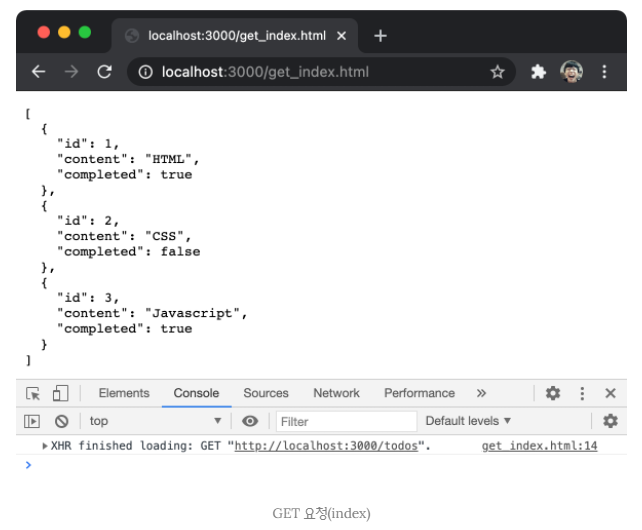
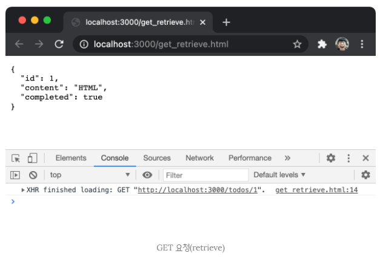
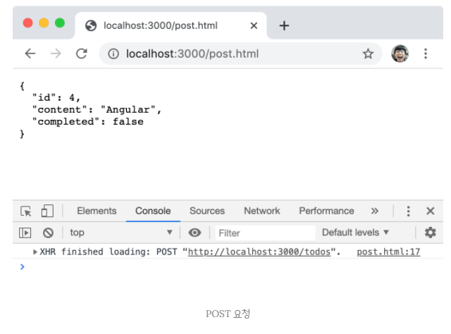
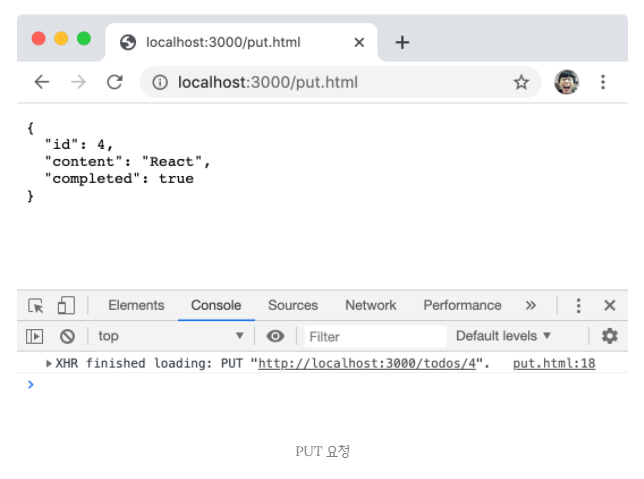
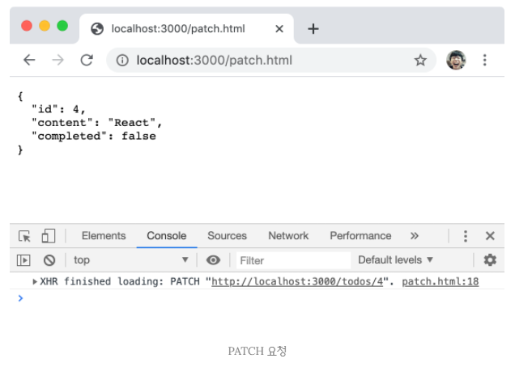

## JAVASCRIPT
<details open>
<summary>REST API</summary>
<div markdown="44">
<br />

- REST(REpresentational State Transfer)는 HTTP/1.0과 1.1의 스펙에 참여했고, 아파치 HTTP 서버 프로젝트의 공동 설립자인 로이 빌딩(Roy Fielding)의 2000년 논문에서 처음 소개되었다.
- 발표 당시 웹이 HTTP를 제대로 사용하지 못하고 있는 상황을 보고 HTTP의 장점을 최대한 활용할 수 있는 아키텍처로서 REST를 소개했고 이는 HTTP 프로토콜을 의도에 맞게 디자인하도록 유도하고 있다.
- `REST의 기본 원칙을 성실히 지킨 서비스 디자인을 "RESTful"이라고 표현한다.`

- 즉, `REST는 HTTP를 기반으로 클라이언트가 서버의 리소스에 접근하는 방식을 규정한 아키텍처이고, REST API는 REST를 기반으로 서비스 API를 구현한 것을 의미한다.`

- REST API는 프론트엔드와 백엔드 간에 하나의 컨벤션이다.

### REST API의 구성
- `REST API는 자원(resource), 행위(verb), 표현(representations)의 3가지 요소로 구성된다.`
- REST는 자체 표현 구조(self-descriptiveness)로 구성되어 REST API만으로 HTTP 요청의 내용을 이해할 수 있다.

| 구성 요소             | 내용                           | 표현 방법        |
| --------------------- | ------------------------------ | ---------------- |
| 자원(resource)        | 자원                           | URI(엔드 포인트) |
| 행위(verb)            | 자원에 대한 행위               | HTTP 요청 메서드 |
| 표현(representations) | 자원에 대한 행위의 구체적 내용 | 페이로드         |

### REST API 설계 원칙
- REST에서 가장 중요한 기본적인 원칙은 2가지이다.
- `URI는 리소스를 표현`하는 데 집중하고, `행위에 대한 정의는 HTTP 요청 메서드`를 통해서 하는 것이 RESTful API를 설계하는 중심 규칙이다.

**1. URI는 리소스를 표현해야 한다.**
- `URI는 리소스를 표현하는 데 중점을 두어야 한다.`
- 리소스를 식별할 수 있는 이름은 동사보다는 `명사`를 사용한다.
- 따라서 이름에 get 같은 행위에 대한 표현이 들어가서는 안 된다.
- URL(end point)는 서버가 짓는다.
```javascript
# bad
GET /getTodos/1
GET todos/show/1

# good
GET /todos/1
```

**2. 리소스에 대한 행위는 HTTP 요청 메서드로 표현한다.**
- `HTTP 요청 메서드는 클라이언트가 서버에게 요청의 종류와 목적(리소스에 대한 행위)을 알리는 방법이다.`
- 주로 5가지 요청 메서드(GET, POST, PUT, PATCH, DELETE 등)을 사용하여 CRUD를 구현한다.

| HTTP 요청 메서드 | 종류           | 목적                  | 페이로드 |
| ---------------- | -------------- | --------------------- | :------: |
| GET              | index/retrieve | 모든/특정 리소스 취득 |    X     |
| POST             | create         | 리소스 생성           |    O     |
| PUT              | replace        | 리소스의 전체 교체    |    O     |
| PATCH            | update         | 리소스의 일부 수정    |    O     |
| DELETE           | delete         | 모든/특정 리소스 삭제 |    X     |

- 리소스에 대한 행위는 HTTP 요청 메서드를 통해 표현하며 URI에 표현하지 않는다.
- 예를 들어, 리소스를 취득하는 경우에는 GET, 리소스를 삭제하는 경우에는 DELETE를 사용하여 리소스에 대한 행위를 명확히 표현한다.
```javascript
# bad
GET /todos/delete/1

# good
DELETE /todos/1
```

### JSON Server를 사용한 REST API 실습
- 백엔드의 일이 완료된 상태에서 일을 하는 것이 좋다.
- 하지만 보통 일을 시작하면 같이 시작하기 때문에 서버가 없는 동안 가짜 서버를 이용해 테스트 한다.
- 그 가짜서버는 프론트엔드가 만드는 것이다.

- HTTP 요청을 전송하고 응답을 받으려면 서버가 필요하다.
- JSON Server를 사용해 가상 REST API 서버를 구축하여 HTTP 요청을 전송하고 응답을 받는 실습을 진행해보자.

#### JSON Server 설치
- JSON Server는 json 파일을 사용하여 가상 REST API 서버를 구축할 수 있는 툴이다.
- 먼저 npm을 사용하여 JSON Server를 설치하자.

##### npm
- `npm(node package manager)은 자바스크립트 패키지 매니저이다.`
- Node.js에서 사용할 수 있는 모듈들을 패키지화하여 모아둔 저장소 역할과 패키지 설치 및 관리를 위한 CLI(Command Line Interface)를 제공한다.
- 자신이 작성한 패키지를 공개할 수도 있고 필요한 패키지를 검색하여 재사용할 수도 있다.

- 터미널에서 다음과 같은 명령어를 입력하여 JSON Server를 설치한다.
- ※주의: 패키지 이름과 폴더이름이 같으면 에러가 난다. ex) json-server 폴더

```javascript
$ mkdir json-server-exam && cd json-server-exam
$ npm init -y
$ npm install json-server --save-dev
```

#### db.json 파일 생성
- 프로젝트 루트 폴터(/json-server-exam)에 다음과 같이 db.json 파일을 생성한다.
- db.json 파일은 리소스를 제공하는 데이터베이스 역할을 한다.
- 위 예제의 todos는 DB의 하나의 테이블이다.
- db.json의 todos 이름이 바뀌면 URL의 이름도 바뀐다.
ex) http://localhost:3000/todos

- todo로 이름이 바뀌면 http://localhost:3000/todo로 바뀐다.
```javascript
{
  "todos": [
    {
      "id": 1,
      "content": "HTML",
      "completed": true
    },
    {
      "id": 2,
      "content": "CSS",
      "completed": false
    },
    {
      "id": 3,
      "content": "JS",
      "completed": true
    },
  ]
}
```

#### JSON Server 실행
- 터미널에서 다음과 같이 명령어를 입력하여 JSON Server를 실행한다.
- JSON Server가 데이터베이스 역할을 하는 db.json 파일의 변경을 감지하게 하려면 watch 옵션을 추가한다.
```javascript
// 기본 포트(3000) 사용 / watch 옵션 적용
$ json-server --watch db.json 
```
- 기본 포트는 3000이다. 포트를 변경하려면 port 옵션을 추가한다.
```javascript
// 포트 변경 / watch 옵션 적용
$ json-server --watch db.json --port 5000 
```
- 위와 같이 매번 명령어를 입력하는 것이 번거로우니 package.json 파일의 scripts를 다음과 같이 수정하여 JSON Server를 실행하여 보자.
- package.json 파일에서 불필요한 항목은 삭제했다.
```javascript
{
  "name": "json-server-exam",
  "version": "1.0.0",
  "scripts": {
    "start": "json-server --watch db.json"
  },
  "devDependencies": {
    "json-server": "^0.16.1"
  }
}
```
- 백엔드가 완성된 시점에는 devDependencies의 json-server는 필요없다.

- 터미널에서 `npm strart` 명령어를 입력하여 JSON Server를 실행한다.
```javascript
$ npm start
``` 

#### GET 요청
- `todos 리소스에서 모든 todos를 취득(index)한다.`

- 파일은 서버에 존재해야 하고, 서버는 파일을 서브하는 것이다.(서버의 가장 기본적인 기능)
- 서버는 파일만 제공하지 않고, 데이터를 동적으로 생성해서 그 데이터를 줄 수도 있다. ex) DB에 없는 데이터를 만들어 달라고 요청한 경우

- 그 서버는 루트 디렉토리(public)에 존재해야 한다.
- json 서버는 express로 동작하는데 루트 디렉토리 설정이 없으면 public을 루트 폴더로 생각한다.

- 만약 public 폴더 안에 index.html을 만들고, URL에 localhost:3000을 입력하면 서버에서 index.html 파일을 준다.
- html 파일만 요청할 수 있는 것은 아니고, index.html에서 css파일을 만나면 브라우저가 서버에게 css파일을 요청한다.
- public 폴더 안에 index.html, style.css, app.js를 만들고, index.html에 style.css, app.js를 연결해보자.
- 그리고 주소창을 사용해서 요청하지 않고 코드로 요청해보자.
```javascript
// public/app.js

// 보내는 처리
const xhr = new XMLHttpRequest();
xhr.open('GET', '/todos');
xhr.send();

// 받는 처리
xhr.onreadystatechange = () => {
  console.log(xhr.readyState); // 2 3 4
};
```
```javascript
// 주소창을 사용해서 요청하지 않고 코드로 요청하는 방법

const xhr = new XMLHttpRequest();
// 받는 처리
xhr.onreadystatechange = () => {
  console.log(xhr.readyState); // 1 2 3 4
};

// 보내는 처리
xhr.open('GET', '/todos');
xhr.send();
```
```javascript
const xhr = new XMLHttpRequest();

// 보내는 처리
xhr.open('GET', '/todos');
xhr.send();

// 받는 처리
xhr.onreadystatechange = () => {
  if (xhr.readyState !== XMLHttpRequest.DONE) return;
  if (xhr.status === 200) {
    console.log(JSON.parse(xhr.response));
  } else {
    // 404 페이지로 이동하는 등의 에러처리
    console.error(xhr.status);
  }
};
```
```javascript
const xhr = new XMLHttpRequest();

// 보내는 처리
xhr.open('GET', '/todos');
// '/todos'를 REST API라고 한다.
xhr.send();

// 받는 처리
xhr.onload = () => {
  if (xhr.status === 200) {
    console.log(JSON.parse(xhr.response));
  } else {
    console.error(xhr.status);
  }
};
```
- localhost:3000에 접속해 콘솔 창을 확인해보자.

- JSON Server의 루트 폴더(/json-server-exam)에 public 폴더를 생성하고 JSON Server를 중단한 후 재실행한다.
- 그리고 public 폴더 다음 get_index.html을 추가하고 브라우저에 `http://localhost:3000/get_index.html`로 접속한다.
```html
<!DOCTYPE html>
<html>
<body>
  <pre></pre>
  <script>
    const xhr = new XMLHttpRequest();

    // todos 리소스에서 모든 todo를 취득(index)
    xhr.open('GET', '/todos');

    xhr.send();

    xhr.onload = () => {
      if (xhr.status === 200) {
        document.querySelector('pre').textContent = xhr.response;
      } else {
        console.error('Error', xhr.status, xhr.statusText);
      }
    };
  </script>
</body>
</html>
```
- 200번 대는 성공, 400, 500 번대는 에러이다.
- 400번대 에러는 요청을 잘못했을 때 발생하는 에러이다.
- 500번대 에서는 서버에서 문제가 있을 때 발생하는 에러이다.

<br />



- todos 리소스에서 id를 사용하여 `특정 todo를 취득(retrieve)한다.`
- public 폴더에 다음 get_retrieve.html을 추가하고 브라우저에서 `http://localhost:3000/get_retrieve.html`로 접속한다.
```html
<!DOCTYPE html>
<html>
<body>
  <pre></pre>
  <script>
    const xhr = new XMLHttpRequest();

    // todos 리소스에서 id를 사용하여 특정 todo를 취득(retrieve)
    xhr.open('GET', '/todos/1');

    xhr.send();

    xhr.onload = () => {
      if (xhr.status === 200) {
        document.querySelector('pre').textContent = xhr.response;
      } else {
        console.error('Error', xhr.status, xhr.statusText);
      }
    };
  </script>
</body>
</html>
```
<br />



#### POST 요청
- `todos 리소스에 새로운 todo를 생성한다.`
- POST 요청 시에는 setRequestHeader 메서드를 사용하여 요청 몸체에 담아 서버로 전송할 페이로드의 `MIME 타입을 지정해야 한다.`

- public 폴더에 post.html을 추가하고 브라우저에서 `http://localhost:3000/post.html`로 접속한다.
```html
<!DOCTYPE html>
<html>
<body>
  <pre></pre>
  <script>
    const xhr = new XMLHttpRequest();

    // todos 리소스에 새로운 todo를 생성
    xhr.open('POST', '/todos');

    // 요청 몸체에 담아 서버로 전송할 페이로드의 MIME 타입을 지정
    xhr.setRequestHeader('content-type', 'application/json');

    // 새로운 todo를 생성하기 위해 페이로드를 서버에 전송해야 한다.
    xhr.send(JSON.stringify({ id: 4, content: 'Angular', completed: false }));

    xhr.onload = () => {
      // 200(OK) 또는 201(Created)이면 정상적으로 응답된 상태
      if (xhr.status === 200 || xhr.statusText === 201) {
        document.querySelector('pre').textContent = xhr.response;
      } else {
        console.error('Error', xhr.status, xhr.statusText);
      }
    };
  </script>
</body>
</html>
```
<br />



#### PUT 요청
- `PUT은 특정 리소스 전체를 교체할 때 사용한다.`
- 다음 예제에서는 todos 리소스에서 id로 todo를 특정하여 id를 제외한 리소스 전체를 교체한다.
- PUT요청 시에는 setRequestHeader 메서드를 사용하여 요청 몸체에 담아 서버에 전송할 페이로드의 `MIME 타입을 지정해야 한다.`

- public 폴더에 put.html을 추가하고 브라우저에서 `http://localhost:3000/put.html`로 접속한다.
```html
<!DOCTYPE html>
<html>
<body>
  <pre></pre>
  <script>
    const xhr = new XMLHttpRequest();

    // todos 리소스에서 id로 todo를 특정하여 id를 제외한 리소스 전체를 교체
    xhr.open('PUT', '/todos/4');

    // 요청 몸체에 담아 서버로 전송할 페이로드의 MIME 타입을 지정
    xhr.setRequestHeader('content-type', 'application/json');

    // 새로운 todo를 생성하기 위해 페이로드를 서버에 전송해야 한다.
    xhr.send(JSON.stringify({ id: 4, content: 'React', completed: true }));

    xhr.onload = () => {
      if (xhr.status === 200) {
        document.querySelector('pre').textContent = xhr.response;
      } else {
        console.error('Error', xhr.status, xhr.statusText);
      }
    };
  </script>
</body>
</html>
```

<br />



#### PATCH 요청
- `PATCH는 특정 리소스의 일부를 수정할 때 사용한다.`
- 다음 예제에서는 todos 리소스의 id로 todo를 특정하여 completed만 수정한다.
- PATCH 요청 시에는 setRequestHeader 메서드를 사용하여 요청 몸체에 담아 서버로 전송할 페이로드를 `MIME 타입으로 지정해야 한다.`

- public 폴더에 patch.html을 추가하고 브라우저에서 `http://localhost:3000/patch.html`로 접속한다.
```html
<!DOCTYPE html>
<html>
<body>
  <pre></pre>
  <script>
    const xhr = new XMLHttpRequest();

    // todos 리소스에서 id로 todo를 특정하여 completed만 수정
    xhr.open('PATCH', '/todos/4');

    // 요청 몸체에 담아 서버로 전송할 페이로드의 MIME 타입을 지정
    xhr.setRequestHeader('content-type', 'application/json');

    // 새로운 todo를 생성하기 위해 페이로드를 서버에 전송해야 한다.
    xhr.send(JSON.stringify({ completed: false }));

    xhr.onload = () => {
      if (xhr.status === 200) {
        document.querySelector('pre').textContent = xhr.response;
      } else {
        console.error('Error', xhr.status, xhr.statusText);
      }
    };
  </script>
</body>
</html>
```

<br />



#### DELETE 요청
- `todos 리소스에서 id를 사용하여 todo를 삭제한다.`
- public 폴더에 delete.html을 추가하고 브라우저에서 `http://localhost:3000/delete.html`로 접속한다.
```html
<!DOCTYPE html>
<html>
<body>
  <pre></pre>
  <script>
    const xhr = new XMLHttpRequest();

    // todos 리소스에서 id를 사용하여 todo를 삭제한다.
    xhr.open('DELETE', '/todos/4');

    xhr.send();

    xhr.onload = () => {
      if (xhr.status === 200) {
        document.querySelector('pre').textContent = xhr.response;
      } else {
        console.error('Error', xhr.status, xhr.statusText);
      }
    };
  </script>
</body>
</html>
```
<br />


- json 서버는 왜 전체 데이터를 주지않고, 변한 데이터만 줄까?
- 아주 최소한의 데이터만 주겠다는 정책이다.
- 랜선을 타고다니는 데이터가 작으면 작을수록 빠르고, 성능도 좋기 때문이다.
- 상황에 따라 전체 데이터를 받는 것이 좋은 경우가 있고, 하나의 데이터만 받는 것이 좋은 경우가 있다.

- 만약, 데이터를 요청 보낼 때 실수 할 수도 있기 때문에 전체를 받는 것이 안전할 수도 있다.
- 전체 데이터가 매우 크다면 페이지네이션을 통해 한 페이지에 표시할 양만큼만 가져오면된다. 

- 재사용 가능하도록 함수로 만들어 호출할 수도 있다.
```javascript
// 이 파일을 하나의 모듈로 빼면된다.(하나의 기능)

// return 객체와 req 함수가 따로 있으면, return 객체를 쓰지 않고 req 함수를 쓸 수가 있다.
// 그래서 같이 묶어주어야 한다.
const ajax = (() => {
  // payload는 옵션이므로 가장 마지막에 준다.
  const req = (method, url, sucessCallback, failureCallback, payload) => {
    const xhr = new XMLHttpRequest();
    xhr.open(method, url);
    xhr.setRequestHeader('Content-Type', 'application/json');
    xhr.send(JSON.stringify(payload));

    xhr.onload = () => {
      if (xhr.status === 200 || xhr.status === 201) {
        sucessCallback(JSON.parse(xhr.response));
      } else {
        failureCallback(xhr.status);
      }
    };
  };
  return {
    get(url, sucessCallback, failureCallback) {
      req('GET', url, sucessCallback, failureCallback);
    },
    post(url, payload, successCallback, failureCallback) {
      req('POST', payload, successCallback, failureCallback);
    },
    put(url, payload, successCallback, failureCallback) {
      req('PUT', url, payload, successCallback, failureCallback);
    },
    patch(url, payload, successCallback, failureCallback) {
      req('PATCH', payload, successCallback, failureCallback);
    },
    delete(url, successCallback, failureCallback) {
      req('DELETE', successCallback, failureCallback);
    }
  };
})();

// 후속 처리를 위해 콜백함수를 주어야한다.
// 프로미스의 필요성(프로미스를 사용하면 콜백함수를 주지 않아도 된다)
ajax.get('/todos', console.log, console.error);
```

- [same origin과 cors 에러](https://velog.io/@yejinh/CORS-4tk536f0db)

- 데이터를 가져오는 서버와 데이터가 있는 서버가 보통은 같다.
- 이런 경우 path만 적어주면 된다. ex) todos/
- 하지만 포스트 맨을 이용하는 경우 자바스크립트에서 데이터를 가져오는 것은 다른 서버이다.
- 그래서 이 경우에는 서버의 pull path를 적어줘야한다. ex)localhost:3000/todos

- 만약 cors가 막히면 cors 에러가 뜨면서 데이터를 가져올 수 없다.
- 이런 경우, 백엔드에게 cors를 풀어달라고 요청해야 한다.
- [교차 출처 리소스 공유, cors](https://developer.mozilla.org/ko/docs/Web/HTTP/CORS)

- 우리가 사용한 json 서버는 patch 작업에서 url을 `/todos`라고 주고, 전체 데이터를 모두 `completed: false`로 주면 전부 다 바꿔주지 않는다.
- 따라서 REST API를 하나 만들어 주는 작업이 가장좋다.

- json 서버에서 기본으로 제공하는 기능 외에 다른 기능을 만들어주고 싶은 경우 커스텀 라우터를 통해 만들어 주어야한다.
- [커스텀 라우터](https://poiemaweb.com/json-server)
- 하지만, 커스텀 라우터를 만들다보면, 우리가 간단하게 가짜 서버를 만드는 것이 낫다.

### express를 이용한 가짜 서버 만들기(express_server_practice 레포 참고)

1. 프로젝트 폴더 만들기
2. `$ npm init -y`
3. `$ npm i express`
4. `$ npm i cors` : 데이터를 가지고 있지 않은 서버에서 데이터를 가져와도 cors에러가 나지 않도록
5. server.js 파일 만들기
6. server.js 내용 작성하기
7. package.json scripts 고치기("start": "node server")
8. npm start 해보기(server.js에 app.listen에 작성한 console.log 내용이 터미널에 나오면 성공)
9. public 폴더를 만들고, index.html 작성
10. server.js에 public을 루트 폴더로 하는 코드 작성
11. 서버를 재동작하고 index.html의 내용이 나오는지 확인
12. index.html 내용을 바꾸면 계속 재구동 해야하는 번거로움을 없애기 위해 nodemon 설치
13. npm i -g nodemon(안되면 sudo npm i -g nodemon)
14. 설치 후, package.json scripts 고치기("start": "nodemon server")
15. 이제 실제로 데이터를 전달할 수 있는 REST API 만들기(server.js에 작성)

- 예시
```javascript
app.get('/todos', (req, res) => {
  res.send(todos);
}) 
```

</div>
</details>

---