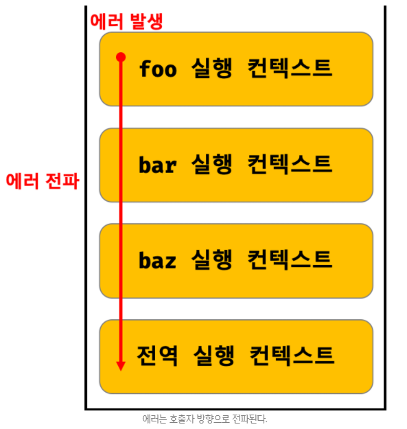

## JAVASCRIPT
<details open>
<summary>에러 처리</summary>
<div markdown="47">

### 에러 처리의 필요성
- 에러와 오류는 거의 비슷하다.
- 하지만, 에러와 예외는 다르다.

- 에러(error, 오류)가 발생하지 않는 코드를 작성하는 것은 불가능하다.
- 따라서 에러는 언제나 발생할 수 있다.
- 발생한 에러에 대해 대처하지 않고 방치하면 프로그램은 강제 종료된다.
```javascript
console.log('[Start]'); // [Start]

foo(); // ReferenceError: foo is not defined
// 발생한 에러를 방치하면 프로그램은 강제 종료된다.

// 에러에 의해 프로그램이 강제 종료되어 아래 코드는 실행되지 않는다.
console.log('[End]');
```
- try...catch 문을 사용해 발생한 에러에 적절하게 대응하면 프로그램이 강제 종료되지 않고 계속해서 코드를 실행시킬 수 있다.
```javascript
console.log('[Start]');

try {
  foo();
} catch (error) {
  console.error('[에러 발생]', error);
}

console.log('[End]');
/*
[Start]
[에러 발생] ReferenceError: foo is not defined
[End]
*/
```
- 직접적으로 에러를 발생하지는 않는 예외(exception)적인 상황이 발생할 수도 있다.
- 예외적인 상황에 적절하게 대응하지 않으면 에러로 이어질 가능성이 크다.
```javascript
// DOM에 button 요소가 존재하지 않으면 querySelector 메서드는 에러를 발생시키지 않고 null을 반환한다.
const $button = document.querySelector('button'); // null

$button.classList.add('disabled');
// TypeError: Cannot read property 'classList' of null
```
- 위 예제의 querySelector 메서드는 인수로 전달한 문자열이 CSS 선택자 문법에 맞지 않는 경우 에러를 발생시킨다.
```javascript
const $elem = document.querySelector('#1');
// DOMException: Failed to execute 'querySelector' on 'Document': '#1' is not a valid selector.
```
- 하지만 querySelector 메서드는 인수로 전달한 CSS 선택자 문자열로 DOM에서 요소 노드를 찾을 수 없는 경우 에러를 발생시키지 않고 null을 반환한다.
- 이때 if 문으로 querySelector 메서드의 반환값을 확인하거나 단축 평가 또는 옵셔널 체이닝 연산자 `?.`를 사용하지 않으면 다음 처리에서 에러로 이어질 가능성이 크다.
```javascript
const $button = document.querySelector('button');
$button?.classList.add('disabled');
```
- 우리가 작성한 코드에서는 언제나 에러나 예외적인 상황이 발생할 수 있다는 것을 전제하고 이에 대응하는 코드를 작성하는 것이 중요하다.

### try...catch...finally 문
- 기본적으로 에러 처리를 구현하는 방법은 크게 2가지가 있다.
- `querySelector`나 `Array#find` 메서드처럼 예외적인 상황이 발생하면 반환하는 값(null 또는 –1)을 if 문이나 단축 평가 또는 옵셔널 체이닝 연산자를 통해 확인해서 처리하는 방법과 에러 처리 코드를 미리 등록해 두고 에러가 발생하면 에러 처리 코드로 점프하도록 하는 방법이 있다.

- try...catch...finally 문은 두 번째 방법이다.
- 일반적으로 이 방법을 `에러 처리(error handling)`라고 한다.
- try...catch...finally 문은 다음과 같이 3개의 코드 블록으로 구성된다.
- finally 문은 불필요하다면 생략 가능하다.
- catch 문도 생략할 수 있지만 catch 문이 없는 try 문은 의미가 없으므로 생략하지 않는다.
```javascript
try {
  // 실행할 코드(에러가 발생할 가능성이 있는 코드)
} catch (err) {
  // try 코드 블록에서 에러가 발생하면 이 코드 블록의 코드가 실행된다.
  // err에는 try 코드 블록에서 발생한 Error 객체가 전달된다.
} finally {
  // 에러 발생과 상관없이 반드시 한 번 실행된다.
}
```
- try...catch...finally 문으로 에러를 처리하면 프로그램이 강제 종료되지 않는다.
```javascript
console.log('[Start]');

try {
  foo();
} catch (err) {
  console.error(err); // err에 에러 객체가 전달된다.
} finally {
  console.log('finally');
}
console.log('[End]');
/*
[Strat]
ReferenceError: foo is not defined
// ReferenceError 생성자 함수를 호출해서 ReferenceError 객체를 만들어 전달한다.
finally
[End]
*/
```
- async/await을 사용하면 try...catch...finally문을 사용할 수 있다.

### Error 객체
- 에러가 발생하면 자바스크립트 엔진이 에러 객체를 생성한다.

- Error 생성자 함수는 에러 객체를 생성한다.
- Error 생성자 함수에는 에러를 상세히 설명하는 에러 메시지를 인수로 전달할 수 있다.
```javascript
const err = new Error('invalid');
```
- Error 생성자 함수가 생성한 에러 객체는 `message 프로퍼티`와 `stack 프로퍼티`를 갖는다.
- `message 프로퍼티 값은 Error 생성자 함수에 인수로 전달한 에러 메시지`이고, `stack 프로퍼티 값은 에러를 발생시킨 콜 스택의 호출 정보를 나타내는 문자열`이며 디버깅 목적으로 사용한다.

- 자바스크립트는 Error 생성자 함수를 포함해 `7가지의 에러 객체`를 생성할 수 있는 Error 생성자 함수를 제공한다.
- SyntaxError, ReferenceError, TypeError, RangeError, URIError, EvalError 생성자 함수가 생성한 에러 객체의 프로토타입은 `모두 Error.prototype을 상속받는다.`

| 생성자 함수    | 인스턴스                                                     |
| -------------- | ------------------------------------------------------------ |
| Error          | 일반적 에러 객체                                             |
| SyntaxError    | 자바스크립트 문법에 맞지 않는 문을 해석할 때 발생하는 에러 객체 |
| ReferenceError | 참조할 수 없는 식별자를 참조했을 때 발생하는 에러            |
| TypeError      | 피연산자 또는 인수의 데이터 타입이 유효하지 않을 때 발생하는 에러 객체 |
| RangeError     | 숫자값의 허용 범위를 벗어났을 때 발생하는 에러 객체          |
| URIError       | encodeURI 또는 decodeURI 함수에 부적절한 인수를 전달했을 때 발생하는 에러 객체 |
| EvalError      | eval 함수에서 발생하는 에러 객체                             |

```javascript
1 @ 1; // SyntaxError: Invalid or unexpected token
foo(); // ReferenceError: foo is not defined
null.foo; // TypeError: Cannot read property 'foo' of null
new Array(-1); // RangeError: Invalid array length
decodeURIComponent('%'); // URIError: URI malformed
```

### throw 문
- Error 생성자 함수로 에러 객체를 생성한다고 에러가 발생하는 것은 아니다.
- 즉, 에러 객체 생성과 에러 발생은 의미가 다르다.
```javascript
try {
  new Error('something wrong');
} catch(error) {
  console.log(error);
}
```
- 에러를 발생시키려면 try 코드 블록에서 throw 문으로 에러 객체를 던져야 한다.
```javascript
throw 표현식;
```
- `throw 문의 표현식은 어떤 값이라도 상관없지만, 일반적으로 에러 객체를 지정한다.`
- 에러를 던지면 catch 문의 에러 변수가 생성되고 던져진 에러 객체가 할당된다.
- 그리고 catch 블록이 실행되기 시작한다.
```javascript
try {
  throw new Error('something wrong');
} catch (error) {
  console.log(error); // Error: something wrong
}
```
```javascript
const repeat = (n, f) => {
  if (typeof f !== 'function') throw new TypeError('f must be a function');

  for (let i = 0; i < n; i++) {
    f(i);
  }
};

try {
  repeat(2, 1);
} catch (err) {
  console.error(err); // TypeError: f must be a function
}
```
```javascript
const repeat = (n, f) => {
  if (typeof f !== 'function') throw new TypeError('f must be a function');

  for (let i = 0; i < n; i++) {
    f(i);
  }
};

repeat(2, 1); // TypeError: f must be a function
```

### 에러의 전파
- `에러는 호출자(caller) 방향으로 전파된다.`
- 즉, 콜 스택의 아래 방향(실행 중인 실행 컨텍스트가 푸시되기 직전에 푸시된 실행 컨텍스트 방향)으로 전파된다. 
```javascript
const foo = () => {
  throw Error('foo에서 발생한 에러');
};

const bar = () => {
  foo();
};

const baz = () => {
  bar();
};

try {
  baz();
} catch (err) {
  console.error(err); // Error: foo에서 발생한 에러
}
```
- foo 함수가 throw 한 에러는 다음과 같이 호출자에게 전파되어 전역에서 캐치된다.
<br />



- 이처럼 `throw된 에러를 캐치하지 않으면 호출자 방향으로 전파된다.`
- 이때 throw된 에러를 캐치하여 대응하면 프로그램을 강제 종료시키지 않고 코드의 실행 흐름을 복구할 수 있다.
- throw된 에러를 어디에서도 캐치하지 않으면 프로그램은 강제 종료된다.

- 주의할 것은 `비동기 함수인 setTimeout이나 프로미스의 후속 처리 메서드의 콜백 함수는 호출자가 없다는 것이다.`
- setTimeout이나 프로미스의 후속 처리 메서드의 콜백 함수는 태스크 큐나 마이크로테스크 큐에 일시 저장되었다가 콜 스택이 비면 이벤트 루프에 의해 콜 스택으로 푸시되어 실행된다.
- 이때 `콜 스택에 푸시된 콜백 함수의 실행 컨텍스트는 콜 스택의 가장 하부에 존재하게 된다.`
- 따라서 `에러를 전파할 호출자가 존재하지 않는다.`

- 에러가 발생하면 에러가 발생한 log를 따로 파일 또는 DB에 저장해두어야 한다.
- log를 보고 에러를 해결해 주어야 한다.

- 일반적인 코드들은 에러처리를 하지않고, 테스트 코드에서는 에러처리를 하는 방법도 있다.
- 프론트엔드 쪽에서 에러가 나지않는다고 해도, 서버에서 문제가 있다면 에러가 발생할 수 있다.
- 따라서 프론트엔드에서 try...catch문을 사용하여 서버에서 발생하는 에러처리를 해주어야 한다.
</div> 
</details>

---