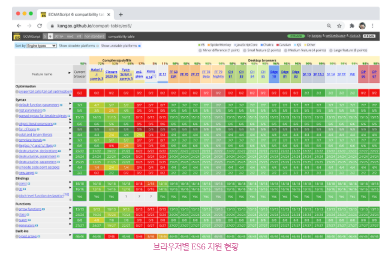
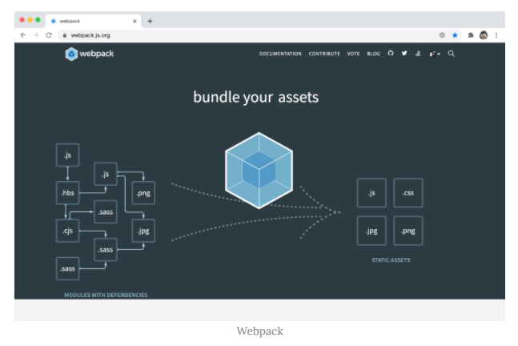
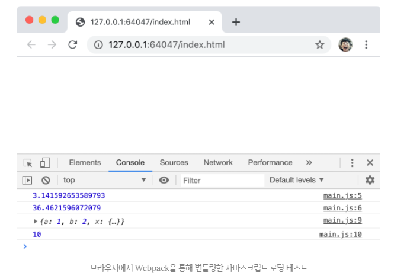
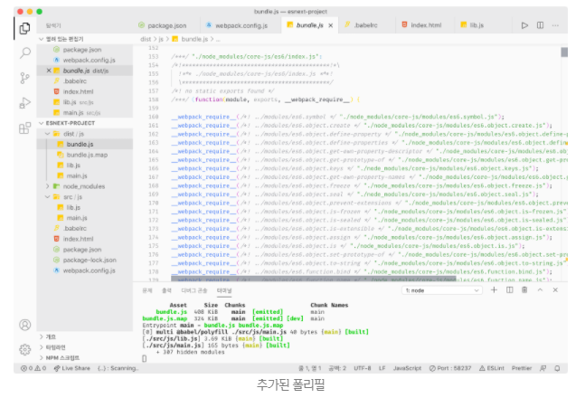

## JAVASCRIPT
<details open>
<summary>Babel과 Webpack을 이용한 ES6+/ES.NEXT 개발 환경 구축</summary>
<div markdown="49">
<br />

- 크롬, 사파리, 파이어 폭스, 엣지 같은 `에버그린 브라우저`(evergreen browser, 웹 표준을 준수하기 위해 지속해서 자동 업데이트를 지원하는 모던 브라우저)의 ES6 지원율은 약 98%로 거의 대부분의 ES6 사양을 지원한다.
<br />



- 하지만 IE 11의 ES6 지원율은 약 11%이다.
- 그리고 매년 새롭게 도입되는 `ES6 이상의 버전(ES6+)`과 제안 단계에 있는 `ES 제안 사양(ES.NEXT)`은 브라우저에 따라 지원율이 제각각이다.

- 따라서 ES6+와 ES.NEXT의 최신 ECMAScript 사양을 사용하여 프로젝트를 진행하려면 최신 사양을 작성된 코드를 때에 따라 IE를 포함한 구형 브라우저에서 문제없이 동작시키기 위한 `개발 환경을 구축하는 것이 필요하다.`

- 또한 대부분의 프로젝트가 모듈을 사용하므로 `모듈 로더도 필요하다.`
- ES6 모듈(ESM)은 대부분의 모던 브라우저(Chrome 61, FF 60, SF 10.1, Edge 16 이상)에서 사용할 수 있다.
- 하지만 다음과 같은 이유로 아직은 ESM보다는 별도의 모듈 로더를 사용하는 것이 일반적이다.

- `IE를 포함한 구형 브라우저는 ESM을 지원하지 않는다.`
- `ESM을 사용하더라도 트랜스파일링이나 번들링이 필요한 것은 변함이 없다.`
- `ESM이 아직 지원하지 않는 기능(bare import 등)이 있고 점차 해결되고는 있지만, 아직 몇 가지 이슈가 존재한다.`([ECMAScript modules in browsers 참고](https://jakearchibald.com/2017/es-modules-in-browsers/))

```javascript
import axios from 'axios' // bare import
```
- bare import는 ESM에서 지원하지 않는다.
- 그래서 pull path를 적어주어야 한다.

- 많은 제약사항이 있어서 지금 상황에서는 ESM을 사용하기에는 무리가 있다.
- 따라서 Babel과 Webpack을 사용하는 것이 좋다.

- `트랜스파일러(transpiler)인 Babel`과 `모듈 번들러(module bundler)인 Webpack`을 이용하여 ES6+/ES.NEXT 개발 환경을 구축해보자.
- 아울러 Webpack을 통해 Babel을 로드하여 ES6+/ES.NEXT 사양의 소스코드를 IE 같은 구형 브라우저에서도 동작하도록 ES5 사양의 소스코드로 트랜스파일링하는 방법도 알아보자.

### Babel
- ES6의 화살표 함수와 ES7의 지수연산자를 사용하고 있다.
```javascript
[1, 2, 3].map(n => n * n);
```
- IE 같은 구형 브라우저에서는 ES6의 화살표 함수와 ES7의 지수 연산자를 지원하지 않을 수도 있다.
- Babel을 사용하면 위 코드를 다음과 같이 ES5 사양으로 변환할 수 있다.
```javascript
"use strict"

[1, 2, 3].map(function (n) {
  return Math.pow(n, n);
});
```
- 이처럼 `Babel은 ES6+/ES.NEXT로 구현된 최신 사양의 소스코드를 IE 같은 구형 브라우저에서도 동작하는 ES5 사양의 소스코드로 변환(트랜스파일링)할 수 있다.`
- Babel을 사용하기 위한 개발 환경을 구축해보자.

#### Babel 설치
- npm을 사용하여 Babel을 설치해보자.
- 터미널에서 다음과 같이 명령어를 입력하여 Babel을 설치한다.
```javascript
# 프로젝트 폴더 생성
$ mkdir esnext-project && cd esnext-project

# package.json 생성
$ npm init –y

# babel-core, babel-cli 설치
npm install --save-dev @babel/core @babel/cli
```
- 설치가 완료된 이후 package.json 파일은 다음과 같다.
- 불필요한 설정은 삭제했다.
```javascript
{
  "name": "esnext-project",
  "version": "1.0.0",
  "devDependencies": {
    "@babel/cli": "^7.12.10",
    "@babel/core": "^7.12.10"
  }
}
```
- 참고로 Babel, Webpack, 플러그인의 버전은 빈번하게 업그레이드된다.
- `npm install`은 언제나 최신 버전의 패키지를 설치하므로 위 버전과는 다른 최신 버전의 패키지가 설치될 수도 있다.
- 만약 위 버전 그대로 설치하고 싶다면 다음과 같이 패키지 이름 뒤에 @과 설치하고 싶은 버전을 지정한다.
```javascript
# 버전 지정 설치
$ npm install --save-dev @babel/core@7.10.3 @babel/cli@7.10.3
```

#### Babel 프리셋 설치와 babel.config.json 설정 파일 작성
- Babel을 사용하려면 `@babel/preset-env`를 설치해야 한다.
- @babel/preset-env는 함께 사용해야 하는 Babel 플러그인을 모아 둔 것으로 `Babel 프리셋(preset)`이라고 부른다.
- Babel이 제공하는 공식 Babel 프리셋(official preset)은 다음과 같다.

- `@babel/preset-env`
- `@babel/preset-flow`
- `@babel/preset-react`
- `@babel/preset-typescript`

- `@babel/preset-env는 필요한 플러그인들을 프로젝트 지원 환경에 맞춰서 동적으로 결정해준다.`
- 프로젝트 지원 환경은 Browerslist 형식으로 .browserslistrc 파일에 상세히 설정할 수 있다.
- 만약 프로젝트 지원 환경 설정 작업을 생략하면 기본값이 설정된다.

- 일단은 기본 설정으로 진행하도록 하자.
- 기본 설정은 모든 ES6+/ES.NEXT 사양의 소스코드를 변환한다.
```javascript
# @babel/preset-env 설치
$ npm install --save-dev @babel/preset-env
```
- 설치가 완료된 이후 package.json 파일은 다음과 같다.
```javascript
{
  "name": "esnext-project",
  "version": "1.0.0",
  "devDependencies": {
    "@babel/cli": "^7.12.10",
    "@babel/core": "^7.12.10",
    "@babel/preset-env": "^7.12.11"
  }
}
```
- 설치가 완료되면 프로젝트 루트 폴더에 `babel.config.json` 설정 파일을 생성하고 다음과 같이 작성한다.
```javascript
{
  "presets": ["@babel/preset-env"]
}
```
- 지금 설치한 @babel/preset-env를 사용하겠다는 의미이다.

#### 트랜스파일링
- Babel을 사용하여 ES6+/ES.NEXT 사양의 소스코드를 ES5 사양의 소스코드로 트랜스파일링해보자.
- Babel CLI 명령어를 사용할 수도 있으나 트랜스파일링할 때마다 매번 Bable CLI 명령어를 입력하는 것은 번거로우므로 `npm scripts에 Babel CLI 명령어를 등록하여 사용하자.`

- package.json 파일에 scripts를 추가한다.
- 완성된 package.json 파일은 다음과 같다.
```javascript
{
  "name": "esnext-project",
  "version": "1.0.0",
  "scripts": {
    "build": "babel src/js -w -d dist/js"
  },
  "devDependencies": {
    "@babel/cli": "^7.12.10",
    "@babel/core": "^7.12.10",
    "@babel/preset-env": "^7.12.11"
  }
}
```
- 위 npm scripts의 build의 src/js 폴더(타깃 폴더)에 있는 모든 자바스크립트 파일들을 트랜스파일링한 후, 그 결과물은 dist/js 폴더에 저장한다.
- 사용한 옵션의 의미는 다음과 같다.
- `-w`: 타깃 폴더에 있는 모든 자바스크립트 파일들의 변경을 감지하여 자동으로 트랜스파일한다. (--watch 옵션의 축약형)
- `-d`: 트랜스파일링된 결과물이 저장될 폴더를 지정한다. 만약 지정된 폴더가 존재하지 않으면 자동 생성한다.(--out-dir 옵션의 축약형)

- 이제 트랜스파일링을 테스트하기 위해 ES6+/ES.NEXT 사양의 자바스크립트 파일을 작성해보자.
- 프로젝트 루트 폴더에 src/js 폴더를 생성한 후 lib.js와 main.js를 추가한다. 

- 터미널에서 다음과 같이 명령어를 입력하여 트랜스파일링을 실행한다.
```javascript
$ npm run build

> esnext-project@1.0.0 build /Users/leeungmo/Desktop/esnext-project
> babel src/js -w -d dist/js

SyntaxError: /Users/leeungmo/Desktop/esnext-project/src/js/lib.js: Support for the experimental syntax 'classPrivateProperties' isn't currently enabled (10:3):

   6 | 
   7 | export class Foo {
>  8 |   #private = 10; // stage 3: 클래스 필드 정의 제안
     |   ^
   9 | 
  10 |   foo() {
  11 |     // stage 4: 객체 Rest/Spread 프로퍼티 제안

...
```
- 2020년 7월 현재 TC39 프로세스의 stage 3(candidate) 단계에 있는 private 필드 정의 제안에서 에러가 발생했다.
- 이것은 `@babel/preset-env가 현재 제안 단계에 있는 사양에 대한 플러그인을 지원하지 않기 때문에 발생한 에러이다.`
- 따라서 현재 제안 단계에 있는 사양을 트랜스파일링하려면 `별도의 플러그인을 설치해야 한다.`

#### Babel 플러그인 설치
- 설치가 필요한 Babel 플러그인은 Babel 홈페이지에서 검색할 수 있다.
- Babel 홈페이지 상단 메뉴에 Search란에 제안 사양의 이름을 입력하면 플러그인을 검색할 수 있다.
- 여기서는 클래스 필드 정의 제안 플러그인을 검색하기 위해 "class field"를 입력해보자.
- 검색된 Babel 플러그인 중에서 public/private 클래스 필드를 지원하는 `@babel/plugin-proposal-class-properties`를 설치하자
```javascript
$ npm install —save-dev @babel/plugin-proposal-class-properties
```
- 설치가 완료된 이루 package.json 파일은 다음과 같다.
```javascript
{
  "name": "esnext-project",
  "version": "1.0.0",
  "scripts": {
    "build": "babel src/js -w -d dist/js"
  },
  "devDependencies": {
    "@babel/cli": "^7.12.10",
    "@babel/core": "^7.12.10",
    "@babel/plugin-proposal-class-properties": "^7.12.1",
    "@babel/preset-env": "^7.12.11"
  }
}

```
- 설치한 플러그인은 babel.config.json 설정 파일에 추가해야 한다.
- babel.config.json 설정 파일을 다음과 같이 수정한다.
```javascript
{
  "presets": ["@babel/preset-env"],
  "plugins": ["@babel/plugin-proposal-class-properties"]
}
```
- 다시 터미널에서 다음과 같이 명령어를 입력하여 트랜스파일링을 실행해보자.
```javascript
$ npm run build
> esnext-project@1.0.0 build C:\Users\Administrator\Desktop\playground\esnext-project
> babel src/js -w -d dist/js

Successfully compiled 2 files with Babel (785ms).
```
- 트랜스파일링에 성공하면 프로젝트 루트 폴더에 dist/js 폴더가 자동으로 생성되고 트랜스파일링된 main.js와 lib.js가 저장된다.
- 트랜스파일링된 main.js를 실행해보자.
- 결과는 다음과 같다.
```javascript
$ node dist/js/main
3.141592653589793
36.4621596072079
{ a: 1, b: 2, x: { c: 3, d: 4 } }
10
```

#### 브라우저에서 모듈 로딩 테스트
- 앞에서 main.js와 lib.js 모듈을 트랜스파일링하여 ES5 사양으로 변환된 main.js를 실행한 결과, 문제없이 실행되는 것을 확인했다.
- ES6+에서 새롭게 추가된 기능은 물론 현재 제안 상태에 있는 "클래스 필드 정의 제안"도 ES5로 트랜스파일링 되었고 ES6의 모듈의 import와 export 키워드도 트랜스파일링 되어 모듈 기능도 정상적으로 동작하는 것을 확인했다.

- 하지만 위 예제의 모듈 기능은 node.js 환경에서 동작한 것이고 Babel이 모듈을 트랜스파일링한 것도 node.js가 기본 지원하는 CommonJS 방식의 모듈 로딩 시스템에 따른 것이다.
- 다음은 src/js/main.js가 Babel에 의해 트랜스파일링된 결과이다.
```javascript
// dist/js/main.js
"use strict";

var _lib = require("./lib");

console.log(_lib.pi);
console.log((0, _lib.power)(_lib.pi, _lib.pi));
var f = new _lib.Foo();
console.log(f.foo());
console.log(f.bar());
```
- `브라우저는 CommonJS 방식의 require 함수를 지원하지 않으므로 위에서 트랜스파일링된 결과를 그대로 브라우저에서 실행하면 에러가 발생한다.`
- 프로젝트 루트 폴더에 다음과 같이 index.html을 작성하여 트랜스파일링된 자바스크립트 파일을 브라우저에서 실행해보자.
```javascript
<!DOCTYPE html>
<html>
<body>
  <script src="dist/js/lib.js"></script>
  <script src="dist/js/main.js"></script>
</body>
</html>
```
- 위 html 파일을 브라우저에서 실행하면 다음과 같은 에러가 발생한다.
```javascript
Uncaught ReferenceError: exports is not defined
    at lib.js:3
main.js:3 Uncaught ReferenceError: require is not defined
    at main.js:3
```
- 즉, require 같은 명령어는 브라우저에서 알지 못한다.

- 브라우저의 ES6 모듈(ESM)을 사용하도록 Babel을 설정할 수도 있으나 앞서 설명한 바와 같이 ESM을 사용하는 것은 문제가 있다.
- `Webpack을 통해 이러한 문제를 해결해보자.`

### Webpack
- Webpack은 의존 관계에 있는 자바스크립트, CSS, 이미지 등의 리소스들을 하나(또는 여러 개)의 파일로 번들링하는 모듈 번들러이다.
- `Webpack을 사용하면 의존 모듈이 하나의 파일로 번들링되므로 별도의 모듈 로더가 필요 없다.`
- 그리고 `여러 개의 자바스크립트 파일을 하나로 번들링하므로 HTML 파일에서 script 태그로 여러 개의 자바스크립트 파일을 로드해야 하는 번거로움이 사라진다.`
<br />



- Webpack과 Babel을 이용하여 ES6+/ES.NEXT 개발 환경을 구축해보자.
- `Webpack이 자바스크립트 파일을 번들링하기 전에 Babel을 로드하여 ES6+/ES.NEXT 사양의 소스코드를 ES5 사양의 소스코드로 트랜스파일링하는 작업을 실행하도록 설정할 것이다.`

#### Webpack 설치
- 터미널에서 다음과 같이 명령어를 입력하여 Webpack을 설치한다.
```javascript
$ npm install --save-dev webpack webpack-cli
```
- 설치가 완료된 이후 package.json 파일은 다음과 같다.
```javascript
{
  "name": "esnext-project",
  "version": "1.0.0",
  "scripts": {
    "build": "babel src/js -w -d dist/js"
  },
  "devDependencies": {
    "@babel/cli": "^7.12.10",
    "@babel/core": "^7.12.10",
    "@babel/plugin-proposal-class-properties": "^7.12.1",
    "@babel/preset-env": "^7.12.11",
    "webpack": "^5.15.0",
    "webpack-cli": "^4.3.1"
  }
}
```

#### babel-loader 설치
- Webpack이 모듈을 번들링할 때 Babel을 사용하여 ES6+/ES.NEXT 사양의 소스코드를 트랜스파일링 하도록 `babel-loader`를 설치한다.

- Babel로 트랜스파일링, Webpack으로 번들링한다면 명령어를 2번시켜야 한다.
- 따라서 명령어를 한 번만 할 수 있게, Webpack에서 명령을 주어서 Webpack에서 Babel의 트랜스파일링을 하도록 만들어야한다.
- 그 과정을 해주는 것이 `babel-loader`이다.

```javascript
$ npm install --save-dev babel-loader
```
- 이제 npm scripts를 변경하여 Babel 대신 Webpack을 실행하도록 수정하자.
- 다음과 같이 package.json 파일의 scripts를 변경한다.
- 완성된 package.json 파일은 다음과 같다.
```javascript
{
  "name": "esnext-project",
  "version": "1.0.0",
  "scripts": {
    "build": "webpack -w"
  },
  "devDependencies": {
    "@babel/cli": "^7.12.10",
    "@babel/core": "^7.12.10",
    "@babel/plugin-proposal-class-properties": "^7.12.1",
    "@babel/preset-env": "^7.12.11",
    "babel-loader": "^8.2.2",
    "webpack": "^5.15.0",
    "webpack-cli": "^4.3.1"
  }
}
```

#### webpack.config.js 설정 파일 작성
- webpack.config.js는 Webpack이 실행될 때 참조하는 설정 파일이다. 
- 프로젝트 루트 폴더에 webpack.config.js 파일을 생성하고 다음과 같이 작성한다.
```javascript
module.exports = {
  // entry file
  // 애플리케이션이 가동되면 제일 처음 어떤 자바스크립트가 가동되어야 하는지 설정
  // https://webpack.js.org/configuration/entry-context/#entry
  entry: './src/js/main.js',
  // 번들링된 js 파일의 이름(filename)과 저장될 경로(path)를 지정
  // https://webpack.js.org/configuration/output/#outputpath
  // https://webpack.js.org/configuration/output/#outputfilename
  output: {
    path: path.resolve(__dirname, 'dist/js'),
    filename: 'bundle.js'
  },
  // https://webpack.js.org/configuration/module
  module: {
    rules: [
      {
        test: /\.js$/,
        include: [
          path.resolve(__dirname, 'src/js')
        ],
        exclude: /node_modules/,
        use: {
          loader: 'babel-loader',
          options: {
            presets: ['@babel/preset-env'],
            plugins: ['@babel/plugin-proposal-class-properties']
          }
        }
      }
    ]
  },
  devtool: 'source-map',
  // https://webpack.js.org/configuration/mode
  mode: 'development'
};
```
- 마지막에 배포할 때 `mode: produnction`으로 설정하면, 주석과 스페이스가 제거된다.

- 이제 Webpack을 실행하여 트랜스파일링 및 번들링을 실행해보자.
- `트랜스파일링은 Babel이 수행하고 번들링은 Webpack이 수행한다.`
- 만약 이전에 실행시킨 빌드 명령이 실행 중인 상태라면 중지시키고 다시 다음 명령을 실행한다.
```javascript
$ npm run build

> esnext-project@1.0.0 build C:\Users\Administrator\Desktop\playground\esnext-project
> webpack -w

asset bundle.js 7.28 KiB [emitted] (name: main) 1 related asset
runtime modules 668 bytes 3 modules
cacheable modules 3.83 KiB
  ./src/js/main.js 147 bytes [built] [code generated]
  ./src/js/lib.js 3.69 KiB [built] [code generated]
webpack 5.15.0 compiled successfully in 936 ms
```
- Webpack을 실행한 결과, dist/js 폴더에 bundle.js가 생성되었다.
- 이 파일은 main.js, lib.js 모듈이 하나로 번들링된 결과물이다.
- index.html을 다음과 같이 수정하고 브라우저에서 실행해보자.
```javascript
<!DOCTYPE html>
<html>
<body>
  <script src="dist/js/bundle.js"></script>
</body>
</html>
```
<br />



- main.js, lib.js 모듈이 하나로 번들링된 bundle.js가 브라우저에서 문제없이 실행된 것을 확인할 수 있다.

#### babel-polyfill 설치
- Babel을 사용하여 ES6+/ES.NEXT 사양의 소스코드를 ES5 사양의 소스코드로 트랜스파일링해도 브라우저가 지원하지 않는 코드가 남아 있을 수 있다.
- 예를 들어 `ES6에서 추가된 Promise, Object.assign, Array.from 등은 ES5 사양으로 트랜스파일링해도 ES5 사양에 대체할 기능이 없으므로 트랜스파일링 되지 못하고 그대로 남는다.`

- src/js/main.js를 다음과 같이 수정하여 ES6에서 추가된 Promise, Object.assign, Array.from 등이 어떻게 트랜스파일링 되는지 확인해보자.
```javascript
// src/js/main.js
import { pi, power, Foo } from './lib';

console.log(pi);
console.log(power(pi, pi));

const f = new Foo();
console.log(f.foo());
console.log(f.bar());

// polyfill이 필요한 코드
console.log(new Promise((resolve, reject) => {
  setTimeout(() => resolve(1), 100);
}));

// polyfill이 필요한 코드
console.log(Object.assign({}, { x: 1 }, { y: 2 }));

// polyfill이 필요한 코드
console.log(Array.from([1, 2, 3], v => v + v));
```
- 다시 트랜스파일링과 번들링을 실행한 다음, dist/js/bundle.js를 확인해보자.
```javascript
...
console.log(new Promise(function (resolve, reject) {
  setTimeout(function () {
    return resolve(1);
  }, 100);
})); // polyfill이 필요한 코드

console.log(Object.assign({}, {
  x: 1
}, {
  y: 2
})); // polyfill이 필요한 코드

console.log(Array.from([1, 2, 3], function (v) {
  return v + v;
}));
...
```
- 이처럼 Promise, Object.assign, Array.from 등과 같이 ES5 사양으로 대체할 수 없는 기능은 트랜스파일링 되지 않는다.
- 따라서 IE 같은 구형 브라우저에서도 Promise, Object.assign, Array.from 등과 같은 객체나 메서드를 사용하기 위해서는 `@babel/polyfill`을 설치해야 한다.
```javascript
$ npm install @babel/polyfill
```
- 설치가 완료된 이후 package.json 파일은 다음과 같다.
```javascript
{
  "name": "esnext-project",
  "version": "1.0.0",
  "scripts": {
    "build": "webpack -w"
  },
  "devDependencies": {
    "@babel/cli": "^7.12.10",
    "@babel/core": "^7.12.10",
    "@babel/plugin-proposal-class-properties": "^7.12.1",
    "@babel/preset-env": "^7.12.11",
    "babel-loader": "^8.2.2",
    "webpack": "^5.15.0",
    "webpack-cli": "^4.3.1"
  },
  "dependencies": {
    "@babel/polyfill": "^7.12.1"
  }
}
```
- `@babel-polyfill은 개발 환경에서만 사용하는 것이 아니라 실제 운영 환경에서도 사용해야 한다.`
- 따라서 개발용 의존성(devDependencies)으로 설치하는 `--save-dev` 옵션을 지정하지 않는다.

- ES6의 import를 사용하는 경우에는 진입점의 선두에서 먼저 폴리필을 로드하도록 한다.
```javascript
// src/js/main.js
import "@babel/polyfill";
import { pi, power, Foo } from './lib';
...
```
- `Webpack을 사용하는 경우에는 위 방법 대신 webpack.config.js 파일의 entry 배열에 폴리필을 추가한다.`
```javascript
const path = require('path');

module.exports = {
  // entry file
  // https://webpack.js.org/configuration/entry-context/#entry
  entry: ['@babel/polyfill', './src/js/main.js'],
...
```
- 위와 같이 webpack.config.js 파일을 수정하여 폴리필을 반영해보자.
- 빌드 명령이 실행 중인 상태라면 중지시키고 다시 다음과 같이 명령어를 입력하여 Webpack을 실행한다.
```javascript
$ npm run build

> esnext-project@1.0.0 build C:\Users\Administrator\Desktop\playground\esnext-project
> webpack -w

asset bundle.js 403 KiB [emitted] (name: main) 1 related asset
runtime modules 668 bytes 3 modules
modules by path ./node_modules/core-js/modules/*.js 190 KiB 273 modules
modules by path ./node_modules/core-js/library/ 6.43 KiB 18 modules    
modules by path ./node_modules/core-js/fn/ 1.29 KiB 11 modules
modules by path ./node_modules/@babel/polyfill/lib/*.js 1.22 KiB
  ./node_modules/@babel/polyfill/lib/index.js 686 bytes [built] [code generated]
  ./node_modules/@babel/polyfill/lib/noConflict.js 567 bytes [built] [code 
generated]
modules by path ./src/js/*.js 4.1 KiB
  ./src/js/main.js 425 bytes [built] [code generated]
  ./src/js/lib.js 3.69 KiB [built] [code generated]
./node_modules/core-js/es6/index.js 5.78 KiB [built] [code generated]      
./node_modules/core-js/web/index.js 157 bytes [built] [code generated]     
./node_modules/regenerator-runtime/runtime.js 24 KiB [built] [code generated]
webpack 5.15.0 compiled successfully in 1543 ms
```
- dist/js/bundle.js를 확인해보면 다음과 같이 폴리필이 추가된 것을 확인할 수 있다.
<br />



- 가짜 서버에서 Webpack을 사용하는 경우, 개발은 src 폴더에서 한다.
- src 코드를 빌드할 때(트랜스파일링, 번들링 할 때) public이 output이다.
- 즉, index.html도 public 안에 존재해야한다. 
</div> 
</details>

---