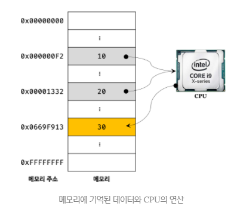
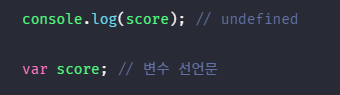
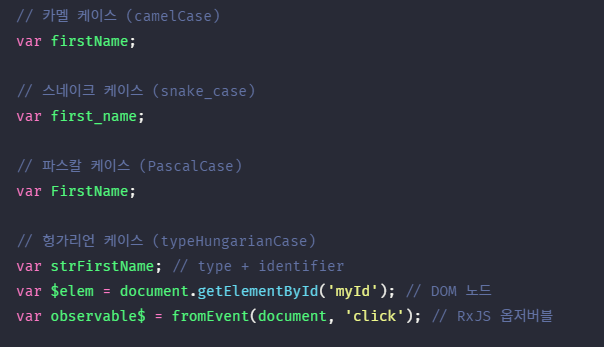
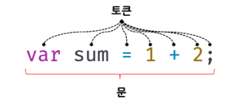
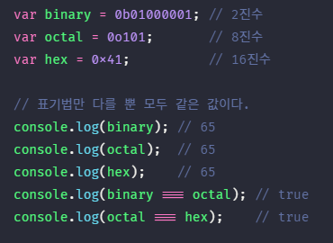
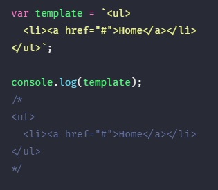
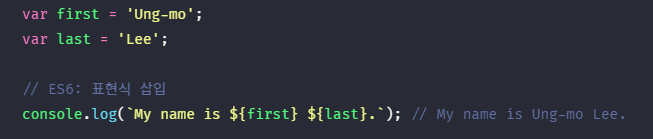
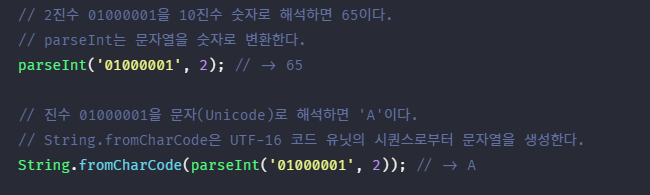

## JAVASCRIPT

2일차

#### 애플리케이션
- `application software` 혹은 `application program`의 준말
- 응용 소프트웨어란 말이 바로 이 `application software`의 번역어로, 운영체제를 제외한 나머지 소프트웨어/프로그램을 말한다.
- 특정 목적을 위해 제작된 프로그램
- 시스템 프로그램은 OS를 의미하고, 응용프로그램이 바로 애플리케이션을 의미한다. 
- 애플리케이션은 IPO(input process output), 입력으로 받은 데이터를 가공해서 출력한다.(렌더링 한다.)
ex) 워드, 한글, 디스코드 등

#### 자바스크립트 변수의 필요성
- `10 + 20`
- 컴퓨터는 연산과 기억을 수행하는 부품이 나눠져 있다.
- 컴퓨터는 CPU를 사용해 연산하고, 메모리를 사용해 데이터를 기억한다.
- 연산한 결과인 30은 메모리상의 임의의 위치에 저장된다.
- CPU가 연산해서 만들어낸 30은 재사용할 수 없다.
- CPU 안에도 메모리가 있어서 메모리에서 읽어들인 값을 기억한다.
- 재사용하려면 메모리 주소를 통해 30이 저장된 메모리공간에 직접 접근하는 방법 외에는 없다.
- 하지만, 메모리 주소를 통해 값에 직접 접근하는 것은 치명적 오류를 발생시킬 가능성이 매우 위험한 일이다. 만약 실수로 OS가 사용하고 있는 값을 변경하면 시스템을 멈추게 하는 치명적인 오류가 발생할 수도 있다. 따라서 자바스크립트는 개발자의 직접적인 메모리 제어를 허용하지 않는다.
- 만약 직접적인 메모리 제어를 허용하더라도, 값이 저장될 메모리 주소는 코드가 실행될　때 메모리의 상황에 따라 임의로 결정된다. 따라서 동일한 컴퓨터에서 동일한 코드를 실행해도 코드가 실행될 때마다 값이 저장될 메모리 주소는 변경된다. 이처럼 코드가 실행되기 이전에는 값이 저장된 메모리 주소를 알 수 없으며, 알려주지도 않는다.
 

#### 메모리(Memory)
- 데이터를 저장할 수 있는 메모리 셀(memory cell)의 집합체이다.
- 메모리 셀 하나의 크기는 1바이트(8비트)이며, 컴퓨터는 메모리 셀의 크기, 즉 1바이트 단위로 데이터를 저장(write)하거나 읽어(read) 들인다.
- 각 셀은 고유의 메모리 주소(memory address)를 가진다. 이 메모리 주소는 메모리 공간의 위치를 나타내며, 0부터 시작해서 메모리의 크기만큼 정수로 표현된다.
- 비트수가 많을수록 표현할 수 있는 메모리주소가 넓어짐
ex) 4GB 메모리는 0부터 4,294,967,295(0x00000000 ~ 0xFFFFFFFF)까지의 메모리 주소를 가진다.
- 컴퓨터는 모든 데이터를 2진수로 처리된다. 따라서 메모리에 저장되는 데이터는 데이터의 종류(숫자, 텍스트, 이미지, 동영상 등)와 상관없이 모두 2진수로 저장된다.

#### 자바스크립트 변수(variable)
- `변수(variable)` : 하나의 값을 저장하기 위해 확보한 메모리 공간 자체 또는 그 메모리 공간을 식별하기 위해 붙인 이름을 말한다.
- 값을 저장하고 참조하는 메커니즘으로, 값의 위치를 가리키는 상징적인 이름이다.
- 변수는 컴파일러 또는 인터프리터에 의해 값이 저장된 메모리 공간의 주소로 치환되어 실행
- 따라서 개발자가 직접 메모리 주소를 통해 값을 저장하고 참조할 필요가 없고 변수를 통해 안전하게 값에 접근할 수 있다.

#### 변수의 할당(assignment, 대입, 저장)과 참조(reference)
- 변수에 값을 저장하는 것을 `할당(assignment)`
- 변수에 저장된 값을 읽어 들이는 것을 `참조(reference)`
- 변수 이름을 사용해 참조를 요청하면 자바스크립트 엔진은 변수 이름과 매핑된 메모리 주소를 통해 메모리 공간에 접근해서 저장된 값을 반환한다.

#### 식별자(identifier)
- `식별자` : 어떤 값을 구별해서 식별할 수 있는 고유한 이름
- 식별자는 메모리 공간에 저장되어 있는 어떤 값을 구별해서 식별해낼 수 있어야한다. 이를 위해 식별자는 어떤 값이 저장되어 있는 메모리 주소를 기억(저장)해야 한다.
- 위에서 식별자 result는 값 30을 식별할 수 있었다. 이를 위해 식별자 result는 값 30이 저장되어 있는 메모리주소를 기억해야한다.
- 즉, 식별자는 값이 저장되어 있는 메모리 주소와 매핑관계를 맺으며, 이 매핑 정보도 메모리에 저장되어야 한다.
- 식별자로 값을 구별해서 식별한다는 것은 식별자가 기억하고 있는 메모리 주소를 통해 메모리 공간에 저장된 값에 접근할 수 있다는 것을 의미한다. 즉, 식별자는 메모리 주소에 붙인 이름이라고 할 수 있다.
- 반대로 메모리를 가지면 식별자를 알아야하는 것은 아니다.
- 변수, 함수, 클래스 등의 이름은 모두 식별자다.
- 메모리상에 존재하는 어떤 값을 식별할 수 있는 이름은 모두 식별자

#### 실행 컨텍스트(execution context)
- 변수 이름을 비롯한 모든 식별자는 실행 컨텍스트에 등록된다.
- 실행컨텍스트는 자바스크립트 엔진이 소스코드를 평가하고 실행하기 위해 필요한 환경을 제공하고 코드의 실행 결과를 실제로 관리하는 영역이다. 
- 변수이름은 변수 값은 실행 컨텍스트 내에 `(키/값)` 형식인 객체로 등록되어 관리된다.
- 식별자는 스코프 내에서 유일해야한다.
- 자바스크립트 엔진은 실행 컨텍스트를 통해 식별자와 스코프를 관리한다.
ex) 파일이름(식별자)은 같은 폴더 내(스코프)에서 유일하다.

#### 심볼 테이블
- 컴파일러 또는 인터프리터는 심볼 테이블이라고 부르는 `자료 구조`를 통해 식별자를 키로 `바인딩된 값의 메모리 주소`, `데이터 타입`, `스코프` 등을 관리한다.

#### 변수선언(variable declaration)과 초기화(initialization)
- 변수 선언이란 하나의 값을 저장하기 위한 `메모리 공간을 확보(allocate)`하고 변수 이름과 확보된 메모리 공간의 `주소를 연결(name binding)`해서 값을 저장할 수 있게 준비하는 것이다.
- 초기화란 변수가 선언된 이후 `최초로 값을 할당하는 것`을 말한다.
- OS가 사용하지 않는 메모리공간을 자바스크립트 엔진에 알려주고 그 공간에 우리가 할당한 값을 넣어준다.
- 사용 중인 공간은 OS가 메모리 공간을 확보해 놓기 때문에 안전하게 사용할 수 있다.(Lock을 걸어준다.)
- 메모리 공간을 해제하고 Lock하는 것은 가비지 콜렉터가 한다. (메모리 공간 해제는 언제할지 모름)

- `쓰레기 값(garbage value)` : 만약 초기화 단계를 거치지 않으면 확보된 메모리 공간에는 이전의 다른 애플리케이션이 사용했던 값이 남아 있을 수 있다. 이러한 값을 쓰레기 값이라고 한다. 자바스크립트 var 키워드는 암묵적으로 초기화를 수행하므로 이러한 위험으로부터 안전하다.
- `선언 단계` : 변수 이름을 등록해서 자바스크립트 엔진에 변수의 존재를 알린다.
- `초기화 단계` : 값을 저장하기 위한 메모리 공간을 확보하고 암묵적으로 `undefined`를 할당해 초기화한다.
- ECMAScript 사양에는 `undefined`가 몇바이트를 사용하는지 쓰여있지 않음

#### 키워드(keyword)
- 자바스크립트 엔진이 수행할 동작을 규정한 일종의 `명령어`
- 자바스크립트 엔진이 키워드를 만나면 자신이 수행해야 할 약속된 동작을 수행한다. 예를 들어 var 키워드를 만나면 자바스크립트 엔진은 뒤에 오는 변수 이름으로 새로운 변수를 선언한다.

#### var 키워드
- ` var score;`
- 변수 선언한 이후, 아직 변수에 값을 할당하지 않았다. 따라서 변수 선언에 의해 확보된 메모리 공간은 비어 있을 것으로 생각할 수 있으나 확보된 메모리 공간에는 자바스크립트 엔진에 의해 `undefined` 라는 값이 암묵적으로 할당되어 초기화된다.
- `선언 단계`와 `초기화 단계`가 동시에 진행된다. 

#### ReferenceError(참조 에러)
- 만약 선언하지 않은 식별자에 접근하면 `ReferenceError(참조 에러)`가 발생한다.
- 식별자를 통해 값을 참조하려 했지만, 자바스크립트 엔진이 등록된 식별자를 찾을 수 없을 때 발생하는 에러이다.

#### 호이스팅(hoisting)
- 변수 선언문보다 변수를 참조하는 코드가 앞에 있다.
- `변수 선언`이 소스코드가 한 줄씩 순차적으로 실행되는 시점, 즉 런타임(runtime)이 아니라 그 `이전 단계에서 먼저 실행`되기 때문이다.
- 런타임(runtime)이 아니라 그 이전 단계에서 자바스크립트 엔진은 변수 선언을 포함한 모든 선언문(변수 선언문, 함수 선언문 등)을 소스코드에서 찾아내 먼저 실행한다.
- 즉, 자바스크립트 엔진은 변수 선언이 소스코드의 어디에 있든 상관없이 다른 코드보다 먼저 실행한다. 따라서 변수 선언이 소스코드의 어디에 위치하는지와 상관없이 어디서든지 변수를 참조할 수 있다.
- `호이스팅(hosting)` : 변수 선언문이 코드의 선두로 끌어 올려진 것처럼 동작하는 자바스크립트 고유의 특징 
- `var`, `let`, `const`, `function`, `class` 키워드를 사용해서 선언하는 모든 식별자는 (변수, 함수, 클래스 등)호이스팅 된다.
 

#### 값의 할당
- `var score = 80;`
- `var score;` `score = 80;`
- 자바스크립트 엔진은 변수 선언과 값의 할당을 하나의 문으로 단축 표현해도 변수 선언과 값의 할당을 2개의 문으로 나누어 각각 실행한다.
- 변수 선언은 소스코드가 순차적으로 실행되는 시점인 런타임 이전에 먼저 실행되지만 `값의 할당`은 소스코드가 순차적으로 실행되는 시점인 `런타임에 실행`된다는 것이다.
- `undefined` → `80` : undefined가 저장되어 있던 메모리 공간을 지우고 그 메모리 공간에 할당 값 80을 새롭게 저장하는 것이 아니라 새로운 메모리 공간을 확보하고 그 곳에 할당 값 80을 저장한다.

#### 값의 재할당
- 값을 재할당할 수 없어서 변수에 저장된 값을 변경할 수 없다면 변수가 아니라 `상수(constant)`라 한다. 상수는 한 번 정해지면 변하지 않는 값이다. 다시 말해 상수는 단 한 번만 할당할 수 있는 변수이다.
- 변수를 재할당 후, 이전의 값은 불필요한 값이다. 이런 값들은 가비지 콜렉터에 의해 메모리에서 자동 해제된다. 단 메모리에서 언제 해제될지는 예측할 수 없다.

#### const 키워드
- `재할당이 금지`된다.
- 단 한 번만 할당할 수 있는 변수를 선언한다.

#### 가비지 콜렉터(garbage collector)
- 애플리케이션이 할당(allocate)한 메모리 공간을 주기적으로 검사하여 더 이상 사용되고 있지 않은 `메모리를 해제(release)하는 기능`을 말한다. 
- 자바스크립트는 가비지 콜렉터를 내장하고 있는 매니지드 언어로서 가비지 콜렉터를 통해 `메모리 누수(memory leak)를 방지`한다.

#### 언매니지드 언어(unmanaged language)와 매니지드 언어(managed laguage)
- `언매니지드 언어` : 개발자가 명시적으로 메모리를 할당하고 해제하기 위해 malloc()과 free() 같은 저수준 메모리 제어 기능을 제공한다. 따라서 개발자가 메모리 제어를 주도할 수 있으므로 개발자의 역량에 따라 최적의 성능을 확보할 수 있지만 그 반대의 경우 치명적 오류를 생산할 가능성도 있다. ex) C언어
- `매니지드 언어` : 개발자가 명시적으로 메모리를 할당하고 해제할 수 없다. 더 이상 사용하지 않는 메모리의 해제는 가비지 콜렉터가 수행하며, 이 또한 개발자가 관여할 수 없다. 매니지드 언어는 개발자의 역량에 의존하는 부분이 상대적으로 작아져 어느 정도 일정한 생산성을 확보할 수 있다는 장점이 있지만 성능 면에서 어느 정도의 손실은 감수할 수 밖에 없다. ex) 자바스크립트

#### 예약어(reserved word)
- 프로그래밍 언어에서 사용되고 있거나 사용될 예정인 단어를 말한다.
- 자바스크립트 예약어 : `await break case catch class const continue debugger default delete do else enum export extends false finally for function if implements import in Instanceof interface let new null package private protected public return super static switch this throw true try typeof var void while with yield`

#### 자바스크립트 네이밍
- 자바스크립트에서는 일반적으로 변수나 함수의 이름에는 카멜케이스를 사용하고, 생성자 함수, 클래스 이름에는 파스칼케이스를 사용한다.
- 식별자는 특수문자를 제외한 문자, 숫자, 언더스코어(_), 달러기호($)를 포함할 수 있다.
- 단, 식별자는 특수문자를 제외한 문자, 언더스코어(_), 달러기호($)로 시작해야한다. 
- 숫자로 시작하는 것은 허용하지 않는다.
 

#### 값(value)
- 값은 `식(표현식, expression)이 평가(evaluate)되어 생성된 결과`를 말한다.
- 평가란 식을 해석해서 값을 생성하거나 참조하는 것을 의미
- 10 + 20; //30, 10 + 20은 평가되어 숫자 값 30을 생성한다.
- 값은 다양한 방법으로 생성할 수 있다. 가장 기본적인 방법은 리터럴을 사용하는 것이다.

#### 리터럴(literal)
- 사람이 이해할 수 있는 문자(아라비아 숫자, 알파벳, 한글 등) 또는 약속된 기호(‘’,“”,[],{},// 등)를 사용해 값을 생성하는 표기 방식(notation)을 말한다.
- 자바스크립트 엔진은 코드가 실행되는 시점인 런타임(runtime)에 리터럴을 평가해 값을 생성한다. 즉, 리터럴은 값을 생성하기 위해 미리 약속된 표기법이라고 할 수 있다.

#### 표현식(expression)
- `값으로 평가될 수 있는 문(statement)`이다. 즉, 표현식이 평가되면 새로운 값을 `생성`하거나 기존 값을 `참조`한다.
- 리터럴도 값으로 평가된다. 따라서 리터럴도 표현식이다.
- 값으로 평가되는 문은 모두 표현식이다.
- `표현식`과 `표현식이 평가된 값`은 동등한 관계, 동치이다. 예를 들어 1+2=3에서 1+2는 3과 동치이다. 즉, 자바스크립트의 표현식 1+2는 평가되어 3을 생성하므로 두 개는 동치이다. 

#### 표현식인 문과 표현식이 아닌 문
- `표현식인 문` : 값으로 평가될 수 있는 문, 값으로 평가되므로 변수에 할당할 수 있다. ex) 할당문
- `표현식이 아닌 문` : 값으로 평가될 수 없는 문, 평가할 수 없으므로 할당하면 에러가 발생한다. ex) 변수 선언문

#### 완료값(completion value)
- 크롬 개발자 도구에서 표현식이 아닌 문을 실행하면 언제나 `undefined`를 출력한다. 이를 완료 값이라고 한다. 완료 값은 표현식의 평가 결과가 아니다. 따라서 다른 값과 같이 변수에 할당할 수 없고 참조할 수 없다. 

#### 문(statement)과 토큰(token)
- `문`은 프로그램을 구성하는 기본 단위이자 `최소 실행 단위`이다. 문의 집합으로 이뤄진 것이 바로 프로그램이며, 문을 작성하고 순서에 맞게 나열하는 것이 프로그래밍이다.
- 문은 여러 토큰으로 구성된다. `토큰(token)`이란 `문법적으로 더 이상 나눌 수 없는` 코드의 기본 요소를 의미한다. 
- 문은 명령문이라고도 부른다. 
 

#### 세미콜론
- 0개 이상의 문을 중괄호로 묶은 코드 블록({...}) 뒤에는 세미콜론은 붙이지 않는다. 예를 들어 if 문, for 문, 함수 등의 코드 블록 뒤에는 세미콜론을 붙이지 않는다. 이러한 코드 블록은 언제나 문의 종료를 의미하는 자체 종결성(self closing)을 갖기 때문이다.
- 세미콜론을 붙였을 때, 파일의 크기가 커지는 것은 맞지만, 후처리를 통해 공백, 주석, 세미콜론 등을 지울 수 있으므로 세미콜론은 붙여도 괜찮다.

#### 데이터 타입(값의 종류)
- 자바스크립트는 7개의 데이터 타입을 제공한다.
- 데이터 타입은 `원시 타입(primitive type)`과 `객체 타입(object/reference type)`으로 분류할 수 있다.

#### 원시 타입(primitive type)
- `숫자(number)` 타입 : 숫자, 정수와 실수 구분 없이 하나의 숫자 타입만 존재
- `문자열(string)` 타입 : 문자열
- `불리언(boolean)` 타입 : 논리적 참(true)과 거짓(false)
- `undefined` 타입 : var 키워드로 선언된 변수에 암묵적으로 할당되는 값
- `null` 타입 : 값이 없다는 것을 의도적으로 명시할 때 사용하는 값(의도적 부재, 찾는 값이 없을 때 또는 초기화상태에서 마땅한 값이 없을 때)
- `심벌(symbol)` 타입 : ES6에서 추가된 7번째 타입

#### 객체 타입(object/reference type) 
- 객체, 함수, 배열 등

#### 원시타입과 객체타입 비교
- `원시 타입` : `변경 불가능한 값(immutable value)`이다. 원시값은 읽기 전용값으로서 변경할 수 없다.(변경 불가능하다는 것은 변수가 아니라 값에 대한 진술이다.)
- 원시값은 변경 불가능한 값이기 때문에 값을 직접 변경할 수 없다. 따라서 변수 값을 변경하기 위해 원시값을 재할당하면 새로운 메모리 공간을 확보하고 재할당한 값을 저장한 후, 변수가 참조하던 메모리 공간의 주소를 변경한다. 

- `객체 타입` : 객체는 프로퍼티의 개수가 정해져 있지 않으며, `동적으로 추가되고 삭제할 수 있다.` 또한 프로퍼티의 값에도 제약이 없다. 따라서 객체는 원시값과 같이 확보해야 할 메모리 공간의 크기를 사전에 정해 둘 수 없다. 따라서 객체는 원시값과는 다른 방식으로 동작하도록 설계되어 있다.
- 객체를 할당한 변수는 재할당 없이 객체를 직접 변경할 수 있다. 즉, 재할당 없이 프로퍼티를 동적으로 추가할 수 있고 프로퍼티 값을 갱신할 수 있으며 프로퍼티 자체를 삭제할 수도 있다. 또한 객체는 원시값과는 다르게 여러 개의 식별자가 하나의 객체를 공유할 수 있다.

##### 숫자 타입
- 숫자타입의 값은 `배정밀도 64비트 부동소수점 형식`을 따른다.
- 즉, 모든 수를 `실수`로 처리하며, 정수만 표현하기 위한 데이터 타입(integer type)이 별도로 존재하지 않는다.
- 자바스크립트는 2진수, 8진수, 16진수를 표현하기 위한 데이터 타입을 제공하지 않기 때문에 이들 값을 `참조하면 모두 10진수로 해석`된다.
 

###### 부동소수점 방식(실수 표현방식)
- 실수를 표현할 때 가장 쉽게 생각할 수 있는 방법은 절반은 소수점 이상을, 나머지는 소수점 이하를 표현하는 방법이다. 하지만 이 방법을 사용하면 표현할 수 있는 실수의 범위가 너무 좁다.이러한 문제점을 해결하기 위해 사용하는 것이 `부동소수점 방식`이다.

##### 문자열 타입
- 텍스트 데이터를 나타내는 데 사용한다. 문자열은 0개 이상의 16비트 유니코드 문자(UTF-16)들의 집합으로 전 세계 대부분의 문자를 표현할 수 있다.
- 만약 문자열을 따옴표로 감싸지 않으면 자바스크립트 엔진은 키워드나 식별자 같은 토큰으로 인식한다.
- 자바스크립트의 문자열은 원시타입이며, 변경 불가능한 값(immutable value)이다. 이는 문자열이 생성되면 그 문자열을 변경할 수 없다는 것을 의미한다.

##### 템플릿 리터럴
- ES6부터 템플릿 리터럴이라고 하는 새로운 표기법이 도입되었다. 템플릿 리터럴은 멀티라인 문자열, 표현식 삽입, 태그드 템플릿 등 편리한 문자열 처리 기능을 제공한다.
- 템플릿 리터럴은 런타임에 일반 문자열로 변환되어 처리된다.
- 백틱(`)을 사용해 표현한다.
 

- 일반 문자열과 달리 템플릿 리터럴 내에서는 이스케이프 시퀀스를 사용하지 않아도 줄바꿈이 허용되며, 모든 공백도 있는 그대로 적용된다.
 

- 템플릿 리터럴 내에서는 `표현식 삽입`을 통해 간단히 문자열을 삽입할 수 있다. 이를 통해 문자열 연산자보다 가독성이 좋고 간편하게 문자열을 조합할 수 있다.
- 표현식을 삽입하려면 `${}`으로 표현식을 감싼다. 이때 표현식의 평가 결과가 문자열이 아니더라도 문자열로 타입이 강제로 변환되어 삽입된다.
 

###### 멀티라인 문자열(multi-line string)
- 일반 문자열 내에서는 줄바꿈이 허용되지 않는다.
- 따라서 일반 문자열 내에서 줄바꿈 등의 공백(white space)을 표현하려면 백슬래시 `\` 로 시작하는 이스케이프 시퀀스를 사용해야 한다.

| 이스케이프 시퀀스 | 의미                                                         |
| ----------------- | ------------------------------------------------------------ |
| \0                | Null                                                         |
| \b                | 백스페이스                                                   |
| \f                | 폼 피드(Form Feed) : 프린터로 출력할 경우 다음 페이지의 시작 지점으로 이동한다. |
| \n                | 개행(LF, Line Feed) : 다음 행으로 이동                       |
| \r                | 개행(CR, Carriage Return) : 커서를 처음으로 이동             |
| \t                | 탭(수평)                                                     |
| \v                | 탭(수직)                                                     |
| \uXXXX            | 유니코드, 예를 들어 ‘\u0041’은 ‘A’, ‘\uD55C’는 ‘한’, ‘\u{1F600}’는 😀이다. |
| \\'               | 작은 따옴표                                                  |
| \\"               | 큰 따옴표                                                    |
| \\\               | 백슬래시                                                     |

#### 라인 피드와 캐리지 리턴
- 라인 피트(`\n`) : 커서를 정지한 상태에서 종이를 한 줄 올리는 것
- 캐리지 리턴(`\r`) : 종이를 움직이지 않고 커서를 맨 앞줄로 이동하는 것 

#### 선언(declaration)과 정의(definition)
- undefined를 직역하면 ‘정의되지 않은’이다. 자바스크립트에서 정의란 변수에 값을 할당하여 변수의 실체를 명확히 하는 것을 말한다.
- C언어에서 선언과 정의는 “실제로 메모리 주소를 할당하는가”로 구분한다. 단순히 컴파일러에게 식별자의 존재만 알리는 것은 선언이고, 실제로 컴파일러가 변수를 생성해서 식별자와 메모리 주소가 연결되면 정의로 구분한다.
- 자바스크립트의 경우 변수를 선언하면 암묵적으로 정의가 이루어지기 때문에 선언과 정의의 구분이 모호하다.
- ECMAScript 사양에서는 변수는 ‘선언한다.’ 라고 표현하고, 함수는 ‘정의한다.’ 라고 표현한다.

##### null 타입
- 변수에 `값이 없다`는 것을 의도적으로 명시할 때 사용한다.
- 변수에 null을 할당하는 것은 변수가 이전에 `참조하는 값을 더 이상 참조하지 않겠다`는 의미다. 이는 이전에 할당되어 있던 값에 대한 참조를 명시적으로 제거하는 것을 의미하며, 자바스크립트 엔진은 누구도 참조하지 않는 메모리 공간에 대해 가비지 콜렉션을 수행할 것이다.

##### undefined vs null
- `undefined` : 변수를 선언만 하고, 값을 할당하지 않음(자료형이 결정되지 않은 상태)
- `null` : 변수를 선언하고, `null`이라는 빈 값을 할당한 경우, 자료형은 객체인데 비어있는 변수이다. null의 type은 `object` 

##### symbol 타입
- 심벌은 ES6에서 추가된 7번째 타입으로, `변경 불가능한 원시 타입의 값`이다. 심벌 값은 다른 값과 중복되지 않는 `유일무이한 값`이다. 
- 따라서 주로 충돌할 위험이 없는 객체의 유일한 프로퍼티 키를 만들기 위해서 사용한다.

##### 객체타입
- 자바스크립트는 `객체 기반의 언어`이며, 자바스크립트를 이루고 있는 거의 모든 것이 객체라는 것이다.

#### 데이터 타입의 필요성
- 자바스크립트 엔진은 데이터 타입, 즉 값의 종류에 따라 정해진 크기의 메모리 공간을 확보한다. 즉, 변수에 할당되는 값의 데이터 타입에 따라 확보해야 할 메모리 공간의 크기가 결정된다.
- 값을 참조하는 경우, 한 번에 읽어 들여야 할 메모리 공간의 크기, 즉 메모리 셀의 개수(바이트수)를 알아야 한다. 예를 들어 자바스크립트 엔진은 score 변수를 숫자 타입으로 인식하면, 숫자 타입은 8바이트 단위로 저장되므로 score 변수를 참조하면 8바이트 단위로 메모리 공간에 저장된 값을 읽어 들인다.
- score 변수를 참조하면 메모리 공간의 주소에서 읽어 들인 2진수를 숫자로 해석한다. 만약 score가 문자열이라면 읽어 들인 2진수를 문자열로 해석한다.
- 값을 `저장`할 때 확보해야하는 `메모리 공간의 크기를 결정`하기 위해
- 값을 `참조`할 때 한 번에 읽어 들여야 할 `메모리 공간의 크기를 결정`하기 위해
- 메모리에서 읽어 들인` 2진수를 어떻게 해석할지 결정`하기 위해

#### 데이터 타입에 따라 확보되는 공간의 크기
- ECMAScript 사양은 문자열과 숫자 타입 이외의 데이터 타입의 크기를 명시적으로 규정하고 있지는 않다. 따라서 문자열과 `숫자 타입을 제외`하고 데이터 타입에 따라 확보되는 메모리 공간의 크기는 자바스크립트 엔진 제조사의 구현에 따라 다를 수 있다.

#### 동적 타이핑 
- `정적 타입 언어` : 변수를 선언할 때 변수에 할당할 수 있는 값의 종류, 즉 데이터 타입을 사전에 선언해야 한다. 이를 명시적 타입 선언이라 한다. 정적 타입언어는 타입을 변경할 수 없으며, 변수에 선언한 타입에 맞는 값만 할당 할 수 있다. 정적 타입 언어는 `컴파일 시점에 타입 체크를 수행`한다. 만일 통과하지 못하면 에러를 발생시키고 프로그램의 실행 자체를 막는다. 이를 통해 타입의 일관성을 강제함으로써 더욱 안정적인 코드의 구현을 통해 런타임에 발생하는 에러를 줄인다. ex) `C, C++, JAVA, Kotlin, Go, Haskell, Rust, Scala`

- `동적 타입 언어` : 자바스크립트는 정적 타입 언어와 다르게 변수를 선언할 때 타입을 선언하지 않는다. 자바스크립트 변수는 정적 타입 언어와 같이 미리 선언한 데이터 타입의 값만 할당할 수 있는 것이 아니다. 어떠한 데이터 값이라도 자유롭게 할당할 수 있다. ex) `자바스크립트, 파이썬(Python), PHP, 루비(Ruby), 리스프(Lisp), 펄(Perl)` 등

- 자바스크립트는 선언이 아닌 `할당`에 의해 `타입이 결정`된다.(데이터 추론) 그리고 재할당에 의해 변수의 타입은 언제든지 동적으로 변할 수 있다. 이를 동적 타이핑(dtnamic typing)이라 하며, 동적 타입 언어라 한다.

- 동적 타입 언어의 변수는 값을 확인하기 전에는 타입을 확신할 수 없다.(값에 의해 동적으로 변수의 타입이 결정되므로)
- 더욱이 자바스크립트는 개발자의 의도와 상관없이 자바스크립트 엔진에 의해 암묵적으로 타입이 자동으로 변환되기도 한다. 즉, 숫자 타입의 변수일 것이라고 예측했지만, 사실은 문자열 타입의 변수일수도 있다는 말이다. 결국 동적 타입 언어는 유연성은 높지만 신뢰성은 떨어진다.

#### 1byte는 왜 8bit인가?
- 컴퓨터 아키텍쳐가 영문권인 곳에서 발전했기 때문이다.
- `아키텍쳐` : 최적화를 목표로 두고 시스템 구성과 동작원리, 시스템 구성환경 등을 설명 및 설계하는 청사진 또는 설계도
- 1byte의 bit수를 결정짓는 결정적인 요인은 `ASCII`라는 문자 인코딩 때문이다.
- `ASCII 코드`를 표현하는데 `7bit(128자)`면 충분했고, 이 ASCII를 base로 byte가 결정된 것이다. 
- 나머지 `1bit`는 데이터의 송수신 오류를 검출하기 위한 `패리티 비트`로 1bit가 추가되었다. 
- 나머지 `1bit`에 대한 또다른 의견: 유럽권을 고려해서 확장 아스키 코드를 베이스로 정했다. 유럽권 문자까지 표현하는데 8bit(256자)면 출분하다고 여겨서 정한 것이다.

##### ASCII 코드
- `A: American`, `S: Standard`, `C: Code`, for `I: Information`, `I: Interchange`, 정보교환을 위한 미국표준코드 
- 컴퓨터는 0과 1 밖에 모르기 때문에 문자도 숫자로 기억한다.
- 이때, 어떤 숫자와 어떤 문자를 대응시키는가에 따라 여러 인코딩 방식이 있는데 통상 아스키 코드 방식을 많이 사용한다.
- 아스키코드는 `0번부터 127번`까지만 사용한다.

##### 유니코드(Unicode)
- 컴퓨터가 세상에 나왔을 때는 '영어'와 몇가지 '특수문자'만 사용했고, 이를 저장하기 위해서 1byte면 충분했다.
- 시간이 흘러, 다른 국가 사람들이 컴퓨터를 이용하다보니 자국어도 컴퓨터로 표시하고 싶어졌다.
- 그래서 1byte 안에 임의대로 알파벳 대신 자신의 나라 글자를 할당해서 사용했다. 그러나 네트워크가 발전하고 다른 사람의 홈페이지의 들어갔더니 글자가 다 깨지고만다.
- 그리하여, 국제적으로 전세계 언어를 모두 표시할 수 있는 표준코드를 만들었다. 그것이 바로 `유니코드(uni-code)`이다.

##### 패리티 비트(parity bit)
- 정보의 전달과정에서 오류가 생겼는지 검사하기 위해 추가된 비트
- 전송하고자 하는 데이터 끝에 1비트를 더하여 전송하는 방법으로 2가지 종류의 패리티비트(홀수, 짝수)가 있다.
- 패리티 비트를 사용하는 이유? 
데이터를 송수신하는 과정에서 각 비트를 단위시간당 하나씩 보내게 되어있는데, 이때 알 수 없는 요인에 의해서 비트의 값이 틀어져 1이 0으로 바뀌거나 그 반대의 경우가 되었을 때, 이를 확인할 수 있도록 하기 위함이다.

 

---