## JAVASCRIPT
<details open>
<summary>4일차</summary>
<div markdown="4">

#### 객체란?
- 자바스크립트는 객체(object) 기반의 프로그래밍 언어
- 자바스크립트를 구성하는 거의 “모든 것”이 객체이다.
- 원시값을 제외한 나머지 값들(함수, 배열, 정규표현식 등)은 모두 객체이다.
- 원시타입은 하나의 값만을 나타내지만, 객체타입은 다양한 타입의 값(원시값 또는 다른 객체)을 하나의 단위로 구성한 복합적인 자료구조이다.
- 원시값은 `변경 불가능한 값(immutable value)`이지만, 객체는 `변경 가능한 값(mutable value)`이다. 
- 객체는 0개 이상의 프로퍼티로 구성된 집합이며, 프로퍼티는 `키(key)와 값(value)`으로 구성된다.
<br />

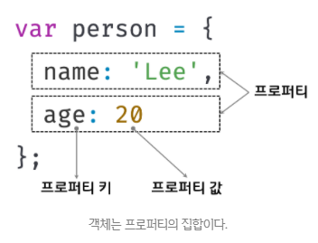

- 자바스크립트에서 사용할 수 있는 모든 값은 프로퍼티 값이 될 수 있다.
- 자바스크립트의 함수는 일급객체이므로 값으로 취급할 수 있다.
- 프로퍼티의 값이 함수일 경우, 일반 함수와 구분하기 위해 `메서드(method)`라 부른다.
<br />

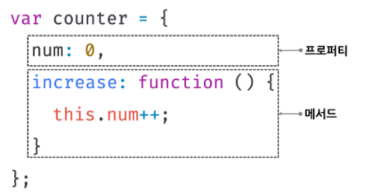

- 객체는 프로퍼티와 메서드로 구성된 집합체이다.
- 객체는 상태와 동작을 모두 포함할 수 있으므로, 상태와 동작을 하나의 단위로 구조화할 수 있어 유용하다.
- `프로퍼티` : 객체의 상태를 나타내는 `값(data)`
- `메서드` : 프로퍼티(상태 데이터)를 참조하고 조작할 수 있는 `동작(behavior)`

#### 객체리터럴에 의한 객체 생성
- C++, JAVA와 같은 클래스 기반 객체지향언어는 클래스를 사전에 정의하고, 필요한 시점에 new 연산자와 함께 생성자(constructor)를 호출하여 인스턴스를 생성하는 방식으로 객체를 생성한다.
- 자바스크립트는 `프로토타입 기반 객체지향 언어`로서 클래스 기반 객체지향 언어와는 달리 다양한 객체 생성 방법을 지원한다.
	- `객체 리터럴` : 중괄호({...}) 내에 0개 이상의 프로퍼티를 정의 
	- Object 생성자 함수
	- 생성자 함수
	- Object.create 메서드
	- 클래스(ES6)

- `객체 리터럴`은 자바스크립트의 유연함과 강력함을 대표하는 객체 생성 방식이다.
- 객체를 생성하기 위해 클래스를 정의하고, new 연산자와 함께 생성자를 호출할 필요가 없다. 숫자 값이나 문자열을 만드는 것과 유사하게 리터럴로 객체를 생성한다.
- 객체 리터럴의 중괄호는 코드 블록을 의미하지 않는다. 
- 코드 블록을 닫는 중괄호 뒤에는 세미콜론을 붙이지 않는다.
- 하지만, 객체 리터럴은 값으로 평가되는 표현식이다. 따라서 객체 리터럴의 닫는 중괄호 뒤에는 세미콜론을 붙인다.

#### 인스턴스(instance)
- 클래스에 의해 생성되어 `메모리에 저장된 실체`
- 객체지향 프로그래밍에서 `객체` : `클래스 + 인스턴스`를 포함한 개념
- `클래스` : 인스턴스를 생성하기 위한 템플릿(본보기) 역할
- `인스턴스` : 객체가 메모리에 저장되어 실제로 존재하는 것에 초점을 맞춘 용어

#### 프로퍼티(property)
- 객체는 `프로퍼티(property)의 집합`이며, 프로퍼티는 키(key)와 값(value)으로 구성된다.
- 프로퍼티 `키` : 빈 문자열을 포함하는 모든 `문자열` 또는 `심벌 값`
- 프로퍼티 `값` : 자바스크립트에서 사용할 수 있는 `모든 값`
- 프로퍼티 키는 값에 접근할 수 있는 이름으로서 식별자 역할
- 프로퍼티 키에 식별자 네이밍 규칙을 준수하는 이름, 즉, 자바스크립트에서 사용 가능한 유효한 이름이면 따옴표를 생략할 수 있다.
- 반대로, 식별자 네이밍 규칙을 따르지 않는 이름에는 반드시 따옴표를 사용해야 한다.
<br />


- 자바스크립트 엔진은 따옴표를 생략한 last-name은 –연산자가 있는 표현식으로 해석한다. (따옴표를 안쓰면 SyntaxError)
<br />

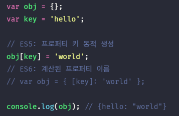
- 문자열 또는 문자열로 평가할 수 있는 표현식을 사용해 프로퍼티 키를 동적으로 생성할 수도 있다. 이 경우 프로퍼티 키로 사용할 표현식을 대괄호([...])로 묶어야 한다.
<br />

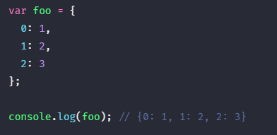
- 프로퍼티 키에 문자열이나 심벌 값 이외의 값을 사용하면 `암묵적 타입 변환을 통해 문자열`이 된다. 
- 예를 들어, 프로퍼티 키로 숫자 리터럴을 사용하면 따옴표는 붙지 않지만 내부적으로 문자열로 변환된다.

#### 메서드(method)
- `프로퍼티 값이 함수일 경우` 일반함수와 구분하기 위해 메서드(method)라고 부른다.
- 메서드는 `객체에 묶여있는 함수`를 의미한다.

#### 프로퍼티에 접근하는 방법
- `마침표 표기법(dot notation)` : 마침표 프로퍼티 접근 연산자(.)를 사용 
- `대괄호 표기법(bracket notation)` : 대괄호 프로퍼티 접근 연산자([...])를 사용
- 프로퍼티키가 식별자 네이밍 규칙을 준수하는 이름, 즉, 자바스크립트에서 사용가능한 유효한 이름이면 마침표 표기법과 대괄호 표기법을 모두 사용할 수 있다.
- 대괄호 프로퍼티 접근 연산자 내부에 지정하는 프로퍼티 키는 반드시 `따옴표로 감싼 문자열`이어야 한다. 그렇지 않을경우 자바스크립트 엔진은 따옴표로 감싸지 않은 이름을 식별자로 해석한다.
```javascript
var person = {
	name: ‘Lee’
};

console.log(person[name]); //ReferenceError: name is not defined
```
- 대괄호 연산자 내에 따옴표로 감싸지 않은 이름, 즉 식별자 name을 평가하기 위해 선언된 name을 찾았지만 찾지 못했기 때문에 error. 

```javascript
var person = {
	name: ‘Lee’
};

console.log(person.age); //undefined
```
- `객체에 존재하지 않는 프로퍼티에 접근하면` `undefined` 반환

- 프로퍼티 키가 네이밍 규칙을 준수하지 않는 이름, 즉 자바스크립트에서 사용 가능한 유효한 이름이 아니면 반드시 대괄호 표기법을 사용해야 한다.
- 단, 프로퍼티 키가 숫자로 이뤄진 문자열인 경우 따옴표를 생략할 수 있다.
<br />

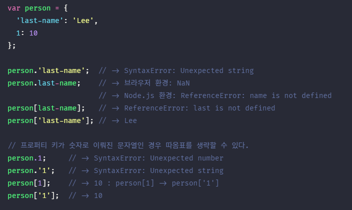

- `person.last-name`의 실행 결과는 Node.js 환경에서 “ReferenceError: name is not defined”이고 브라우저 환경에서는 `NaN`이다.
- `person.last-name`을 실행할 때 자바스크립트 엔진은 먼저 person.last를 평가한다. person 객체에는 last인 프로퍼티가 없으므로 person.last는 `undefined`로 평가된다. 따라서 `person.last-name`은 `undefined – name`과 같다. 다음으로 자바스크립튼 엔진은 name이라는 식별자를 찾는다. 이때 name은 프로퍼티 키가 아니라 식별자로 해석된다.
- Node.js 환경에서는 현재 어디에도 name이라는 식별자(변수, 함수 등의 이름) 선언이 없으므로 “ReferenceError: name is not defined” 에러가 발생한다.
- 브라우저 환경에서는 name이라는 전역변수가 암묵적으로 존재한다. 전역변수 name은 창(전역 객체 window의 프로퍼티)의 이름을 가리키며, 기본값은 빈 문자열이다. 따라서 `person.last-name`은 `undefined - ‘’` 과 같으므로 `NaN`이 된다.

#### 프로퍼티 삭제
- `delete` 연산자는 프로퍼티를 삭제한다. 이때 delete 연산자의 피연산자는 프로퍼티 값에 접근할 수 있는 표현식이어야 한다.
- 만약 존재하지 않는 프로퍼티를 삭제하면 아무런 에러 없이 무시된다.
```javascript
var person = {
	name: ‘Kim’
}

person.age = 20;
delete person.age;
delete person.address; // 에러가 발생하지 않고, 무시됨

console.log(person); // {name: “Kim”}
```

#### ES6에서 추가된 객체 리터럴의 확장 기능
1. 프로퍼티의 축약 표현
- 프로퍼티의 값은 변수에 할당된 값, 즉 식별자 표현식일 수도 있다.
```javascript
// ES5
var x = 1, y = 2;

var obj = {
	x: x,
	y: y	
};

console.log(obj); // {x: 1, y: 2}
```

```javascript
// ES6
var x = 1, y = 2;
const obj = { x, y };
console.log(obj); // {x: 1, y: 2}
```
- ES6에서는 프로퍼티 값으로 변수를 사용하는 경우, 변수 이름과 프로퍼티 키가 같은 이름일 때, `키를 생략(property shorthand)`할 수 있다. 
- 이때, 프로퍼티 키는 변수 이름으로 자동 생성된다.

2. 계산된 프로퍼티 이름
- 문자열 또는 문자열로 타입 변환할 수 있는 값으로 평가되는 표현식을 사용해 프로퍼티 키를 동적으로 생성할 수도 있다. 
- 단, 프로퍼티 키로 사용할 표현식을 대괄호([...])로 묶어야 한다. 이를 `계산된 프로퍼티 이름(computed property name)`이라 한다.

```javascript
// ES5
var prefix = ‘prop’;
var i = 0;

var obj = {};

obj[prefix + ‘-’ + ++i] = i;
obj[prefix + ‘-’ + ++i] = i;
obj[prefix + ‘-’ + ++i] = i;

console.log(obj); // {prop-1: 1, prop-2: 2, prop-3: 3}
```

```javascript
// ES6
const prefix = ‘prop’;
let i = 0;

// 객체 리터럴 내부에서 계산된 프로퍼티 이름으로 프로퍼티 키 동적 생성
const obj = {
	[`${prefix}-${++i}`]: i,
	[`${prefix}-${++i}`]: i,
	[`${prefix}-${++i}`]: i
};

console.log(obj); //{prop-1: 1, prop-2: 2, prop-3: 3}
```

3. 메서드 축약 표현
```javascript
// ES5, 프로퍼티 값으로 함수를 할당
var obj = {
	name: ‘Lee’,
	sayHi: function() {
		console.log(‘Hi! ’ + this.name);
	}
};
obj.sayHi(); // Hi! Lee
```

```javascript
// ES6
const obj = {
	name: ‘Lee’;
	// 메서드 축약 표현, function 키워드 생략
	sayHi() {
		console.log(‘Hi! ’+ this.name);
	}
};

obj.sayHi(); // Hi! Lee
```
- ES6의 메서드 축약표현으로 정의한 메서드는 프로퍼티 값으로 할당한 함수와 다르게 동작한다.

#### 원시값과 객체의 비교
- 자바스크립트에서 제공하는 7가지 데이터 타입(숫자, 문자열, 불리언, null, undefined, 심벌, 객체 타입)은 `원시 타입(primitive type)`과 `객체 타입(object/ reference type)`으로 구분할 수 있다.
- 원시타입과 객체 타입은 크게 3가지 측면이 다르다.

1. 원시 타입의 값, 즉 원시값은 `변경 불가능한 값(immutable value)`이다. 이에 비해 객체(참조) 타입의 값, 즉 객체는 `변경 가능한 값(mutable value)`이다.
2. 원시값을 변수에 할당하면 변수(확보된 메모리 공간)에는 `실제 값`이 저장된다. 이에 비해 객체를 변수에 할당하면 변수(확보된 메모리 공간)에는 `참조 값`이 저장된다.
3. 원시값을 갖는 변수를 다른 변수에 할당하면 원본의 `원시값이 복사`되어 전달된다. 이를 `값에 의한 전달(pass by value)`이라 한다. 이에 비해 객체를 가리키는 변수를 다른 변수에 할당하면 `원본의 참조값이 복사`되어 전달된다. 이를 `참조에 의한 전달(pass by reference)`이라 한다.

#### 원시값
1. 변경 불가능한 값(immutable value)
- 한 번 생성된 원시값은 `읽기 전용(read only) 값`으로서 변경할 수 없다.
- 변경 불가능하다는 것은 변수가 아니라 `값에 대한 진술`이다.
- 원시값 자체를 변경할 수 없다는 것이지 `변수 값을 변경할 수 없다는 것이 아니다.` 변수는 언제든지 재할당을 통해 값을 교체할 수 있다. 그래서 변수라 부른다.
- 변수는 언제든지 재할당을 통해 변수 값을 변경(교체)할 수 있지만, 상수는 단 한 번만 할당이 허용되므로 변수 값을 변경(교체)할 수 없다.
- 따라서 상수와 변경 불가능한 값을 동일시하는 것은 곤란하다. 상수는 재할당이 금지된 변수일 뿐이다.

```javascript
const o = {};

// const 키워드를 사용해 선언한 변수에 할당한 원시값(상수)은 변경할 수 없다.
// 하지만, const 키워드를 사용해 선언한 변수에 할당한 객체는 변경할 수 있다.
o.a = 1;
console.log(o); // {a:1}
```

- 이러한 원시값의 특성은 데이터의 `신뢰성을 보장`한다.
- 변수 값을 변경하기 위해 원시값을 재할당하면 새로운 메모리 공간을 확보하고 재할당한 값을 저장한 후, 변수가 참조하던 메모리 공간의 주소를 변경한다. 이러한 특성을 `불변성(immutability)` 이라 한다.
- 불변성을 갖는 원시값을 할당한 변수는 재할당 이외에 변수 값을 변경할 수 있는 방법이 없다.

2. 문자열과 불변성
- 원시 타입 별로 메모리 공간의 크기가 미리 정해져 있다고 했다. ECMAScript 사양에 `문자열 타입(2byte)`과 `숫자 타입(8byte)` 이외의 원시 타입은 크기가 명확히 규정하고 있지는 않아서 브라우저 제조사의 구현에 따라 원시 타입의 크기는 다를 수 있다.
- `문자열` : 0개 이상의 문자(character)로 이뤄진 집합
- 문자열은 몇 개의 문자로 이뤄졌느냐에 따라 필요한 메모리 공간의 크기가 결정된다.
- 숫자 값은 1도, 1000000도 동일한 8byte가 필요하지만 문자열의 경우 1개의 문자로 이뤄진 문자열은 2byte, 10개의 문자로 이뤄진 문자열은 20byte가 필요하다.
- C언어 : 하나의 문자열을 위한 데이터 타입(char)만 있을 뿐, 문자열 타입은 존재하지 않는다. C에서 문자열을 문자들의 배열로 처리하고 JAVA에서는 문자열을 String 객체로 처리한다.
- `자바스크립트` : 개발자의 편의를 위해 원시 타입인 `문자열 타입을 제공`한다. 이는 자바스크립트의 장점 중 하나이다. 자바스크립트의 문자열은 변경 불가능하다. 이것은 문자열이 생성된 이후에는 변경할 수 없음을 의미한다.
- `문자열`은 `유사 배열 객체`이면서 `이터러블`이므로 배열과 유사하게 각 문자에 접근할 수 있다.

```javascript
var str = ‘string’;
// 문자열은 원시값이므로 변경할 수 없다. 이때 에러가 발생하지 않는다.
str[0] = ‘S’;

console.log(str); // string
```

- 원시값은 어떤 일이 있어도 불변한다. 따라서 예기치 못한 변경으로부터 자유롭다. 이는 `데이터의 신뢰성을 보장`한다.
- 그러나 변수에 새로운 문자열을 재할당하는 것은 물론 가능하다. 이는 기존 문자열을 변경하는 것이 아니라 새로운 문자열을 새롭게 할당하는 것이기 때문이다.

#### 유사 배열 객체(array-like object)
- 마치 배열처럼 `인덱스로 프로퍼티 값에 접근`할 수 있고, `length 프로퍼티를 갖는 객체`를 말한다.
- 문자열은 마치 배열처럼 인덱스를 통해 각 문자에 접근할 수 있고, length 프로퍼티를 갖기 때문에 유사 배열 객체이고 for 문으로 순회할 수 있다.
- 원시값을 객체처럼 사용하면 원시값을 감싸는 래퍼 객체로 자동 변환된다.

3. 값에 의한 전달(pass by value)
```javascript
var score = 80;
var copy = score;

console.log(score); // 80
console.log(copy); // 80

score = 100;

console.log(score); // 100
console.log(copy); // 80
```

- 변수에 원시값을 갖는 변수를 할당하면, 할당받는 변수(copy)에는 할당되는 변수(score)의 `원시값이 복사`되어 `전달`된다.
- 이를 `값에 의한 전달(pass by value)`이라 한다.

```javascript
var score = 80;
var copy = score;

console.log(score, copy); // 80 80
console.log(score === copy); // true

// score 변수와 copy 변수의 값은 다른 메모리 공간에 저장된 별개의 값이다.
// 따라서 score 변수의 값을 변경해도 copy 변수의 값에는 어떠한 영향도 주지 않는다.
score = 100;
console.log(score, copy); // 100 80
console.log(score === copy); // false
```
- 이때 score 변수와 copy 변수는 숫자 값 80을 갖는다는 점에서 동일하다. 하지만 score 변수와 copy 변수의 값 80은 다른 메모리 공간에 저장된 별개의 값이다. 따라서 score 변수의 값을 변경해도 copy 변수의 값에는 어떠한 영향도 주지 않는다.
<br />

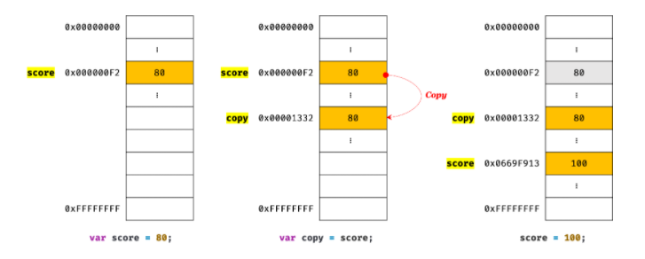

- 파이썬에서 변수
<br />

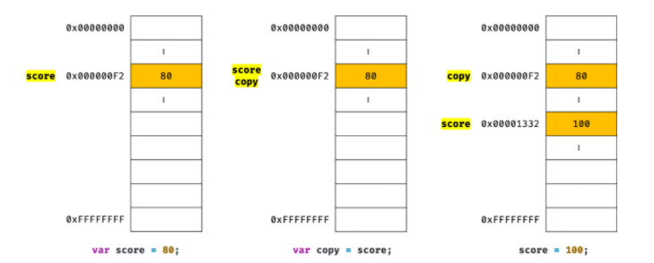

- 파이썬에서 변수는 원시값을 갖는 변수를 할당하는 시점에는 두 변수가 같은 원시값을 참조하다가 어느 한쪽의 변수에 재할당이 이뤄졌을 때 비로소 새로운 메모리 공간에 재할당된 값을 저장하도록 동작할 수 있다.

- “값에 의한 전달”과 “참조에 의한 전달”이라는 용어를 사용하지만 `공유에 의한 전달(pass by sharing)` 이라고 표현하는 경우도 있다.
- “값에 의한 전달”이라는 용어는 자바스크립트를 위한 용어가 아니므로 사실 오해가 있을 수도 있다.
- 엄격하게 표현하면 변수에는 값이 전달되는 것이 아니라 `메모리 주소가 전달`되기 때문이다. 이는 변수와 같은 식별자는 값이 아니라 메모리 주소를 기억하고 있기 때문이다.
- `식별자` : 메모리 `주소`에 붙인 이름

```javascript
var score = 80;
var copy = score;
```
- 이때 2가지 평가 방식이 가능하다.
1. 새로운 80을 생성(복사)해서 메모리 주소를 전달하는 방식. 이 방식은 할당 시점에 두 변수가 기억하는 메모리 주소가 다르다. (자바스크립트) 
2. score의 변수값 80의 메모리 주소를 그대로 전달하는 방식. 이 방식은 할당 시점에 두 변수가 기억하는 메모리 주소가 같다. (파이썬)

- “값에 의한 전달”더 사실은 값을 전달하는 것이 아니라 `메모리 주소`를 전달한다. 
- 단, 전달된 메모리 주소를 통해 메모리 공간에 접근하면 값을 참조할 수 있다.

#### 객체
- 프로퍼티의 개수가 정해져 있지 않으며, `동적으로 추가되고 삭제될 수 있다.`
- 또한, 프로퍼티 값에도 제약이 없다. 따라서 객체는 원시값같이 확보해야 할 `메모리 공간의 크기를 사전에 정해 둘 수 없다.`
- 원시값은 상대적으로 적은 메모리를 소비하지만, 객체는 때에 따라 크기가 매우 클 수도 있다. 객체를 생성하고 프로퍼티에 접근하는 것도 원시값과 비교할 때 비용이 많이 드는 일이다.


#### 자바스크립트 객체의 관리 방식
- 자바스크립트 객체는 `프로퍼티 키`를 `인덱스로 사용`하는 `해시 테이블`(hach table, 해시 테이블은 연관 배열, map, dictionary, lookup table이라고 부르기도 한다.)이라고 생각할 수 있다. 
- 대부분의 자바스크립트 엔진은 해시 테이블과 유사하지만 높은 성능을 위해 일반적인 해시 테이블보다 나은 방법으로 객체를 구현한다.
<br />

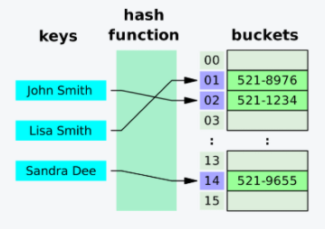
- JAVA, C++ 같은 클래스 기반 객체지향 프로그래밍 언어 : 사전에 정의된 클래스를 기반으로 객체(인스턴스)를 생성한다. 객체를 생성하기 이전에 이미 프로퍼티와 메서드가 정해져 있으며 그대로 객체를 생성한다. 객체가 생성된 이후에는 프로퍼티를 삭제하거나 추가할 수 없다.
- `자바스크립트` : `클래스 없이 객체를 생성할 수 있으며` 객체가 생성된 이후라도 동적으로 프로퍼티와 메서드를 추가할 수 있다. 이는 사용하기 매우 편리하지만, 성능 면에서는 이론적으로 클래스 기반 객체지향 프로그래밍 언어의 객체보다 생성과 프로퍼티 접근에 `비용이 더 많이 드는 비효율적인 방식`이다.
- 따라서 V8 자바스크립트 엔진은 프로퍼티에 접근하기 위해 동적 탐색(dynamic lookup) 대신 `히든 클래스(hidden class)`라는 방식을 사용해 C++ 객체의 프로퍼티에 접근하는 정도의 성능을 보장한다.
- 히든 클래스는 JAVA와 같이 고정된 객체 레이아웃(클래스)과 유사하게 동작한다.

#### 동적 탐색(dynamic lookup)
- 동적 타입 언어는 데이터 타입이 동적으로 정해지는 코드라서 프로퍼티의 메모리 오프셋을 컴파일할 때 결정하는 것은 불가능하다.
- 프로퍼티를 선언했을 때의 오프셋 값은 참조할 수 없게 되고, 이에 대한 대책이 따로 없는 한, 프로퍼티 값을 읽을 때마다 프로퍼티를 찾아내야 한다.
- 즉, `동적 탐색(dynamic lookup)`이 필요하다.

#### V8은 어떻게 동적탐색을 회피할까?
- V8은 `히든 클래스`를 이용하여 `동적 탐색(Dynamic Lookup)을 회피`하고 있다.
- 히든 클래스 방식이란, 프로퍼티가 바뀔 때 각각 그 프로퍼티의 오프셋을 업데이트한 뒤 그 값을 가지고 있는 방식이다.
- `객체` → `hidden class` → `프로퍼티 테이블` → `프로퍼티 비교` → `[오브젝트 + 오프셋] 위치로 접근`이라는 단계를 거쳐야만 실제 필드에 접근할 수 있다.
- 하나의 추가 동작이지만 그것이 필드접근 이라면 `전체적인 성능에 큰 영향을 미치게 된다.` → `인라인 캐싱`의 등장(inline caching)

#### 인라인 캐싱(Inline Caching)
- 인라인 캐싱의 목표 : 호출 지점에서 직접 이전의 메소드 검색의 결과를 기억해서 `런타임 메소드 바인딩의 성능을 높이는 것`
- 객체에 필드에 접근할 때, hidden class를 사용한다면 결국 우리가 얻고 싶은 것은 접근하려는 필드의 오프셋 값이다.
- 간단히 말하면 인라인 캐싱은 이 오프셋 값을 캐싱(일시로 저장)하겠다는 이야기이다.
- `인라인 캐싱`이야말로 `자바스크립트 엔진의 최적화 철학`이 가장 잘 드러나는 방법이다.

[참고](https://engineering.linecorp.com/ko/blog/v8-hidden-class/)
[참고](https://meetup.toast.com/posts/78)

1. 변경 가능한 값(mutable value)
- 객체(참조) 타입의 값, 즉 객체는 `변경 가능한 값(mutable value)`이다.
- `원시값` : 원시값을 할당한 변수가 기억하는 메모리 주소를 통해 메모리공간에 접근할 수 있다.
- `객체` : 객체를 할당한 변수가 기억하는 메모리 주소를 통해 메모리 공간에 접근하면 `참조값(reference value)`에 접근할 수 있다.
- `참조값` : `생성된 객체가 저장된 메모리 공간의 주소`, 그 자체이다.
- 객체를 할당한 변수에는 생성된 객체가 실제로 저장된 메모리 공간의 주소가 저장되어 있다. 이 값을 참조값이라고 한다. 변수는 이 참조값을 통해 객체에 접근할 수 있다.
- 원시값을 할당한 변수를 참조하면 메모리에 저장된 원시값에 접근
- 객체를 할당한 변수를 참조하면 메모리에 저장된 참조값을 통해 실제 객체에 접근

```javascript
// 할당이 이뤄지는 시점에 객체 리터럴이 해석되고, 그 결과 객체가 생성된다.
var person = {
	name: ‘Lee’
};

// person 변수에 저장된 참조값으로 실제 객체에 접근해서 그 객체를 반환한다.
console.log(person); // {name: “Lee”}
```
- 원시값을 할당한 변수 : “변수는 O값을 갖는다” 또는 “변수의 값은 O이다.”
- 객체를 할당한 변수 : “변수는 객체를 참조하고 있다.” 또는 “변수는 객체를 가리키고(point) 있다.”
- 위 예제에서 person 변수는 객체 { name: ‘Lee’ }를 가리키고(참조하고) 있다.
- 객체를 할당한 변수는 `재할당 없이 객체를 직접 변경`할 수 있다. 
- 즉, 재할당 없이 프로퍼티를 동적으로 추가할 수도 있고 프로퍼티 값을 갱신할 수도 있으며 프로퍼티 자체를 삭제할 수도 있다.

```javascript
var person = {
	name: ‘Lee’
};

person.name = ‘Kim’;
person.address = ‘Seoul’;
console.log(person); // {name: “Kim”, address: “Seoul”}
```
<br />

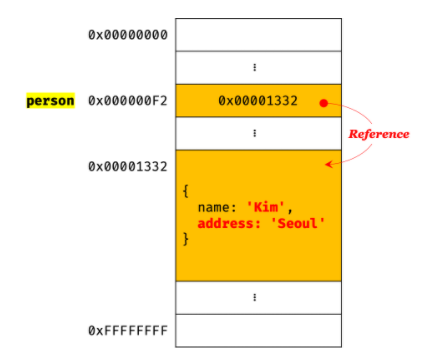
- 원시값은 변경 불가능한 값이므로 원시값을 갖는 변수의 값을 변경하려면 `재할당`을 통해 메모리의 원시값을 새롭게 생성해야 한다.
- 객체는 `변경 가능한 값`이므로 저장된 객체를 `직접 수정`할 수 있다.
- 이때 객체를 할당한 변수에 재할당을 하지 않았으므로 객체를 할당한 변수의 참조값은 변경되지 않는다.

- 객체를 변경할 때마다 원시값처럼 이전 값을 복사해서 새롭게 생성한다면 명확하고 신뢰성이 확보되겠지만, 객체는 크기가 매우 클 수 있고 원시값처럼 크기가 일정하지도 않으며, 프로퍼티 값이 객체일 수도 있어서 복사(deep copy)해서 생성하는 비용이 많이 든다. 다시 말해 `메모리 효율적 소비가 어렵고, 성능이 나빠진다.`
- 따라서 메모리를 효율적으로 사용하기 위해, 그리고 객체를 복사해 생성하는 비용을 절약하여 성능을 향상시키기 위해 `객체는 변경 가능한 값으로 설계`되어 있다.
- 메모리 사용의 효율성과 성능을 위해 어느 정도의 구조적인 단점을 감안한 설계라고 할 수 있다.
- 객체는 이러한 구조적 단점에 따른 부작용이 있다. 그것은 원시값과는 다르게 `여러 개의 식별자가 하나의 객체를 공유할 수 있다.`는 것이다.

#### 얕은 복사(shallow copy)와 깊은 복사(deep copy)
- 객체를 프로퍼티 값으로 갖는 객체의 얕은 복사 : 한 단계까지만 복사하는 것을 의미
- 객체를 프로퍼티 값으로 갖는 객체의 깊은 복사 : 객체에 중첩된 객체까지 모두 복사하는 것을 의미
<br />

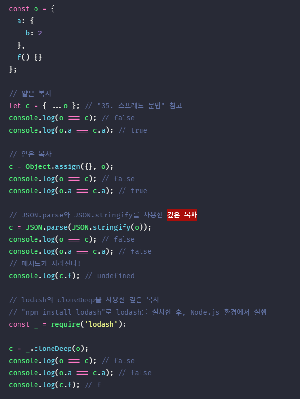
- 얕은 복사와 깊은 복사로 생성된 객체는 `원본과는 다른 객체`이다.
- 즉, 원본과 복사본은 `참조값이 다른 별개의 객체`이다.
- 얕은 복사는 객체에 중첩된 객체의 경우 참조값을 복사
- 깊은 복사는 객체에 중첩된 객체까지 모두 복사해서 원시값처럼 완전한 복사본을 만든다.

```javascript
const v = 1;
// “깊은 복사”라고 부르기도 함
const c1 = v;
console.log(c1 === v); // true

const o = { x: 1 };

// “얕은 복사”라고 부르기도 함
const c2 = o;
console.log(c2 === o); // true
```
- `원시값`을 할당한 변수를 다른 변수에 할당하는 것을 `깊은 복사`
- `객체`를 할당한 변수를 다른 변수에 할당하는 것을 `얕은 복사`라고 부르는 경우도 있다.

2. 참조에 의한 전달(pass by reference)
```javascript
var person = {
	name: ‘Lee’
};

// 참조값을 복사(얕은 복사)
var copy = person;
```
<br />

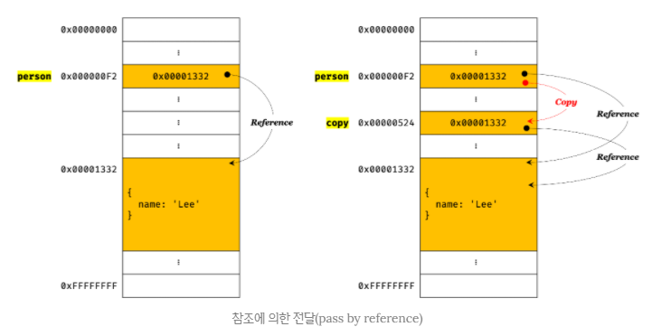

- 객체를 가리키는 변수(원본, person)를 다른 변수(사본, copy)에 할당하면 원본의 `참조값`이 복사되어 전달된다.
- 이를 `참조에 의한 전달(pass by reference)`이라 한다.
- 원본 person과 사본 copy는 저장된 메모리 주소는 다르지만, `동일한 참조값을 갖는다.`(동일한 객체를 가리킨다.)
- 두 개의 식별자가 하나의 객체를 공유한다는 것을 의미
- 따라서, 원본 또는 사본 중 어느 한쪽에서 객체를 변경하면 서로 영향을 주고받는다.
```javascript
var person = {
	name: ‘Lee’
};
// 참조값을 복사(얕은 복사). copy와 person은 동일한 참조값을 갖는다.
var copy = person;

// copy와 person은 동일한 객체를 참조한다.
console.log(copy === person); // true

copy.name = ‘Kim’;
person.name = ‘Seoul’;

// copy와 person은 동일한 객체를 가리킨다.
// 따라서 어느 한쪽에서 객체를 변경하면 서로 영향을 주고받는다.
console.log(person); // {name: “Kim”, address: “Seoul”}
console.log(copy); // {name: “Kim”, address: “Seoul”}
``` 

- `값에 의한 전달`과 `참조에 의한 전달`의 `공통점` : 식별자가 기억하는 메모리 공간에 저장된 값을 `복사해서 전달`한다는 면에서 동일하다. 
- 다만, 식별자가 기억하는 메모리 공간, 즉 `변수에 저장된 값이 원시값이냐 참조값이냐의 차이`만 있을 뿐이다.
- 따라서 자바스크립트에는 “참조에 의한 전달”은 존재하지 않고, `"값에 의한 전달"만이 존재`한다고 말할 수 있다.

```javascript
var person1 = {
	name: ‘Lee’
};

var person2 = {
	name: ‘Lee’
};

console.log(person1 === person2); // false
console.log(person1.name === person2.name); // true
```

</div> 
</details>

---