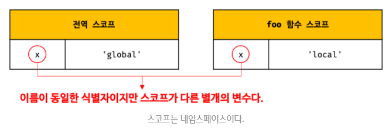
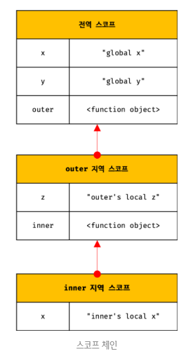

## JAVASCRIPT
<details open>
<summary>6일차</summary>
<div markdown="6">

#### 스코프(scope, 유효범위)
```javascript
var var1 = 1; // 코드의 가장 바깥 영역에서 선언한 변수

if (true) {
  var var2 = 2; // 코드 블록 내에서 선언한 변수
	if (true) {
		var var3 = 3; // 중첩된 코드 블록 내에서 선언한 변수
	}
}

function foo() {
	var var4 = 4; // 함수 내에서 선언한 변수

	function bar() {
		var var5 = 5; // 중첩된 함수 내에서 선언한 변수
	}
}

console.log(var1); // 1
console.log(var2); // 2
console.log(var3); // 3
console.log(var4); // ReferenceError: var4 is not defined
console.log(var5); // ReferenceError: var5 is not defined
```
- 모든 식별자(변수 이름, 함수 이름, 클래스 이름 등)는 자신이 `선언된 위치`에 의해 다른 코드가 식별자 자신을 참조할 수 있는 `유효범위가 결정`된다.
- `스코프` : `식별자가 유효한 범위`

```javascript
var x = 'global';

function foo() {
	var x = 'local';
	console.log(x); // local
}

foo();

console.log(x); // global
```
- 위 예제에서 자바스크립트 엔진은 이름이 같은 두 개의 변수 중에서 어떤 변수를 참조해야할 것인지를 결정해야 한다. 
- 이를 `식별자 결정(identifier resolution)` 이라 한다.
- 자바스크립트 엔진은 스코프를 통해 어떤 변수를 참조해야 할 것인지를 결정한다.
- 따라서 `스코프`란 자바스크립트 엔진이 `식별자를 검색할 때 사용하는 규칙`이라고도 할 수 있다.
- 자바스크립트 엔진은 코드를 실행할 때 코드의 `문맥(context)`을 고려한다. 코드가 어디서 실행되며 주변에 어떤 코드가 있는지에 따라 위 예제처럼 다른 결과를 만들어낸다.
- 식별자를 찾는 알고리즘 : 참조하려는 변수가 포함되어져 있는 스코프를 찾는다.(현재 실행 중인 실행컨텍스트에의 렉시컬 환경에서 참조하려는 변수를 찾는다.) → 없다면 상위 스코프로 올라간다.(단뱡향 링크드 리스트)
- 자료구조 스택에서 가장 top에 있는 것이 `현재 실행 중인 실행 컨텍스트`이다.
- 식별자를 찾을 때, 현재 실행 중인 실행 컨텍스트 내에서 찾는다.

- 위 예제에서 코드의 가장 바깥 영역에 선언된 x 변수는 어디서든 참조할 수 있다. 하지만 foo 함수 내부에서 선언된 x 변수는 foo 함수 내부에서만 참조할 수 있고 foo 함수 외부에서는 참조할 수 없다. 이때 두 개의 x 변수는 식별자 이름이 동일하지만 자신이 유효한 범위, 즉 스코프가 다른 별개의 변수다.
<br />



- 식별자는 어떤 값을 구별할 수 있어야 하므로 `유일(unique)`해야 한다. 따라서 식별자인 변수 이름은 중복될 수 없다. 즉, `하나의 값`은 `유일한 식별자(name binding)`에 연결되어야 한다.
- 프로그래밍 언어에서는 `스코프(유효범위)`를 통해 식별자인 변수 이름의 `충돌을 방지하여 같은 이름의 변수를 사용할 수 있게 한다.`
- 스코프 내에서 식별자는 유일해야 하지만 다른 스코프에는 같은 이름의 식별자를 사용할 수 있다. 
- 즉, `스코프는 네임스페이스다.`

#### 코드의 문맥(context)과 환경(environment)
- `렉시컬 환경(lexical environment)` : 코드가 어디서 실행되며 주변에 어떤 코드가 있는지를 `렉시컬 환경`이라고 부른다. 즉, 코드의 문맥(context)은 렉시컬 환경으로 이뤄진다.
- 렉시컬 환경을 구현한 것이 `실행 컨텍스트(execution context)`이며, `모든 코드는 실행 컨텍스트에서 평가되고 실행`된다.

```javascript
function foo() {
	var x = 1;
	var x = 2;
	console.log(x); // 2
}
```
#### var 키워드로 선언한 변수의 중복 선언
- var 키워드로 선언된 변수는 같은 스코프 내에서 `중복 선언이 허용`된다. 이는 의도치 않게 변수값이 재할당되어 변경되는 부작용을 발생시킨다. 
- 하지만 `let`이나 `const` 키워드로 선언된 변수는 같은 스코프 내에서 `중복 선언을 허용하지 않는다.`

```javascript
function bar() {
	let x = 1;
	let x = 2; // SyntaxError: Identifier ‘x’ has already been declared 
}
bar();
```

#### 스코프의 종류
- 코드는 `전역(global)`과 `지역(local)`으로 구분할 수 있다.

| 구분 | 설명                  | 스코프      | 변수      |
| ---- | --------------------- | ----------- | --------- |
| 전역 | 코드의 가장 바깥 영역 | 전역 스코프 | 전역 변수 |
| 지역 | 함수 몸체 내부        | 지역 스코프 | 지역 변수 |

- 변수는 자신이 `선언된 위치`(전역 또는 지역)에 의해 자신이 유효한 범위인 `스코프가 결정`된다. 
- 즉, 전역에서 선언된 변수는 전역스코프를 갖는 전역 변수이고, 지역에서 선언된 변수는 지역 스코프를 갖는 지역 변수다.

전역과 전역 스코프
```javascript
var x = 'global x';
var y = 'global y';

function outer() {
	var z = 'outer’s local z';

	console.log(x); // global x
	console.log(y); // global y
	console.log(z); // outer’s local z

	function inner() {
		var x = "inner's local x";

		console.log(x); // inner's local x
		console.log(y); // global y
		console.log(z); // outer’s local z
	}

	inner();
}

outer();

console.log(x); // global x
console.log(z); // ReferenceError: z is not defined
```
- 위 예제에서 코드 가장 바깥 영역인 전역에서 선언된 x 변수와 y 변수는 전역 변수다. 전역 변수는 어디서든지 참조할 수 있으므로 함수 내부에서도 참조할 수 있다.
- `전역 변수는 어디서든지 참조할 수 있다.`

#### 지역과 지역 스코프
- 지역이란 `함수 몸체 내부`를 말한다.
- 지역은 `지역 스코프(local scope)`를 만든다.
- 지역에 변수를 선언하면 지역스코프를 갖는 지역 변수(local variable)가 된다.
- `지역 변수는 자신의 지역 스코프와 하위 지역 스코프에서 유효하다.`
- 위의 코드에서 inner함수 내부에서 x 변수를 참조하면 전역 변수 x를 참조하는 것이 아니라 inner 함수 내부에서 선언된 x 변수를 참조한다. 
- 이는 `자바스크립트 엔진`이 `스코프 체인(scope chain)`을 통해 참조할 `변수를 검색(identifier resolution)`

#### 스코프 체인(scope chain)
- 함수는 중첩될 수 있으므로 함수의 `지역 스코프도 중첩될 수 있다.`
- 이는 스코프가 `함수의 중첩에 의해 계층적 구조를 갖는다.`는 것을 의미한다.
- 중첩 함수의 지역 스코프는 중첩 함수를 포함하는 외부 함수의 지역 스코프와 계층적 구조를 갖는다. 
- 이때 외부 함수의 지역 스코프를 중첩함수의 `상위 스코프`라 한다.
- 위의 예제에서는 outer 함수가 만든 지역 스코프는 inner 함수가 만든 지역 스코프의 상위 스코프다. 
- 그리고 outer 함수의 지역 스코프의 상위 스코프는 전역 스코프다.
<br />



- 이처럼 모든 스코프는 하나의 계층적 구조로 연결되며, `모든 지역 스코프의 최상위 스코프는 전역 스코프`이다. 
- 이렇게 스코프가 계층적으로 연결된 것을 `스코프 체인(scope chain)`이라 한다.
- 변수를 참조할 때 자바스크립트 엔진은 스코프 체인을 통해 변수를 참조하는 코드의 스코프에서 시작하여 `상위 스코프 방향`으로 이동하며 `변수를 검색(identifier resolution)`한다.
- 이를 통해 상위 스코프에서 선언한 변수를 하위 스코프에서도 참조할 수 있다.
- `스코프 체인은 물리적인 실체로 존재한다.` 자바스크립트 엔진은 코드를 실행하기에 앞서 위 그림과 유사한 자료구조인 `렉시컬 환경(Lexical Evironment)을 실제로 생성`한다.
- 변수 선언이 실행되면 변수 식별자가 이 자료구조(렉시컬 환경)에 키로 등록하고, 변수 할당이 일어나면 이 자료구조에 변수 식별자에 해당하는 값을 변경한다.
- 변수 검색도 이 자료구조 상에서 이뤄진다.

#### 렉시컬 환경(Lexical Environment)
- `스코프 체인`은 `실행 컨텍스트의 렉시컬 환경을 단방향으로 연결(chaining)한 것`이다.
- `전역 렉시컬 환경`은 `코드가 로드되면 곧바로 생성`되고 `함수의 렉시컬 환경`은 `함수가 호출되면 곧바로 생성`된다.

#### 스코프 체인에 의한 변수 검색
- 자바스크립트 엔진은 스코프 체인을 따라 변수를 참조하는 코드의 스코프에서 시작해서 `상위 스코프 방향`으로 이동하며 선언된 변수를 검색한다.
- 절대 하위 스코프로 내려가며 식별자를 검색하는 일은 없다. 
- 이는 `상위 스코프에서 유효한 변수는 하위 스코프에서 자유롭게 참조할 수 있지만 하위 스코프에서 유효한 변수를 상위 스코프에서 참조할 수 없다는 것을 의미`한다. 
- 스코프 체인으로 연결된 스코프의 계층적 구조는 부자관계로 이뤄진 `상속(inheritence)`과 유사하다.

#### 스코프 체인에 의한 함수 검색
```javascript
// 전역 함수
function foo() {
	console.log(‘global function foo’);
}

function bar() {
	// 중첩 함수
	function foo() {
		console.log(‘local function foo’);
	}
	foo(); // ①
}

bar(); // “local function foo”
```
- 함수 선언문으로 함수를 정의하면 `런타임 이전에 함수 객체가 먼저 생성`된다.
- 함수 객체가 만들어질 때(런타임 이전), 상위 스코프를 결정한다.
- 상위 스코프를 기억하기위해 `내부슬롯([[]])`에 상위스코프를 저장한다.
- 자바스크립트 엔진은 함수 이름과 동일한 이름의 식별자를 암묵적으로 선언하고 생성된 함수 객체를 할당한다.
- 위 예제 ①번에서 함수를 호출하면 자바스크립트 엔진은 함수를 호출하기 위해 먼저 함수를 가리키는 식별자 foo를 검색한다.
- 함수를 호출하면 함수 스코프 내부에서 `선언문을 먼저 실행`한다.(매개변수, arguments 객체도 호출되자 마자 미리 선언됨)
- 함수가 정의만되고, 호출이 안될 수도 있어서 함수 몸체는 함수가 호출되면 실행된다.
- 전역 스코프는 코드가 실행되자마자 만들어지고, 함수 스코프는 `함수가 호출되면 만들어진다.`

- 사실 `var x = 1`에서 `x = 2`는 새로운 공간에 메모리공간을 만드는 것이 아니라 객체이기 때문에 값이 갱신된다.
- 모든 식별자는 자신의 스코프 내에서서 프로퍼티 키, 값이 기 때문이다. (객체다.)

- 이처럼 `함수도 식별자에 할당되기 때문에 스코프를 갖는다.` 사실 함수는 식별자에 함수 객체가 할당되는 것 이외는 일반 변수와 다를 바가 없다.
- 따라서 `스코프`를 ‘변수 검색할 때 사용하는 규칙’이라고 표현하기 보다는 `식별자를 검색하는 규칙`이라고 표현하는 편이 좀 더 적합하다.

#### 함수 레벨 스코프
- 코드 블록이 아닌 함수에 의해서만 지역 스코프가 생성된다.
- `블록 레벨 스코프(block level scope)` : C, JAVA 등을 비롯한 대부분의 프로그래밍 언어는 함수 몸체만이 아니라 코드 블록(if, for, while, try/catch 등)이 지역 스코프를 만든다. 이러한 특성을 블록 레벨 스코프라 한다. 
- `함수 레벨 스코프(function level scope)` : `var 키워드로 선언된 변수`는 오로지 함수의 코드 블록(함수 몸체)만을 지역 스코프로 인정한다. 이러한 특성을 함수 레벨 스코프라 한다.
```javascript
var x = 1;
if(true) {
	var x = 10;
// var 키워드로 선언된 변수는 코드 블록 내에서 선언되었다 할지라도 모두 전역 변수다.
// x는 중복 선언된다.
// 이는 의도치 않게 변수 값이 변경되는 부작용을 발생시킨다.  
// 동일한 식별자 이름의 선언문이 2개 있다면 1개의 선언문만 실행(동일한 식별자가 있는지 먼저확인)
}
console.log(x); // 10
```
```javascript
// let 키워드도 마찬가지
const d = 10;
if(true) {
    const d = 9;
    console.log(d); // 9
}
console.log(d); // 10
```
- `var 키워드`로 선언된 변수는 `함수 레벨 스코프만 인정`하기 때문에 함수 밖에서 var 키워드로 선언된 변수는 코드 블록 내에서 선언되었다 할지라도 모두 전역 변수다.

```javascript
var i = 10;

// for문에서 선언한 i는 전역 변수다. 이미 선언된 전역 변수 i가 있으므로 중복 선언된다.
for(var i = 0; i < 5; i++) {
	console.log(i); // 0 1 2 3 4
}
// 의도치 않게 값이 변경됨
console.log(i); // 5
```
```javascript
let i = 10;

for(let i = 0; i < 5; i++) {
	console.log(i); // 0 1 2 3 4
}

console.log(i); // 10
```
- 블록 레벨 스코프를 지원하는 프로그래밍 언어에서는 for문에서 반복을 위해 선언된 i 변수가 for문의 코드 블록 내에서만 유효한 지역 변수다. 이 변수를 for문 외부에서 사용할 일은 없기 때문이다.
- 하지만, `var 키워드로 선언된 변수`는 `블록 레벨 스코프를 인정하지 않기 때문에` i 변수는 전역 변수가 된다. 따라서 전역 변수 i는 중복 선언되고 그 결과 의도치 않은 전역 변수의 값이 재할당된다.
- var 키워드로 선언된 변수는 오로지 함수의 코드 블록만을 지역 스코프로 인정하지만, ES6에서 도입된 `let`, `const` 키워드는 `블록 레벨 스코프를 지원`한다.

#### 렉시컬 스코프
```javascript
var x = 1;
function foo() {
	var x = 10;
	bar();
}

function bar() {
	console.log(x);
}

foo(); // 1
bar(); // 1
```
- 위 예제의 실행결과는 bar 함수의 상위 스코프가 무엇인지에 따라 결정된다. 두 가지 패턴을 예측할 수 있다.
1. `함수를 어디서 호출`했는지에 따라 함수의 상위 스코프를 결정한다.
2. `함수를 어디서 정의`했는지에 따라 함수의 상위 스코프를 결정한다.

- 첫 번째 방식으로 함수의 상위 스코프를 결정한다면, bar 함수의 상위 스코프는 foo 함수의 지역 스코프와 전역 스코프 일 것이다.
- 두 번째 방식으로 함수의 상위 스코프를 결정한다면, bar 함수의 상위 스코프는 전역 스코프일 것이다.

- 첫 번째 방식을 `동적 스코프(dynamic scope)`라 한다. 함수를 정의하는 시점에는 함수가 어디서 호출될지 알 수 없다. 따라서 `함수가 호출되는 시점에 동적으로 상위스코프를 결정`해야하기 때문에 동적 스코프라 부른다.
- 두 번째 방식을 `렉시컬 스코프(lexical scope)` 또는 `정적 스코프(static scope)`라 한다. 동적 스코프 방식처럼 상위 스코프가 동적으로 변하지 않고 `함수 정의가 평가되는 시점`에 `상위 스코프가 정적으로 결정`되기 때문에 정적 스코프라고 부른다. 
- 렉시컬(lexical)은 영문으로 “단어, 어휘와 관련 있다.”라는 의미 → `코드`와 관련 있다.
- `자바스크립트`는 비롯한 대부분의 프로그래밍 언어는 `렉시컬 스코프`를　따른다.
- 자바스크립트는 `함수가 호출된 위치`는 `상위 스코프의 결정에 어떠한 영향도 주지 않는다.` 즉, 함수의 상위 스코프는 언제나 자신이 정의된 스코프다.
- 이처럼 함수의 상위 스코프는 함수 정의가 실행될 때 정적으로 결정된다. (정의 단계에서 스코프를 설정)
- 함수 정의(함수 선언문 또는 함수 표현식)가 실행되어 `생성된 함수 객체는 이렇게 결정된 상위 스코프를 기억`한다. 함수가 호출될 때마다 함수의 상위 스코프를 참조할 필요가 있기 때문이다.
- 렉시컬 스코프는 `클로저`와 깊은 관계가 있다.

#### 변수의 생명주기
1. 지역 변수의 생명주기
- 변수는 선언에 의해 생성되고 할당을 통해 값을 갖는다. 그리고 언젠가 소멸한다.
- 변수는 생성되고 소멸되는 `생명주기(life cycle)`가 있다.
- 변수에 생명주기가 없다면 한번 선언된 변수는 프로그램을 종료하지 않는 한 영원히 메모리 공간을 점유하게 된다.

- 전역 변수의 생명 주기는 `애플리케이션의 생명 주기와 같다.` 
- 함수 내부에서 선언된 지역변수는 함수가 호출되면 생성되고, 함수가 종료하면 소멸한다.
- 함수를 다시 호출하면, 함수를 다시 읽으면서 함수 스코프가 다시 생성된다. 
```javascript
function foo() {
	var x = ‘local’;
	console.log(x); // local
	return x;
}
foo();
console.log(x); // ReferenceError: x is not defined
```
- 지역 변수 x는 foo함수가 호출되기 이전까지는 생성되지 않는다. foo 함수를 호출하지 않으면 함수 내부의 변수 선언문이 실행되지 않기 때문이다.
- `변수 선언은 런타임 이전 단계에서 자바스크립트 엔진에 의해 먼저 실행`된다.
- 그런데 엄밀히 말하자면 위 설명은 `전역 변수에 한정`된 것이다.
- `함수 내부에서 선언한 변수`는 `함수가 호출된 직후`에 함수 몸체의 코드가 한 줄씩 순차적으로 실행되기 이전에 자바스크립트 엔진에 의해 먼저 실행된다.

- 위 예제에서 foo 함수를 호출하면 함수 몸체의 다른 문들이 순차적으로 실행되기 이전에 x 변수의 선언문이 자바스크립트 엔진에 의해 가장 먼저 실행되어 x 변수가 선언되고 undefined로 초기화된다. 그 후, 함수 몸체를 구성하는 문들이 순차적으로 실행되기 시작하고 변수 할당문이 실행되면 x 변수에 값이 할당된다. 그리고 함수가 종료하면 x 변수도 소멸되어 생명 주기가 종료된다. 따라서 함수 내부에서 선언된 지역 변수 x는 foo 함수가 호출되어 실행되는 동안에만 유효하다.
- 즉, `지역변수의 생명주기는 함수의 생명주기와 일치한다.`

- 함수 몸체 내부에서 선언된 지역변수의 생명주기는 함수의 생명주기와 대부분 일치하지만 `지역변수가 함수보다 오래 생존하는 경우`도 있다. → 클로저
- `변수의 생명주기는 메모리 공간이 확보(allocate)된 시점부터 메모리 공간이 해제(release)되어 가용 메모리 풀(memory pool)에 반환되는 시점까지다.`
- 함수 내부에서 선언된 지역 변수는 함수가 생성한 스코프에 등록된다. 함수가 생성한 스코프는 렉시컬 환경이라 부르는 물리적인 실체가 있다고 했다.
- 따라서 변수는 자신이 등록한 스코프가 소멸(스코프가 메모리에서 해제)될 때까지 유효하다.
- 할당된 메모리 공간은 더 이상 누구도 참조하지 않을 때 가비지 콜렉터에 의해 해제되어 가용 메모리 풀에 반환된다. 즉, 누군가 메모리 공간을 차지하고 있으면 해제하지 않고 확보된 상태로 남아있게 된다. 이는 스코프도 마찬가지다. 누군가 `스코프를 참조하고 있으면 스코프도 소멸되지 않고 생존`하게 된다.
- 일반적으로 함수가 종료하면 함수가 생성한 스코프도 소멸한다. 하지만 누군가가 `스코프를 참조하고 있다면 스코프는 해제되지 않고 생존`하게 된다.
- 식별자는 참조하는 대상이 없을 때, 가비지 컬렉팅의 대상이 된다.

```javascript
var x = ‘global’;
function foo() {
	console.log(x); // ① undefined
	var x = ‘local’;
}

foo();
console.log(x); // “global”
```
- foo 함수 내부에서 선언된 지역변수 x는 ①의 시점에서는 이미 선언되었고 undefined로 초기화되어 있다. 따라서 전역변수 x를 참조하는 것이 아니라 `지역변수 x를 참조해 값을 출력`한다. 
- 이처럼 `호이스팅`은 `스코프를 단위`로 동작한다. 
- 전역변수 호이스팅은 전역 변수의 선언이 전역 스코프의 선두로 끌어올려진 것처럼 동작한다. 따라서 전역 변수는 전역 객체에서 유효하다.
- 지역 변수의 호이스팅은 지역 변수의 선언이 지역 스코프의 선두로 끌어올려진 것처럼 동작한다. 따라서 지역 변수는 함수 전체에서 유효하다.
- 즉, `호이스팅은 변수 선언이 스코프의 선두로 끌어올려진 것처럼 동작하는 자바스크립트 고유의 특징`이다.

2. 전역 변수의 생명주기
- 함수와 달리 전역 코드는 명시적인 호출 없이 실행된다.
- `전역 코드`는 함수 호출과 같이 전역 코드를 실행하는 특별한 `진입점(entry point)이 없고` 코드가 로드되자마자 곧바로 해석되고 실행된다.
- 함수는 함수 몸체의 마지막 문 또는 반환문이 실행되면 종료한다.
- 전역 코드에는 반환문을 사용할 수 없으므로 마지막 문이 실행되어 더 이상 실행할 문이 없을 때 종료한다.
- `var 키워드로 선언한 전역 변수`는 `전역 객체의 프로퍼티`가 된다. 이는 `전역 변수의 생명주기`가 `전역 객체의 생명주기와 일치`한다는 것을 말한다.

- 브라우저 환경에서 전역 객체는 window이므로 브라우저 환경에서 var 키워드로 선언한 전역 변수는 전역 객체 window의 프로퍼티다.
```javascript
var global_01 = 10;
window.hasOwnProperty('global_01'); // true

let global_02 = 20;
window.hasOwnProperty('global_02'); // false

const global_03 = 30;
window.hasOwnProperty('global_03'); // false
```
- 전역 객체 window는 웹 페이지를 닫기 전까지 유효하다. 따라서 브라우저 환경에서 var 키워드로 선언한 전역 변수는 웹 페이지를 닫을 때까지 유효하다.
- `var 키워드로 선언한 전역 변수의 생명주기는 전역 객체의 생명주기와 일치한다.`

#### 진입점(entry point)
- C, JAVA로 작성한 코드를 실행하면 가장 먼저 main 함수가 호출된다. 이 main 함수는 프로그램이 시작되는 지점이므로 이를 진입점 또는 시작점이라고 한다.

#### 전역 객체(global object)
- `전역 객체` : 코드가 실행되기 이전 단계에 자바스크립트 엔진에 의해 어떤 객체보다도 `먼저 생성되는 특수한 객체`다.
- 전역 객체는 클라이언트 사이트 환경(브라우저)에서는 `window`, 서버 사이드 환경(Node.js)에서는 `global` 객체를 의미한다. 환경에 따라 전역 객체를 가리키는 다양한 식별자(window, self, this, frames, global)가 존재했으나 `ES11`에서 `globalThis`로 통일되었다.
- `전역 객체`에는 `표준 빌트인 객체`(Object, String, Number, Function, Array...)와 `환경에 따른 호스트 객체`(클라이언트 Web API 또는 Node.js의 호스트 API), 그리고 `var 키워드로 선언한 전역 변수와 전역 함수를 프로퍼티`로 갖는다.

#### 전역변수의 문제점
1. `암묵적 결합(implicit coupling)`
- 전역 변수를 선언한 의도는 전역, 즉 코드 어디서든 참조하고 할당할 수 있는 변수를 사용하겠다는 것이다.
- 이는 모든 코드가 전역 변수를 참조하고 변경할 수 있는 `암묵적 결합(implicit coupling)`을 허용하는 것이다.
- 변수의 유효범위가 크면 클수록 코드의 가독성은 나빠지고 의도치 않게 상태가 변경될 수 있는 위험성도 높아진다.

2. `긴 생명주기`
- `전역 변수는 생명주기가 길다.`
- 따라서 메모리 리소스(자원)도 오랜 기간 소비한다. 
- 전역 변수의 상태를 `변경할 수 있는 시간도 길고 기회도 많다.`
- 더욱이 var 키워드는 변수의 중복 선언을 허용하므로 생명 주기가 긴 전역 변수는 변수 이름이 중복될 가능성이 있다. 변수 이름이 중복되면 의도치 않은 재할당이 이뤄진다.
- 지역 변수는 전역 변수보다 생명 주기가 훨씬 짧다. 크지 않은 함수의 지역 변수는 생존 기간이 극히 짧다. 따라서 지역 변수의 상태를 변경할 수 있는 시간도 짧고 기회도 작다. 이는 전역 변수보다 상태 변경에 의한 오류가 발생할 확률이 작다는 것을 의미한다. 또한 메모리 리소스도 짧은 기간만 소비한다.
3. `스코프 체인 상에서 종점에 존재`
- 전역 변수는 스코프 체인 상에서 종점에 존재한다.
- 이는 변수를 검색할 때 전역 변수가 가장 마지막에 검색된다는 것을 말한다.
- 즉, `전역 변수의 검색 속도가 가장 느리다.`
- 검색 속도의 차이는 그다지 크지 않지만 속도의 차이는 분명히 있다.

4. `네임스페이스 오염`
- 자바스크립트의 가장 큰 문제점 중 하나는 파일이 분리되어 있다 해도 하나의 전역 스코프를 공유한다는 것이다.
- 따라서 다른 파일 내에서 동일한 이름으로 명명된 전역 변수나 전역 함수가 같은 스코프 내에 존재할 경우 예상치 못한 결과를 가져올 수 있다.

```javascript
<script src="app.js"><script>
<script>
	console.log(x); // 1출력
<script>
```
- `app.js 파일 안`에 var x = 1; 이 선언되어 있다면, 위의 결과는 1이 출력된다.
- 파일이 분리되어 있어도 하나의 전역스코프를 공유하기 때문이다. 

#### 전역 변수의 사용을 억제하는 방법
- 전역 변수를 반드시 사용해야 할 이유를 찾지 못한다면 지역 변수를 사용해야 한다. 
- `변수의 스코프는 좁을수록 좋다.`

1. 즉시실행 함수
- 함수 정의와 동시에 호출되는 즉시실행 함수는 단 한 번만 호출된다.
- `모든 코드를 즉시실행 함수로 감싸면 모든 변수는 즉시실행 함수의 지역변수가 된다.`
- 이러한 특성을 이용해 전역 변수의 사용을 제한하는 방법이다.
```javascript
(function () {
	var foo = 10; // 즉시 실행 함수의 지역 변수
}());

console.log(foo); // ReferenceError: foo is not defined
``` 
- 이 방법을 사용하면 전역 변수를 생성하지 않으므로 라이브러리 등에 자주 사용된다.(올드한 방법)

2. 네임스페이스 객체
- 전역에 네임스페이스(Namespace) 역할을 담당할 객체를 생성하고 전역 변수처럼 사용하고 싶은 변수를 `프로퍼티에 추가`하는 방법이다.
- ES3 방식(올드한 방법)
```javascript
var MYAPP = {}; // 전역 네임스페이스 객체
MYAPP.name = ‘Lee’;
console.log(MYAPP.name); // Lee
```
- 네임스페이스 객체에 또 다른 네임스페이스 객체를 프로퍼티로 추가해서 네임 스페이스를 계층적으로 구성할 수도 있다.

```javascript
var MYAPP = {}; // 전역 네임스페이스 객체

MYAPP.person = {
	name: ‘Lee’,
	address: ‘Seoul’
};

console.log(MYAPP.person.name); // Lee
```
- 네임스페이스를 분리해서 식별자 충돌을 방지하는 효과는 있으나 네임스페이스 객체 자체가 전역 변수에 할당되므로 그다지 유용해보이지는 않는다.

3. `모듈 패턴`
- 모듈 패턴은 `클래스를 모방`해서 관련이 있는 변수와 함수를 모아 즉시 실행 함수로 감싸 하나의 모듈을 만든다.
- 모듈 패턴은 자바스크립트의 강력한 기능인 클로저를 기반으로 동작한다.
- 클로저라는 기능은 전역 변수를 억제할 수 있다.
- 모듈 패턴의 특징은 전역 변수의 억제는 물론 `캡슐화`까지 구현할 수 있다는 것이다.

- `캡슐화(encapsulation)`는 객체의 상태(state)를 나타내는 프로퍼티와 프로퍼티를 참조하고 조작할 수 있는 동작(behavior)인 메서드를 `하나로 묶는 것`을 말한다. 캡슐화는 특정 프로퍼티나 메서드를 감출 목적으로 사용하기도 하는데 이를 `정보 은닉(information hiding)`이라 한다.

- 대부분의 객체지향 프로그래밍 언어는 클래스를 구성하는 맴버에 대해 public, private, protected 등의 접근 제한자(access modifier)를 사용해 공개 범위를 한정할 수 있다.
- public으로 선언한 데이터 또는 메서드는 외부에서 접근이 가능하지만, private으로 선언한 경우는 외부에서 접근할 수 없고 내부에서만 사용된다. 이것은 클래스 외부에는 접근 권한을 제공하며 `원하지 않는 외부의 접근으로부터 내부를 보호하는 기능`을 한다.
- 하지만, 자바스크립트는 public, private, protected 등의 접근 제한자를 제공하지 않는다.
- 모듈 패턴은 전역 네임스페이스의 오염을 막는 기능은 물론 한정적이긴 하지만 `정보은닉`을 구현하기 위해 사용한다.
```javascript
var Counter = (function () {
	// private 변수
	var num = 0;
	
	// 외부로 공개할 데이터나 메서드를 프로퍼티에 추가한 객체를 반환한다.
	return {
		increase() {
			return ++num;
		},
		decrease() {
			return --num;
		}
	};
}());

// private 변수는 외부로 노출되지 않는다.
console.log(Counter.num); // undefined

console.log(Counter.increase()); // 1
console.log(Counter.increase()); // 2 (++은 부수효과가 있기 때문에 num이 변함)
console.log(Counter.decrease()); // 1
console.log(Counter.decrease()); // 0
```
- 위 예제에서 increase의 상위스코프는 `function () {}` 과 전역 스코프이다.
- `return {}` 은 객체를 나타내는 객체 리터럴이지 지역 스코프가 아니다.
- 객체리터럴이 생성될 때, 그 안에 increase(), decrease() 함수 객체가 생성된다.
- 위 예제의 즉시실행 함수는 `객체를 반환`한다. 이 객체에는 외부에 노출하고 싶은 변수나 함수를 담아 반환한다.
- 이때 `반환되는 객체`의 프로퍼티는 외부에 노출되는 `퍼블릭 멤버(public member)`이다.
- 외부에 노출되고 싶지 않은 변수나 함수는 `반환하는 객체에 추가하지 않으면` 외부에서 접근할 수 없는 `프라이빗 멤버(private member)`가 된다.

4. ES6 모듈
- ES6 모듈을 사용하면 더는 전역 변수를 사용할 수 없다.
- `ES6 모듈`은 파일 자체의 `독자적인 모듈 스코프를 제공`한다. 즉, 모듈 내에서 var 키워드로 선언된 변수는 더는 전역 변수가 아니며 window 객체의 프로퍼티도 아니다.
- 모던 브라우저(Chrome 61, FF 60, SF 10.1, Edge 16 이상)에는 ES6 모듈을 사용할 수 있다. 
- script 태그에 `type=“module”` 어트리뷰트를 추가하면 로드된 자바스크립트 파일은 모듈로서 동작한다. 모듈의 확장자는 mjs를 권장한다.
```javascript
<script type=“module” src=“lib.mjs”></script>
<script type=“module” src=“app.mjs”></script>
``` 
- ES6 모듈은 IE를 포함한 구형 브라우저에서는 동작하지 않으며, 브라우저의 ES6 모듈 기능을 사용하더라도 트랜스파일링이나 번들링이 필요하기 때문에 아직까지는 브라우저가 지원하는 ES6 모듈 기능 보다는 Webpack 등의 모듈 번들러를 사용하는 것이 일반적이다.

</div> 
</details>

---