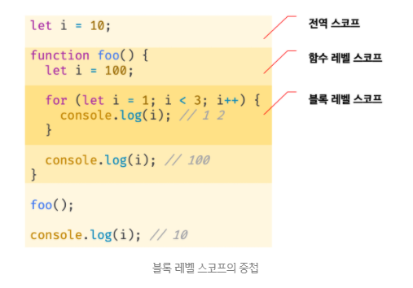
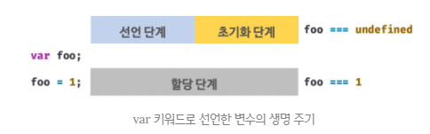
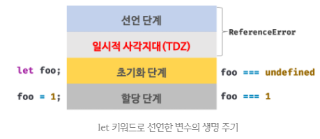
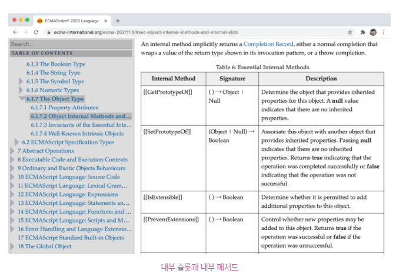

## JAVASCRIPT
<details open>
<summary>7일차</summary>
<div markdown="7">

## let, const와 블록 레벨 스코프
### var 키워드로 선언한 변수의 문제점
1. 변수 중복 선언 허용
```javascript
var x = 1;
var y = 1;

// var 키워드로 선언한 변수는 같은 스코프 내에서 중복선언을 허용한다.
// 초기화문이 있는 변수 선언문은 자바스크립트 엔진에 의해 var 키워드가 없는 것처럼 동작한다.
var x = 100;
// 초기화문이 없는 변수 선언문은 무시된다.
var y;

console.log(x); // 100
console.log(y); // 1
```
- 위 예제와 같이 만약 같은 이름의 변수가 이미 선언된 것을 모르고, 변수를 중복선언하면서 값을 할당했다면 의도치 않게 먼저 선언된 변수값이 변경되는 부작용이 발생한다.

2. 함수 레벨 스코프
- var 키워드로 선언한 변수는 오로지 함수 코드 블록만을 지역 스코프로 인정한다.
- 따라서 함수 외부에서 var 키워드로 선언한 변수는 코드 블록 내에서 선언해도 모두 전역 변수가 된다.
```javascript
var x = 1;
if (true) {
	var x = 10;
}
console.log(x); // 10
```

```javascript
let x = 1;
if (true) {
	let x = 10;
}
console.log(x); // 1
```
```javascript
var i = 10;

for (var i = 0; i < 5; i++) {
	console.log(i); // 0 1 2 3 4
}
console.log(i); // 5
```
```javascript
let i = 10;

for (let i = 0; i < 5; i++) {
	console.log(i); // 0 1 2 3 4
}
console.log(i); // 10
```
- 함수 레벨 스코프는 전역 변수의 사용을 남발할 가능성을 높인다. 
- 이로 인해 의도치 않게 전역 변수가 중복 선언되는 경우가 발생한다.

3. 변수 호이스팅
- var 키워드로 선언한 변수는 변수 호이스팅에 의해 변수 선언문이 스코프 선두로 끌어 올려진 것처럼 동작한다.
- var 키워드로 선언한 변수는 선언문 이전에 참조할 수 있다.
- 단, 할당문 이전에 변수를 참조하면 언제나 `undefined`를 반환한다.
```javascript
// 1. 선언 단계(호이스팅)
// 2. 초기화 단계(undefined로 초기화)
console.log(foo); // undefined

// 3. 할당 단계
foo = 123;
console.log(foo); // 123

// 변수 선언은 런타임 이전에 자바스크립트 엔진에 의해 암묵적으로 실행
var foo;
```
- 변수 호이스팅에 의해 에러를 발생시키지는 않지만, 프로그램 흐름상 맞지 않을뿐더러 가독성을 떨어뜨리고 오류를 발생시킬 여지를 남긴다.

let 키워드
- var 키워드의 단점을 보완하기 위해 ES6에서는 새로운 변수 선언 키워드인 `let`과 `const`를 도입했다.

1. 변수 중복 선언 금지
- let 키워드로 이름이 같은 변수를 중복선언하면 문법 에러(SyntaxError)가 발생한다.
```javascript
var foo = 123;
var foo = 456;

let bar = 123;
// let이나 const 키워드로 선언된 변수는 같은 스코프 내에서 중복선언을 허용하지 않는다.
let bar = 456; // SyntaxError: Identifier ‘bar’ has already been declared
```

2. 블록 레벨 스코프 
- let 키워드로 선언한 변수는 모든 코드 블록(함수, if문, for문, while문, try/catch문 등)을 지역 스코프로 인정하는 블록 레벨 스코프(block-level scope)를 따른다.
```javascript
let foo = 1;

{
	// 코드 블록 내에서 선언된 foo, bar 변수는 지역 변수이다.
	let foo = 2;
	let bar = 3;
}
console.log(foo); // 1
console.log(bar); // ReferenceError: bar is not defined
```

- 함수도 코드 블록이므로 스코프를 만든다. 이때 함수 내의 코드 블록은 함수 레벨 스코프에 중첩된다.
<br />



3. 변수 호이스팅
- var 키워드는 선언 단계에서 스코프(실행 컨텍스트의 렉시컬 환경)에 변수 식별자를 등록해 자바스크립트 엔진에 변수의 존재를 알린다. 그리고 즉시 초기화 단계에서 undefined로 변수를 초기화한다.
<br />



- let 키워드로 선언한 변수는 “선언 단계”와 “초기화 단계”가 분리되어 진행된다.
- 런타임 이전에 자바스크립트 엔진에 의해 암묵적으로 선언 단계가 먼저 실행되지만, 초기화 단계는 변수 선언문에 도달했을 때 실행된다.
- 만약 초기화 단계 이전에 변수에 접근하려고 하면 참조 에러(ReferenceError)가 발생한다.
- let 키워드로 선언한 변수는 스코프의 시작지점부터 초기화 시작 지점(`변수 선언문`)까지 변수를 참조할 수 없다.
- 스코프 시작지점부터 초기화 시작 시점까지 변수를 참조할 수 없는 구간을 `일시적 사각지대(Temporal Dead Zone; TDZ)`라고 부른다.

```javascript
// 1. 선언 단계(변수가 초기화되지 않음)
// 초기화 이전의 TDZ에서는 변수를 참조할 수 없다.
console.log(foo); // ReferenceError: foo is not defined

let foo; // 변수 선언문에서 초기화 단계가 실행된다.
// foo는 선언문 이후부터 유효하다.
console.log(foo); // undefined

foo = 1;
console.log(foo); // 1
```
<br />


- let 키워드로 선언한 변수는 호이스팅이 발생하지 않은 것처럼 보인다. 
- 하지만 그렇지 않다.
```javascript
let foo = 1; // 전역 변수

{
	console.log(foo); // ReferenceError: Cannot access ‘foo’ before initialization
	let foo = 2;
}
```
- let 키워드로 선언한 변수의 경우, 호이스팅이 발생하지 않았다면 위 예제는 전역변수 foo의 값을 출력해야 한다. 
- 하지만, let 키워드로 선언한 변수도 호이스팅이 발생하기 때문에 참조에러(ReferenceError)가 발생한다.
- 런타임 이전에 let으로 선언한 변수는 무언가 값이 존재하지만 무엇인지는 알 수 없다.(ECMAScript 사양에도 나와있지 않다.)
- 그 안이 빈 상태라면 error가 발생할 수 없다. 따라서 무언가 값이 있지만 알 수 없다.

- 자바스크립트 ES6에서 도입된 let, const를 포함해서 모든 선언(var, let, const, function, funciton*, class 등)을 호이스팅한다.
- 단, ES6에서 도입된 `let, const, class`를 사용한 선언문은 `호이스팅이 발생하지 않은 것처럼 동작`한다.

4. 전역객체와 let
- var 키워드로 선언한 전역변수와 전역함수, 그리고 선언하지 않은 변수에 값을 할당한 암묵적 전역은 전역객체 window의 프로퍼티가 된다. 
- 전역객체의 프로퍼티를 참조할 때 window를 생략할 수 있다.
```javascript
// 전역 변수
var x = 1;
// 암묵적 전역
y = 2;
// 전역 함수
function foo() {}

// var 키워드로 선언한 변수는 전역 객체 window의 프로퍼티다.
console.log(window.x); // 1
// 전역객체 window의 프로퍼티는 전역변수처럼 사용할 수 있다.
console.log(x); // 1

// 암묵적 전역은 전역객체 window의 프로퍼티다.
console.log(window.y); // 2
console.log(y); // 2

// 함수 선언문으로 정의한 전역 함수는 전역객체 window의 프로퍼티다.
console.log(window.foo); // f foo() {}
// 전역객체 window의 프로퍼티는 전역변수처럼 사용할 수 있다.
consol.log(foo); // f foo() {}
console.log(window.foo === foo); // true
```
- let 키워드로 선언한 전역변수는 전역 객체의 프로퍼티가 아니다.
- let 전역변수는 보이지 않는 개념적인 블록(전역 렉시컬 환경의 선언적 환경 레코드) 내에 존재하게 된다.
```javascript
let x = 1;

// let, const 키워드로 선언한 전역변수는 전역객체 window의 프로퍼티가 아니다. 
console.log(window.x); // undefined
console.log(x); // 1
console.log(window.x === x); // false
```

const 키워드
- const 키워드는 상수(constant)를 선언하기 위해 사용한다.

1. 선언과 초기화
- `const 키워드로 선언한 변수`는 `반드시 선언과 동시에 초기화해야 한다.`
```javascript
const foo;
// SyntaxError: Missing initializer in const declaration

const bar = 1;
```
- const 키워드로 선언한 변수는 let 키워드로 선언한 변수와 마찬가지로 블록 레벨 스코프를 가지며, 변수 호이스팅이 발생하지 않는 것처럼 동작한다.
```javascript
{
	console.log(foo); // ReferenceError: Cannot access ‘foo’ before initialization
	const foo = 1;
	console.log(foo); // 1
}

// 블록 레벨 스코프를 갖는다.
console.log(foo); // ReferenceError: foo is not defined
```

2. 재할당 금지
- var, let 키워드로 선언된 변수는 재할당이 자유로우나 `const 키워드로 선언된 변수는 재할당이 금지된다.`
```javascript
const foo = 1;
foo = 2; // TypeError: Assignment to constant variable.
```

3. 상수
- const 키워드로 선언한 변수에 원시값을 할당한 경우 변수값을 변경할 수 없다.
- 원시값은 변경 불가능한 값(immutable value)이므로 재할당 없이 값을 변경할 방법이 없기 때문이다.
- 이러한 특징을 이용해 const 키워드를 상수를 표현하는데 사용하기도 한다.

- 변수의 상대 개념인 `상수는 재할당이 금지된 변수`를 말한다.
- 상수도 값을 저장하기 위한 메모리 공간이 필요하므로 변수라고 할 수 있다.
- 단, 변수는 언제든지 재할당을 통해 변수 값을 변경할 수 있지만, 상수는 재할당이 금지된다.
- 상수는 상태 유지와 가독성, 유지보수의 편의를 위해 적극적으로 사용해야 한다.

- const 키워드로 선언된 변수에 원시값을 할당한 경우, 원시값은 변경할 수 없는 값(immutable value)이고 const 키워드에 의해 재할당이 금지되므로 할당된 값을 변경할 방법이 없다.
- 일반적으로 상수의 이름은 대문자로 선언해 상수임을 명확히 나타낸다. 여러 단어로 이뤄진 경우에는 언더스코어(_)로 구분해서 스네이크 케이스로 표현하는 것이 일반적이다.
```javascript
// 세율을 의미하는 0.1은 변경할 수 없는 상수로서 사용될 값이다.
const TAX_RATE = 0.1;

// 세전 가격
let preTaxPrice = 100;

// 세후 가격
let afterTaxPrice = preTaxPrice + (preTaxPrice * TAX_RATE);

console.log(afterTaxPrice); // 110
```

4. const 키워드와 객체
- const 키워드로 선언된 변수에 원시값을 할당한 경우 값을 변경할 수 없다.
- const 키워드로 선언된 변수에 객체를 할당한 경우, 값을 변경할 수 있다.
- 변경 불가능한 값인 원시값은 재할당없이 변경(교체)할 방법이 없지만, 변경 가능한 값인 객체는 재할당없이 직접 변경이 가능하기 때문이다.
```javascript
const person = {
	name: ‘Lee’
};

person.name = ‘Kim’;
console.log(person); // {name: “Kim”}
```
```javascript
const person = {
	name: ‘Lee’
};

person = ‘a’; // TypeError: Assignment to constant variable.
```
- `const 키워드는 재할당을 금지할 뿐 “불변(immutable)”을 의미하지는 않는다.`
- 새로운 값을 재할당하는 것은 불가능하지만 프로퍼티 동적 생성, 삭제, 프로퍼티 값의 변경을 통해 변경하는 것은 가능하다.
- 이때 객체가 변경되더라도 `변수에 할당된 참조값은 변경되지 않는다.`

var vs. let vs. const
- ES6를 사용한다면 var 키워드는 사용하지 않는다.
- 재할당이 필요한 경우에 한정해 let 키워드를 사용한다. 이때 변수의 스코프는 최대한 좁게 만든다.
- 변경이 발생하지 않고 읽기 전용으로 사용하는(재할당이 필요 없는 상수) 원시값과 객체에는 const 키워드를 사용한다. 
- 객체는 의외로 재할당하는 경우가 드물다. (Angular, React, Vue.js와 같은 SPA 프레임워크에서는 상태가 변경되었음을 명확히 하기 위해 변경된 객체를 재할당하는 경우도 있다.)
- 따라서 변수를 선언할 때는 일단 const 키워드를 사용하자. 
- 반드시 재할당이 필요하다면, 그때 const 키워드를 let 키워드로 변경해도 늦지 않는다. 

## 프로퍼티 어트리뷰트
### 내부 슬롯(internal slot)과 내부 메서드(internal method)
- 내부 슬롯과 내부 메서드는 자바스크립트 엔진의 구현 알고리즘을 설명하기 위해 ECMAScript 사양에서 사용하는 의사 프로퍼티(pseudo property)와 의사 메서드(pseudo method)이다. ECMAScript 사양에 등장하는 이중 대괄호([[...]])로 감싼 이름들이 내부 슬롯과 내부 메서드이다.
<br />



- 내부 슬롯과 내부 메서드는 ECMAScipt 사양에 정의된 대로 구현되어 자바스크립트 엔진에서 실제로 동작하지만, 개발자가 직접 접근할 수 있도록 외부로 공개된 객체의 프로퍼티는 아니다.
- 내부 슬롯과 내부 메서드는 자바스크립트 엔진의 내부 로직이므로 원칙적으로 자바스크립트는 내부 슬롯과 내부 메서드에 직접 접근하거나 호출할 방법을 제공하지 않는다.
- 단, 일부 내부 슬롯과 내부 메서드에 한하여 `간접적으로` 접근할 수 있는 수단을 제공하기는 한다.
- 예를 들어, 모든 객체는 [[Prototype]]이라는 내부 슬롯을 갖는다. 내부 슬롯은 자바스크립트 엔진의 내부 로직이므로 원칙적으로 직접 접근할 수는 없지만, [[Prototype]] 내부 슬롯의 경우 `__proto__`를 통해 간접적으로 접근할 수 있다.
```javascript
const o = {};

// 내부 슬롯은 자바스크립트 엔진의 내부 로직이므로 직접 접근할 수 없다. 
o.[[Prototype]] // Uncaught SyntaxError: Unexpected token '[‘
// 단, 일부 내부 슬롯과 내부 메서드에 한하여 간접적으로 접근할 수 있는 수단을 제공하기는 한다.
o.__proto__ // Object.prototype
```

프로퍼티 어트리뷰트와 프로퍼티 디스크립터 객체
- `자바스크립트 엔진은 프로퍼티를 생성할 때 상태를 나타내는 프로퍼티 어트리뷰트를 기본값으로 자동 정의한다.`
- `프로퍼티의 상태`란 `프로퍼티의 값(value)`, `값의 갱신 가능 여부(writable)`, `열거 가능 여부(enumerable)`, `재정의 가능 여부(configurable)`를 말한다.
- 프로퍼티 어트리뷰트는 자바스크립트 엔진이 관리하는 내부 상태 값(meta-property)인 내부 슬롯 [[Value]], [[Writable]], [[Enumerable]], [[Configurable]]이다. 
- 따라서 프로퍼티 어트리뷰트에 직접 접근할 수 없지만, `Object.getOwnPropertyDescriptor` 메서드를 사용하여 간접적으로 확인할 수는 있다.
```javascript
const person = {
	name: ‘Lee’
};

console.log(Object.getOwnPropertyDescriptor(person, ‘name’));
// {value: “Lee”, writable: true, enumerable: true, configurable: true} 
```
- Object.getOwnPropertyDescriptor 메서드를 호출할 때, 첫 번째 매개변수에는 객체의 참조를 전달하고, 두 번째 매개변수에는 프로퍼티 키를 `문자열`로 전달한다.
- 이때 Object.getOwnPropertyDescriptor 메서드는 프로퍼티 어트리뷰트 정보를 제공하는 `프로퍼티 디스크립터 객체(PropertyDescriptor)를 반환`한다.
- 만약 존재하지 않는 프로퍼티나 상속받은 프로퍼티에 대한 프로퍼티 디스크립터를 요구하면 `undefined`가 반환된다.

- `Object.getOwnPropertyDescriptor` 메서드는 하나의 프로퍼티에 대해 프로퍼티 디스크립트 객체를 반환한다.
- ES8에서 도입된 `Object.getOwnPropertyDescriptors` 메서드는 모든 프로퍼티의 프로퍼티 어트리뷰트 정보를 제공하는 프로퍼티 디스크립터 객체들을 반환한다.
```javascript
const person = {
	name: ‘Lee’
};

person.age = 20;

console.log(Object.getOwnPropertyDescriptors(person));
/*
{
  name: {value: "Lee", writable: true, enumerable: true, configurable: true},
  age: {value: 20, writable: true, enumerable: true, configurable: true}.
  __proto__ : Object
}
*/
```

데이터 프로퍼티와 접근자 프로퍼티
- 프로퍼티는 데이터 프로퍼티와 접근자 프로퍼티로 구분할 수 있다.

1. 데이터 프로퍼티(data property)
- 키와 값으로 구성된 일반적인 프로퍼티다. 지금까지 살펴본 모든 프로퍼티는 데이터 프로퍼티다.
2. 접근자 프로퍼티(accessor property)
- `자체적으로는 값을 갖지 않고` 다른 데이터 프로퍼티의 `값을 읽거나 저장할 때 호출되는 접근자 함수(accessor funciton)`로 구성된 프로퍼티다. 

데이터 프로퍼티(data property)
- 데이터 프로퍼티는 다음과 같은 프로퍼티 어트리뷰트를 갖는다. 
- 이 프로퍼티 어트리뷰트는 자바스크립트 엔진이 프로퍼티를 생성할 때 기본값으로 자동 정의된다.

| 프로퍼티 어트리뷰트 | 프로퍼티 디스크립터 객체의 프로퍼티 | 설명                                                         |
| ------------------- | ----------------------------------- | ------------------------------------------------------------ |
| [[Value]]           | value                               | - 프로퍼티 키를 통해 프로퍼티 값에 접근하면 반환되는 값이다.<br />- 프로퍼티 키를 통해 프로퍼티 값을 변경하면 [[Value]]에 값을 재할당한다. 이때 프로퍼티가 없으면 프로퍼티를 동적 생성하고 생성된 프로퍼티의 [[Value]]에 값을 저장한다. |
| [[Writable]]        | writable                            | - 프로퍼티 값의 변경 가능 여부를 나타내며 불리언 값을 갖는다.<br />- [[Writable]]의 값이 false인 경우 해당 프로퍼티의 [[Value]]의 값을 변경할 수 없는 읽기 전용 프로퍼티가 된다. |
| [[Enumerable]]      | enumerable                          | - 프로퍼티의 열거 가능 여부를 나타내며 불리언 값을 갖는다.<br />- [[Enumerable]]의 값이 false인 경우 해당 프로퍼티는 for...in 문이나 Object.keys 메서드 등으로 열거할 수 없다. |
| [[Configurable]]    | configurable                        | - 프로퍼티의 재정의 가능 여부를 나타내며 불리언 값을 갖는다.<br />- [[Configurable]]의 값이 false인 경우 해당 프로퍼티의 삭제, 프로퍼티 어트리뷰트 값의 변경이 금지된다. 단, [[Writable]]이 true인 경우 [[Value]]의 변경과 [[Writable]]을 false로 변경하는 것은 허용된다. |


```javascript
const person = {
	name: ‘Lee’
};

// 프로퍼티 어트리뷰트 정보를 제공하는 프로퍼티 디스크립터 객체를 취득한다.
console.log(Object.getOwnPropertyDescriptor(person, ‘name’));
// {value: "Lee", writable: true, enumerable: true, configurable: true}
```
- 이처럼 프로퍼티가 생성될 때, [[Value]]의 값은 프로퍼티 값으로 초기화되며 [[Writable]], [[Emumerabel]], [[Configurable]]의 값은 true로 초기화된다.
- 이것은 프로퍼티를 동적추가해도 마찬가지다.
```javascript
const person = {
	name: ‘Lee’
};

person.age = 20;
console.log(Object.getOwnPropertyDescriptors(person));
/*
{
  name: {value: "Lee", writable: true, enumerable: true, configurable: true},
  age: {value: 20, writable: true, enumerable: true, configurable: true}.
  __proto__ : Object
}
*/
```

접근자 프로퍼티(accessor property)
- 접근자 프로퍼티는 자제적으로는 값을 갖지 않고 다른 데이터 프로퍼티 값을 읽거나 저장할 때 사용하는 `접근자 함수(accessor function)로 구성된 프로퍼티`다.
- 접근자 프로퍼티는 다음과 같은 프로퍼티 어트리뷰트를 갖는다.

| 프로퍼티 어트리뷰트 | 프로퍼티 디스크립터 객체의 프로퍼티 | 설명                                                         |
| ------------------- | ----------------------------------- | ------------------------------------------------------------ |
| [[Get]]             | get                                 | - 접근자 프로퍼티를 통해 데이터 프로퍼티의 값을 읽을 때 호출되는 접근자 함수<br />- 접근자 프로퍼티 키로 값에 접근하면 프로퍼티 어트리뷰트 [[Get]]의 값, 즉 getter 함수가 호출되고 그 결과가 프로퍼티 값으로 반환된다. |
| [[Set]]             | set                                 | - 접근자 프로퍼티를 통해 데이터 프로퍼티의 값을 저장할 때  호출되는 접근자 함수<br />- 접근자 프로퍼티 키로 프로퍼티 값을 저장하면 프로퍼티 어트리뷰트 [[Set]]의 값, 즉 setter 함수가 호출되고 그 결과가 프로퍼티 값으로 저장된다. |
| [[Enumerable]]      | enumerable                          | 데이터 프로퍼티의 [[Enumerable]]과 같다.                     |
| [[Configurable]]    | configurable                        | 데이터 프로퍼티의 [[Configurable]]과 같다                    |

- 접근자 함수는 getter/setter 함수라고도 부른다. 
- 접근자 프로퍼티는 getter와 setter 함수를 모두 정의할 수 있고, 하나만 정의할 수도 있다.
```javascript
const person = {
	// 데이터 프로퍼티
	firstName: ‘Ungmo’,
	lastName: ‘Lee’,

	// fullName은 접근자 함수로 구성된 접근자 프로퍼티다.
	// getter 함수
	get fullName() {
		return `${this.firstName} ${this.lastName}`
	},
	
	// setter 함수
	set fullName() {
		[this.firstName, this.lastName] = name.split(‘ ’);
	}
};

// 데이터 프로퍼티를 통한 프로퍼티 값의 참조
console.log(person.firstName + ‘ ’ + person.lastName); // Ungmo Lee

// 접근자 프로퍼티를 통한 프로퍼티 값의 저장
// 접근자 프로퍼티 fullName에 값을 저장하면 setter 함수가 호출된다.
person.fullName = ‘Heegun Lee’;
console.log(person); // {firstName: "Heegun", lastName: "Lee"}

// 접근자 프로퍼티를 통한 프로퍼티 값의 참조
// 접근자 프로퍼티 fullName에 접근하면 getter 함수가 호출된다.
console.log(person.fullName); // Heegun Lee

let descriptor = Object.getOwnPropertyDescriptor(person, ‘firstName’);
// firstName은 데이터 프로퍼티이다.
console.log(descriptor);
// {value: "Heegun", writable: true, enumerable: true, configurable: true}

descriptor = Object.getOwnPropertyDescriptor(person, ‘fullName’);
// fullName은 접근자 프로퍼티이다.
console.log(descriptor);
// {get: ƒ, set: ƒ, enumerable: true, configurable: true}
```
- 이를 내부 슬롯/메서드 관점에서 설명하면 다음과 같다.
- 접근자 프로퍼티 fullName으로 프로퍼티 값에 접근하면 내부적으로 [[Get]] 내부 메서드가 호출되어 다음과 같이 동작한다.
1. 프로퍼티 키가 유효한지 확인한다. 프로퍼티 키는 문자열 또는 심벌이어야 한다. 프로퍼티 키 “fullName”은 문자열이므로 유효한 프로퍼티 키이다.
2. 프로토타입 체인에서 프로퍼티를 검색한다. person 객체에 fullName 프로퍼티가 존재한다.
3. 검색된 fullName 프로퍼티가 데이터 프로퍼티인지 접근자 프로퍼티인지 확인한다. fullName 프로퍼티는 접근자 프로퍼티이다.
4. 접근자 프로퍼티 fullName의 프로퍼티 어트리뷰트 [[Get]]의 값, 즉 getter 함수를 호출하여 그 결과를 반환한다. 프로퍼티 fullName의 프로퍼티 어트리뷰트 [[Get]]의 값은 Object.getOwnPropertyDescriptor 메서드가 반환하는 프로퍼티 디스크립터(propertyDescriptor) 객체의 get 프로퍼티 값과 같다.

- 접근자 프로퍼티와 데이터 프로퍼티를 구별하는 방법
```javascript
// 일반 객체의 __proto__는 접근자 프로퍼티이다.
Object.getOwnPropertyDescriptor(Object.prototype, ‘__proto__’);
// {get: ƒ, set: ƒ, enumerable: false, configurable: true}

// 함수 객체의 prototype은 데이터 프로퍼티이다.
Object.getOwnPropertyDescriptor(function() {}, ‘prototype’);
// {value: {..}, writable: true, enumerable: false, configurable: false}
```

프로토타입(prototype)
- 프로토타입 : 어떤 객체의 상위(부모) 객체의 역할을 하는 객체
- 프로토타입은 하위(자식) 객체에게 자신의 프로퍼티와 메서드를 상속한다.
- 프로토타입 객체의 프로퍼티나 메서드를 상속받은 하위 객체는 자신의 프로퍼티 또는 메서드인 것처럼 자유롭게 사용할 수 있다.
- 프로토타입 체인은 프로토타입이 단방향 링크드 리스트 형태로 연결되어 있는 상속구조를 말한다.
- 객체의 프로퍼티나 메서드에 접근하려고 할 때 해당 객체에 접근하려는 프로퍼티 또는 메서드가 없다면 프로토타입 체인을 따라 프로토타입의 프로퍼티나 메서드를 차례대로 검색한다.

프로퍼티의 정의
- 프로퍼티 정의란 새로운 프로퍼티를 추가하면서 프로퍼티 어트리뷰트를 명시적으로 정의하거나, 기존 프로퍼티의 프로퍼티 어트리뷰트를 재정의하는 것을 말한다.
- 예를 들어, 프로퍼티 값을 갱신 가능하도록 할 것인지, 프로퍼티를 열거 가능하도록 할 것인지, 프로퍼티를 재정의 가능하도록 할 것인지 정의할 수 있다.
- 이를 통해 객체의 프로퍼티가 어떻게 동작해야 하는지를 명확히 정의할 수 있다.
- `Object.defineProperty` 메서드를 사용하면 프로퍼티의 어트리뷰트를 정의할 수 있다.
- 인수로는 `객체의 참조`와 `데이터 프로퍼티의 키인 문자열`, `프로퍼티 디스크립터 객체`를 전달한다.

```javascript
const person = {};

// 데이터 프로퍼티 정의
Object.defineProperty(person, ‘firstName’, {
	value: ‘Ungmo’,
	writable: true,
	enumerable: true,
	configurable: true
});

Object.defineProperty(person, ‘lastName’, {
	value: ‘Lee’
});

let descriptor = Object.getOwnPropertyDescriptotor(person, ‘firstName’);
console.log(‘fistName’, descriptor);
// firstName {value: “Ungmo”, writable: true, enumerable: true, configurable: true}

// 디스크립터 객체의 프로퍼티를 누락시키면 undefined, false가 기본값이다.
descriptor = Object.getOwnPropertyDescriptor(person, ‘lastName’);
console.log(‘lastName’, descriptor);
// lastName {value: “Lee”, writable: false, enumerable: false, configurable: false}

// [[Enumerable]]의 값이 false인 경우
// 해당 프로퍼티는 for...in문이나 Object.keys 등으로 열거할 수 없다.
// lastName 프로퍼티는 [[Enumerable]]의 값이 false이므로 열거되지 않는다.
console.log(Object.keys(person)); // [“firstName”]

// [[Writable]]의 값이 false인 경우 해당 프로퍼티의 [[Value]]의 값을 변경할 수 없다.
// lastName 프로퍼티는 [[Writable]]의 값이 false이므로 값을 변경할 수 없다.
// 이때 값을 변경하면 에러는 발생하지 않고 무시된다.
person.lastName = ‘Kim’;

// [[Configurable]]의 값이 false인 경우 해당 프로퍼티를 삭제할 수 없다.
// lastName 프로퍼티는 [[Configurable]]의 값이 false이므로 삭제할 수 없다.
// 이때 프로퍼티를 삭제하면 에러는 발생하지 않고 무시된다.
delete person.lastName;

// [[Configurable]]의 값이 false인 경우 해당 프로퍼티를 재정의할 수 없다.
// Object.defineProperty(person, ‘lastName’, { enumerable: true });
// Uncaught TypeError: Cannot redefine property: lastName

descriptor = Object.getOwnPropertyDescriptor(person, ‘lastName’);
console.log(‘lastName’, descriptor);
// lastName {value: “Lee”, writable: false, enmerabel: false, configurable: false}

// 접근자 프로퍼티 정의
Object.defineProperty(person, ‘fullName’, {
	// getter 함수
	get() {
		return `${this.firstName} ${this.lastName}`;
	}.
	
	// setter 함수
	set(name) {
		[this.firstName, this.lastName] = name.split(‘ ’);	
	},
	enumerable: true,
	configurable: true
});

descriptor = Object.getOwnPropertyDescriptor(person, ‘fullName’);
console.log(‘fullName’, descriptor);
// fullName {get: f, set: f, enumerable: true, configurable: true}

person.fullName = ‘Heegun Lee’;
console.log(person); // {firstName: "Heegun", lastName: "Lee"}
```
- `Object.defineProperty` 메서드로 프로퍼티를 정의할 때 프로퍼티 디스크립터 객체의 프로퍼티를 일부 생략할 수 있다.
- 프로퍼티 디스크립터 객체에서 생략된 어트리뷰트는 다음과 같이 기본값이 적용된다.

| 프로퍼티 디스크립터 객체의 프로퍼티 | 대응하는 프로퍼티 어트리뷰트 | 생략했을 때의 기본값 |
| ----------------------------------- | ---------------------------- | -------------------- |
| value                               | [[Value]]                    | undefined            |
| get                                 | [[Get]]                      | undefined            |
| set                                 | [[Set]]                      | undefined            |
| writable                            | [[Writable]]                 | false                |
| enumerable                          | [[Enumerable]]               | false                |
| configurable                        | [[Configurable]]             | false                |

- Object.defineProperty 메서드는 한번에 하나의 프로퍼티만 정의할 수 있다.
- Object.defineProperties 메서드를 사용하면 여러 개의 프로퍼티를 한 번에 정의할 수 있다.
```javascript
const person = {};

Object.defineProperties(person, {
	// 데이터 프로퍼티 정의	firstName: {
		value: ‘Ungmo’,
		writable: true,
		enumerable: true,
		configurable: true
	}.
	lastName: {
		value: ‘Lee’,
		writable: true,
		enumerable: true,
		configurable: true
	},
	// 접근자 프로퍼티 정의
	fullName: {
		// getter 함수
		get() {
			return `${this.firstName} ${this.lastName}`;
		},
		
		// setter 함수
		set(name) {
			[this.firstName, this.lastName] = name.split(‘ ’);
		},
		enumerable: true,
		configurable: true
	}});

person.fullName = ‘Heegun Lee’;
console.log(person); // {firstName: "Heegun", lastName: "Lee"}
```

객체 변경 방지
- 객체는 변경 가능한 값이므로 재할당 없이 직접 변경할 수 있다. 
- 프로퍼티를 추가하거나 삭제할 수 있고, 프로퍼티 값을 갱신할 수 있으며, Object.defineProperty 또는 Object.defineProperties 메서드를 사용하여 프로퍼티 어트리뷰트를 재정의할 수도 있다.
- 자바스크립트는 객체의 변경을 방지하는 다양한 메서드를 제공한다.
- 객체 변경 방지 메서드들은 객체의 변경을 금지하는 강도가 다르다.

| 구분           | 메서드                   | 프로퍼티 추가 | 프로퍼티 삭제 | 프로퍼티 값 읽기 | 프로퍼티 값 쓰기 | 프로퍼티 어트리뷰트 재정의 |
| -------------- | ------------------------ | ------------- | ------------- | ---------------- | ---------------- | -------------------------- |
| 객체 확장 금지 | Object.preventExtensions | X             | O             | O                | O                | O                          |
| 객체 밀봉      | Object.seal              | X             | X             | O                | O                | X                          |
| 객체 동결      | Object.freeze            | X             | X             | O                | X                | X                          |


객체 확장 금지
- `Object.preventExtensions` 메서드는 객체의 확장을 금지한다.
- 객체의 확장 금지란 프로퍼티 추가 금지를 의미한다.
- 확장이 금지된 객체는 프로퍼티 추가가 금지된다.
- 프로퍼티는 프로퍼티 동적 추가와 Object.defineProperty 메서드로 추가할 수 있다. 이 2가지 추가 방법 모두 금지된다.
- 확장이 가능한 객체인지 여부는 Object.isExtensible 메서드로 확인할 수 있다.
```javascript
const person = { name: ‘Lee’ };

console.log(Object.isExtensible(person)); // true

Object.preventExtensions(person); 

// person 객체는 확장이 금지된 객체이다.
console.log(Object.isExtensible(person)); // false

console.log(Object.getOwnPropertyDescriptors(person));
/*
{
  name: {value: "Lee", writable: true, enumerable: true, configurable: true},
}
*/

// 프로퍼티 추가가 금지된다.
person.age = 20; // 무시
console.log(person); // {name: “Lee”}

// 프로퍼티 추가는 금지되지만 삭제는 가능하다.
delete person.name;
console.log(person); // {}

// 프로퍼티 정의에 의한 프로퍼티 추가도 금지된다.
Object.defineProperty(person, ‘age’, { value: 20 });
// TypeError: Cannot define property age, object is not extensible

// 프로퍼티 값 갱신은 가능하다.
person.name = ‘Kim’;
console.log(person); // {name: “Kim”}

// 프로퍼티 어트리뷰트 재정의는 가능하다.
Object.defineProperty(person, 'name', { configurable:  false });
console.log(Object.getOwnPropertyDescriptor(person, 'name'));
/*
{
  name: {value: "Lee", writable: true, enumerable: true, configurable: false},
}
*/
```

객체 밀봉
- Object.seal 메서드는 객체를 밀봉한다.
- 객체 밀봉(seal)이란 `프로퍼티 추가 및 삭제`와 `프로퍼티 어트리뷰트 재정의 금지`를 의미한다.
- 밀봉된 객체는 Object.isSealed 메서드로 확인할 수 있다.
```javascript
const person = { name: ‘Lee’ };

console.log(Object.isSealed(person)); // false

// person 객체를 밀봉(seal)하여 프로퍼티 추가, 삭제, 재정의를 금지한다.
Object.seal(person);

console.log(Object.isSealed(person)); // true

console.log(Object.getOwnPropertyDescriptors(person));
/*
{
	name: {value: “Lee”, writable: true, enumerable: true, configurable: false}
}
*/

// 프로퍼티 추가가 금지된다.
person.age = 20; // 무시
console.log(person); // {name: “Lee”}

// 프로퍼티 삭제가 금지된다.
delete person.name; // 무시
console.log(person); // {name: “Lee”}

// 프로퍼티 값 갱신은 가능하다.
person.name = ‘Kim’
console.log(person); // {name: “Kim”}

// 프로퍼티 어트리뷰트 재정의가 금지된다.
Object.defineProperty(person, ‘name’, { configurable: true });
// TypeError: Cannot redefine property: name
```

객체 동결
- `Object.freeze` 메서드는 객체를 동결한다.
- 객체 동결(freeze)이란 `프로퍼티 추가 및 삭제`와 `프로퍼티 어트리뷰트 재정의` 금지, `프로퍼티 값 갱신` `금지`를 의미한다.
```javascript
const person = { name: ‘Lee’ };

console.log(Object.isFrozen(person)); // false

// person 객체를 동결(freeze)하여 프로퍼티 추가, 삭제, 재정의, 쓰기를 금지한다.
Object.freeze(person);

console.log(Object.isFrozen(person)); // true

console.log(Object.getOwnPropertyDescriptors(person));
/*
{
	name: {value: “Lee”, writable: false, enumerable: true, configurable: false}
}
*/

// 프로퍼티 추가가 금지된다.
person.age = 20; // 무시
console.log(person); // {name: “Lee”}

// 프로퍼티 삭제가 금지된다.
delete person.name; // 무시
console.log(person); // {name: “Lee”}

// 프로퍼티 값 갱신이 금지된다.
person.name = ‘Kim’; // 무시
console.log(person); // {name: “Lee”}

// 프로퍼티 어트리뷰트 재정의가 금지된다.
Object.defineProperty(person, ‘name’, { configurable: true });
// TypeError: Cannot redefine property: name
```

불변 객체
- 지금까지 살펴본 변경 방지 메서드들은 `얕은 변경 방지(shallow only)`로 `직속 프로퍼티만 변경이 방지`되고, `중첩 객체까지는 영향을 주지는 못한다.`
- 따라서, Object.freeze 메서드로 객체를 동결하여도 중첩 객체까지 동결할 수 없다.
```javascript
const person = {
	name: ‘Lee’,
	addreess: { city: ‘Seoul’ }
};

// 얕은 객체 동결
Object.freeze(person);

// 직속 프로퍼티만 동결한다.
console.log(Object.isFrozen(person)); // true

// 중첩 객체까지 동결하지 못한다.
console.log(Object.isFrozen(person.address)); // false

person.address.city = ‘Busan’;
console.log(person); // {name: “Lee”, address: {city: “Busan”}}
```

- 객체의 중첩 객체까지 동결하여 변경이 불가능한 `읽기 전용의 불변 객체(immutable object)`를 구현하려면 객체를 값으로 갖는 모든 프로퍼티에 대해 `재귀적으로 Object.freeze 메서드를 호출`해야 한다.

```javascript
function deepFreeze(target) {
	// 객체가 아니거나 동결된 객체는 무시하고 객체이고, 동결되지 않은 객체만 동결한다.
	if(target && typeof target === ‘object’ && !Object.isFrozen(target)) {
		Object.freeze(target);
		Object.keys(target).forEach(key => deepFreeze(target[key]));
		// 모든 프로퍼티를 순회하며 재귀적으로 동결한다.
		// Object.keys 메서드는 객체 자신의 열거 가능한 프로퍼티 키를 배열로 반환한다.
		// forEach 메서드는 배열을 순회하며 배열의 각 요소에 대하여 콜백함수를 실행한다.
	}
	return target;
}

const person = {
	name: ‘Lee’,
	address: { city: ‘Seoul’ }
};

// 깊은 객체 동결
deepFreeze(person);

console.log(Object.isFrozen(person)); // true

// 중첩 객체까지 동결한다.
console.log(Object.isFrozen(person.address)); // true

person.address.city = ‘Busan’; // 무시
console.log(person); // {name: “Lee”, address: {city: “Seoul”}} 

const person_02 = {
  address: { country: { city: { dong : 'jayang' } } },
  age: 26
};

deepFreeze(person_02);

console.log(Object.isFrozen(person_02.address.country.city.dong)); // true
```

</div> 
</details>

---