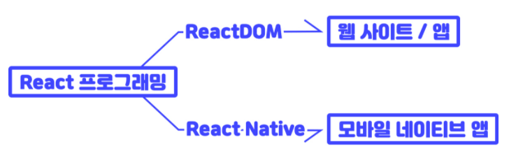
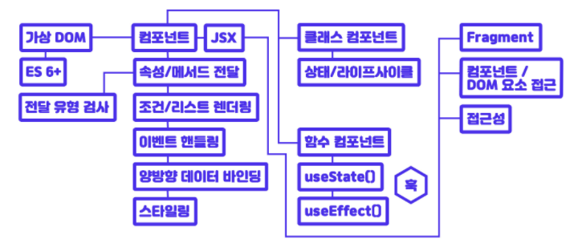

## REACT

<details open>
<summary>React 환경설정</summary>
<div markdown="2">

### React 소개

- React UI를 구현하는 라이브러리로 현시점에서 전 세계적으로 가장 관심도가 높고 웹 앱, 네이티브 모바일 앱(Android, iOS 등), 데스크톱 앱(electron) 등 다양한 플렛폼에서 앱을 제작하는 공통된 핵심 개발 방법을 제공한다.

- React-native: 모바일 앱
- ReactDOM: 웹 앱
- Electron: 데스크톱 앱
  <br />



### React 특징

1. 선언형(Declarative) 프로그래밍

- React는 상호작용이 많은 UI를 만들 때 생기는 어려움을 줄여준다.
- 애플리케이션의 각 상태에 대한 간단한 뷰만 설계하면 된다.
- 그럼 React는 데이터가 변경됨에 따라 적절한 컴포넌트만 효율적으로 갱신하고 렌더링한다.
- 선언형 뷰는 코드를 예측 가능하고 디버그하기 쉽게 만들어준다.

2. 컴포넌트(Component) 중심 개발

- 상태를 관리하는 캡슐화된 컴포넌트를 조합해 복잡한 UI를 만들 수 있다.
- 컴포넌트 로직은 탬플릿이 아닌 JS로 작성된다.
- 따라서 다양한 형식의 데이터를 앱 안에서 손쉽게 전달할 수 있고, DOM과는 별개로 상태를 관리할 수 있다.

3. 한 번 배워 어디서나 사용(Learn Once, Write Anywhere)

- 기술 스택의 나머지 부분에는 관여하지 않기 때문에, 기존 코드를 다시 작성하지 않고도 React의 새로운 기능을 이용해 개발할 수 있다.
- React는 Node 서버에서 렌더링을 할 수도 있고, React Native를 이용하면 모바일 앱도 만들 수 있다.

#### 명령형 프로그래밍 vs 선언형 프로그래밍

- 명령형 프로그래밍: 무엇을 어떻게 할 것인가(HOW)
- ex) 12번 테이블 자리가 비어있습니다. 나와 우리 가족은 저 자리로 걸어가 앉을 것입니다.
- 선언형 프로그래밍: 무엇을 할 것인가(WHAT)
- ex) 4명 앉을 자리 부탁해요.

### React 러닝 다이어그램

- React를 사용하기 위해 학습해야 할 개념(Concepts)을 그린 다이어그램이다.
  <br />



### React의 탄생

- Facebook 소프트웨어 엔지니어 Jordan Walke에 의해 탄생한 React는 2013년 5월에 열린 JSConf US에서 오픈 소스화 되었다.
- React는 UI 제작을 위한 JS 라이브러리이다.
- React의 특징은 선언형 컴포넌트, 양방향 데이터 바인딩 없음, XML 구문 포함 등이 있다.
- React 컴포넌트 작성을 손쉽게 하는 XML 구문이 바로 JSX이다.
- JSX는 Syntactic sugar로 컴포넌트에 속성 전달이 가능하다.
- React 업데이트의 핵심은 재조정(Reconciliation) 비교 알고리즘이다.
- 즉, 가상돔과 실제 돔을 비교해서 바뀐 것이 있을 때만, 업데이트 한다.
  <br />


- Virtual DOM → Render to DOM

#### 데이터 바인딩(Data binding)

- 양방향 데이터 바인딩과 단방향 데이터 바인딩의 차이는 HTML에서 변경된 내용이 데이터 영향을 미치는가이다.
- 예를 들어 양방향 데이터 바인딩의 대표인 AngularJS는 엘리먼트에 데이터를 바이딩하면 JS코드로 데이터를 변경할 수 있고, 엘리먼
- 트의 값(input)을 수정해서 데이터를 변경할 수 있다.
- 하지만 React 같은 단방향 데이터 바인딩은 JS → HTML로 데이터 바인딩만 가능하다.
- 즉, HTML에 바인딩한 데이터를 JS에서 수정할 경우 화면에는 반영이 되지만, 화면에서 직접 엘리먼트의 값을 바꿨을 때 JS의 데이터가 수정되도록 바인딩하는 방법은 제공되지 않는다.
- 단방향 데이터 바인딩이 불편해보일 수는 있지만, 그만큼 JS 코드가 데이터에 집중되며 일관된 데이터 관리로직을 갖는다는 점에서 장점이 있다.

### React API

- 웹 브라우저 환경에서 React를 사용하기 위해 React 라이브러리를 호출한다.

```html
<!-- 개발 버전 -->
<script src="//unpkg.com/react/umd/react.development.js"></script>
```

```html
<!-- 배포 버전 -->
<script src="//unpkg.com/react/umd/react.production.min.js"></script>
```

```jsx
const iconElement = React.createElement('img', {
  src: '/assets/icons/spinner.svg',
  alt: '',
  height: 12,
  key: 'dlkfjlkasjdfl',
});

// button element
const buttonElement = React.createElement(
  // element type
  'button',
  // props
  {
    type: 'button',
    className: 'button',
    // disabled: true,
    // children: ['업로드 중', iconElement],
  },
  // children
  '업로드 중',
  iconElement
);
```

### ReactDOM API

- 웹 브라우저 환경에서 ReactDOM을 사용하기 위해 ReactDOM 라이브러리를 호출한다.

```html
<!-- 개발 버전 -->
<script src="//unpkg.com/react-dom/umd/react-dom.development.js"></script>
```

```html
<!-- 배포 버전 -->
<script src="//unpkg.com/react-dom/umd/react-dom.production.min.js"></script>
```

```jsx
const rootNode = document.getElementById('root');
ReactDOM.render(buttonElement, rootNode);
```

### React 앱(빌드 환경)

- Webpack 모듈 번들러, Babel 컴파일러를 로더로 설정하는 간단한 개발 환경을 구성한 후, React, React DOM 패키지를 설치해 React 앱을 렌더링하는 실습

#### Webpack 빌드 시스템 구성

- webpack, webpack-cli, webpack-dev-server 패키지를 설치한 후, Webpack 개발 구성 파일을 작성해 entry, output, mode, devtool, devServer 등을 설정해 개발 서버를 구성하자.

```javascript
npm i –D webpack webpack-cli webpack-dev-server
```

| 설정      | 설명                  | 비고                          |
| --------- | --------------------- | ----------------------------- |
| entry     | 진입(입력) 파일 설정  | main                          |
| output    | 출력 파일 설정        | path, filename, publicPath    |
| mode      | 개발 / 배포 모드 설정 | development, production       |
| devtool   | 소스 매핑 스타일 설정 | eval                          |
| devServer | 개발 서버 설정        | contentBase, index, port, hot |

#### React, ReactDOM 패키지 설치

- react, react-dom 패키지를 설치(`--save` 버전 설치)
- react는 개발용이 아니므로 –D를 안붙임

```javascript
npm i react react-dom
```

- 프로젝트 엔트리 파일에 React, ReactDOM API 코드를 추가해 앱 UI를 렌더링한다.

```jsx
import { createElement as h } from 'react';
import { render } from 'react-dom';
// React 요소 생성
const uploadButton = h(/* ... */);
// ReactDOM 렌더링
render(uploadButton, document.getElementById('domNode'));
```

#### 브라우저리스트(browserslist)

- 브라우저를 선택하는 옵션기능만 따로 뽑아 놓은 도구이다.

```javascript
// .browserslistrc
// 한국에서 점유율 1%이상의 브라우저만 지원
> 1% in KR
// 지원이 중단되지 않은 브라우저만 지원
not dead
// IE 11 미만은 지원X
not ie < 11
```

#### Babel 로더 구성(옵션)

- babel-loader, @babel/core, @babel/preset-env 패키지를 설치한 후 Webpack 로더를 구성한다.

```javascript
npm i –D babel-loader @babel/core @babel/preset-env
```

</div> 
</details>

---
