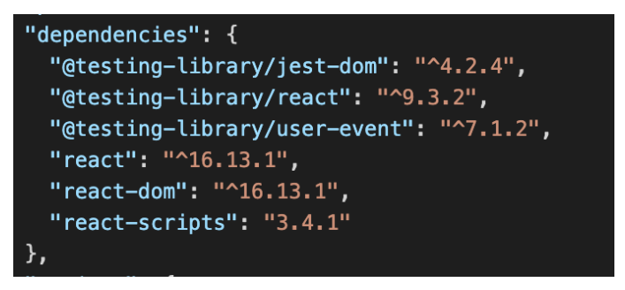
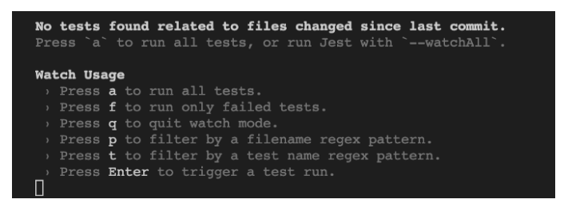
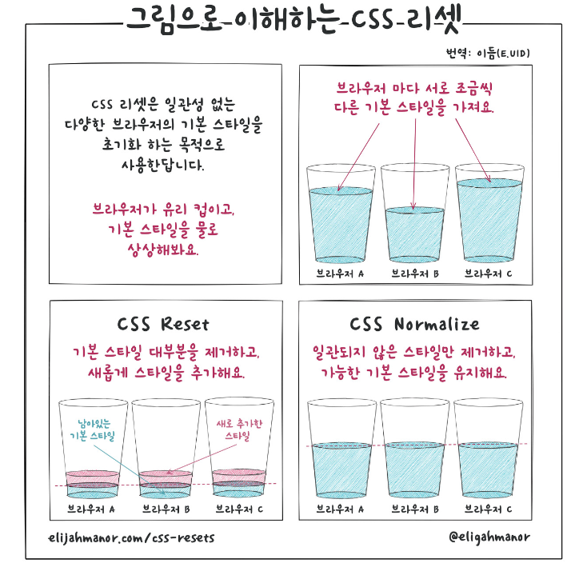
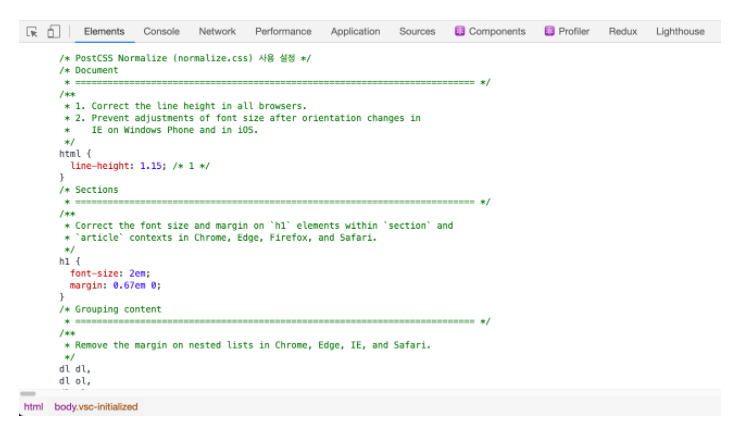
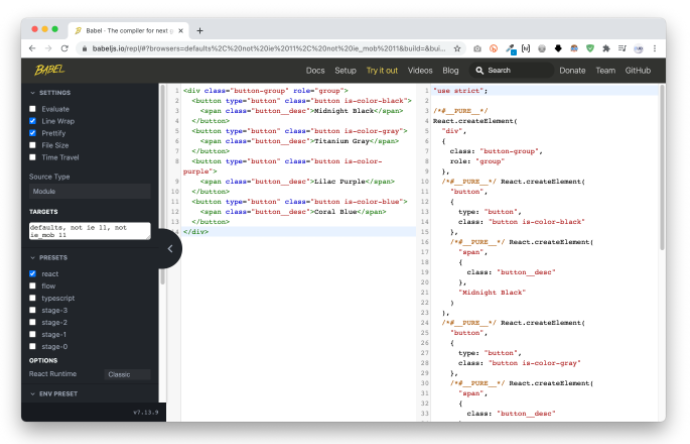

## REACT

<details open>
<summary>React Create React App 환경설정 및 JSX 문법</summary>
<div markdown="3">

### React 프로젝트 생성

- 복잡한 빌드 시스템 구성없이 손쉽게 시작하기

#### React 프로젝트 생성

```javascript
// npm 명령
$ mkdir <프로젝트 이름> && cd $_
$ npm init react-app .
```

```javascript
$ npm init react-app <프로젝트 이름>
```

```javascript
// npx 명령
npx create-react-app <프로젝트 이름>
```

#### npm(node package module)

- Node.js의 의존성과 패키지 관리를 위한 패키지 매니저이다.
- 우리 프로젝트에 누군가 패키지 의존성을 설치하고, `npm install`을 실행함으로써 `package.json`파일에 의존성(package)을 지정할 수 있다는 것을 말한다.
- `버전관리`를 지원한다.
- 우리 프로젝트가 어떤 버전의 의존성을 사용할지 지정할 수 있다.
- 예를 들어, 대부분의 경우에 패키지의 업데이트로 인하여 프로젝트가 오작동하는 경우를 방지할 수 있고, 그 외에도 우리가 원하는 버전의 패키지 의존성을 설치할 수 있다.

#### npx

- Node 패키지를 실행하는 하나의 도구이고, npm5.2 버전부터 함께 딸려있다.
- npx는 기본적으로 실행되어야할 패키지가 경로에 있는지 먼저 확인한다.
- 경로에 제대로 있다면, 그대로 실행한다.
- 그렇지 않다면 패키지는 설치되어 있지 않다는 것을 의미하고, npx가 최신 버전의 패키지를 설치한 후에 실행한다.
- 위에 설명한 행동들은 npx의 기본 설정 중 하나이고, 실행을 방지할 수 있는 명령어도 가지고 있다.
- 예를 들어, 만약 우리가 `npx <패키지 이름> --no-install`을 실행하면 이것은 npx에게 패키지가 기존에 설치되지 않았더라도 `설치하지 않고 오직 실행만` 시켜달라는 의미이다.

- 예를 들어, 우리가 실행하고자 하는 `my-package`라는 패키지가 있다고 해보자.
- 아마 npx가 없다면 우리는 패키지를 실행하기 위해 로컬 경로에서 다음과 같이 실행해야 한다.

```javascript
./node_modules/.bin/my-package
```

- 아니면 `package.json` 파일의 scripts 부분에 각각의 스크립트로 정의할 수도 있다.

```javascript
{
  "name": "머시기",
  "version": "1.0.0",
  "scripts": {
    "my-package": "./node_modules/.bin/my-package"
  }
}
```

- 그리고 `npm run my-package`로 실행하는 것이다.
- 이제 우리는 `npx`로 더 쉽게 할 수 있다.
- `npx my-package` 명령만으로 말이다.

#### Create React App에서 제공하는 기본 명령

| 명령어          | 설명                                                                       |
| --------------- | -------------------------------------------------------------------------- |
| `npm start`     | React 프로젝트 개발 서버를 시작한다.                                       |
| `npm run build` | 배포를 위해 앱을 정적(Static) 파일로 번들(Bundle) 한다.                    |
| `npm run test`  | 테스트 러너(Test Runner)를 시작한다.                                       |
| `npm run eject` | 사용자 정의 구성(예: Webpack)을 직접 수행할 수 있도록 프로젝트를 준비한다. |

```javascript
// 프로덕션으로 빌드(배포용)
$ npm run build
// 빌드된 서버를 볼 수 있다.
$ npx serve –s build
```

- eject는 해당 프로젝트에 걸러서 숨겨져 있는 모든 설정을 밖으로 추출해주는 명령이다.
- npm run eject 명령을 하면 webpack 압축 폴더를 푼다고 생각하자.
- 따라서 webpack에 대한 파일을 가져와서 커스터마이징 할 수 있다.

#### TDD(테스트 주도 개발) 개발

- React Testing Library는 Jest를 기반으로 UI 테스트를 지원해주는 DOM Testing Library에 React Component를 위한 API들이 추가된 것이다.
- `getBy*` 등의 query를 통해 요소를 찾고 이벤트를 발생(`fireEvent`)시키고 `expect` function을 통해 예측한 결과대로 이루어지는지 확인한다.
- CRA를 사용할 경우 환경구축은 이미 다 되어있다.
  <br />



```javascript
$ npm run test
```

- 명령어를 곧바로 실행할 수 있다.
  <br />



- p > app
- 테스트 성공 여부가 뜬다.

```javascript
test('renders learn react link', () => {
  const { getByText } = render(<App />);
  const linkElement = getByText(/learn react/i);
  expect(linkElement).toBeInTheDocument();
});
```

- App 컴포넌트를 render 하고, `getByText`로 ‘learn react’ 라는 텍스트를 가지고 있는 dom element를 찾은 후, 해당 요소가 document에 존재하는지를 테스트한다.

#### 프로젝트 디렉토리 구조

```javascript
 .
├── README.md
├── node_modules/ # 개발 의존 모듈 집합 디렉토리
├── package.json
├── public/ # 정적 리소스 디렉토리
│   ├── favicon.ico
│   ├── index.html # 애플리케이션 기본 템플릿
│   └── manifest.json
├── src/ # React 애플리케이션 개발 디렉토리
│   ├── App.css
│   ├── App.js # 애플리케이션 파일
│   ├── App.test.js
│   ├── index.css
│   ├── index.js # 엔트리 파일
│   ├── logo.svg
│   └── reportWebVitals.js
└── yarn.lock
```

#### 정적 파일

- 이미 만들어진 HTML 페이지
- 사용자(클라이언트)의 행동, 입력 등에 영향을 받지 않는(의존하지 않는) 자원

#### 동적 파일

- 클라이언트 요청에 페이지가 변함
- 예: 게시판, 방명록, 웹 게임 등

#### 프로젝트 핵심 파일

- React 프로젝트를 구성하는 파일 중 중요한 몇 가지 파일을 살펴보자.
- **public/index.html**

```javascript
<!DOCTYPE html>
<!-- en 값을 ko-KR로 변경 -->
<html lang="ko-KR">
  <head>
    <meta charset="utf-8" />
    <title>Create React App 활용</title>
    <!-- 웹 폰트 호출 -->
    <link
      rel="stylesheet"
      href="//spoqa.github.io/spoqa-han-sans/css/SpoqaHanSansNeo.css"
    />
    <meta name="viewport" content="width=device-width, initial-scale=1" />
    <meta name="theme-color" content="#000000" />
    <meta
      name="description"
      content="Create React App 도구를 사용해 React 앱을 개발하는 학습을 진행합니다."
    />
    <!-- %UPPERCASE% => .env 파일에 등록된 환경 변수, HTML 문서에서 환경변수 사용법 -->
    <link rel="icon" href="%PUBLIC_URL%/assets/favicon.ico" />
    <link rel="apple-touch-icon" href="%PUBLIC_URL%/assets/logo192.png" />
    <!-- manifest.json은 웹 앱을 사용자의 모바일 장치 또는 데스크톱에 설치할 때 사용되는 메타 데이터를 제공한다.
    예를 들어, 배경색은 어떠한 색인지, 앱의 이름은 무엇인지, 홈스크린 화면에 추가할 때 아이콘은 어떤 것인지 등의 정보를 담고 있다. -->
    <link rel="manifest" href="%PUBLIC_URL%/manifest.json" />
    <!-- 위의 태그에서 %PUBLIC_URL%을 사용한다. %PUBLIC_URL%은 빌드하는 동안 `public`
    폴더의 URL로 대체된다. public 폴더안에 있는 파일들만 HTML에서 참조할 수
    있다. -->

    <!-- "/favicon.ico" 또는 "favicon.ico"와 달리, "%PUBLIC_URL/favicon.ico%"는
    클라이언트 사이드 라우팅(CSR)과 non-root public URL에서 문제없이 작동한다.
    `yarn build` 명령을 실행하면 non-root public URL애 대해 알 수 있을 것이다. -->
  </head>
  <body>
    <!-- noscript 태그는 사용자의 브라우저가 스크립트의 사용을 비활성화하였거나,
    스크립트를 지원하지 않는 경우 화면에 표시될 것이다. -->
    <noscript
      >이 앱을 실행하려면 JavaScript가 사용가능한 환경이어야 합니다.</noscript
    >
    <div id="root"></div>
    <!-- 이 HTML 파일은 템플릿이다.
    브라우저에서 직접 열면 빈 페이지가 나타난다.

    이 파일에 웹 폰트, 메타 태그 또는 Google 애널리스틱(통계, 분석)을 추가할 수 있다.
    빌드 단계에서 번들된 스크립트는 <body> 태그 내부에 삽입된다.

    개발을 시작하려면 `npm start` 또는 `yarn start`를 실행한다.
    배포를 위한 번들 파일을 생성하려면 `npm run build` 또는 `yarn build`를 실행한다.

    탬플릿은 추가되거나 복사될 수 있는 HTML 요소들을 정의할 때 사용한다.
    템플릿 요소 내의 콘텐츠는 페이지가 로드될 때 즉시 렌더링되지 않으며, 따라서
    사용자에게는 보이지 않는다. 하지만 나중에 자바스크립트를 사용하여, 해당 콘텐츠를 복제한 후
    보이도록 렌더링할 수 있다. -->
  </body>
</html>
```

- **src/index.js**

```javascript
// React 모듈 로드
import React from 'react';
// ReactDOM 모듈 로드
import ReactDOM from 'react-dom';
// 메인(인덱스) 스타일 로드
import './index.css';
// 앱 컴포넌트 로드
import App from './App';
// ReactDOM 모듈의 렌더 함수를 사용해 #root (src/index.html) 요소
// 내부에 동적으로 App 컴포넌트(React Element)를 렌더링 합니다.
ReactDOM.render(<App />, document.getElementById('root'));
```

- **src/App.js**

```javascript
// React 모듈 로드
import React from 'react';
// 로고 이미지 로드
import logo from './logo.svg';
// App 스타일 로드
import './App.css';
// 함수형 컴포넌트(Functional Component)
function App() {
  // JSX(JavaScript 문법 확장) 반환
  return (
    <div className="App">
      // class 속성 대신 className을 사용
      <header className="App-header">
        // 데이터(상태, state)를 템플릿에 바인딩 할 때는 {}를 사용 // Empty
        Element의 경우 반드시 태그를 닫아야 함 (예: <br />)
        
        <p>
          <code>src/App.js</code> 파일을 수정하고, 저장하면 리로드 됩니다.
        </p>
        <a
          className="App-link"
          href="https://reactjs.org"
          target="_blank"
          rel="noopener noreferrer"
        >
          React 배우기
        </a>
      </header>
    </div>
  );
} // App 컴포넌트 모듈 내보내기
export default App;
```

### 브라우저 호환성

- IE 호환
- React 앱은 Chrome, Firefox, Edge, Safari 등 최신브라우저에서는 문제없이 동작하지만, IE 브라우저에서는 제대로 동작하지 않는다.
- IE 브라우저는 다음의 기술을 지원하지 않기 때문이다.
  | 기술 | 버전 |
  | ---------------------------------- | ------------------------ |
  | Async/ Await 또는 Promise | ECMAScript 2017 (ES8) |
  | Object Rest/Spread Properties | ECMAScript 2018 (ES9) |
  | Dynamic import() | stage 4 proposal |
  | Class Fields and Static Properties | part of stage 3 proposal |
  | Fetch API | Living Standard |

#### 폴리필 설치

- 이 패키지는 오래된 브라우저에서 React 앱을 구동하기 위한 폴리필이 포함되어 있다.
- Create React App에서 사용하는 최소 요구 사항과 일반적으로 사용되는 언어 기능이 포함된다.

```javascript
npm I react-app-polyfill
```

#### IE 지원

- 최소 언어 기능 지원
- Create React App이 정상적으로 작동하기 위해 필요한 최소 언어 기능이 있는지 확인하기 위해 지원하려는 최소 버전의 엔트리 파일을 가져올 수 있다.
- 이러한 모듈은 다음의 언어 기능이 호환되는지 검사 확인한다.

1. window.fetch
2. Promise(async, await)
3. Object.assign() (객체 전개 연산)
4. Array.from (배열 전개 연산)
5. Symbol

**IE9**

```javascript
// `src/index.js` 파일의 첫 번째 라인에 반드시 작성!
import 'react-app-polyfill/ie9';
```

**IE11**

```javascript
// `src/index.js` 파일의 첫 번째 라인에 반드시 작성!
import 'react-app-polyfill/ie11';
```

**추가 언어 기능 지원**

- 사용자가 접속한 브라우저에서 호환되지 않는 언어의 기능을 안정적으로 폴리필 할 수 있다.
- Create React App에서 이것을 사용할 경우, stable 폴리필을 자동으로 가져올 때 browserslist 목록 항목을 확인하여 브라우저에 필요한 폴리필만 포함하도록 설정한다.
- 또한, 최소 언어 기능 외에 추가적인 기능을 지원한다.

```javascript
// `src/index.js` 파일의 첫 번째 라인에 반드시 작성!
import 'react-app-polyfill/stable';
```

- 앱에서 IE를 지원해야 한다면 IE 최소 지원도 함께 제공해야 한다.

```javascript
// `src/index.js` 파일의 첫번째 라인에 반드시 작성!
import 'react-app-polyfill/ie9';
import 'react-app-polyfill/stable';
```

### public 디렉토리

- 공용(정적) 디렉토리 관리
- `public` 디렉토리는 정적(static) 에셋을 관리할 때 사용한다.
- 일반적으로 `src` 디렉토리에서 에셋을 사용하는 것이 권장된다.
- `src`에서 에셋을 관리할 때 유용한 경우이다.

1. 스타일, 스크립트가 축소, 번들되어 네트워크 요청 횟수를 줄일 수 있다.
2. 누락된 스타일, 스크립트 파일이 있으면, 404 오류 또는 컴파일 오류를 발생시킨다.
3. 출력 파일 이름에 콘텐츠 해시가 포함되어 브라우저에서 이전 버전을 캐싱하는 것을 방지할 수 있다.

- 하지만 외부 CSS, JS 웹용 라이브러리는 개발 과정 중에 직접 수정할 일이 없으므로 정적 에셋으로 처리하는 것이 더욱 효율적이다.
- `public 디렉토리 내부 파일은 Webpack에 의해 관리되지 않는다.`
- `빌드 과정에서 그대로 build 디렉토리에 복사될 뿐이다.`

```javascript
public/
├── assets/
│   ├── favicon.png
│   ├── logo192.png
│   ├── logo512.png
│   └── og-image.jpg
├── index.html
├── manifest.json
└── robots.txt
```

- robots.txt 파일: 검색 로봇에게 사이트 및 웹 페이지를 수집할 수 있도록 허용하거나 제한하는 국제 권고안이다.
- robots.txt 파일은 항상 사이트의 루트 디렉토리에 위치해야 하며 로봇 배제 표준을 따르는 일반 텍스트 파일로 작성해야 한다.

- public 디렉토리의 에셋을 src 디렉토리 내부 파일에서 참조하려면 환경변수를 사용한다.

```javascript
// public 디렉토리의 에셋 가져오기 유틸리티
function getPublicAsset(path) {
  return `${process.env.PUBLIC_URL}/${path}`;
}
function HomeLink(props) {
  // 유틸리티 활용
  return (
    <h1 className="homeLink">
      <a href={getPublicAsset('')}>
        
        {props.children}
      </a>
    </h1>
  );
}
```

- 정적 HTML에서 `public` 에셋에 접근하려면 `%PUBLIC_URL%`을 사용한다.
- `src` 또는 `node_modules` 디렉토리 파일을 정적 에셋으로 사용하고자 한다면 파일을 복사해 public 디렉토리에 붙여넣기 한다.

```html
<link rel="icon" href="%PUBLIC_URL%/assets/favicon.png" />
```

- `public` 디렉토리는 일반적으로 사용이 권장되지 않지만, 다음의 경우 해결방법으로 유용하다.

1. 빌드 출력 시, 특정 이름을 가진 파일이 필요한 경우: `manifest.webmanifest`
2. 수많은 이미지를 사용해야 하며, 해당 경로를 동적으로 참조해야 하는 경우
3. pace 라이브러리와 같이 크기가 작은 스크립트를 포함하려고 하는 경우
4. Webpack과 호환되지 않아 `<script>`로 포함해야만 하는 경우

- public 디렉토리 에셋을 사용하는 방식은 다음의 단점을 가지므로 사용 시 유의해야 한다.

1. `public` 디렉토리 내부 파일은 압축, 번들링 되지 않는다.
2. 누락된 파일이 있을경우, 컴파일 과정에서 호출되지 않으며 404 오류를 발생시킨다.
3. 출력 파일 이름에 콘텐츠 해시가 포함되지 않아, 브라우저에서 이전 버전을 캐싱하므로 파일이 변경될 때마다 파일 이름을 변경해야 한다.

### CSS 노멀라이징

- 브라우저 기본 스타일 일반화
- CRA는 postcss-normalize를 사용해 CSS를 초기화한다.
- 아래 코드를 CSS 엔트리 파일에 추가한다.

```javascript
// styles/index.css
@import-normalize;
```

- 개발 서버를 구동하거나, 빌드하면 앱에 CSS 초기화 코드 normalize.css가 출력된다.
  <br />



<br />



- normalize.css 출력 설정
- CRA 구성의 browserslist 설정을 기준 삼아 normalize.css 출력 코드가 제어된다.
- 브라우저리스트에 있는 브라우저에 해당하는 CSS만 가져온다.

```javascript
// package.json
"browserslist": {
  "production": [
    ">1% in KR",
    "not dead",
    "not ie <= 10"
  ],
  "development": [
    "last 2 chrome version",
    "last 2 firefox version",
    "last 1 safari version"
  ]
}
```

### CSS 스타일 추가

- 웹 스타일 문서 => JS 파일에서 불러오기
- CRA 설정은 모든 에셋을 처리하기 위해 Webpack을 사용한다.
- Webpack은 JS 파일을 포함해 다양한 파일을 불러와 사용할 수 있도록 설정한다.
- JS 파일에서 CSS 파일을 불러오면 Webpack에 의해 처리된다.

```javascript
// Button.css
.button {
  padding: 20px;
}
```

```javascript
// Button.js
// Webpack에 Button.js 파일이 Button.css 파일을 사용한다고 알린다.
import './Button.css';
function Button(props) {
  return <button type="button" className="button" {...props} />;
}
```

- 개발 과정에서 JS에서 호출된 수많은 CSS 파일 코드는 빌드(배포) 과정에서 하나의 CSS 파일로 출력되어 정적 HTML 파일에 연결된다.
- 이러한 CSS 호출 방식이 React 앱 개발에 반드시 필요한 것은 아니지만, CSS의 BEM 표기 방법론을 JS 컴포넌트에서 손쉽게 활용할 수 있는 이점이 있다.

### 이미지, 폰트 파일 추가

- 이미지, 폰트 => JS 파일에서 불러오기
- Webpack을 사용하면 이미지, 글꼴과 같은 정적 에셋을 사용하는 방법이 CSS 스타일 추가와 유사하다.
- 이 방법은 번들에 해당 파일을 포함하도록 Webpack에 지시한다.

```javascript
import logoImagePath from './assets/images/logo.png';
console.log(logoImagePath); // /logo.23917j18.png, [name][contenthash].[ext]
export default function Logo() {
  return ;
}
```

#### 데이터 URIs

- CSS 가져오기와 달리 파일 가져오기는 문자열 값을 제공한다.
- 이 값은 코드에서 참조할 수 있는 경로(path) 문자열을 출력한다.
- 다만, 서버 요청 횟수를 줄이기 위해 10000바이트 미만 크기의 파일을 가져오면 경로 문자열 대신 데이터 URIs가 반환된다.
- 데이터 URIs 반환은 `bmp`, `gif`, `jpe?g`, `png` 확장자를 가진 파일에 적용됩니다.
- svg 파일은 알려진 문제(#1153)로 인해 데이터 URIs 대상에서 제외된다.
- 이미지, 폰트 파일 추가 방법을 사용하면 빌드 시, Webpack이 이미지를 빌드 폴더로 복사하고 올바른 경로를 제공한다.

- **Data URIs 설정 변경**
- 환경 변수로 IMAGE_INLINE_SIZE_LIMIT 값을 설정하면 다른 값을 사용할 수 있다.

```javascript
// .env
# 기본적으로 10,000바이트 보다 작은 이미지는 base64 데이터 URIs로 인코딩 되고
# CSS 또는 JS 빌드 출력 파일에 포함된다. 크기 제한(바이트)를 제어하려면
# 이 옵션을 설정한다. 0으로 설정하면 비활성화 된다.
IMAGE_INLINE_SIZE_LIMIT=12000
```

### JSX is React Element

- JSX는 React 요소와 동일
- **JSX(Javascript Syntax eXtension)란?**
- JSX는 XML과 유사한 구문확장으로 ECMAScript 표준과 관련이 없다.
- JSX는 React 앱 제작 과정에서 반드시 필요한 것은 아니지만, JS 추상 객체만으로 UI View를 구성하는 마크업을 구현하는 것은 매우 복잡하고 불편하므로 특별한 상황이 아닌 경우 JSX를 사용하는 것이 권장된다.
- JSX는 Babel JS 컴파일러에 의해 React 요소(Element)로 컴파일된다.

```javascript
// JSX → React 요소
<button type="button" className="button button__resolve">
  승인
</button>;
// ⬇ Babel 컴파일러에 의해 React 요소로 컴파일 됨
React.createElement(
  'button',
  {
    type: 'button',
    className: 'button button__resolve',
  },
  '승인'
);
```

- React 요소는 실제 DOM 요소가 아니라, DOM 요소를 추상화한 JS 객체이다.

```javascript{
  type: 'button',
  props: {
    type: 'button',
    className: 'button button__resolve',
    chlidren: ['승인']
  }
}
```

- **JSX는 필수?**
- JSX를 사용하지 않아도 React 앱을 구성하는데 아무런 문제가 되지 않는다.
- 다음과 같이 React 요소를 생성하고 조립하면 된다.
- 앞선 예제보다 다소 복잡한 DOM 구조를 React 요소로 생성한 코드이다.

```javascript
const containerElement = React.createElement(
  'div',
  {
    className: 'container',
  },
  React.createElement(
    'h1',
    {
      lang: 'en',
    },
    React.createElement(
      'abbr',
      {
        title: 'JavaScript eXtension',
      },
      'JSX'
    )
  )
);
```

- 물론 JSX를 사용하면 코드가 직관적이고, HTML 문법과 비슷해 읽기 쉽고 수정하기도 편하다.

```javascript
const containerElement = (
  <div className="container">
    <h1 lang="en">
      <abbr title="JavaScript eXtension">JSX</abbr>
    </h1>
  </div>
);
```

#### Babel REPL

- Babel REPL 서비스는 JSX 코드가 React API 코드로 어떻게 변경되는지 실시간으로 보여준다.
- 왼쪽 텍스트 필드에 JSX 코드를 입력하면, 오른쪽 텍스트 필드에 React API 코드로 변경되어 출력된다. (왼쪽 사이드바 react 체크)
  <br />



### JSX 문법

#### 콘텐츠 인터폴레이션(콘텐츠 보간법)

- JSX 코드의 `{}`는 JS 표현식의 연산된 결과값을 처리하여 콘텐츠를 인터폴레이션한다.

**문자 값(template literal 활용)**

- 문자값 연산 결과는 값을 반환하므로 사용 가능하다.

```javascript
<h1>{`${headline}(${abbrs.jsx})`}</h1>
```

**숫자 값**

- 숫자 연산 결과는 값을 반환하므로 사용 가능하다.

```javascript
<span>{number % 4}</span>
```

**함수(또는 메서드) 결과 값**

- 함수는 결과값을 반환하므로 사용 가능하다.

```javascript
<p>{formatCount()}</p>
```

#### 속성 인터폴레이션(속성 보간법)

- 동적으로 요소의 속성에 데이터를 인터폴레이션 할 경우, 큰 따옴표(`“”`) 대신 중괄호(`{}`)로 묶어 처리한다.

```javascript
<abbr title={abbrs.jsx}>{headline}</abbr>
```

**스타일 속성(인라인)**

- 스타일 코드는 JS 객체(`{}`) 표기를 사용해야 한다.

```javascript
<figure style={{ marginTop: '1rem', marginBottom: '0.8rem' }} />
```

- 다른 속성과 달리 style 속성은 왜 객체인가?
- JSX는 Babel 컴파일러에 의해 React 요소로 변환된다.
- React 요소는 가상 DOM 요소를 추상화한 객체로 다음과 같이 컴파일되어야 한다.
- 그러므로 style 속성은 객체를 사용해야 한다.

```javascript
// JSX -> React 요소(가상 DOM 노드)
{  type: 'figure',
  props: {
    style: {
      marginTop: '1rem',
      marginBottom: '0.8rem'
    }
  }
}
```

**스타일 속성(객체)**

- 스타일 코드를 설정한 객체를 변수에 분리하여 처리할 수도 있다.

```javascript
const figureStyles = {
  marginTop: '1rem',
  marginBottom: '0.8rem'
}
<figure style={figureStyles} />
```

**클래스 속성**

- `class` 키워드는 JS 예약 키워드로 사용할 수 없으므로, 대신 `className`을 사용해야 한다.

```javascript
<span className="badge badge-primary m-2" />
```

**클래스 속성(동적 처리)**

- 동적으로 CSS 클래스 이름을 변경해야 할 경우, 아래와 같이 `{}`을 사용해 처리한다.

```javascript
let badgeType = 'success' // 'success', 'warning', 'error', 'info'
<span className={`badge badge-${badgeType}`} />
```

#### 조건부 렌더링(조건 별 처리)

- JS 프로그래밍에서 조건 처리는 일반적으로 `if`, `switch` 문과 함께 사용한다.
- JSX 또한 JS 객체이므로, JS 프로그래밍이 가능하다.
- 아래 예시는 함수 실행 과정에 전달된 매개변수의 조건의 참, 거짓 유뮤에 따라 반환되는 React 요소가 달라진다.

```javascript
// if문 조건 처리
function conditionalRendering(content, isStrong = false) {
  if (isStrong) {
    return <strong>{content}</strong>;
  } else {
    return <p>{content}</p>;
  }
} // <p>조건부 렌더링</p>
const normalMessage = conditionalRendering('조건부 렌더링');
// <strong>조건부 렌더링</strong>
const strongMessage = conditionalRendering('조건부 렌더링', true);
```

```javascript
// switch문 조건처리
const switchRendering = (emotion) => {
  switch (emotion) {
    default:
    case '좋아요':
      return getEmotionFace('good.jpg', emotion);
    case '훈훈해요':
      return getEmotionFace('so-good.jpg', emotion);
    case '슬퍼요':
      return getEmotionFace('sad.jpg', emotion);
    case '화나요':
      return getEmotionFace('angry.jpg', emotion);
    case '후속기사원해요':
      return getEmotionFace('want.jpg', emotion);
  }
};
switchRendering('후속기사원해요');
```

**인라인 조건처리**

- 조건 처리는 React 요소의 속성에서도 사용할 수 있다.
- 예를 들어 3항식을 사용해 JSX 안에서 조건 처리 하거나,

```javascript
<abbr title={abbrs.jsx ? abbrs.jsx : null}>{headline}</abbr>
```

- 논리곱(`&&`, AND) / 합(`||`, OR) 연산자를 사용한 조건 처리도 가능하다.

```javascript
<abbr title={abbrs.jsx || null}>{headline}</abbr>
```

- 또는 함수를 활용해 조건 처리된 값을 JSX 안에 설정해 처리할 수 있다.
- 함수는 값을 반환하기 때문이다.

```javascript
function findAbbr(key) {
  if (key in abbrs) {
    return abbrs[key];
  } else {
    return null;
  }
}
const abbr = <abbr title={findAbbr('jsx')}>{headline}</abbr>;
```

- JS 식과 함수는 값을 반환하기 때문에 JSX 코드에서 사용할 수 있지만, 문은 값을 반환하지 않으므로 JSX 코드에서 사용할 수 없다. (if, switch, for, while 문 등)

</div> 
</details>

---
