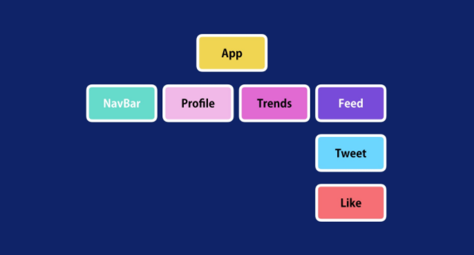
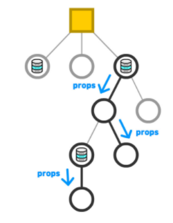

## REACT

<details open>
<summary>props</summary>
<div markdown="4">

#### 리스트 렌더링(배열 데이터 순환)

- 데이터 타입이 리스트(일반적으로 Array 객체를 말함)인 경우, 반복(Loop) 처리를 통해 JSX 코드를 동적으로 생성할 수 있다.
- 아래 예시는 Array 객체의 map 메서드를 사용해 배열을 순환 처리하여 React 요소를 만들어 낸 후, 컨테이너 역할의 React 요소의 자식 요소로 설정한다.

```javascript
const reactFamily = [
  { id: 'go1qhwkay', name: 'React' },
  { id: 'jdkw8wjbk', name: 'Redux' },
  { id: 'ekjkfdcj4o', name: 'React Router' },
];
const reactFamilyJSX = (
  <ul className="react-family">
    {reactFamily.map((member) => (
      <li className="react-family__member">{member.name}</li>
    ))}
  </ul>
);
```

- 코드를 실행하면 리스트의 각 아이템에 고유 키(key)를 넣어야 한다는 오류가 브라우저 Console 패널에 출력된다.
- 반복되는 아이템의 고유키로 특별한 문자값을 가진 속성 key로 설정해야 한다.

```javascript
<li key={member.id} className="react-family__member">
  {' '}
  {member.name}
</li>
```

- key는 React가 어떤 항목을 변경, 추가 혹은 삭제할지 식별하는 것을 돕는다. (안정적으로 식별하기 위함)

**조건에 따른 리스트 렌더링**

- 조건에 따라 리스트 렌더링을 수행하거나, 수행하지 않도록 프로그래밍할 수 있다.

```javascript
const reactFamily = [
  { id: 'go1qhwkay', name: 'React' },
  { id: 'jdkw8wjbk', name: 'Redux' },
  { id: 'ekjkfdcj4o', name: 'React Router' },
];
const ReactFamilyJSX =
  // 조건 식
  reactFamily.length > 0 ? (
    // 조건이 참인 경우
    <ul className="react-family">
      {reactFamily.map((member) => (
        <li className="react-family__member">{member.name}</li>
      ))}
    </ul>
  ) : (
    // 조건이 거짓인 경우
    <p>공부 할 React 패밀리가 없습니다.</p>
  );
```

- 함수를 사용해 코드를 묶어 재사용할 수 있도록 할 수 있고, 함수에서는 ‘식’ 대신 ‘문’을 사용해 결과값을 반환하도록 구성할 수도 있다.

```javascript
function renderReactFamily(items) {
  // 조건 문
  if (items.length > 0) {
    return (
      <ul className="react-family">
        {items.map((item) => (
          <li className="react-family__member">{item.name}</li>
        ))}
      </ul>
    );
  } else {
    return <p>공부할 React 패밀리가 없습니다.</p>;
  }
}
const ReactFamilyJSX = renderReactFamily(reactFamily);
```

#### 주의사항(JSX를 사용할 때 주의할 점)

**속성 이름은 camelCase로**

- JSX는 HTML이 아니다.
- XML 구문과 유사한 JS식이므로 React DOM은 HTML 표준 속성 이름 중 일부는 그대로 이름을 사용할 수 없다.
- JSX => React.createElement()로 트랜스파일링 된다.
- 예를 들어, JSX에서 `class`는 `className`으로, tabindex는 `tabIndex`로 사용해야 한다. (네이밍 패턴: 음절이 2개 이상인 경우 camelCase로 표기)

```javascript
<div className="container" tabIndex="-1">
  /* ... */
</div>
```

- 애플리케이션 접근성 향상을 위한 표준 기술 WAI-ARIA 속성 및 상태(aria-\*)는 HTML 표준 속성과 동일한 하이픈 케이스(hypen-case) 표기법을 사용한다.

```javascript
<div aria-label="키보드 컨트롤 도움말" role="group">
  /* ... */
</div>
```

**콘텐스가 없는 요소는 항상 닫아야!**

- JSX는 XML 문법에 따라 콘텐츠가 없는 빈 요소(empty element)는 반드시 닫아(`/>`) 줘야 한다.
- ex) `, <br />, <area />` 등

```javascript
<div className="empty-elements">
  
  <br />
  <map>
    {mapItems.map((item) => (
      <area
        key={item.key}
        shape={item.shape}
        coords={item.coords}
        href={item.href}
        title={item.title}
      />
    ))}
  </map>
</div>
```

**루트 요소는 하나만 사용!**

- JSX는 루트 요소를 하나만 가져야 한다.
- React.createElement()에서 첫 번째 인수는 하나의 요소만 들어가야 하기 때문이다.
- 두 개 이상의 요소를 가져와야 하는 경우, 래핑을 하거나 배열로 내보내자.
- 그러므로 다음과 같은 코드는 오류 처리된다.

```javascript
// 구문 해석 오류 발생!
const ButtonGroup = (
  <button type="button" className="button button__save">저장</button>
  <button type="button" className="button button__cancel">취소</button>
)
// Parsing error: Adjacent JSX elements must be wrapped in an enclosing tag.
Did you want a JSX fragment <>...</>?
```

- 오류가 알려준 대로 버튼 요소들을 묶는 하나의 루트 요소(예: `<div></div>`)를 추가하거나,

```javascript
const ButtonGroup = (
  <div className="button-group">
    <button type="button" className="button button__save">
      저장
    </button>
    <button type="button" className="button button__cancel">
      취소
    </button>
  </div>
);
```

- React Fragement 요소를 사용해 버튼 요소들을 래핑(Wrapping) 할 수 있다.

```javascript
import React from 'react';
const ButtonGroup = (
  <React.Fragment>
    <button type="button" className="button button__save">
      저장
    </button>
    <button type="button" className="button button__cancel">
      취소
    </button>
  </React.Fragment>
);
```

- `<React.Fragement>` 요소는 다음과 같이 `<></>` 별칭으로 대체해 사용할 수도 있다.

```javascript
import React from 'react';
const ButtonGroup = (
  <>
    <button type="button" className="button button__save">
      저장
    </button>
    <button type="button" className="button button__cancel">
      취소
    </button>
  </>
);
```

- `<div>` 요소와 달리 `<React.Fragement>` 요소는 실제 DOM에 그려지지 않는다.

#### Component & props(React 컴포넌트 전달 속성)

- React는 UI를 구성하는 라이브러리, 컴포넌트는 개별적인 JS 파일이다.
- 컴포넌트는 UI를 구성하는 조각(piece)에 해당되며, 독립적으로 분리되어 재사용됨을 목적으로 사용된다.
- React 앱에서 컴포넌트는 개별적인 JS 파일로 분리되어 관리한다.

```javascript
// React 컴포넌트 파일 예시
components/
├── Accordion.js
├── Container.js
├── Divider.js
├── DownLoadAndWatch.js
├── Dropdown.js
├── HomeLink.js
├── Info.js
├── Link.js
├── NetflixFAQ.js
├── NetflixIntro.js
├── OurStory.js
├── Promotion.js
├── Section.js
├── WatchOnDevice.js
└── WatchOnTV.js
```

**함수 컴포넌트**

- React 컴포넌트는 개념상 JS 함수와 유사하다.
- 컴포넌트 외부로부터 속성(`props`)을 전달받아 어떻게 UI를 구성할지 설정하여 React 요소(JSX를 Babel이 변환처리)로 반환한다.
- 전달받는 props는 객체이다.
- 이러한 문법 구문을 사용하는 컴포넌트를 React는 `함수 컴포넌트(function component)`로 분류한다.

```javascript
import React from 'react';
// React 함수(Functional) 컴포넌트
function Button(props) {
  // props 객체 → { type, act, children, ... }

  return (
    <button
      type={props.type || 'button'}
      className={`button button__${props.act}`}
    >
      {props.children}
    </button>
  );
} // 컴포넌트 내보내기
export default Button;
```

- `컴포넌트 네이밍 컨벤션`
- 컴포넌트 이름은 항상 대문자로 시작하는 TitleCase 문법 사용을 권장한다. (HTML 표준 요소와 구분)

```javascript
// React Component(JSX)
<Button>React 버튼 요소</Button>
```

```javascript
// HTML
<button type="button" class="button">
  HTML 버튼 요소
</button>
```

**클래스 컴포넌트**

- ES6부터 지원되는 클래스 문법을 사용해 컴포넌트를 정의할 수도 있다.
- React는 이러한 문법을 사용하는 컴포넌트를 `클래스 컴포넌트(class component)`라고 부른다.
- 클래스 문법을 사용하면 아래와 같이 작성할 수 있다.

```javascript
import React from 'react';
// React 클래스(class) 컴포넌트
class Button extends React.Component {
  // 생성자
  // constructor(props) {
  //  super(props)
  // }
  // 렌더 메서드
  render() {
    // this.props 객체 → { type, act, children, ... }
    const { type, act, children } = this.props;

    type = type ?? 'button';

    return (
      <button type={type} className={`button button__${act}`}>
        {chilren}
      </button>
    );
  }
} // 컴포넌트 내보내기
export default Button;
```

- React 세계관에서 함수형과 클래스 컴포넌트는 유사하지만, 클래스 컴포넌트의 경우 함수형 컴포넌트에 없는 기능을 추가적으로 사용할 수 있다는 점이 다르다.
- 하지만 React 훅의 등장(v16.8)으로 클래스 컴포넌트만 가지고 있던 기능을 함수 컴포넌트에서도 사용할 수 있게 되었다.

**컴포넌트 렌더링**

- 지금까지는 JSX를 사용해 React 요소를 생성했다.
- 하지만 JSX만으로는 "관리자", "로그아웃" React 요소를 생성만 할 수 있을 뿐, 유사한 코드를 비효율적으로 반복하게 된다.

```javascript
const adminButtonElement = (
  <button type="button" className="button button__admin">
    관리자
  </button>
);

const signOutButtonElement = (
  <button type="button" className="button button__signOut">
    로그아웃
  </button>
);
```

- 반면 컴포넌트를 사용하면 효율적으로 코드를 재사용 할 수 있다.

```javascript
const adminButtonElement = <Button act="admin">관리자</Button>;
const signOutButtonElement = <Button act="signOut">로그아웃</Button>;
```

- React 컴포넌트를 JSX 구문을 사용해 다른 컴포넌트 내부의 자식(children)으로 중첩(nested)하면 React 가상 DOM Tree 노드(Node)로 렌더링된다.

```javascript
import React from 'react';
import ReactDOM from 'react-dom';

// Button 컴포넌트 불러오기
import Button from './components/Button';

// App 함수 컴포넌트
const App = () => (
  <div className="app">
    <Button act="signOut">로그아웃</Button>
    <Button act="admin">관리자</Button>
  </div>
);

ReactDOM.render(<App />, document.getElementById('root'));
```

- 현재 작성된 컴포넌트 트리(React 가상 DOM Tree)를 그려보면 다음과 같은 구조를 가지게된다.

```javascript
App
├── Button
└── Button
```

**전달 속성(props)**

- React는 컴포넌트로부터 생성된 요소(JSX)를 발견하면 JSX 구문에 전달된 속성과 자식을 해당 컴포넌트에 `단일 객체`로 전달한다.
- 이 객체가 `props`이다.
- `JSX는 Babel 컴파일러에 의해 React.createElement()구문으로 변환된다.`

```javascript
const adminButtonElement = <Button act="admin">관리자</Button>;
const signOutButtonElement = <Button act="signOut">로그아웃</Button>;
```

```javascript
const adminButtonElement = React.createElement(
  // Button 컴포넌트 (함수 또는 클래스)
  Button,
  // props 객체
  {
    act: 'admin',
    children: ['관리자'],
  }
);

const signOutButtonElement = React.createElement(Button, {
  act: 'signOut',
  children: ['로그아웃'],
});
```

- JSX 구문으로부터 전달받은 속성객체 `props`는 컴포넌트 내부에 전달되어 렌더링 과정에 활용된다.

```javascript
import { Component } from 'react';

export default class Button extends Component {
  render() {
    // this.props 객체 → { type, act, children, ... }
    const { type, act, children } = this.props;

    type = type ?? 'button';

    return (
      <button type={type} className={`button button__${act}`}>
        {chilren}
      </button>
    );
  }
}
```

- `전달된 속성은 읽기 전용(readonly)`
- 컴포넌트에 전달된 속성 객체는 `읽기 전용`이다.
- 즉, 전달된 속성값을 컴포넌트에서 수정할 수 없다.
- 전달된 속성값은 수정할 수 없지만, 컴포넌트 자신의 상태(state)는 수정가능하다.

**컴포넌트 트리(Tree)**

- 포함된 컴포넌트는 `자식 컴포넌트`, 그리고 포함하는 컴포넌트는 `부모 컴포넌트`가 된다.

```javascript
<App>
  <NavBar />
  <Profile />
  <Trends />
  <Feed>
    <Tweet />
    <Like />
  </Feed>
</App>
```

<br />



**데이터 흐름**

- 컴포넌트가 상위(부모) 컴포넌트로부터 전달 받은 속성(props)은 공유된 "데이터"이다.
- React는 `단방향 데이터 흐름(one-way data flow)` 방식을 사용해 앱의 데이터를 공유하고, 데이터 흐름은 `하향식(Top Down 방식)`으로 흐른다.
  <br />



**컴포넌트 추출**

- 이미 작성된 컴포넌트 내부에서 컴포넌트를 사용할 수 있는 것이 보인다면 분리하는 것이 좋다.
- 컴포넌트 구조가 복잡한 경우, 요청사항에 따라 변경이 까다로울 수 있고 각 부품을 재사용하기도 어렵다.
- 이런 경우 컴포넌트를 작게 나눠 사용하는 용도로 구분해 개발하는 것이 좋다.

- `단일 책임 원칙(single responsibility principle)`
- 컴포넌트를 나눠 추출하는 것은 재사용 가능한 컴포넌트를 분리 관리 함에 따라 앱의 규모가 커질수록 개발에 드는 비용을 줄이고, 효율성을 높일 수 있다.
- 컴포넌트는 `한 가지의 작업만 하는 것이 이상적이다.`
- 컴포넌트는 `규모가 커진다면` 작은 서브 컴포넌트들로 `분리`되어야 한다.

- `컴포넌트 원칙(component principle)`
- 컴포넌트는 `배포할 수 있는 가장 작은 단위`를 말하며, 마치 벽돌들을 쌓아 방의 구조를 설계하는 것과 같다.
- 컴포넌트를 설계하는 원칙의 핵심은 `변하지 않는 것`과 `변하는 것들`로 쪼개고 서로가 `서로에게 미치는 영향이 크지 않도록 설계하는 것`이다.

##### 팁

- React 17버전 이상인 경우, import React from ‘react’를 쓰지 않아도 작동한다.
- auto-import: ctrl + space 누르면 자동으로 import문이 적용된다.
- 기본 CRA가 아닌 커스터마이징된 템플릿을 가져올 수 있다.

```javascript
$ npm create-react-app <프로젝트 이름> --template <템플릿 이름>
$ npx create-react-app my-project --template ko
```

</div> 
</details>

---
