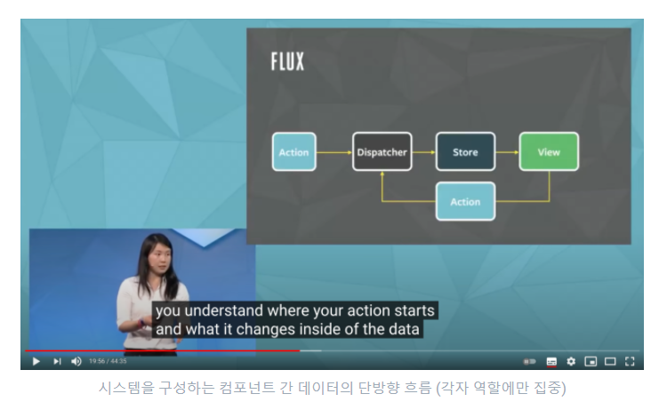
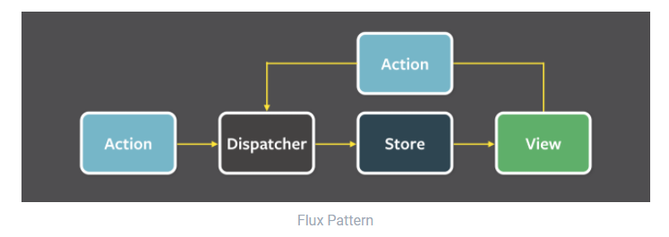
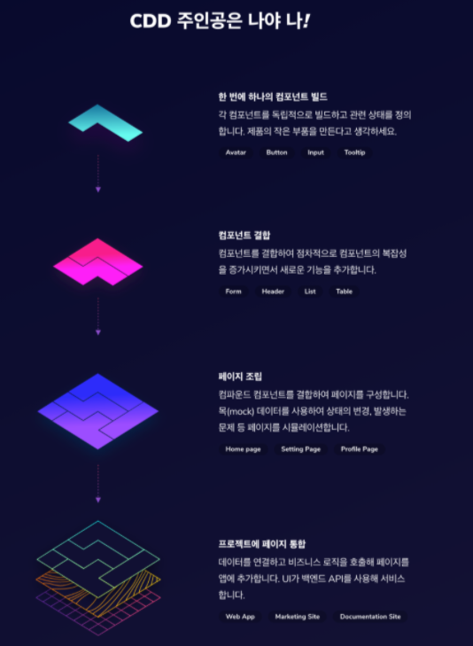

## REACT

<details open>
<summary>React defaultProps & propTypes</summary>
<div markdown="5">

### defaultProps & propTypes

- React 컴포넌트에 전달되는 속성(props) 타입(Types)을 검사하는 방법

#### 자바스크립트 타입 검사

- JS는 동적타입을 사용하는 프로그래밍 언어로 자유도가 높은 장점이 있지만, 데이터 타입이 잘못 전달될 경우 오류를 알려주지 않는다는 단점이 있다.
- JS가 런타임 중에 오류를 알려주지 않기 때문에, 함수를 제작할 때 전달 인자의 유효성 검사를 해야한다.
- 반복되는 유형검사는 불필요하므로 타입 검사 유틸리티 함수를 만들어 활용할 수 있다.

```javascript
// 데이터 타입 검사 유틸리티 함수
// 데이터 타입 검사 유틸리티 함수
function validType(dataType, typeString) {
  return (
    Object.prototype.toString.call(dataType).slice(8, -1).toLowerCase() ===
    typeString
  );
}

function calcTriangleCirc(x, y, z) {
  // 데이터 타입 검사
  if (
    !validType(x, 'number') ||
    !validType(y, 'number') ||
    !validType(z, 'number')
  ) {
    throw new Error('전달되는 인자의 유형은 오직 숫자(number)여야 합니다.');
  }
  return x + y + z;
}

// 전달 인자의 유형이 잘못된 경우, 오류 출력!
// 'Uncaught Error: 전달되는 인자의 유형은 오직 숫자(number)여야 합니다.'
calcTriangleCirc('10', '5', '8');
```

#### React 속성 타입 검사

- React 컴포넌트(함수 또는 클래스)는 `propTypes` 속성을 통해 컴포넌트에 전달된 속성을 검사할 수 있는 기능을 제공한다.
- 검사할 항목을 객체 맴버 메서드로 전달하면 속성 객체, 속성 이름, 컴포넌트 이름을 순서대로 전달받는다.
- 이를 활용하여 속성 검사를 수행한 뒤, 기대되는 속성과 일치하지 않는 경우 오류메세지를 출력하도록 설정할 수 있다.

```javascript
// React 컴포넌트 전달 속성 검사
EmotionCard.propTypes = {
  // 전달 속성 객체, 속성 이름, 컴포넌트 이름
  emotion(props, propName, componentName) {
    // 전달 속성 유형
    const propType = typeof props[propName];

    // 전달 속성 검사 (문자 값인지 확인)
    if (propType !== 'string') {
      // 문자 값이 아닌 경우 오류 발생
      return new Error(
        // 오류 메시지 출력
        `${componentName} 컴포넌트에 전달 된 속성 ${propName}의 데이터 유형은 
         String이 요구되나, 실제 전달된 속성 유형은 ${propType}이니 확인 바랍니다.`
      );
    }
  },
};
```

#### 커스텀 전달 속성 검사 모듈

- 컴포넌트에 전달 받는 속성 중 String 유형은 빈번하므로 재사용할 수 있도록 함수로 만들면 좋다.
- 다른 유형도 검사하는 함수를 만들어 사용하는 것이 효율적이다.
- 이런 경우 검사 함수를 묶어 관리 할 모듈(네임스페이스)을 만들어 관리하면 효과적이다.

```javascript
const PropTypes = {
  // String 유형 검사 함수
  string(props, propName, componentName) {
    const propType = typeof props[propName];
    if (propType !== 'string') {
      return new Error(
        `${componentName} 컴포넌트에 전달 된 속성 ${propName}의 데이터 유형은 String이 요구되나, 실제 전달된 속성 유형은 ${propType}이니 확인 바랍니다.`
      );
    }
  },
  // Array 유형 검사 함수
  array(props, propName, componentName) {
    const propValue = props[propName];
    const propType = Object.prototype.toString.call(propValue).slice(8, -1);
    if (!Array.isArray(propValue)) {
      return new Error(
        `${componentName} 컴포넌트에 전달 된 속성 ${propName}의 데이터 유형은 Array가 요구되나, 실제 전달된 속성 유형은 ${propType}이니 확인 바랍니다.`
      );
    }
  },
  // ...
};

export default PropTypes;
```

- PropTypes 모듈을 검사할 컴포넌트 속성에 연결

```javascript
import PropTypes from './PropTypes';

EmotionCard.propTypes = {
  emotion: PropTypes.string,
};
```

#### PropTypes 모듈

- React는 타입 검사를 위한 모듈을 제공한다.

```javascript
// 패키지 설치
$ npm i -D prop-types
```

- 컴포넌트에 전달되는 속성 검사를 위해 먼저 `prop-types` 모듈을 불러온다.
- 그리고 컴포넌트에 `propTypes` 속성을 추가한 후, 전달 속성 검사를 설정하는 객체를 할당한다.

```javascript
import React from 'react';

// PropTypes 모듈 불러오기
import PropTypes from 'prop-types';

class Worker extends React.Component {
  // Worker 컴포넌트에 전달된 속성 props 유효성 검사 설정
  static propTypes = {
    name: PropTypes.string.isRequired,
    career: PropTypes.number.isRequired,
    isLeave: PropTypes.bool,
  };

  render() {
    const { name, career, isLeave } = this.props;

    return (
      <div className="worker">
        <span classNme="worker-name">{name}</span>
        <span classNme="worker-career">{career}</span>
        <span classNme="worker-isLeave">{!isLeave || '재직'}</span>
        <button type="button">커리어 업</button>
      </div>
    );
  }
}

export default Worker;
```

- 컴포넌트 전달 속성을 검사하는데 사용된 PropTypes 모듈 함수는 다음과 같다.

| 설정             | 설명              |
| ---------------- | ----------------- |
| PropTypes.string | String 유형 검사  |
| PropTypes.number | Number 유형 검사  |
| PropTypes.bool   | Boolean 유형 검사 |

- `.isRequired`는 필수 전달 속성이 전달되지 않은 경우 오류를 출력한다.

- 함수 컴포넌트 또한 검사 방법은 동일하지만, 함수 객체의 속성으로 `propTypes`를 설정한다는 점이 `static` 멤버로 `propTypes`를 사용한 클래스 컴포넌트와 다소 다르다.(클래스는 함수 방법도 사용할 수 있다.)

```javascript
import React from 'react';
import PropTypes from 'prop-types';

const Worker = ({ name, career, onCareerUp, isLeave }) => (
  <div className="worker">
    <span classNme="worker-name">{name}</span>
    <span classNme="worker-career">{career}</span>
    <span classNme="worker-isLeave">{!isLeave || '재직'}</span>
    <button type="button">커리어 업</button>
  </div>
);

// 전달 속성 유효성 검사
Worker.propTypes = {
  name: PropTypes.string.isRequired,
  career: PropTypes.number.isRequired,
  isLeave: PropTypes.bool,
};

export default Worker;
```

#### PropTypes 검사 요약

- PropTypes를 통해 검사 가능한 타입은 아래 나열된 목록을 참고하자.

| 타입                                  | 검사 방법                           | 비고                                       |
| ------------------------------------- | ----------------------------------- | ------------------------------------------ |
| 모든 타입                             | PropTypes.any                       |                                            |
| Number 객체                           | PropTypes.number                    |                                            |
| String 객체                           | PropTypes.string                    |                                            |
| Boolean 객체                          | PropTypes.bool                      |                                            |
| Function 객체                         | PropTypes.func                      |                                            |
| Array 객체                            | PropTypes.array                     |                                            |
| Object 객체                           | PropTypes.object                    |                                            |
| Node 객체                             | PropTypes.node                      | 컴포넌트가 반환할 수 있는 모든 데이터 유형 |
| React 요소                            | PropTypes.element                   | React Element                              |
| React 컴포넌트                        | PropTypes.elementType               | React Component                            |
| 여러 타입 중 하나                     | PropTypes.oneOfType([TypeA, TypeB]) |                                            |
| 특정 클래스의 인스턴스                | PropTypes.instanceOf(Class)         |                                            |
| 전달 속성 값 제한                     | PropTypes.oneOf([value1, value2])   | 열거형(Enumerable)                         |
| 특정 타입 집합으로 제한               | PropTypes.arrayOf(valueType)        |                                            |
| 특정 타입을 속성값으로 하는 객체 제한 | PropTypes.objectOf(valueType)       |                                            |
| 특정 형태를 갖는 객체 제한            | PropTypes.shape({prop1, prop2})     | 인터페이스(Interface)                      |

- 규모가 큰 프로젝트에서의 속성 검사에서 PropTypes 모듈 사용은 적합하지 않다.
- `Flow` 또는 `TypeScript`를 사용할 것을 React 공식 문서는 권장한다.

#### 전달 속성 기본값

- `컴포넌트에 전달할 속성을 모두 필수로 만들 필요는 없다.`
- 사용자에 의해 커스터마이징 될 수 있지만, 그렇지 않을 경우 기본으로 사용(Default Props)되는 값을 설정할 수도 있다.
- JS와 React에서 각각 전달 속성 기본 값을 설정하는 방법을 살펴보자.

- JS 매개변수 기본값

```javascript
function greetingMessage(message = '안녕하세요') {
  return `${message} 여러분!`;
}

// 기본 값 사용
greetingMessage(); // '안녕하세요 여러분!'

// 사용자 정의
greetingMessage('Hello'); // 'Hello 여러분!'
```

- `React 전달 속성 기본값`
- 컴포넌트에 전달될 속성의 기본값을 설정하는 방법은 `defaultProps` 속성을 설정하는 것이다.

```javascript
import React, { Component } from 'react'


const Worker = ({ name, career, onCareerUp, isLeave }) => (
  // ...
)

// Worker 컴포넌트 전달 속성 기본 값 설정
Worker.defaultProps = {
  name: '야무',
  career: 21,
  onCareerUp: () => console.log('커리어 업!!'),
  isLeave: true,
}

export default Worker;
```

- `클래스 필드 활용`
- 클래스 컴포넌트는 표준 제안 중인 클래스 필드 문법을 사용해 전달 속성 검사를 하거나, 기본값을 설정할 수 있다.

```javascript
class Worker extends Component {
  // 전달 속성 검사
  static propTypes = {
    name: PropTypes.string.isRequired,
    career: PropTypes.number.isRequired,
    onCareerUp: PropTypes.func.isRequired,
    isLeave: PropTypes.bool.isRequired,
  };

  // 기본 값  설정
  static defaultProps = {
    name: '야무',
    career: 21,
    onCareerUp: () => console.log('커리어 업!!'),
    isLeave: true,
  };

  // ...
}
```

### React's One-way Data flow(단방향 데이터 흐름과 Flux 패턴)

- `웹 앱 개발에 대해 다시 생각하다.`
- Facebook은 전통적인 디자인 패턴인 MVC가 그들의 필요에 맞게 확장되지 않는다는 결론에 도달했고, 대신 `Flux 패턴을 도입` 사용 했음을 발표했다.
- 시스템의 복잡성은 코드를 "깨지기 쉽고 예측할 수 없게 만든다."
- 이 문제를 해결하려면 "예측 가능한 방식으로 코드를 구성" 해야함을 강조했다.

- 이러한 그들의 생각은 `Flux 아키텍처`, 그리고 React로 이어졌다.
- `Flux는 앱의 단방향 데이터 흐름을 촉진하는 시스템 아키텍처를 말한다.`
- `React는 Facebook이 웹 애플리케이션 개발에서 더 빠르게 작동할 수 있는 "예측 가능한", "선언적인" 웹 사용자 인터페이스를 구축하기 위한 JS 프레임워크이다.`
- Facebook은 시스템에 많은 모델과 뷰가 추가되면 복잡성이 폭발적으로 증가한다고 주장했다.
  <br />


<br />



- `Facebook의 Flux 아키텍처는 React 그리고 Redux의 데이터 흐름의 핵심이다.`
- 잘못된 MVC 패턴과의 비교에 초점을 두지 말고, React는 `하향식 단방향 데이터 흐름`에 따라 작동된다.

<br />



### Component Driven Development(CDD, 컴포넌트 중심 UI 개발 방법론)

- 컴포넌트 주도 개발은 컴포넌트를 모듈 단위로 개발하여 사용자 인터페이스(UI) 구축에 도달하는 개발 및 설계 방법론이다.
- 기본적인 컴포넌트 단위부터 시작하여 UI 뷰(view)를 구성하기 위해 점진적으로 결합(조립)해가는 `상향적(bottom-up)` 성향을 띈다.
- 이방법은 UI를 구축할 때 직면하게 되는 앱 규모의 복잡성을 해결한다.
- Storybook은 독립된 환경에서 UI를 개발할 수 있는 환경을 제공하므로 다음의 스토리(Story)를 구성하는데 활용할 수 있다.

1. `컴포넌트(components)`
2. `컨테이너(containers, 2개 이상 컴포넌트 조합)`
3. `페이지(pages, 2개 이상 컨테이너 조합)`

<br />



- 테스트 중심의 개발 방법론인 `테스트 주도 개발(TDD)`과는 사용 목적이 다르다.

#### CDD 장점

1. `품질(Quality)`

- 독립적으로 컴포넌트를 분리하여 관련 상태를 정의하여 UI가 다양한 시나리오에서 작동하는지 확인이 가능하다.

2. `내구성(Durability)`

- 컴포넌트 수준에서 테스트하여 세부 사항까지 정확하게 찾아낼 수 있다.
- 테스트 보다 작업량이 적다.

3. `속도(Speed)`

- 컴포넌트 라이브러리 또는 디자인 시스템의 컴포넌트를 재사용하여 UI를 보다 빠르게 조립할 수 있다.

4. `효율성(Effiency)`

- UI를 개별 컴포넌트로 분해 한 다음 서로 다른 팀 구성원 간에 공유하여 개발 및 디자인을 `병렬처리`한다.

#### CDD가 아닌 UI 개발

- 다음의 경우 CDD 방식의 UI가 아니다.

1. 페이지 기반

- 웹 사이트를 페이지 모음 정도로 취급하는 개발 및 디자인 프로세스
- 페이지에서 공통 요소를 재사용하기 위해 많은 노력을 기울이지 않는다.

2. 페이지용으로 설계된 도구

- Wordpress 도구 또는 Durpal은 문서를 화면에 렌더링 하는데 중점을 둔 도구이다.
- Rails, Django 및 PHP와 같은 백엔드 프레임워크는 UI 재사용을 사후 고려사항으로 간주하고 광범위한 컴포넌트 재사용을 방지한다.

#### 상호 보환 트랜드

- `디자인 시스템`
- 에셋(Figma, Sketch 등), 설계 원리, 컴포넌트 라이브러리를 포함하는 모든 UI 패턴 사용자 인터페이스 설계에 대한 전체적인 접근 방식이다.

- `애자일`
- 짧은 피드백 루프와 빠른 반복을 촉진하는 SW 개발방법이다.
- 컴포넌트는 미리 만들어진 빌딩 블록을 다시 사용하여 팀이 보다 빨리 구축하는 것을 도와준다.
- 이를 통해 애자일 팀은 사용자 요구사항에 더욱 더 집중할 수 있다.

- `JAMStack`
- 정적 파일을 사전 렌더링하고 CDN에서 직접 제공하는 웹 사이트를 구축하는 방법론이다.
- JAMStack 사이트 UI는 컴포넌트화 된 JS프레임워크에 의존한다.

#### 컴포넌트란?

- 상호 교환가능하고 표준화된 UI 구성요소이다.
- UI 조각의 모양, 기능을 캡슐화한다.
- 컴포넌트는 애플리케이션 비지니스 로직에서 상태를 분리하여 상호 교환을 가능하게 한다.
- 이렇게하면 복잡한 화면을 간단한 컴포넌트로 분해할 수 있다.
- 잘 정의된 API와 목(mock) 구성된 일련의 상태(정적)가 있다.
- 이를 통해 컴포넌트를 분리하고 재구성하여 다른 UI를 구축할 수 있다.

</div> 
</details>

---
