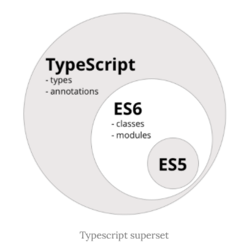
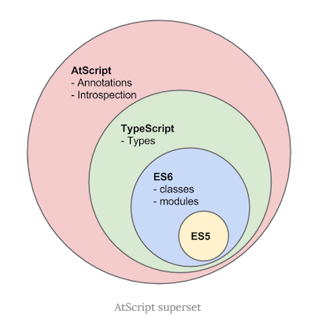

## TYPESCRIPT
<details open>
<summary>TypeScript의 소개와 개발환경 구축</summary>
<div markdown="1">

### 소개
- 자바스크립트의 태생적 문제를 극복하고자 CoffeeScript, Dart, Haxe와 같은 AltJS(자바스크립트의 대체언어)가 등장하였다.
- TypeScript 또한 자바스크립트 대체 언어의 하나로써 `자바스크립트(ES5)의 Superset(상위확장)`이다.
- C#의 창시자인 덴마크 출신 소프트웨어 엔지니어 Anders Hejlsberg(아네르스 하일스베르)가 개발을 주도한 TypeScript는 Microsoft에서 2012년 발표한 오픈소스로, 정적 타이핑을 지원하며 ES6(ECMAScript 2015)의 클래스, 모듈 등과 ES7의 Decorator 등을 지원한다.
<br />



- TypeScript는 ES5의 Superset이므로 기존의 자바스크립트(ES5) 문법을 그대로 사용할 수 있다.
- 또한, ES6의 새로운 기능들을 사용하기 위해 Babel과 같은 별도 트랜스파일러(Transpiler)를 사용하지 않아도 ES6의 새로운 기능을 기존의 자바스크립트 엔진(현재의 브라우저 또는 Node.js)에서 실행할 수 있다.

- 이후 ECMAScript의 업그레이드에 따른 새로운 기능을 지속적으로 추가할 예정이어서 매년 업그레이드될 ECMAScript 표준을 따라갈 수 있는 좋은 수단이 될 것이다.
<br />



- 또한, 구글은 2년간의 검토 끝에 2017년 사내 표준언어(Canonical Languages)로 Typescript의 사용을 승인하였다.
- 구글은 구글 애널리틱스, 파이어 베이스, 구글 클라우드 플랫폼 등 대규모 프로젝트의 버그와 추적, 채용 검토, 제품 승인 및 출시 도구와 같은 핵심적인 내부 도구에 TypeScript와 TypeScript 기반 Angular를 사용하고 있다.

### TypeScript의 장점
#### 정적타입
- TypeScript를 사용하는 가장 큰 이유 중 하나는 정적타입을 지원한다는 것이다.
```javascript
function sum(a, b) {
  return a + b;
}
```
- 위 함수는 아래와 같이 호출될 수 있다.
```javascript
function sum(a, b) {
  return a + b;
}

sum('x', 'y'); // 'xy'
```
- 이러한 상황이 발생한 이유는 변수나 반환값의 타입을 사전에 지정하지 않은 자바스크립트의 동적 타이핑(Dynamic Typing)에 의한 것이다.

- 위 함수를 TypeScript의 정적타입을 사용하여 다시 작성해보자.
```javascript
function sum(a: number, b: number) {
  return a + b;
}

sum('x', 'y');
// // error TS2345: Argument of type '"x"' is not assignable to parameter of type 'number'.
```
- TypeScript는 정적타입을 지원하므로 컴파일 단계에서 오류를 포착할 수 있는 장점이 있다.
- 명시적인 정적타입 지정은 개발자의 의도를 명확하게 코드로 기술할 수 있다.
- 이는 코드의 가독성을 높이고 예측할 수 있게 하며 디버깅을 쉽게 한다.

#### 도구의 지원
- TypeScript를 사용하는 이유는 여러 가지가 있지만 가장 큰 장점은 IDE(통합개발환경)를 포함한 다양한 도구의 지원을 받을 수 있다는 것이다.
- IDE와 같은 도구에 타입 정보를 제공함으로써 높은 수준의 인텔리센스, 코드 어시스트, 타입 체크, 리팩토링 등을 지원받을 수 있으며 이러한 도구의 지원은 대규모 프로젝트를 위한 필수 요소이기도 하다.

#### 강력한 객체지향 프로그래밍 지원
- 인터페이스, 제네릭 등과 같은 강력한 객체지향 프로그래밍 지원은 많고 복잡한 프로젝트 코드 기반을 쉽게 구성할 수 있도록 도우며, Java, C# 등의 클래스 기반 객체지향 언어에 익숙한 개발자가 자바스크립트 프로젝트를 수행하는데 진입 장벽을 낮추는 효과가 있다.

#### ES6/ES Next 지원
- 브라우저만 있으면 컴파일러 등의 개발환경 구축 없이 바로 사용할 수 있는 ES5와 비교할 때, 개발환경 구축 관점에서 다소 복잡해진 측면이 있지만, 현재 ES6를 완전히 지원하지 않고 있는 브라우저를 고려하고 Babel 등의 트랜스파일러를 사용해야 하는 현 상황에서 TypeScript 개발환경 구축에 드는 수고는 그다지 아깝지 않을 것이다.
- 또한, TypeScript는 아직 ECMAScript 표준에 포함되지는 않았지만, 표준화가 유력한 스펙의 유용한 기능을 안전하게 도입하기에 유리하다.

#### Angular
- 마지막으로 Angular는 TypeScript뿐만 아니라 자바스크립트(ES5, ES6), Dart로도 작성할 수 있지만, Angular 문서, 커뮤니티 활동에서 가장 많이 사용되고 있는 것이 TypeScript이다.
- Angular 관련 문서의 예제 등의 TypeScript로 작성된 것이 대부분이어서 관련 정보를 얻을 때 이점이 있으며 이러한 현상은 앞으로도 지속될 것으로 예상된다.

### 개발환경 구축 
- TypeScript 파일(.ts)은 브라우저에서 동작하지 않으므로 TypeScript 컴파일러를 이용해 자바스크립트 파일로 변환해야 한다.
- 이를 컴파일 또는 트랜스파일링이라 한다.

#### TypeScript 컴파일러 설치 및 사용법
- TypeScript를 전역에 설치
```javascript
$ npm install –g typescript
```

- TypeScript 설치 확인
```javascript
$ tsc -v
```

- TypeScript 컴파일러(tsc)는 TypeScript 파일(.ts)을 자바스크립트 파일로 트랜스파일링 한다.
- `컴파일은 일반적으로 소스 코드를 바이트 코드로 변환하는 작업을 의미한다.`
- TypeScript 컴파일러는 `TypeScript 파일을 자바스크립트 파일로 변환하므로 컴파일보다는 트랜스파일링(Transpiling)이 보다 적절한 표현이다.`

- person.ts 파일을 트랜스파일링 해보자.
```javascript
tsc person
```
- 트랜스파일링 실행 결과, 같은 디렉터리에 자바스크립트 파일(person.js)이 생성된다.
- 이때 트랜스파일링된 person.js의 자바스크립트 버전은 ES3이다.
- 이는 TypeScript 컴파일 타겟 자바스크립트 기본 버전이 ES3이기 때문이다.
- 만약, 자바스크립트 버전을 변경하려면 컴파일 옵션에 --target 또는 –t를 사용한다.
- 현재 tsc가 지원하는 자바스크립트 버전은 ES3(default), ES5, ES2015, ES2016, ES2017, ES2018, ES2018, ESNEXT이다.
- 예를 들어, ES6 버전으로 트랜스파일링을 실행하려면 아래와 같이 옵션을 추가한다.
```javascript
$ tsc person –t ES2015
```

- 트랜스파일링이 성공하여 자바스크립트 파일이 생성되었으면, Node.js REPL을 이용해 트랜스파일링된 person.js를 실행해보자.
```javascript
node person
```

- 매번 옵션을 지정하는 것은 번거로우므로 tsc 옵션 설정 파일을 생성하도록 하자.
```javascript
$ tsc --init
```

- tsc 옵션 설정 파일인 tsconfig.json이 생성된다.
- `tsc 명령어 뒤에 파일명을 지정하면 tsconfig.json이 무시되므로 주의하자.`
```javascript
$ tsc person // tsconfig.json이 무시된다.
```

- tsconfig.json을 적용하려면 아래와 같이 트랜스파일링하도록 한다.
```javascript
$ tsc
```
- 위와 같이 파일명을 지정하지 않으면 프로젝트 폴더 내의 모든 TypeScript 파일이 모두 트랜스파일링된다.
- --watch 또는 –w 옵션을 사용하면 트랜스파일링 대상 파일의 내용이 변경되었을 때 이를 감지하여 자동으로 트랜스파일링이 실행된다. 
```javascript
$ tsc --watch
```

- 또는 아래와 같이 tsconfig.json에 watch 옵션을 추가할 수도 있다.
```javascript
{
// ...
"watch": true
}
```

</div> 
</details>

---